**Introduction**

Apache Spark is an open-source engine for distributed data processing,
and is widely used to explore, process, and analyze huge volumes of data
in data lake storage. Spark is available as a processing option in many
data platform products, including Azure HDInsight, Azure Databricks,
Azure Synapse Analytics, and Microsoft Fabric. One of the benefits of
Spark is support for a wide range of programming languages, including
Java, Scala, Python, and SQL; making Spark a very flexible solution for
data processing workloads including data cleansing and manipulation,
statistical analysis and machine learning, and data analytics and
visualization.

Tables in a Microsoft Fabric lakehouse are based on the open
source *Delta Lake* format for Apache Spark. Delta Lake adds support for
relational semantics for both batch and streaming data operations, and
enables the creation of a Lakehouse architecture in which Apache Spark
can be used to process and query data in tables that are based on
underlying files in a data lake.

In Microsoft Fabric, Dataflows (Gen2) connect to various data sources
and perform transformations in Power Query Online. They can then be used
in Data Pipelines to ingest data into a lakehouse or other analytical
store, or to define a dataset for a Power BI report.

This lab is designed to introduce the different elements of Dataflows
(Gen2), and not create a complex solution that may exist in an
enterprise.

**Objectives**:

- Create a workspace in Microsoft Fabric with the Fabric trial enabled.

- Establish a lakehouse environment and upload data files for analysis.

- Generate a notebook for interactive data exploration and analysis.

- Load data into a dataframe for further processing and visualization.

- Apply transformations to the data using PySpark.

- Save and partition the transformed data for optimized querying.

- Create a table in the Spark metastore for structured data management

- Save DataFrame as a managed delta table named "salesorders."

- Save DataFrame as an external delta table named "external_salesorder"
  with a specified path.

- Describe and compare properties of managed and external tables.

- Execute SQL queries on tables for analysis and reporting.

- Visualize data using Python libraries such as matplotlib and seaborn.

- Establish a data lakehouse in the Data Engineering experience and
  ingest relevant data for subsequent analysis.

- Define a dataflow for extracting, transforming, and loading data into
  the lakehouse.

- Configure data destinations within Power Query to store the
  transformed data in the lakehouse.

- Incorporate the dataflow into a pipeline to enable scheduled data
  processing and ingestion.

- Remove the workspace and associated elements to conclude the exercise.

# Exercise 1: Create a workspace, lakehouse, notebook and load data into dataframe 

## Task 1: Create a workspace 

Before working with data in Fabric, create a workspace with the Fabric
trial enabled.

1.  Open your browser, navigate to the address bar, and type or paste
    the following URL: <https://app.fabric.microsoft.com/> then press
    the **Enter** button.

> **Note**: If you are directed to Microsoft Fabric Home page, then skip
> steps from \#2 to \#4.
>
>  style="width:5.44583in;height:3.27906in" />

2.  In the **Microsoft Fabric** window, enter your credentials, and
    click on the **Submit** button.

> 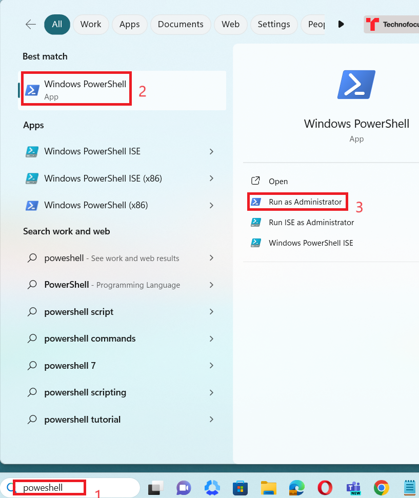 style="width:6.49167in;height:3.11667in" />

3.  Then, In the **Microsoft** window enter the password and click on
    the **Sign in** button**.**

> 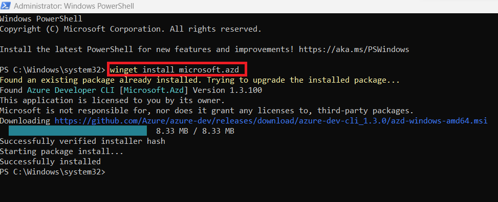 alt="A login screen with a red box and blue text Description automatically generated" />

4.  In **Stay signed in?** window, click on the **Yes** button.

> 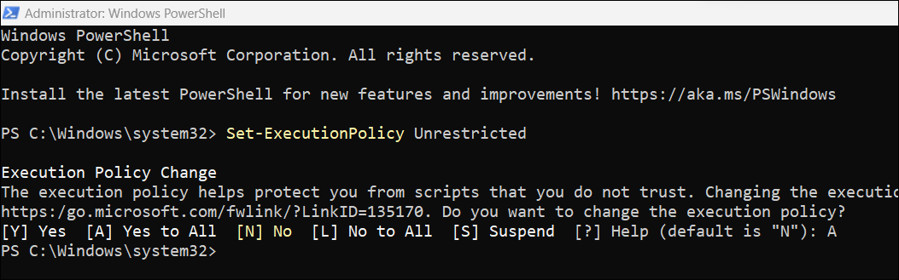 alt="A screenshot of a computer error Description automatically generated" />

5.  In the **Microsoft Fabric** home page, select the **Power BI**
    template.

>  style="width:6.49167in;height:4.08333in" />

6.  In the **Power BI Home** page menu bar on the left,
    select **Workspaces** (the icon looks similar to 🗇).

> 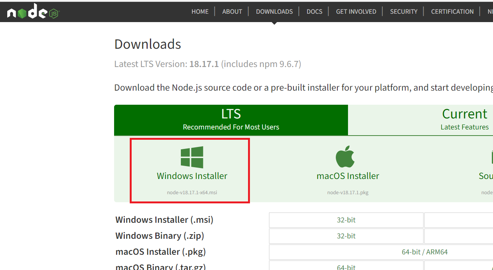

7.  In the Workspaces pane, select **+** **New workspace**.

> 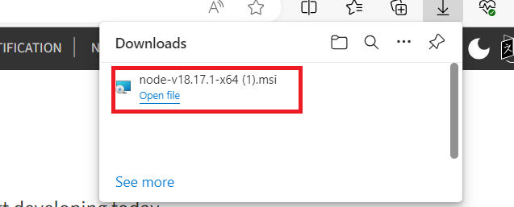 style="width:4.04583in;height:7.50692in" />

8.  In the **Create a workspace tab**, enter the following details and
    click on the **Apply** button.

| **Name** | ***dp_FabricXX** (*XX can be a unique number) (here, we entered ***dp_Fabric29)*** |
|----|----|
| **Description** | This workspace contains Analyze data with Apache Spark |
| **Advanced** | Under **License mode**, select **Trial** |
| **Default storage format** | **Small dataset storage format** |

> 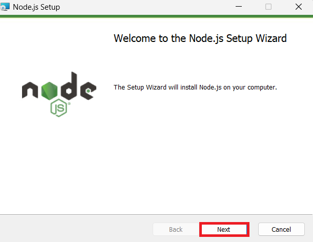 style="width:5.45417in;height:6.28415in" />

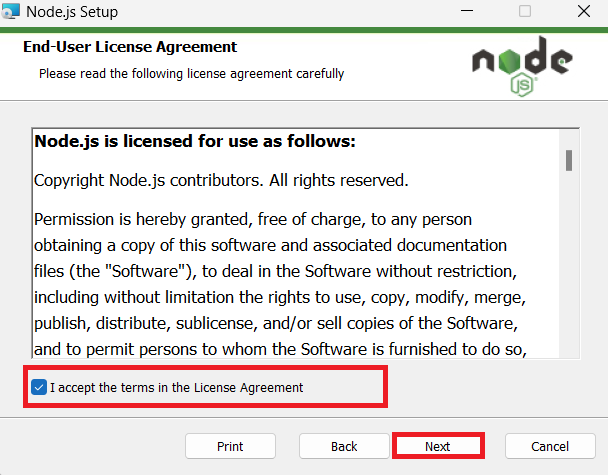

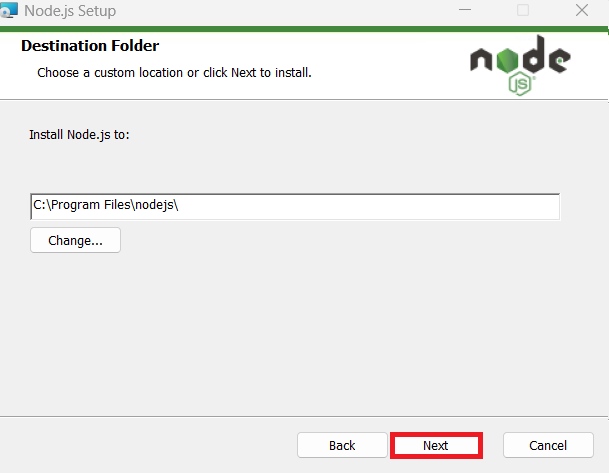

9.  Wait for the deployment to complete. It takes 2-3 minutes to
    complete. When your new workspace opens, it should be empty.

>  alt="A screen shot of a computer Description automatically generated" />

## Task 2: Create a lakehouse and upload files

Now that you have a workspace, it’s time to switch to the *Data
engineering* experience in the portal and create a data lakehouse for
the data files you’re going to analyze.

1.  At the bottom left of the Power BI portal, select the **Power
    BI** icon and switch to the **Data Engineering** experience.

2.  In the **Synapse Data Engineering** home page, Select **Lakehouse**
    under **New** pane.

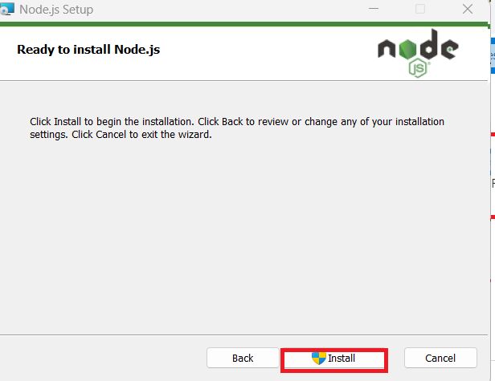

3.  In the **New lakehouse** dialog box, enter **Fabric_lakehouse** in
    the **Name** field, click on the **Create** button and open the new
    lakehouse.

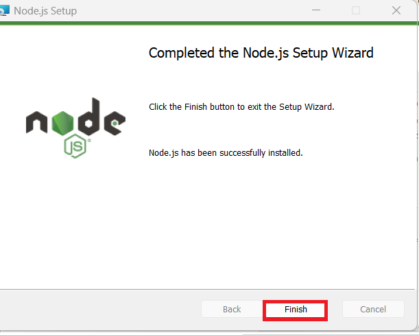

4.  After a minute or so, a new empty lakehouse will be created. You
    need to ingest some data into the data lakehouse for analysis.

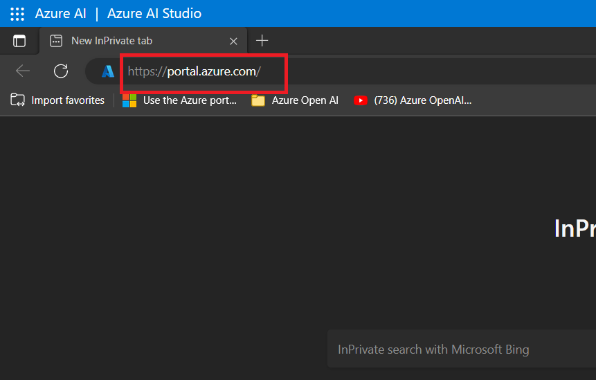

5.  You will see a notification stating **Successfully created SQL
    endpoint**.

> 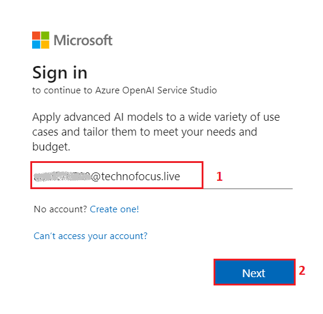 style="width:2.60905in;height:2.21801in" />

6.  In the **Explorer** section, under the **fabric_lakehouse**, hover
    your mouse beside **Files folder**, then click on the horizontal
    ellipses **(…)** menu. Navigate and click on **Upload**, then click
    on the **Upload folder** as shown in the below image.

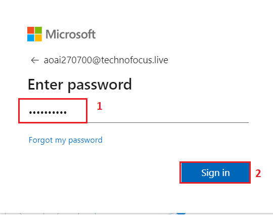

7.  On the **Upload folder** pane that appears on the right side, select
    the **folder icon** under the **Files/** and then browse to
    **C:\LabFiles** and then select the **orders** folder and click on
    the **Upload** button.

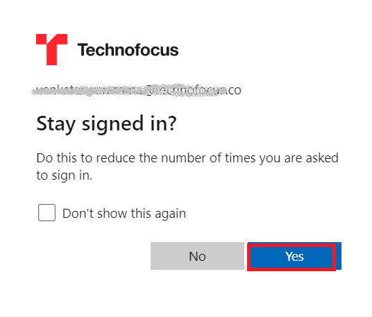

8.  In case, the **Upload 3 files to this site?** dialog box appears,
    then click on **Upload** button.

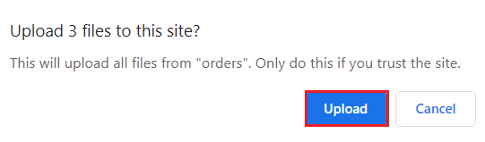

9.  In the Upload folder pane, click on the **Upload** button.

>  style="width:4.36667in;height:2.3875in" />

10. After the files have been uploaded **close** the **Upload folder**
    pane.

> 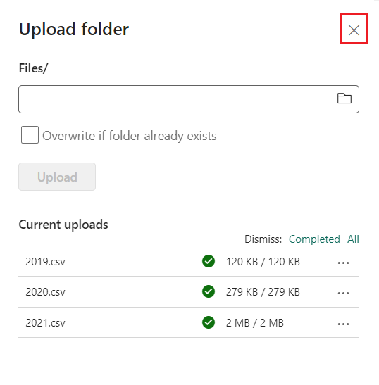

11. Expand **Files** and select the **orders** folder and verify that
    the CSV files have been uploaded.

## Task 3: Create a notebook

To work with data in Apache Spark, you can create a *notebook*.
Notebooks provide an interactive environment in which you can write and
run code (in multiple languages), and add notes to document it.

1.  On the **Home** page while viewing the contents of
    the **orders** folder in your datalake, in the **Open
    notebook** menu, select **New notebook**.

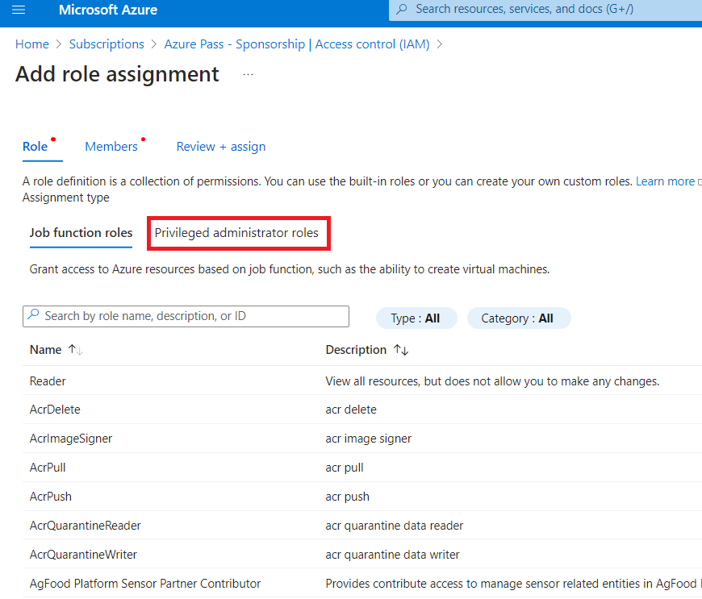

2.  After a few seconds, a new notebook containing a single *cell* will
    open. Notebooks are made up of one or more cells that can
    contain *code* or *markdown* (formatted text).

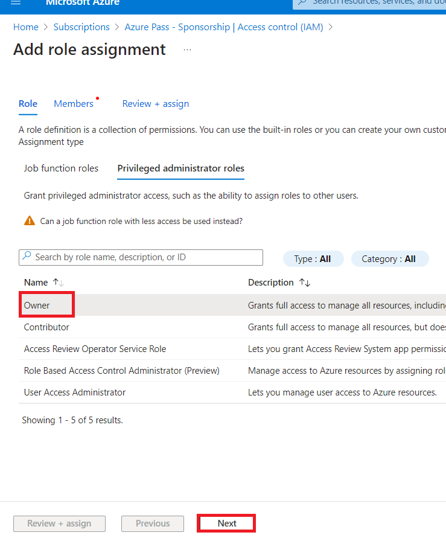

3.  Select the first cell (which is currently a *code* cell), and then
    in the dynamic tool bar at its top-right, use the **M↓** button to
    **convert the cell to a markdown cell**.

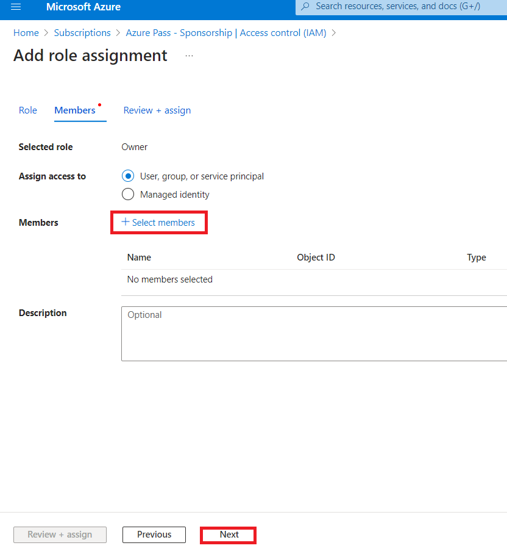

4.  When the cell changes to a markdown cell, the text it contains is
    rendered.

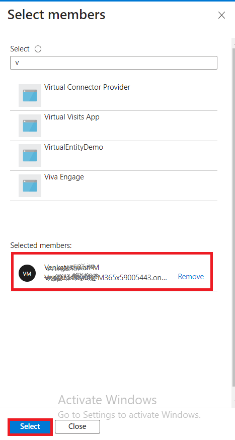

5.  Use the **🖉** (Edit) button to switch the cell to editing mode,
    replace all the text then modify the markdown as follows:

> CodeCopy
>
> \# Sales order data exploration
>
> Use the code in this notebook to explore sales order data.

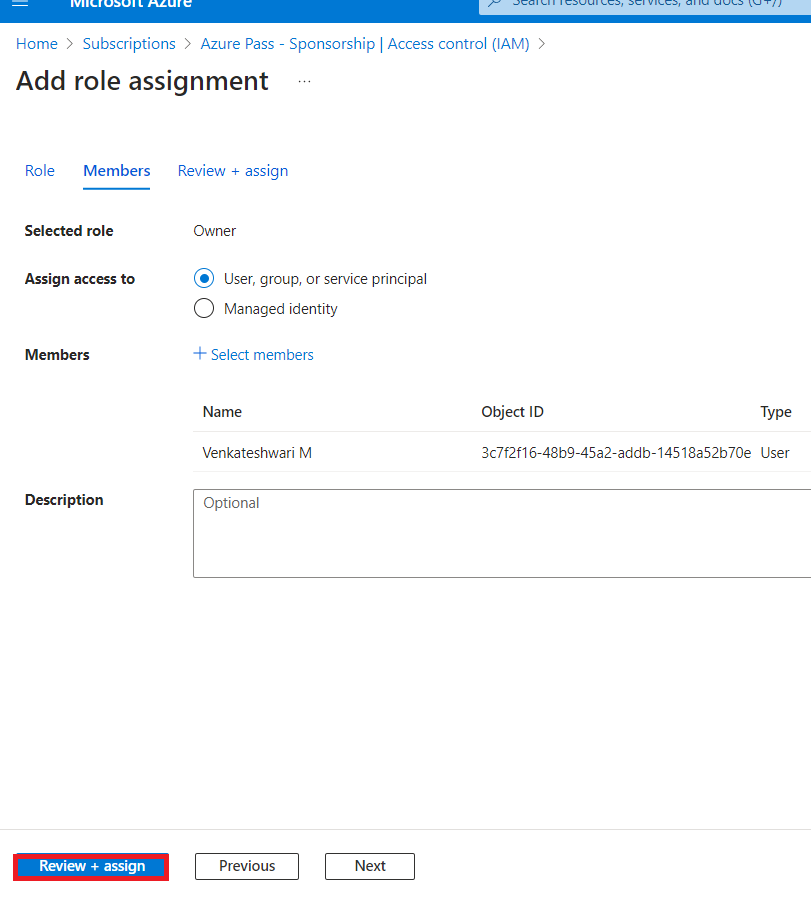

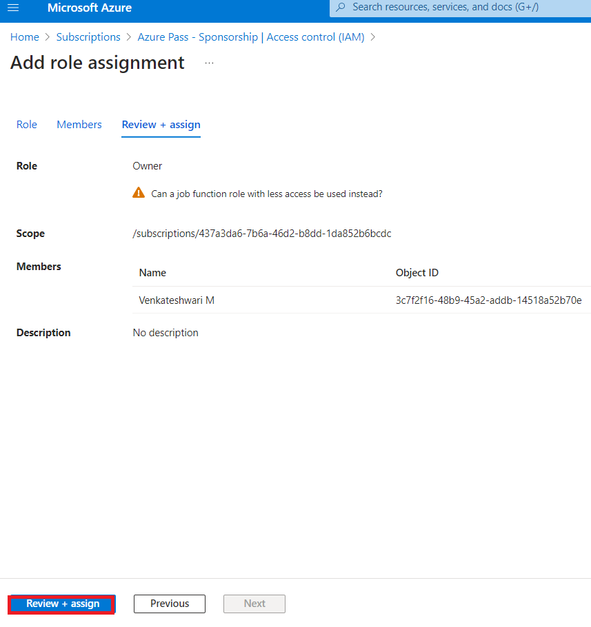

6.  Click anywhere in the notebook outside of the cell to stop editing
    it and see the rendered markdown.

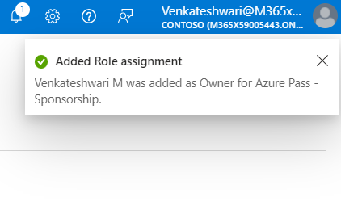

## Task 4: Load data into a dataframe

Now you’re ready to run code that loads the data into a *dataframe*.
Dataframes in Spark are similar to Pandas dataframes in Python, and
provide a common structure for working with data in rows and columns.

**Note**: Spark supports multiple coding languages, including Scala,
Java, and others. In this exercise, we’ll use *PySpark*, which is a
Spark-optimized variant of Python. PySpark is one of the most commonly
used languages on Spark and is the default language in Fabric notebooks.

1.  With the notebook visible, expand the **Files** list and select
    the **orders** folder so that the CSV files are listed next to the
    notebook editor.

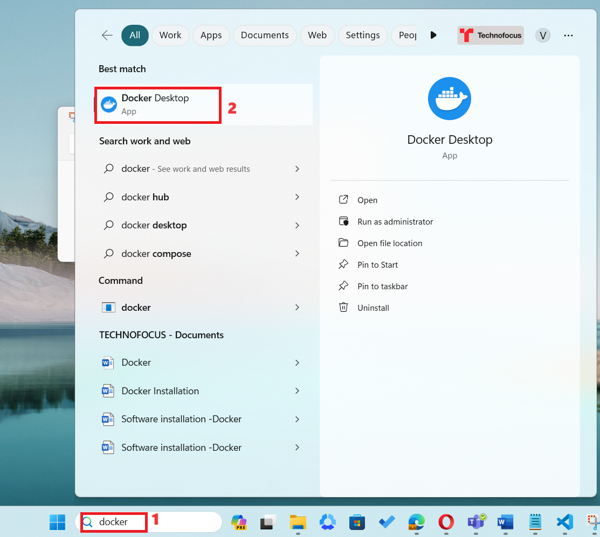

2.  Now, however your mouse to 2019.csv file. Click on the horizontal
    ellipses **(…)** beside 2019.csv. Navigate and click on **Load
    data**, then select **Spark**. A new code cell containing the
    following code will be added to the notebook:

> CodeCopy
>
> df =
> spark.read.format("csv").option("header","true").load("Files/orders/2019.csv")
>
> \# df now is a Spark DataFrame containing CSV data
> from "Files/orders/2019.csv".
>
> display(df)

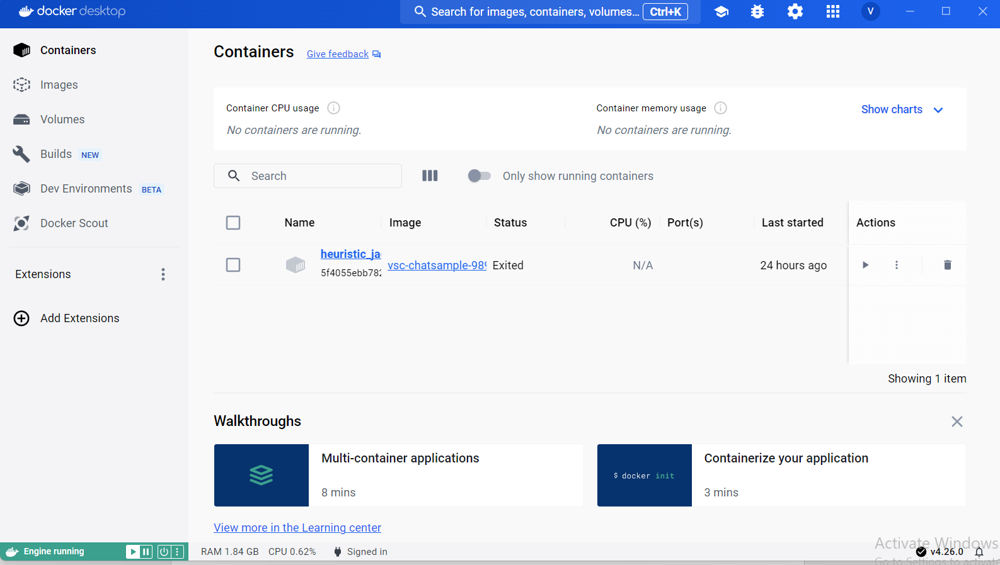

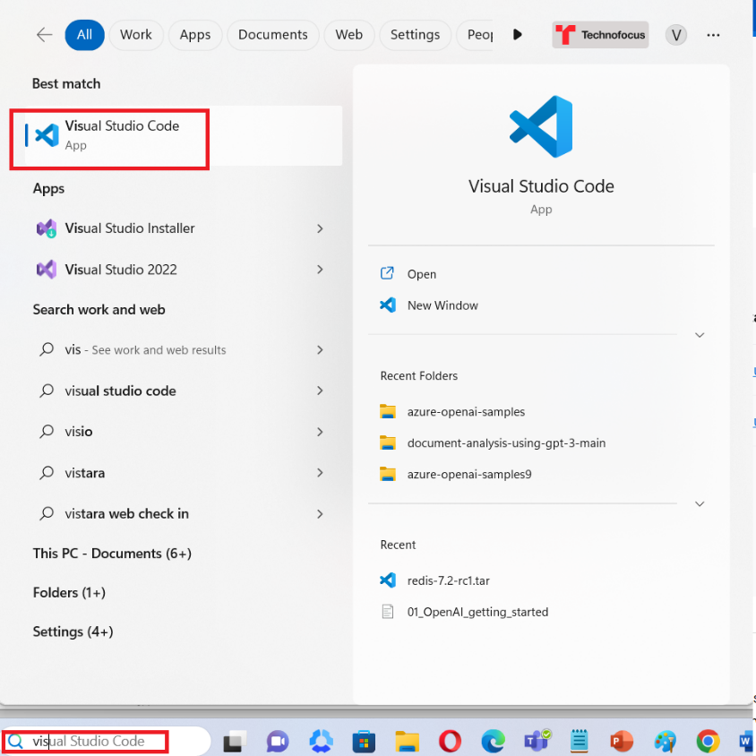

**Tip**: You can hide the Lakehouse explorer panes on the left by using
their **«** icons. Doing

so will help you focus on the notebook.

3.  Use the **▷ Run cell** button on the left of the cell to run it.

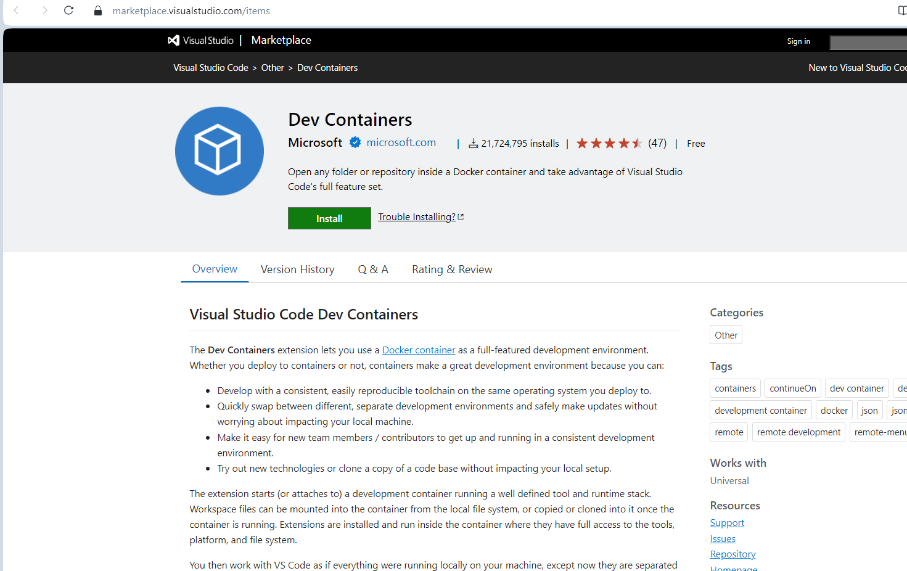

**Note**: Since this is the first time you’ve run any Spark code, a
Spark session must be started. This means that the first run in the
session can take a minute or so to complete. Subsequent runs will be
quicker.

4.  When the cell command has completed, review the output below the
    cell, which should look similar to this:

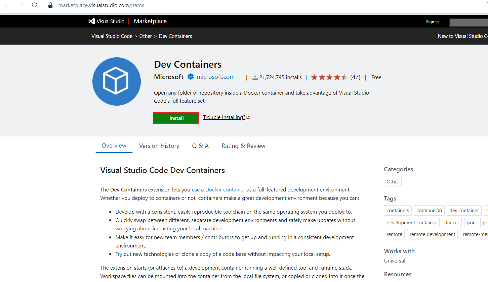

5.  The output shows the rows and columns of data from the 2019.csv
    file. However, note that the column headers don’t look right. The
    default code used to load the data into a dataframe assumes that the
    CSV file includes the column names in the first row, but in this
    case the CSV file just includes the data with no header information.

6.  Modify the code to set the **header** option to **false**. Replace
    all the code in the **cell** with the following code and click on
    **▷ Run cell** button and review the output

> CodeCopy
>
> df =
> spark.read.format("csv").option("header","false").load("Files/orders/2019.csv")
>
> \# df now is a Spark DataFrame containing CSV data
> from "Files/orders/2019.csv".
>
> display(df)

7.  Now the dataframe correctly includes first row as data values, but
    the column names are auto-generated and not very helpful. To make
    sense of the data, you need to explicitly define the correct schema
    and data type for the data values in the file.

8.  Replace all the code in the **cell** with the following code and
    click on **▷ Run cell** button and review the output

> CodeCopy
>
> from pyspark.sql.types import \*
>
> orderSchema = StructType(\[
>
> StructField("SalesOrderNumber", StringType()),
>
> StructField("SalesOrderLineNumber", IntegerType()),
>
> StructField("OrderDate", DateType()),
>
> StructField("CustomerName", StringType()),
>
> StructField("Email", StringType()),
>
> StructField("Item", StringType()),
>
> StructField("Quantity", IntegerType()),
>
> StructField("UnitPrice", FloatType()),
>
> StructField("Tax", FloatType())
>
> \])
>
> df =
> spark.read.format("csv").schema(orderSchema).load("Files/orders/2019.csv")
>
> display(df)

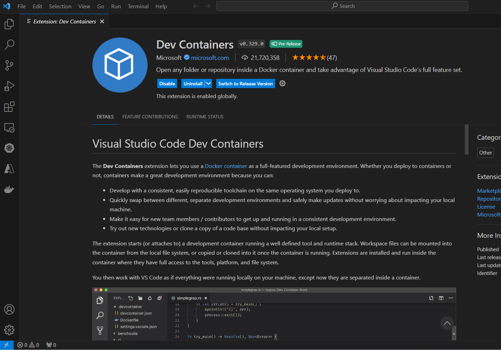

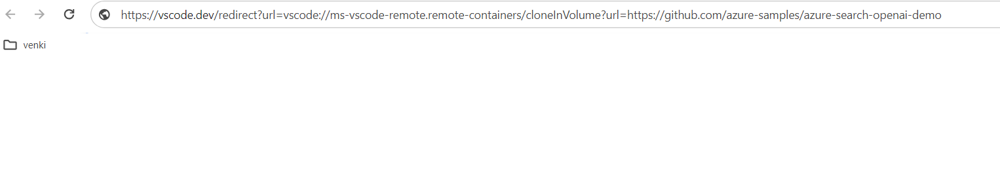

9.  Now the dataframe includes the correct column names (in addition to
    the **Index**, which is a built-in column in all dataframes based on
    the ordinal position of each row). The data types of the columns are
    specified using a standard set of types defined in the Spark SQL
    library, which were imported at the beginning of the cell.

10. Confirm that your changes have been applied to the data by viewing
    the dataframe.

11. Use the **+ Code** icon below the cell output to add a new code cell
    to the notebook, and enter the following code in it. Click on **▷
    Run cell** button and review the output

> CodeCopy
>
> display(df)
>
> 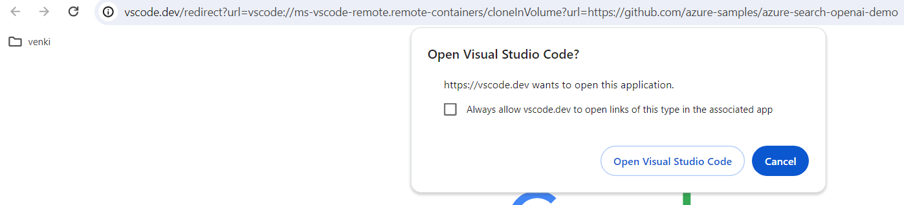 alt="A screenshot of a computer Description automatically generated" />

12. The dataframe includes only the data from the **2019.csv** file.
    Modify the code so that the file path uses a \* wildcard to read the
    sales order data from all of the files in the **orders** folder

13. Use the **+ Code** icon below the cell output to add a new code cell
    to the notebook, and enter the following code in it.

CodeCopy

> from pyspark.sql.types import \*
>
> orderSchema = StructType(\[
>
>     StructField("SalesOrderNumber",
> StringType()),
>
>     StructField("SalesOrderLineNumber",
> IntegerType()),
>
>     StructField("OrderDate", DateType()),
>
>     StructField("CustomerName",
> StringType()),
>
>     StructField("Email", StringType()),
>
>     StructField("Item", StringType()),
>
>     StructField("Quantity", IntegerType()),
>
>     StructField("UnitPrice", FloatType()),
>
>     StructField("Tax", FloatType())
>
>     \])
>
> df =
> spark.read.format("csv").schema(orderSchema).load("Files/orders/\*.csv")
>
> display(df)

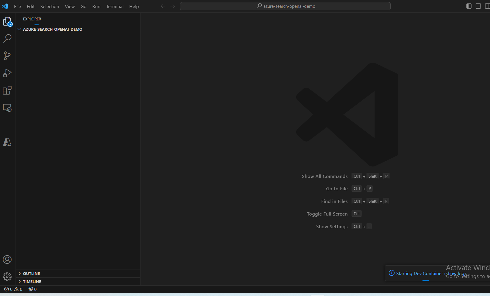

14. Run the modified code cell and review the output, which should now
    include sales for 2019, 2020, and 2021.

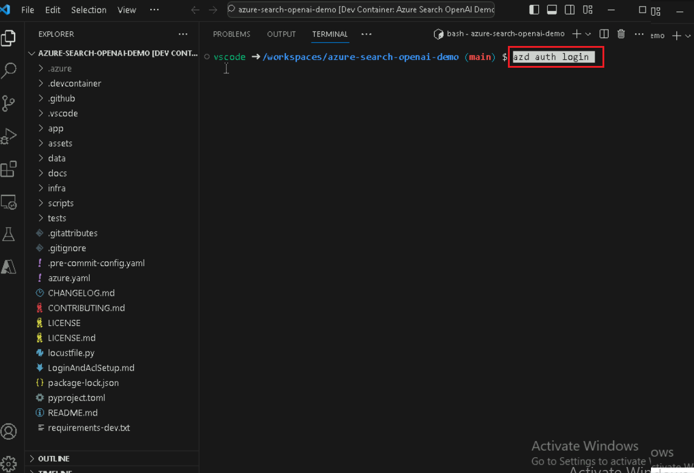

**Note**: Only a subset of the rows is displayed, so you may not be able
to see examples from all years.

# Exercise 2: Explore data in a dataframe

The dataframe object includes a wide range of functions that you can use
to filter, group, and otherwise manipulate the data it contains.

## Task 1: Filter a dataframe

1.  Use the **+ Code** icon below the cell output to add a new code cell
    to the notebook, and enter the following code in it.

**CodeCopy**

> customers = df\['CustomerName', 'Email'\]
>
> print(customers.count())
>
> print(customers.distinct().count())
>
> display(customers.distinct())
>
> 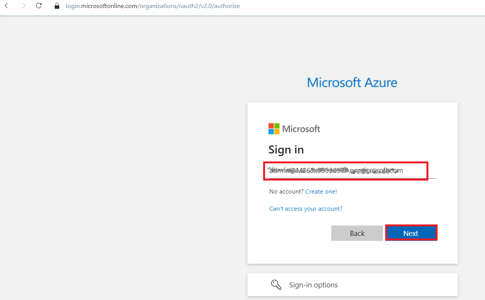 style="width:6.49167in;height:3.21667in" />

2.  **Run** the new code cell, and review the results. Observe the
    following details:

    - When you perform an operation on a dataframe, the result is a new
      dataframe (in this case, a new **customers** dataframe is created
      by selecting a specific subset of columns from
      the **df** dataframe)

    - Dataframes provide functions such
      as **count** and **distinct** that can be used to summarize and
      filter the data they contain.

    - The dataframe\['Field1', 'Field2', ...\] syntax is a shorthand way
      of defining a subset of columns. You can also
      use **select** method, so the first line of the code above could
      be written as customers = df.select("CustomerName", "Email")

> 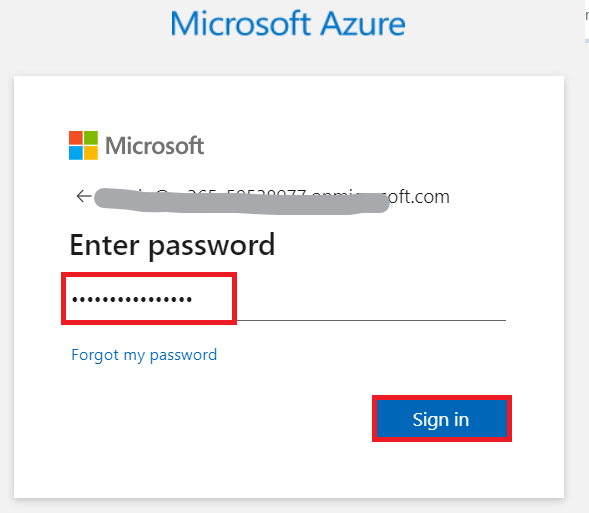

3.  Modify the code, replace all the code in the **cell** with the
    following code and click on **▷ Run cell** button as follows:

> CodeCopy
>
> customers = df.select("CustomerName",
> "Email").where(df\['Item'\]=='Road-250 Red, 52')
>
> print(customers.count())
>
> print(customers.distinct().count())
>
> display(customers.distinct())

4.  **Run** the modified code to view the customers who have purchased
    the ***Road-250 Red, 52* product**. Note that you can “**chain**”
    multiple functions together so that the output of one function
    becomes the input for the next - in this case, the dataframe created
    by the **select** method is the source dataframe for
    the **where** method that is used to apply filtering criteria.

> 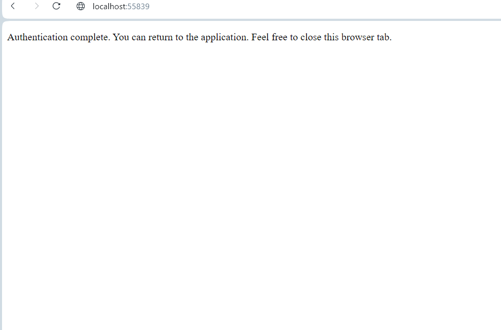

## Task 2: Aggregate and group data in a dataframe

1.  Click on **+ Code** and copy and paste the below code and then click
    on **Run cell** button.

CodeCopy

> productSales = df.select("Item",
> "Quantity").groupBy("Item").sum()
>
> display(productSales)
>
> 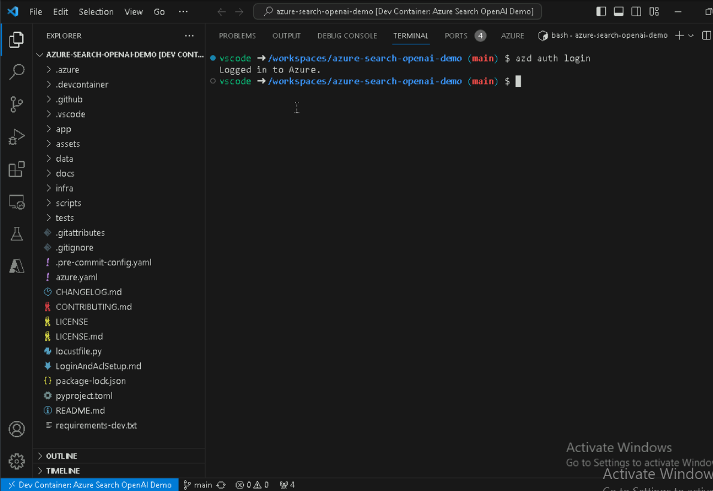

2.  Note that the results show the sum of order quantities grouped by
    product. The **groupBy** method groups the rows by *Item*, and the
    subsequent **sum** aggregate function is applied to all of the
    remaining numeric columns (in this case, *Quantity*)

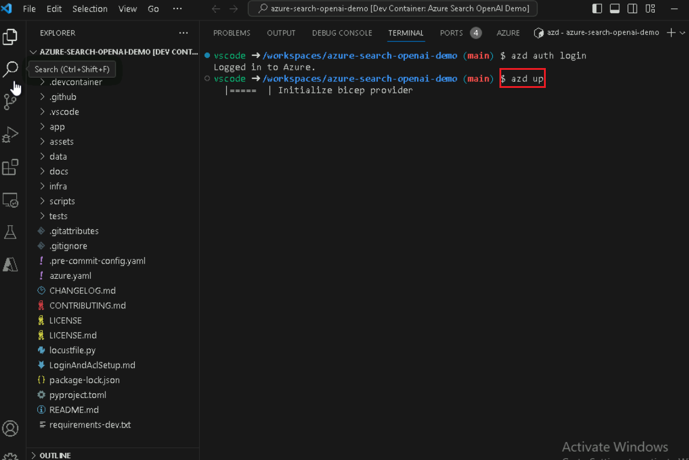

3.  Click on **+ Code** and copy and paste the below code and then click
    on **Run cell** button.

> **CodeCopy**
>
> from pyspark.sql.functions import \*
>
> yearlySales =
> df.select(year("OrderDate").alias("Year")).groupBy("Year").count().orderBy("Year")
>
> display(yearlySales)

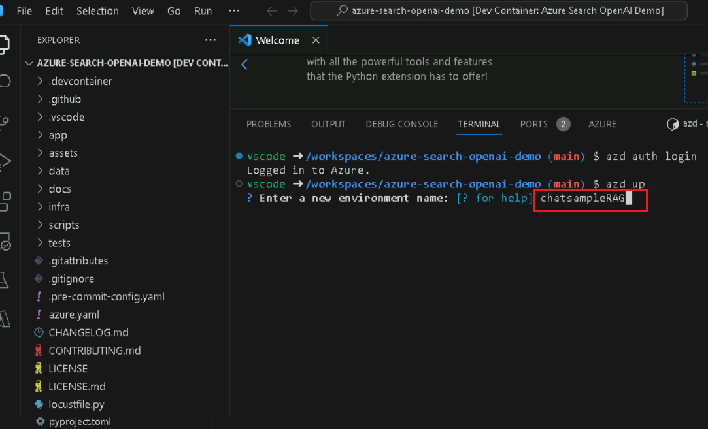

4.  Note that the results show the number of sales orders per year. Note
    that the **select** method includes a SQL **year** function to
    extract the year component of the *OrderDate* field (which is why
    the code includes an **import** statement to import functions from
    the Spark SQL library). It then uses an **alias** method is used to
    assign a column name to the extracted year value. The data is then
    grouped by the derived *Year* column and the count of rows in each
    group is calculated before finally the **orderBy** method is used to
    sort the resulting dataframe.

# Exercise 3: Use Spark to transform data files

A common task for data engineers is to ingest data in a particular
format or structure, and transform it for further downstream processing
or analysis.

## Task 1: Use dataframe methods and functions to transform data

1.  Click on + Code and copy and paste the below code

**CodeCopy**

> from pyspark.sql.functions import \*
>
> \## Create Year and Month columns
>
> transformed_df = df.withColumn("Year",
> year(col("OrderDate"))).withColumn("Month", month(col("OrderDate")))
>
> \# Create the new FirstName and LastName fields
>
> transformed_df = transformed_df.withColumn("FirstName",
> split(col("CustomerName"), " ").getItem(0)).withColumn("LastName",
> split(col("CustomerName"), " ").getItem(1))
>
> \# Filter and reorder columns
>
> transformed_df = transformed_df\["SalesOrderNumber",
> "SalesOrderLineNumber", "OrderDate", "Year", "Month", "FirstName",
> "LastName", "Email", "Item", "Quantity", "UnitPrice", "Tax"\]
>
> \# Display the first five orders
>
> display(transformed_df.limit(5))

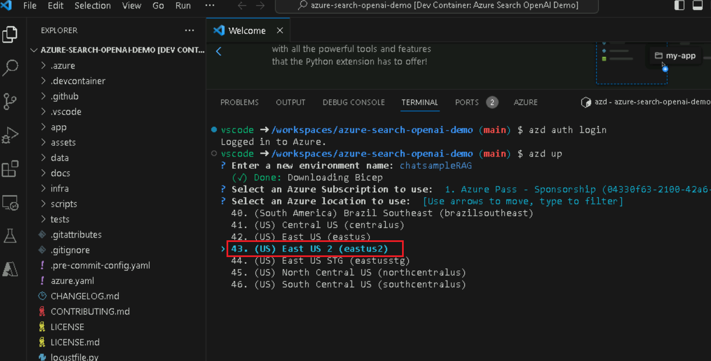

2.  **Run** the code to create a new dataframe from the original order
    data with the following transformations:

    - Add **Year** and **Month** columns based on
      the **OrderDate** column.

    - Add **FirstName** and **LastName** columns based on
      the **CustomerName** column.

    - Filter and reorder the columns, removing
      the **CustomerName** column.

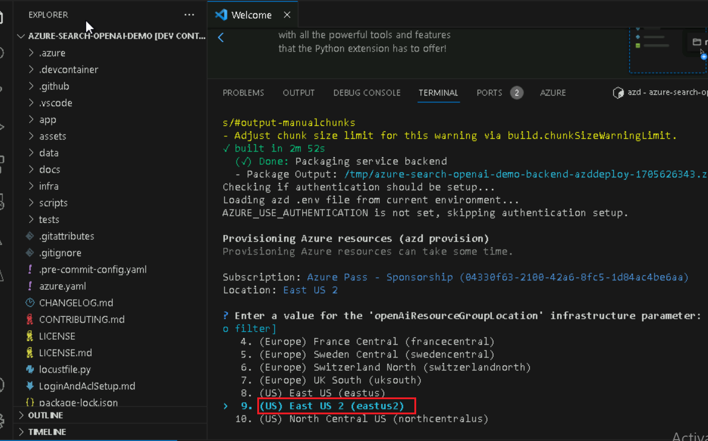

3.  Review the output and verify that the transformations have been made
    to the data.

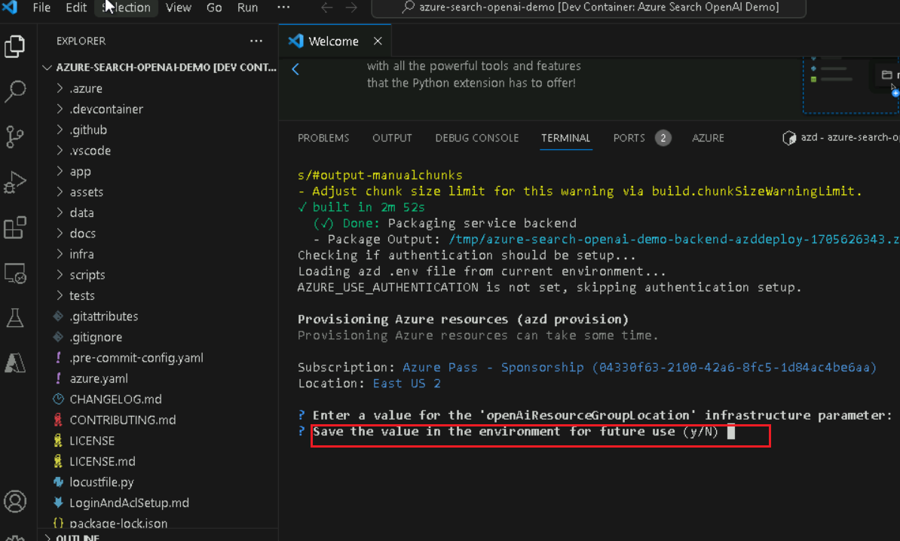

You can use the full power of the Spark SQL library to transform the
data by filtering rows, deriving, removing, renaming columns, and
applying any other required data modifications.

**Tip**: See the [<u>Spark dataframe
documentation</u>](https://spark.apache.org/docs/latest/api/python/reference/pyspark.sql/dataframe.html) to
learn more about the methods of the Dataframe object.

## Task 2: Save the transformed data

1.  **Add a new cell** with the following code to save the transformed
    dataframe in Parquet format (Overwriting the data if it already
    exists). **Run** the cell and wait for the message that the data has
    been saved.

> CodeCopy
>
> transformed_df.write.mode("overwrite").parquet('Files/transformed_data/orders')
>
> print ("Transformed data saved!")
>
> **Note**: Commonly, *Parquet* format is preferred for data files that
> you will use for further analysis or ingestion into an analytical
> store. Parquet is a very efficient format that is supported by most
> large scale data analytics systems. In fact, sometimes your data
> transformation requirement may simply be to convert data from another
> format (such as CSV) to Parquet!

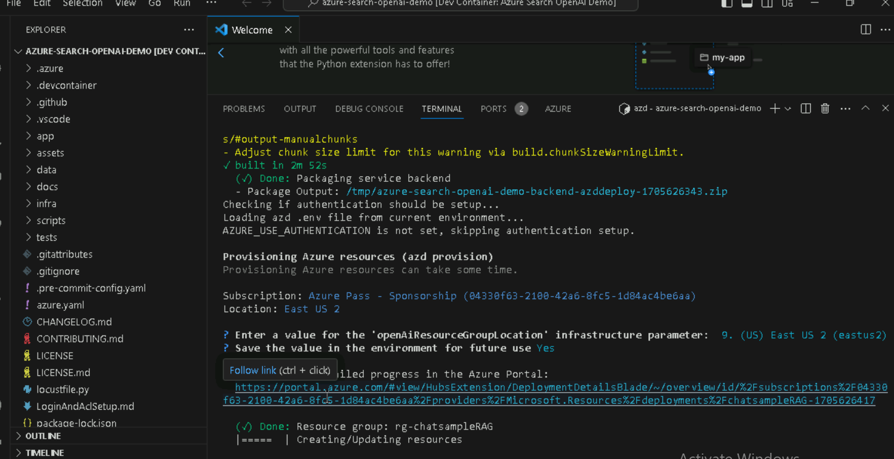

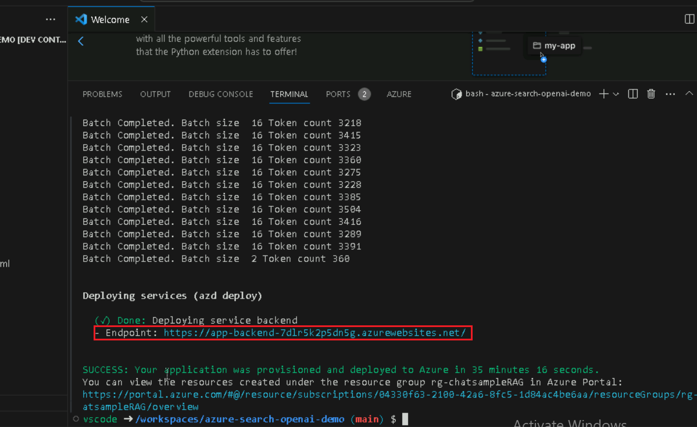

2.  Then, in the **Lakehouse explorer** pane on the left, in
    the **…** menu for the **Files** node, select **Refresh**.

> 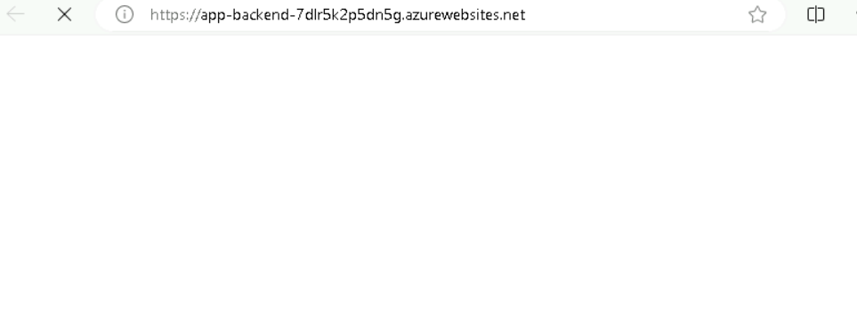

3.  Click on the **transformed_data** folder to verify that it contains
    a new folder named **orders**, which in turn contains one or more
    **Parquet files**.

4.  Click on **+ Code** following code to load a new dataframe from the
    parquet files in the **transformed_data -\> orders** folder:

> **CodeCopy**
>
> orders_df =
> spark.read.format("parquet").load("Files/transformed_data/orders")
>
> display(orders_df)
>
> 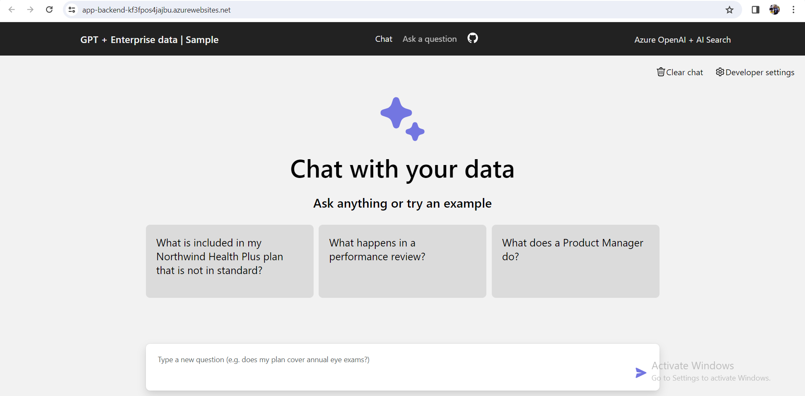 style="width:7.08084in;height:2.75417in" />

5.  **Run** the cell and verify that the results show the order data
    that has been loaded from the parquet files.

> 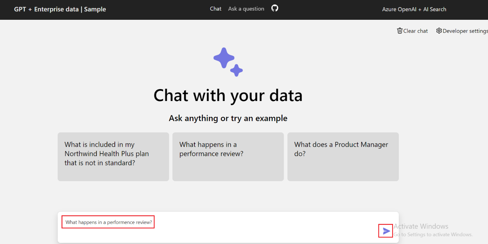 style="width:6.96719in;height:4.2875in" />

## Task 3: Save data in partitioned files

1.  Add a new cell, Click on **+ Code** with the following code; which
    saves the dataframe, partitioning the data
    by **Year** and **Month**. **Run** the cell and wait for the message
    that the data has been saved

> CodeCopy
>
> orders_df.write.partitionBy("Year","Month").mode("overwrite").parquet("Files/partitioned_data")
>
> print ("Transformed data saved!")
>
> 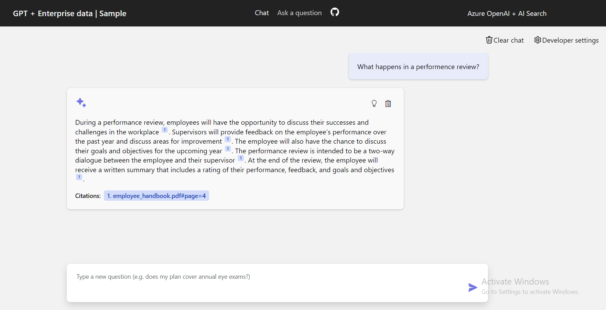 style="width:7.08247in;height:3.49583in" />
>
> 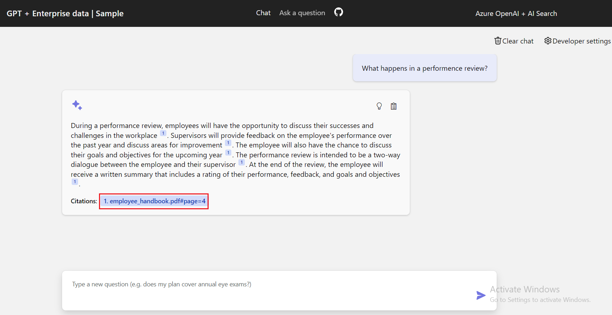 style="width:7.1253in;height:3.84583in" />

2.  Then, in the **Lakehouse explorer** pane on the left, in
    the **…** menu for the **Files** node, select **Refresh.**

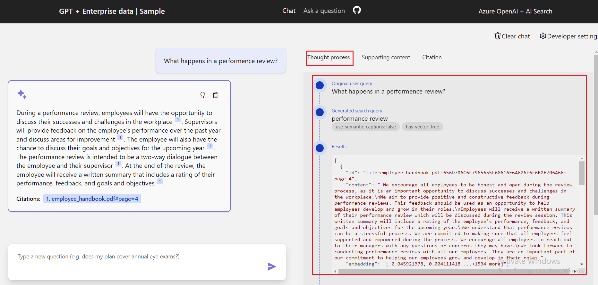

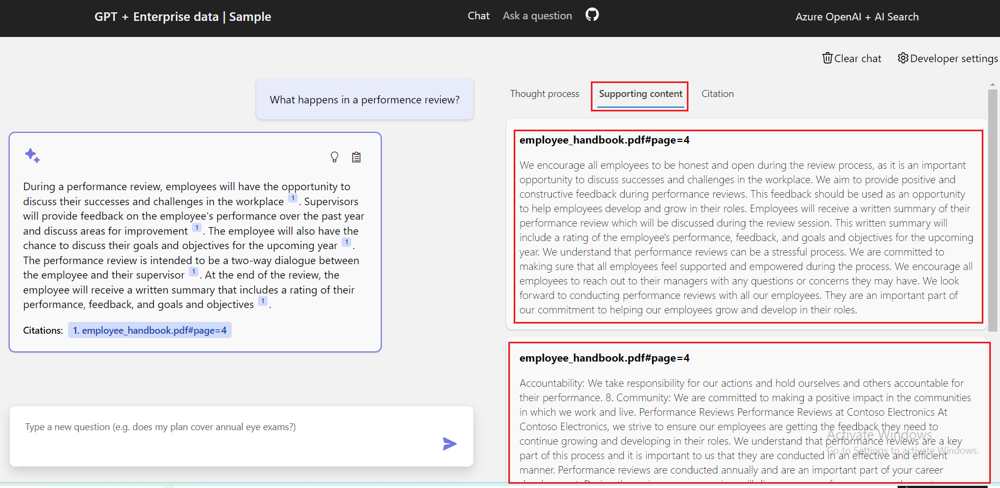

3.  Expand the **partitioned_orders** folder to verify that it contains
    a hierarchy of folders named **Year=*xxxx***, each containing
    folders named **Month=*xxxx***. Each month folder contains a parquet
    file with the orders for that month.

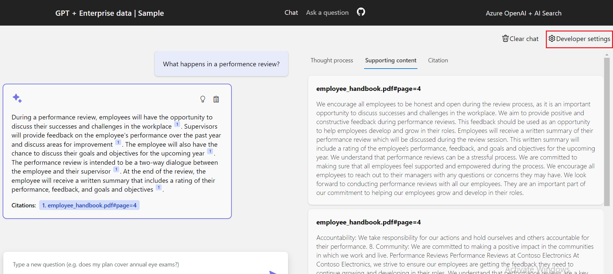

> Partitioning data files is a common way to optimize performance when
> dealing with large volumes of data. This technique can significant
> improve performance and make it easier to filter data.

4.  Add a new cell, click on **+ Code** with the following code to load
    a new dataframe from the **orders.parquet** file:

> CodeCopy
>
> orders_2021_df =
> spark.read.format("parquet").load("Files/partitioned_data/Year=2021/Month=\*")
>
> display(orders_2021_df)

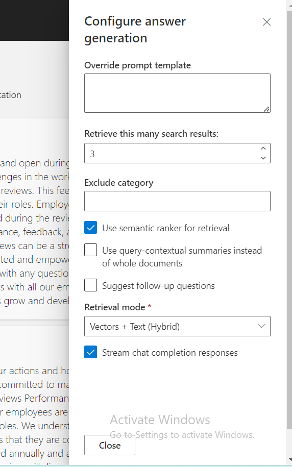

5.  **Run** the cell and verify that the results show the order data for
    sales in 2021. Note that the partitioning columns specified in the
    path (**Year** and **Month**) are not included in the dataframe.

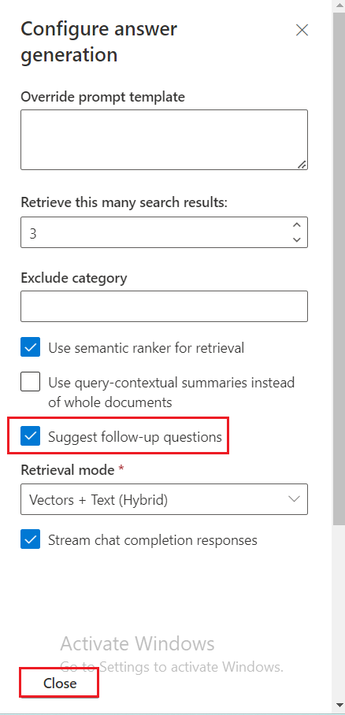

# **Exercise 3: Work with tables and SQL**

As you’ve seen, the native methods of the dataframe object enable you to
query and analyze data from a file quite effectively. However, many data
analysts are more comfortable working with tables that they can query
using SQL syntax. Spark provides a *metastore* in which you can define
relational tables. The Spark SQL library that provides the dataframe
object also supports the use of SQL statements to query tables in the
metastore. By using these capabilities of Spark, you can combine the
flexibility of a data lake with the structured data schema and SQL-based
queries of a relational data warehouse - hence the term “data
lakehouse”.

## Task 1: Create a managed table

Tables in a Spark metastore are relational abstractions over files in
the data lake. tables can be *managed* (in which case the files are
managed by the metastore) or *external* (in which case the table
references a file location in the data lake that you manage
independently of the metastore).

1.  Add a new code, click on **+ Code** cell to the notebook and enter
    the following code, which saves the dataframe of sales order data as
    a table named **salesorders**:

> CodeCopy
>
> \# Create a new table
>
> df.write.format("delta").saveAsTable("salesorders")
>
> \# Get the table description
>
> spark.sql("DESCRIBE EXTENDED salesorders").show(truncate=False)

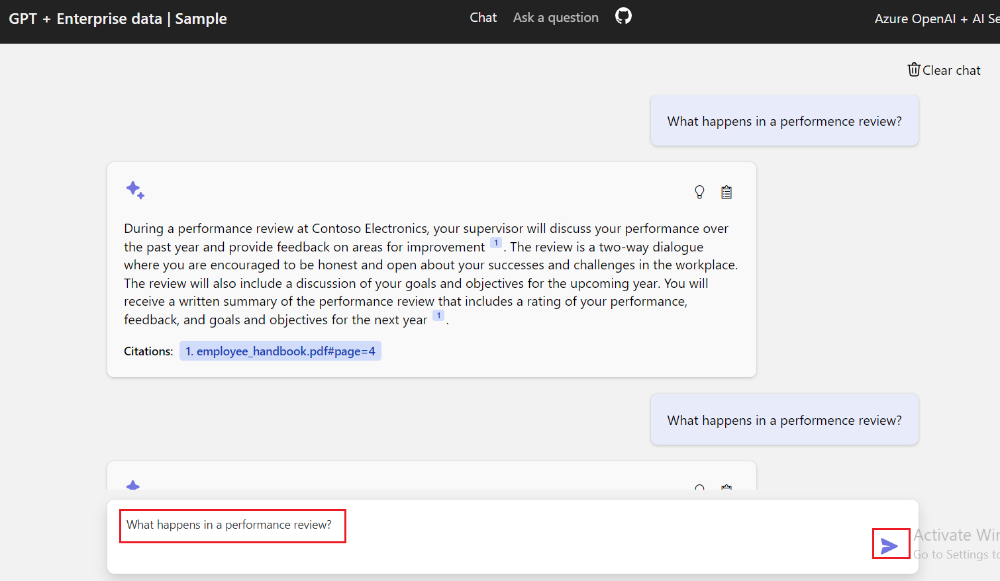

**Note**: It’s worth noting a couple of things about this example.
Firstly, no explicit path is provided, so the files for the table will
be managed by the metastore. Secondly, the table is saved
in **delta** format. You can create tables based on multiple file
formats (including CSV, Parquet, Avro, and others) but *delta lake* is a
Spark technology that adds relational database capabilities to tables;
including support for transactions, row versioning, and other useful
features. Creating tables in delta format is preferred for data
lakehouses in Fabric.

2.  **Run** the code cell and review the output, which describes the
    definition of the new table.

3.  In the **Lakehouse** **explorer** pane, in the **…** menu for
    the **Tables** folder, select **Refresh.**

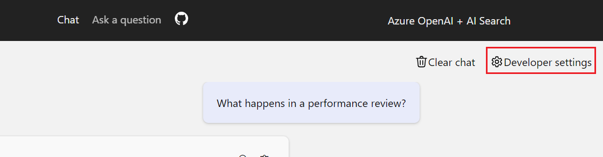

4.  Then, expand the **Tables** node and verify that
    the **salesorders** table has been created.

> 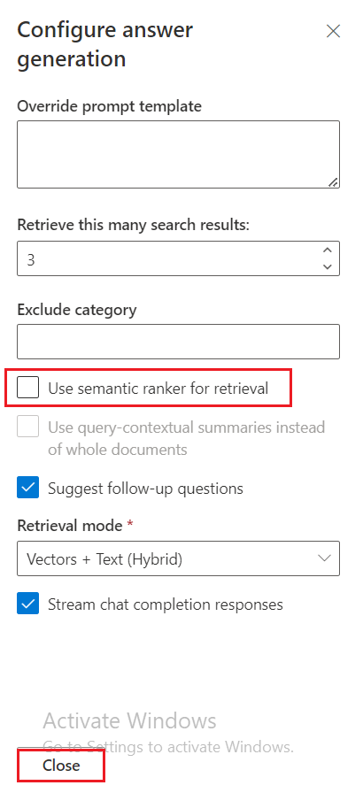 alt="A screenshot of a computer Description automatically generated" />

5.  Hover your mouse beside **salesorders** table, then click on the
    horizontal ellipses (…). Navigate and click on **Load data**, then
    select **Spark**.

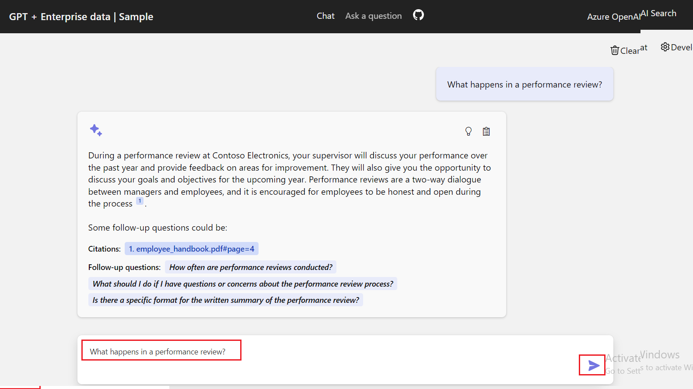

6.  Click on **▷ Run cell** button and which uses the Spark SQL library
    to embed a SQL query against the **salesorder** table in PySpark
    code and load the results of the query into a dataframe.

> CodeCopy
>
> df = spark.sql("SELECT \* FROM \[your_lakehouse\].salesorders LIMIT
> 1000")
>
> display(df)

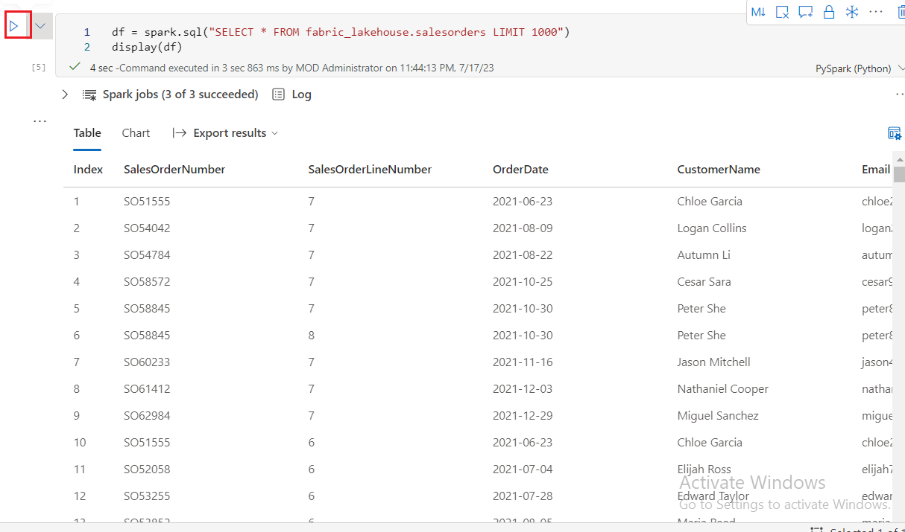

## Task 2: Create an external table

You can also create *external* tables for which the schema metadata is
defined in the metastore for the lakehouse, but the data files are
stored in an external location.

1.  Under the results returned by the first code cell, use the **+
    Code** button to add a new code cell if one doesn’t already exist.
    Then enter the following code in the new cell.

CodeCopy

> df.write.format("delta").saveAsTable("external_salesorder",
> path="\<abfs_path\>/external_salesorder")

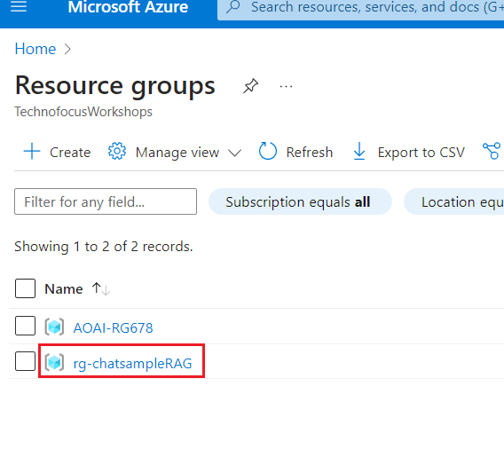

2.  In the **Lakehouse explorer** pane, in the **…** menu for
    the **Files** folder, select **Copy ABFS path** in the notepad.

> The ABFS path is the fully qualified path to the **Files** folder in
> the OneLake storage for your lakehouse - similar to this:

abfss://dp_Fabric29@onelake.dfs.fabric.microsoft.com/Fabric_lakehouse.Lakehouse/Files/external_salesorder

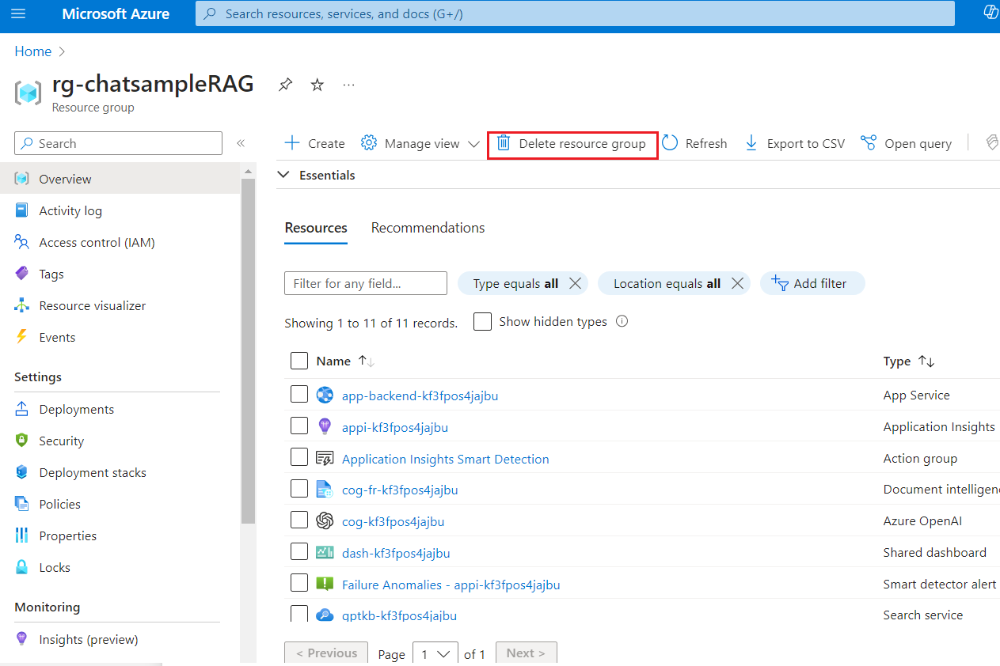

3.  Now, move into the code cell, replace **\<abfs_path\>** with the
    **path** you copied to the notepad so that the code saves the
    dataframe as an external table with data files in a folder named
    **external_salesorder** in your **Files** folder location. The full
    path should look similar to this

abfss://dp_Fabric29@onelake.dfs.fabric.microsoft.com/Fabric_lakehouse.Lakehouse/Files/external_salesorder

4.  Use the **▷ (*Run cell*)** button on the left of the cell to run it.

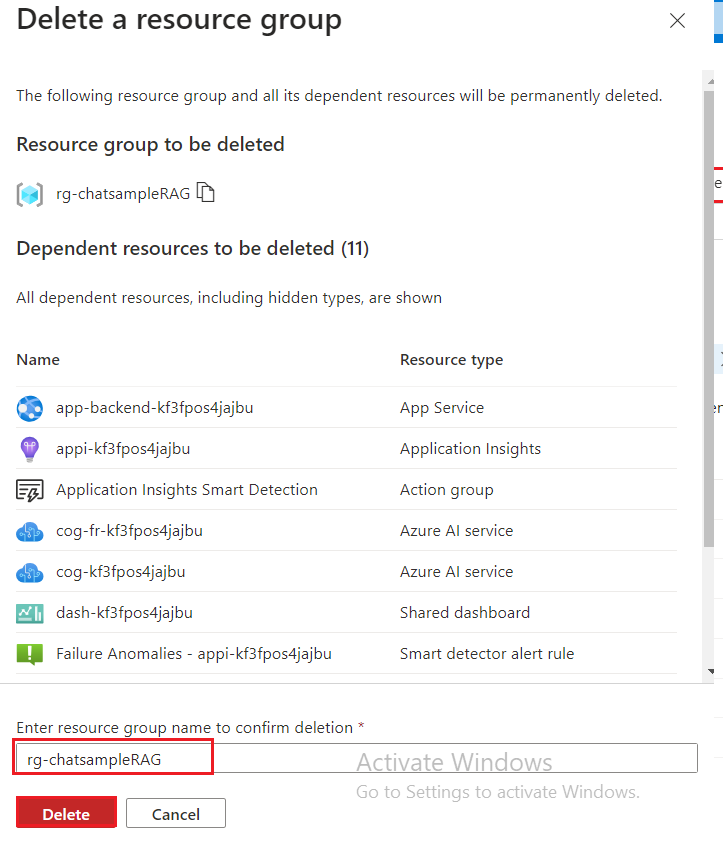

5.  In the **Lakehouse explorer** pane, in the **…** menu for
    the **Tables** folder, select the **Refresh**.

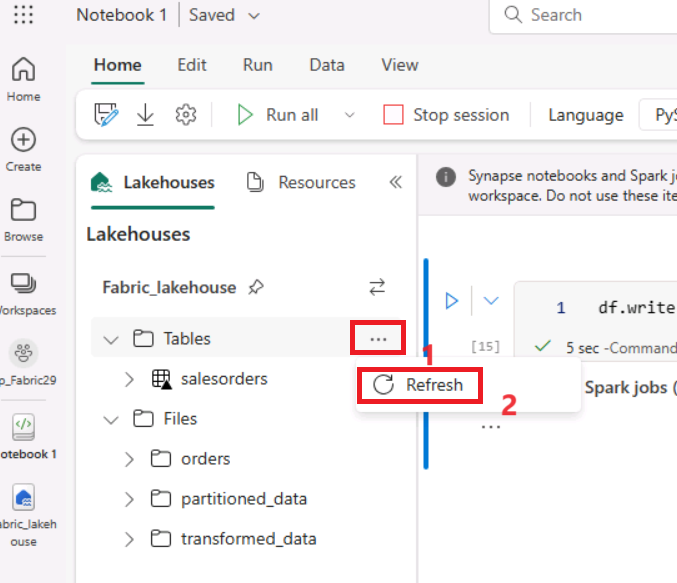

6.  Then expand the **Tables** node and verify that
    the **external_salesorder** table has been created.

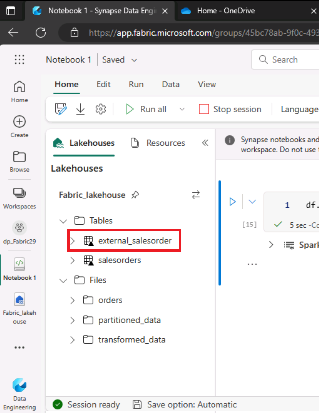

7.  In the **Lakehouse explorer** pane, in the **…** menu for
    the **Files** folder, select **Refresh**.

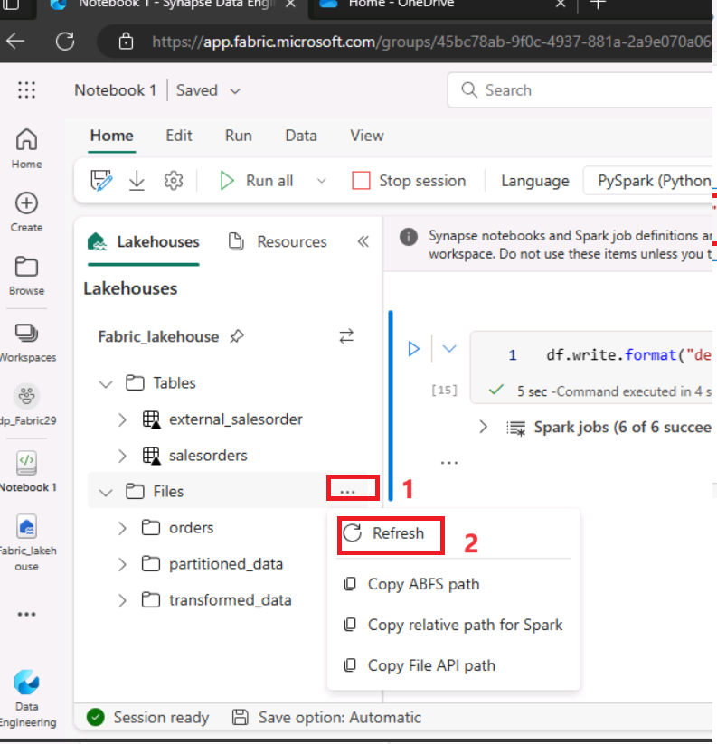

8.  Then expand the **Files** node and verify that
    the **external_salesorder** folder has been created for the table’s
    data files.

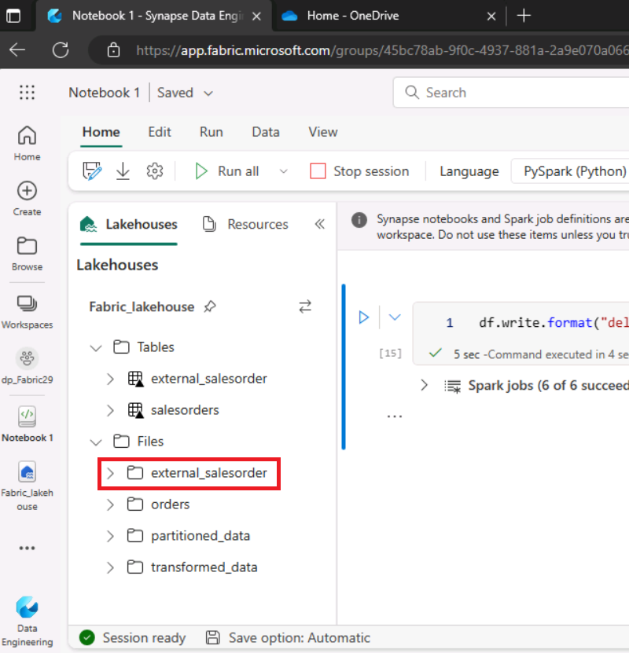

## Task 3: Compare managed and external tables

Let’s explore the differences between managed and external tables.

1.  Under the results returned by the code cell, use the **+
    Code** button to add a new code cell. Copy the code below into the
    Code cell and use the **▷ (*Run cell*)** button on the left of the
    cell to run it.

> SqlCopy
>
> %%sql
>
> DESCRIBE FORMATTED salesorders;

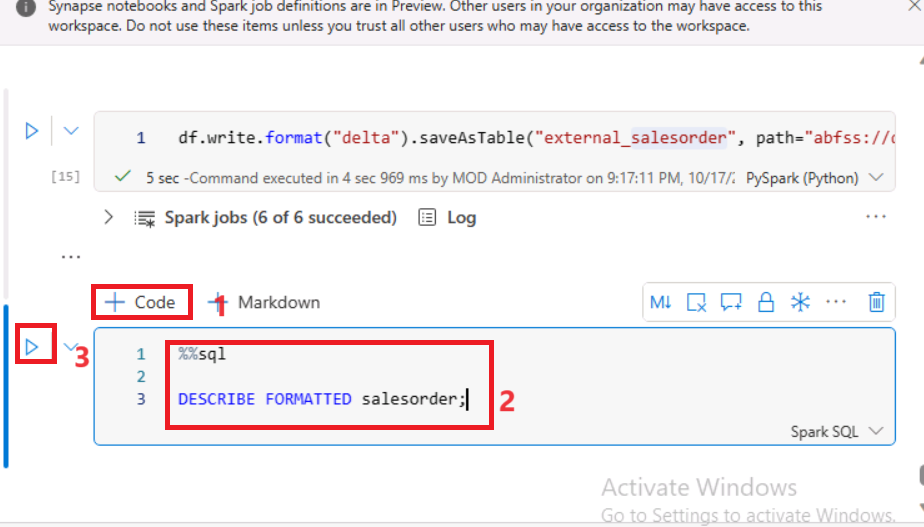

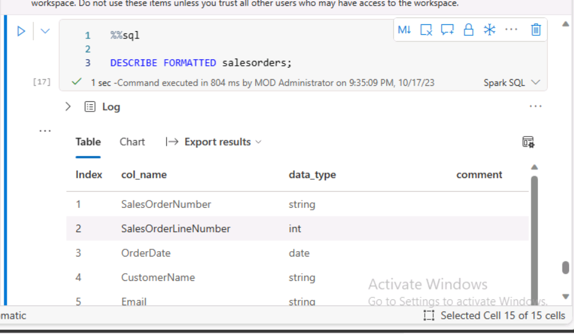

2.  In the results, view the **Location** property for the table, which
    should be a path to the OneLake storage for the lakehouse ending
    with **/Tables/salesorders** (you may need to widen the **Data
    type** column to see the full path).

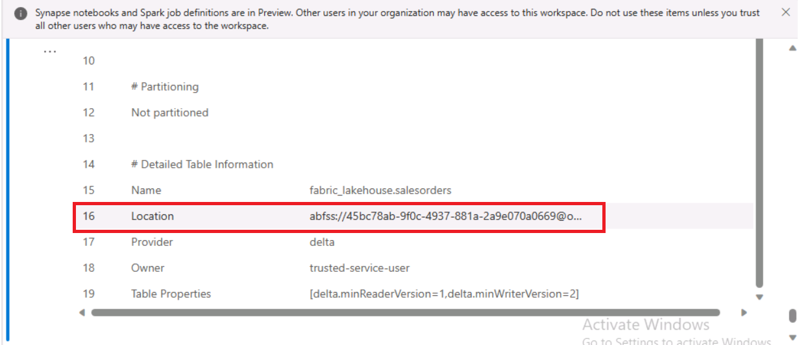

3.  Modify the **DESCRIBE** command to show the details of
    the **external_saleorder** table as shown here.

4.  Under the results returned by the code cell, use the **+
    Code** button to add a new code cell. Copy the below code and use
    the **▷ (*Run cell*)** button on the left of the cell to run it.

> SqlCopy
>
> %%sql
>
> DESCRIBE FORMATTED external_salesorder;

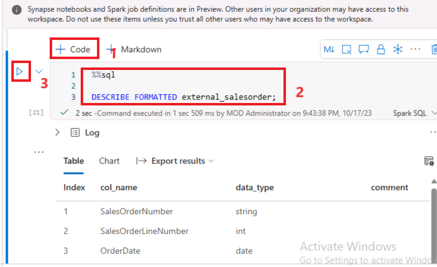

5.  In the results, view the **Location** property for the table, which
    should be a path to the OneLake storage for the lakehouse ending
    with **/Files/external_saleorder** (you may need to widen the **Data
    type** column to see the full path).

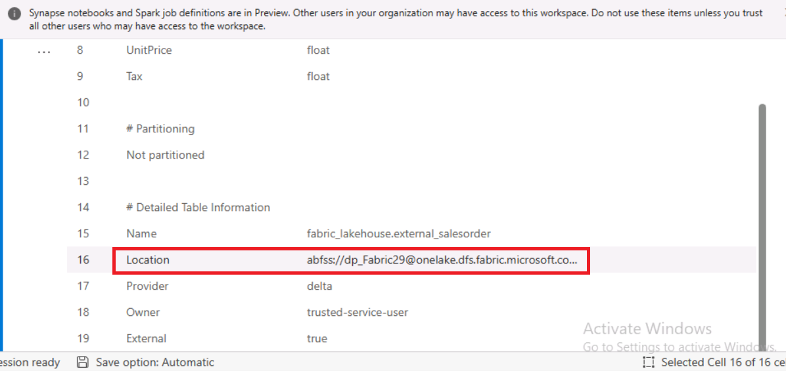

## Task 4: Run SQL code in a cell

While it’s useful to be able to embed SQL statements into a cell
containing PySpark code, data analysts often just want to work directly
in SQL.

1.  Click on **+ Code** cell to the notebook, and enter the following
    code in it. Click on **▷ Run cell** button and review the results.
    Observe that:

    - The %%sql line at the beginning of the cell (called a *magic*)
      indicates that the Spark SQL language runtime should be used to
      run the code in this cell instead of PySpark.

    - The SQL code references the **salesorders** table that you created
      previously.

    - The output from the SQL query is automatically displayed as the
      result under the cell

> SqlCopy
>
> %%sql
>
> SELECT YEAR(OrderDate) AS OrderYear,
>
> SUM((UnitPrice \* Quantity) + Tax) AS GrossRevenue
>
> FROM salesorders
>
> GROUP BY YEAR(OrderDate)
>
> ORDER BY OrderYear;

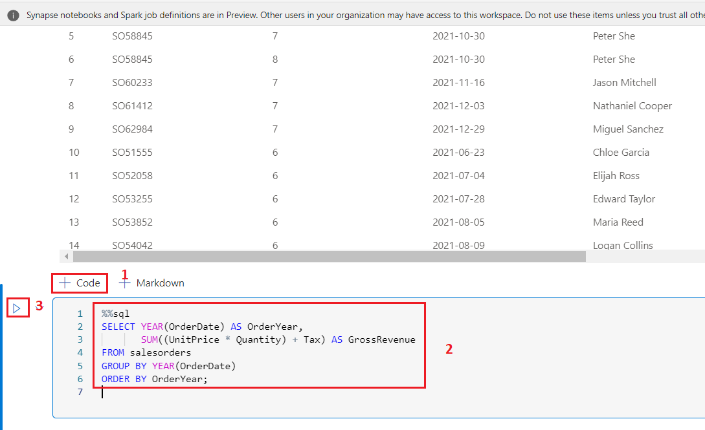

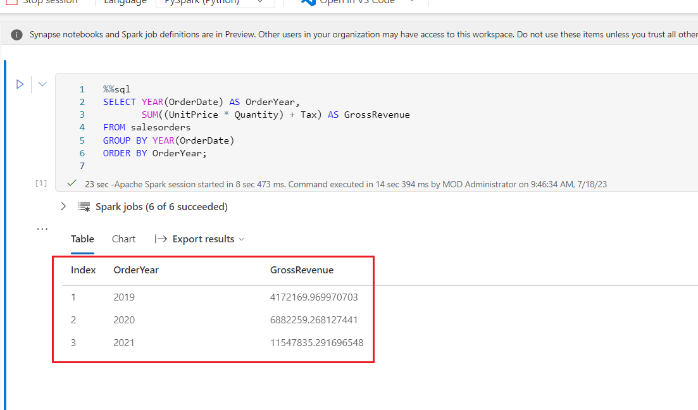

**Note**: For more information about Spark SQL and dataframes, see
the [<u>Spark SQL
documentation</u>](https://spark.apache.org/docs/2.2.0/sql-programming-guide.html).

# Exercise 4: Visualize data with Spark

A picture is proverbially worth a thousand words, and a chart is often
better than a thousand rows of data. While notebooks in Fabric include a
built in chart view for data that is displayed from a dataframe or Spark
SQL query, it is not designed for comprehensive charting. However, you
can use Python graphics libraries like **matplotlib** and **seaborn** to
create charts from data in dataframes.

## Task 1: View results as a chart

1.  Click on **+ Code** cell to the notebook, and enter the following
    code in it. Click on **▷ Run cell** button and observe that it
    returns the data from the **salesorders** view you created
    previously.

> SqlCopy
>
> %%sql
>
> SELECT \* FROM salesorders

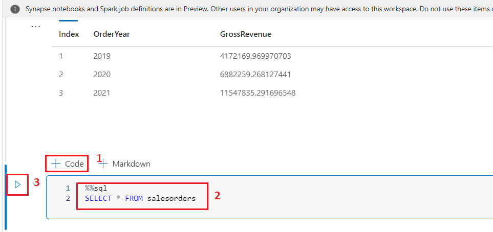

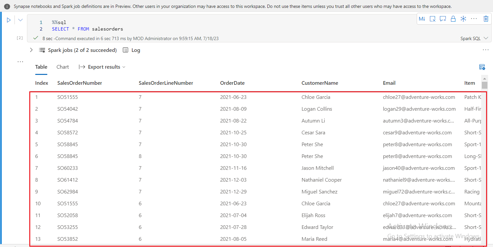

2.  In the results section beneath the cell, change the **View** option
    from **Table** to **Chart**.

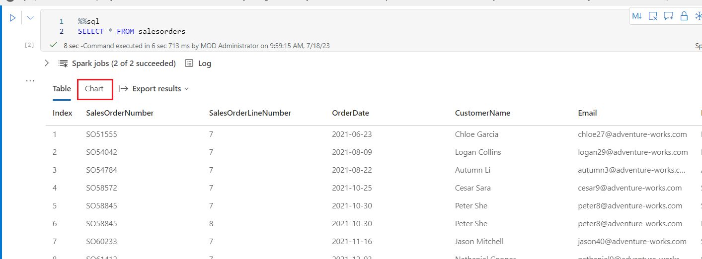

3.  Use the **View options** button at the top right of the chart to
    display the options pane for the chart. Then set the options as
    follows and select **Apply**:

    - **Chart type**: Bar chart

    - **Key**: Item

    - **Values**: Quantity

    - **Series Group**: *leave blank*

    - **Aggregation**: Sum

    - **Stacked**: *Unselected*

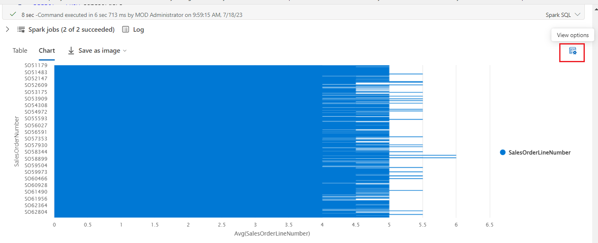

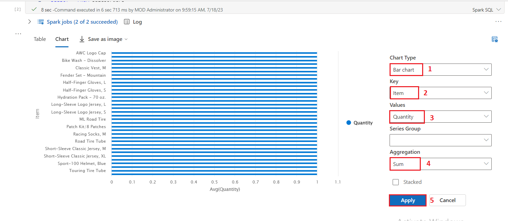

4.  Verify that the chart looks similar to this

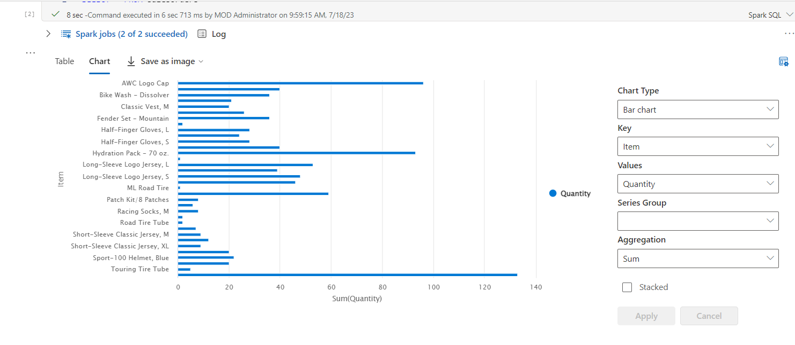

## Task 2: Get started with matplotlib

1.  Click on **+ Code** and copy and paste the below code. **Run** the
    code and observe that it returns a Spark dataframe containing the
    yearly revenue.

> CodeCopy
>
> sqlQuery = "SELECT CAST(YEAR(OrderDate) AS CHAR(4)) AS OrderYear, \\
>
> SUM((UnitPrice \* Quantity) + Tax) AS GrossRevenue \\
>
> FROM salesorders \\
>
> GROUP BY CAST(YEAR(OrderDate) AS CHAR(4)) \\
>
> ORDER BY OrderYear"
>
> df_spark = spark.sql(sqlQuery)
>
> df_spark.show()

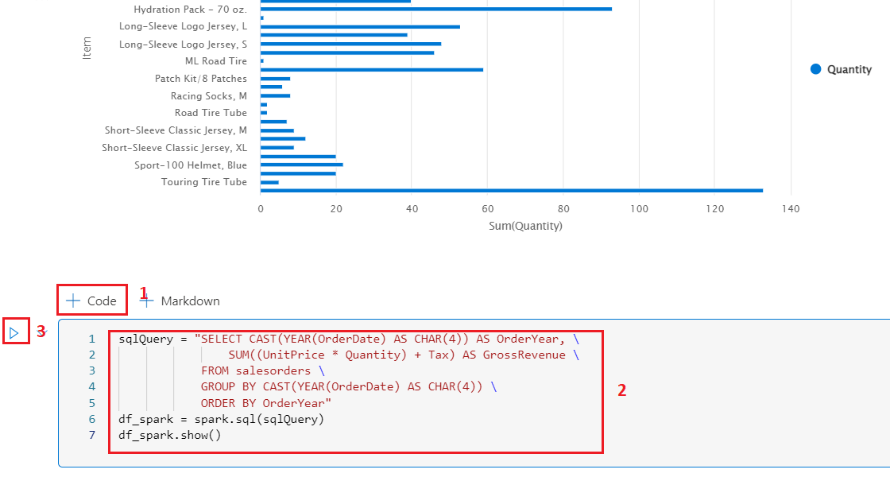

2.  To visualize the data as a chart, we’ll start by using
    the **matplotlib** Python library. This library is the core plotting
    library on which many others are based, and provides a great deal of
    flexibility in creating charts.

3.  Click on **+ Code** and copy and paste the below code.

**CodeCopy**

> from matplotlib import pyplot as plt
>
> \# matplotlib requires a Pandas dataframe, not a Spark one
>
> df_sales = df_spark.toPandas()
>
> \# Create a bar plot of revenue by year
>
> plt.bar(x=df_sales\['OrderYear'\], height=df_sales\['GrossRevenue'\])
>
> \# Display the plot
>
> plt.show()

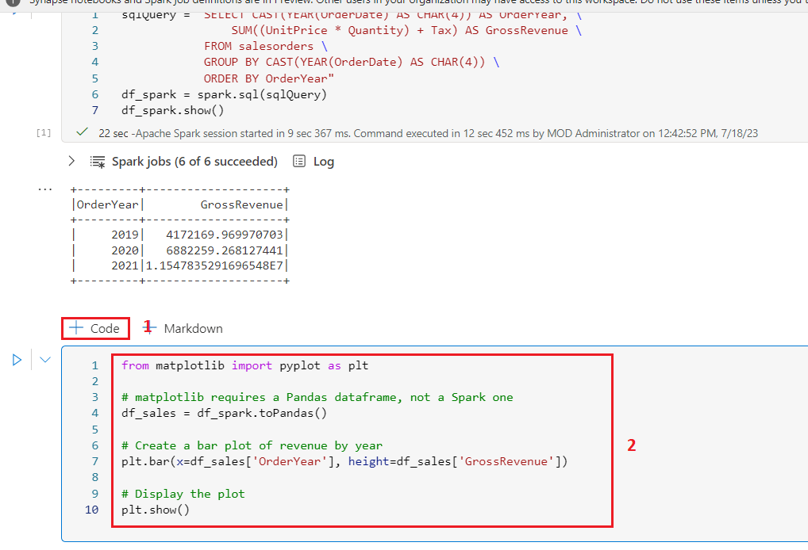

5.  Click on the **Run cell** button and review the results, which
    consist of a column chart with the total gross revenue for each
    year. Note the following features of the code used to produce this
    chart:

    - The **matplotlib** library requires a *Pandas* dataframe, so you
      need to convert the *Spark* dataframe returned by the Spark SQL
      query to this format.

    - At the core of the **matplotlib** library is
      the **pyplot** object. This is the foundation for most plotting
      functionality.

    - The default settings result in a usable chart, but there’s
      considerable scope to customize it

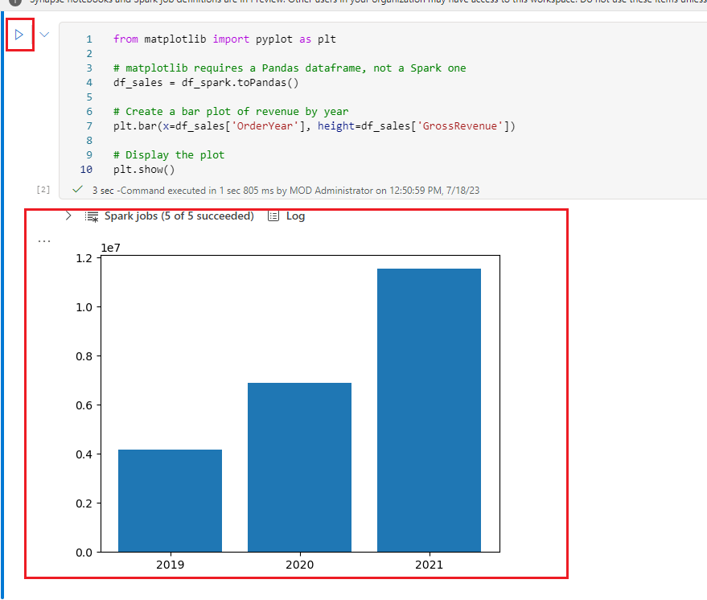

6.  Modify the code to plot the chart as follows, replace all the code
    in the **cell** with the following code and click on **▷ Run
    cell** button and review the output

> CodeCopy
>
> from matplotlib import pyplot as plt
>
> \# Clear the plot area
>
> plt.clf()
>
> \# Create a bar plot of revenue by year
>
> plt.bar(x=df_sales\['OrderYear'\], height=df_sales\['GrossRevenue'\],
> color='orange')
>
> \# Customize the chart
>
> plt.title('Revenue by Year')
>
> plt.xlabel('Year')
>
> plt.ylabel('Revenue')
>
> plt.grid(color='#95a5a6', linestyle='--', linewidth=2, axis='y',
> alpha=0.7)
>
> plt.xticks(rotation=45)
>
> \# Show the figure
>
> plt.show()

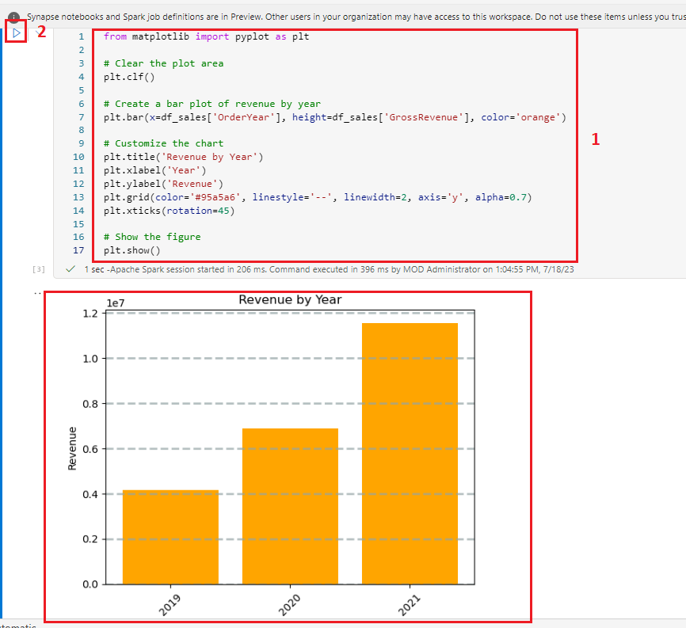

7.  The chart now includes a little more information. A plot is
    technically contained with a **Figure**. In the previous examples,
    the figure was created implicitly for you; but you can create it
    explicitly.

8.  Modify the code to plot the chart as follows, replace all the code
    in the **cell** with the following code.

> CodeCopy
>
> from matplotlib import pyplot as plt
>
> \# Clear the plot area
>
> plt.clf()
>
> \# Create a Figure
>
> fig = plt.figure(figsize=(8,3))
>
> \# Create a bar plot of revenue by year
>
> plt.bar(x=df_sales\['OrderYear'\], height=df_sales\['GrossRevenue'\],
> color='orange')
>
> \# Customize the chart
>
> plt.title('Revenue by Year')
>
> plt.xlabel('Year')
>
> plt.ylabel('Revenue')
>
> plt.grid(color='#95a5a6', linestyle='--', linewidth=2, axis='y',
> alpha=0.7)
>
> plt.xticks(rotation=45)
>
> \# Show the figure
>
> plt.show()

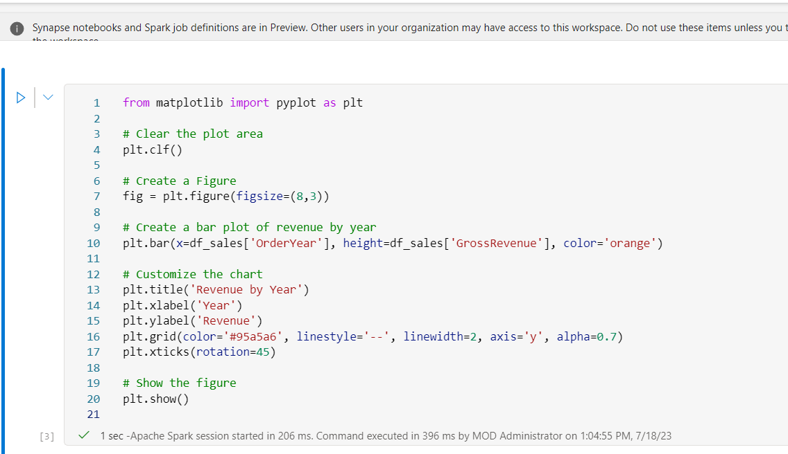

9.  **Re-run** the code cell and view the results. The figure determines
    the shape and size of the plot.

> A figure can contain multiple subplots, each on its own *axis*.

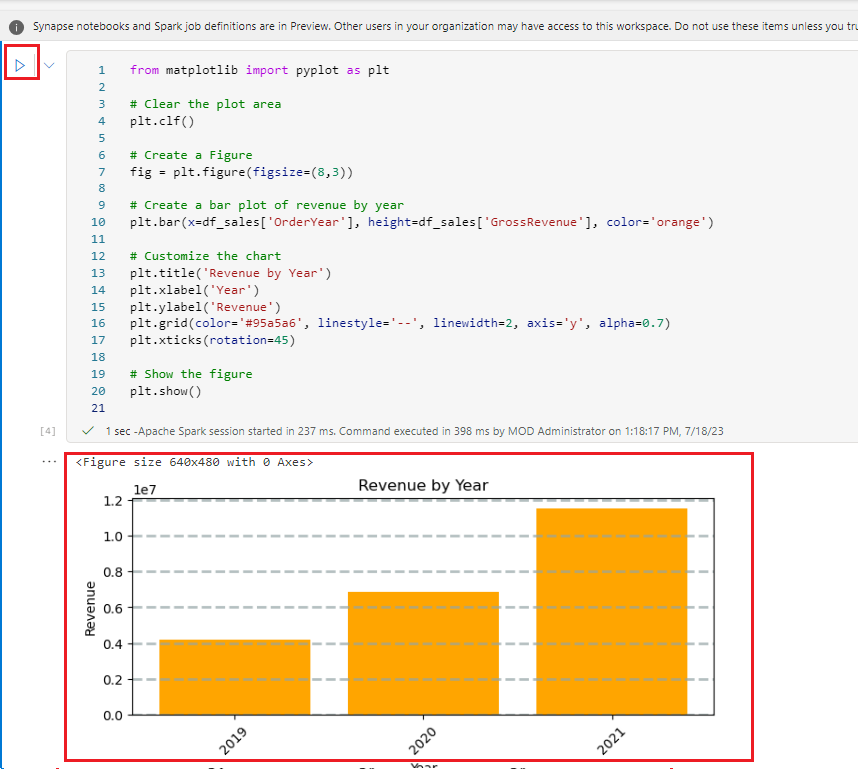

10. Modify the code to plot the chart as follows. **Re-run** the code
    cell and view the results. The figure contains the subplots
    specified in the code.

> CodeCopy
>
> from matplotlib import pyplot as plt
>
> \# Clear the plot area
>
> plt.clf()
>
> \# Create a figure for 2 subplots (1 row, 2 columns)
>
> fig, ax = plt.subplots(1, 2, figsize = (10,4))
>
> \# Create a bar plot of revenue by year on the first axis
>
> ax\[0\].bar(x=df_sales\['OrderYear'\],
> height=df_sales\['GrossRevenue'\], color='orange')
>
> ax\[0\].set_title('Revenue by Year')
>
> \# Create a pie chart of yearly order counts on the second axis
>
> yearly_counts = df_sales\['OrderYear'\].value_counts()
>
> ax\[1\].pie(yearly_counts)
>
> ax\[1\].set_title('Orders per Year')
>
> ax\[1\].legend(yearly_counts.keys().tolist())
>
> \# Add a title to the Figure
>
> fig.suptitle('Sales Data')
>
> \# Show the figure
>
> plt.show()

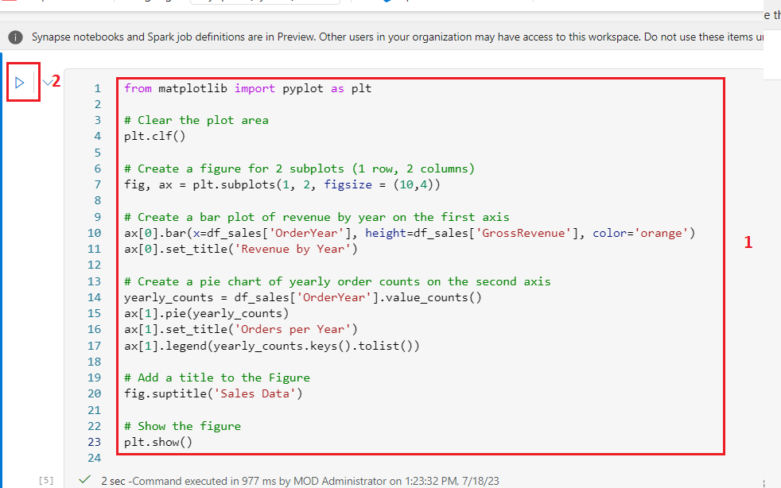

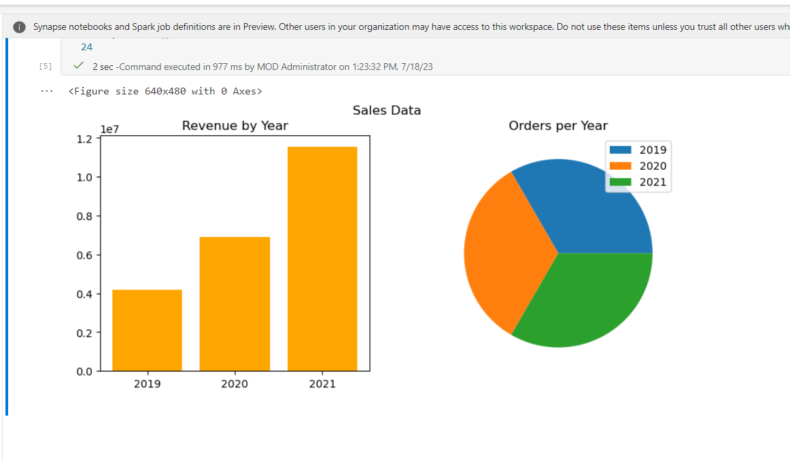

**Note**: To learn more about plotting with matplotlib, see
the [<u>matplotlib documentation</u>](https://matplotlib.org/).

## Task 3: Use the seaborn library

While **matplotlib** enables you to create complex charts of multiple
types, it can require some complex code to achieve the best results. For
this reason, over the years, many new libraries have been built on the
base of matplotlib to abstract its complexity and enhance its
capabilities. One such library is **seaborn**.

1.  Click on **+ Code** and copy and paste the below code.

CodeCopy

> import seaborn as sns
>
> \# Clear the plot area
>
> plt.clf()
>
> \# Create a bar chart
>
> ax = sns.barplot(x="OrderYear", y="GrossRevenue", data=df_sales)
>
> plt.show()

2.  **Run** the code and observe that it displays a bar chart using the
    seaborn library.

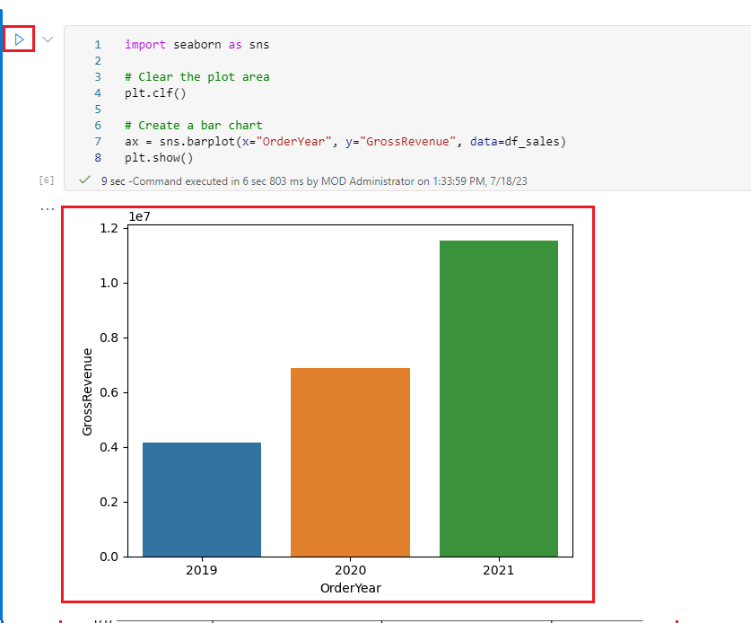

3.  **Modify** the code as follows. **Run** the modified code and note
    that seaborn enables you to set a consistent color theme for your
    plots.

> CodeCopy
>
> import seaborn as sns
>
> \# Clear the plot area
>
> plt.clf()
>
> \# Set the visual theme for seaborn
>
> sns.set_theme(style="whitegrid")
>
> \# Create a bar chart
>
> ax = sns.barplot(x="OrderYear", y="GrossRevenue", data=df_sales)
>
> plt.show()
>
> 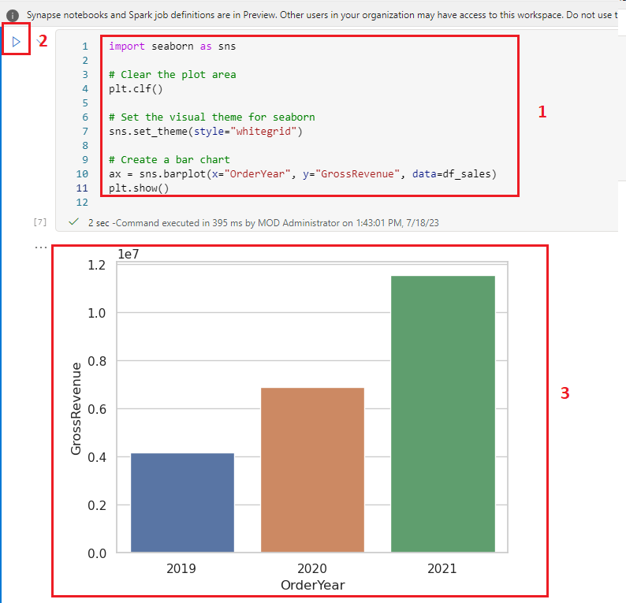 style="width:6.39583in;height:6.15804in" />

4.  **Modify** the code again as follows. **Run** the modified code to
    view the yearly revenue as a line chart.

> CodeCopy
>
> import seaborn as sns
>
> \# Clear the plot area
>
> plt.clf()
>
> \# Create a bar chart
>
> ax = sns.lineplot(x="OrderYear", y="GrossRevenue", data=df_sales)
>
> plt.show()

**Note**: To learn more about plotting with seaborn, see the [<u>seaborn
documentation</u>](https://seaborn.pydata.org/index.html).

## Task 4: Use delta tables for streaming data

Delta lake supports streaming data. Delta tables can be a *sink* or
a *source* for data streams created using the Spark Structured Streaming
API. In this example, you’ll use a delta table as a sink for some
streaming data in a simulated internet of things (IoT) scenario.

1.  Click on **+ Code** and copy and paste the below code and then click
    on **Run cell** button.

CodeCopy

> from notebookutils import mssparkutils
>
> from pyspark.sql.types import \*
>
> from pyspark.sql.functions import \*
>
> \# Create a folder
>
> inputPath = 'Files/data/'
>
> mssparkutils.fs.mkdirs(inputPath)
>
> \# Create a stream that reads data from the folder, using a JSON
> schema
>
> jsonSchema = StructType(\[
>
> StructField("device", StringType(), False),
>
> StructField("status", StringType(), False)
>
> \])
>
> iotstream =
> spark.readStream.schema(jsonSchema).option("maxFilesPerTrigger",
> 1).json(inputPath)
>
> \# Write some event data to the folder
>
> device_data = '''{"device":"Dev1","status":"ok"}
>
> {"device":"Dev1","status":"ok"}
>
> {"device":"Dev1","status":"ok"}
>
> {"device":"Dev2","status":"error"}
>
> {"device":"Dev1","status":"ok"}
>
> {"device":"Dev1","status":"error"}
>
> {"device":"Dev2","status":"ok"}
>
> {"device":"Dev2","status":"error"}
>
> {"device":"Dev1","status":"ok"}'''
>
> mssparkutils.fs.put(inputPath + "data.txt", device_data, True)
>
> print("Source stream created...")

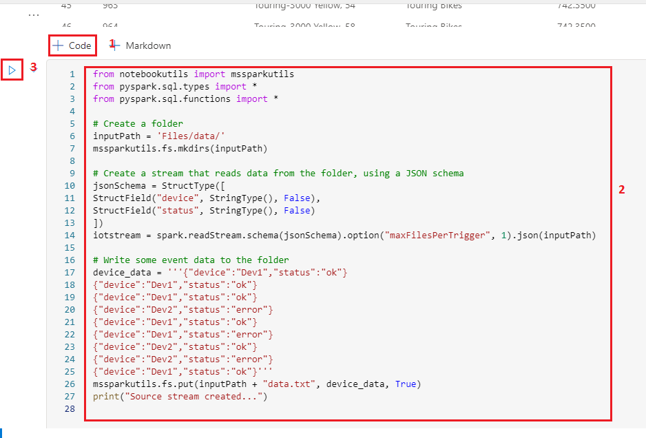

2.  Ensure the message ***Source stream created…*** is printed. The code
    you just ran has created a streaming data source based on a folder
    to which some data has been saved, representing readings from
    hypothetical IoT devices.

3.  Click on **+ Code** and copy and paste the below code and then click
    on **Run cell** button.

CodeCopy

> \# Write the stream to a delta table
>
> delta_stream_table_path = 'Tables/iotdevicedata'
>
> checkpointpath = 'Files/delta/checkpoint'
>
> deltastream =
> iotstream.writeStream.format("delta").option("checkpointLocation",
> checkpointpath).start(delta_stream_table_path)
>
> print("Streaming to delta sink...")

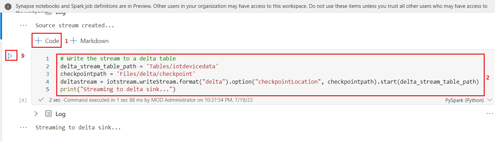

4.  This code writes the streaming device data in delta format to a
    folder named **iotdevicedata**. Because the path for the folder
    location is in the **Tables** folder, a table will automatically be
    created for it. Click on the horizontal ellipses beside table, then
    click on **Refresh**.

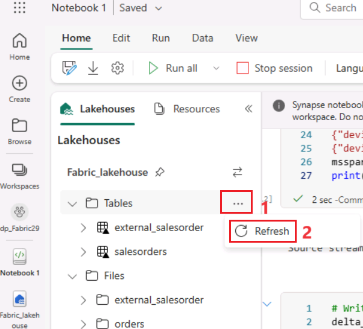

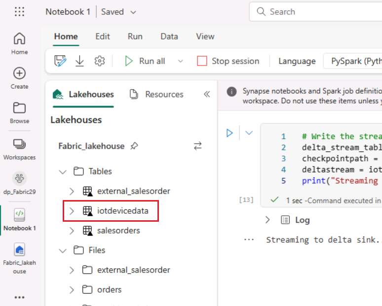

5.  Click on **+ Code** and copy and paste the below code and then click
    on **Run cell** button.

> SqlCopy
>
> %%sql
>
> SELECT \* FROM IotDeviceData;

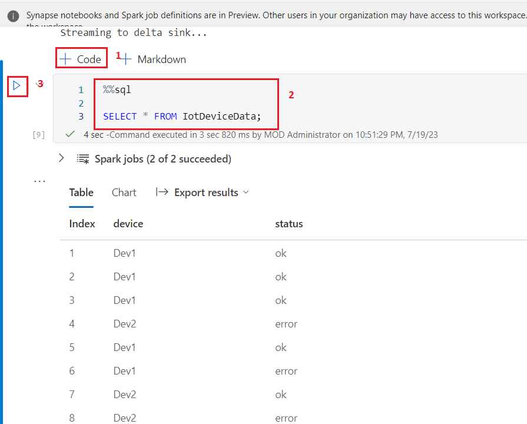

6.  This code queries the **IotDeviceData** table, which contains the
    device data from the streaming source.

7.  Click on **+ Code** and copy and paste the below code and then click
    on **Run cell** button.

> CodeCopy
>
> \# Add more data to the source stream
>
> more_data = '''{"device":"Dev1","status":"ok"}
>
> {"device":"Dev1","status":"ok"}
>
> {"device":"Dev1","status":"ok"}
>
> {"device":"Dev1","status":"ok"}
>
> {"device":"Dev1","status":"error"}
>
> {"device":"Dev2","status":"error"}
>
> {"device":"Dev1","status":"ok"}'''
>
> mssparkutils.fs.put(inputPath + "more-data.txt", more_data, True)

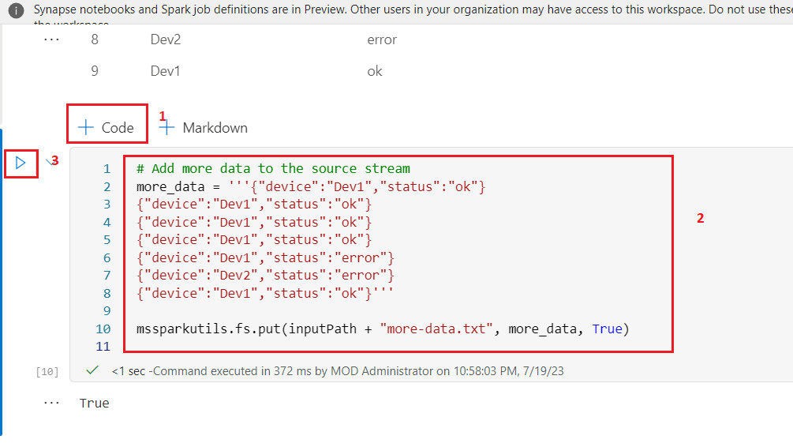

8.  This code writes more hypothetical device data to the streaming
    source.

9.  Click on **+ Code** and copy and paste the below code and then click
    on **Run cell** button.

> SqlCopy
>
> %%sql
>
> SELECT \* FROM IotDeviceData;
>
> 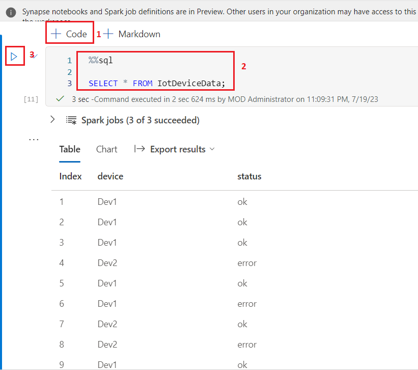 alt="A screenshot of a computer Description automatically generated" />

10. This code queries the **IotDeviceData** table again, which should
    now include the additional data that was added to the streaming
    source.

11. Click on **+ Code** and copy and paste the below code and then click
    on **Run cell** button.

> CodeCopy
>
> deltastream.stop()

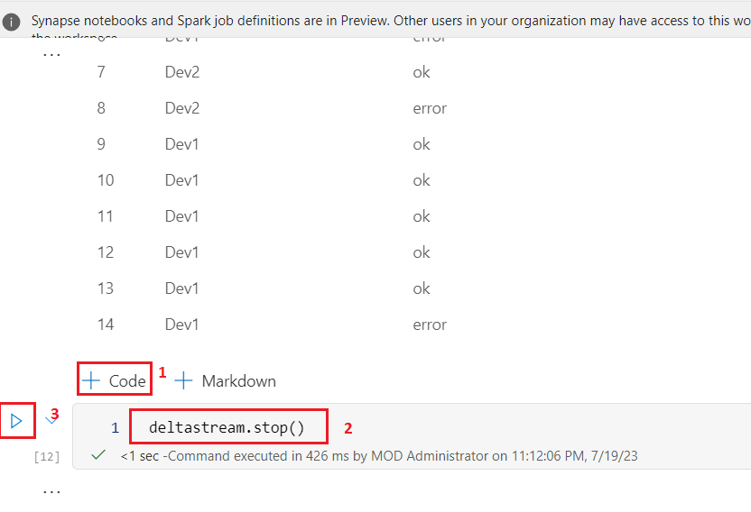

12. This code stops the stream.

## Task 5: Save the notebook and end the Spark session

Now that you’ve finished working with the data, you can save the
notebook with a meaningful name and end the Spark session.

1.  In the notebook menu bar, use the ⚙️ **Settings** icon to view the
    notebook settings.

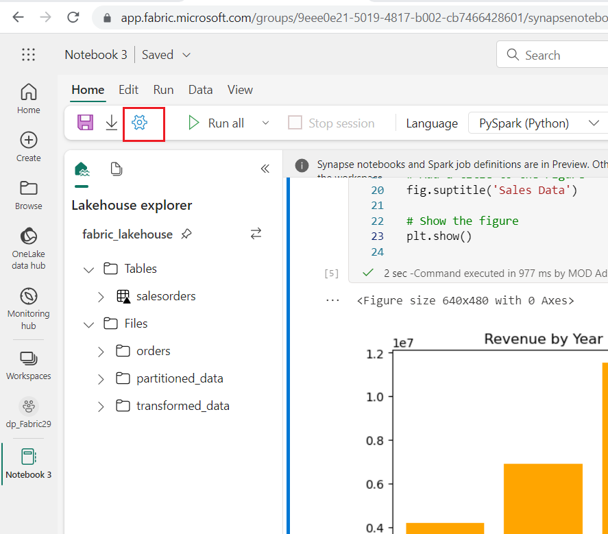

2.  Set the **Name** of the notebook to ++**Explore Sales Orders++**,
    and then close the settings pane.

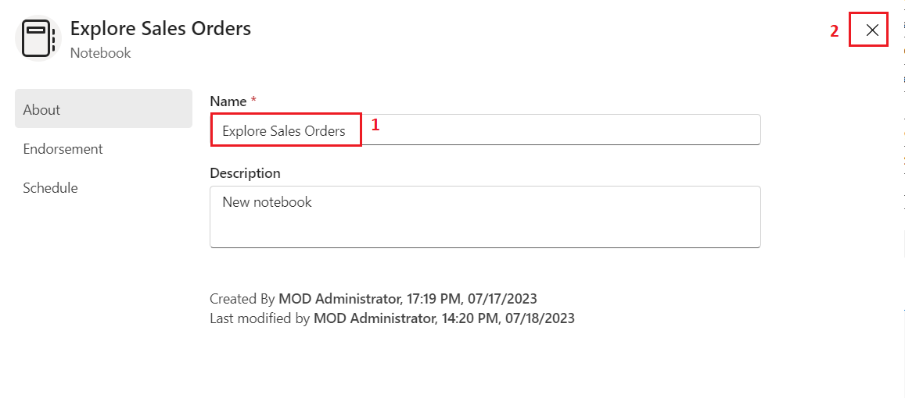

3.  On the notebook menu, select **Stop session** to end the Spark
    session.

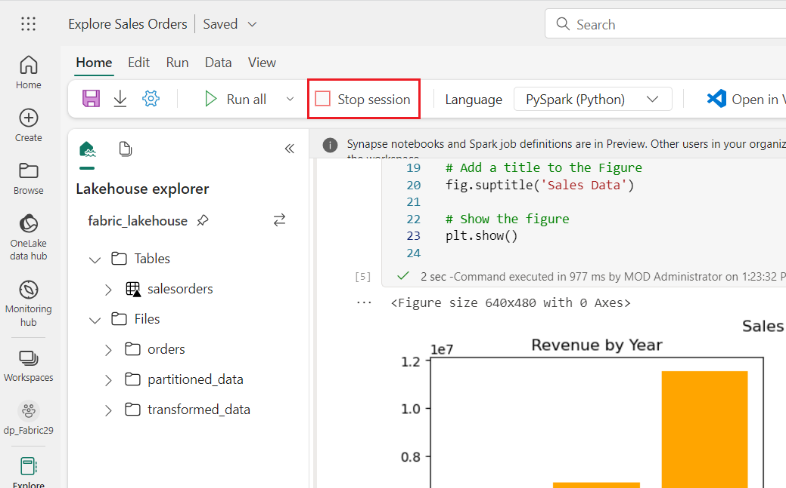

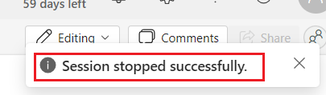

# Exercise 5: Create a Dataflow (Gen2) in Microsoft Fabric

In Microsoft Fabric, Dataflows (Gen2) connect to various data sources
and perform transformations in Power Query Online. They can then be used
in Data Pipelines to ingest data into a lakehouse or other analytical
store, or to define a dataset for a Power BI report.

This exercise is designed to introduce the different elements of
Dataflows (Gen2), and not create a complex solution that may exist in an
enterprise

## Task 1: Create a Dataflow (Gen2) to ingest data

Now that you have a lakehouse, you need to ingest some data into it. One
way to do this is to define a dataflow that encapsulates an *extract,
transform, and load* (ETL) process.

1.  Now, click on **Fabric_lakehouse** on the left-sided navigation
    pane.

2.  In the **Fabric_lakehouse** home page, click on the drop-down arrow
    in the **Get data** and select **New Dataflow Gen2.** The Power
    Query editor for your new dataflow opens.

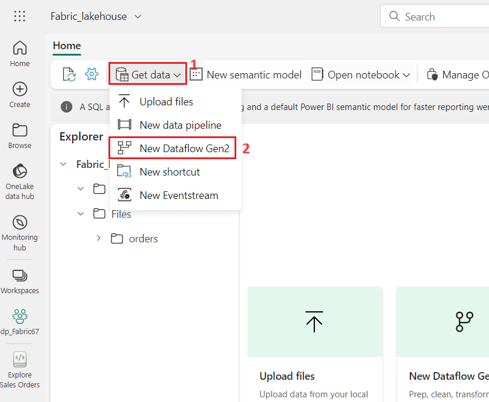

3.  In the **Power Query** pane under the **Home tab**, click on
    **Import from a Text/CSV file**.

4.  In the **Connect to data source** pane, under **Connection
    settings**, select **Upload file (Preview)** radio button, then
    click on **Browse** button and browse your VM **C:\LabFiles**, then
    select the **orders file** and click on the **Open** button.

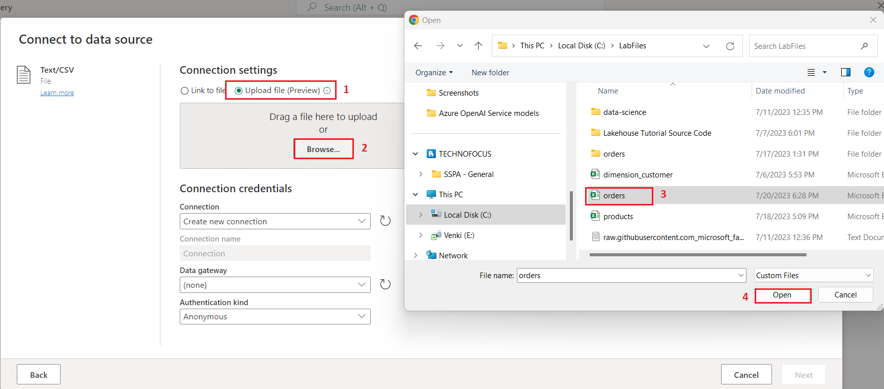

5.  In the **Connect to data source** pane, under **Connection
    credentials,** enter the following details and click on the **Next**
    button.

    - **Connection**: Create new connection

    - **data gateway**: (none)

    - **Authentication kind**: Organizational account

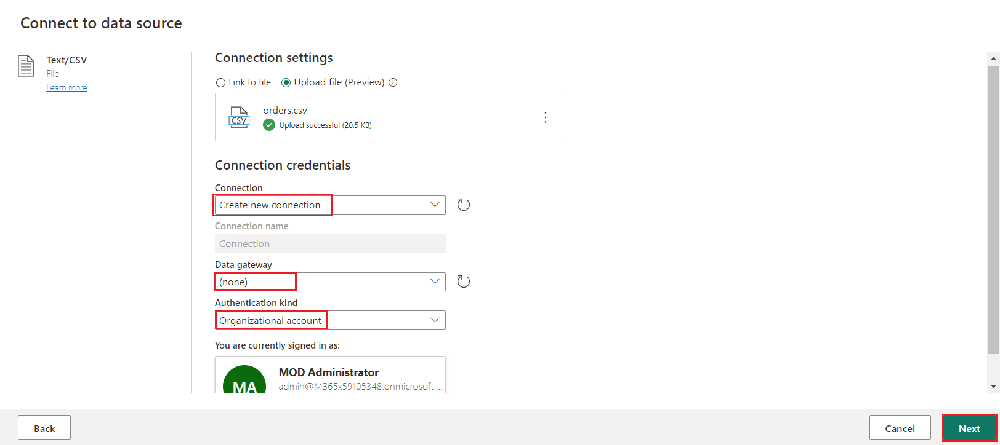

6.  In **Preview file data** pane, click on **Create** to create the
    data source.
    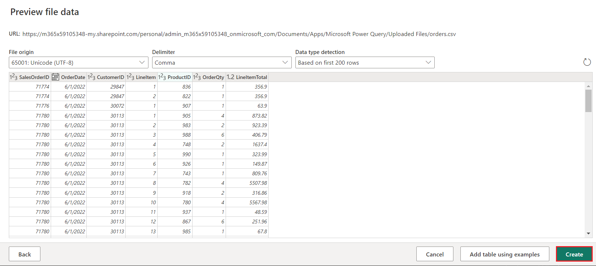

7.  The **Power Query** editor shows the data source and an initial set
    of query steps to format the data.

8.  On the toolbar ribbon, select the **Add column** tab. Then,
    select **Custom column.**

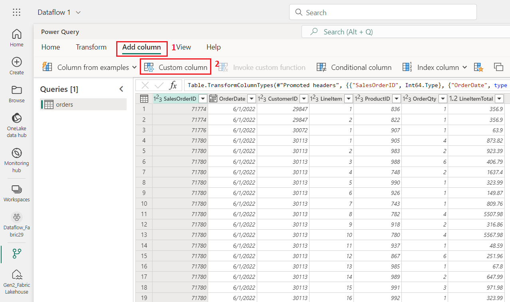 

9.  Set the New column name to **MonthNo** , set the Data type to
    **Whole Number** and then add the following
    formula:**Date.Month(\[OrderDate\])** under **Custom column
    formula**. Select **OK**.

10. Notice how the step to add the custom column is added to the query.
    The resulting column is displayed in the data pane.

**Tip:** In the Query Settings pane on the right side, notice
the **Applied Steps** include each transformation step. At the bottom,
you can also toggle the **Diagram flow** button to turn on the Visual
Diagram of the steps.

Steps can be moved up or down, edited by selecting the gear icon, and
you can select each step to see the transformations apply in the preview
pane.

Task 2: Add data destination for Dataflow

1.  On the **Power Query** toolbar ribbon, select the **Home** tab. Then
    in the D**ata destination** drop-down menu, select **Lakehouse**(if
    not selected already).

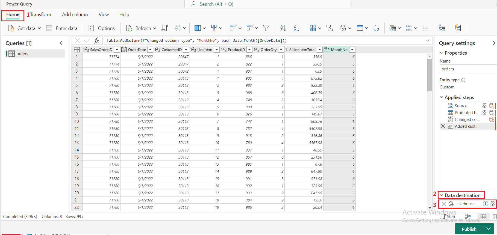

**Note:** If this option is grayed out, you may already have a data
destination set. Check the data destination at the bottom of the Query
settings pane on the right side of the Power Query editor. If a
destination is already set, you can change it using the gear.

2.  Click on the **Settings** icon next to the selected **Lakehouse**
    option.

3.  In the **Connect to data destination** dialog box, select **Edit
    connection.**

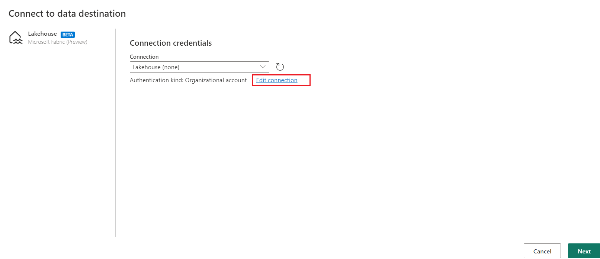

4.  In the **Connect to data destination** dialog box, select **sign
    in** using your Power BI organizational account to set the identity
    that the dataflow uses to access the lakehouse.

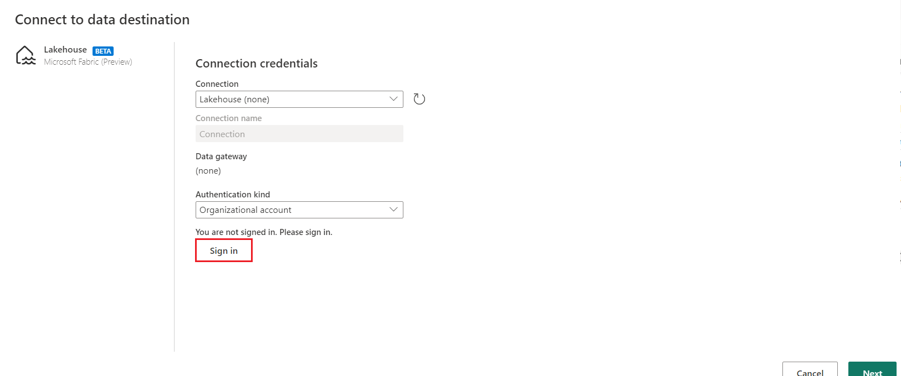

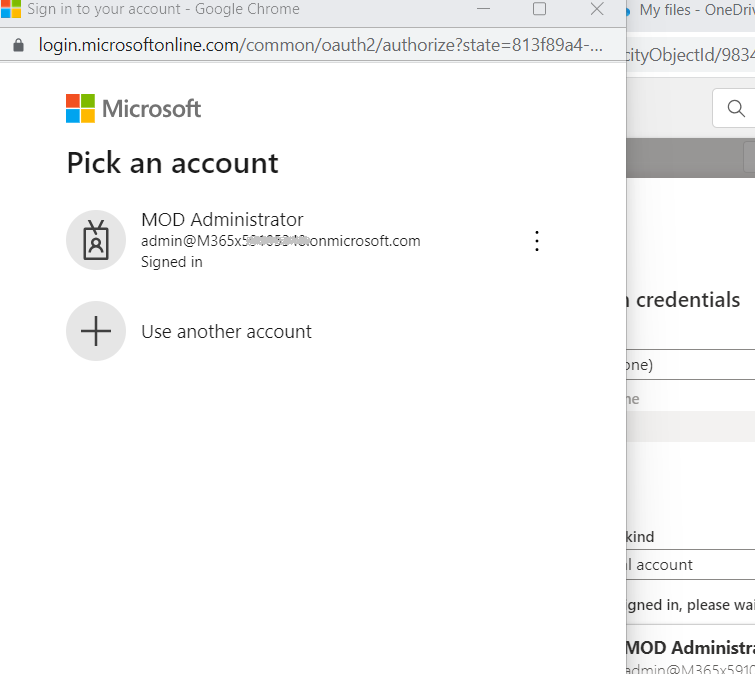

5.  In Connect to data destination dialog box, select **Next**

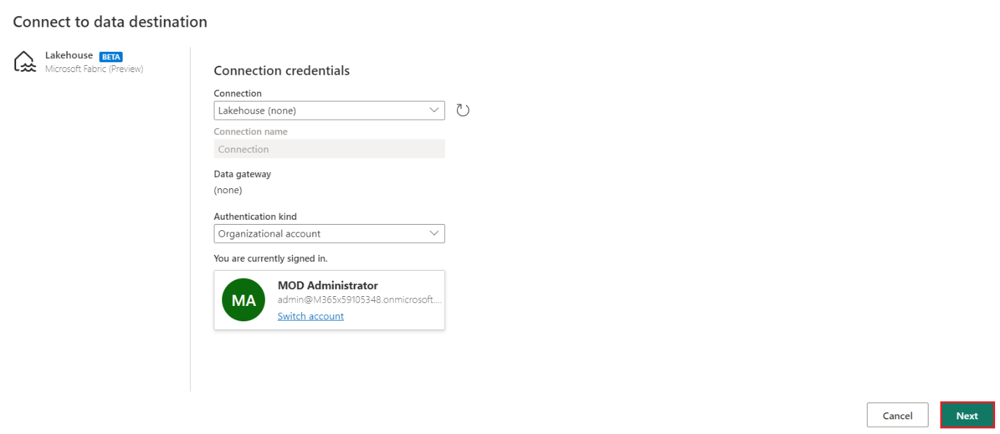

6.  In Connect to data destination dialog box, select **New table**.
    Click on the **Lakehouse folder** ,select your workspace –
    **dp_FabricXX** and then select your lakehouse i.e
    **Fabric_lakehouse.** Then specify the Table name as **orders** and
    select **Next** button.

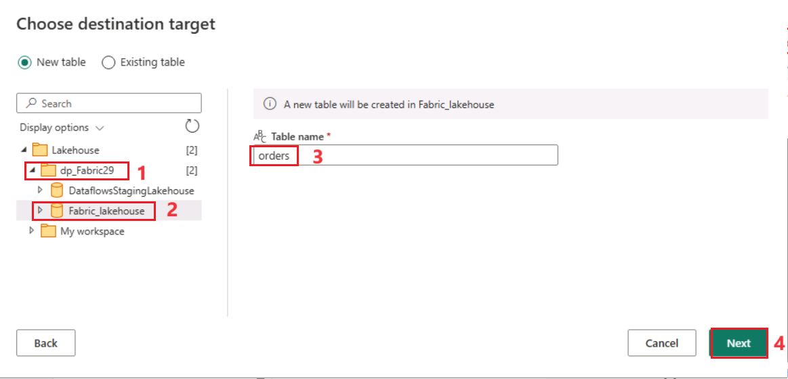

7.  In the **Choose destination settings** dialog box, under **Use
    automatic settings off** and the **Update method** select **Append**
    ,then click on the **Save settings** button.

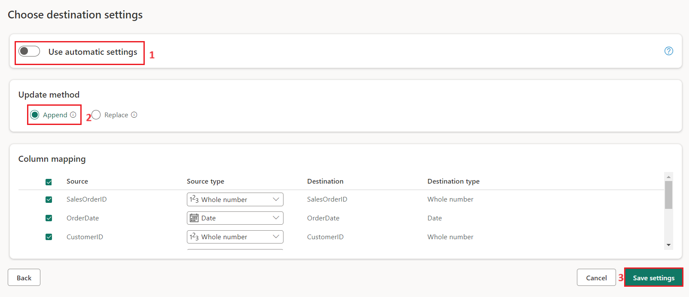

8.  The **Lakehouse** destination is indicated as an **icon** in the
    **query** in the Power Query editor.

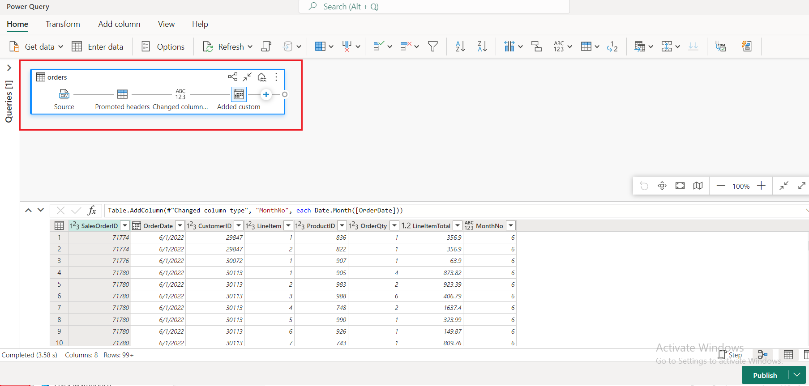

9.  Select **Publish** to publish the dataflow. Then wait for
    the **Dataflow 1** dataflow to be created in your workspace.

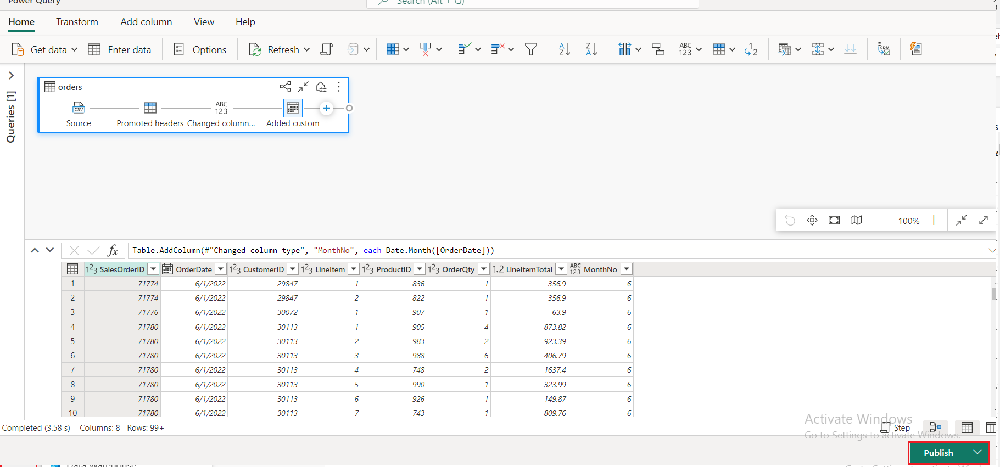

10. Once published, you can right-click on the dataflow in your
    workspace, select **Properties**, and rename your dataflow.

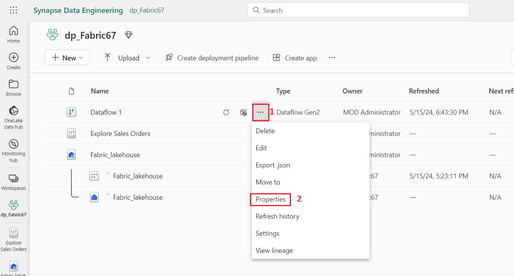

11. In the **Dataflow1** dialog box, enter the **Name** as
    **Gen2_Dataflow** and click on **Save** button.

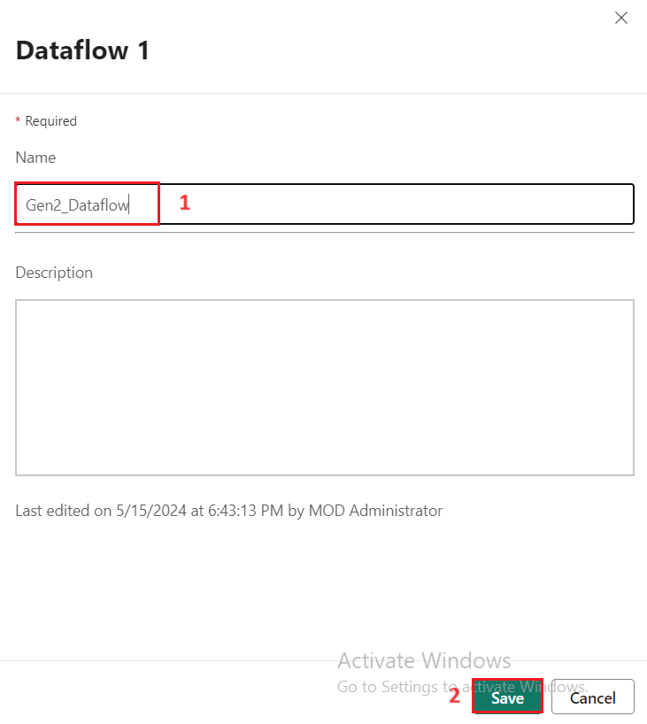

## Task 3: Add a dataflow to a pipeline

You can include a dataflow as an activity in a pipeline. Pipelines are
used to orchestrate data ingestion and processing activities, enabling
you to combine dataflows with other kinds of operation in a single,
scheduled process. Pipelines can be created in a few different
experiences, including Data Factory experience.

1.  In the Synapse Data Engineering Home page , Under **dp_FabricXX**
    pane, select **+New** -\> **Data pipeline**

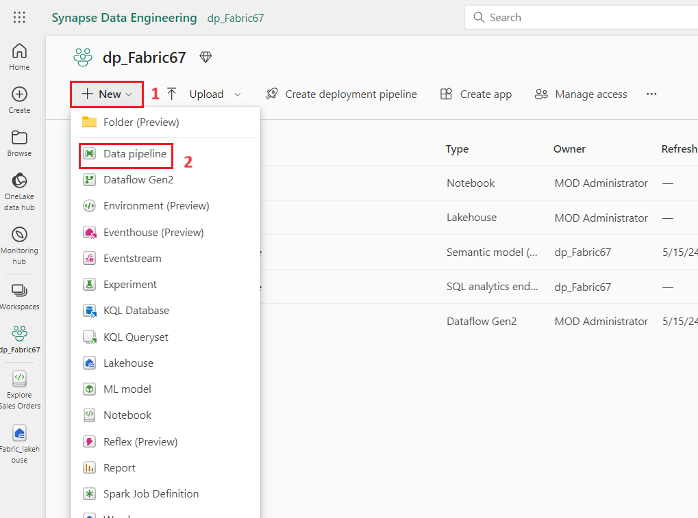

2.  In the **New pipeline** dialog box, enter **Load data** in
    the **Name** field, click on the **Create** button to open the new
    pipeline.

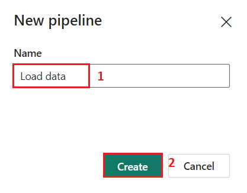

3.  The pipeline editor opens.

> **Tip**: If the Copy Data wizard opens automatically, close it!

4.  Select **Pipeline activity**, and add a **Dataflow** activity to the
    pipeline.

5.  With the new **Dataflow1** activity selected, on
    the **Settings** tab, in the **Dataflow** drop-down list,
    select **Gen2_Dataflow** (the data flow you created previously)

6.  On the **Home** tab, save the pipeline using the **🖫 (*Save*)**
    icon.

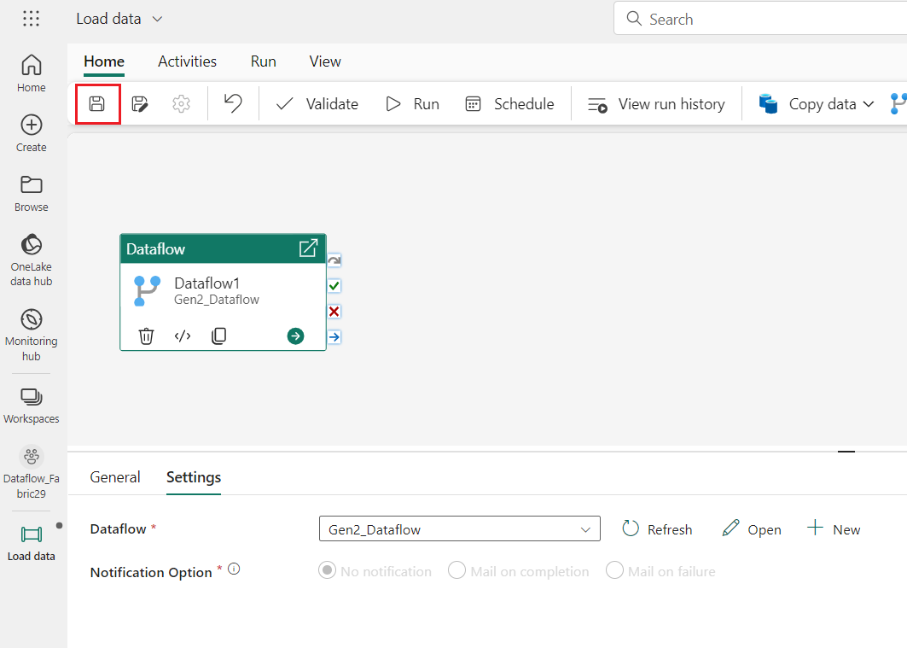

7.  Use the **▷ Run** button to run the pipeline, and wait for it to
    complete. It may take a few minutes.

>  alt="A screenshot of a computer Description automatically generated" />
>
>  alt="A screenshot of a computer Description automatically generated" />

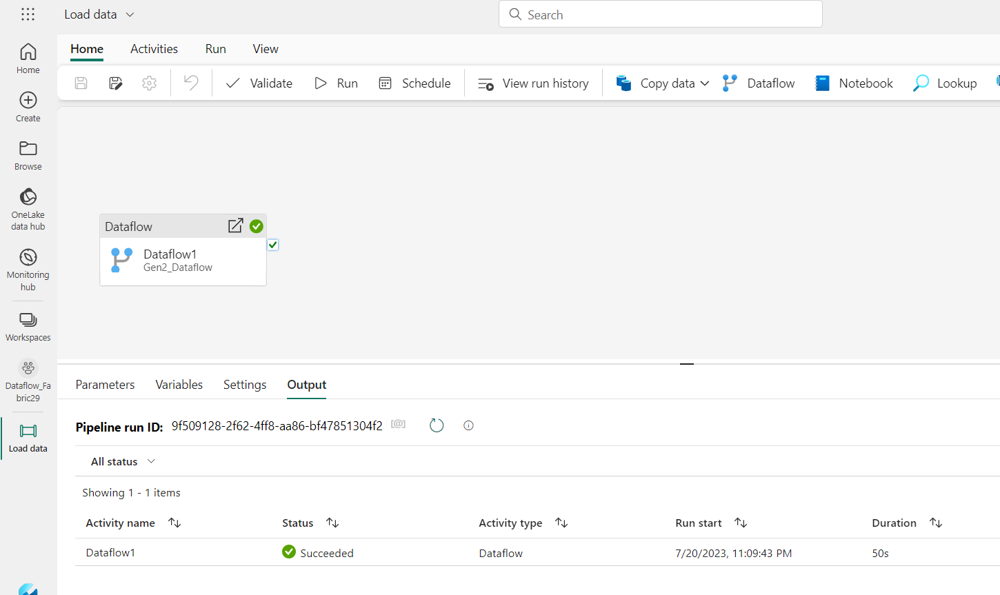

8.  In the menu bar on the left edge, select your workspace i.e
    **dp_FabricXX**.

9.  In the **Fabric_lakehouse** pane, select the
    **Gen2_FabricLakehouse** of type Lakehouse.

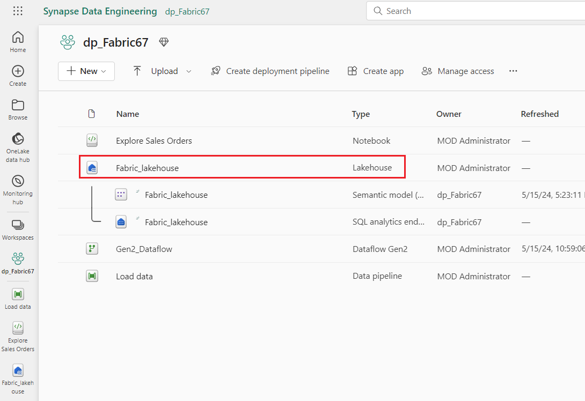

10. In **Explorer** pane, select the **…** menu for **Tables**,
    select **refresh**. Then expand **Tables** and select
    the **orders** table, which has been created by your dataflow.

**Tip**: Use the Power BI Desktop *Dataflows
connector* to connect directly to the data transformations done with
your dataflow.

You can also make additional transformations, publish
as a new dataset, and distribute with intended audience for specialized
datasets.

## Task 4: Clean up resources

In this exercise, you’ve learned how to use Spark to work with data in
Microsoft Fabric.

If you’ve finished exploring your lakehouse, you can delete the
workspace you created for this exercise.

1.  In the bar on the left, select the icon for your workspace to view
    all of the items it contains.

>  alt="A screenshot of a computer Description automatically generated" />

2.  In the **…** menu on the toolbar, select **Workspace settings**.

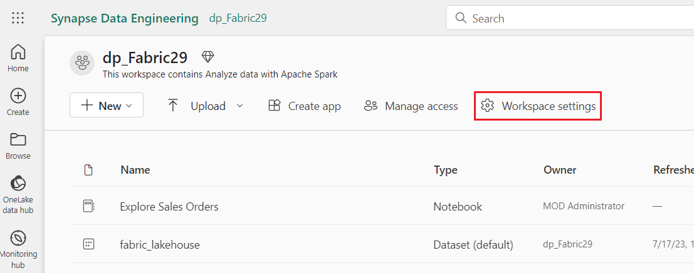

3.  Select **General** and click on **Remove this workspace.**

4.  In the **Delete workspace?** dialog box, click on the **Delete**
    button.

>  alt="A screenshot of a computer Description automatically generated" />
>
>  alt="A screenshot of a computer Description automatically generated" />

**Summary**

This use case guides you through the process of working with Microsoft
Fabric within Power BI. It covers various tasks, including setting up a
workspace, creating a lakehouse, uploading and managing data files, and
using notebooks for data exploration. Participants will learn how to
manipulate and transform data using PySpark, create visualizations, and
save and partition data for efficient querying.

In this use case, participants will engage in a series of tasks focused
on working with delta tables in Microsoft Fabric. The tasks encompass
uploading and exploring data, creating managed and external delta
tables, comparing their properties, the lab introduces SQL capabilities
for managing structured data and provides insights on data visualization
using Python libraries like matplotlib and seaborn. The exercises aim to
provide a comprehensive understanding of utilizing Microsoft Fabric for
data analysis, and incorporating delta tables for streaming data in an
IoT context.

This use case guides you through the process of setting up a Fabric
workspace, creating a data lakehouse, and ingesting data for analysis.
It demonstrates how to define a dataflow to handle ETL operations and
configure data destinations for storing the transformed data.
Additionally, you'll learn how to integrate the dataflow into a pipeline
for automated processing. Finally, you'll be provided with instructions
to clean up resources once the exercise is complete.

This lab equips you with essential skills for working with Fabric,
enabling you to create and manage workspaces, establish data lakehouses,
and perform data transformations efficiently. By incorporating dataflows
into pipelines, you'll learn how to automate data processing tasks,
streamlining your workflow and enhancing productivity in real-world
scenarios. The cleanup instructions ensure you leave no unnecessary
resources, promoting an organized and efficient workspace management
approach.
