# Use Case 06: Modern cloud scale analytics with Azure Databricks and Microsoft Fabric

**Introduction**

In this lab, you will explore the integration of Azure Databricks with
Microsoft Fabric to create and manage a lakehouse using the Medallion
Architecture, create a Delta table with the help of your Azure Data Lake
Storage (ADLS) Gen2 account using Azure Databricks and Ingest data with
Azure Databricks. This hands-on guide will walk you through the steps
required to create a lakehouse, load data into it, and explore the
structured data layers to facilitate efficient data analysis and
reporting.

Medallion architecture consists of three distinct layers (or zones).

- Bronze: Also known as the raw zone, this first layer stores source
  data in its original format. The data in this layer is typically
  append-only and immutable.

- Silver: Also known as the enriched zone, this layer stores data
  sourced from the bronze layer. The raw data has been cleansed and
  standardized, and it's now structured as tables (rows and columns). It
  might also be integrated with other data to provide an enterprise view
  of all business entities, like customer, product, and others.

- Gold: Also known as the curated zone, this final layer stores data
  sourced from the silver layer. The data is refined to meet specific
  downstream business and analytics requirements. Tables typically
  conform to star schema design, which supports the development of data
  models that are optimized for performance and usability.

**Objectives**:

- Understand the principles of Medallion Architecture within Microsoft
  Fabric Lakehouse.

- Implement a structured data management process using Medallion layers
  (Bronze, Silver, Gold).

- Transform raw data into validated and enriched data for advanced
  analytics and reporting.

- Learn best practices for data security, CI/CD, and efficient data
  querying.

- Upload data to OneLake with the OneLake file explorer.

- Use a Fabric notebook to read data on OneLake and write back as a
  Delta table.

- Analyze and transform data with Spark using a Fabric notebook.

- Query one copy of data on OneLake with SQL.

- Create a Delta table in your Azure Data Lake Storage (ADLS) Gen2
  account using Azure Databricks.

- Create a OneLake shortcut to a Delta table in ADLS.

- Use Power BI to analyze data via the ADLS shortcut.

- Read and modify a Delta table in OneLake with Azure Databricks.

# Exercise 1: Bringing your sample data to Lakehouse

In this exercise, you'll go through the process of creating a lakehouse
and loading data into it using Microsoft Fabric.

## **Task 1: Create a Fabric workspace**

In this task, you create a Fabric workspace. The workspace contains all
the items needed for this lakehouse tutorial, which includes lakehouse,
dataflows, Data Factory pipelines, the notebooks, Power BI datasets, and
reports.

1.  Open your browser, navigate to the address bar, and type or paste
    the following URL:
    [https://app.fabric.microsoft.com/](https://app.fabric.microsoft.com/,)
    then press the **Enter** button.

>  alt="A search engine window with a red box Description automatically generated with medium confidence" />

2.  Go back to **Power BI** window. On the left side navigation menu of
    Power BI Home page, navigate and click on **Workspaces**.

3.  In the Workspaces pane, click on **+** **New workspace** button**.**

>  style="width:4.20833in;height:8.10833in" />

4.  In the **Create a workspace** pane that appears on the right side,
    enter the following details, and click on the **Apply** button.

| **Name** | **Fabric Lakehouse Tutorial-*XX ****(*XX can be a unique number) (here, we entered **Fabric Lakehouse Tutorial-29**) |
|----|----|
| **Description** | This workspace contains all the items for the lakehouse tutorial |
| **Advanced** | Under **License mode**, select **Trial** |
| **Template apps** | **Check the Develop template apps** |

>  style="width:4.97871in;height:5.01389in" />

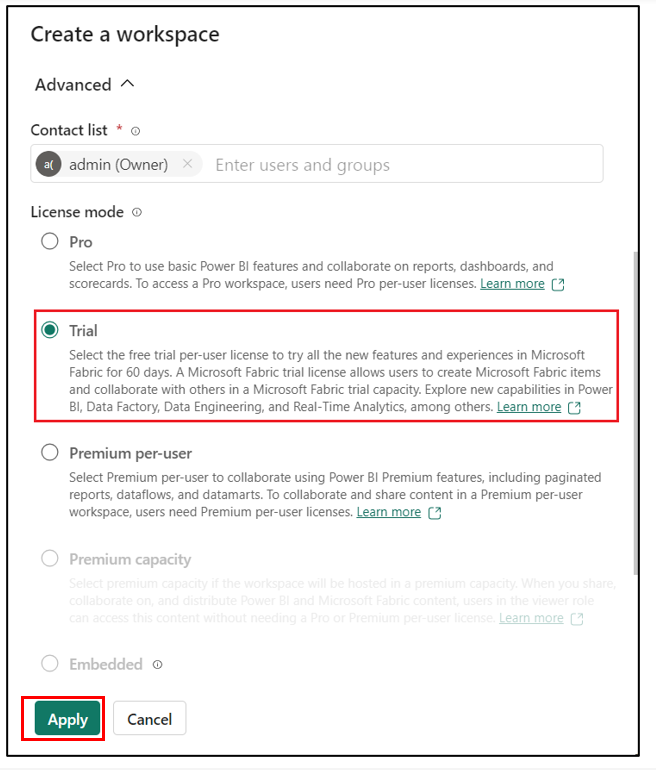

5.  Wait for the deployment to complete. It takes 2-3 minutes to
    complete.

## **Task 2: Create a lakehouse**

1.  In the **Power BI Fabric Lakehouse Tutorial-XX** page, click on the
    **Power BI** icon located at the bottom left and select **Data
    Engineering**.

> 

2.  In the **Synapse** **Data Engineering** **Home** page,
    select **Lakehouse** to create a lakehouse.

3.  In the **New lakehouse** dialog box, enter **wwilakehouse** in
    the **Name** field, click on the **Create** button and open the new
    lakehouse.

> **Note**: Ensure to remove space before **wwilakehouse**.
>
> 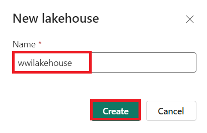
>
> 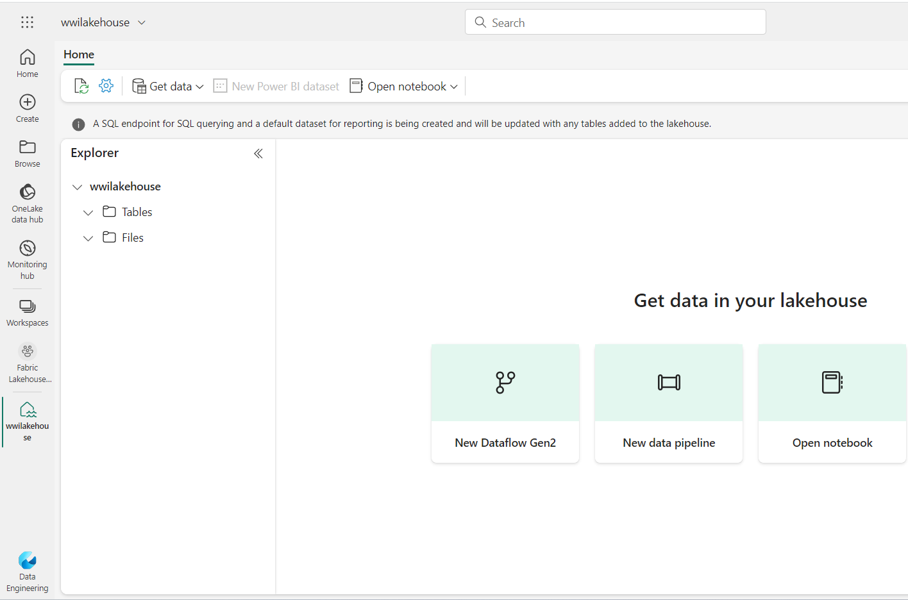 style="width:6.74863in;height:4.46087in" />

4.  You will see a notification stating **Successfully created SQL
    endpoint**.

>  style="width:3.39196in;height:2.88358in" />

# Exercise 2: Implementing the Medallion Architecture using Azure Databricks

## **Task 1: Setting up bronze layer**

1.  In the **wwilakehouse** page, select More icon next to the files
    (…), and select **New subfolder**

2.  On the pop-up provide the Folder name as **bronze**, and select
    Create.

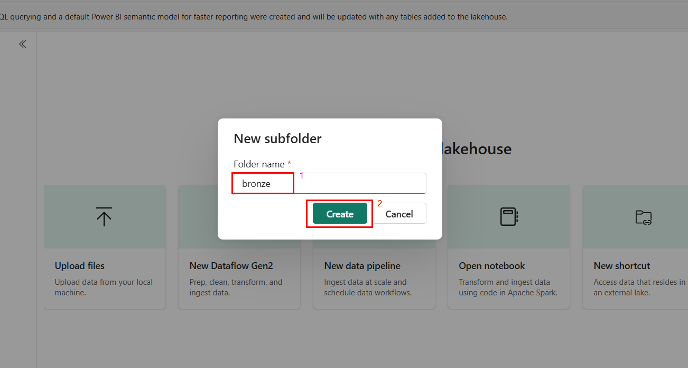

3.  Now, select More icon next to the bronze files (…), and select
    **Upload** and then, **upload files**.

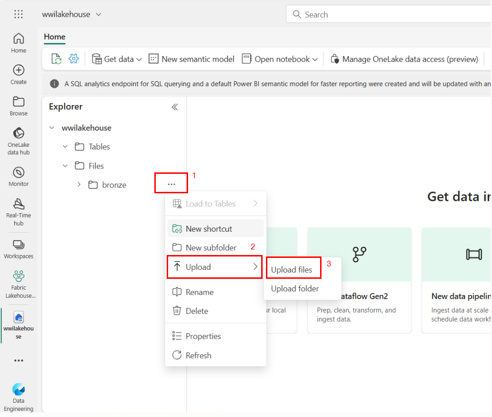

4.  On the **upload file** pane, select the **Upload file** radio
    button. Click on the **Browse button** and browse to
    **C:\LabFiles**, then select required sales data files (2019,
    2020, 2021) file and click on **Open** button.

And then, select **Upload** to upload the files into the new ‘bronze’
folder in your Lakehouse.

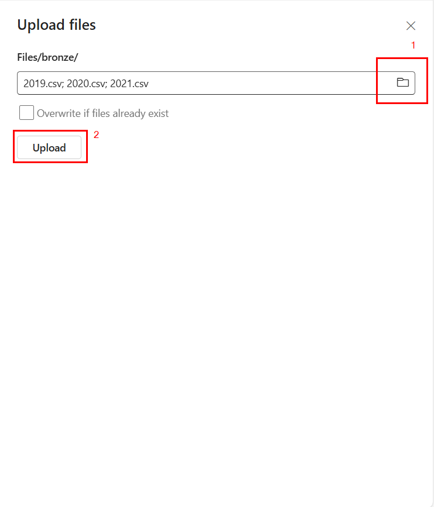

> 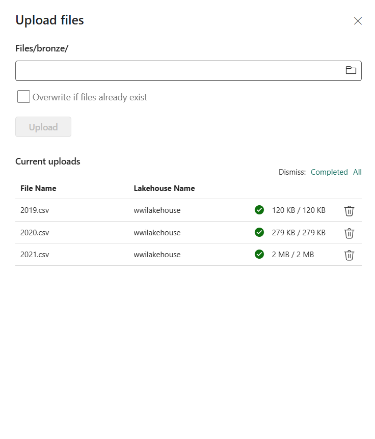 alt="A screenshot of a computer Description automatically generated" />

5.  Click on **bronze** folder to validate that the files have been
    successfully uploaded and the files are reflecting.

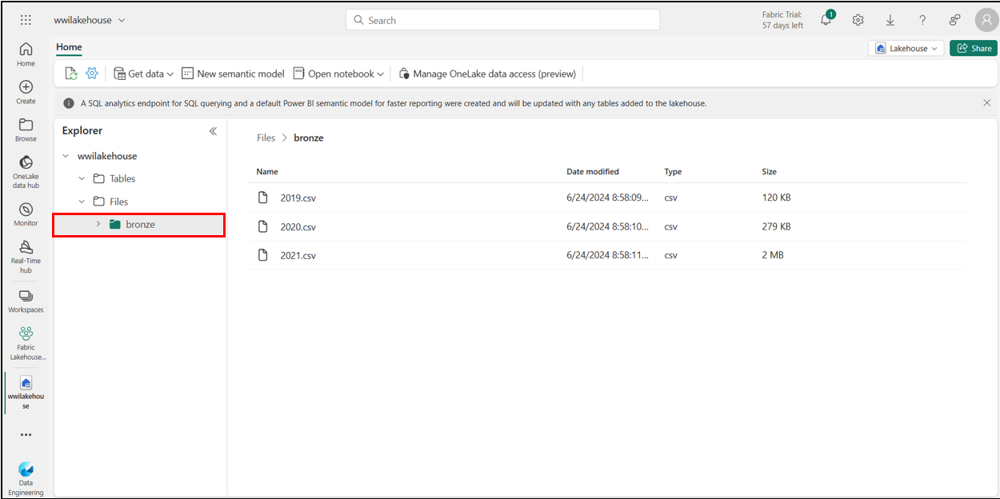

# Exercise 3: Transforming data with Apache Spark and query with SQL in medallion architecture

## **Task 1: Transform data and load to silver Delta table**

In the **wwilakehouse** page, navigate and click on **Open notebook**
drop in the command bar, then select **New notebook**.

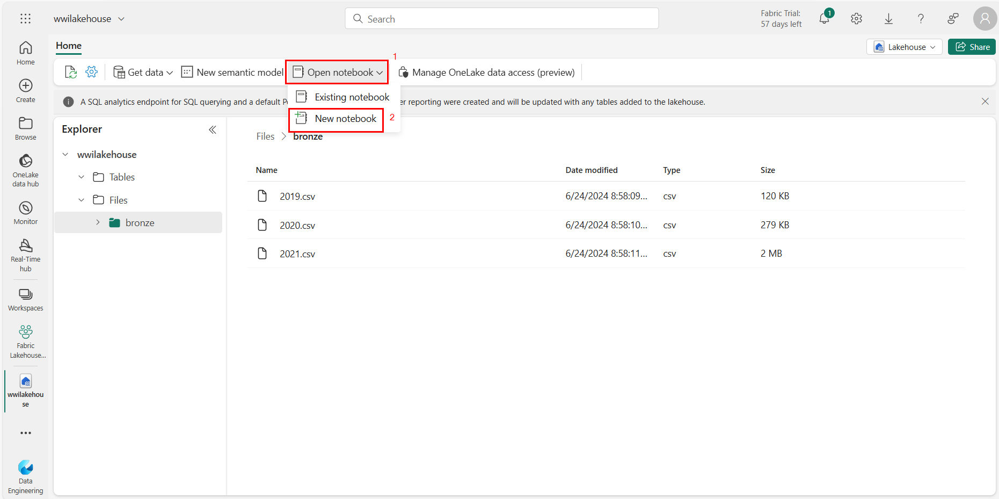

1.  Select the first cell (which is currently a *code* cell), and then
    in the dynamic tool bar at its top-right, use the **M↓** button to
    **convert the cell to a markdown cell**.

2.  When the cell changes to a markdown cell, the text it contains is
    rendered.

3.  Use the **🖉** (Edit) button to switch the cell to editing mode,
    replace all the text then modify the markdown as follows:

CodeCopy

\# Sales order data exploration

Use the code in this notebook to explore sales order data.

4.  Click anywhere in the notebook outside of the cell to stop editing
    it and see the rendered markdown.

5.  Use the + Code icon below the cell output to add a new code cell to
    the notebook.

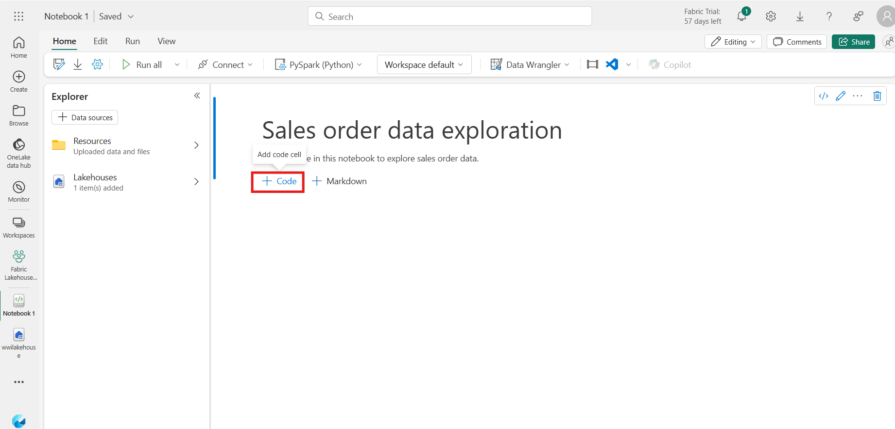

6.  Now, Use the notebook to load the data from the bronze layer into a
    Spark DataFrame.

Select the existing cell in the notebook, which contains some simple
commented-out code. Highlight and delete these two lines - you will not
need this code.

*Note: Notebooks enable you to run code in a variety of languages,
including Python, Scala, and SQL. In this exercise, you’ll use PySpark
and SQL. You can also add markdown cells to provide formatted text and
images to document your code.*

For this, enter the following code in it and click **Run**.

CodeCopy

from pyspark.sql.types import \*

\# Create the schema for the table

orderSchema = StructType(\[

StructField("SalesOrderNumber", StringType()),

StructField("SalesOrderLineNumber", IntegerType()),

StructField("OrderDate", DateType()),

StructField("CustomerName", StringType()),

StructField("Email", StringType()),

StructField("Item", StringType()),

StructField("Quantity", IntegerType()),

StructField("UnitPrice", FloatType()),

StructField("Tax", FloatType())

\])

\# Import all files from bronze folder of lakehouse

df = spark.read.format("csv").option("header",
"true").schema(orderSchema).load("Files/bronze/\*.csv")

\# Display the first 10 rows of the dataframe to preview your data

display(df.head(10))

***Note**: Since this is the first time you’ve run any Spark code in
this notebook, a Spark session must be started. This means that the
first run can take a minute or so to complete. Subsequent runs will be
quicker.*

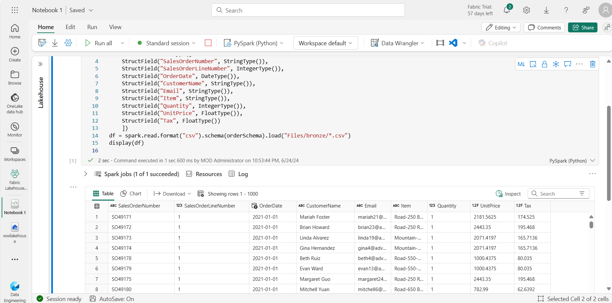

7.  The code you ran loaded the data from the CSV files in
    the **bronze** folder into a Spark dataframe, and then displayed the
    first few rows of the dataframe.

> **Note**: You can clear, hide, and auto-resize the contents of the
> cell output by selecting the **…** menu at the top left of the output
> pane.

8.  Now you’ll **add columns for data validation and cleanup**, using a
    PySpark dataframe to add columns and update the values of some of
    the existing columns. Use the + button to **add a new code
    block** and add the following code to the cell:

> CodeCopy
>
> from pyspark.sql.functions import when, lit, col, current_timestamp,
> input_file_name
>
> \# Add columns IsFlagged, CreatedTS and ModifiedTS
>
> df = df.withColumn("FileName", input_file_name()) \\
>
> .withColumn("IsFlagged", when(col("OrderDate") \<
> '2019-08-01',True).otherwise(False)) \\
>
> .withColumn("CreatedTS", current_timestamp()).withColumn("ModifiedTS",
> current_timestamp())
>
> \# Update CustomerName to "Unknown" if CustomerName null or empty
>
> df = df.withColumn("CustomerName", when((col("CustomerName").isNull()
> \|
> (col("CustomerName")=="")),lit("Unknown")).otherwise(col("CustomerName")))
>
> The first line of the code imports the necessary functions from
> PySpark. You’re then adding new columns to the dataframe so you can
> track the source file name, whether the order was flagged as being a
> before the fiscal year of interest, and when the row was created and
> modified.
>
> Finally, you’re updating the CustomerName column to “Unknown” if it’s
> null or empty.
>
> Then, Run the cell to execute the code using the **\*\*▷** (*Run
> cell*)\*\* button.

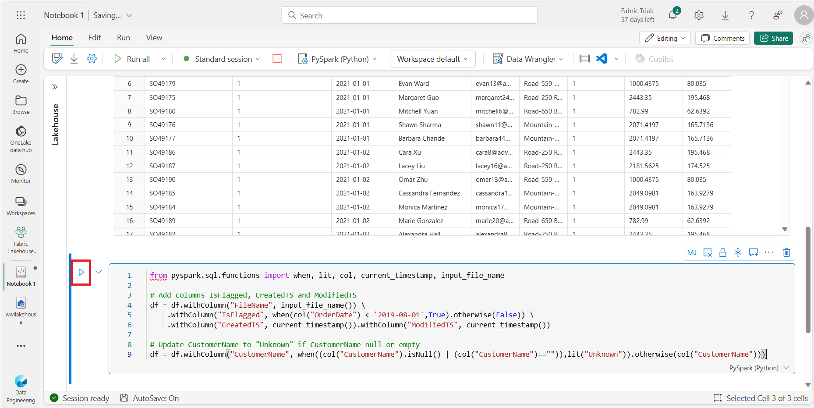

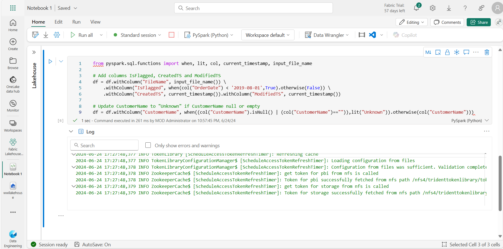

9.  Next, you’ll define the schema for the **sales_silver** table in the
    sales database using Delta Lake format. Create a new code block and
    add the following code to the cell:

> CodeCopy

from pyspark.sql.types import \*

from delta.tables import \*

\# Define the schema for the sales_silver table

silver_table_schema = StructType(\[

    StructField("SalesOrderNumber", StringType(), True),

    StructField("SalesOrderLineNumber", IntegerType(), True),

    StructField("OrderDate", DateType(), True),

    StructField("CustomerName", StringType(), True),

    StructField("Email", StringType(), True),

    StructField("Item", StringType(), True),

    StructField("Quantity", IntegerType(), True),

    StructField("UnitPrice", FloatType(), True),

    StructField("Tax", FloatType(), True),

    StructField("FileName", StringType(), True),

    StructField("IsFlagged", BooleanType(), True),

    StructField("CreatedTS", TimestampType(), True),

    StructField("ModifiedTS", TimestampType(), True)

\])

\# Create or replace the sales_silver table with the defined schema

DeltaTable.createIfNotExists(spark) \\

    .tableName("wwilakehouse.sales_silver") \\

    .addColumns(silver_table_schema) \\

    .execute()

   

10. Run the cell to execute the code using the **\*\*▷** (*Run
    cell*)\*\* button.

11. Select the **…** in the Tables section of the lakehouse explorer
    pane and select **Refresh**. You should now see the
    new **sales_silver** table listed. The **▲** (triangle icon)
    indicates that it’s a Delta table.

> **Note**: If you don’t see the new table, wait a few seconds and then
> select **Refresh** again, or refresh the entire browser tab.
>
> 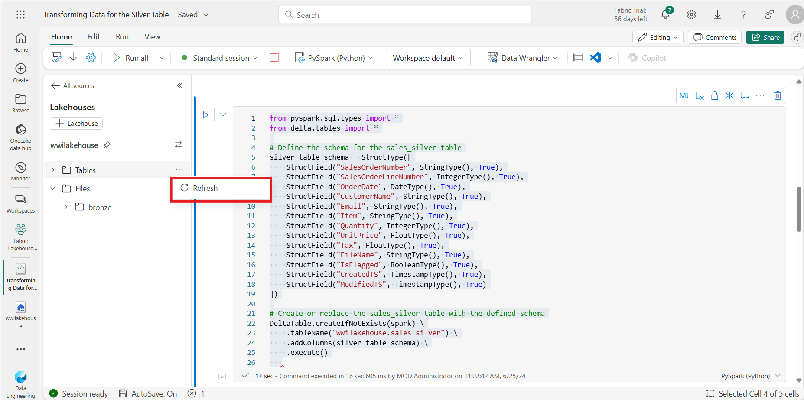 alt="A screenshot of a computer Description automatically generated" />
>
> 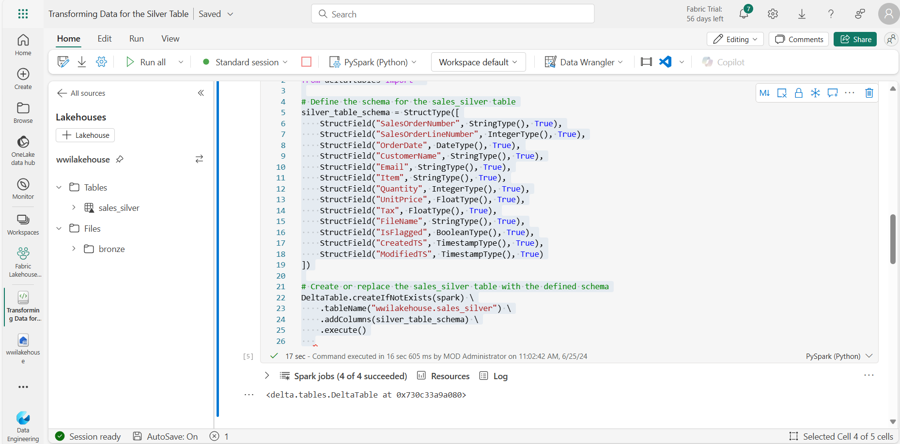 alt="A screenshot of a computer Description automatically generated" />

12. Now you’re going to perform an **upsert operation** on a Delta
    table, updating existing records based on specific conditions and
    inserting new records when no match is found. Add a new code block
    and paste the following code:

> CodeCopy
>
> from pyspark.sql.types import \*
>
> from pyspark.sql.functions import when, lit, col, current_timestamp,
> input_file_name
>
> from delta.tables import \*
>
> \# Define the schema for the source data
>
> orderSchema = StructType(\[
>
> StructField("SalesOrderNumber", StringType(), True),
>
> StructField("SalesOrderLineNumber", IntegerType(), True),
>
> StructField("OrderDate", DateType(), True),
>
> StructField("CustomerName", StringType(), True),
>
> StructField("Email", StringType(), True),
>
> StructField("Item", StringType(), True),
>
> StructField("Quantity", IntegerType(), True),
>
> StructField("UnitPrice", FloatType(), True),
>
> StructField("Tax", FloatType(), True)
>
> \])
>
> \# Read data from the bronze folder into a DataFrame
>
> df = spark.read.format("csv").option("header",
> "true").schema(orderSchema).load("Files/bronze/\*.csv")
>
> \# Add additional columns
>
> df = df.withColumn("FileName", input_file_name()) \\
>
> .withColumn("IsFlagged", when(col("OrderDate") \< '2019-08-01',
> True).otherwise(False)) \\
>
> .withColumn("CreatedTS", current_timestamp()) \\
>
> .withColumn("ModifiedTS", current_timestamp()) \\
>
> .withColumn("CustomerName", when((col("CustomerName").isNull()) \|
> (col("CustomerName") == ""),
> lit("Unknown")).otherwise(col("CustomerName")))
>
> \# Define the path to the Delta table
>
> deltaTablePath = "Tables/sales_silver"
>
> \# Create a DeltaTable object for the existing Delta table
>
> deltaTable = DeltaTable.forPath(spark, deltaTablePath)
>
> \# Perform the merge (upsert) operation
>
> deltaTable.alias('silver') \\
>
> .merge(
>
> df.alias('updates'),
>
> 'silver.SalesOrderNumber = updates.SalesOrderNumber AND \\
>
> silver.OrderDate = updates.OrderDate AND \\
>
> silver.CustomerName = updates.CustomerName AND \\
>
> silver.Item = updates.Item'
>
> ) \\
>
> .whenMatchedUpdate(set = {
>
> "SalesOrderLineNumber": "updates.SalesOrderLineNumber",
>
> "Email": "updates.Email",
>
> "Quantity": "updates.Quantity",
>
> "UnitPrice": "updates.UnitPrice",
>
> "Tax": "updates.Tax",
>
> "FileName": "updates.FileName",
>
> "IsFlagged": "updates.IsFlagged",
>
> "ModifiedTS": "current_timestamp()"
>
> }) \\
>
> .whenNotMatchedInsert(values = {
>
> "SalesOrderNumber": "updates.SalesOrderNumber",
>
> "SalesOrderLineNumber": "updates.SalesOrderLineNumber",
>
> "OrderDate": "updates.OrderDate",
>
> "CustomerName": "updates.CustomerName",
>
> "Email": "updates.Email",
>
> "Item": "updates.Item",
>
> "Quantity": "updates.Quantity",
>
> "UnitPrice": "updates.UnitPrice",
>
> "Tax": "updates.Tax",
>
> "FileName": "updates.FileName",
>
> "IsFlagged": "updates.IsFlagged",
>
> "CreatedTS": "current_timestamp()",
>
> "ModifiedTS": "current_timestamp()"
>
> }) \\
>
> .execute()

13. Run the cell to execute the code using the **\*\*▷** (*Run
    cell*)\*\* button.

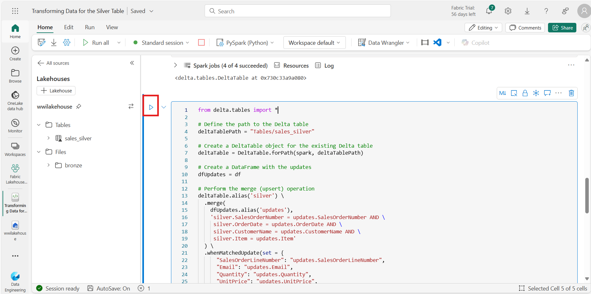

This operation is important because it enables you to update existing
records in the table based on the values of specific columns, and insert
new records when no match is found. This is a common requirement when
you’re loading data from a source system that may contain updates to
existing and new records.

You now have data in your silver delta table that is ready for further
transformation and modelling.

You have successfully taken data from your bronze layer, transformed it,
and loaded it into a silver Delta table. Now you’ll use a new notebook
to transform the data further, model it into a star schema, and load it
into gold Delta tables.

*Note that you could have done all of this in a single notebook, but for
the purposes of this exercise you’re using separate notebooks to
demonstrate the process of transforming data from bronze to silver and
then from silver to gold. This can help with debugging, troubleshooting,
and reuse*.

## **Task 2: Load data into Gold Delta tables**

1.  Return to the Fabric Lakehouse Tutorial-29 home page.

> 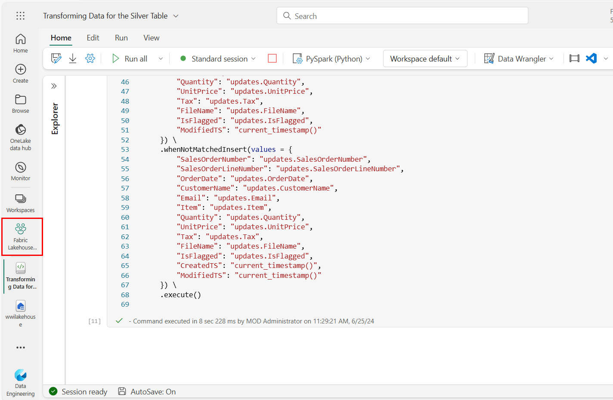 alt="A screenshot of a computer Description automatically generated" />

2.  Select **wwilakehouse.**

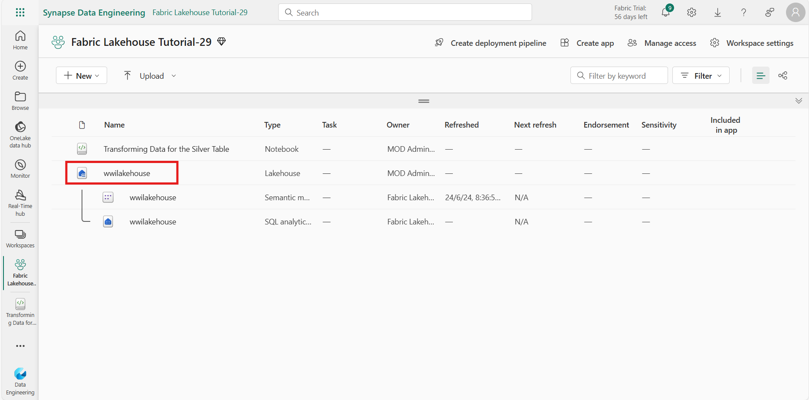

3.  In the lakehouse explorer pane, you should see
    the **sales_silver** table listed in the **Tables** section of the
    explorer pane.

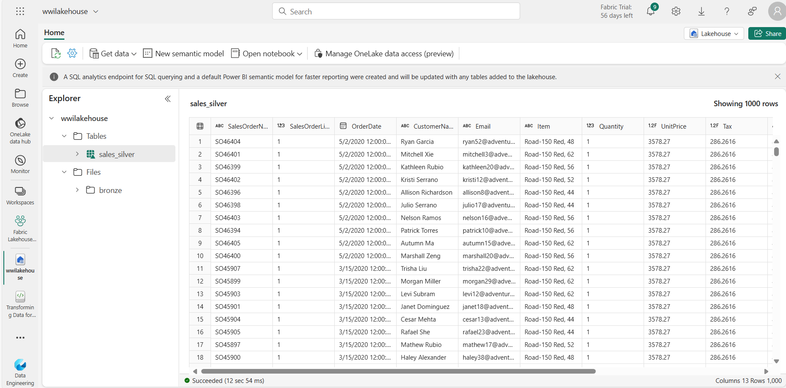

4.  Now, create a new notebook called **Transform data for Gold**. For
    this, navigate and click on **Open notebook** drop in the command
    bar, then select **New notebook**.

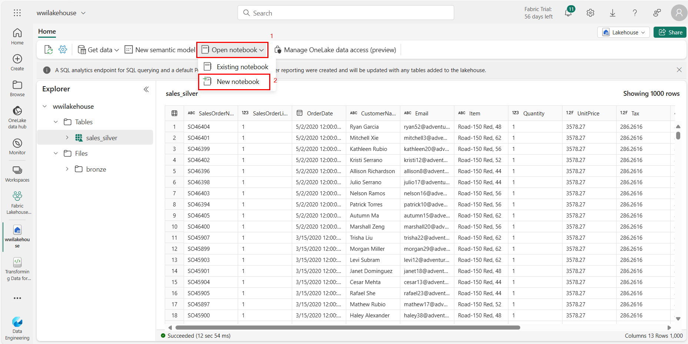

5.  In the existing code block, remove the boilerplate text and **add
    the following code** to load data to your dataframe and start
    building out your star schema, then run it:

> CodeCopy

\# Load data to the dataframe as a starting point to create the gold
layer

df = spark.read.table("wwilakehouse.sales_silver")

\# Display the first few rows of the dataframe to verify the data

df.show()

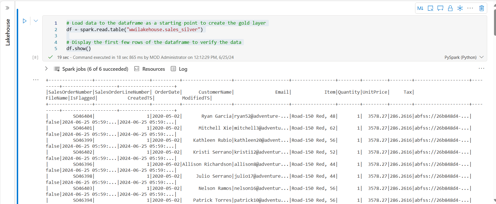

6.  Next**, Add a new code block** and paste the following code to
    create your date dimension table and run it:

 from pyspark.sql.types import \*

 from delta.tables import\*

   

 # Define the schema for the dimdate_gold table

 DeltaTable.createIfNotExists(spark) \\

     .tableName("wwilakehouse.dimdate_gold") \\

     .addColumn("OrderDate", DateType()) \\

     .addColumn("Day", IntegerType()) \\

     .addColumn("Month", IntegerType()) \\

     .addColumn("Year", IntegerType()) \\

     .addColumn("mmmyyyy", StringType()) \\

     .addColumn("yyyymm", StringType()) \\

     .execute()

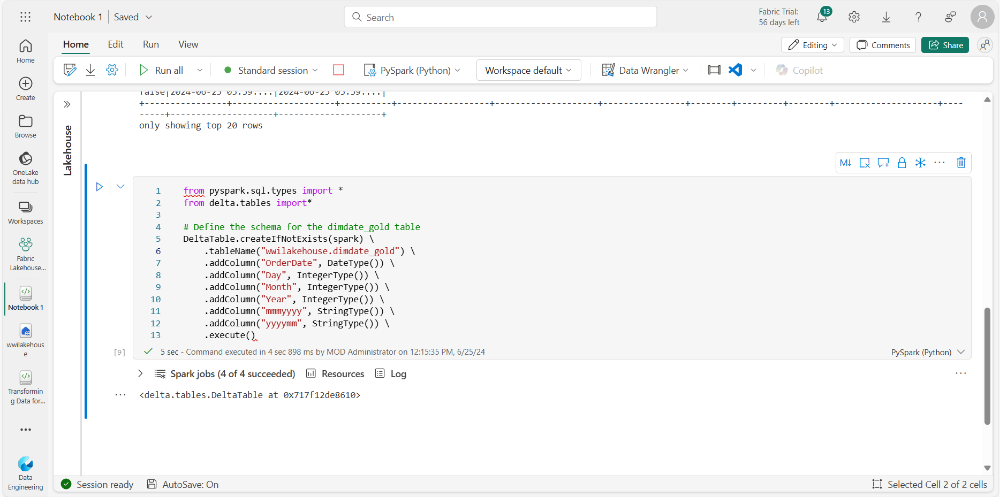

**Note**: You can run the display(df) command at any time to check the
progress of your work. In this case, you’d run ‘display(dfdimDate_gold)’
to see the contents of the dimDate_gold dataframe.

7.  In a new code block, **add and run the following code** to create a
    dataframe for your date dimension, **dimdate_gold**:

> CodeCopy

from pyspark.sql.functions import col, dayofmonth, month, year,
date_format

   

 # Create dataframe for dimDate_gold

   

dfdimDate_gold
=df.dropDuplicates(\["OrderDate"\]).select(col("OrderDate"), \\

         dayofmonth("OrderDate").alias("Day"), \\

         month("OrderDate").alias("Month"), \\

         year("OrderDate").alias("Year"), \\

         date_format(col("OrderDate"), "MMM-yyyy").alias("mmmyyyy"), \\

         date_format(col("OrderDate"), "yyyyMM").alias("yyyymm"), \\

     ).orderBy("OrderDate")

 # Display the first 10 rows of the dataframe to preview your data

display(dfdimDate_gold.head(10))

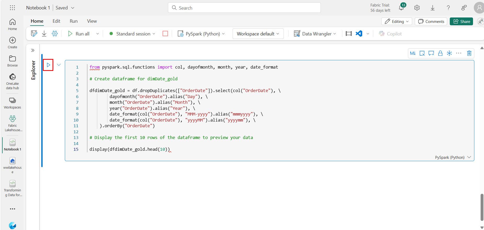

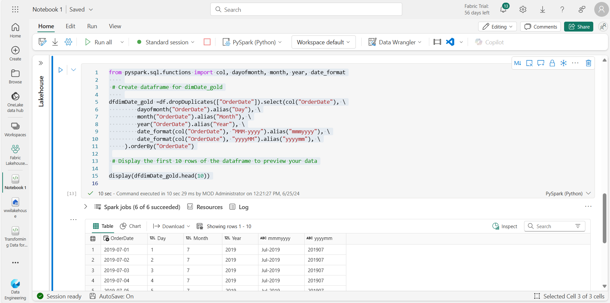

8.  You’re separating the code out into new code blocks so that you can
    understand and watch what’s happening in the notebook as you
    transform the data. In another new code block, **add and run the
    following code** to update the date dimension as new data comes in:

> CodeCopy
>
> from delta.tables import \*
>
> deltaTable = DeltaTable.forPath(spark, 'Tables/dimdate_gold')
>
> dfUpdates = dfdimDate_gold
>
> deltaTable.alias('silver') \\
>
> .merge(
>
> dfUpdates.alias('updates'),
>
> 'silver.OrderDate = updates.OrderDate'
>
> ) \\
>
> .whenMatchedUpdate(set =
>
> {
>
> }
>
> ) \\
>
> .whenNotMatchedInsert(values =
>
> {
>
> "OrderDate": "updates.OrderDate",
>
> "Day": "updates.Day",
>
> "Month": "updates.Month",
>
> "Year": "updates.Year",
>
> "mmmyyyy": "updates.mmmyyyy",
>
> "yyyymm": "yyyymm"
>
> }
>
> ) \\
>
> .execute()

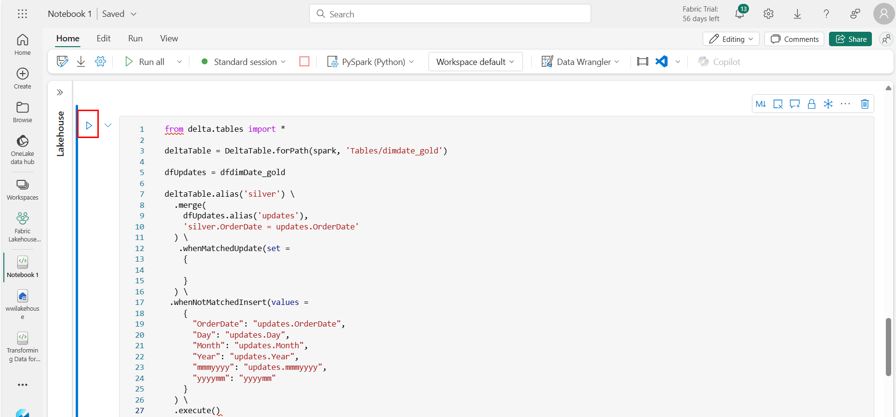

> Your date dimension is all set up.

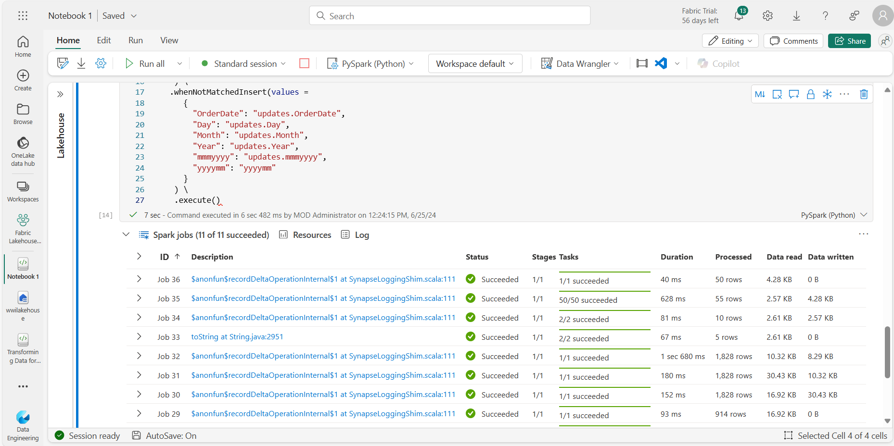

## **Task 3: Create your customer dimension.**

1.  To build out the customer dimension table, **add a new code block**,
    paste and run the following code:

> CodeCopy

 from pyspark.sql.types import \*

 from delta.tables import \*

   

 # Create customer_gold dimension delta table

 DeltaTable.createIfNotExists(spark) \\

     .tableName("wwilakehouse.dimcustomer_gold") \\

     .addColumn("CustomerName", StringType()) \\

     .addColumn("Email",  StringType()) \\

     .addColumn("First", StringType()) \\

     .addColumn("Last", StringType()) \\

     .addColumn("CustomerID", LongType()) \\

     .execute()

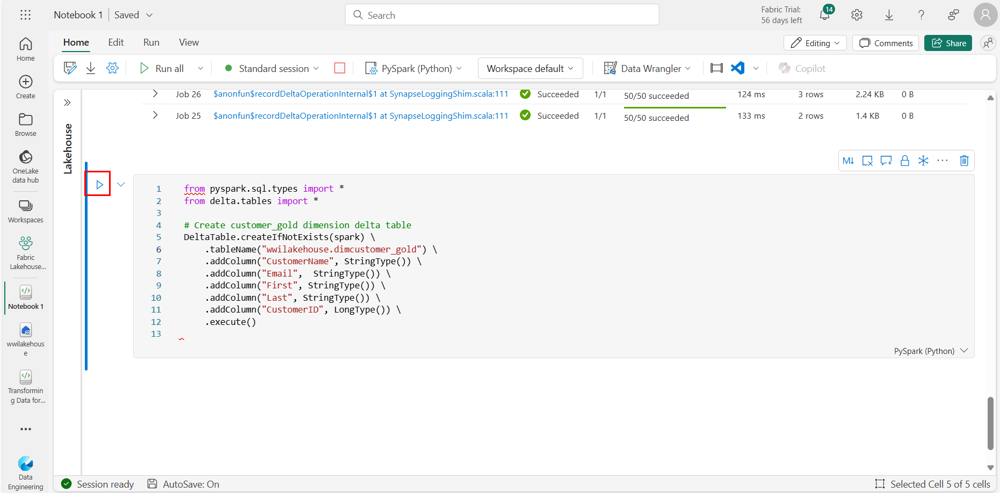

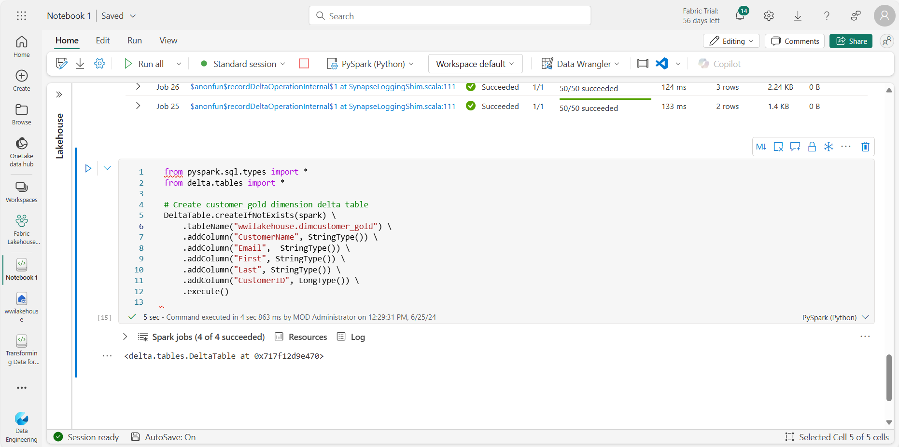

2.  In a new code block, **add and run the following code** to drop
    duplicate customers, select specific columns, and split the
    “CustomerName” column to create “First” and “Last” name columns:

> CodeCopy
>
> from pyspark.sql.functions import col, split
>
> \# Create customer_silver dataframe
>
> dfdimCustomer_silver =
> df.dropDuplicates(\["CustomerName","Email"\]).select(col("CustomerName"),col("Email"))
> \\
>
> .withColumn("First",split(col("CustomerName"), " ").getItem(0)) \\
>
> .withColumn("Last",split(col("CustomerName"), " ").getItem(1))
>
> \# Display the first 10 rows of the dataframe to preview your data
>
> display(dfdimCustomer_silver.head(10))

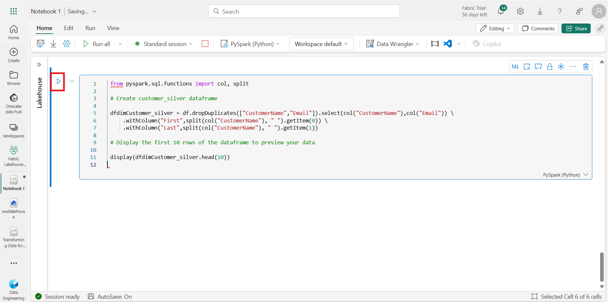

Here you have created a new DataFrame dfdimCustomer_silver by performing
various transformations such as dropping duplicates, selecting specific
columns, and splitting the “CustomerName” column to create “First” and
“Last” name columns. The result is a DataFrame with cleaned and
structured customer data, including separate “First” and “Last” name
columns extracted from the “CustomerName” column.

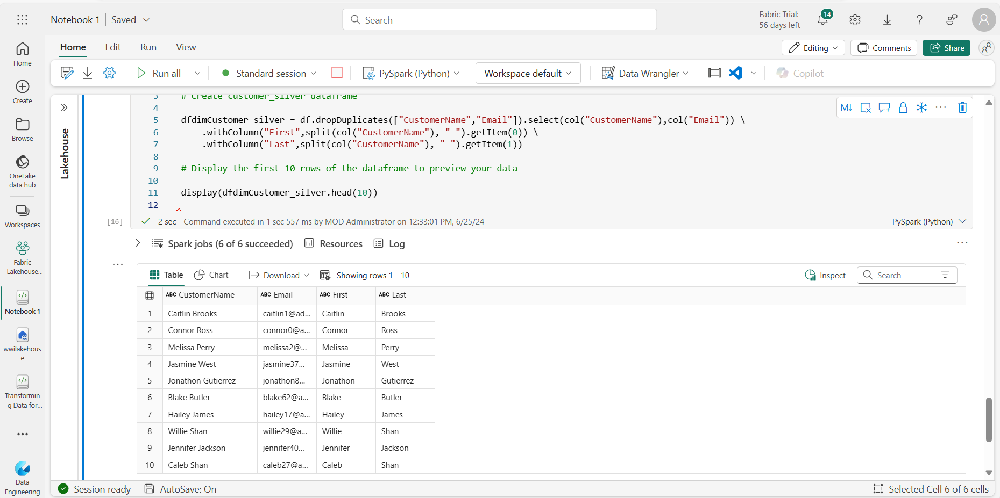

3.  Next, we’ll **create the ID column for our customers**. In a new
    code block, paste and run the following:

CodeCopy

from pyspark.sql.functions import monotonically_increasing_id, col,
when, coalesce, max, lit

\# Read the existing data from the Delta table

dfdimCustomer_temp = spark.read.table("wwilakehouse.dimCustomer_gold")

\# Find the maximum CustomerID or use 0 if the table is empty

MAXCustomerID =
dfdimCustomer_temp.select(coalesce(max(col("CustomerID")),
lit(0)).alias("MAXCustomerID")).first()\[0\]

\# Assume dfdimCustomer_silver is your source DataFrame with new data

\# Here, we select only the new customers by doing a left anti join

dfdimCustomer_gold = dfdimCustomer_silver.join(

    dfdimCustomer_temp,

    (dfdimCustomer_silver.CustomerName ==
dfdimCustomer_temp.CustomerName) &

    (dfdimCustomer_silver.Email == dfdimCustomer_temp.Email),

    "left_anti"

)

\# Add the CustomerID column with unique values starting from
MAXCustomerID + 1

dfdimCustomer_gold = dfdimCustomer_gold.withColumn(

    "CustomerID",

    monotonically_increasing_id() + MAXCustomerID + 1

)

\# Display the first 10 rows of the dataframe to preview your data

dfdimCustomer_gold.show(10)

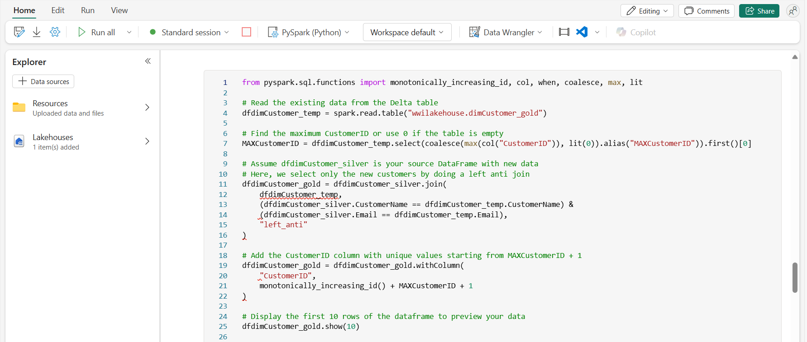

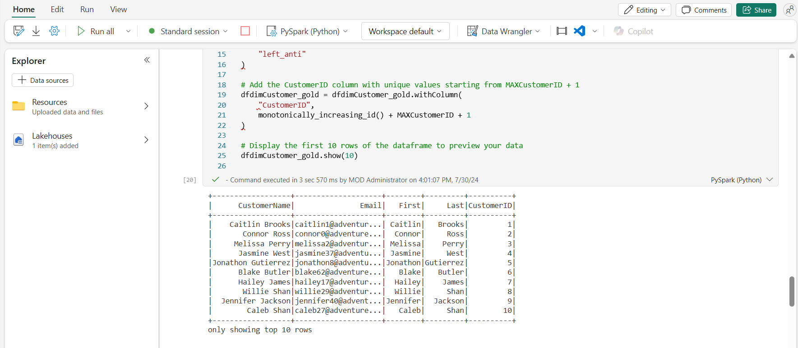

4.  Now you’ll ensure that your customer table remains up-to-date as new
    data comes in. **In a new code block**, paste and run the following:

> CodeCopy

from delta.tables import DeltaTable

\# Define the Delta table path

deltaTable = DeltaTable.forPath(spark, 'Tables/dimcustomer_gold')

\# Use dfUpdates to refer to the DataFrame with new or updated records

dfUpdates = dfdimCustomer_gold

\# Perform the merge operation to update or insert new records

deltaTable.alias('silver') \\

  .merge(

    dfUpdates.alias('updates'),

    'silver.CustomerName = updates.CustomerName AND silver.Email =
updates.Email'

  ) \\

  .whenMatchedUpdate(set =

    {

      "CustomerName": "updates.CustomerName",

      "Email": "updates.Email",

      "First": "updates.First",

      "Last": "updates.Last",

      "CustomerID": "updates.CustomerID"

    }

  ) \\

  .whenNotMatchedInsert(values =

    {

      "CustomerName": "updates.CustomerName",

      "Email": "updates.Email",

      "First": "updates.First",

      "Last": "updates.Last",

      "CustomerID": "updates.CustomerID"

    }

  ) \\

  .execute()

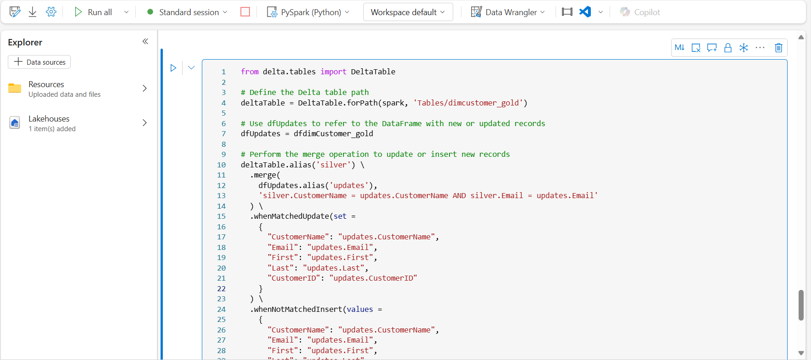

5.  Now you’ll **repeat those steps to create your product dimension**.
    In a new code block, paste and run the following:

> CodeCopy
>
> from pyspark.sql.types import \*
>
> from delta.tables import \*
>
> DeltaTable.createIfNotExists(spark) \\
>
> .tableName("wwilakehouse.dimproduct_gold") \\
>
> .addColumn("ItemName", StringType()) \\
>
> .addColumn("ItemID", LongType()) \\
>
> .addColumn("ItemInfo", StringType()) \\
>
> .execute()

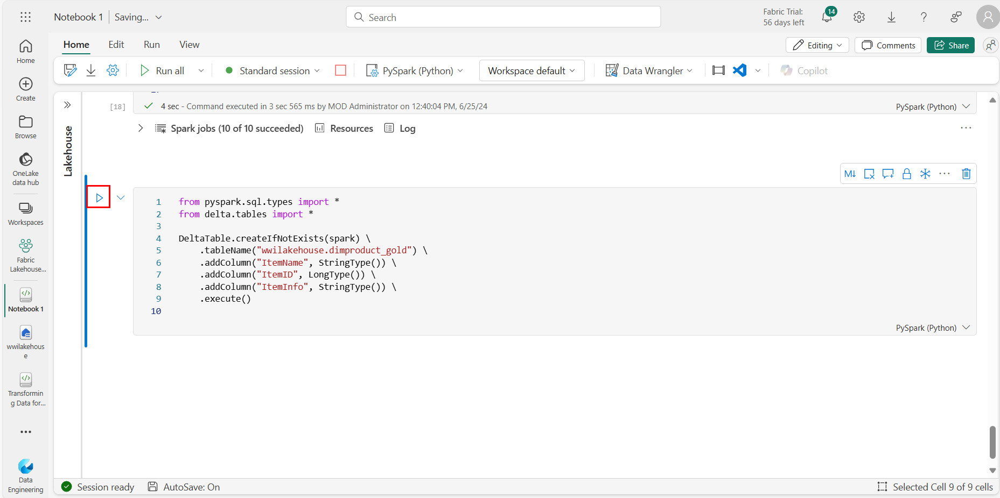

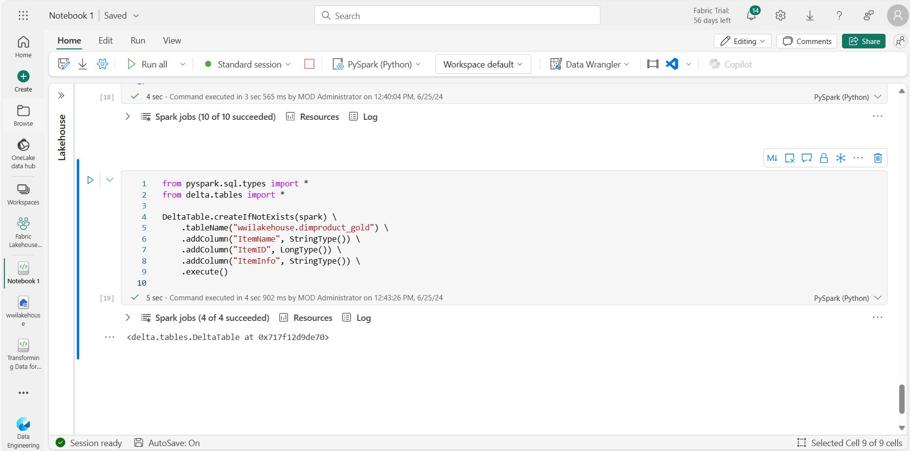

6.  **Add another code block** to create
    the **product_silver** dataframe.

> CodeCopy
>
> from pyspark.sql.functions import col, split, lit
>
> \# Create product_silver dataframe
>
> dfdimProduct_silver =
> df.dropDuplicates(\["Item"\]).select(col("Item")) \\
>
> .withColumn("ItemName",split(col("Item"), ", ").getItem(0)) \\
>
> .withColumn("ItemInfo",when((split(col("Item"), ",
> ").getItem(1).isNull() \| (split(col("Item"), ",
> ").getItem(1)=="")),lit("")).otherwise(split(col("Item"), ",
> ").getItem(1)))
>
> \# Display the first 10 rows of the dataframe to preview your data
>
> display(dfdimProduct_silver.head(10))

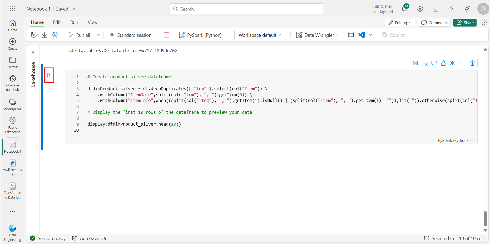

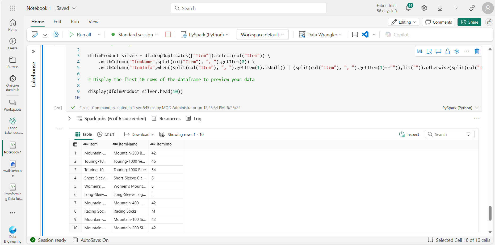

7.  Now you’ll create IDs for your **dimProduct_gold table**. Add the
    following syntax to a new code block and run it:

CodeCopy

from pyspark.sql.functions import monotonically_increasing_id, col, lit,
max, coalesce

\#dfdimProduct_temp = dfdimProduct_silver

dfdimProduct_temp = spark.read.table("wwilakehouse.dimProduct_gold")

MAXProductID =
dfdimProduct_temp.select(coalesce(max(col("ItemID")),lit(0)).alias("MAXItemID")).first()\[0\]

dfdimProduct_gold =
dfdimProduct_silver.join(dfdimProduct_temp,(dfdimProduct_silver.ItemName
== dfdimProduct_temp.ItemName) & (dfdimProduct_silver.ItemInfo ==
dfdimProduct_temp.ItemInfo), "left_anti")

dfdimProduct_gold =
dfdimProduct_gold.withColumn("ItemID",monotonically_increasing_id() +
MAXProductID + 1)

\# Display the first 10 rows of the dataframe to preview your data

display(dfdimProduct_gold.head(10))

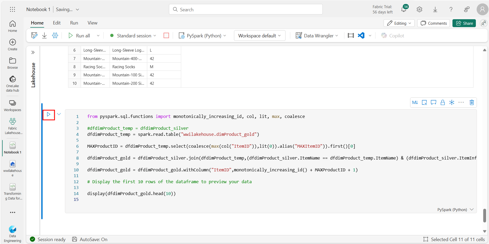

This calculates the next available product ID based on the current data
in the table, assigns these new IDs to the products, and then displays
the updated product information.

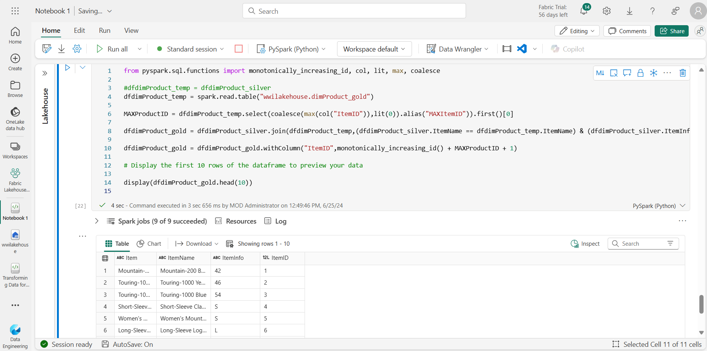

8.  Similar to what you’ve done with your other dimensions, you need to
    ensure that your product table remains up-to-date as new data comes
    in. **In a new code block**, paste and run the following:

CodeCopy

from delta.tables import \*

deltaTable = DeltaTable.forPath(spark, 'Tables/dimproduct_gold')

dfUpdates = dfdimProduct_gold

deltaTable.alias('silver') \\

.merge(

dfUpdates.alias('updates'),

'silver.ItemName = updates.ItemName AND silver.ItemInfo =
updates.ItemInfo'

) \\

.whenMatchedUpdate(set =

{

}

) \\

.whenNotMatchedInsert(values =

{

"ItemName": "updates.ItemName",

"ItemInfo": "updates.ItemInfo",

"ItemID": "updates.ItemID"

}

) \\

.execute()

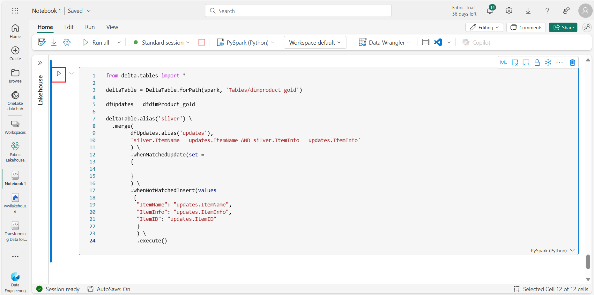

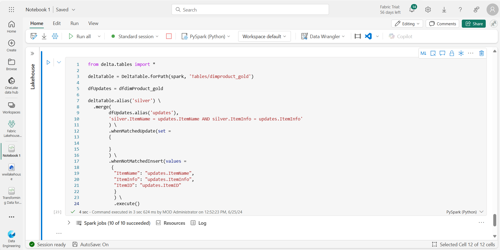

**Now that you have your dimensions built out, the final step is to
create the fact table.**

9.  **In a new code block**, paste and run the following code to create
    the **fact table**:

> CodeCopy
>
> from pyspark.sql.types import \*
>
> from delta.tables import \*
>
> DeltaTable.createIfNotExists(spark) \\
>
> .tableName("wwilakehouse.factsales_gold") \\
>
> .addColumn("CustomerID", LongType()) \\
>
> .addColumn("ItemID", LongType()) \\
>
> .addColumn("OrderDate", DateType()) \\
>
> .addColumn("Quantity", IntegerType()) \\
>
> .addColumn("UnitPrice", FloatType()) \\
>
> .addColumn("Tax", FloatType()) \\
>
> .execute()

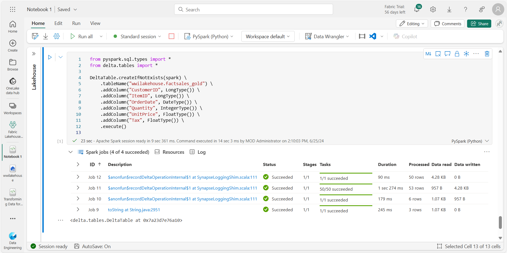

10. **In a new code block**, paste and run the following code to create
    a **new dataframe** to combine sales data with customer and product
    information include customer ID, item ID, order date, quantity, unit
    price, and tax:

CodeCopy

from pyspark.sql import SparkSession

from pyspark.sql.functions import split, col, when, lit

from pyspark.sql.types import StructType, StructField, StringType,
IntegerType, DateType, FloatType, BooleanType, TimestampType

\# Initialize Spark session

spark = SparkSession.builder \\

    .appName("DeltaTableUpsert") \\

    .config("spark.sql.extensions",
"io.delta.sql.DeltaSparkSessionExtension") \\

    .config("spark.sql.catalog.spark_catalog",
"org.apache.spark.sql.delta.catalog.DeltaCatalog") \\

    .getOrCreate()

\# Define the schema for the sales_silver table

silver_table_schema = StructType(\[

    StructField("SalesOrderNumber", StringType(), True),

    StructField("SalesOrderLineNumber", IntegerType(), True),

    StructField("OrderDate", DateType(), True),

    StructField("CustomerName", StringType(), True),

    StructField("Email", StringType(), True),

    StructField("Item", StringType(), True),

    StructField("Quantity", IntegerType(), True),

    StructField("UnitPrice", FloatType(), True),

    StructField("Tax", FloatType(), True),

    StructField("FileName", StringType(), True),

    StructField("IsFlagged", BooleanType(), True),

    StructField("CreatedTS", TimestampType(), True),

    StructField("ModifiedTS", TimestampType(), True)

\])

\# Define the path to the Delta table (ensure this path is correct)

delta_table_path =
"abfss://\<container\>@\<storage-account\>.dfs.core.windows.net/path/to/wwilakehouse/sales_silver"

\# Create a DataFrame with the defined schema

empty_df = spark.createDataFrame(\[\], silver_table_schema)

\# Register the Delta table in the Metastore

spark.sql(f"""

    CREATE TABLE IF NOT EXISTS wwilakehouse.sales_silver

    USING DELTA

    LOCATION '{delta_table_path}'

""")

\# Load data into DataFrame

df = spark.read.table("wwilakehouse.sales_silver")

\# Perform transformations on df

df = df.withColumn("ItemName", split(col("Item"), ", ").getItem(0)) \\

    .withColumn("ItemInfo", when(

        (split(col("Item"), ", ").getItem(1).isNull()) \|
(split(col("Item"), ", ").getItem(1) == ""),

        lit("")

    ).otherwise(split(col("Item"), ", ").getItem(1)))

\# Load additional DataFrames for joins

dfdimCustomer_temp = spark.read.table("wwilakehouse.dimCustomer_gold")

dfdimProduct_temp = spark.read.table("wwilakehouse.dimProduct_gold")

\# Create Sales_gold dataframe

dffactSales_gold = df.alias("df1").join(dfdimCustomer_temp.alias("df2"),
(df.CustomerName == dfdimCustomer_temp.CustomerName) & (df.Email ==
dfdimCustomer_temp.Email), "left") \\

    .join(dfdimProduct_temp.alias("df3"), (df.ItemName ==
dfdimProduct_temp.ItemName) & (df.ItemInfo ==
dfdimProduct_temp.ItemInfo), "left") \\

    .select(

        col("df2.CustomerID"),

        col("df3.ItemID"),

        col("df1.OrderDate"),

        col("df1.Quantity"),

        col("df1.UnitPrice"),

        col("df1.Tax")

    ).orderBy(col("df1.OrderDate"), col("df2.CustomerID"),
col("df3.ItemID"))

\# Show the result

dffactSales_gold.show()

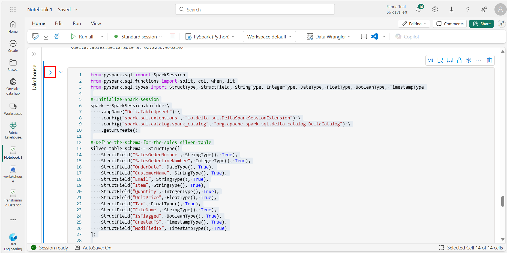

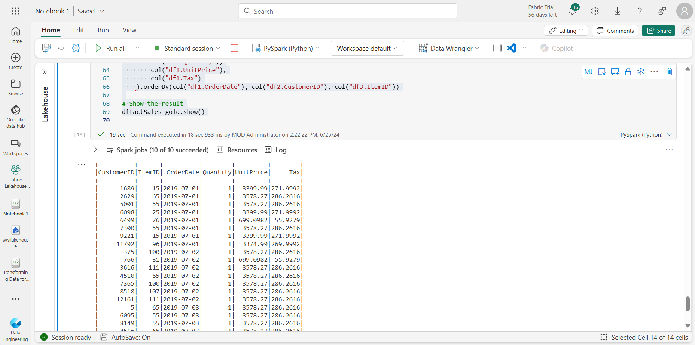

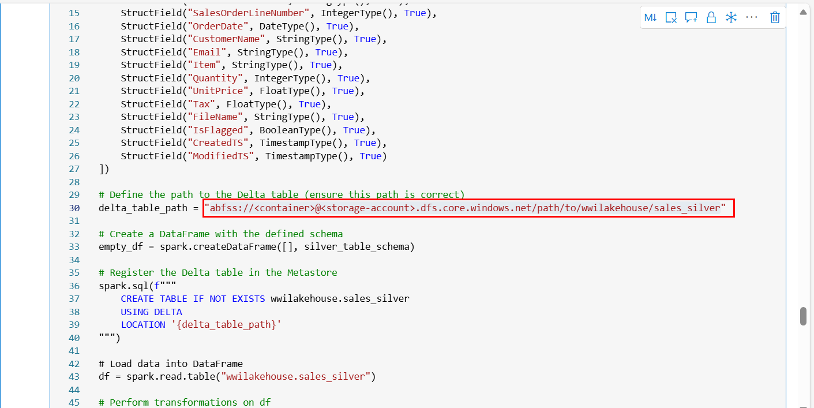

1.  Now you’ll ensure that sales data remains up-to-date by running the
    following code in a **new code block**:

> CodeCopy
>
> from delta.tables import \*
>
> deltaTable = DeltaTable.forPath(spark, 'Tables/factsales_gold')
>
> dfUpdates = dffactSales_gold
>
> deltaTable.alias('silver') \\
>
> .merge(
>
> dfUpdates.alias('updates'),
>
> 'silver.OrderDate = updates.OrderDate AND silver.CustomerID =
> updates.CustomerID AND silver.ItemID = updates.ItemID'
>
> ) \\
>
> .whenMatchedUpdate(set =
>
> {
>
> }
>
> ) \\
>
> .whenNotMatchedInsert(values =
>
> {
>
> "CustomerID": "updates.CustomerID",
>
> "ItemID": "updates.ItemID",
>
> "OrderDate": "updates.OrderDate",
>
> "Quantity": "updates.Quantity",
>
> "UnitPrice": "updates.UnitPrice",
>
> "Tax": "updates.Tax"
>
> }
>
> ) \\
>
> .execute()

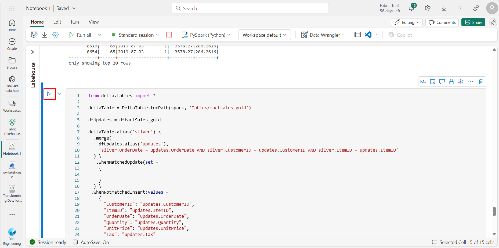

Here you’re using Delta Lake’s merge operation to synchronize and update
the factsales_gold table with new sales data (dffactSales_gold). The
operation compares the order date, customer ID, and item ID between the
existing data (silver table) and the new data (updates DataFrame),
updating matching records and inserting new records as needed.

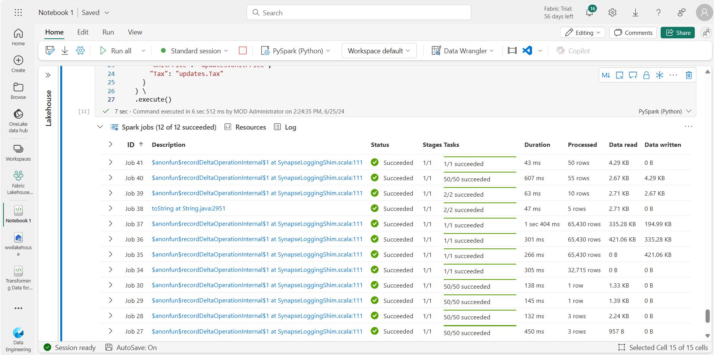

You now have a curated, modeled **gold** layer that can be used for
reporting and analysis.

# Exercise 4: Establishing connectivity between Azure Databricks and Azure Data Lake Storage (ADLS) Gen 2

Let’s now create a Delta table with the help of your Azure Data Lake
Storage (ADLS) Gen2 account using Azure Databricks. Then you will create
a OneLake shortcut to a Delta table in ADLS and Use Power BI to analyze
data via the ADLS shortcut.

## **Task 0: Redeem an Azure pass and enable Azure subscription**

1.  Navigate on the following link
    !!https://www.microsoftazurepass.com/!! and click on the **Start**
    button.

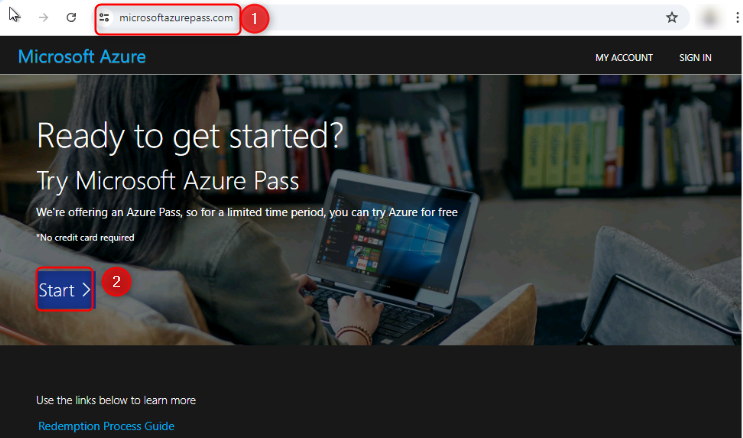

2.  On the Microsoft sign in page enter the **Tenant ID,** click on
    **Next**.

3.  On the next page enter your password and click on **Sign In**.

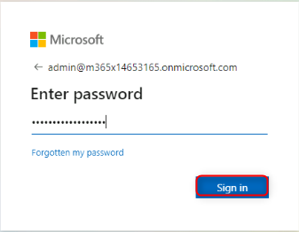

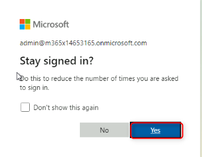

4.  Once logged in, on the Microsoft Azure page, click on the **Confirm
    Microsoft Account** tab.

5.  On the next page, enter the Promo code, the Captcha characters and
    click on **Submit.**


6.  On the Your profile page enter your profile details and click on
    **Sign up.**

7.  if prompted, sign up for Multifactor authentication and then login
    to the Azure portal by navigation to the following link !!
    <https://portal.azure.com/#home>!!


8.  On the search bar type Subscription and click on the Subscription
    icon under **Services.**


9.  After successful redemption of Azure pass a subscription Id will be
    generated.


## **Task 1: Create an Azure Data Storage account**

1.  Sign in to your Azure portal, using your azure credentials.

2.  On the home page, from the left portal menu, select **Storage
    accounts** to display a list of your storage accounts. If the portal
    menu isn't visible, select the menu button to toggle it on.


3.  On the **Storage accounts** page, select **Create**.


4.  On the Basics tab, upon selecting a resource group, provide the
    essential information for your storage account:

<table>
<colgroup>
<col style="width: 57%" />
<col style="width: 42%" />
</colgroup>
<thead>
<tr class="header">
<th>Resource Group</th>
<th><blockquote>

DBTutorial

</blockquote></th>
</tr>
</thead>
<tbody>
<tr class="odd">
<td>Region</td>
<td><blockquote>

EAST US

</blockquote></td>
</tr>
<tr class="even">
<td>Performance</td>
<td><blockquote>

Select Standard performance for general-purpose v2 storage accounts
(default).

</blockquote></td>
</tr>
<tr class="odd">
<td>Redundancy</td>
<td><blockquote>

Geo-redundant storage (GRS)

</blockquote></td>
</tr>
</tbody>
</table>

Leave the other settings as is and select **Review + create** to accept
the default options and proceed to validate and create the account.

Note: If you do not have a resource group created already, you can click
“**Create new**” and create a new resource for your storage account.


5.  When you navigate to the **Review + create** tab, Azure runs
    validation on the storage account settings that you have chosen. If
    validation passes, you can proceed to create the storage account.

If validation fails, then the portal indicates which settings need to be
modified.


You have now successfully created your Azure data storage account.

6.  Navigate to storage accounts page by search on the search bar on the
    top of the page, select the newly created storage account.

7.  On the storage account page, navigate to **Containers** under **Data
    storage** on left hand navigation pane create a new container with
    the name as !!medalion1!! and click on **Create** button. 

 


8.  Now navigate back on the **storage account** page, select
    **Endpoints** from the left-hand navigation menu. Scroll down and
    copy the **Primary endpoint URL** and past it on a notepad. This
    will be helpful while creating the shortcut.

9.  Similarly, navigate to the **Access keys** on the same navigation
    panel.


## **Task 2: Create a Delta table, create a shortcut, and analyze the data in your Lakehouse**

1.  In your lakehouse, select the ellipses **(…)** next to files and
    then select **New shortcut**.

2.  In the **New shortcut** screen, select the **Azure Data Lake Storage
    Gen2** tile.


3.  Specify the connection details for the shortcut:

<table>
<colgroup>
<col style="width: 30%" />
<col style="width: 69%" />
</colgroup>
<thead>
<tr class="header">
<th><strong>Field</strong></th>
<th><strong>Details</strong></th>
</tr>
</thead>
<tbody>
<tr class="odd">
<td>URL</td>
<td>
<a
href="https://StorageAccountName.dfs.core.windows.net/">https://StorageAccountName.dfs.core.windows.net/</a>

Note: Replace <strong>StorageAccountName</strong> in the URL with
your storage account name or paste the URL that you copied earlier from
the Endpoint tab.
</td>
</tr>
<tr class="even">
<td>Connection details</td>
<td>New connection</td>
</tr>
<tr class="odd">
<td>Connection name</td>
<td>Connection02</td>
</tr>
<tr class="even">
<td>Authentication kind</td>
<td>Account key (You can also sign in through your organizational
account)</td>
</tr>
<tr class="odd">
<td>Account key</td>
<td>Paste the key from your storage account.</td>
</tr>
</tbody>
</table>

4.  And click **Next**.


5.  This will establish a link with your Azure storage container. Select
    the storage and select the **Next** button.


6.  Once the Wizard has been launched, select **Files** and select the
    **“… “** on the **bronze** file.


7.  Select **load to tables** and **new table**.


8.  On the pop-up window provide the name for your table as
    **bronze_01** and select the file type as **parquet**.


9.  The file **bronze_01** is now visible in the files.


10. Next, select the **“… “** on the **bronze** file. Select **load to
    tables** and **existing table.**


11. Provide the existing table name as **dimcustomer_gold.** Select the
    file type as **parquet** and select **load.**


## **Task 3: Create a Semantic Model Using the gold layer to create a report**

In your workspace, you can now use the gold layer to create a report and
analyze the data. You can access the semantic model directly in your
workspace to create relationships and measures for reporting.

*Note that you can’t use the **default semantic model** that is
automatically created when you create a lakehouse. You must create a new
semantic model that includes the gold tables you created in this lab,
from the lakehouse explorer.*

1.  In your workspace, navigate to your **wwilakehouse** lakehouse. Then
    Select **New semantic model** from the ribbon of the lakehouse
    explorer view.


2.  In the pop-up, assign the name **DatabricksTutorial** to your new
    semantic model and select the workspace as **Fabric Lakehouse
    Tutorial-29**.


3.  Next, scroll down and select all to include in your semantic model
    and select **Confirm**.

This will open the semantic model in Fabric where you can create
relationships and measures, as shown here:


From here, you or other members of your data team can create reports and
dashboards based on the data in your lakehouse. These reports will be
connected directly to the gold layer of your lakehouse, so they’ll
always reflect the latest data.

# Exercise 5: Ingesting data and analyzing with Azure Databricks

1.  Navigate to your lakehouse in the Power BI service and select **Get
    data** and then select **New data pipeline**.


1.  In the **New Pipeline** prompt, enter a name for the new pipeline
    and then select **Create**. **IngestDatapipeline01**


2.  For this exercise, select the **NYC Taxi - Green** sample data as
    the data source.


3.  On the preview screen, select **Next**.


4.  For data destination, select the name of the table you want to use
    to store the OneLake Delta table data. You can choose an existing
    table or create a new one. For the purpose of this lab, select
    **load into new table** and select **Next**.


5.  On the **Review + Save** screen, select **Start data transfer
    immediately** and then select **Save + Run**.


6.  When the job is complete, navigate to your lakehouse and view the
    delta table listed under /Tables.


7.  Copy the Azure Blob Filesystem (ABFS) path to your delta table to by
    right-clicking the table name in the Explorer view and
    selecting **Properties**.

8.  Open your Azure Databricks notebook and run the code.

olsPath = "**abfss://\<replace with workspace
name\>@onelake.dfs.fabric.microsoft.com/\<replace with item
name\>.Lakehouse/Tables/nycsample**"

df=spark.read.format('delta').option("inferSchema","true").load(olsPath)

df.show(5)

*Note: Replace the file path in bold with the one you copied.*

9.  Update the Delta table data by changing a field value.

%sql

update delta.\`abfss://\<replace with workspace
name\>@onelake.dfs.fabric.microsoft.com/\<replace with item
name\>.Lakehouse/Tables/nycsample\` set vendorID = 99999 where vendorID
= 1;

*Note: Replace the file path in bold with the one you copied.*


# Exercise 6: Clean up resources

In this exercise, you’ve learned how to create a medallion architecture
in a Microsoft Fabric lakehouse.

If you’ve finished exploring your lakehouse, you can delete the
workspace you created for this exercise.

1.  Select your workspace, the **Fabric Lakehouse Tutorial-29** from the
    left-hand navigation menu. It opens the workspace item view.


2.  Select the ***...*** option under the workspace name and
    select **Workspace settings**.


3.  Scroll down to the bottom and **Remove this workspace.**


4.  Click on **Delete** in the warning that pops up.

5.  Wait for a notification that the Workspace has been deleted, before
    proceeding to the next lab.

**Summary**:

This lab guides participants through building a medallion architecture
in a Microsoft Fabric lakehouse using notebooks. Key steps include
setting up a workspace, establishing a lakehouse, uploading data to the
bronze layer for initial ingestion, transforming it into a silver Delta
table for structured processing, refining further into gold Delta tables
for advanced analytics, exploring semantic models, and creating data
relationships for insightful analysis.

## 
