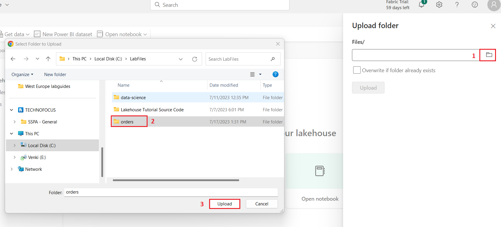
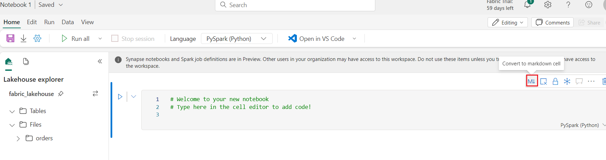
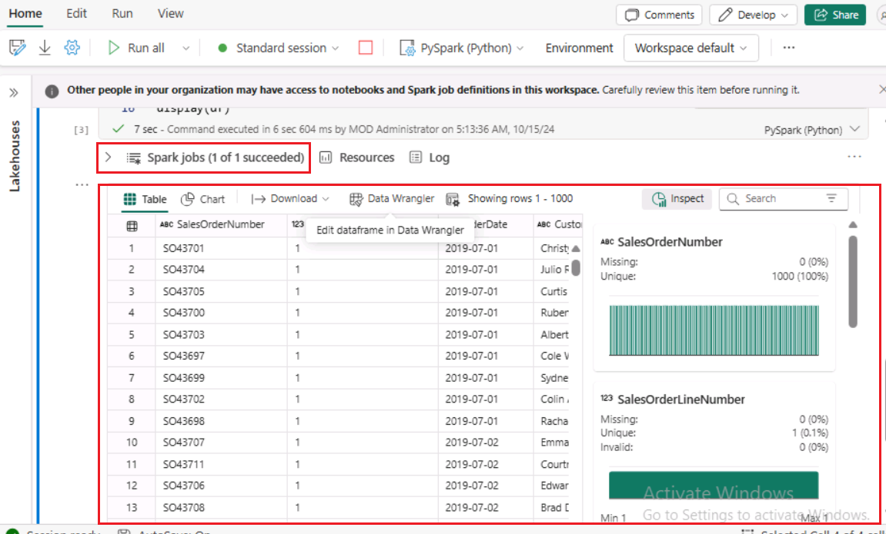
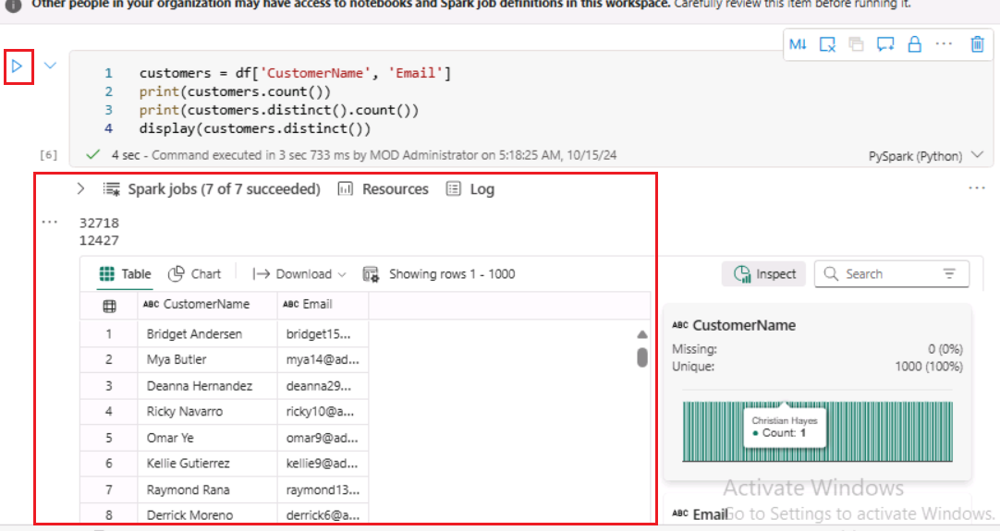
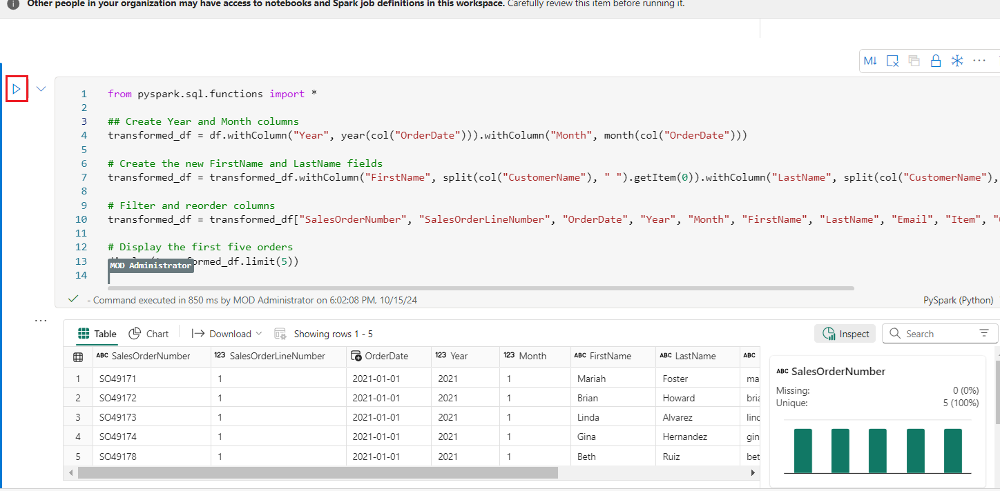

**Introducción**

Apache Spark es un motor de código abierto para el procesamiento de
datos distribuidos, y se utiliza ampliamente para explorar, procesar y
analizar enormes volúmenes de datos en el almacenamiento de lagos de
datos. Spark está disponible como opción de procesamiento en muchos
productos de plataformas de datos, como Azure HDInsight, Azure
Databricks, Azure Synapse Analytics y Microsoft Fabric. Una de las
ventajas de Spark es su compatibilidad con una amplia gama de lenguajes
de programación, como Java, Scala, Python y SQL; lo que convierte a
Spark en una solución muy flexible para cargas de trabajo de
procesamiento de datos, como la limpieza y manipulación de datos, el
análisis estadístico y el aprendizaje automático, y el análisis y la
visualización de datos.

Las tablas de un lakehouse de Microsoft Fabric se basan en el formato de
código abierto *Delta* Lake para Apache Spark. Delta Lake añade
compatibilidad con la semántica relacional tanto para las operaciones de
datos por lotes como en flujo, y permite la creación de una arquitectura
Lakehouse en la que Apache Spark puede utilizarse para procesar y
consultar datos en tablas que se basan en archivos subyacentes en un
lago de datos.

En Microsoft Fabric, los Dataflows (Gen2) se conectan a varias fuentes
de datos y realizan transformaciones en Power Query Online. A
continuación, se pueden utilizar en Data Pipelines para ingerir datos en
un lakehouse u otro almacén analítico, o para definir un conjunto de
datos para un informe de Power BI.

Este laboratorio está diseñado para introducir los diferentes elementos
de Dataflow (Gen2), y no para crear una solución compleja que pueda
existir en una empresa.

**Objetivos**:

- Crear un workspace en Microsoft Fabric con la prueba de Fabric
  activada.

- Establecer un entorno lakehouse y cargar archivos de datos para su
  análisis.

- Generar un notebook para la exploración y el análisis interactivo de
  datos.

- Cargar los datos en un marco de datos para su posterior procesamiento
  y visualización.

- Aplicar transformaciones a los datos utilizando PySpark.

- Guardar y particionar los datos transformados para una consulta
  optimizada.

- Crear una tabla en el metastore de Spark para la gestión de datos
  estructurados 

- Guardar DataFrame como una tabla delta gestionada llamada
  "salesorders".

- Guardar DataFrame como una tabla delta externa denominada
  "external_salesorder" con una ruta especificada.

- Describir y comparar las propiedades de las tablas gestionadas y
  externas.

- Ejecutar consultas SQL en tablas para análisis e informes.

- Visualizar datos utilizando librerías Python como matplotlib y
  seaborn.

- Establecer un lakehouse de datos en la experiencia de Ingeniería de
  Datos e ingerir datos relevantes para su posterior análisis.

- Definir un dataflow para extraer, transformar y cargar datos en el
  lakehouse.

- Configurar destinos de datos dentro de Power Query para almacenar los
  datos transformados en el lakehouse.

- Incorporar el dataflow en un pipeline para permitir el procesamiento e
  ingesta de datos programados.

- Eliminar el workspace y los elementos asociados para concluir el
  ejercicio.

# Ejercicio 1: Crear un workspace, lakehouse, notebook y cargar datos en dataframe 

## Tarea 1: Creación de un workspace 

Antes de trabajar con datos en Fabric, cree un workspace con la prueba
de Fabric activada.

1.  Abra su navegador, vaya a la barra de direcciones y escriba o pegue
    la siguiente URL: <https://app.fabric.microsoft.com/> y después
    presione la tecla **Enter**.

> **Nota**: Si se le dirige a la página de inicio de Microsoft Fabric,
> omita los pasos del \#2 al \#4.
>
> 

2.  En la ventana **Microsoft Fabric**, ingrese sus credenciales y haga
    clic en el botón **Submit**.

> 

3.  A continuación, en la ventana de **Microsoft **, escriba la
    contraseña y haga clic en el botón **Sign in.**

> 

4.  En la ventana **Stay signed in?** Haga clic en el botón **Yes**.

> 

5.  En la página de inicio de Fabric, seleccione el mosaico **+New
    workspace**.

> 

6.  En la pestaña **Create a workspace**, ingrese los siguientes datos y
    haga clic en el botón **Apply**.

[TABLE]

> 
>
> 

7.  Espere a que se complete la implementación. Tardará de 2 a 3 minutos
    en completarse. Cuando se abra su nuevo workspace, debería estar
    vacío.

## Tarea 2: Creación de un lakehouse y carga de archivos

Ahora que ya tiene un workspace, es el momento de cambiar a la
experiencia de Data engineering en el portal y crear un data lakehouse
para los archivos de datos que va a analizar.

1.  Cree un nuevo Eventhouse haciendo clic en el botón **+New item** en
    la barra de navegación.

2.  Haga clic en el mosaico "**Lakehouse**".

3.  En el cuadro de diálogo **New lakehouse**,
    ingrese **+++Fabric_lakehouse+++** en el campo **Name**, haga clic
    en el botón **Create** y abra el nuevo lakehouse.

4.  Al cabo de un minuto aproximadamente, se creará un nuevo lakehouse
    vacío. Necesita ingerir algunos datos en el data lakehouse para su
    análisis.

5.  Verá una notificación que indica **Successfully created SQL
    endpoint**.

6.  En la sección **Explorer**, debajo de **fabric_lakehouse**, pase el
    mouse por encima de la **carpeta Files**, luego haga clic en el menú
    de elipses horizontales **(…)**. Navegue y haga clic en **Upload** y
    luego haga clic en **Upload folder** como se muestra en la siguiente
    imagen.

7.  En el de la carpeta **Upload folder** que aparece en ell ado
    derecho, seleccione el **icono de la carpeta** debajo de **Files/**
    y luego busque **C:\LabFiles** y seleccione la carpeta **orders** y
    haga clic en el botón **Upload**.

8.  En caso de que aparezca el cuadro de diálogo **Upload 3 files to
    this site?** haga clic en el botón **Upload**.

9.  En el panel Upload folder, haga clic en el botón **Upload**.

> 

10. Una vez cargados los archivos, **cierre** el panel **Upload
    folder**.

> 

11. Expanda **Files** y seleccione la carpeta **orders** y verifique que
    los archivos CSV han sido cargados.

## Tarea 3: Creación de un notebook

Para trabajar con datos en Apache Spark, puede crear un notebook. Los
notebooks proporcionan un entorno interactivo en el que puede escribir y
ejecutar código (en varios idiomas), y añadir notas para documentarlo.

1.  En la página **Home** mientras visualiza el contenido de la
    carpeta **orders** en su datalake, en el menú **Open notebook**,
    seleccione **New notebook**.

2.  Al cabo de unos segundos, se abrirá un nuevo notebook que contiene
    una única *celda*. Los notebooks están formados por una o más celdas
    que pueden contener *código* o *markdown* (texto formateado).

3.  Seleccione la primera celda (que actualmente es una celda
    de *código*) y, a continuación, en la barra de herramientas dinámica
    situada en la parte superior derecha, utilice el
    botón **M↓** para **convertir la celda en una celda markdown**.

4.  Cuando la celda cambia a una celda markdown, el texto que contiene
    se renderiza.

5.  Utilice el botón **🖉** (Editar) para cambiar la celda al modo de
    edición, sustituya todo el texto y, a continuación, modifique el
    markdown de la siguiente manera:

> CodeCopy
>
> \# Sales order data exploration
>
> Use the code in this notebook to explore sales order data.

6.  Haga clic en cualquier parte del notebook fuera de la celda para
    dejar de editarlo y ver el markdown renderizado.

## Tarea 4: Carga de datos en un DataFrame

Ahora está listo para ejecutar código que cargue los datos en un
dataframe. Los dataframes en Spark son similares a los dataframes de
Pandas en Python, y proporcionan una estructura común para trabajar con
datos en filas y columnas.

**Nota**: Spark admite varios lenguajes de codificación, como Scala,
Java y otros. En este ejercicio, utilizaremos PySpark, que es una
variante de Python optimizada para Spark. PySpark es uno de los
lenguajes más utilizados en Spark y es el lenguaje por defecto en los
notebooks de Fabric.

1.  Con el notebook visible, expanda la lista **Files** y seleccione la
    carpeta de **orders** para que los archivos CSV aparezcan en la
    lista junto al editor del notebook.

2.  Ahora, sin embargo su ratón al archivo 2019.csv. Haga clic en las
    elipses horizontales **(...)** junto a 2019.csv. Navegue y haga clic
    en **Load data**, luego seleccione **Spark**. Se añadirá al notebook
    una nueva celda de código que contiene el siguiente código:

> CodeCopy
>
> df =
> spark.read.format("csv").option("header","true").load("Files/orders/2019.csv")
>
> \# df now is a Spark DataFrame containing CSV data from
> "Files/orders/2019.csv".
>
> display(df)

**Consejo**: Puede ocultar los paneles del explorador de Lakehouse
situados a la izquierda utilizando sus iconos **«**. Hacerlo le ayudará
a centrarse en el notebook.

3.  Utilice el botón **▷ Run cell** situado a la izquierda de la celda
    para ejecutarla.

**Nota**: Dado que es la primera vez que ejecuta código Spark, debe
iniciarse una sesión Spark. Esto significa que la primera ejecución en
la sesión puede tardar más o menos un minuto en completarse. Las
ejecuciones posteriores serán más rápidas.

4.  Cuando el comando de la celda se haya completado, revise la salida
    debajo de la celda, que debería tener un aspecto similar a este:

5.  La salida muestra las filas y columnas de datos del archivo
    2019.csv. Sin embargo, observe que las cabeceras de las columnas no
    tienen el aspecto correcto. El código utilizado por defecto para
    cargar los datos en un dataframe asume que el archivo CSV incluye
    los nombres de las columnas en la primera fila, pero en este caso el
    archivo CSV sólo incluye los datos sin información de cabecera.

6.  Modifique el código para establecer la opción **header** en
    **false**. Sustituya todo el código de la **celda** por el siguiente
    código y haga clic en el botón **▷ Run cell** y revisa la salida.

> CodeCopy
>
> df =
> spark.read.format("csv").option("header","false").load("Files/orders/2019.csv")
>
> \# df now is a Spark DataFrame containing CSV data from
> "Files/orders/2019.csv".
>
> display(df)
>
> 

7.  Ahora el dataframe incluye correctamente la primera fila como
    valores de datos, pero los nombres de las columnas se autogeneran y
    no son muy útiles. Para que los datos tengan sentido, es necesario
    definir explícitamente el esquema y el tipo de datos correctos para
    los valores de los datos en el archivo.

8.  Sustituya todo el código de la celda **cell** por el siguiente
    código y haga clic en el botón **▷ Run cell** y revise la salida.

> CodeCopy
>
> from pyspark.sql.types import \*
>
> orderSchema = StructType(\[
>
> StructField("SalesOrderNumber", StringType()),
>
> StructField("SalesOrderLineNumber", IntegerType()),
>
> StructField("OrderDate", DateType()),
>
> StructField("CustomerName", StringType()),
>
> StructField("Email", StringType()),
>
> StructField("Item", StringType()),
>
> StructField("Quantity", IntegerType()),
>
> StructField("UnitPrice", FloatType()),
>
> StructField("Tax", FloatType())
>
> \])
>
> df =
> spark.read.format("csv").schema(orderSchema).load("Files/orders/2019.csv")
>
> display(df)

> 

9.  Ahora el dataframe incluye los nombres de columna correctos (además
    del **Index**, que es una columna incorporada en todos los
    dataframes basada en la posición ordinal de cada fila). Los tipos de
    datos de las columnas se especifican utilizando un conjunto estándar
    de tipos definidos en la biblioteca SQL de Spark, que se importaron
    al principio de la celda.

10. Confirme que sus cambios se han aplicado a los datos visualizando el
    dataframe.

11. Utilice el icono **+ Code** situado debajo de la salida de la celda
    para añadir una nueva celda de código al notebook, e ingrese en ella
    el siguiente código. Haga clic en el botón **▷ Run cell** y revise
    la salida.

> CodeCopy
>
> display(df)
>
> 

12. El dataframe incluye sólo los datos del archivo **2019.csv**.
    Modifique el código para que la ruta del archivo utilice un comodín
    \* para leer los datos de los pedidos de venta de todos los archivos
    de la carpeta **orders**.

13. Utilice el icono **+ Code** situado debajo de la salida de celda
    para añadir una nueva celda de código al notebook, e ingrese el
    siguiente código en ella.

CodeCopy

> from pyspark.sql.types import \*
>
> orderSchema = StructType(\[
>
>     StructField("SalesOrderNumber", StringType()),
>
>     StructField("SalesOrderLineNumber", IntegerType()),
>
>     StructField("OrderDate", DateType()),
>
>     StructField("CustomerName", StringType()),
>
>     StructField("Email", StringType()),
>
>     StructField("Item", StringType()),
>
>     StructField("Quantity", IntegerType()),
>
>     StructField("UnitPrice", FloatType()),
>
>     StructField("Tax", FloatType())
>
>     \])
>
> df =
> spark.read.format("csv").schema(orderSchema).load("Files/orders/\*.csv")
>
> display(df)

14. Ejecute la celda de código modificada y revise el resultado, que
    ahora debería incluir las ventas para 2019, 2020 y 2021.

**Nota**: Sólo se muestra un subconjunto de las filas, por lo que es
posible que no pueda ver ejemplos de todos los años.

# Ejercicio 2: Explorar datos en un dataframe 

El objeto dataframe incluye una amplia gama de funciones que puede
utilizar para filtrar, agrupar y manipular de otro modo los datos que
contiene.

## Tarea 1: Filtrar un dataframe

1.  Utilice el icono **+ Code** situado debajo de la salida de la celda
    para añadir una nueva celda de código al notebook, e ingrese en ella
    el siguiente código.

**CodeCopy**

> customers = df\['CustomerName', 'Email'\]
>
> print(customers.count())
>
> print(customers.distinct().count())
>
> display(customers.distinct())
>
> 

2.  **Ejecute** la nueva célula de código y revise los resultados.
    Observe los siguientes detalles:

    - Cuando realiza una operación en un dataframe, el resultado es un
      nuevo dataframe (en este caso, se crea un nuevo dataframe
      de **customers** seleccionando un subconjunto específico de
      columnas del dataframe **df**)

    - Los dataframes proporcionan funciones
      como **count** y **distinct** que pueden utilizarse para resumir y
      filtrar los datos que contienen.

    - La sintaxis dataframe\['Field1', 'Field2', ...\] es una forma
      abreviada de definir un subconjunto de columnas. También puede
      utilizar el método **select**, por lo que la primera línea del
      código anterior podría escribirse como customers =
      df.select("CustomerName", "Email")

> 

3.  Modifique el código, sustituya todo el código de la **celda** por el
    siguiente código y haga clic en botón **▷ Run cell** de la siguiente
    manera:

> CodeCopy
>
> customers = df.select("CustomerName",
> "Email").where(df\['Item'\]=='Road-250 Red, 52')
>
> print(customers.count())
>
> print(customers.distinct().count())
>
> display(customers.distinct())

4.  **Ejecute **el código modificado para ver los clientes que han
    comprado el **producto *Road-250 Red, 52*.** Tenga en cuenta que
    puede **”encadenar” **varias funciones de forma que la salida de una
    función se convierta en la entrada de la siguiente - en este caso,
    el dataframe creado por el método** select **es el dataframe de
    origen para el método **where **que se utiliza para aplicar los
    criterios de filtrado.

> 

## Tarea 2: Agregar y agrupar datos en un dataframe 

1.  Haga clic en **+ Code** y copie y pegue el siguiente código y luego
    haga clic en el botón **Run cell**.

CodeCopy

> productSales = df.select("Item", "Quantity").groupBy("Item").sum()
>
> display(productSales)
>
> 

2.  Observe que los resultados muestran la suma de las cantidades
    pedidas agrupadas por producto. El método **groupBy** agrupa las
    filas por *Item*, y la posterior función **sum** agregada se aplica
    a todas las columnas numéricas restantes (en este caso, *Quantity*)

3.  Haga clic en **+ Code** y copie y pegue el siguiente código y luego
    haga clic en el botón **Run cell**.

> **CodeCopy**
>
> from pyspark.sql.functions import \*
>
> yearlySales =
> df.select(year("OrderDate").alias("Year")).groupBy("Year").count().orderBy("Year")
>
> display(yearlySales)

4.  Observe que los resultados muestran el número de pedidos de venta
    por año. Observe que el método **select** incluye una función
    SQL **year** para extraer el componente year del
    campo *OrderDate* (por eso el código incluye un comando **import**
    para importar funciones de la biblioteca SQL de Spark). A
    continuación, se utiliza un método **alias** para asignar un nombre
    de columna al valor del año extraído. A continuación, los datos se
    agrupan por la columna *Year* extraída y se calcula el recuento de
    filas de cada grupo antes de utilizar finalmente el
    método **orderBy** para ordenar el dataframe resultante.

# Ejercicio 3: Utilizar Spark para transformar archivos de datos

Una tarea común para los ingenieros de datos es ingerir datos en un
formato o estructura particular y transformarlos para su posterior
procesamiento o análisis.

## Tarea 1: Utilizar métodos y funciones de dataframe para transformar datos

1.  Haga clic en + Code y copie y pegue el siguiente código:

**CodeCopy**

> from pyspark.sql.functions import \*
>
> \## Create Year and Month columns
>
> transformed_df = df.withColumn("Year",
> year(col("OrderDate"))).withColumn("Month", month(col("OrderDate")))
>
> \# Create the new FirstName and LastName fields
>
> transformed_df = transformed_df.withColumn("FirstName",
> split(col("CustomerName"), " ").getItem(0)).withColumn("LastName",
> split(col("CustomerName"), " ").getItem(1))
>
> \# Filter and reorder columns
>
> transformed_df = transformed_df\["SalesOrderNumber",
> "SalesOrderLineNumber", "OrderDate", "Year", "Month", "FirstName",
> "LastName", "Email", "Item", "Quantity", "UnitPrice", "Tax"\]
>
> \# Display the first five orders
>
> display(transformed_df.limit(5))

2.  **Ejecute** el código para crear un nuevo dataframe a partir de los
    datos del pedido original con las siguientes transformaciones:

    - Añadir columnas **Year** y **Month** basadas en la columna
      **OrderDate**.

    - Añadir las columnas **FirstName** y **LastName** basándose en la
      columna **CustomerName**.

    - Filtrar y reordenar las columnas, eliminando la columna
      **CustomerName**.

3.  Revise la salida y verifique que se han realizado las
    transformaciones en los datos.

Puede utilizar toda la potencia de la biblioteca SQL de Spark para
transformar los datos filtrando filas, derivando, eliminando,
renombrando columnas y aplicando cualquier otra modificación de datos
necesaria.

**Consejo:** Consulte la** [documentación de dataframe de
Spark](https://spark.apache.org/docs/latest/api/python/reference/pyspark.sql/dataframe.html) **para
obtener más información sobre los métodos del objeto dataframe.

## Tarea 2: Guardar los datos transformados

1.  **Añada una nueva celda** con el siguiente código para guardar el
    dataframe transformado en formato Parquet (Sobrescribiendo los datos
    si ya existen). **Ejecute** la celda y espere el mensaje de que los
    datos se han guardado.

> CodeCopy
>
> transformed_df.write.mode("overwrite").parquet('Files/transformed_data/orders')
>
> print ("Transformed data saved!")
>
> **Nota**: Comúnmente, se prefiere el formato Parquet para los archivos
> de datos que se utilizarán para un análisis posterior o para su
> ingestión en un almacén analítico. Parquet es un formato muy eficiente
> que soportan la mayoría de los sistemas de análisis de datos a gran
> escala. De hecho, a veces su necesidad de transformación de datos
> puede consistir simplemente en convertir los datos de otro formato
> (como CSV) a Parquet!

2.  A continuación, en el panel izquierdo del **Lakehouse explorer**, en
    el menú **...** del nodo **Files**, seleccione **Refresh**.

> 

3.  Haga clic en la carpeta **transformed_data** para comprobar que
    contiene una carpeta denominada **orders**, que a su vez contiene
    uno o varios **archivos Parquet**.

4.  Haga clic en **+ Code** e ingrese el siguiente código para cargar un
    nuevo dataframe a partir de los archivos parquet de la
    carpeta **transformed_data -\> orders**:

> **CodeCopy**
>
> orders_df =
> spark.read.format("parquet").load("Files/transformed_data/orders")
>
> display(orders_df)
>
> 

5.  **Ejecute** la célula y compruebe que los resultados muestran los
    datos del pedido que se han cargado desde los archivos parquet.

> 

## Tarea 3: Guardar datos en archivos particionados

1.  Añada una nueva celda, haga clic en **+Code** con el siguiente
    código; que guarda el dataframe, particionando los datos por
    **Year** y **Month**. **Ejecute** la celda y espere el mensaje de
    que los datos se han guardado.

> CodeCopy
>
> orders_df.write.partitionBy("Year","Month").mode("overwrite").parquet("Files/partitioned_data")
>
> print ("Transformed data saved!")
>
> 
>
> 

2.  A continuación, en el panel izquierdo del **Lakehouse explorer**, en
    el menú **...** del nodo **Files**, seleccione **Refresh.**

3.  Expanda la carpeta **partitioned_orders** para comprobar que
    contiene una jerarquía de carpetas denominadas ***Year=xxxx***, cada
    una de las cuales contiene carpetas denominadas ***Month=xxxx***.
    Cada carpeta de mes contiene un archivo parquet con los pedidos de
    ese mes.

> Particionar los archivos de datos es una forma habitual de optimizar
> el rendimiento cuando se trabaja con grandes volúmenes de datos. Esta
> técnica puede mejorar significativamente el rendimiento y facilitar el
> filtrado de datos.

4.  Añada una nueva celda, haga clic en **+ Code** con el siguiente
    código para cargar un nuevo dataframe desde el
    archivo **orders.parquet**:

> CodeCopy
>
> orders_2021_df =
> spark.read.format("parquet").load("Files/partitioned_data/Year=2021/Month=\*")
>
> display(orders_2021_df)

5.  **Ejecute** la celda y compruebe que los resultados muestran los
    datos de los pedidos de ventas en 2021. Observe que las columnas de
    partición especificadas en la ruta (**Year** y **Month**) no están
    incluidas en el dataframe.

# **Ejercicio 3: Trabajar con tablas y SQL** 

Como ha visto, los métodos nativos del objeto dataframe le permiten
consultar y analizar datos de un archivo con bastante eficacia. Sin
embargo, muchos analistas de datos se sienten más cómodos trabajando con
tablas que pueden consultar utilizando la sintaxis SQL. Spark
proporciona un *metastore* en el que puede definir tablas relacionales.
La biblioteca SQL de Spark que proporciona el objeto dataframe también
admite el uso de comandos SQL para consultar tablas en el metastore.
Utilizando estas características de Spark, puede combinar la
flexibilidad de un lago de datos con el esquema de datos estructurado y
las consultas basadas en SQL de un almacén de datos relacional, de ahí
el término "data lakehouse”.

## Tarea 1: Crear una tabla gestionada 

Las tablas de un metastore Spark son abstracciones relacionales sobre
archivos en el lago de datos. Las tablas pueden ser gestionadas (en cuyo
caso los archivos son gestionados por el metastore) o externas (en cuyo
caso la tabla hace referencia a una ubicación de archivo en el lago de
datos que usted gestiona independientemente del metastore).

1.  Añada un nuevo código, haga clic en la celda **+ Code** al notebook
    e ingrese el siguiente código, que guarda el dataframe de datos de
    pedidos de venta como una tabla llamada **salesorders**:

> CodeCopy
>
> \# Create a new table
>
> df.write.format("delta").saveAsTable("salesorders")
>
> \# Get the table description
>
> spark.sql("DESCRIBE EXTENDED salesorders").show(truncate=False)

**Nota**: Merece la pena señalar un par de cosas sobre este ejemplo. En
primer lugar, no se proporciona ninguna ruta explícita, por lo que los
archivos de la tabla serán gestionados por el metastore. En segundo
lugar, la tabla se guarda en formato **delta**. Puede crear tablas
basadas en múltiples formatos de archivo (incluidos CSV, Parquet, Avro y
otros), pero el lago delta es una tecnología de Spark que añade
características de base de datos relacional a las tablas; incluyendo
soporte para transacciones, versionado de filas y otras características
útiles. La creación de tablas en formato delta es preferible para los
data lakehouses en Fabric.

2.  **Ejecute** la celda de código y revise la salida, que describe la
    definición de la nueva tabla.

3.  En el panel **Lakehouse** **explorer**, en el **…** menú de la
    carpeta **Tables**, seleccione **Refresh.**

4.  A continuación, expanda el nodo **Tables** y compruebe que se ha
    creado la tabla **salesorders**.

> 

5.  Pase el cursor por encima de la tabla **salesorders**, luego haga
    clic en las elipses horizontales (...). Navegue y haga clic
    en **Load data**, luego seleccione **Spark**.

6.  Haga clic en el botón **▷ Run cell** y que utiliza la biblioteca de
    Spark SQL para incrustrar una consulta SQL contra la tabla
    **salesorder** en código PySpark y cargar los resultados de la
    consulta en un dataframe.

> CodeCopy
>
> df = spark.sql("SELECT \* FROM \[your_lakehouse\].salesorders LIMIT
> 1000")
>
> display(df)

## Tarea 2: Crear una tabla externa 

También puede crear tablas *externas* cuyos metadatos de esquema se
definan en el metastore del lakehouse, pero cuyos archivos de datos se
almacenen en una ubicación externa.

1.  Debajo de los resultados devueltos por la primera celda de código,
    utilice el botón **+ Code** para añadir una nueva celda de código si
    aún no existe ninguna. A continuación, ingrese el siguiente código
    en la nueva celda.

CodeCopy

> df.write.format("delta").saveAsTable("external_salesorder",
> path="\<abfs_path\>/external_salesorder")

2.  En el panel **Lakehouse explorer**, en el menú **...** de la carpeta
    **Files**, seleccione **Copy ABFS** **path** en el bloc de notas.

> La ruta ABFS es la ruta completa a la carpeta **Files** en el
> almacenamiento OneLake para su lakehouse - similar a esto:

abfss://dp_Fabric29@onelake.dfs.fabric.microsoft.com/Fabric_lakehouse.Lakehouse/Files/external_salesorder

3.  Ahora, pase a la celda de código, sustituya **\<abfs_path\>** por
    la **ruta** que copió en el bloc de notas para que el código guarde
    el dataframe como una tabla externa con archivos de datos en una
    carpeta llamada **external_salesorder** en la ubicación de su
    carpeta **Files**. La ruta completa debería ser similar a esta.

abfss://dp_Fabric29@onelake.dfs.fabric.microsoft.com/Fabric_lakehouse.Lakehouse/Files/external_salesorder

4.  Utilice el botón **▷ (*Run cell*)** situado a la izquierda de la
    celda para ejecutarla.

5.  En el panel **Lakehouse explorer**, en el menú **…** de la
    carpeta **Tables**, seleccione la opción **Refresh**.

6.  A continuación, expanda el nodo **Tables** y compruebe que se ha
    creado la tabla **external_salesorder**.

7.  En el panel **Lakehouse explorer**, en el menú **...** de la
    carpeta **Files**, seleccione **Refresh**.

8.  A continuación, expanda el nodo **Files** y compruebe que se ha
    creado la carpeta **external_salesorder** para los archivos de datos
    de la tabla.

## Tarea 3: Comparar tablas gestionadas y externas 

Exploremos las diferencias entre las tablas gestionadas y las externas.

1.  Debajo de los resultados devueltos por la celda de código, utilice
    el botón **+ Code** para añadir una nueva celda de código. Copie el
    código siguiente en la celda Code y utilice el botón ▷ (***Run
    cell***) situado a la izquierda de la celda para ejecutarlo.

> SqlCopy
>
> %%sql
>
> DESCRIBE FORMATTED salesorders;

2.  En los resultados, vea la propiedad **Location** de la tabla, que
    debería ser una ruta al almacén OneLake para la lakehouse que
    termine en **/Tables/salesorders** (puede que necesite ampliar la
    columna **Data type** para ver la ruta completa).

3.  Modifique el comando **DESCRIBE** para mostrar los detalles de la
    tabla **external_saleorder** como se muestra a continuación.

4.  Debajo de los resultados devueltos por la celda de código, utilice
    el botón **+ Code** para añadir una nueva celda de código. Copie el
    código siguiente y utilice el botón **▷ (*Run cell*)** situado a la
    izquierda de la celda para ejecutarlo.

> SqlCopy
>
> %%sql
>
> DESCRIBE FORMATTED external_salesorder;

5.  En los resultados, vea la propiedad **Location** de la tabla, que
    debería ser una ruta al almacén OneLake para la lakehouse que
    termine en **/Files/external_saleorder** (puede que necesite ampliar
    la columna **Data type** para ver la ruta completa).

## Tarea 4: Ejecutar código SQL en una celda

Aunque es útil poder incrustar sentencias SQL en una celda que contenga
código PySpark, los analistas de datos a menudo sólo quieren trabajar
directamente en SQL.

1.  Haga clic en la celda **+ Code** del notebook e ingrese en ella el
    siguiente código. Haga clic en el botón **▷ Run cell** y revise los
    resultados. Observe que:

    - La línea %%sql al principio de la celda (llamada magic) indica que
      se debe utilizar el tiempo de ejecución del lenguaje Spark SQL
      para ejecutar el código en esta celda en lugar de PySpark.

    - El código SQL hace referencia a la tabla **salesorders** que creó
      anteriormente.

    - La salida de la consulta SQL se muestra automáticamente como
      resultado bajo la celda.

> SqlCopy
>
> %%sql
>
> SELECT YEAR(OrderDate) AS OrderYear,
>
> SUM((UnitPrice \* Quantity) + Tax) AS GrossRevenue
>
> FROM salesorders
>
> GROUP BY YEAR(OrderDate)
>
> ORDER BY OrderYear;

**Nota**: Para más información sobre Spark SQL y dataframes, consulte
la [documentación de Spark
SQL](https://spark.apache.org/docs/2.2.0/sql-programming-guide.html).

# Ejercicio 4: Visualizar datos con Spark 

Proverbialmente, una imagen vale más que mil palabras, y un gráfico es a
menudo mejor que mil filas de datos. Aunque los notebooks en Fabric
incluyen una vista de gráfico integrada para los datos que se muestran
desde un dataframe o una consulta SQL de Spark, no está diseñada para la
creación de gráficos completos. Sin embargo, puede utilizar bibliotecas
gráficas de Python como **matplotlib** y **seaborn** para crear gráficos
a partir de datos en dataframes.

## Tarea 1: Visualizar los resultados en forma de gráfico

1.  Haga clic en la celda **+ Code** del notebook e ingrese en ella el
    siguiente código. Haga clic en el botón **▷ Run cell** y observe que
    devuelve los datos de la vista **salesorders** que creó
    anteriormente.

> SqlCopy
>
> %%sql
>
> SELECT \* FROM salesorders

2.  En la sección de resultados situada debajo de la celda, cambie la
    opción **View** de **Table** a **Chart**.

3.  Utilice el botón **View options** situado en la parte superior
    derecha del gráfico para mostrar el panel de opciones del gráfico. A
    continuación, configure las opciones como se indica a continuación y
    seleccione **Apply**:

    - **Chart type**: Bar chart

    - **Key**: Item

    - **Values**: Quantity

    - **Series Group**: *Dejar en blanco*

    - **Aggregation**: Sum

    - **Stacked**: *Sin seleccionar*

4.  Verifique que el gráfico tiene un aspecto similar al siguiente.

## Tarea 2: Empezar con matplotlib 

1.  Haga clic en **+ Code** y copie y pegue el código siguiente.
    **Ejecute** el código y observe que devuelve un dataframe Spark que
    contiene los ingresos anuales.

> CodeCopy
>
> sqlQuery = "SELECT CAST(YEAR(OrderDate) AS CHAR(4)) AS OrderYear, \\
>
> SUM((UnitPrice \* Quantity) + Tax) AS GrossRevenue \\
>
> FROM salesorders \\
>
> GROUP BY CAST(YEAR(OrderDate) AS CHAR(4)) \\
>
> ORDER BY OrderYear"
>
> df_spark = spark.sql(sqlQuery)
>
> df_spark.show()

2.  Para visualizar los datos en forma de gráfico, empezaremos
    utilizando la biblioteca de Python **matplotlib**. Esta biblioteca
    es el núcleo de la biblioteca de trazado en la que se basan muchas
    otras, y proporciona una gran flexibilidad en la creación de
    gráficos.

3.  Haga clic en **+ Code** y copie y pegue el siguiente código.

**CodeCopy**

> from matplotlib import pyplot as plt
>
> \# matplotlib requires a Pandas dataframe, not a Spark one
>
> df_sales = df_spark.toPandas()
>
> \# Create a bar plot of revenue by year
>
> plt.bar(x=df_sales\['OrderYear'\], height=df_sales\['GrossRevenue'\])
>
> \# Display the plot
>
> plt.show()

5.  Haga clic en el botón** Run cell** y revise los resultados, que
    consisten en un gráfico de columnas con los ingresos brutos totales
    de cada año. Observe las siguientes características del código
    utilizado para elaborar este gráfico:

    - La biblioteca **matplotlib** requiere un dataframe *Pandas*, por
      lo que es necesario convertir el dataframe *Spark* devuelto por la
      consulta Spark SQL a este formato.

    - En el núcleo de la biblioteca **matplotlib** se encuentra el
      objeto **pyplot**. Es la base de la mayoría de las funciones de
      trazado.

    - Los ajustes por defecto dan como resultado un gráfico utilizable,
      pero hay un margen considerable para personalizarlo.

6.  Modifique el código para trazar el gráfico de la siguiente manera,
    sustituya todo el código de la **celda** por el siguiente código y
    haga clic en el botón **▷ Run cell** y revise la salida.

> CodeCopy
>
> from matplotlib import pyplot as plt
>
> \# Clear the plot area
>
> plt.clf()
>
> \# Create a bar plot of revenue by year
>
> plt.bar(x=df_sales\['OrderYear'\], height=df_sales\['GrossRevenue'\],
> color='orange')
>
> \# Customize the chart
>
> plt.title('Revenue by Year')
>
> plt.xlabel('Year')
>
> plt.ylabel('Revenue')
>
> plt.grid(color='#95a5a6', linestyle='--', linewidth=2, axis='y',
> alpha=0.7)
>
> plt.xticks(rotation=45)
>
> \# Show the figure
>
> plt.show()

7.  El gráfico incluye ahora algo más de información. Un gráfico está
    técnicamente contenido con una **Figura**. En los ejemplos
    anteriores, la figura se creó implícitamente para usted; pero puede
    crearla explícitamente.

8.  Modifique el código para trazar el gráfico de la siguiente manera,
    sustituya todo el código de la **celda** por el siguiente código.

> CodeCopy
>
> from matplotlib import pyplot as plt
>
> \# Clear the plot area
>
> plt.clf()
>
> \# Create a Figure
>
> fig = plt.figure(figsize=(8,3))
>
> \# Create a bar plot of revenue by year
>
> plt.bar(x=df_sales\['OrderYear'\], height=df_sales\['GrossRevenue'\],
> color='orange')
>
> \# Customize the chart
>
> plt.title('Revenue by Year')
>
> plt.xlabel('Year')
>
> plt.ylabel('Revenue')
>
> plt.grid(color='#95a5a6', linestyle='--', linewidth=2, axis='y',
> alpha=0.7)
>
> plt.xticks(rotation=45)
>
> \# Show the figure
>
> plt.show()

9.  **Vuelva a ejecutar** la celda de código y vea los resultados. La
    figura determina la forma y el tamaño del gráfico.

> Una figura puede contener varias subparcelas, cada una en su propio
> *eje*.

10. Modifique el código para trazar el gráfico como se indica a
    continuación. **Vuelva a ejecutar** la celda de código y vea los
    resultados. La figura contiene los subgrupos especificados en el
    código.

> CodeCopy
>
> from matplotlib import pyplot as plt
>
> \# Clear the plot area
>
> plt.clf()
>
> \# Create a figure for 2 subplots (1 row, 2 columns)
>
> fig, ax = plt.subplots(1, 2, figsize = (10,4))
>
> \# Create a bar plot of revenue by year on the first axis
>
> ax\[0\].bar(x=df_sales\['OrderYear'\],
> height=df_sales\['GrossRevenue'\], color='orange')
>
> ax\[0\].set_title('Revenue by Year')
>
> \# Create a pie chart of yearly order counts on the second axis
>
> yearly_counts = df_sales\['OrderYear'\].value_counts()
>
> ax\[1\].pie(yearly_counts)
>
> ax\[1\].set_title('Orders per Year')
>
> ax\[1\].legend(yearly_counts.keys().tolist())
>
> \# Add a title to the Figure
>
> fig.suptitle('Sales Data')
>
> \# Show the figure
>
> plt.show()

**Nota**: Para saber más sobre el trazado con matplotlib, consulte
la [documentación de matplotlib](https://matplotlib.org/).

## Tarea 3: Utilizar la biblioteca seaborn 

Aunque **matplotlib** le permite crear gráficos complejos de múltiples
tipos, puede requerir cierto código complejo para lograr los mejores
resultados. Por este motivo, a lo largo de los años, se han construido
muchas bibliotecas nuevas sobre la base de matplotlib para abstraer su
complejidad y mejorar sus características. Una de estas bibliotecas
es **seaborn**.

1.  Haga clic en **+ Code** y copie y pegue el código siguiente.

CodeCopy

> import seaborn as sns
>
> \# Clear the plot area
>
> plt.clf()
>
> \# Create a bar chart
>
> ax = sns.barplot(x="OrderYear", y="GrossRevenue", data=df_sales)
>
> plt.show()

2.  **Ejecute **el código y observe que muestra un gráfico de barras
    utilizando la biblioteca seaborn.

3.  **Modifique **el código como se indica a
    continuación.** Ejecute **el código modificado y observe que seaborn
    le permite establecer un tema de color coherente para sus parcelas.

> CodeCopy
>
> import seaborn as sns
>
> \# Clear the plot area
>
> plt.clf()
>
> \# Set the visual theme for seaborn
>
> sns.set_theme(style="whitegrid")
>
> \# Create a bar chart
>
> ax = sns.barplot(x="OrderYear", y="GrossRevenue", data=df_sales)
>
> plt.show()
>
> 

4.  **Modifique **de nuevo el código como se indica a
    continuación. **Ejecute **el código modificado para ver los ingresos
    anuales en forma de gráfico de líneas.

> CodeCopy
>
> import seaborn as sns
>
> \# Clear the plot area
>
> plt.clf()
>
> \# Create a bar chart
>
> ax = sns.lineplot(x="OrderYear", y="GrossRevenue", data=df_sales)
>
> plt.show()

**Nota**: Para saber más sobre el trazado con seaborn, consulte
la [documentación de seaborn](https://seaborn.pydata.org/index.html).

## Tarea 4: Procesamiento de flujos de datos con tablas Delta

Delta Lake soporta flujos de datos continuos. Las tablas Delta pueden
funcionar como *destino (sink)* o *fuente (source)* para flujos creados
con la API de Spark Structured Streaming. En este ejemplo, utilizarás
una tabla Delta como destino para datos de streaming en un escenario
simulado de Internet de las Cosas (IoT).

1.  Haga clic en **+ Code** y copie y pegue el código de abajo y luego
    haga clic en el botón **Run cell**.

CodeCopy

> from notebookutils import mssparkutils
>
> from pyspark.sql.types import \*
>
> from pyspark.sql.functions import \*
>
> \# Create a folder
>
> inputPath = 'Files/data/'
>
> mssparkutils.fs.mkdirs(inputPath)
>
> \# Create a stream that reads data from the folder, using a JSON
> schema
>
> jsonSchema = StructType(\[
>
> StructField("device", StringType(), False),
>
> StructField("status", StringType(), False)
>
> \])
>
> iotstream =
> spark.readStream.schema(jsonSchema).option("maxFilesPerTrigger",
> 1).json(inputPath)
>
> \# Write some event data to the folder
>
> device_data = '''{"device":"Dev1","status":"ok"}
>
> {"device":"Dev1","status":"ok"}
>
> {"device":"Dev1","status":"ok"}
>
> {"device":"Dev2","status":"error"}
>
> {"device":"Dev1","status":"ok"}
>
> {"device":"Dev1","status":"error"}
>
> {"device":"Dev2","status":"ok"}
>
> {"device":"Dev2","status":"error"}
>
> {"device":"Dev1","status":"ok"}'''
>
> mssparkutils.fs.put(inputPath + "data.txt", device_data, True)
>
> print("Source stream created...")

2.  Asegúrese de que se imprime el mensaje ***Source stream
    created***.... El código que acaba de ejecutar ha creado una fuente
    de datos de flujo basada en una carpeta en la que se han guardado
    algunos datos, que representan lecturas de dispositivos IoT
    hipotéticos.

3.  Haga clic en **+ Code** y copie y pegue el siguiente código y luego
    haga clic en el botón **Run cell**.

CodeCopy

> \# Write the stream to a delta table
>
> delta_stream_table_path = 'Tables/iotdevicedata'
>
> checkpointpath = 'Files/delta/checkpoint'
>
> deltastream =
> iotstream.writeStream.format("delta").option("checkpointLocation",
> checkpointpath).start(delta_stream_table_path)
>
> print("Streaming to delta sink...")

4.  Este código escribe los datos del dispositivo de streaming en
    formato delta en una carpeta llamada **iotdevicedata**. Dado que la
    ruta para la ubicación de la carpeta se encuentra en la
    carpeta **Tables**, se creará automáticamente una tabla para ella.
    Haga clic en las elipses horizontales junto a table, y luego haga
    clic en **Refresh**.

5.  Haga clic en **+ Code** y copie y pegue el siguiente código y luego
    haga clic en el botón **Run cell**.

> SqlCopy
>
> %%sql
>
> SELECT \* FROM IotDeviceData;

6.  Este código consulta la tabla **IotDeviceData**, que contiene los
    datos del dispositivo de la fuente de streaming.

7.  Haga clic en **+ Code** y copie y pegue el siguiente código y luego
    haga clic en el botón **Run cell**.

> CodeCopy
>
> \# Add more data to the source stream
>
> more_data = '''{"device":"Dev1","status":"ok"}
>
> {"device":"Dev1","status":"ok"}
>
> {"device":"Dev1","status":"ok"}
>
> {"device":"Dev1","status":"ok"}
>
> {"device":"Dev1","status":"error"}
>
> {"device":"Dev2","status":"error"}
>
> {"device":"Dev1","status":"ok"}'''
>
> mssparkutils.fs.put(inputPath + "more-data.txt", more_data, True)

8.  Este código escribe más datos del dispositivo hipotético en la
    fuente de streaming.

9.  Haga clic en **+ Code** y copie y pegue el siguiente código y luego
    haga clic en el botón **Run cell**.

> SqlCopy
>
> %%sql
>
> SELECT \* FROM IotDeviceData;
>
> 

10. Este código consulta de nuevo la tabla **IotDeviceData**, que ahora
    debería incluir los datos adicionales que se añadieron a la fuente
    de streaming.

11. Haga clic en **+ Code** y copie y pegue el siguiente código y luego
    haga clic en el botón **Run cell**.

> CodeCopy
>
> deltastream.stop()

12. Este código detiene el flujo.

## Tarea 5: Guardar el notebook y finalizar la sesión Spark 

Ahora que ha terminado de trabajar con los datos, puede guardar el
notebook con un nombre significativo y finalizar la sesión Spark.

1.  En la barra de menú del notebook, utilice el icono
    ⚙️ **Settings** para ver la configuración del notebook.

2.  Establezca el nombre en el campo **Name** del notebook a ++**Explore
    Sales Orders++**, y luego cierre el panel de configuración.

3.  En el menú del notebook, seleccione **Stop session** para finalizar
    la sesión Spark.

# Ejercicio 5: Crear un dataflow (Gen2) en Microsoft Fabric 

En Microsoft Fabric, los Dataflows (Gen2) se conectan a varias fuentes
de datos y realizan transformaciones en Power Query Online. A
continuación, pueden utilizarse en Data Pipelines para ingerir datos en
un lakehouse u otro almacén analítico, o para definir un conjunto de
datos para un informe de Power BI.

Este ejercicio está diseñado para introducir los distintos elementos de
Dataflow (Gen2), y no para crear una solución compleja que pueda existir
en una empresa.

## Tarea 1: Crear un Dataflow (Gen2) para la ingesta de datos 

Ahora que tiene un lakehouse, necesita ingerir algunos datos en él. Una
forma de hacerlo es definir un dataflow que encapsule un proceso ETL
(*extraer, transformar y cargar*)*.*

1.  Ahora, haga clic en **Fabric_lakehouse** en el panel de navegación
    de la izquierda.

2.  En la página de inicio **de Fabric_lakehouse **, haga clic en la
    flecha desplegable **Get data** y seleccione **New Dataflow
    Gen2.** Se abrirá el editor de Power Query para su nuevo dataflow.

3.  En el panel **Power Query** bajo la **pestaña** **Home**, haga clic
    en **Import from a Text/CSV file**.

4.  En el panel **Connect to data source**, en **Connection settings**,
    seleccione la opción **Link to file (Preview)**

- **Link to file**: *Seleccionado*

- **File path or
  URL**: <https://raw.githubusercontent.com/MicrosoftLearning/dp-data/main/orders.csv>

5.  En el panel **Connect to data source**, en **Connection
    credentials, **ingrese los siguientes detalles y haga clic en el
    botón **Next**.

    - **Connection**: Create new connection

    - **data gateway**: (none)

    - **Authentication kind**: Organizational account

6.  En el panel **Preview file data**, haga clic en **Create** para
    crear la fuente de datos. 

7.  El editor de **Power Query** muestra la fuente de datos y un
    conjunto inicial de pasos de consulta para formatear los datos.

8.  En la cinta de la barra de herramientas, seleccione la pestaña **Add
    column**. A continuación, seleccione **Custom column.**

 

9.  Establezca el nombre de New column como **MonthNo**, establezca el
    tipo de datos como **Whole Number** y, a continuación, añada la
    siguiente fórmula:**Date.Month(\[OrderDate\])** en **Custom column
    formula**. Seleccione **OK**.

10. Observe cómo el paso para añadir la columna personalizada se añade a
    la consulta. La columna resultante se muestra en el panel de datos.

**Consejo:** En el panel Query Settings, en la parte derecha, observe
que los** Applied Steps **incluyen cada paso de transformación. En la
parte inferior, también puede activar el botón **Diagram flow** para
activar el Visual Diagram (diagrama visual) de los pasos.

Los pasos pueden moverse hacia arriba o hacia abajo, editarse
seleccionando el icono de engranaje, y puede seleccionar cada paso para
ver las transformaciones aplicadas en el panel de vista previa.

Tarea 2: Añadir destino de datos para Dataflow

1.  En la cinta de la barra de herramientas **Power Query**, seleccione
    la pestaña **Home**. A continuación, en el menú desplegable **Data
    destination**, seleccione **Lakehouse** (si no está ya
    seleccionado).

**Nota:** Si esta opción aparece en gris, es posible que ya tenga un
destino de datos establecido. Compruebe el destino de los datos en la
parte inferior del panel de configuración de consultas, a la derecha del
editor de Power Query. Si ya hay un destino establecido, puede cambiarlo
utilizando el engranaje.

2.  Haga clic en el icono **Settings** junto a la
    opción **Lakehouse** seleccionada.

3.  En el cuadro de diálogo **Connect to data destination**,
    seleccione **Edit connection.**

4.  En el cuadro de diálogo **Connect to data destination**,
    seleccione **sign in** usando su cuenta de organización de Power BI
    para establecer la identidad que utiliza el dataflow para acceder al
    lakehouse.

5.  En el cuadro de diálogo Connect to data destination, seleccione
    **Next.**

6.  En el cuadro de diálogo Connect to data destination,
    seleccione **New table**. Haga clic en la **carpeta
    Lakehouse**,seleccione su workspace - **dp_FabricXX **y** **luego
    seleccione** **su lakehouse es decir **Fabric_lakehouse.** A
    continuación, especifique el nombre de la tabla como **orders** y
    seleccione el botón **Next**.

7.  En el cuadro de diálogo **Choose destination settings**, en **Use
    automatic settings off** y en **Update
    method **seleccione **Append**, luego haga clic en el botón **Save
    settings**.

8.  El destino **Lakehouse** se indica como un **icono** en
    la **consulta** en el editor de Power Query.

9.  Seleccione **Publish** para publicar el dataflow. A continuación,
    espere a que se cree el **Dataflow 1** en su workspace.

10. Una vez publicado, puede hacer clic con el botón derecho en el
    dataflow en su workspace, seleccione **Properties**, y cambie el
    nombre de su dataflow.

11. En el cuadro de diálogo **Dataflow1**, ingrese el nombre en el
    campo **Name** como **Gen2_Dataflow** y haga clic en el
    botón **Save**.

## Tarea 3: Añadir un dataflow a un pipeline

Puede incluir un dataflow como actividad dentro de un pipeline. Los
pipelines se utilizan para orquestar procesos de ingesta y
transformación de datos, permitiendo combinar dataflows con otros tipos
de operaciones en un flujo programado. Estos pipelines pueden crearse en
diferentes entornos, incluyendo la experiencia de Data Factory.

1.  En la página de inicio de Synapse Data Engineering, en el panel
    **dp_FabricXX**, seleccione **+New item** -\> **Data pipeline**

2.  En el cuadro de diálogo **New pipeline**, ingrese **Load data** en
    el campo **Name**, haga clic en el botón **Create** para abrir el
    nuevo pipeline.

3.  Se abre el editor de pipelines.

> **Consejo**: Si el asistente de copia de datos se abre
> automáticamente, ¡ciérrelo!

4.  Seleccione **Pipeline activity**, y añada una
    actividad **Dataflow** al pipeline.

5.  Con la nueva actividad **Dataflow1** seleccionada, en la
    pestaña **Settings**, en la lista desplegable **Dataflow**,
    seleccione **Gen2_Dataflow** (el flujo de datos que creó
    anteriormente).

6.  En la pestaña **Home**, guarde el pipeline utilizando el
    icono **🖫 (*Save)***.

7.  Utilice el botón **▷ Run** para ejecutar el pipeline y espere a que
    se complete. Puede tardar unos minutos.

> 
>
> 

8.  En la barra de menú del borde izquierdo, seleccione su workspace, es
    decir, **dp_FabricXX.**

9.  En el panel **Fabric_lakehouse**,
    seleccione **Gen2_FabricLakehouse **de tipo Lakehouse.

10. En el panel **Explorer**, seleccione el menú **...** de **Tables**,
    seleccione **refresh**. A continuación, expanda **Tables** y
    seleccione la tabla de **orders**, que ha sido creada por su
    dataflow.

**Consejo**: Utilice el *conector* Power BI Desktop *Dataflows* para
conectarse directamente a las transformaciones de datos realizadas con
su dataflow.  
También puede realizar transformaciones adicionales, publicar como un
nuevo conjunto de datos y distribuir con la audiencia prevista para
conjuntos de datos especializados.

## Tarea 4: Limpieza de recursos

En este ejercicio, ha aprendido a utilizar Spark para trabajar con datos
en Microsoft Fabric.

Si ha terminado de explorar su lakehouse, puede borrar el workspace que
creó para este ejercicio.

1.  En la barra de la izquierda, seleccione el icono de su workspace
    para ver todos los elementos que contiene.

> 

2.  En el menú **…** de la barra de herramientas, seleccione **Workspace
    settings**.

3.  Seleccione **General** y haga clic en **Remove this workspace.**

4.  En el cuadro de diálogo **Delete workspace?** haga clic en el botón
    **Delete**.

> 
>
> 

**Resumen**

Este caso de uso le guía a través del proceso de trabajo con Microsoft
Fabric dentro de Power BI. Cubre varias tareas, incluyendo la
configuración de un workspace, la creación de un lakehouse, la carga y
gestión de archivos de datos y el uso de notebooks para la exploración
de datos. Los participantes aprenderán a manipular y transformar datos
utilizando PySpark, a crear visualizaciones y a guardar y particionar
datos para una consulta eficiente.

En este caso de uso, los participantes realizarán una serie de tareas
centradas en el trabajo con tablas delta en Microsoft Fabric. Las tareas
abarcan la carga y exploración de datos, la creación de tablas delta
gestionadas y externas, la comparación de sus propiedades, el
laboratorio introduce las características de SQL para la gestión de
datos estructurados y proporciona conocimientos sobre la visualización
de datos utilizando bibliotecas de Python como matplotlib y seaborn. El
objetivo de los ejercicios es proporcionar una comprensión exhaustiva de
la utilización de Microsoft Fabric para el análisis de datos y la
incorporación de tablas delta para el flujo de datos en un contexto de
IoT.

Este caso de uso le guía a través del proceso de configuración de un
workspace de Fabric, la creación de un lakehouse de datos y la ingesta
de datos para su análisis. Demuestra cómo definir un dataflow para
manejar las operaciones ETL y configurar los destinos de datos para
almacenar los datos transformados. Además, aprenderá a integrar el
dataflow en un pipeline para su procesamiento automatizado. Por último,
se le proporcionarán instrucciones para limpiar los recursos una vez
finalizado el ejercicio.

Este laboratorio le dota de las habilidades esenciales para trabajar con
Fabric, permitiéndole crear y gestionar workspaces, establecer
lakehouses de datos y realizar transformaciones de datos de forma
eficiente. Al incorporar dataflows a los pipelines, aprenderá a
automatizar las tareas de procesamiento de datos, agilizando su flujo de
trabajo y mejorando la productividad en escenarios del mundo real. Las
instrucciones de limpieza le garantizan que no dejará recursos
innecesarios, promoviendo un enfoque de gestión del workspace organizado
y eficiente.
