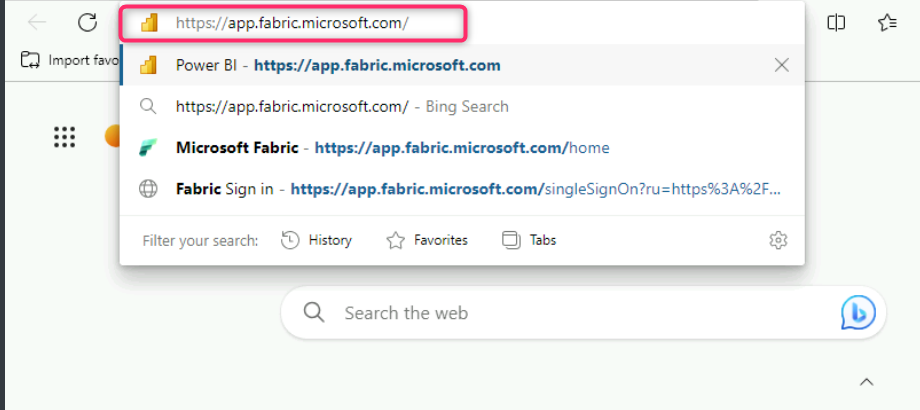
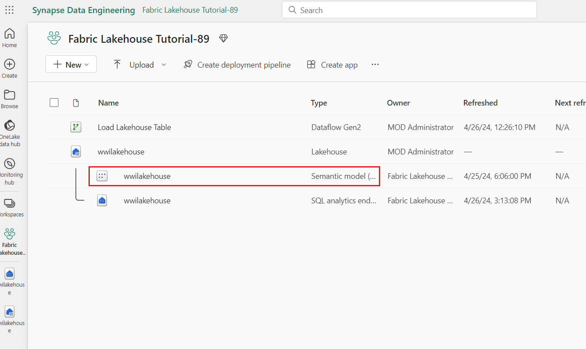
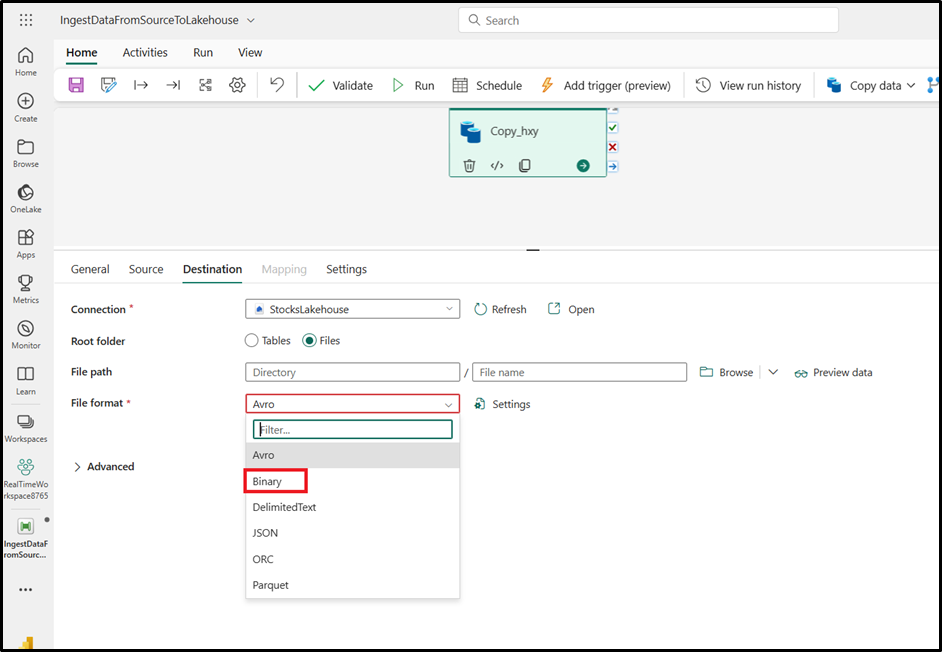

# ユースケース 1: Lakehouseを作成し、サンプルデータを投入、レポートを作成する

**紹介**

このラボでは、データの取得から利用までのエンドツーエンドのシナリオを段階的に学習します。Fabricの基本的な理解を深めるのに役立ちます。これには、様々なエクスペリエンスとその統合方法、そしてこのプラットフォームで作業する際に得られるプロフェッショナル開発者とシチズンデベロッパーのエクスペリエンスが含まれます。このラボは、リファレンスアーキテクチャ、機能の網羅的なリスト、または特定のベストプラクティスの推奨を目的としたものではありません。

従来、組織はトランザクションデータや構造化データの分析ニーズに対応するために最新のデータウェアハウスを構築してきました。そして、ビッグデータ（半構造化/非構造化）データ分析のニーズに対応するために、データLakehouseを構築してきました。これら2つのシステムが並行して稼働していたため、サイロ化、データの重複、そして総所有コストの増加が生じていました。

データストアの統合とDelta
Lake形式の標準化を備えたFabricにより、サイロを排除し、データの重複を排除し、総所有コストを大幅に削減できます。

Fabricが提供する柔軟性により、Lakehouseまたはデータウェアハウスアーキテクチャのいずれかを実装することも、両方を組み合わせてシンプルな実装で両方のメリットを享受することもできます。このチュートリアルでは、小売企業を例に、Lakehouseを最初から最後まで構築します。メダリオンアーキテクチャを採用しており、ブロンズレイヤーには生データ、シルバーレイヤーには検証済み・重複排除済みのデータ、ゴールドレイヤーには高度に精製されたデータが格納されます。あらゆる業界のあらゆる組織に、同じアプローチでLakehouseを実装できます。

このラボでは、小売業界の架空の会社であるワイドワールドインポーターズの開発者が、以下の手順をどのように実行するかを説明します。

**目的：**

1\. Power BI アカウントにサインインし、Microsoft Fabric
の無料試用版を開始する。

2\. Power BI 内で Microsoft Fabric (プレビュー) 試用版を開始する。

3\. Microsoft 365 管理センターの OneDrive サインアップを構成する。

4\. 組織のエンドツーエンドのLakehouse (Fabric
ワークスペースとLakehouseの作成など) を構築して実装します。

5\. サンプルデータをLakehouseに取り込み、さらに処理する準備をします。

6\. Python/PySpark と SQL
ノートブックを使用してデータを変換および準備する.

7\. さまざまなアプローチを使用したビジネス集計テーブルの作成.

8\. テーブル間の関係を確立して、シームレスなレポート作成を実現.

9\. 準備されたデータに基づいて視覚化された Power BI レポートを作成する.

10\. 作成したレポートを保存して、将来に参照および分析できるようにします.

## 手順 1: Lakehouseのエンドツーエンドのシナリオを設定する

### タスク 1: Power BI アカウントにサインインし、Microsoft Fabric の無料試用版にサインアップします 

1.  ブラウザを開き、アドレスバーに移動して、次のURLを入力または貼り付けます:+++<https://app.fabric.microsoft.com/+++>次に**、Enter**ボタンをクリックする。

2.  **Microsoft Fabric**ウィンドウで、**Microsoft
    365**の資格情報を入力し、\[**Submit\]**ボタンをクリックします.

1.  次に、**Microsoft**ウィンドウでパスワードを入力し、\[**Sign-in\]**ボタンをクリックします。

3.  **Stay signed in?ウィンドウでYes** ボタンをクリックする。

4.  Power BI ホーム ページに移動します.

**タスク 2: Microsoft Fabric の試用版を開始する**

次の手順に従って、Fabricの試用版を開始します.

1.  **\[Fabric**\] ページで、右側の **\[Account manager**\]
    をクリックします。 \[アカウント マネージャー\] ブレードで、
    次の図に示すように **\[Start trial**\] に移動して選択します。

1.  プロンプトで、条件に同意し、\[**Activate\]** を選択します。

2.  試用容量の準備ができると、確認メッセージが表示されます。\[**Got
    it**\]を選択して、Fabricでの作業を開始します.

> 

1.  アカウントマネージャーをもう一度開きます。\[**試用版\]
    ステータス**の見出しが表示されています。アカウントマネージャーは、試用期間の残り日数を追跡します。また、製品エクスペリエンスで作業しているときに、Fabricメニューバーにカウントダウンが表示されます。

> 

**手順 2: 組織向けのエンドツーエンドのLakehouseを構築して実装する**

**タスク 1: Fabric ワークスペースを作成する**

このタスクでは、Fabric
ワークスペースを作成します。ワークスペースには、このLakehouse
チュートリアルに必要なすべての項目 (Lakehouse、データフロー、Data
Factory パイプライン、ノートブック、Power BI データセット、レポートなど)
が含まれています.

1.  ファブリックのホーム ページで、 \[**+ New workspace**\]
    タイルを選択します.

2.  右側に表示される \[**Create a workspace**\]
    ウィンドウで、次の詳細を入力し、\[**Apply\]**
    ボタンをクリックします.

[TABLE]

3.  注: ラボのインスタント ID を見つけるには、\[Help\]
    を選択し、インスタント ID

> をコピーします.
>
> 
>
> 
>
> 

4.  デプロイが完了するまで待ちます。完了するまでに2〜3分かかります。

**タスク 2: Lakehouseの作成**

1.  新しいLakehouseを作成するには、 **ナビゲーションバーの**「+New
    Item」ボタンをクリックします.

> 

2.  "**Lakehouse**"タイルにクリックする。

> 

1.  \[**New
    Lakehouse\]**ダイアログボックスで、\[**Name**\]フィールドに**「wwilakehouse**」と入力し、\[**作成**\]ボタンをクリックして、新しいLakehouseを開きます。

**注:**wwilakehouseの前にスペースを削除します。

> 

3.  **Successfully created SQL endpoint**との通知が表示します。

**タスク 3: サンプルデータの取り込み**

1.  **wwilakehouse**ページで**Get data in your
    lakehouseセクションに移動し、以下の図に示すようUpload
    filesをクリックする。**

2.  Upload filesタブでFilesの下にあるフォルダをクリックする。

3.  VM上**C:\LabFilesをブラウズしてから**select ***dimension_customer.csv*** ファイルを選択し、**Open** ボタンをクリックする。

4.  Then, click on the **Uploadをクリックして閉じる** 

5.  Click and select refresh on
    the **FilesをクリックしてRefreshを選択する。**ファイルが表示します。

6.  Lakehouseページの「エクスプローラー」ペインで「ファイル」を選択します。マウスをdimension_customer.csvファイルに移動します。dimension_customer.csvの横にある横線上の省略記号（…）をクリックします。「Load
    Table」に移動しクリックして、「New Table」を選択します。

7.  **Load file to new
    tableダイアログボックスにLoadボタンをクリックする。**

8.  次に、左側の**Lakehouse**エクスプローラーペインの**...**
    メニューを開き、**テーブル ノード**で **\[更新\]** を選択します。

9.  また、Lakehouseの SQL エンドポイントを使用して、SQL
    ステートメントでデータをクエリすることもできます。
    **画面の右上にある** \[Lakehouse**\]** ドロップダウン メニューから
    \[SQL analytics endpoint\] を選択します.

1.  \[wwilakehouse\] ページの \[エクスプローラー\]
    で、**dimension_customer**
    テーブルを選択してそのデータをプレビューし、\[**New SQL query**\]
    を選択して SQL ステートメントを書き込みします。

1.  次のサンプル クエリでは、**dimension_customer** テーブルの
    BuyingGroup
    列に基づいて行数を集計します。SQLクエリファイルは後で参照できるように自動的に保存され、必要に応じてこれらのファイルの名前を変更したり削除したりできます。下の画像に示すようにコードを貼り付け、Playアイコンをクリックしてスクリプト**をRunします**。

> SELECT BuyingGroup, Count(\*) AS Total
>
> FROM dimension_customer
>
> GROUP BY BuyingGroup

**注:**スクリプトの実行中にエラーが発生した場合は、上記の画像とスクリプトの構文を照合してください**。**

10. 以前は、Lakehouseのすべてのテーブルとビューは自動的にセマンティックモデルに追加されていました。最近のアップデートでは、新しいLakehouseについては、テーブルをセマンティックモデルに手動で追加する必要になりました。

11. Lakehouseの **Reporting**タブから**Manage default Power BI semantic
    model**を選択してセマンティックモデルに追加するテーブルを選択します。 

12.  **Manage default semantic
    model**タブで **dimension_customerテ**ーブルを選択して**Confirm**をクリックする。

**タスク 4: レポートを作成する**

1.  次に、左側のナビゲーションペインで**FabricLakehouseTutorial-XX**をクリックします
    .

2.  Fabric Lakehouse Tutorial-XX
    ビューで、タイプがセマンティックモデル（デフォルト）の wwilakehouse
    を選択します。このデータセットは自動的に作成され、Lakehouseと同じ名前になります。

3.  セマンティック モデル
    ペインから、すべてのテーブルを表示できます。レポートを最初から作成するか、ページ分割されたレポートを作成するか、データに基づいて
    Power BI
    でレポートを自動的に作成するオプションがあります。このチュートリアルでは、
    次の図**に示すように、 \[Explore this data\] で \[Auto-create
    report**\] を選択します 。

4.  テーブルはディメンションであり、メジャーが含まれていないため、Power
    BIは行数のメジャーを作成し、それを様々な列にわたって集計し、次の画像に示すようにさまざまなグラフを作成します。

5.  このレポートを後で保存するには **、**上部のリボンから \[**Save**\]
    を選択します.

6.  \[**Save your replort**\] ダイアログボックスで、レポートの名前を
    +++dimension_customer-report+++ として入力し、\[Save\] を選択します
    **.**

7.  「**Report save**」**という通知が表示されます** 。

**手順 3: Lakehouseへのデータの取り込み**

この手順では、Wide World Importers (WWI) から追加のディメンション
テーブルとファクト テーブルをLakehouseに取り込みます。

**タスク 1: データを取り込む**

1.  左側のナビゲーション ウィンドウで \[Workspaces**\]
    を選択し、\[**Workspaces\] メニューから**新しいワークスペース
    (Fabric Lakehouse Tutorial-XX など) を選択します**
    。ワークスペースのアイテム ビューが表示されます.

2.  **Fabric Lakehouse Tutorial-XX** ワークスペース ページで、移動して
    **\[+ 新しいアイテム**\] ボタンをクリックし、\[**Data pipeline\]
    を選択します**.

3.  \[新しいパイプライン\] ダイアログ ボックスで、名前を
    **+++IngestDataFromSourceToLakehouse+++ として指定**し、 \[Create\]
    を選択します**。** 新しいデータ ファクトリ
    パイプラインが作成され、開かれます

4.  新しく作成されたデータ ファクトリ パイプライン
    (**IngestDataFromSourceToLakehouse** など) で、 \[データ
    アシスタントのコピー**\] を選択します** .

5.  次に、**サンプル**の World Wide Importers データを Lakehouse
    にインポートするための HTTP 接続を設定します。**\[New sources**\]
    の一覧から \[**View more\]** を選択し、**Http**
    を検索して選択します.

6.  \[**Connect to data source**\]
    ウィンドウで、次の表の詳細を入力し、\[Next\] を選択します 。

[TABLE]

7.  

8.  次の手順では、**Binary copy**を有効にし、**ソースが .zip
    ファイルであるため、Compression type**として **ZipDeflate (.zip)**
    を選択します。他のフィールドはデフォルト値のままにして、\[**Next**\]
    をクリックします .

9.  「Connect to data
    destination」ウィンドウで、OneLakeデータハブを選択し、wwilakehouseを選択します。ルートフォルダをFilesに設定し、「Next」をクリックします。これにより、データがLakehouseのFilesセクションに書き込まれます。

10. **File
    format**を選択すると**、**宛先は空である必要があります。「**Next」**をクリックし、「**Save+Run**」をクリックします。パイプラインをスケジュールして、データを定期的に更新できます。このチュートリアルでは、パイプラインを一度だけ実行します。データのコピー
    プロセスが完了するまでに約 15 分から 19
    分かかります。 

&nbsp;

1.  これで、検証が失敗することがわかります。**Pipeline validation
    output**をクリックします。

11. **\[Destination**\] タブで、\[File format\]
    をドロップダウンし、\[**Binary\] を選択します**。

12. 次に、\[Run\]ボタンをクリックします 

13. \[Output\] タブで \[**Copy_a1n**\]
    を選択して、データ転送の詳細を確認します。**Status**が**Succeded**として表示されたら、\[**Close**\]ボタンをクリックします。

14. パイプラインが正常に実行されたら、Lakehouse (**wwilakehouse**)
    に移動し、エクスプローラーを開いてインポートされたデータを確認します。

1.  フォルダ **WideWorldImportersDW** が**エクスプローラ**
    ビューに表示され、すべてのテーブルのデータが含まれていることを確認します。

15. データは、Lakehouse エクスプローラーの **\[Files**\]
    セクションの下に作成されます。GUID
    を持つ新しいフォルダーには、必要なすべてのデータが含まれています。GUID
    の名前を +++wwi-raw-data+++ に変更します

**手順 4: Lakehouseでデータを準備して変換する**

**タスク 1: データの準備**

前の手順から、ソースからLakehouseの**Files**セクションに生データが取り込まれました。これで、そのデータを変換し、差分テーブルを作成する準備をすることができます。

1.  次に、左側のナビゲーションペインにある**FabricLakehouseTutorial-XX**をクリックします。

2.  2.  Homeページで
        、\[**Import**\]セクションに移動し、\[**Notebook**\]をクリックして**、
        \[From this computer\] をクリックします**

3.  **\[Navigate to
    import**\]セクションから**\[Upload\]**を選択し、**\[Notebook\]**をクリックして、　\[**From
    this computer**\]をクリックします

**注意:
ファイル名フィールドの横にあるドロップダウンからすべてのファイル(\*.\*)を選択する。**
 

4.  C:\LabFiles から 01-Create Delta Tables、02-Data
    Transformation-Business Aggregation
    ノートブックに移動して選択し、\[Open\] ボタンをクリックします。

5.  「**Imported successfully**」という通知が表示されます。

6.  インポートが成功したら、新しくインポートされたノートブックを表示するには、\[**Recommended\]**
    セクションの **\[Fabric Lakehouse Tutorial-XX**\] を選択します 。

7.  \[**Fabric Lakehouse Tutorial-XX**\]
    ウィンドウで、\[**wwilakehouse** lakehouse\] を選択して開きます。

**タスク 2: データを変換してSilver Deltaテーブルにロードする**

1.  wwilakehouseページで、コマンドバーの「Open
    notebook」ドロップをクリックして、「Existing
    notebook」を選択します。

2.  \[**Open existing notebooks**\] **の一覧から** \[**01 – Create Delta
    Tables\]** ノートブックを選択し、 \[Open\] を選択します .

3.  **Open notebook in Lakehouse
    explorer**では、ノートブックがすでに開いているLakehouseにリンクされていることがわかります。.

\*\* 注意\*\*

Fabricは、最適化されたDelta
Lakeファイルを書き込むためのVオーダー機能を提供します。Vオーダーにより、最適化されていないDelta
Lakeファイルと比較して、圧縮率は3～4倍、パフォーマンスは最大10倍向上します。FabricのSparkは、デフォルトで128MBのサイズのファイルを生成する際に、パーティションを動的に最適化します。ターゲットファイルサイズは、設定を使用してワークロード要件に応じて変更できます。Apache
Sparkエンジンは、書き込み最適化機能を使用して、書き込まれるファイル数を削減し、書き込まれるデータの個々のファイルサイズを増やすことを目指します。

4.  Lakehouseの \[**Tables**\] セクションで **Delta Lake
    テーブルとしてデータを書き込む前に** 、2 つの Fabric 機能 (**V-order
    and** **Optimize Write**)
    を使用して、データ書き込みを最適化し、読み取りパフォーマンスを向上させます。セッションでこれらの機能を有効にするには、ノートブックの最初のセルでこれらの構成を設定します.

5.  ノートブックを起動してセルを実行するには、
    ホバー時にセルの左側に表示される \[**Run**\] アイコンを選択します.

セルを実行する際に、基盤となるSparkプールやクラスターの詳細を指定する必要はありませんでした。FabricはLive
Poolを通じてそれらを提供するからです。すべてのFabricワークスペースには、
Live
Poolと呼ばれるデフォルトのSparkプールが付属しています。つまり、ノートブックを作成する際に、Spark構成やクラスターの詳細を指定する必要はありません。最初のノートブックコマンドを実行すると、数秒でLive
Poolが起動し、Sparkセッションが確立され、コードの実行が開始されます。Sparkセッションがアクティブな間、このノートブックでは後続のコード実行はほぼ瞬時に行われます。

6.  次に、Lakehouseのファイルセクションから生データを読み取り、変換の一環として、異なる日付部分の列を追加します。Partition
    By Spark
    APIを使用してデータをパーティション化し、新しく作成されたデータ部分の列（年と四半期）に基づいてデルタテーブルとして書き込みます。

7.  2番目のセルを実行するには、カーソルを合わせるとセルの左側に表示される
    \[**Run**\]アイコンを選択します.

**注意：出力が表示されない場合は、Sparkジョブの左側にある水平線をクリックします。**.

\`\`\`

from pyspark.sql.functions import col, year, month, quarter

table_name = 'fact_sale'

df =
spark.read.format("parquet").load('Files/wwi-raw-data/full/fact_sale_1y_full')

df = df.withColumn('Year', year(col("InvoiceDateKey")))

df = df.withColumn('Quarter', quarter(col("InvoiceDateKey")))

df = df.withColumn('Month', month(col("InvoiceDateKey")))

df.write.mode("overwrite").format("delta").partitionBy("Year","Quarter").save("Tables/" +
table_name)

\`\`\`

 

8.  After the fact tables load, you can move on to loading data for the
    rest of the dimensions. The following cell creates a function to
    read raw data from the **Files** section of the lakehouse for each
    of the table names passed as a parameter. Next, it creates a list of
    dimension tables. Finally, it loops through the list of tables and
    creates a delta table for each table name that's read from the input
    parameter.

9.  Select the cell, replace the code, and click the **Run** icon that
    appears to the left of the cell when you hover over it

10. \`\`\`

11. from pyspark.sql.types import \*

12. def loadFullDataFromSource(table_name):

13. df = spark.read.format("parquet").load('Files/wwi-raw-data/full/' +
    table_name)

14. df.write.mode("overwrite").format("delta").save("Tables/" +
    table_name)

15. 

16. full_tables = \[

17. 'dimension_city',

18. 'dimension_date',

19. 'dimension_employee',

20. 'dimension_stock_item'

21. \]

22. 

23. for table in full_tables:

24. loadFullDataFromSource(table)

25. \`\`\`

 

26. To validate the created tables, click and select refresh on
    the **Tables**. The tables appear.  

27. Go the items view of the workspace again, select **Fabric Lakehouse
    Tutorial-XX** and select the **wwilakehouse** lakehouse to open it.

28. Now, open the second notebook. In the lakehouse view, dropdown
    the **Open notebook** and select **Existing notebook** from the top
    navigation menu.

29. Open existing notebook の一覧から**02 - Data Transformation -
    Business** **Aggregation**ノートブックを選択して**Open**を　クリックする。.

30. LakehouseExplorerーに開くノートブックでは、ノートブックが開いているLakehouseにすでにリンクされていることがわかります。.

31. ノートブックを開始するには、最初のセルを選択し、マウスを移動したときにセルの左側に表示されるRunアイコンを選択します。

32. 組織には、Scala/Python を扱うデータエンジニアと、SQL (Spark SQL
    または T-SQL)
    を扱うデータエンジニアがいて、全員が同じデータコピーで作業している場合があります。Fabric
    は、経験や好みの異なるグループが協力して作業することを可能にします。2
    つの異なるアプローチは、ビジネス集計を変換および生成します。パフォーマンスを損なうことなく、適切なアプローチを選択することも、好みに応じてこれらのアプローチを組み合わせることもできます。:

    - **アプローチ \#1** -
      PySparkを使用してデータを結合・集計し、ビジネス集計を生成します。このアプローチは、プログラミング（PythonまたはPySpark）の経験がある方に適しています。

    - **アプローチ \#2** - Spark
      SQLを使用してデータを結合・集計し、ビジネス集計を生成します。このアプローチは、SQLの経験があり、Sparkに移行する方に適しています。

33. **アプローチ \#1 (sale_by_date_city)** - PySpark
    を使用してデータを結合および集計し、ビジネス集計を生成します。以下のコードでは、それぞれ既存の差分テーブルを参照する
    3 つの異なる Spark
    データフレームを作成します。次に、データフレームを使用してこれらのテーブルを結合し、group
    by
    を実行して集計を生成し、いくつかの列の名前を変更し、最後にLakehouseのテーブルセクションに差分テーブルとして書き込み、データを永続化します。このセルでは、それぞれ既存の差分テーブルを参照する
    3 つの異なる Spark データフレームを作成します。

df_fact_sale = spark.read.table("wwilakehouse.fact_sale")

df_dimension_date = spark.read.table("wwilakehouse.dimension_date")

df_dimension_city = spark.read.table("wwilakehouse.dimension_city")

34. このセルでは、先ほど作成したデータフレームを使用してこれらのテーブルを結合し、group
    by使用して集計を生成し、いくつかの列の名前を変更し、最後にLakehouseのテーブルセクションにデルタテーブルとして書き込みます。

35. \`\`\`

36. sale_by_date_city = df_fact_sale.alias("sale") \\

37. .join(df_dimension_date.alias("date"), df_fact_sale.InvoiceDateKey
    == df_dimension_date.Date, "inner") \\

38. .join(df_dimension_city.alias("city"), df_fact_sale.CityKey ==
    df_dimension_city.CityKey, "inner") \\

39. .select("date.Date", "date.CalendarMonthLabel", "date.Day",
    "date.ShortMonth", "date.CalendarYear", "city.City",
    "city.StateProvince",

40. "city.SalesTerritory", "sale.TotalExcludingTax", "sale.TaxAmount",
    "sale.TotalIncludingTax", "sale.Profit")\\

41. .groupBy("date.Date", "date.CalendarMonthLabel", "date.Day",
    "date.ShortMonth", "date.CalendarYear", "city.City",
    "city.StateProvince",

42. "city.SalesTerritory")\\

43. .sum("sale.TotalExcludingTax", "sale.TaxAmount",
    "sale.TotalIncludingTax", "sale.Profit")\\

44. .withColumnRenamed("sum(TotalExcludingTax)",
    "SumOfTotalExcludingTax")\\

45. .withColumnRenamed("sum(TaxAmount)", "SumOfTaxAmount")\\

46. .withColumnRenamed("sum(TotalIncludingTax)",
    "SumOfTotalIncludingTax")\\

47. .withColumnRenamed("sum(Profit)", "SumOfProfit")\\

48. .orderBy("date.Date", "city.StateProvince", "city.City")

49. 

50. sale_by_date_city.write.mode("overwrite").format("delta").option("overwriteSchema",
    "true").save("Tables/aggregate_sale_by_date_city")

51. \`\`\`

52. **Approach \#2 (sale_by_date_employee)** - Spark
    SQLを使用してデータを結合・集計し、ビジネス集計を生成します。以下のコードでは、3つのテーブルを結合して一時的なSparkビューを作成し、group
    byを使用して集計を生成し、いくつかの列の名前を変更します。最後に、一時的なSparkビューからデータを読み取り、Lakehouseのテーブルセクションに差分テーブルとして書き込み、データを永続化します。

このセルでは、3 つのテーブルを結合して一時的な Spark
ビューを作成し、Group
byを実行して集計を生成し、いくつかの列の名前を変更します.

\`\`\`

%%sql

CREATE OR REPLACE TEMPORARY VIEW sale_by_date_employee

AS

SELECT

DD.Date, DD.CalendarMonthLabel

, DD.Day, DD.ShortMonth Month, CalendarYear Year

,DE.PreferredName, DE.Employee

,SUM(FS.TotalExcludingTax) SumOfTotalExcludingTax

,SUM(FS.TaxAmount) SumOfTaxAmount

,SUM(FS.TotalIncludingTax) SumOfTotalIncludingTax

,SUM(Profit) SumOfProfit

FROM wwilakehouse.fact_sale FS

INNER JOIN wwilakehouse.dimension_date DD ON FS.InvoiceDateKey = DD.Date

INNER JOIN wwilakehouse.dimension_Employee DE ON FS.SalespersonKey =
DE.EmployeeKey

GROUP BY DD.Date, DD.CalendarMonthLabel, DD.Day, DD.ShortMonth,
DD.CalendarYear, DE.PreferredName, DE.Employee

ORDER BY DD.Date ASC, DE.PreferredName ASC, DE.Employee ASC

\`\`\`

53. In this cell, you read from the temporary Spark view created in the
    previous cell and finally write it as a delta table in
    the **Tables** section of the lakehouse.

54. sale_by_date_employee = spark.sql("SELECT \* FROM
    sale_by_date_employee")

55. sale_by_date_employee.write.mode("overwrite").format("delta").option("overwriteSchema",
    "true").save("Tables/aggregate_sale_by_date_employee")

56. 作成されたテーブルを検証するには、テーブルをクリックして更新を選択します。集計テーブルが表示されます。

どちらのアプローチも結果は同様です。ご自身のバックグラウンドや好みに合わせて選択することで、新しい技術の習得やパフォーマンスの妥協を最小限に抑えることができます。

また、データをデルタレイクファイルとして書き込んでいることに気付く。Fabricの自動テーブル検出および登録機能により、これらのファイルはメタストアに自動的に登録されます。SQLで使用するテーブルを作成するために、明示的にCREATE
TABLE文を呼び出す必要はありません。

**手順 5: Microsoft Fabric でのレポートの作成**

チュートリアルのこのセクションでは、Power BI データ
モデルを作成し、レポートを最初から作成します。

**タスク 1: SQL エンドポイントを使用したシルバー
レイヤー内のデータの探索**

Power
BIは、Fabricエクスペリエンス全体にネイティブに統合されています。このネイティブ統合により、DirectLakeと呼ばれる独自のモードが実現し、Lakehouseからデータにアクセスして、最高パフォーマンスのクエリとレポートエクスペリエンスを提供します。DirectLakeモードは、Power
BIで非常に大規模なデータセットを分析するための画期的な新しいエンジン機能です。このテクノロジーは、データウェアハウスやLakehouseのエンドポイントにクエリを実行したり、Power
BIデータセットにデータをインポートしたり複製したりすることなく、データレイクからParquet形式のファイルを直接読み込むというアイデアに基づいています。DirectLakeは、データレイクからPower　BIエンジンに直接データを読み込み、分析準備を整えるための高速パスです。

従来の DirectQuery モードでは、Power BI
エンジンは各クエリを実行する際にソースから直接データをクエリするため、クエリのパフォーマンスはデータ取得速度に依存します。DirectQuery
ではデータのコピーが不要になるため、インポート時にソースの変更がクエリ結果に即座に反映されます。一方、Import
モードでは、クエリ実行ごとにソースからデータをクエリする必要がなく、メモリ内でデータがすぐに利用できるため、パフォーマンスが向上します。ただし、Power
BI
エンジンはデータ更新時にまずデータをメモリにコピーする必要があります。次回のデータ更新（スケジュール更新とオンデマンド更新の両方）では、基になるデータソースへの変更のみが反映されます。

DirectLake モードでは、データ
ファイルを直接メモリに読み込むことで、このインポート要件がなくなりました。明示的なインポート
プロセスがないため、変更が発生したときにソースで取得できるため、DirectQuery
とインポート
モードの利点を組み合わせて、欠点を回避できます。したがって、DirectLake
モードは、非常に大きなデータセットや、ソースで頻繁に更新されるデータセットを分析するのに理想的な選択肢です。

1.  左側のナビゲーション ペインで、**Fabric_LakehouseXX**
    を選択し、**タイプ SQL 分析エンドポイント**の **wwilakehouse**
    を選択します。

2.  SQLエンドポイントペインには、作成したすべてのテーブルが表示されます。まだ表示されていない場合は、上部の「更新」アイコンを選択してください。次に、下部の「モデルレイアウト」タブを選択して、デフォルトのPower
    BIデータセットを開きます。

3.  このデータモデルでは、異なるテーブル間の関係を定義して、異なるテーブルにまたがるデータに基づいてレポートや視覚化を作成できるようにする必要があります。**Auto
    layout**をクリックする。  

4.  fact_sale **テーブル**から **CityKey
    フィールドをドラッグし、**dimension_city テーブルの **CityKey**
    フィールドに **ドロップして**
    、リレーションシップを作成します。**\[Create relationship\]**
    ダイアログ ボックスが表示されます.

注：テーブルをクリックし、ドラッグ＆ドロップして、dimension_cityテーブルとfact_saleテーブルを隣り合わせに並べます。リレーションシップを作成しようとしているどのもの2つのテーブルでも同様です。これは、テーブル間での列のドラッグ＆ドロップを容易にするためです。 

5.  **Create Relationshipダイアログボックスで**:

    - **Table 1** には**、fact_sale** と **CityKey** の列
      が入力されています。

    - **Table2 には、**dimension_city と **CityKey** の列
      が入力されています。

    - Cardinality: **Many to one (\*:1)**

    - Cross filter direction: **Single**

    - **Make this relationship
      active**の横のチェックボックスをオンのままにします**。**

    - Select the box next to **Assume referential
      integrity**の横のチェックボックスを選択する。

    - **Save**を選択する。

6.  次に、上記のように \[**Create relationship\]**
    設定を使用して、これらのリレーションシップを
    次のテーブルと列で追加します:

    - **StockItemKey(fact_sale)** - **StockItemKey(dimension_stock_item)**

- **Salespersonkey(fact_sale)** - **EmployeeKey(dimension_employee)**

7.  上記と同じ手順を使用して、以下の 2 つのセット間の関係を作成する。

    - **CustomerKey(fact_sale)** - **CustomerKey(dimension_customer)**

    - **InvoiceDateKey(fact_sale)** - **Date(dimension_date)**

8.  これらの関係を追加すると、データモデルは次の図のようになり、レポートの準備が整います。

**タスク 2: レポートの作成**

1.  上部のリボンから \[**Reporting**\] を選択し、\[**New report\]**
    を選択して 、Power BI でレポート/ダッシュボードの作成を開始します.

2.  Power BI レポート
    キャンバスでは、ビジネス要件を満たすレポートを作成するためにデータ
    ウィンドウから必要な列をキャンバスにドラッグし、利用可能な 1
    つ以上の視覚化を使用します。

**タイトルを追加する:**

3.  リボンで、\[**テキスト ボックス**\] を選択します。**「WW Importers
    Profit Reporting**」と入力します。 **テキスト**を強調表示
    し、サイズを **20** に増やします .

4.  テキストボックスのサイズを変更してレポートページの左上に配置し、テキストボックスの外側をクリックします。

**カードを追加する:**

- \[**データ\]** ウィンドウで \[fact_sales**\]**
  を拡張し**、\[Profit\]**
  の横にあるチェックボックスをオンにします。この選択により、カラム
  チャートが作成され、フィールドが Y 軸に追加されます.

5.  横棒グラフを選択した状態で、視覚化ウィンドウで **\[Card**\]
    ビジュアルを選択します。

6.  この選択により、ビジュアルがカードに変換されます。カードをタイトルの下に置く。

7.  空白のキャンバス上の任意の場所をクリック(またはEscキーを押す)して、配置したばかりのカードが選択されなくなります.

**横棒グラフを追加する:**

8.  **データ**ペインで**fact_sales**を拡張し、「**Profit**」の横にあるチェックボックスをオンにする。これにより縦棒グラフが作成され、Y軸にフィールドが追加されます。axis. 

9.  **データ**ペインで、**dimension_city**を拡張し、**SalesTerritory**のチェックボックスをオンにする。これにより、Y軸にフィールドが追加されます。 

10. 棒グラフを選択した状態で、視覚化ペインから「クラスター棒グラフ」ビジュアルを選択します。これにより、縦棒グラフが棒グラフに変換されます。

11. 棒グラフのサイズを変更して、タイトルとカードの下の領域を埋めます。

12. 空白のキャンバス上の任意の場所をクリック（またはEscキーを押す）して、棒グラフを選択しないようにする。

**積み上げ面グラフのビジュアルを作成する:**

13. On the **Visualizations** pane, select the **Stacked area
    chart** visual.

14. 前の手順で作成したカードと棒グラフのビジュアルの右側に積み上げ面グラフの位置とサイズを変更します。

15. データペインでfact_salesを拡張し、Profitの横にあるチェックボックスをオンにする。dimension_date
    を拡張し、Fiscal Month
    Numberの横にあるチェックボックスをオンにする。
    これを選択すると、会計月別の利益を示す塗りつぶされた折れ線グラフが作成されます。

16. データペインで、dimension_stock_itemを拡張し、BuyingPackageを凡例フィールドにドラッグします。この選択が、各Buying
    Packagesの行が追加されます。

 

17. 空白のキャンバス上の任意の場所をクリック (または Esc キーを押す)
    して、積み上げ面グラフが選択されなくなります。

**Build a column chart:**

18. \[**視覚化\]**
    ウィンドウで、**積み上げ縦棒グラフ**のビジュアルを選択します.

19. データペインでfact_salesを拡張し、「Profit」の横にあるチェックボックスをオンにします。これにより、フィールドがY軸に追加されます。

 

20. **データ**ペインで、**dimension_employee**を拡張し、**Employee**の横にあるチェックボックスをオンにします。これにより、フィールドがX軸に追加されます。.

21. 空白のキャンバス上の任意の場所をクリック (または Esc キーを押す)
    して、グラフが選択されなくなります。

22. リボンから \[**File\]** \> **\[Save\] を選択します**.

23. レポートの名前に**「Profit Reporting」**と入力します。\[Save\]
    を選択します .

24. レポートが保存されたことを示す通知が表示されます。

**手順 6: リソースの削除**

レポート、パイプライン、ウェアハウスなどのアイテムを個別に削除することも、ワークスペース全体を削除することもできます。このチュートリアルで作成したワークスペースを削除するには、以下の手順に従ってください。

1.  左側のナビゲーションメニューからワークスペース「Fabric Lakehouse
    Tutorial-XX」を選択します。ワークスペースアイテムビューが開きます。

2.  ワークスペース名の下の「...」オプションを選択し、「**ワークスペース設定**」を選択します。.

3.  「その他」を選択し、「このワークスペースを削除」を選択します。

4.  ポップアップする警告で**\[削除**\]をクリックします 。

5.  ワークスペースが削除されたという通知を待ってから、次のラボに進みます。

**要約：この実践ラボでは、データ管理とレポート作成に不可欠なMicrosoft
FabricとPower
BIのコンポーネントの設定と構成に焦点を当てます。トライアルの有効化、OneDriveの設定、ワークスペースの作成、Lakehouseの設定といったタスクが含まれます。また、サンプルデータの取り込み、差分テーブルの最適化、Power
BIでの効果的なデータ分析のためのレポート作成といったタスクも扱います。このラボの目的は、データ管理とレポート作成のためにMicrosoft
FabricとPower BIを活用する実践的な経験を積むことです。**
