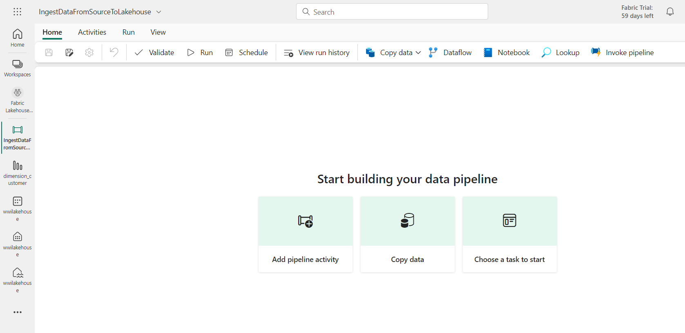
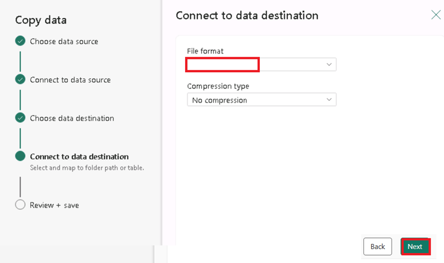
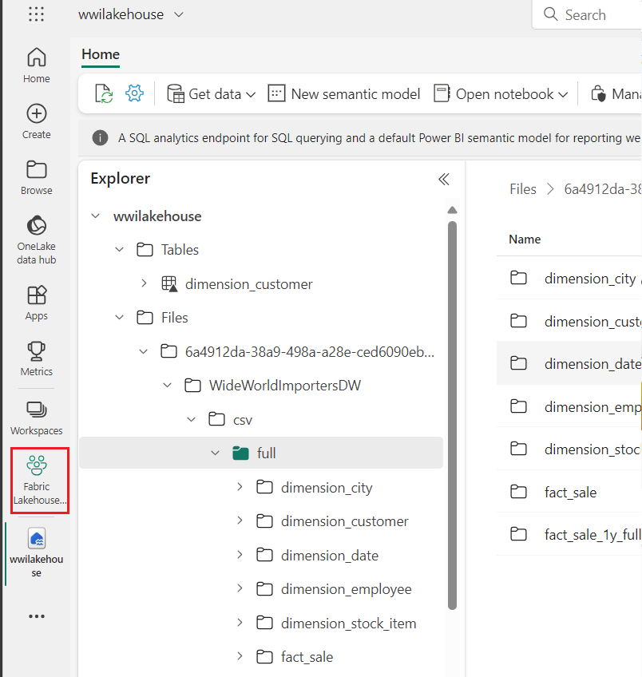

# Anwendungsfall 1: Erstellen eines Lakehouse, Aufnehmen von Beispieldaten und Erstellen eines Berichts

**Einleitung**

Dieses Lab führt Sie durch ein End-to-End-Szenario von der
Datenerfassung bis zur Datennutzung. Es hilft Ihnen, ein grundlegendes
Verständnis von Fabric aufzubauen, einschließlich der verschiedenen
Erfahrungen und ihrer Integration sowie der professionellen und Citizen
Developer-Erfahrungen, die mit der Arbeit auf dieser Plattform
einhergehen. Bei diesem Lab handelt es sich nicht um eine
Referenzarchitektur, eine vollständige Liste von Features und Funktionen
oder eine Empfehlung bestimmter Best Practices.

Traditionell haben Unternehmen moderne Data Warehouses für ihre
Anforderungen an die Analyse von Transaktionen und strukturierten Daten
entwickelt. Und Data Lakehouses für Big Data (semi/unstrukturierte)
Datenanalyseanforderungen. Diese beiden Systeme liefen parallel, was zu
Silos, Datenduplizität und erhöhten Gesamtbetriebskosten führte.

Fabric mit seiner Vereinheitlichung des Datenspeichers und der
Standardisierung im Delta Lake-Format ermöglicht es Ihnen, Silos zu
beseitigen, Datenduplizität zu beseitigen und die Gesamtbetriebskosten
drastisch zu senken.

Mit der Flexibilität, die Fabric bietet, können Sie entweder Lakehouse-
oder Data Warehouse-Architekturen implementieren oder sie miteinander
kombinieren, um mit einer einfachen Implementierung das Beste aus beiden
herauszuholen. In diesem Tutorial nehmen Sie ein Beispiel für eine
Einzelhandelsorganisation und bauen ihr Lakehouse von Anfang bis Ende.
Es verwendet die
[Medaillon-Architektur](https://learn.microsoft.com/en-us/azure/databricks/lakehouse/medallion),
bei der die Bronzeschicht die Rohdaten, die Silberschicht die
validierten und deduplizierten Daten und die Goldschicht hochverfeinerte
Daten enthält. Sie können den gleichen Ansatz wählen, um ein Lakehouse
für jedes Unternehmen aus jeder Branche zu implementieren.

In dieser Übung wird erläutert, wie ein Entwickler des fiktiven
Unternehmens Wide World Importers aus dem Einzelhandelsbereich die
folgenden Schritte ausführt.

**Ziele**:

1\. Melden Sie sich bei einem Power BI-Konto an, und starten Sie eine
kostenlose Microsoft Fabric-Testversion.

2\. Starten Sie die Testversion von Microsoft Fabric (Vorschau) in Power
BI.

3\. Konfigurieren Sie die OneDrive-Registrierung für das Microsoft 365
Admin Center.

4\. Erstellen und implementieren Sie ein End-to-End-Lakehouse für die
Organisation, einschließlich der Erstellung eines Fabric- Workspaces und
eines Lakehouse.

5\. Nehmen Sie Beispieldaten in das Lakehouse auf und bereiten Sie sie
für die weitere Verarbeitung vor.

6\. Transformieren und bereiten Sie die Daten mit Python/PySpark und
SQL-Notebooks vor.

7\. Erstellen Sie Geschäftsaggregattabellen mit verschiedenen Ansätzen.

8\. Richten Sie Beziehungen zwischen Tabellen ein, um eine nahtlose
Berichterstellung zu ermöglichen.

9\. Erstellen Sie einen Power BI-Bericht mit Visualisierungen, die auf
den vorbereiteten Daten basieren.

10\. Speichern und speichern Sie den erstellten Bericht für zukünftige
Referenzen und Analysen.

## Übung 1: Einrichten des End-to-End-Szenarios Lakehouse

### Aufgabe 1: Melden Sie sich bei einem Power BI-Konto an, und registrieren Sie sich für die kostenlose [**Microsoft Fabric-Testversion**](https://learn.microsoft.com/en-us/fabric/get-started/fabric-trial)

1.  Öffnen Sie Ihren Browser, navigieren Sie zur Adressleiste und geben
    Sie die folgende URL ein oder fügen Sie sie ein:
    +++<https://app.fabric.microsoft.com/+++> und drücken Sie dann
    **Enter**.

2.  Geben Sie im **Microsoft Fabric-**Fenster Ihre **Microsoft
    365-**Anmeldeinformationen ein**,** und klicken Sie auf die
    Schaltfläche **Submit**.

3.  Geben Sie dann im **Microsoft**-Fenster das Passwort ein und klicken
    Sie auf die Schaltfläche **Sign In**.

4.  In **Stay signed in?** klicken Sie auf die Schaltfläche **Yes**.

5.  Sie werden zur Power BI-Startseite weitergeleitet.

**Aufgabe 2: Starten der Microsoft Fabric-Testversion**

Führen Sie die folgenden Schritte aus, um Ihre Fabric-Testversion zu
starten.

1.  Klicken Sie auf der **Fabric-Seite** auf der rechten Seite auf den
    **Account Manager**. Navigieren Sie auf dem Blatt Konto-Manager zu
    und wählen Sie **Start Trial** aus, wie in der folgenden Abbildung
    gezeigt.

2.  Wenn Sie dazu aufgefordert werden, stimmen Sie den Bedingungen zu
    und wählen Sie dann **Activate**.

3.  Sobald Ihre Testkapazität bereit ist, erhalten Sie eine
    Bestätigungsnachricht. Wählen Sie **Got it** aus, um mit der Arbeit
    in Fabric zu beginnen.

> 

4.  Öffnen Sie erneut Ihren Account Manager. Beachten Sie, dass Sie
    jetzt eine Überschrift für den **Trial Status** haben. Ihr Account
    Manager behält den Überblick über die Anzahl der verbleibenden Tage
    Ihrer Testversion. Sie sehen den Countdown auch in Ihrer
    Fabric-Menüleiste, wenn Sie in einem Produkterlebnis arbeiten.

> 

**Übung 2: Erstellen und Implementieren eines End-to-End-Lakehouse für
Ihre Organisation**

**Aufgabe 1: Erstellen eines Fabric-** **Workspaces**

In dieser Aufgabe erstellen Sie einen Fabric- Workspace. Das Workspace
enthält alle Elemente, die für dieses Lakehouse-Tutorial erforderlich
sind, einschließlich Lakehouse, Dataflows, Data Factory-Pipelines,
Notebooks, Power BI-Datasets und Berichten.

1.  Auf der Fabric-Startseite, wählen Sie **+New workspace** aus.

2.  Geben Sie im Bereich **Create a workspace**, der auf der rechten
    Seite angezeigt wird, die folgenden Details ein, und klicken Sie auf
    die Schaltfläche **Apply**.

[TABLE]

3.  Hinweis: Um Ihre Lab-Instant-ID zu finden, wählen Sie Help und
    kopieren Sie die Instant-ID.

> 
>
> 
>
> 

4.  Warten Sie, bis die Bereitstellung abgeschlossen ist. Es dauert 2-3
    Minuten, bis der Vorgang abgeschlossen ist.

**Aufgabe 2: Erstellen Sie ein Lakehouse**

1.  Erstellen Sie ein neues Lakehouse, indem Sie in der
    Navigationsleiste auf die Schaltfläche +**New Item** klicken.

> 

2.  Klicken Sie auf die Kachel **Lakehouse**.

> 

3.  Geben Sie im Dialogfeld **New Lakehouse** \> **wwilakehouse** in das
    Feld **Name** ein, klicken Sie auf die Schaltfläche **Create** und
    öffnen Sie das neue Lakehouse.

**Hinweis**: Stellen Sie sicher, dass Sie vor **wwilakehouse** das
Leerzeichen entfernen.

> 

4.  Sie sehen eine Benachrichtigung mit dem Hinweis **Successfully
    created SQL endpoint**.

**Aufgabe 3: Erfassen von Beispieldaten**

1.  Navigieren Sie auf der **wwilakehouse-**Seite zum Abschnitt **Get
    data in your lakehouse** und klicken Sie auf **Upload files as shown
    in the below image.**

2.  Klicken Sie auf der Registerkarte Upload files auf den Ordner unter
    Files.

3.  Navigieren Sie auf Ihrer **VM zu C:\LabFiles**, wählen Sie
    ***dimension_customer.csv*** Datei aus und klicken Sie auf die
    Schaltfläche **Open**.

4.  Klicken Sie dann auf die Schaltfläche **Upload** und schließen Sie.

5.  Klicken Sie auf und wählen Sie Refresh in den **Files**. Die Datei
    erscheint.

1.  Wählen Sie auf der Seite **Lakehouse** im Explorer-Bereich die
    Option Files aus. Nun jedoch mit der Maus auf
    **dimension_customer.csv** Datei zugreifen. Klicken Sie auf die
    horizontalen Ellipsen **(...)** neben **dimension_customer**.csv.
    Navigieren Sie und klicken Sie auf **Load Table**, dann wählen Sie
    **New Table**.

6.  Klicken Sie im Dialogfeld **Load file to new table** auf die
    Schaltfläche **Load**.

7.  Dann, im **Lakehouse-Explorer-**Bereich auf der linken Seite, in der
    **...** für den Knoten **Table**, wählen Sie **Refresh** aus.

8.  Sie können auch den SQL-Endpunkt des Lakehouse verwenden, um die
    Daten mit SQL-Anweisungen abzufragen. Wählen Sie **SQL analytics
    endpoint** aus dem Dropdownmenü **Lakehouse** oben rechts auf dem
    Bildschirm aus.

9.  Wählen Sie auf der Seite **wwilakehouse** unter Explorer die Tabelle
    **dimension_customer** aus**,** um eine Vorschau der Daten
    anzuzeigen, und wählen Sie **New SQL query** aus, um Ihre
    SQL-Anweisungen zu schreiben.

10. Mit der folgenden Beispielabfrage wird die Zeilenanzahl basierend
    auf der Spalte **BuyingGroup** der **dimension_customer** Tabelle
    aggregiert. SQL-Abfragedateien werden automatisch zum späteren
    Nachschlagen gespeichert, und Sie können diese Dateien je nach
    Bedarf umbenennen oder löschen. Fügen Sie den Code ein, wie in der
    folgenden Abbildung gezeigt, und klicken Sie dann auf das
    Wiedergabesymbol, um das Skript **auszuführen (RUN)**.

> SELECT BuyingGroup, Count(\*) AS Total
>
> FROM dimension_customer
>
> GROUP BY BuyingGroup

**Hinweis**: Wenn während der Ausführung des Skripts ein Fehler
auftritt, überprüfen Sie die Skriptsyntax mit dem obigen Bild.

11. Zuvor wurden alle Lakehouse-Tabellen und -Sichten automatisch zum
    semantischen Modell hinzugefügt. Mit den letzten Aktualisierungen
    müssen Sie für neue Lakehouses Ihre Tabellen manuell zum
    semantischen Modell hinzufügen.

12. Wählen Sie auf der Registerkarte "Lakehouse-**Reporting"** die
    Option **manage default Power BI semantic model** aus**,** und
    wählen Sie die Tabellen aus, die Sie dem semantischen Modell
    hinzufügen möchten.

13. Wählen Sie auf der Registerkarte **manage default semantic
    model** die Tabelle **dimension_customer** aus und klicken Sie auf
    **Confirm.**

**Aufgabe 4: Erstellen eines Berichts**

1.  Klicken Sie nun im linken Navigationsbereich auf **Fabric Lakehouse
    Tutorial-XX**.

2.  Wählen Sie in der Ansicht **Fabric Lakehouse Tutorial-XX** die
    Option **wwilakehouse** des Typs **Semantisches Modell (Standard)**
    aus. Dieses Dataset wird automatisch erstellt und hat den gleichen
    Namen wie das Lakehouse.

3.  Im Bereich des semantischen Modells können Sie alle Tabellen
    anzeigen. Sie haben die Möglichkeit, Berichte entweder von Grund auf
    neu zu erstellen, paginierte Berichte zu erstellen oder Power BI
    automatisch einen Bericht basierend auf Ihren Daten erstellen zu
    lassen. Wählen Sie für dieses Tutorial unter **Explore this data**
    die Option **Auto-create a report** aus**,** wie in der folgenden
    Abbildung gezeigt.

4.  Da es sich bei der Tabelle um eine Dimension handelt, die keine
    Measures enthält, erstellt Power BI ein Measure für die
    Zeilenanzahl, aggregiert es über verschiedene Spalten hinweg und
    erstellt verschiedene Diagramme, wie in der folgenden Abbildung
    dargestellt.

5.  Speichern Sie diesen Bericht für die Zukunft, indem Sie im oberen
    Menüband **Save** auswählen.

6.  Geben Sie im Dialogfeld **Save your report** einen Namen für Ihren
    Bericht ein wie folgt: +++dimension_customer-report+++ und wählen
    Sie **Save** aus**.**

7.  Sie sehen eine Benachrichtigung mit dem Hinweis **Report saved**.

**Übung 3: Erfassen von Daten in das Lakehouse**

In dieser Übung nehmen Sie zusätzliche Dimensions- und Faktentabellen
aus den Wide World Importers (WWI) in das Lakehouse auf.

**Aufgabe 1: Erfassen von Daten**

1.  Wählen Sie im linken Navigationsbereich **Workspaces** aus, und
    wählen Sie dann im Menü **Workspaces** Ihr neues Workspace (d. h.
    Fabric Lakehouse Tutorial-XX) aus. Die Elementansicht Ihres
    Workspaces wird angezeigt.

2.  Navigieren Sie auf der Workspace Seite **Fabric Lakehouse
    Tutorial-XX** zu, klicken Sie auf die Schaltfläche **+New Item**,
    und wählen Sie dann **Data pipeline** aus.

3.  Geben Sie im Dialogfeld New Pipeline den Namen
    als**+++IngestDataFromSourceToLakehouse+++** und wählen Sie
    **Create** aus**.** Eine neue Data Factory-Pipeline wird erstellt
    und geöffnet.

4.  Wählen Sie, in newly created data factory pipeline, z. B**.
    IngestDataFromSourceToLakehouse**, den **Copy data assistant** aus.

5.  Richten Sie als Nächstes eine **HTTP-Verbindung** ein, um die
    Beispieldaten von World Wide Importers in das Lakehouse zu
    importieren. Wählen Sie in der Liste der **New Sources** die Option
    **View more** aus, suchen Sie nach **Http,** und wählen Sie es aus.

6.  Geben Sie im Fenster **Connect to data source** die Details aus der
    folgenden Tabelle ein, und wählen Sie **Next** aus.

[TABLE]

7.  

8.  Aktivieren Sie im nächsten Schritt die **Binary Copy** und wählen
    Sie **ZipDeflate (.zip)** als **Compression Type** aus, da es sich
    bei der Quelle um eine .zip Datei handelt. Behalten Sie die
    Standardwerte für die anderen Felder bei, und klicken Sie auf
    **Next**.

9.  Wählen Sie im Fenster **Connect to data destination** Option
    **OneLake Data Hub** und dann **wwilakehouse** aus. Geben Sie nun
    den **Root folder** als Files an und klicken Sie auf **Next**.
    Dadurch werden die Daten in den Abschnitt **Files** des Lakehouse
    geschrieben.

10. Wählen Sie das **File format** aus, das für das Ziel leer sein soll.
    Klicken Sie auf **Next** und dann auf **Save+Run**. Sie können
    Pipelines so planen, dass Daten regelmäßig aktualisiert werden. In
    diesem Tutorial führen wir die Pipeline nur einmal aus. Der
    Kopiervorgang der Daten dauert ca. 15 bis 19
    Minuten.  

11. Jetzt können Sie sehen, dass die Überprüfung fehlschlägt. Klicken
    Sie auf das Symbol **pipeline validation output**

12. Klicken Sie auf der Registerkarte **destination** auf das
    Dropdown-Menü File format und wählen Sie **Binary** aus.

13. Klicken Sie nun auf die Schaltfläche **Run**.  

14. Wählen Sie auf der Registerkarte Ausgabe die Option **Copy_a1n**
    aus, um die Details der Datenübertragung anzuzeigen. Nachdem der
    **Status** als **Succeeded** angezeigt wird, klicken Sie auf die
    Schaltfläche **Close**.

15. Wechseln Sie nach der erfolgreichen Ausführung der Pipeline zu Ihrem
    Lakehouse (**wwilakehouse**), und öffnen Sie den Explorer, um die
    importierten Daten anzuzeigen.

16. Stellen Sie sicher, dass der Ordner **WideWorldImportersDW** in der
    **Explorer-Ansicht** vorhanden ist und Daten für alle Tabellen
    enthält.

17. Die Daten werden im Abschnitt **Files** des Lakehouse-Explorers
    erstellt. Ein neuer Ordner mit GUID enthält alle benötigten Daten.
    Benennen Sie die GUID um in +++wwi-raw-data+++

**Übung 4: Vorbereiten und Transformieren von Daten im Lakehouse**

**Aufgabe 1: Vorbereiten von Daten**

Aus den vorherigen Übungsschritten haben wir Rohdaten, die von der
Quelle in den Abschnitt **Files** des Lakehouse erfasst wurden. Jetzt
können Sie diese Daten transformieren und für die Erstellung von
Delta-Tabellen vorbereiten.

1.  Klicken Sie nun im linken Navigationsbereich auf **Fabric Lakehouse
    Tutorial-XX**.

2.  2.  Navigieren Sie auf der **Startseite** zum Abschnitt **Import**,
        klicken Sie auf **Notebook** und klicken Sie auf **From this
        computer.**

3.  Wählen Sie **Upload** ausnavigieren Sie zum Abschnitt **Import**,
    klicken Sie auf **Notebook** und klicken Sie auf **From this
    computer.**

**Hinweis**: Stellen Sie sicher, dass Sie **All Files (\*.\*)** aus der
Dropdown-Liste neben dem Feld **File Names** auswählen. 

4.  Navigieren Sie zu und wählen Sie **01-Create Delta Tables, 02-Data
    Transformation-Business Aggregation** notebook von **C:\LabFiles**
    und klicken Sie auf die Schaltfläche **Open**.

5.  Sie sehen eine Benachrichtigung mit dem Hinweis **Imported
    successfully.**

6.  Nachdem der Import erfolgreich war, wählen Sie **Fabric Lakehouse
    Tutorial-XX** im Abschnitt **Recommended** aus, um die neu
    importierten Notebooks anzuzeigen.

7.  Wählen Sie im Bereich **Fabric Lakehouse Tutorial-XX**
    \>**wwilakehouse** lakehouse aus, um es zu öffnen.

**Aufgabe 2: Transformieren von Daten und Laden in die
Silber-Delta-Tabelle**

1.  Navigieren Sie auf der Seite **wwilakehouse** und klicken Sie in der
    Befehlsleiste auf **Open notebook** und wählen Sie dann **Existing
    notebook** aus.

2.  Wählen Sie in der Liste **Open existing notebook** öffnen das
    Notebook **01 - Delta Tables** erstellen aus**,** und wählen Sie
    **Open** aus.

3.  Im geöffneten Notebook im **Lakehouse-Explorer** sehen Sie, dass das
    Notebook bereits mit Ihrem geöffneten Lakehouse verknüpft ist.

\*\* Anmerkung\*\*

Fabric bietet die
[**V-Ordnungsfunktion**](https://learn.microsoft.com/en-us/fabric/data-engineering/delta-optimization-and-v-order)
zum Schreiben optimierter Delta Lake-Dateien. Die V-Reihenfolge
verbessert die Komprimierung häufig um das Drei- bis Vierfache und um
das bis zu Zehnfachen der Leistungsbeschleunigung im Vergleich zu Delta
Lake-Dateien, die nicht optimiert sind. Spark in Fabric optimiert
Partitionen dynamisch beim Generieren von Dateien mit einer
Standardgröße von 128 MB. Die Größe der Zieldatei kann mithilfe von
Konfigurationen je nach Workload-Anforderungen geändert werden. Mit der
**[Funktion zum Optimieren
des](https://learn.microsoft.com/en-us/fabric/data-engineering/delta-optimization-and-v-order#what-is-optimized-write)
Schreibens** reduziert die Apache Spark-Engine die Anzahl der
geschriebenen Dateien und zielt darauf ab, die individuelle Dateigröße
der geschriebenen Daten zu erhöhen.

4.  Bevor Sie Daten als Delta Lake-Tabellen im Abschnitt **Tables** des
    Lakehouse schreiben, verwenden Sie zwei Fabric-Funktionen
    (**V-Reihenfolge** und **Optimize Write**), um das Schreiben von
    Daten zu optimieren und die Leseleistung zu verbessern. Um diese
    Funktionen in Ihrer Sitzung zu aktivieren, legen Sie diese
    Konfigurationen in der ersten Zelle Ihres Notebooks fest.

5.  Um das Notebook zu starten und die Zelle auszuführen, wählen Sie das
    Symbol **Run** aus, das beim Mauszeiger links neben der Zelle
    angezeigt wird.

Beim Ausführen einer Zelle mussten Sie die zugrunde liegenden
Spark-Pool- oder Clusterdetails nicht angeben, da Fabric sie über
Live-Pool bereitstellt. Jeder Fabric Workspace verfügt über einen
standardmäßigen Spark-Pool mit dem Namen Live Pool. Das bedeutet, dass
Sie sich beim Erstellen von Notebooks keine Gedanken über das Angeben
von Spark-Konfigurationen oder Clusterdetails machen müssen. Wenn Sie
den ersten Notebook-Befehl ausführen, ist der Live-Pool in wenigen
Sekunden betriebsbereit. Und die Spark-Sitzung wird eingerichtet und
beginnt mit der Ausführung des Codes. Die nachfolgende Codeausführung
erfolgt in diesem Notebook nahezu sofort, während die Spark-Sitzung
aktiv ist.

6.  Als Nächstes lesen Sie Rohdaten aus dem Abschnitt **Files** des
    Lakehouse und fügen im Rahmen der Transformation weitere Spalten für
    verschiedene Datumsteile hinzu. Sie verwenden die partitionBy
    Spark-API, um die Daten zu partitionieren, bevor Sie sie als
    Delta-Tabelle basierend auf den neu erstellten Datenteilspalten
    (Jahr und Quartal) schreiben.

7.  Um die zweite Zelle auszuführen, wählen Sie das Symbol **Run**
    aus**,** das beim Bewegen des Mauszeigers links neben der Zelle
    angezeigt wird.

**Hinweis**: Falls Sie die Ausgabe nicht sehen können, klicken Sie auf
die horizontalen Linien auf der linken Seite der **Spark Jobs**.

\`\`\`

from pyspark.sql.functions import col, year, month, quarter

table_name = 'fact_sale'

df =
spark.read.format("parquet").load('Files/wwi-raw-data/full/fact_sale_1y_full')

df = df.withColumn('Year', year(col("InvoiceDateKey")))

df = df.withColumn('Quarter', quarter(col("InvoiceDateKey")))

df = df.withColumn('Month', month(col("InvoiceDateKey")))

df.write.mode("overwrite").format("delta").partitionBy("Year","Quarter").save("Tables/" +
table_name)

\`\`\`

 

8.  Nachdem die Faktentabellen geladen wurden, können Sie mit dem Laden
    von Daten für die restlichen Dimensionen fortfahren. In der
    folgenden Zelle wird eine Funktion erstellt, um Rohdaten aus dem
    Abschnitt **Files** des Lakehouse für jeden der als Parameter
    übergebenen Tabellennamen zu lesen. Als Nächstes wird eine Liste von
    Dimensionstabellen erstellt. Schließlich durchläuft es die Liste der
    Tabellen und erstellt eine Delta-Tabelle für jeden Tabellennamen,
    der aus dem Eingabeparameter gelesen wird.

9.  Wählen Sie die Zelle aus, ersetzen Sie den Code, und klicken Sie auf
    das Symbol **Run**, das links neben der Zelle angezeigt wird, wenn
    Sie den Mauszeiger darüber bewegen.

10. \`\`\`

11. from pyspark.sql.types import \*

12. def loadFullDataFromSource(table_name):

13. df = spark.read.format("parquet").load('Files/wwi-raw-data/full/' +
    table_name)

14. df.write.mode("overwrite").format("delta").save("Tables/" +
    table_name)

15. 

16. full_tables = \[

17. 'dimension_city',

18. 'dimension_date',

19. 'dimension_employee',

20. 'dimension_stock_item'

21. \]

22. 

23. for table in full_tables:

24. loadFullDataFromSource(table)

25. \`\`\`

 

26. Um die erstellten Tabellen zu validieren, klicken Sie auf und wählen
    Sie Refresh in den **Tables**. Die Tabellen werden angezeigt.  

27. Wechseln Sie erneut in die Elementansicht des Workspaces, wählen Sie
    **Fabric Lakehouse Tutorial-XX** aus, und wählen Sie das
    **wwilakehouse** lakehouse aus, um es zu öffnen.

28. Öffnen Sie nun das zweite Notebook. Öffnen Sie in der
    Lakehouse-Ansicht in der Dropdown-Liste **Open Notebook** und wählen
    Sie im oberen Navigationsmenü **Existing Notebook** aus.

29. Wählen Sie aus der Liste existing Notebook öffnen das **Notebook
    02 - Data Transformation - Business Aggregation** aus und klicken
    Sie auf **Open**.

30. Im geöffneten Notebook im **Lakehouse-Explorer** sehen Sie, dass das
    Notebook bereits mit Ihrem geöffneten Lakehouse verknüpft ist.

31. Um das Notebook zu starten, wählen Sie die Zelle 1^(st) aus, und
    wählen Sie das Symbol **Run** aus, das beim Zeigen auf der linken
    Seite der Zelle angezeigt wird.

32. In einer Organisation arbeiten möglicherweise Data Engineers mit
    Scala/Python und andere Data Engineers mit SQL (Spark SQL oder
    T-SQL), die alle an derselben Kopie der Daten arbeiten. Fabric
    ermöglicht es diesen verschiedenen Gruppen mit unterschiedlichen
    Erfahrungen und Vorlieben, zu arbeiten und zusammenzuarbeiten. Die
    beiden unterschiedlichen Ansätze transformieren und generieren
    Geschäftsaggregate. Sie können den für Sie geeigneten auswählen oder
    diese Ansätze je nach Ihren Vorlieben kombinieren, ohne Kompromisse
    bei der Leistung einzugehen:

    - **Approach \#1** - Verwenden Sie PySpark, um Daten zum Generieren
      von Geschäftsaggregaten zu verknüpfen und zu aggregieren. Dieser
      Ansatz ist jemandem mit Programmierhintergrund (Python oder
      PySpark) vorzuziehen.

    - **Approach \#2** - Verwenden Sie Spark SQL, um Daten zum
      Generieren von Geschäftsaggregaten zu verknüpfen und zu
      aggregieren. Dieser Ansatz ist jemandem mit SQL-Hintergrund
      vorzuziehen, der zu Spark wechselt.

33. **Ansatz \#1 (sale_by_date_city)** - Verwenden Sie PySpark, um Daten
    für die Generierung von Geschäftsaggregaten zu verknüpfen und zu
    aggregieren. Mit dem folgenden Code erstellen Sie drei verschiedene
    Spark-Datenrahmen, die jeweils auf eine vorhandene Deltatabelle
    verweisen. Dann verknüpfen Sie diese Tabellen mit den Datenrahmen,
    gruppieren nach, um die Aggregation zu generieren, benennen einige
    der Spalten um und schreiben sie schließlich als Delta-Tabelle in
    den Abschnitt **Tables** des Lakehouse, um die Daten beizubehalten.

In dieser Zelle erstellen Sie drei verschiedene Spark-Datenrahmen, die
jeweils auf eine vorhandene Delta-Tabelle verweisen.

df_fact_sale = spark.read.table("wwilakehouse.fact_sale")

df_dimension_date = spark.read.table("wwilakehouse.dimension_date")

df_dimension_city = spark.read.table("wwilakehouse.dimension_city")

34. In dieser Zelle verknüpfen Sie diese Tabellen mit den zuvor
    erstellten Datenrahmen, gruppieren nach, um die Aggregation zu
    generieren, benennen einige der Spalten um und schreiben sie
    schließlich als Delta-Tabelle im Abschnitt **Tables** des Lakehouse.

35. \`\`\`

36. sale_by_date_city = df_fact_sale.alias("sale") \\

37. .join(df_dimension_date.alias("date"), df_fact_sale.InvoiceDateKey
    == df_dimension_date.Date, "inner") \\

38. .join(df_dimension_city.alias("city"), df_fact_sale.CityKey ==
    df_dimension_city.CityKey, "inner") \\

39. .select("date.Date", "date.CalendarMonthLabel", "date.Day",
    "date.ShortMonth", "date.CalendarYear", "city.City",
    "city.StateProvince",

40. "city.SalesTerritory", "sale.TotalExcludingTax", "sale.TaxAmount",
    "sale.TotalIncludingTax", "sale.Profit")\\

41. .groupBy("date.Date", "date.CalendarMonthLabel", "date.Day",
    "date.ShortMonth", "date.CalendarYear", "city.City",
    "city.StateProvince",

42. "city.SalesTerritory")\\

43. .sum("sale.TotalExcludingTax", "sale.TaxAmount",
    "sale.TotalIncludingTax", "sale.Profit")\\

44. .withColumnRenamed("sum(TotalExcludingTax)",
    "SumOfTotalExcludingTax")\\

45. .withColumnRenamed("sum(TaxAmount)", "SumOfTaxAmount")\\

46. .withColumnRenamed("sum(TotalIncludingTax)",
    "SumOfTotalIncludingTax")\\

47. .withColumnRenamed("sum(Profit)", "SumOfProfit")\\

48. .orderBy("date.Date", "city.StateProvince", "city.City")

49. 

50. sale_by_date_city.write.mode("overwrite").format("delta").option("overwriteSchema",
    "true").save("Tables/aggregate_sale_by_date_city")

51. \`\`\`

52. **Ansatz \#2 (sale_by_date_employee)** - Verwenden Sie Spark SQL, um
    Daten für die Generierung von Geschäftsaggregaten zu verknüpfen und
    zu aggregieren. Mit dem folgenden Code erstellen Sie eine temporäre
    Spark-Ansicht, indem Sie drei Tabellen verknüpfen, group by
    ausführen, um eine Aggregation zu generieren, und einige der Spalten
    umbenennen. Schließlich lesen Sie aus der temporären Spark-Ansicht
    und schreiben sie schließlich als Delta-Tabelle in den Abschnitt
    **Tables** des Lakehouse, um die Daten beizubehalten.

In dieser Zelle erstellen Sie eine temporäre Spark-Ansicht, indem Sie
drei Tabellen verknüpfen, group by ausführen, um eine Aggregation zu
generieren, und einige der Spalten umbenennen.

\`\`\`

%%sql

CREATE OR REPLACE TEMPORARY VIEW sale_by_date_employee

AS

SELECT

DD.Date, DD.CalendarMonthLabel

, DD.Day, DD.ShortMonth Month, CalendarYear Year

,DE.PreferredName, DE.Employee

,SUM(FS.TotalExcludingTax) SumOfTotalExcludingTax

,SUM(FS.TaxAmount) SumOfTaxAmount

,SUM(FS.TotalIncludingTax) SumOfTotalIncludingTax

,SUM(Profit) SumOfProfit

FROM wwilakehouse.fact_sale FS

INNER JOIN wwilakehouse.dimension_date DD ON FS.InvoiceDateKey = DD.Date

INNER JOIN wwilakehouse.dimension_Employee DE ON FS.SalespersonKey =
DE.EmployeeKey

GROUP BY DD.Date, DD.CalendarMonthLabel, DD.Day, DD.ShortMonth,
DD.CalendarYear, DE.PreferredName, DE.Employee

ORDER BY DD.Date ASC, DE.PreferredName ASC, DE.Employee ASC

\`\`\`

53. In dieser Zelle lesen Sie aus der temporären Spark-Ansicht, die in
    der vorherigen Zelle erstellt wurde, und schreiben sie schließlich
    als Delta-Tabelle in den Abschnitt **Tables** des Lakehouse.

54. sale_by_date_employee = spark.sql("SELECT \* FROM
    sale_by_date_employee")

55. sale_by_date_employee.write.mode("overwrite").format("delta").option("overwriteSchema",
    "true").save("Tables/aggregate_sale_by_date_employee")

56. Um die erstellten Tabellen zu validieren, klicken Sie auf und wählen
    Sie Refresh in den **Tables**. Die Aggregattabellen werden
    angezeigt.

Beide Ansätze führen zu einem ähnlichen Ergebnis. Sie können je nach
Ihrem Hintergrund und Ihren Vorlieben wählen, um die Notwendigkeit zu
minimieren, eine neue Technologie zu erlernen oder Kompromisse bei der
Leistung einzugehen.

Möglicherweise stellen Sie auch fest, dass Sie Daten als Delta
Lake-Dateien schreiben. Die automatische Tabellenermittlung und
-registrierung von Fabric nimmt sie auf und registriert sie im
Metastore. Sie müssen CREATE TABLE-Anweisungen nicht explizit aufrufen,
um Tabellen für die Verwendung mit SQL zu erstellen.

**Übung 5: Erstellen von Berichten in Microsoft Fabric**

In diesem Abschnitt des Tutorials erstellen Sie ein Power BI-Datenmodell
und erstellen einen Bericht von Grund auf neu.

**Aufgabe 1: Untersuchen von Daten in der Silberschicht mithilfe des
SQL-Endpunkts**

Power BI ist nativ in die gesamte Fabric-Umgebung integriert. Diese
native Integration bietet einen einzigartigen Modus namens DirectLake
für den Zugriff auf die Daten aus dem Lakehouse, um die
leistungsstärkste Abfrage- und Berichtserfahrung bereitzustellen. Der
DirectLake-Modus ist eine bahnbrechende neue Engine-Funktion zum
Analysieren sehr großer Datasets in Power BI. Die Technologie basiert
auf der Idee, Parquet-formatierte Dateien direkt aus einem Data Lake zu
laden, ohne dass ein Data Warehouse oder ein Lakehouse-Endpunkt
abgefragt werden muss und ohne dass Daten in ein Power BI-Dataset
importiert oder dupliziert werden müssen. DirectLake ist ein schneller
Weg, um die Daten aus dem Data Lake direkt in die Power BI-Engine zu
laden, um sie für die Analyse bereit zu halten.

Im herkömmlichen DirectQuery-Modus fragt das Power BI-Modul die Daten
direkt aus der Quelle ab, um jede Abfrage auszuführen, und die
Abfrageleistung hängt von der Geschwindigkeit des Datenabrufs ab.
DirectQuery macht das Kopieren von Daten überflüssig und stellt sicher,
dass alle Änderungen in der Quelle während des Imports sofort in den
Abfrageergebnissen widergespiegelt werden. Auf der anderen Seite ist die
Leistung im Importmodus besser, da die Daten sofort im Arbeitsspeicher
verfügbar sind, ohne dass bei jeder Abfrageausführung Daten aus der
Quelle abgefragt werden müssen. Das Power BI-Modul muss die Daten jedoch
zuerst während der Datenaktualisierung in den Arbeitsspeicher kopieren.
Nur Änderungen an der zugrunde liegenden Datenquelle werden bei der
nächsten Datenaktualisierung (sowohl bei der geplanten als auch bei der
bedarfsgesteuerten Aktualisierung) übernommen.

Der DirectLake-Modus eliminiert jetzt diese Importanforderung, indem die
Datendateien direkt in den Arbeitsspeicher geladen werden. Da es keinen
expliziten Importprozess gibt, ist es möglich, alle Änderungen an der
Quelle zu übernehmen, sobald sie auftreten, wodurch die Vorteile von
DirectQuery und dem Importmodus kombiniert und gleichzeitig deren
Nachteile vermieden werden. Der DirectLake-Modus ist daher die ideale
Wahl für die Analyse sehr großer Datasets und Datasets mit häufigen
Aktualisierungen an der Quelle.

1.  Wählen Sie im linken Navigationsbereich **Fabric_LakehouseXX und**
    dann **wwilakehouse** vom **Typ SQL-Analyseendpunkt** aus.

2.  Im Bereich SQL-Endpunkt sollten Sie alle Tabellen sehen können, die
    Sie erstellt haben. Wenn Sie sie noch nicht sehen, wählen Sie oben
    das Symbol **Refresh** aus. Wählen Sie als Nächstes unten die
    Registerkarte **Model layout** aus, um das Power BI-Standarddataset
    zu öffnen.

3.  Für dieses Datenmodell müssen Sie die Beziehung zwischen
    verschiedenen Tabellen definieren, damit Sie Berichte und
    Visualisierungen basierend auf Daten erstellen können, die auf
    verschiedenen Tabellen basieren. Klicken Sie auf **Auto
    Layout.**  

4.  Ziehen Sie aus der **fact_sale** Tabelle das Feld **CityKey** und
    legen Sie es auf dem Feld **CityKey** in der Tabelle
    **dimension_city** ab, um eine Beziehung zu erstellen. Das
    Dialogfeld **Create Relationship** wird angezeigt.

Hinweis: Ordnen Sie die Tabellen neu an, indem Sie auf die Tabelle
klicken und sie per Drag & Drop verschieben, um die dimension_city und
die fact_sale Tabellen nebeneinander zu platzieren. Das Gleiche gilt für
zwei Tabellen, die Sie in Beziehung setzen möchten. Dies dient nur dazu,
das Drag & Drop der Spalten zwischen den Tabellen zu vereinfachen. 

5.  Klicken Sie im Dialogfeld **Create Relationship**:

    - **Table 1** wird mit **fact_sale** und der Spalte von **CityKey**.

    - **Table 2** wird mit **dimension_city** und der Spalte von
      **CityKey**.

    - Cardinality: **Many to one (\*:1)**

    - Cross filter direction: **Single**

    - Lassen Sie das Kontrollkästchen neben **Make this relationship
      active** ausgewählt.

    - Klicken Sie das Kästchen neben **Assume referential integrity.**

    - Wählen Sie **Save** aus.

6.  Fügen Sie als Nächstes diese Beziehungen mit den gleichen
    Einstellungen zum **Create Relationship** wie oben gezeigt hinzu,
    jedoch mit den folgenden Tabellen und Spalten:

    - **StockItemKey(fact_sale)** - **StockItemKey(dimension_stock_item)**

- **Salespersonkey(fact_sale)** - **EmployeeKey(dimension_employee)**

7.  Stellen Sie sicher, dass Sie die Beziehungen zwischen den beiden
    folgenden Sätzen mit den gleichen Schritten wie oben erstellen.

    - **CustomerKey(fact_sale)** - **CustomerKey(dimension_customer)**

    - **InvoiceDateKey(fact_sale)** - **Date(dimension_date)**

8.  Nachdem Sie diese Beziehungen hinzugefügt haben, sollte Ihr
    Datenmodell wie in der folgenden Abbildung dargestellt aussehen und
    ist bereit für die Berichterstellung.

**Aufgabe 2: Erstellen eines Berichts**

1.  Wählen Sie im oberen Menüband **Reporting** und dann **New Report**
    aus**,** um mit dem Erstellen von Berichten/Dashboards in Power BI
    zu beginnen.

2.  Im Power BI-Berichtszeichenbereich können Sie Berichte erstellen,
    die Ihren Geschäftsanforderungen entsprechen, indem Sie die
    erforderlichen Spalten aus dem **Data** Bereich in den
    Zeichenbereich ziehen und eine oder mehrere der verfügbaren
    Visualisierungen verwenden.

**Hinzufügen eines Titels:**

3.  Wählen Sie im Menüband **Text box** aus. Geben Sie **WW Importers
    Profit Reporting** ein. **Markieren Sie** den **Text** und erhöhen
    Sie die Größe auf **20**.

4.  Ändern Sie die Größe des Textfelds, platzieren Sie es **oben**
    **links** auf der Berichtsseite und klicken Sie außerhalb des
    Textfelds.

**Hinzufügen einer Karte:**

- Erweitern Sie im **Data** Bereich **fact_sales** und aktivieren Sie
  das Kontrollkästchen neben **Profit**. Durch diese Auswahl wird ein
  Säulendiagramm erstellt und das Feld zur Y-Achse hinzugefügt.

5.  Wählen Sie bei ausgewähltem Balkendiagramm das
    **Visualisierungsschema** Kachel im Visualisierungsbereich aus.

6.  Mit dieser Auswahl wird das Visual in eine Kachel konvertiert. Legen
    Sie die Karte unter den Titel.

7.  Klicken Sie auf eine beliebige Stelle auf der leeren Leinwand (oder
    drücken Sie die Esc-Taste), sodass die Karte, die wir gerade
    platziert haben, nicht mehr ausgewählt ist.

**Hinzufügen eines Balkendiagramms:**

8.  Erweitern Sie im **Data** Bereich **fact_sales** und aktivieren Sie
    das Kontrollkästchen neben **Profit**. Mit dieser Auswahl wird ein
    Säulendiagramm erstellt und das Feld der Y-Achse hinzugefügt. 

9.  Erweitern Sie im Bereich **Data** **dimension_city,** und aktivieren
    Sie das Kontrollkästchen für **SalesTerritory**. Durch diese Auswahl
    wird das Feld der Y-Achse hinzugefügt. 

10. Wenn das Balkendiagramm ausgewählt ist, wählen Sie im
    Visualisierungsbereich das visuelle Element **Clustered bar chart**
    aus. Durch diese Auswahl wird das Säulendiagramm in ein
    Balkendiagramm umgewandelt.

11. Ändern Sie die Größe des Balkendiagramms, um den Bereich unter dem
    Titel und der Karte auszufüllen.

12. Klicken Sie auf eine beliebige Stelle auf der leeren Arbeitsfläche
    (oder drücken Sie die Esc-Taste), sodass das Balkendiagramm nicht
    mehr ausgewählt ist.

**Erstellen eines visuellen Diagramms für gestapelte Flächen:**

13. Wählen Sie im Bereich **Visualizations** das **Stacked area chart**
    aus.

14. Positionieren Sie das gestapelte Flächendiagramm rechts, und ändern
    Sie die Größe des gestapelten Flächendiagramms.

15. Erweitern Sie im **Data** Bereich **fact_sales** und aktivieren Sie
    das Kontrollkästchen neben **Profit**. Erweitern Sie
    **dimension_date,** und aktivieren Sie das Kontrollkästchen neben
    **FiscalMonthNumber**. Durch diese Auswahl wird ein gefülltes
    Liniendiagramm erstellt, das den Gewinn nach Geschäftsmonat anzeigt.

16. Erweitern Sie den Bereich **Data** **dimension_stock_item,** und
    ziehen Sie **BuyingPackage** in den Feldbereich Legende. Diese
    Auswahl fügt eine Zeile für jedes der Kaufpakete hinzu.

 

17. Klicken Sie auf eine beliebige Stelle im leeren Zeichenbereich (oder
    drücken Sie die Esc-Taste), sodass das Diagramm mit gestapelten
    Flächen nicht mehr ausgewählt ist.

**Erstellen eines Säulendiagramms:**

18. Wählen Sie im **Visualizations** das **Stacked column chart** aus.

19. Erweitern Sie im **Data** Bereich **fact_sales** und aktivieren Sie
    das Kontrollkästchen neben **Profit**. Diese Auswahl fügt das Feld
    der Y-Achse hinzu.

 

20. Erweitern Sie im Data Bereich **dimension_employee,** und aktivieren
    Sie das Kontrollkästchen neben **Employee**. Diese Auswahl fügt das
    Feld zur X-Achse hinzu.

21. Klicken Sie auf eine beliebige Stelle auf der leeren Arbeitsfläche
    (oder drücken Sie die Esc-Taste), sodass das Diagramm nicht mehr
    ausgewählt ist.

22. Wählen Sie im Menüband **File** \> **Save**.

23. Geben Sie den Namen Ihres Berichts wie folgt ein **Profit
    Reporting**. Wählen Sie **Save** aus.

24. Sie erhalten eine Benachrichtigung, dass der Bericht gespeichert
    wurde. 

**Übung 6: Bereinigen von Ressourcen**

Sie können einzelne Berichte, Pipelines, Warehouses und andere Elemente
löschen oder den gesamten Workspace entfernen. Führen Sie die folgenden
Schritte aus, um das Workspace zu löschen, den Sie für dieses Tutorial
erstellt haben.

1.  Wählen Sie Ihren Workspace, das **Fabric Lakehouse Tutorial-XX,**
    aus dem linken Navigationsmenü aus. Es öffnet sich die Ansicht der
    Workspace Elemente.

2.  Wählen Sie die Schaltfläche**...** unter dem Namen des Workspaces
    und wählen Sie **Workspace settings** aus.

3.  Wählen Sie **Other** und **Remove this workspace** aus.

4.  Klicken Sie in der Warnung, die sich öffnet, auf **Delete**.

5.  Warten Sie auf eine Benachrichtigung, dass das Workspace gelöscht
    wurde, bevor Sie mit dem nächsten Lab fortfahren.

**Zusammenfassung**: Dieses praktische Lab konzentriert sich auf die
Einrichtung und Konfiguration wesentlicher Komponenten in Microsoft
Fabric und Power BI für die Datenverwaltung und Berichterstellung. Es
umfasst Aufgaben wie das Aktivieren von Testversionen, das Konfigurieren
von OneDrive, das Erstellen von Workspaces und das Einrichten von
Lakehouses. Das Lab behandelt auch Aufgaben im Zusammenhang mit dem
Erfassen von Beispieldaten, dem Optimieren von Deltatabellen und dem
Erstellen von Berichten in Power BI für eine effektive Datenanalyse.
Ziel ist es, praktische Erfahrungen bei der Nutzung von Microsoft Fabric
und Power BI für die Datenverwaltung und Berichterstellung zu
vermitteln.
