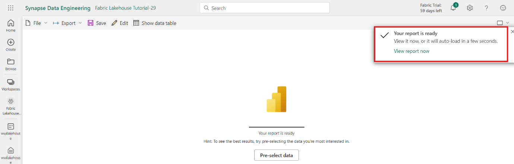
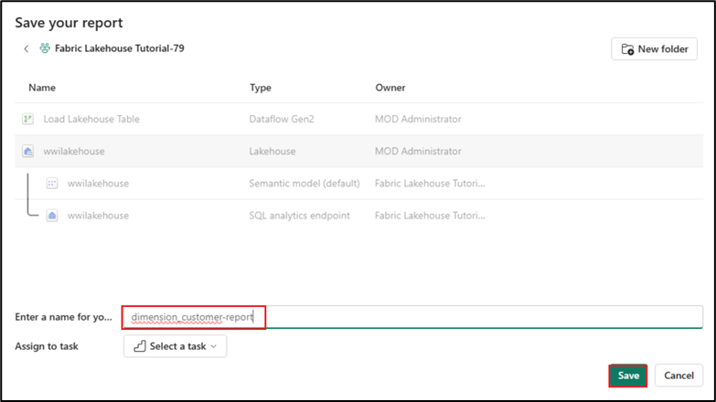
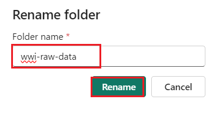
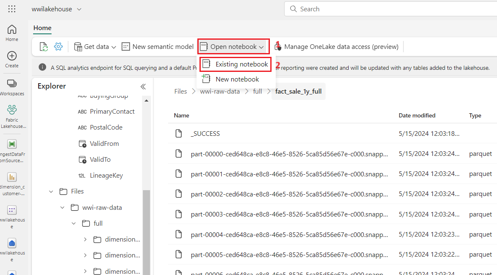

# Caso de uso 1: Creación de un Lakehouse, ingesta de datos de muestra y elaboración de un informe

**Introducción**

Este laboratorio le guía a través de un escenario de principio a fin,
desde la adquisición de datos hasta su consumo. Le ayuda a adquirir una
comprensión básica de Fabric, incluidas las diferentes experiencias y
cómo se integran, así como las experiencias de desarrollador profesional
y ciudadano que conlleva trabajar en esta plataforma. Este laboratorio
no pretende ser una arquitectura de referencia, una lista exhaustiva de
características y funcionalidades, ni una recomendación de mejores
prácticas específicas.

Tradicionalmente, las organizaciones han estado construyendo almacenes
de datos modernos para atender sus necesidades analíticas relacionadas
con datos transaccionales y estructurados. De igual manera, han
implementado data lakehouses para satisfacer los requerimientos de
análisis de grandes volúmenes de datos (semiestructurados o no
estructurados). Estos dos sistemas operaban en paralelo, lo que generaba
silos de información, duplicidad de datos e incrementaba el costo total
de propiedad.

Fabric, con su unificación de almacenamiento de datos y estandarización
en formato Delta Lake, le permite eliminar silos, eliminar la duplicidad
de datos y reducir drásticamente el costo total de propiedad.

Con la flexibilidad que ofrece Fabric, es posible implementar
arquitecturas de lakehouse o de data warehouse, o bien combinarlas para
aprovechar lo mejor de ambas mediante una implementación sencilla. En
este tutorial, se tomará como ejemplo una organización del sector
minorista y se construirá su lakehouse desde el inicio hasta su
finalización. Se utilizará la [arquitectura
medallion](https://learn.microsoft.com/en-us/azure/databricks/lakehouse/medallion)
en la cual la capa bronce contiene los datos en bruto, la capa plata
almacena los datos validados y depurados, y la capa gold incluye datos
altamente refinados. Este mismo enfoque puede aplicarse para implementar
un lakehouse en cualquier organización, sin importar la industria.

Este laboratorio explica cómo un desarrollador de la empresa ficticia
Wide World Importers del sector minorista completa los siguientes pasos.

**Objetivos**:

1\. Iniciar sesión en la cuenta de Power BI e inicie una prueba gratuita
de Microsoft Fabric.

2\. Iniciar la versión de prueba de Microsoft Fabric (Preview) en Power
BI.

3\. Configurar el registro de OneDrive para el centro de administración
de Microsoft 365.

4\. Construir e implementar un lakehouse de extremo a extremo para la
organización, lo cual incluye la creación de un workspace en Fabric y la
configuración de un lakehouse.

5\. Ingerir datos de ejemplo en el lakehouse y prepararlos para su
posterior procesamiento.

6\. Transformar y preparar los datos utilizando notebooks de
Python/PySpark y SQL.

7\. Crear tablas agregadas de negocios utilizando diferentes enfoques.

8\. Establecer relaciones entre las tablas para una presentación de
informes fluida.

9\. Elaborar un informe de Power BI con visualizaciones basadas en los
datos preparados.

10\. Guardar y almacenar el informe creado para futuras referencias y
análisis.

### Ejercicio 1: Configuración de un escenario completo de Lakehouse

### Tarea 1: Inicie sesión en la cuenta de Power BI y regístrese para obtener la [**prueba gratuita de Microsoft Fabric**](https://learn.microsoft.com/en-us/fabric/get-started/fabric-trial)

1.  Abra su navegador, vaya a la barra de direcciones y escriba o pegue
    la siguiente:+++<https://app.fabric.microsoft.com/+++> y, a
    continuación, presione el botón **Enter**.

2.  En la ventana de **Microsoft Fabric**, ingrese sus credenciales de
    **Microsoft 365**, y haga clic en el botón **Submit**.

3.  A continuación, en la ventana de **Microsoft**, ingrese la
    contraseña y haga clic en el botón **Sign in**.

4.  En la ventana **Stay signed in?** haga clic en el botón **Yes**.

5.  Será dirigido a la página de inicio de Power BI.

**Tarea 2: Inicie la versión de prueba de Microsoft**

Siga estos pasos para iniciar su prueba de Fabric.

1.  En la página de **Fabric**, haga clic en **Account manager** en el
    lado derecho. En en panel de Account manager, navegue y
    seleccione **Start trial** como se muestra en la imagen.

2.  Si se solicita, acepte los términos, y después seleccione
    **Activate**.

3.  Una vez que su capacidad de prueba esté lista, recibirá un mensaje
    de confirmación. Seleccione **Got it** para comenzar a trabajar en
    Fabric.

> 

4.  Abra de nuevo su administrador de cuentas. Observe que ahora tiene
    un encabezado para el **Trial status**. Su administrador de cuentas
    lleva un registro del número de días que le quedan de prueba.
    También verá la cuenta atrás en la barra de menú de Fabric cuando
    trabaje en una experiencia de producto.

> 

**Ejercicio 2: Construcción e implementación de un lakehouse integral
para su organización**

**Tarea 1: Crear un workspace de Fabric**

En esta tarea, creará un área de trabajo en Fabric. Este espacio
contendrá todos los elementos necesarios para el tutorial de lakehouse,
incluyendo: el lakehouse, flujos de datos, pipelines de Data Factory,
notebooks, conjuntos de datos de Power BI e informes.

1.  En la página de inicio de Fabric, seleccione el mosaico **+New
    workspace**.

2.  En el panel **Create a workspace** que aparece en la derecha,
    ingrese los siguientes datos y haga clic en el botón **Apply**.

[TABLE]

3.  Nota: Para encontrar su ID instantáneo del laboratorio, seleccione
    ‘Help’ y copie el ID instantáneo.

> 
>
> 
>
> 

4.  Espere a que se complete la implementación, Tarda entre 2 y 3
    minutos en completarse.

**Tarea 2: Crear un lakehouse**

1.  Cree un nuevo lakehouse haciendo clic en el botón **+New item** de
    la barra de navegación.

> 

2.  Haga clic en el mosaico **“Lakehouse”**.

> 

3.  En el cuadro de diálogo **New lakehouse**, ingrese **wwilakehouse**
    en el campo **Name**, haga clic en el botón **Create** y abra el
    nuevo lakehouse.

**Nota**: Asegúrese de eliminar el espacio antes de **wwilakehouse**.

> 

4.  Verá una notificación diciendo **Successfully created SQL
    endpoint**.

**Tarea 3: Ingestar datos de muestra**

1.  En la página **wwilakehouse**, vaya a la sección **Get data in your
    lakehouse** y haga clic en **Upload files** **como se muestra en la
    siguiente imagen.**

2.  En la pestaña Upload files, haga clic en la carpeta situada debajo
    de Files.

3.  Navegue hasta **C:\LabFiles** en su máquina virtual, seleccione el
    archivo ***dimension_customer.csv*** y haga clic en el
    botón **Open**.

4.  A continuación, haga clic en el botón **Upload** y cierre.

5.  Haga clic y seleccione refresh en **Files**. El archivo aparecerá.

6.  En la página **Lakehouse**, en el panel Explorer, seleccione Files.
    Ahora, mueva el cursor sobre el archivo **dimension_customer.csv**.
    Haga clic en los tres puntos horizontales **(…)** junto a
    **dimension_customer.csv**. Navegue y haga clic en **Load Table**,
    luego seleccione **New table**.

7.  En el cuadro de diálogo **Load file to new table**, haga clic en el
    botón **Load**.

8.  A continuación, en el panel **Lakehouse Explorer** de la izquierda,
    en el menú **...** del nodo **Table**, seleccione **Refresh**.

9.  También puede utilizar el endpoint SQL del lakehouse para consultar
    los datos con sentencias SQL. Seleccione **SQL analytics
    endpoint** en el menú desplegable **Lakehouse** situado en la parte
    superior derecha de la pantalla.

10. En la página wwilakehouse, en Explorer, seleccione la
    tabla **dimension_customer** para obtener una vista previa de sus
    datos y seleccione **New SQL query** para escribir sus comandos SQL.

11. La siguiente consulta de ejemplo agrega el recuento de filas en
    función de la **columna BuyingGroup** de la
    tabla **dimension_customer**. Los archivos de consulta SQL se
    guardan automáticamente para futuras consultas, y puede renombrar o
    eliminar estos archivos según sus necesidades. Pegue el código como
    se muestra en la imagen siguiente y, a continuación, haga clic en el
    icono de reproducción para **ejecutar** el script.

> SELECT BuyingGroup, Count(\*) AS Total
>
> FROM dimension_customer
>
> GROUP BY BuyingGroup

**Nota:** Si se produce un error durante la ejecución del script,
verifique la sintaxis del script con la imagen anterior.

12. Anteriormente, todas las mesas y vistas de los lakehouses se añadían
    automáticamente al modelo semántico. Con las actualizaciones
    recientes, para los nuevos lakehouses, tiene que añadir manualmente
    sus tablas al modelo semántico.

13. En la pestaña **Reporting**, seleccione **Manage default Power BI
    semantic model** y seleccione las tablas que desea agregar al modelo
    semántico.

14. En la pestaña **Manage default semantic model**, seleccione la
    tabla **dimension_customer** y haga clic en **Confirm.**

**Tarea 4: Elaborar un informe**

1.  Ahora, haga clic en **Fabric Lakehouse** **Tutorial-XX** en el panel
    de navegación de la izquierda.

2.  En la vista **Fabric Lakehouse Tutorial-XX**, seleccione
    **wwilakehouse** de tipo **Semantic model(default)**. Este conjunto
    de datos se crea automáticamente y tiene el mismo nombre que el
    lakehouse.

3.  Desde el panel del modelo semántico, puede ver todas las tablas.
    Tiene opciones para crear informes desde cero, informes paginados o
    dejar que Power BI cree automáticamente un informe basado en sus
    datos. Para este tutorial, en **Explore this data**, seleccione
    **Auto-create a report** como se muestra en la siguiente imagen.

4.  Dado que la tabla es una dimension y no contiene medidas, Power BI
    crea una medida para el recuento de filas y lo agrega en diferentes
    columnas, y crea diferentes gráficos como se muestra en la siguiente
    imagen.

5.  Guarde este informe para el futuro seleccionando **Save** en la
    cinta superior.

6.  En el cuadro de diálogo **Save your replort**, ingrese un nombre
    para su informe como +++dimension_customer-report+++ y
    seleccione **Save.**

7.  Verá una notificación con el mensaje **Report saved**.

**Ejercicio 3: Ingestión de datos en el lakehouse**

En este ejercicio, usted ingiere tablas dimensionales y de hechos
adicionales de Wide World Importers (WWI) en lakehouse.

**Tarea 1: Ingestión de datos**

1.  Seleccione **Workspaces** en el panel de navegación izquierdo y, a
    continuación, seleccione su nuevo workspace (ejemplo, Fabric
    Lakehouse Tutorial-XX) en el menú **Workspaces**. Aparece la vista
    de elementos de su workspace.

2.  En la página del workspace **Fabric Lakehouse Tutorial-XX**, navegue
    y haga clic en el botón **+New item**, luego seleccione **Data
    pipeline**.

3.  En el cuadro de diálogo New pipeline, especifique el nombre como
    **+++IngestDataFromSourceToLakehouse+++** y seleccione **Create.**
    Se crea y se abre un nuevo pipeline de Data Factory

4.  En el nuevo pipeline de Data Factory, por ejemplo
    **IngestDataFromSourceToLakehouse**, seleccione  **Copy data
    assistant** .

5.  A continuación, configure una conexión **HTTP** para importer los
    datos de muestra de World Wide Importers en el Lakehouse. En la
    lista **New sources**, seleccione **View more**, busque **Http** y
    selecciónelo.

6.  En la ventana **Connect to data source**, ingrese los datos de la
    tabla siguiente y seleccione **Next**.

[TABLE]

> 

7.  En el siguiente paso, habilite **Binary copy** y elija **ZipDeflate
    (.zip)** como **Compression type** ya que el archivo Source es un
    archivo .zip. Mantenga los demás campos con sus valores
    predeterminados y haga clic en **Next**.

8.  En la ventana **Connect to data destination**, seleccione **OneLake
    data hub** y seleccione **wwilakehouse.** Ahora, especifique **Root
    folder** como **Files** y haga clic en **Next**. Esto escribirá los
    datos en la sección **Files **del lakehouse.

9.  Elija **File format** como **Binary** para el destino. Haga clic en
    **Next** y luego en **Save+Run**. Puede programar pipelines para
    actualizar datos periódicamente. En este tutorial, solo ejecutaremos
    el pipeline una vez. El proceso de copia de datos tarda
    aproximadamente entre 15 y 19 minutos en
    completarse.  

10. Ahora, puede ver que la validación fallará. Haga clic en el botón
    **pipeline validation output.**

11. En la pestaña **destination**, despliegue File format y seleccione
    **Binary**.

12. Ahora haga clic en el botón **Run**. 

13. En la pestaña Output, seleccione **Copy_a1n** para ver los detalles
    de la transferencia de datos. Después de ver el **Status** como
    **Succeeded**, haga clic en el botón **Close**.

14. Después de la ejecución exitosa del pipeline, vaya a su lakehouse
    (**wwilakehouse**) y abra el explorador para ver los datos
    importados.

15. Verifique que la carpeta **WideWorldImportersDW** esté presente en
    la vista **Explorer** y que contenga datos para todas las tablas.

16. Los datos se crean en la sección **Files** del explorador de
    lakehouse. Una nueva carpeta con GUID contiene todos los datos
    necesarios. Cambie el nombre del GUID a +++**wwi-raw-data+++**

**Ejercicio 4: Preparación y transformación de datos en el lakehouse**

**Tarea 1: Preparación de los datos**

A partir de los pasos del ejercicio anterior, tenemos datos sin procesar
ingeridos desde la fuente hasta la sección **Files** de el lakehouse.
Ahora puede transformar esos datos y prepararlos para crear tablas
delta.

1.  Ahora, haga clic en **Fabric Lakehouse** **Tutorial-XX** en el panel
    de navegación de la izquierda.

2.  2.  En la página **Home**, navegue a la sección **Import**, haga
        clic en **Notebook** y haga clic en **From this computer.**

3.  Seleccione **Upload** en la sección **Import**, haga clic
    en **Notebook** y haga clic en **From this computer.**

**Nota**: Asegúrese de seleccionar **All files (\*.\*)** en el menú
desplegable junto al campo **File name**.

 

4.  Navegue y seleccione los notebooks **01-Create Delta Tables, 02-Data
    Transformation-Business Aggregation** desde **C:\LabFiles** y haga
    clic en el botón **Open**.

5.  Verá una notificación con el mensaje **Imported successfully.**

6.  Una vez que la importación se haya realizado correctamente, para ver
    los notebooks recién importados, seleccione **Fabric Lakehouse
    Tutorial-XX** en la sección **Recommended**.

7.  En el panel **Fabric Lakehouse Tutorial-XX**,
    seleccione **wwilakehouse** lakehouse para abrirlo.

**Tarea 2: Transformar datos y cargarlos en la tabla Delta Silver**

1.  En la página **wwilakehouse**, navegue y haga clic en el menú
    desplegable **Open notebook** en la barra de comandos, y luego
    seleccione **Existing notebook**.

2.  En la lista **Open existing notebook**, seleccione el
    notebook **01 - Create Delta Tables** y seleccione **Open**.

3.  En el notebook abierto en **Lakehouse explorer**, verá que el
    notebook ya está vinculado a su lakehouse abierta.

\*\* Nota\*\*

Fabric proporciona la capacidad de
[**V-order**](https://learn.microsoft.com/en-us/fabric/data-engineering/delta-optimization-and-v-order) para
escribir archivos delta lake optimizados. A menudo, mejora la compresión
entre tres y cuatro veces y acelera el rendimiento hasta 10 veces en
comparación con los archivos Delta Lake que no están optimizados. Spark
en Fabric optimiza dinámicamente las particiones mientras genera
archivos con un tamaño predeterminado de 128 MB. El tamaño del archivo
de destino puede cambiarse según los requisitos de la carga de trabajo
mediante configuraciones. Con la capacidad de [***optimizar la
escritura***](https://learn.microsoft.com/en-us/fabric/data-engineering/delta-optimization-and-v-order#what-is-optimized-write),
el motor Apache Spark reduce el número de archivos escritos y tiene como
objetivo aumentar el tamaño de cada archivo de los datos escritos.

4.  Antes de escribir datos como tablas delta lake en la sección
    **Tables** de el lakehouse, utilice dos funciones de Fabric
    (**V-order** y **Optimize Write**) para optimizer la escritura de
    datos y mejorar el rendimiento de lectura. Para habilitar estas
    funciones en su sesión, establezca estas configuraciones en la
    primera celda de su notebook.

5.  Para iniciar el notebook, seleccione el icono **Run** que aparece a
    la izquierda de la celda al pasar el cursor por encima.

Al ejecutar una celda, no es necesario especificar configuraciones de
pools Spark o detalles de clúster, ya que Fabric los proporciona
automáticamente mediante el Live Pool. Cada área de trabajo de Fabric
incluye un pool Spark predeterminado denominado Live Pool. Esto
significa que, al crear notebooks, no hay que configurar parámetros de
Spark o detalles de clúster. Al ejecutar el primer comando en el
notebook, el Live Pool se activa en segundos, estableciendo la sesión de
Spark que comienza a ejecutar el código. Las ejecuciones posteriores en
el mismo notebook son casi instantáneas mientras la sesión Spark
permanezca activa. 

6.  A continuación, lee los datos sin procesar de la sección **Files**
    de lakehouse y añade más columnas para las diferentes partes de la
    fecha como parte de la transformación. Utiliza la API de Spark
    partitionBy para dividir los datos antes de escribirlos como tabla
    delta basada en las columnas de la parte de datos recién creadas
    (Year y Quarter).

7.  Para ejecutar la segunda celda, seleccione el icono **Run** que
    aparece a la izquierda de la celda al pasar por el cursor por
    encima.

**Nota**: En caso de que no pueda ver el resultado, haga clic en las
líneas horizontales del lado izquierdo de **Spark jobs**.

\`\`\`

from pyspark.sql.functions import col, year, month, quarter

table_name = 'fact_sale'

df =
spark.read.format("parquet").load('Files/wwi-raw-data/full/fact_sale_1y_full')

df = df.withColumn('Year', year(col("InvoiceDateKey")))

df = df.withColumn('Quarter', quarter(col("InvoiceDateKey")))

df = df.withColumn('Month', month(col("InvoiceDateKey")))

df.write.mode("overwrite").format("delta").partitionBy("Year","Quarter").save("Tables/" +
table_name)

\`\`\`

 

8.  Después de que se carguen las tablas de hechos, puede pasar a cargar
    datos para el resto de las dimensiones. La siguiente celda crea una
    función para leer datos sin procesar de la sección Files del
    lakehouse para cada uno de los nombres de tabla pasados como
    parámetro. A continuación, crea una lista de tablas de dimensiones.
    Por último, recorre la lista de tablas y crea una tabla delta para
    cada nombre de tabla que se lee desde el parámetro de entrada.

9.  Seleccione la celda y el icono **Run** que aparece a la izquierda de
    la celda la pasar el cursor

10. \`\`\`

11. from pyspark.sql.types import \*

12. def loadFullDataFromSource(table_name):

13. df = spark.read.format("parquet").load('Files/wwi-raw-data/full/' +
    table_name)

14. df.write.mode("overwrite").format("delta").save("Tables/" +
    table_name)

15. 

16. full_tables = \[

17. 'dimension_city',

18. 'dimension_date',

19. 'dimension_employee',

20. 'dimension_stock_item'

21. \]

22. 

23. for table in full_tables:

24. loadFullDataFromSource(table)

25. \`\`\`

 

26. Para validar las tablas creadas, haga clic y seleccione refresh en
    **Tables**. Las tablas aparecen.  

27. Vuelva a la vista de elementos del workspace, seleccione **Fabric
    Lakehouse Tutorial-XX** y seleccione el
    lakehouse **wwilakehouse** para abrirlo.

28. Ahora, abra el segundo notebook. En la vista lakehouse, despliegue
    el menú **Open notebook** y seleccione **Existing notebook** en el
    menú de navegación superior.

29. En la lista de Open existing notebook, seleccione el notebook **02 -
    Data Transformation - Business** **Aggregation** y haga clic en
    **Open**.

30. En el notebook abierto en **Lakehouse explorer**, verá que el
    notebook ya está vinculado a su lakehouse abierta.

31. Para iniciar el notebook, seleccione la primera celda y el
    icono **Run** que aparece a la izquierda de la celda al pasar el
    cursor.

32. Una organización puede contar con ingenieros de datos que trabajen
    con Scala/Python y otros que utilicen SQL (Spark SQL o T-SQL), todos
    colaborando sobre la misma copia de los datos. Microsoft Fabric
    permite que estos distintos grupos, con diferentes niveles de
    experiencia y preferencias, trabajen y colaboren de manera
    eficiente. Ambos enfoques permiten transformar los datos y generar
    agregados empresariales. Puede seleccionar el que mejor se adapte a
    sus necesidades o incluso combinar ambos métodos según sus
    preferencias, sin comprometer el rendimiento del sistema:

    - **Enfoque \#1** - Utilice PySpark para unir y agregar datos con el
      fin de generar métricas empresariales. Este enfoque es preferible
      para personas con experiencia en programación (Python o PySpark).

    - **Enfoque \#2** - Utilice Spark SQL para unir y agregar datos con
      el fin de generar agregados empresariales. Este enfoque es
      preferible para personas con conocimientos de SQL que están
      pasando a Spark.

33. **Approach \#1 (sale_by_date_city)** - Utilice PySpark para unir y
    agregar datos con el fin de generar agregados empresariales. Con el
    siguiente código, se crean tres dataframes de Spark diferentes, cada
    uno de los cuales hace referencia a una tabla delta existente. A
    continuación, se unen estas tablas utilizando los dataframes, se
    agrupan para generar la agregación, se renombran algunas de las
    columnas y, por último, se escriben como una tabla delta en la
    sección **Tables** del lakehouse para conservar los datos.

En esta celda, se crean tres dataframes de Spark diferentes, cada uno de
los cuales hace referencia a una tabla delta existente.

df_fact_sale = spark.read.table("wwilakehouse.fact_sale")

df_dimension_date = spark.read.table("wwilakehouse.dimension_date")

df_dimension_city = spark.read.table("wwilakehouse.dimension_city")

34. En esta celda, se unen estas tablas utilizando los dataframes
    creados anteriormente, se agrupan para generar la agregación, se
    renombran algunas de las columnas y, por último, se escribe como una
    tabla delta en la sección **Tables** de lakehouse.

35. \`\`\`

36. sale_by_date_city = df_fact_sale.alias("sale") \\

37. .join(df_dimension_date.alias("date"), df_fact_sale.InvoiceDateKey
    == df_dimension_date.Date, "inner") \\

38. .join(df_dimension_city.alias("city"), df_fact_sale.CityKey ==
    df_dimension_city.CityKey, "inner") \\

39. .select("date.Date", "date.CalendarMonthLabel", "date.Day",
    "date.ShortMonth", "date.CalendarYear", "city.City",
    "city.StateProvince",

40. "city.SalesTerritory", "sale.TotalExcludingTax", "sale.TaxAmount",
    "sale.TotalIncludingTax", "sale.Profit")\\

41. .groupBy("date.Date", "date.CalendarMonthLabel", "date.Day",
    "date.ShortMonth", "date.CalendarYear", "city.City",
    "city.StateProvince",

42. "city.SalesTerritory")\\

43. .sum("sale.TotalExcludingTax", "sale.TaxAmount",
    "sale.TotalIncludingTax", "sale.Profit")\\

44. .withColumnRenamed("sum(TotalExcludingTax)",
    "SumOfTotalExcludingTax")\\

45. .withColumnRenamed("sum(TaxAmount)", "SumOfTaxAmount")\\

46. .withColumnRenamed("sum(TotalIncludingTax)",
    "SumOfTotalIncludingTax")\\

47. .withColumnRenamed("sum(Profit)", "SumOfProfit")\\

48. .orderBy("date.Date", "city.StateProvince", "city.City")

49. 

50. sale_by_date_city.write.mode("overwrite").format("delta").option("overwriteSchema",
    "true").save("Tables/aggregate_sale_by_date_city")

51. \`\`\`

52. **Approach \#2 (sale_by_date_employee)** - Utilice Spark SQL para
    unir y agregar datos con el fin de generar agregados empresariales.
    Con el siguiente código, se crea una vista temporal de Spark uniendo
    tres tablas, se agrupa para generar la agregación y se renombran
    algunas de las columnas. Por último, se lee desde la vista temporal
    de Spark y, finalmente, se escribe como una tabla delta en la
    sección **Tables** del lakehouse para conservar los datos.

En esta celda, se crea una vista Spark temporal uniendo tres tablas, se
agrupa para generar la agregación y se renombran algunas de las
columnas.

\`\`\`

%%sql

CREATE OR REPLACE TEMPORARY VIEW sale_by_date_employee

AS

SELECT

DD.Date, DD.CalendarMonthLabel

, DD.Day, DD.ShortMonth Month, CalendarYear Year

,DE.PreferredName, DE.Employee

,SUM(FS.TotalExcludingTax) SumOfTotalExcludingTax

,SUM(FS.TaxAmount) SumOfTaxAmount

,SUM(FS.TotalIncludingTax) SumOfTotalIncludingTax

,SUM(Profit) SumOfProfit

FROM wwilakehouse.fact_sale FS

INNER JOIN wwilakehouse.dimension_date DD ON FS.InvoiceDateKey = DD.Date

INNER JOIN wwilakehouse.dimension_Employee DE ON FS.SalespersonKey =
DE.EmployeeKey

GROUP BY DD.Date, DD.CalendarMonthLabel, DD.Day, DD.ShortMonth,
DD.CalendarYear, DE.PreferredName, DE.Employee

ORDER BY DD.Date ASC, DE.PreferredName ASC, DE.Employee ASC

\`\`\`

53. En esta celda, se lee desde la vista Spark temporal creada en la
    celda anterior y finalmente se escribe como tabla delta en la
    sección **Tables** del lakehouse.

54. sale_by_date_employee = spark.sql("SELECT \* FROM
    sale_by_date_employee")

55. sale_by_date_employee.write.mode("overwrite").format("delta").option("overwriteSchema",
    "true").save("Tables/aggregate_sale_by_date_employee")

56. Para validar las tablas creadas, haga clic y seleccione refresh
    en **Tables**. Aparecerán las tablas agregadas.

Ambos enfoques producen un resultado similar. Puede elegir en función de
sus antecedentes y preferencias, para minimizar la necesidad de aprender
una nueva tecnología o comprometer el rendimiento.

También puede darse cuenta de que está escribiendo datos como archivos
delta lake. La función automática de descubrimiento y registro de tablas
de Fabric los recoge y los registra en el metastore. No necesita llamar
explícitamente a las sentencias CREATE TABLE para crear tablas que
utilizar con SQL.

**Ejercicio 5: Creación de informes en Microsoft Fabric**

En esta sección del tutorial, creará un modelo de datos de Power BI y
creará un informe desde cero.

**Tarea 1: Analizar datos en la capa Silver usando el endpoint SQL**

Power BI está integrado de forma nativa en toda la experiencia Fabric.
Esta integración nativa aporta un modo único, denominado DirectLake, de
acceder a los datos desde el lakehouse para ofrecer la experiencia de
consulta y elaboración de informes más eficaz. El modo DirectLake es una
nueva y revolucionaria capacidad del motor para analizar conjuntos de
datos muy grandes en Power BI. La tecnología se basa en la idea de
cargar archivos con formato parquet directamente desde un lago de datos
sin tener que consultar un almacén de datos o un endpoint de lakehouse,
y sin tener que importar o duplicar datos en un conjunto de datos de
Power BI. DirectLake es una vía rápida para cargar los datos del lago de
datos directamente en el motor de Power BI, listos para su análisis.

En el modo DirectQuery tradicional, el motor de Power BI consulta
directamente los datos desde la fuente para ejecutar cada consulta, y el
rendimiento de la consulta depende de la velocidad de recuperación de
los datos. DirectQuery elimina la necesidad de copiar los datos,
garantizando que cualquier cambio en la fuente se refleje inmediatamente
en los resultados de la consulta durante la importación. Por otro lado,
en el modo Import, el rendimiento es mejor porque los datos están
disponibles en la memoria sin necesidad de consultar los datos de la
fuente en cada ejecución de la consulta. Sin embargo, el motor de Power
BI debe copiar primero los datos en la memoria durante la actualización
de datos. Sólo los cambios en la fuente de datos subyacente se recogen
durante la siguiente actualización de datos (tanto en actualización
programada como bajo demanda).

El modo DirectLake elimina ahora este requisito de importación al cargar
los archivos de datos directamente en la memoria. Al no haber un proceso
de importación explícito, es posible recoger cualquier cambio en la
fuente a medida que se produce, combinando así las ventajas de
DirectQuery y del modo de importación y evitando al mismo tiempo sus
desventajas. El modo DirectLake es, por tanto, la opción ideal para
analizar conjuntos de datos muy grandes y conjuntos de datos con
actualizaciones frecuentes en el origen.

1.  En el panel de navegación izquierdo, seleccione
    **Fabric_LakehouseXX** y, a continuación, seleccione
    **wwilakehouse** de **Type** **SQL analytics endpoint.**

2.  En el panel SQL endpoint, debería poder ver todas las tablas que ha
    creado. Si aún no las ve, seleccione el icono **Refresh** en la
    parte superior. A continuación, seleccione la pestaña **Model
    layout** en la parte inferior para abrir el conjunto de datos
    predeterminado de Power BI.

3.  Para este modelo de datos, es necesario definir la relación entre
    las distintas tablas para poder crear informes y visualizaciones
    basados en los datos procedentes de las distintas tablas. Haga clic
    en **Auto layout**. 

4.  Desde la tabla **fact_sale**, arrastre el campo **CityKey** y
    suéltelo sobre el campo **CityKey** de la
    tabla **dimension_city** para crear una relación. Aparecerá el
    cuadro de diálogo **Create Relationship**.

Nota: Reorganice las tablas haciendo clic en la tabla, arrastrando y
soltando para que las tablas dimension_city y fact_sale estén una al
lado de la otra. Lo mismo vale para dos tablas cualesquiera con las que
intente crear una relación. Esto es sólo para hacer el arrastrar y
soltar de las columnas entre las tablas es más fácil. 

5.  En el cuadro de diálogo **Create Relationship**:

    - **Table 1** se rellena con** fact_sale** y la columna de
      **CityKey**.

    - **Table 2** se rellena con** dimension_city y** la columna de
      **CityKey**.

    - Cardinality: **Many to one (\*:1)**

    - Cross filter direction: **Single**

    - Deje seleccionada la casilla junto a **Make this relationship
      active**.

    - Seleccione la casilla junto a **Assume referential integrity.**

    - Seleccione **Save.**

6.  A continuación, añada estas relaciones con la misma
    configuración **Create Relationship** que la mostrada anteriormente,
    pero con las siguientes tablas y columnas:

    - **StockItemKey(fact_sale)** - **StockItemKey(dimension_stock_item)**

- **Salespersonkey(fact_sale)** - **EmployeeKey(dimension_employee)**

7.  Asegúrese de crear las relaciones entre los dos conjuntos siguientes
    siguiendo los mismos pasos anteriores.

    - **CustomerKey(fact_sale)** - **CustomerKey(dimension_customer)**

    - **InvoiceDateKey(fact_sale)** - **Date(dimension_date)**

8.  Después de añadir estas relaciones, su modelo de datos debería ser
    como se muestra en la siguiente imagen y está listo para la
    elaboración de informes.

**Tarea 2: Elaborar el informe**

1.  En la cinta superior selecione **Reporting**, seleccione **New
    report** para empezar a crear informes/tableros de mandos en Power
    BI.

2.  En el lienzo de informes de Power BI, puede crear informes para
    satisfacer sus necesidades empresariales arrastrando las columnas
    necesarias desde el panel **Data** al lienzo y utilizando una o
    varias de las visualizaciones disponibles.

**Añada un título:**

3.  En la cinta de opciones, seleccione **Text box**. Escriba **WW
    Importers Profit Reporting**. **Resalte** el **texto** y aumente el
    tamaño a **20**.

4.  Cambie el tamaño del cuadro de texto y colóquelo en la parte
    superior izquierda de la página del informe y haga clic fuera del
    cuadro de texto.

**Añadir una tarjeta:**

- En el panel **Data**, expanda **fact_sales** y marque la casilla junto
  a **Profit**. Esta selección crea un gráfico de columnas y añade el
  campo al eje Y.

5.  Con el gráfico de barras seleccionado, seleccione el
    visual **Card** en el panel de visualización.

6.  Esta selección convierte el visual en una tarjeta. Coloque la
    tarjeta bajo el título.

7.  Haga clic en cualquier lugar del lienzo en blanco (o presione la
    tecla Esc) para que la tarjeta que acabamos de colocar deje de estar
    seleccionada.

**Agregar un gráfico de barras:**

8.  En el panel **Data**, expanda **fact_sales** y marque la casilla
    junto a **Profit**. Esta selección crea un gráfico de columnas y
    añade el campo al eje Y. 

9.  En el panel **Data**, expanda **dimension_city** y marque la
    casilla **SalesTerritory**. Esta selección añade el campo al eje Y.
     

10. Con el gráfico de barras seleccionado, seleccione el
    visual **Clustered bar chart** en el panel de visualización. Esta
    selección convierte el gráfico de columnas en un gráfico de barras.

11. Redimensione el diagrama de barras para rellenar el área debajo del
    título y la tarjeta.

12. Haga clic en cualquier lugar del lienzo en blanco (o presione la
    tecla Esc) para que el gráfico de barras deje de estar seleccionado.

**Crear una visualización de tipo gráfico de áreas apiladas:**

13. En el panel **Visualizations**, seleccione el visual **Stacked area
    chart**.

14. Reposicione y cambie el tamaño del gráfico de áreas apiladas a la
    derecha de los visuales de tarjeta y gráfico de barras creados en
    los pasos anteriores.

15. En el panel **Data**, expanda **fact_sales** y marque la casilla
    junto a **Profit**. Expanda **dimension_date** y marque la casilla
    junto a **FiscalMonthNumber**. Esta selección crea un gráfico de
    líneas relleno que muestra el beneficio por mes fiscal.

16. En el panel **Data**, expanda **dimension_stock_item** y
    arrastre **BuyingPackage** al área de Leyenda. Esta selección añade
    una línea para unos de los Buying Packages.

 

17. Haga clic en cualquier lugar del lienzo en blanco (o presione la
    tecla Esc) para que el gráfico de áreas apiladas deje de estar
    seleccionado.

**Crear un gráfico de columnas:**

18. En el panel **Visualizations**, seleccione el visual **Stacked
    column chart**.

19. En el panel **Data**, expanda **fact_sales** y marque la casilla
    **Profit**. Esta selección añade el campo al eje Y.

 

20. En el panel **Data**, expanda **dimension_employee** y marque la
    casilla junto a **Employee**. Esta selección añade el campo al eje
    X.

21. Haga clic en cualquier lugar del lienzo en blanco (o presione la
    tecla Esc) para que el gráfico deje de estar seleccionado.

22. En la cinta, seleccione **File** \> **Save**.

23. Ingrese el nombre de su informe como **Profit Reporting**.
    Seleccione **Save**.

24. Recibirá una notificación indicándole que el informe se ha
    guardado. 

**Ejercicio 6: Liberación de recursos**

Puede eliminar informes individuales, pipelines, almacenes y otros
elementos o eliminar todo el workspace. Siga estos pasos para eliminar
el workspace que ha creado para este tutorial.

1.  Seleccione su workspace, **Fabric Lakehouse Tutorial-XX** en el menú
    de navegación de la izquierda. Se abrirá la vista de elementos del
    workspace.

2.  Seleccione la opción ***...*** bajo el nombre del worskspace y
    seleccione **Workspace settings**.

3.  Seleccione **Other** y **Remove this workspace.**

4.  Haga clic en **Delete** en la advertencia que aparece.

5.  Espere a recibir una notificación de que el workspace ha sido
    eliminado, antes de pasar al siguiente laboratorio.

**Resumen**: Este laboratorio práctico se centra en la instalación y
configuración de componentes esenciales dentro de Microsoft Fabric y
Power BI para la gestión de datos y la elaboración de informes. Incluye
tareas como la activación de pruebas, la configuración de OneDrive, la
creación de workspaces y la configuración de lakehouses. El laboratorio
también cubre tareas relacionadas con la ingesta de datos de muestra, la
optimización de tablas delta y la creación de informes en Power BI para
un análisis eficaz de los datos. Los objetivos pretenden proporcionar
experiencia práctica en la utilización de Microsoft Fabric y Power BI
para la gestión de datos y la elaboración de informes.
