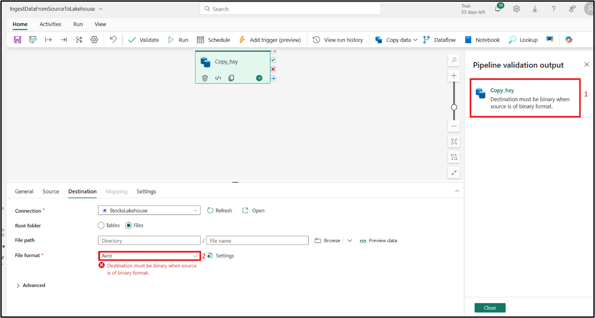
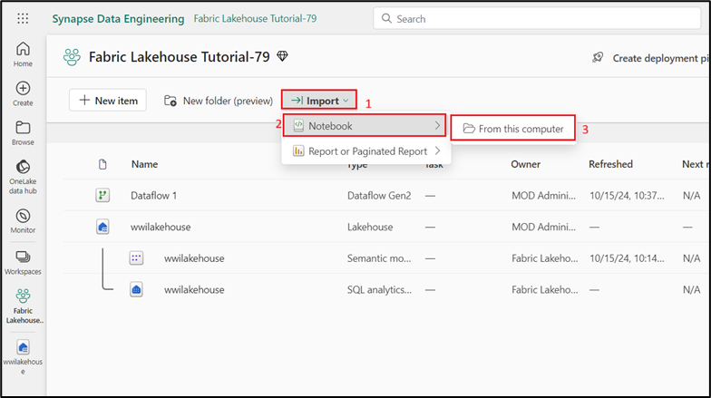
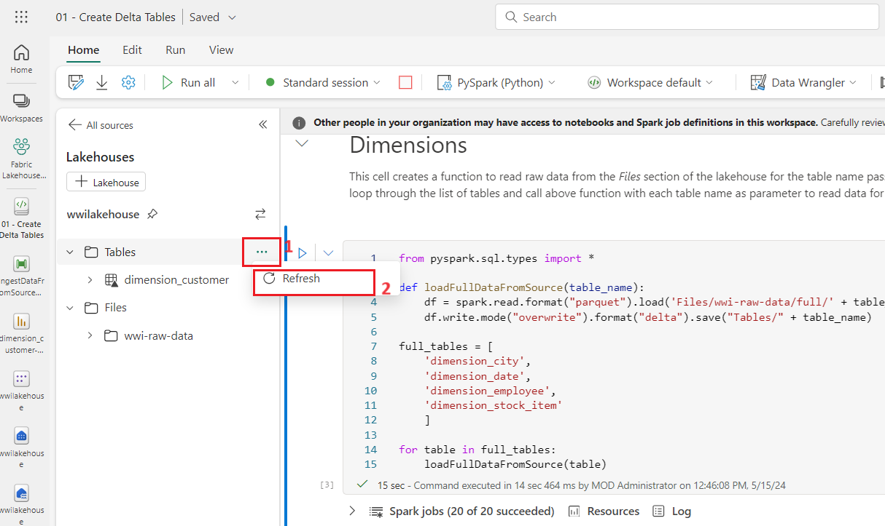
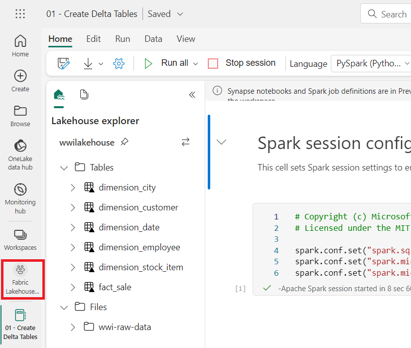
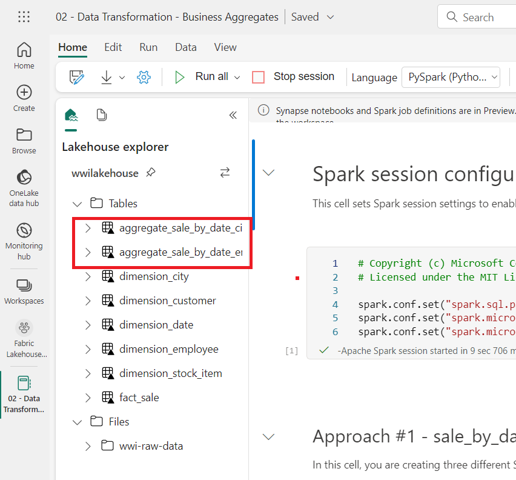
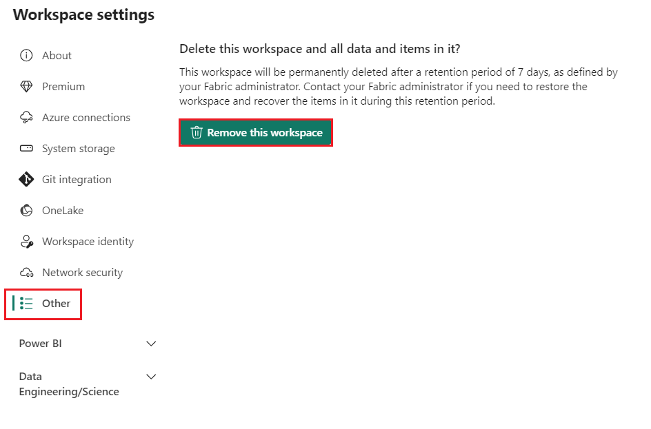

# 使用案例 1：创建 Lakehouse、提取示例数据并构建报告

**介绍**

此实验室将引导您完成从数据采集到数据使用的端到端方案。它可以帮助您对
Fabric
有基本的了解，包括不同的体验和它们的集成方式，以及在此平台上工作时获得的专业和平民开发人员体验。本实验不是参考体系结构、特性和功能的详尽列表，也不是特定最佳实践的建议。

传统上，组织一直在构建现代数据仓库来满足其事务性和结构化数据分析需求。以及满足大数据（半/非结构化）数据分析需求的数据湖仓一体。这两个系统并行运行，造成孤岛、数据重复性并增加总拥有成本。

Fabric 将数据存储统一并标准化为 Delta Lake
格式，使您能够消除孤岛、消除数据重复性并大幅降低总拥有成本。

借助 Fabric
提供的灵活性，您可以实施湖仓一体或数据仓库架构，也可以将它们组合在一起，通过简单的实施实现两者的最佳效果。在本教程中，您将以一个零售组织为例，从头到尾构建其湖仓一体。它使用
[medallion
architecture](https://learn.microsoft.com/en-us/azure/databricks/lakehouse/medallion) ，其中青铜层具有原始数据，银色层具有经过验证和重复数据删除的数据，而黄金层具有高度精细的数据。您可以采用相同的方法为任何行业的任何组织实施湖仓一体。

本实验介绍了来自零售域的虚构 Wide World Importers
公司的开发人员如何完成以下步骤。

**目标**:

1\. 登录到 Power BI 帐户并启动免费的 Microsoft Fabric 试用。

2\. 在 Power BI 中开始 Microsoft Fabric （预览版） 试用版。

3\. 为 Microsoft 365 管理中心配置 OneDrive 注册。

4\. 为组织构建和实施端到端的湖仓一体，包括创建 Fabric 工作区和湖仓一体。

5\. 将示例数据摄取到 Lakehouse 中，并准备进一步处理。

6\. 使用 Python/PySpark 和 SQL 笔记本转换和准备数据。

7\. 使用不同的方法创建业务聚合表。

8\. 在表之间建立关系以实现无缝报告。

9\. 根据准备好的数据构建具有可视化效果的 Power BI 报表。

10\. 保存并存储创建的报表以供将来参考和分析。

# 练习 1：设置 Lakehouse 端到端场景 

## 任务 1：登录到 Power BI 帐户并注册免费的 [**Microsoft Fabric trial**](https://learn.microsoft.com/en-us/fabric/get-started/fabric-trial)

## 

1.  打开浏览器，导航到地址栏，然后键入或粘贴以下
    URL：:+++<https://app.fabric.microsoft.com/+++> 然后按 **Enter**
    按钮。

> 

2.  在 **Microsoft Fabric** 窗口中，输入您的 **Microsoft 365**
    凭据，然后单击 **Submit** 按钮。

> 

3.  然后，在 **Microsoft** 窗口中输入密码并单击 **Sign in** 按钮**。**

> 

4.  在 **Stay signed in?** 窗口中，单击 **Yes** 按钮。

> 

5.  您将被定向到 Power BI 主页。

## 任务 2：开始 Microsoft Fabric trial

请按照以下步骤开始您的 Fabric trial 。

1.  在 **Fabric** 主页上，单击右侧的 **Account manager** 。在 Account
    manager 边栏选项卡中，导航并选择 **Start trial**，如下图所示**。**

2.  如果出现提示，请同意条款，然后选择 **Activate**。

> 

3.  试用容量准备就绪后，您会收到一条确认消息。选择 **Got it** 以开始使用
    Fabric 。

4.  再次打开您的客户经理。请注意，您现在有一个 **Trial status**
    的标题。您的客户经理会跟踪您的试用期剩余天数。当您在产品体验中工作时，您还将在
    Fabric 菜单栏中看到倒计时。

> 

# 练习 2： 为您的组织构建和实施端到端 lakehouse

## **任务 1：创建 Fabric workspace**

在此任务中，您将创建一个 Fabric 工作区。工作区包含此 Lakehouse
教程所需的所有项，其中包括
Lakehouse、数据流、数据工厂管道、笔记本、Power BI 数据集和报表。

1.  Fabric 主页，选择 **+New workspace** tile。

2.  在右侧显示的 **Create a workspace**
    窗格中，输入以下详细信息，然后单击 **Apply** 按钮。

[TABLE]

3.  注意：要查找您的实验室即时 ID，请选择 'Help' 并复制即时 ID。

> 
>
> 
>
> 
>
> 

4.  等待部署完成。完成需要 2-3 分钟。

## **任务 2：创建 Lakehouse**

1.  通过单击导航栏中的 **+New item** 按钮创建新的湖仓一体 。

2\. 点击“**Lakehouse**” tile。

3.  在 **New lakehouse**  对话框中，**Name** 字段中输入
    **wwilakehouse**，单击 **Create** 按钮并打开新的 lakehouse。

**注意**：确保在 **wwilakehouse** 之前删除空格。

4.  您将看到一条通知，指出 **Successfully created SQL endpoint** 。

## **任务 3：引入示例数据**

1.  在 **wwilakehouse** 页面中，导航到 **Get data in your lakehouse**
    部分，然后单击 **Upload files as shown in the below
    image**，如下图所示。

> 

2.  在 Upload files 选项卡上，单击 Files下的 folder

> 

3.  浏览到 VM 上的
    **C：\LabFiles**，然后选择***dimension_customer.csv***文件并单击
    **Open** 按钮 。

> 

4.  然后，单击 **Upload** 按钮并关闭。

> 

5.  单击并选择 **Files** 上的 refresh 。此时会显示 Files 。

> 
>
> 

6.  在 **Lakehouse** 页面中，在 Explorer 窗格下，选择
    Files。现在，您的鼠标**dimension_customer.csv**
    文件。单击**dimension_customer**.csv旁边的水平省略号
    （...）。导航并单击 **Load Table**，然后选择 **New table** 。

> 

7.  在 **Load file to new table** 对话框中，单击 **Load** 按钮。

> 

8.  然后，在左侧的 **Lakehouse explorer** 窗格中，在 **Table** 节点的
    ... 菜单中，选择 **Refresh** 。 

9.  您还可以使用湖仓一体的 SQL 终端节点通过 SQL
    语句查询数据。从屏幕右上角的 **Lakehouse** 下拉菜单中选择 **SQL
    analytics endpoint** 。

10. 在 wwilakehouse 页面的 Explorer 下，选择 **dimension_customer**
    表以预览其数据，然后选择 **New SQL query** 以编写 SQL 语句。

> 

11. 以下示例查询根据 **dimension_customer** 表的 **BuyingGroup**
    列聚合行计数。SQL
    查询文件会自动保存以供将来参考，您可以根据需要重命名或删除这些文件。粘贴代码，如下图所示，然后单击播放图标以
    **Run** 脚本。

> SELECT BuyingGroup, Count(\*) AS Total
>
> FROM dimension_customer
>
> GROUP BY BuyingGroup
>
> 
>
> **注意**：如果您在执行脚本期间遇到错误，请使用上图交叉检查脚本语法。
>
> 

12. 以前，所有 Lakehouse
    表和视图都自动添加到语义模型中。在最近的更新中，对于新的
    Lakehouse，您必须手动将表添加到语义模型中。

13. 从 Lakehouse 的 **Reporting** 选项卡中，选择 **Manage default Power
    BI semantic model，**然后选择要添加到语义模型的表。

14. 在 **Manage default semantic model** 选项卡中，选择
    **dimension_customer** 表，然后单击 **Confirm** 。

## **任务 4：生成报表**

1.  现在，单击 左侧导航窗格中的 **Fabric Lakehouse Tutorial-XX**。

2.  在 **Fabric Lakehouse Tutorial-XX** 视图中，选择 Type **Semantic
    model（default）** 的 **wwilakehouse**。此数据集是自动创建的，并且与
    Lakehouse 同名。

> 

3.  在语义模型窗格中，您可以查看所有表。您可以选择从头开始创建报表、分页报表，或者让
    Power BI 根据您的数据自动创建报表。在本教程中，在 **Explore this
    data** 下，选择 **Auto-create a report**，如下图所示。

4.  由于表是一个维度，并且其中没有度量，因此 Power BI
    会为行计数创建一个度量，并在不同的列中聚合该度量，并创建不同的图表，如下图所示。

5.  通过从顶部功能区中选择 **Save** 来保存此报表以供将来 使用。

> 

6.  在 **Save your replort** 对话框中，将报告的名称输入为 ！！
    +++dimension_customer-report+++，然后选择 **Save。**

7.  您将看到一条通知，指出 **Report saved**。

> 

# 练习 3：将数据引入 Lakehouse

在本练习中，您将从 Wide World Importers （WWI）
中提取其他维度表和事实表到湖仓一体中。

## **任务 1：摄取数据**

1.  在左侧导航窗格中选择 **Workspaces**，然后从 **Workspaces**
    菜单中选择您的新工作区（即 Fabric Lakehouse
    Tutorial-XX）。此时将显示工作区的项视图。

> 
>
> 

2.  在 **Fabric Lakehouse Tutorial-XX** 工作区页面中，导航并单击 **+New
    item** 按钮，然后选择 **Data pipeline**。

> 

3.  在 New pipeline 对话框中，将名称指定为
    **+++IngestDataFromSourceToLakehouse+++ ** ，然后选择 **Create。**
    创建并打开新的数据工厂管道

> 
>
> 

4.  在新创建的数据工厂管道 即
    **IngestDataFromSourceToLakehouse**上，选择 **Copy data
    assistant**。

> 

5.  接下来，设置 **HTTP** 连接以将示例 Worldwide Importers 数据导入
    Lakehouse。从 **New sources** 列表中，选择 **View more**，搜索
    **Http** 并选择它。

> 

6.  在 **Connect to data source** 窗口中，输入下表中的详细信息，然后选择
    **Next。**

[TABLE]

7.  

8.  在下一步中，启用 **Binary copy** 并选择 **ZipDeflate （.zip）** 作为
    **Compression type**，因为源是 .zip
    文件。将其他字段保留为默认值，然后单击 **Next**。

> 

9.  在 **Connect to data destination** 窗口中，选择 **OneLake Data
    hub**，然后选择 **wwilakehouse。** 现在将 **Root folder **指定为
    **Files**，然后单击 **Next**。这会将数据写入 Lakehouse 的 **Files**
    部分。

> 
>
> 

10. 为目标选择 **File format** shoul be empty。单击 **Next**，然后单击
    **Save+Run**
    。您可以计划管道定期刷新数据。在本教程中，我们只运行管道一次。数据复制过程大约需要
    15-19 分钟才能完成。。

> 
>
> 

11. 现在，你可以看到验证将失败。单击 **pipeline validation output**

> 

12. 在 **destination** 选项卡中，下拉 文件格式 并选择 **Binary**。

> 

13. 现在点击 **Run** 按钮

> 
>
> 
>
> 

14. 在 Output 选项卡下，选择 **Copy_a1n** 以查看数据传输的详细信息。看到
    **Status** 为 **Succeeded** 后，单击 **Close** 按钮。

> 
>
> 

15. 成功执行管道后，转到您的 lakehouse（**wwilakehouse**）
    并打开资源管理器以查看导入的数据。

> 

16. 验证文件夹 **WideWorldImportersDW** 是否存在于 **Explorer**
    视图中，并包含所有表的数据。

> 

17. 数据在 Lakehouse Explorer 的 **Files** 部分下创建。具有 GUID
    的新文件夹包含所有需要的数据。将 GUID 重命名为 +++wwi-raw-data+++

> 
>
> 

# 练习 4：在 Lakehouse 中准备和转换数据

## **任务 1：准备数据**

在前面的练习步骤中，我们已将原始数据从源提取到 Lakehouse 的 **Files**
部分。现在，您可以转换该数据并准备创建增量表。

1.  现在，单击 左侧导航窗格中的 **Fabric Lakehouse Tutorial-XX。**

> 

2.  

> ii\. 在 **Home** 中，导航到 **Import** 部分，单击
> **Notebook**，然后单击 **From this computer**
>
> 

3.  从导航到 **Import** 部分选择 **Upload**，单击 **Notebook**，然后单击
    **From this computer**。

> **注意：**确保从 **File Name** 字段旁边的下拉列表中选择 **All files
> （\*.\*）。**
>
> 

4.  从 **C：\LabFiles** 导航并选择 **01-Create Delta Tables、02-Data
    Transformation-Business Aggregation** 笔记本 ，然后单击 **Open**
    按钮。

> 

5.  您将看到一条通知，指出 **Imported successfully。**

> 

6.  导入成功后，要查看新导入的笔记本，请在 **Recommended** 部分下选择
    **Fabric Lakehouse Tutorial-XX** 。

> 
>
> 

7.  在 **Fabric Lakehouse Tutorial-XX** 窗格中，选择 **wwilakehouse**
    lakehouse 将其打开。

## **任务 2：转换数据并加载到 silver Delta 表**

1.  在 **wwilakehouse** 页面中，导航并单击命令栏中的 **Open notebook**
    drop，然后选择 **Existing notebook**。

> 

2.  从 **Open existing notebook** 列表中，选择 **01 - Create Delta
    Tables** 笔记本，然后选择 **Open** 。

3.  在 **Lakehouse explorer**
    中打开的笔记本中，您会看到笔记本已链接到您打开的 Lakehouse。

\*\* 注意\*\*

Fabric 提供
[**V-order**](https://learn.microsoft.com/en-us/fabric/data-engineering/delta-optimization-and-v-order) 功能来写入优化的
delta lake 文件。与未优化的 Delta Lake 文件相比，V-order
通常可将压缩率提高 3 到 4 倍，并将性能提高多达 10 倍。Fabric 中的 Spark
动态优化分区，同时生成默认大小为 128 MB
的文件。可以使用配置根据工作负载要求更改目标文件大小。借助 [**optimize
write**](https://learn.microsoft.com/en-us/fabric/data-engineering/delta-optimization-and-v-order#what-is-optimized-write) 
功能，Apache Spark
引擎可减少写入的文件数，并旨在增加写入数据的单个文件大小。

4.  在湖仓一体的 **Tables** 部分中将数据作为 delta lake 表写入之前
    ，您需要使用两个 Fabric 功能（**V-order （V-order** 和 **Optimize
    Write**））来优化数据写入并提高读取性能。要在会话中启用这些功能，请在笔记本的第一个单元格中设置这些配置。

5.  要启动笔记本并执行单元格，请选择 悬停时显示在单元格左侧的 **Run**
    图标。

运行单元时，您不必指定底层 Spark 池或集群详细信息，因为 Fabric
通过实时池提供它们。每个 Fabric 工作区都附带一个默认的 Spark 池，称为
Live Pool。这意味着，在创建笔记本时，您不必担心指定任何 Spark
配置或集群详细信息。当您执行第一个 notebook
命令时，实时池将在几秒钟内启动并运行。Spark
会话已建立，并开始执行代码。当 Spark
会话处于活动状态时，此笔记本中的后续代码执行几乎是即时的。

6.  接下来，您从 Lakehouse 的 **Files**
    部分读取原始数据，并在转换过程中为不同的日期部分添加更多列。使用
    partitionBy Spark API
    对数据进行分区，然后根据新创建的数据部分列（Year 和
    Quarter）将数据写入 delta 表。

7.  要执行第二个单元格，请选择 悬停时显示在单元格左侧的 **Run** 图标。

> **注意**：如果您看不到输出，请单击 **Spark jobs** 左侧的水平线。
>
> \`\`\`
>
> from pyspark.sql.functions import col, year, month, quarter
>
> df =
> spark.read.format("parquet").load('Files/wwi-raw-data/full/fact_sale_1y_full')
>
> df = df.withColumn('Year', year(col("InvoiceDateKey")))
>
> df = df.withColumn('Quarter', quarter(col("InvoiceDateKey")))
>
> df = df.withColumn('Month', month(col("InvoiceDateKey")))
>
> df.write.mode("overwrite").format("delta").partitionBy("Year","Quarter").save("Tables/" +
> table_name)
>
> \`\`\`

8.  加载事实数据表后，您可以继续加载其余维度的数据。以下单元格创建一个函数，用于从
    Lakehouse 的 **Files**
    部分读取作为参数传递的每个表名的原始数据。接下来，它会创建一个维度表列表。最后，它遍历表列表，并为从
    input 参数读取的每个表名创建一个 delta 表。

9.  选择单元格，然后选择 悬停时显示在单元格左侧的 **Run** 图标。

10. \`\`\`

11. from pyspark.sql.types import \*

12. def loadFullDataFromSource(table_name):

13. df = spark.read.format("parquet").load('Files/wwi-raw-data/full/' +
    table_name)

14. df.write.mode("overwrite").format("delta").save("Tables/" +
    table_name)

15. 

16. full_tables = \[

17. 'dimension_city',

18. 'dimension_date',

19. 'dimension_employee',

20. 'dimension_stock_item'

21. \]

22. 

23. for table in full_tables:

24. loadFullDataFromSource(table)

25. \`\`\`

26. 要验证创建的表，请单击 **Tables** 上的 Refresh 。此时将显示表。

> 
>
> 

27. 再次进入工作区的项目视图，选择 **Fabric Lakehouse Tutorial-XX**
    并选择 **wwilakehouse** Lakehouse 以将其打开。

> 
>
> 

28. 现在，打开第二个笔记本。在 Lakehouse 视图中，下拉列表 **Open
    notebook ，**然后从顶部导航菜单中选择 **Existing notebook** 。

> 

29. 从 Open existing notebook 列表中，选择 **02 - Data Transformation -
    Business Aggregation** 笔记本，然后单击 **Open**.

> 

30. 在 **Lakehouse explorer**
    中打开的笔记本中，您会看到笔记本已链接到您打开的 Lakehouse。

31. 启动笔记本并选择 1^（st） 单元格，然后选择悬停时显示在单元格左侧的
    **Run** 图标 。

32. 一个组织可能有使用 Scala/Python 的数据工程师和使用 SQL（Spark SQL 或
    T-SQL）的其他数据工程师，他们都在处理相同的数据副本。Fabric
    使这些具有不同经验和偏好的不同群体能够工作和协作。这两种不同的方法转换和生成业务聚合。您可以选择适合您的一种，也可以根据自己的喜好混合和匹配这些方法，而不会影响性能:

- **Approach \#1** - 使用 PySpark
  联接和聚合数据以生成业务聚合。这种方法比具有编程 （Python 或 PySpark）
  背景的人更可取。

- **Approach \#2** - 使用 Spark SQL
  联接和聚合数据以生成业务聚合。这种方法比具有 SQL 背景、过渡到 Spark
  的人更可取。

33. **Approach \#1 (sale_by_date_city)** - 使用 PySpark
    联接和聚合数据以生成业务聚合。使用以下代码，您可以创建三个不同的
    Spark 数据帧，每个数据帧都引用一个现有的 delta 表。然后，您使用
    DataFrames 联接这些表，执行 group by
    以生成聚合，重命名一些列，最后将其作为增量表写入 Lakehouse 的
    **Tables** 部分以保留数据。

> 在此单元格中，您将创建三个不同的 Spark
> 数据帧，每个数据帧都引用一个现有的 delta 表。
>
> df_fact_sale = spark.read.table("wwilakehouse.fact_sale")
>
> df_dimension_date = spark.read.table("wwilakehouse.dimension_date")
>
> df_dimension_city = spark.read.table("wwilakehouse.dimension_city")
>
> 

34. 在此单元格中，使用之前创建的数据帧联接这些表，执行 group by
    以生成聚合，重命名一些列，最后将其作为增量表写入 Lakehouse 的
    **Tables** 部分。

35. \`\`\`

36. sale_by_date_city = df_fact_sale.alias("sale") \\

37. .join(df_dimension_date.alias("date"), df_fact_sale.InvoiceDateKey
    == df_dimension_date.Date, "inner") \\

38. .join(df_dimension_city.alias("city"), df_fact_sale.CityKey ==
    df_dimension_city.CityKey, "inner") \\

39. .select("date.Date", "date.CalendarMonthLabel", "date.Day",
    "date.ShortMonth", "date.CalendarYear", "city.City",
    "city.StateProvince",

40. "city.SalesTerritory", "sale.TotalExcludingTax", "sale.TaxAmount",
    "sale.TotalIncludingTax", "sale.Profit")\\

41. .groupBy("date.Date", "date.CalendarMonthLabel", "date.Day",
    "date.ShortMonth", "date.CalendarYear", "city.City",
    "city.StateProvince",

42. "city.SalesTerritory")\\

43. .sum("sale.TotalExcludingTax", "sale.TaxAmount",
    "sale.TotalIncludingTax", "sale.Profit")\\

44. .withColumnRenamed("sum(TotalExcludingTax)",
    "SumOfTotalExcludingTax")\\

45. .withColumnRenamed("sum(TaxAmount)", "SumOfTaxAmount")\\

46. .withColumnRenamed("sum(TotalIncludingTax)",
    "SumOfTotalIncludingTax")\\

47. .withColumnRenamed("sum(Profit)", "SumOfProfit")\\

48. .orderBy("date.Date", "city.StateProvince", "city.City")

49. 

50. sale_by_date_city.write.mode("overwrite").format("delta").option("overwriteSchema",
    "true").save("Tables/aggregate_sale_by_date_city")

51. \`\`\`

> 

52. **Approach \#2 (sale_by_date_employee)** - 使用 Spark SQL
    联接和聚合数据以生成业务聚合。使用以下代码，您可以通过联接三个表来创建一个临时
    Spark 视图，执行 group by
    以生成聚合，并重命名其中的一些列。最后，您从临时 Spark
    视图中读取数据，最后将其作为增量表写入 湖仓一体的 **Tables**
    部分，以保留数据。

> 在此单元格中，您可以通过联接三个表来创建一个临时 Spark 视图，执行
> group by 以生成聚合，并重命名其中的一些列。
>
> \`\`\`
>
> %%sql
>
> CREATE OR REPLACE TEMPORARY VIEW sale_by_date_employee
>
> AS
>
> SELECT
>
> DD.Date, DD.CalendarMonthLabel
>
> , DD.Day, DD.ShortMonth Month, CalendarYear Year
>
> ,DE.PreferredName, DE.Employee
>
> ,SUM(FS.TotalExcludingTax) SumOfTotalExcludingTax
>
> ,SUM(FS.TaxAmount) SumOfTaxAmount
>
> ,SUM(FS.TotalIncludingTax) SumOfTotalIncludingTax
>
> ,SUM(Profit) SumOfProfit
>
> FROM wwilakehouse.fact_sale FS
>
> INNER JOIN wwilakehouse.dimension_date DD ON FS.InvoiceDateKey =
> DD.Date
>
> INNER JOIN wwilakehouse.dimension_Employee DE ON FS.SalespersonKey =
> DE.EmployeeKey
>
> GROUP BY DD.Date, DD.CalendarMonthLabel, DD.Day, DD.ShortMonth,
> DD.CalendarYear, DE.PreferredName, DE.Employee
>
> ORDER BY DD.Date ASC, DE.PreferredName ASC, DE.Employee ASC
>
> \`\`\`

53. 在此单元格中，您从上一个单元格中创建的临时 Spark
    视图读取数据，最后将其作为增量表写入 湖仓一体的 **Tables** 部分中。

54. sale_by_date_employee = spark.sql("SELECT \* FROM
    sale_by_date_employee")

55. sale_by_date_employee.write.mode("overwrite").format("delta").option("overwriteSchema",
    "true").save("Tables/aggregate_sale_by_date_employee")

56. 要验证创建的表，请单击 **Tables** 上的 Refresh 。此时将显示聚合表。

这两种方法都会产生类似的结果。您可以根据自己的背景和偏好进行选择，以最大限度地减少学习新技术或牺牲性能的需要。

此外，你可能会注意到你正在将数据写入 delta lake 文件。Fabric
的自动表发现和注册功能会拾取它们并在元存储中注册它们。您无需显式调用
CREATE TABLE 语句来创建用于 SQL 的表。

# 练习 5：在 Microsoft Fabric 中构建报表

在本教程的这一部分中，您将创建 Power BI 数据模型并从头开始创建报表。

** **

## **任务 1：使用 SQL 终端节点浏览白银层中的数据**

Power BI 本机集成在整个 Fabric 体验中。这种本机集成带来了一种称为
DirectLake 的独特模式，用于从 Lakehouse
访问数据，以提供最高性能的查询和报告体验。DirectLake
模式是一项开创性的新引擎功能，用于分析 Power BI
中的超大型数据集。该技术基于直接从数据湖加载 Parquet
格式文件的理念，无需查询数据仓库或湖仓一体终端节点，也无需将数据导入或复制到
Power BI 数据集中。DirectLake 是将数据从数据湖直接加载到 Power BI
引擎中以备分析的快速路径。

在传统的 DirectQuery 模式下，Power BI
引擎直接从源查询数据来执行每个查询，查询性能取决于数据检索速度。DirectQuery
无需复制数据，确保在导入期间源中的任何更改都会立即反映在查询结果中。另一方面，
在 Import 模式下
，性能会更好，因为数据在内存中随时可用，而无需为每次查询执行从源查询数据。但是，Power
BI
引擎必须先在数据刷新期间将数据复制到内存中。在下次数据刷新期间（计划刷新和按需刷新），仅选取对基础数据源的更改。

DirectLake
模式现在通过将数据文件直接加载到内存中来消除此导入要求。由于没有显式导入过程，因此可以在发生任何更改时在源中选取这些更改，从而将
DirectQuery 和导入模式的优点相结合，同时避免其缺点。因此，DirectLake
模式是分析超大型数据集和在源处频繁更新的数据集的理想选择。

1.  从左侧导航窗格中，选择 **Fabric_LakehouseXX** 然后选择 **Type SQL
    analytics endpoint** 类型的 **wwilakehouse。**

> 
>
> 

2.  在 SQL endpoint
    窗格中，您应该能够看到您创建的所有表。如果您尚未看到它们，请选择顶部的
    **Refresh** 图标。接下来，选择底部的 **Model layouts**
    选项卡以打开默认的 Power BI 数据集。

> 

3.  对于此数据模型，您需要定义不同表之间的关系，以便可以根据不同表中的数据创建报表和可视化。点击
    **Auto layout** 

>  

4.  从 **fact_sale** 表中，将 **CityKey** 字段拖放到 **dimension_city**
    表中的 **CityKey** 字段 上以创建关系。此时将显示 **Create
    Relationship** 对话框。

> 注意：通过单击表格、拖放以使 dimension_city 和 fact_sale
> 表格彼此相邻来重新排列表格。这同样适用于您尝试创建关系的任意两个表。这只是为了使表格之间的列拖放更容易。

5.  在 **Create Relationship** 对话框中:

    - **Table 1** 中填充了 **fact_sale** 和 **CityKey** 列。

    - **Table 2** 中填充了 **dimension_city** 和 **CityKey** 列。

    - Cardinality: **Many to one (\*:1)**

    - Cross filter direction: **Single**

    - 选中 **Make this relationship active** 旁边的框。

    - 选中 **Assume referential integrity** 旁边的框。

    - 选择 **Save.** 

6.  接下来，使用与上面所示相同的 **Create Relationship**
    设置添加这些关系，但使用以下表格和列:

- **StockItemKey(fact_sale)** - **StockItemKey(diension_stock_item)**

- **Salespersonkey(fact_sale)** - **EmployeeKey(dimension_employee)**

7.  确保使用与上述相同的步骤在以下两个集合之间创建关系。

- **CustomerKey(fact_sale)** - **CustomerKey(dimension_customer)**

- **InvoiceDateKey(fact_sale)** - **Date(dimension_date)**

8.  添加这些关系后，您的数据模型应如下图所示，并已准备好进行报告。

## **任务 2：生成报告**

1.  从顶部功能区中选择 **Reporting ，**然后选择 **New report** 以开始在
    Power BI 中创建报表/仪表板。

> 

2\. 在 Power BI 报表画布上，您可以通过将所需列从 **Data**
窗格拖动到画布并使用一个或多个可用的可视化效果来创建报表以满足您的业务要求。

> 

**添加标题:**

> 3.在 Ribbon （功能区） 中，选择 **Text box** 。输入 **WW Importers
> Profit Reporting**。 **Highlight text** 并将大小增加到 **20**。

> 4.调整文本框的大小并将其放在 报表页的 **upper
> left**，然后在文本框外部单击。

**添加卡：**

- 在 **Data** 窗格中，展开 **fact_sales** 并选中 **Profit**
  旁边的框。此选择将创建一个柱形图并将字段添加到 Y 轴。

> 

5.  选择条形图后，在 可视化效果窗格中选择 **Card** 视觉对象。

> 

6.  此选择会将视觉对象转换为卡片。将卡片放在标题下方。

> 

7.  单击空白画布上的任意位置（或按 Esc 键），以便不再选择我们刚刚放置的
    Card。

**添加条形图：**

8.  在 **Data** 窗格中，展开 **fact_sales** 并选中 **Profit**
    旁边的框。此选择将创建一个柱形图并将字段添加到 Y 轴。

> 

9.  在 **Data** 窗格中，展开 **dimension_city** 并选中
    **SalesTerritory** 的框。此选择会将字段添加到 Y 轴。

> 

10. 选择条形图后，在可视化效果窗格中选择 **Clustered bar chart**
    视觉对象。此选择将柱形图转换为条形图。

> 

11. 调整条形图的大小以填充标题和卡片下方的区域。

> 

12. 单击空白画布上的任意位置（或按 Esc 键），以便不再选择条形图。

> **构建堆叠面积图视觉对象：**

13. 在 **Visualizations** 窗格中，选择 **Stacked Area chart** 视觉对象。

> 

14. 将堆积面积图重新定位到前面步骤中创建的卡片和条形图视觉对象的右侧并调整其大小。

> 

15. 在 **Data** 窗格中，展开 **fact_sales** 并选中 **Profit**
    旁边的框。展开 **dimension_date** 并选中 **FiscalMonthNumber**
    旁边的复选框。此选择将创建一个填充折线图，按会计月份显示利润。

> 

16. 在 **Data** 窗格上，展开 **dimension_stock_item** 并将
    **BuyingPackage** 拖到“图例”字段井中。此选择将为每个 Purchasing
    Packages 添加一行。

> 
>
> 

17. 单击空白画布上的任意位置（或按 Esc 键），以便不再选择堆积面积图。

**构建柱形图：**

18. 在 **Visualizations** 窗格中，选择 **Stacked column chart**
    视觉对象。

> 

19. 在 **Data** 窗格中，展开 **fact_sales** 并选中 **Profit**
    旁边的框。此选择会将字段添加到 Y 轴。

20. 在 **Data** 窗格中，展开 **dimension_employee** 并选中 **Employee**
    旁边的框。此选择会将字段添加到 X 轴。

> 

21. 单击空白画布上的任意位置（或按 Esc 键），以便不再选择图表。

22. 从功能区中，选择 **File** \> **Save**。

> 

23. 将报表名称输入为 **Profit Reporting**。选择 **Save**。

> 

24. 您将收到一条通知，指出报告已保存。

> 

# 练习 6：清理资源

您可以删除单个报表、管道、仓库和其他项目，也可以删除整个工作区。使用以下步骤删除您为本教程创建的工作区。

1.  从左侧导航菜单中选择您的工作区 **Fabric Lakehouse
    Tutorial-XX**。此时将打开工作区项视图。

2.  选择 ***...*** 选项，然后选择 **Workspace settings**。

3.  选择 **Other** 和 **Remove this workspace。**

4.  点击 **Delete** 在弹出的警告中。

5.  等待工作区已删除的通知，然后再继续进行下一个实验。

**摘要**：此实践实验室重点介绍如何在 Microsoft Fabric 和 Power BI
中设置和配置用于数据管理和报告的基本组件。它包括激活试用版、配置
OneDrive、创建工作区和设置湖仓一体等任务。该实验室还涵盖与引入示例数据、优化增量表以及在
Power BI 中构建报表以进行有效数据分析相关的任务。这些目标旨在提供利用
Microsoft Fabric 和 Power BI 进行数据管理和报告目的的实践经验。

## 
