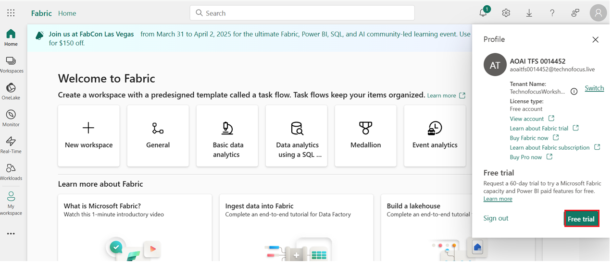
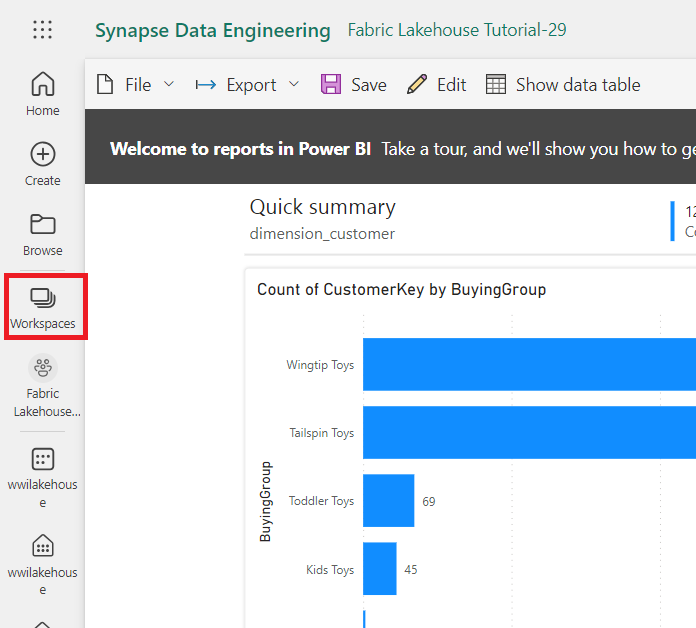
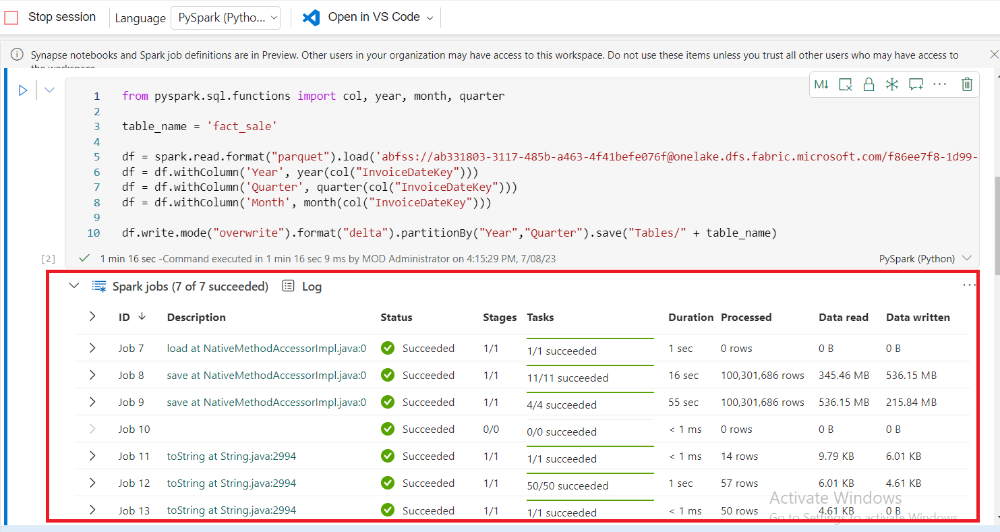

# Cas d'utilisation 1 : Création d'un Lakehouse, ingestion d'exemples de données et création d'un rapport

**Introduction**

Cet atelier vous guide à travers un scénario de bout en bout, de
l'acquisition à la consommation des données. Il vous aide à acquérir une
compréhension de base de Fabric, y compris les différentes expériences
et la façon dont elles s'intègrent, ainsi que les expériences de
développement professionnelles et citoyennes qui accompagnent le travail
sur cette plateforme. Cet atelier n'est pas destiné à être une
architecture de référence, une liste exhaustive de caractéristiques et
de fonctionnalités, ou une recommandation de meilleures pratiques
spécifiques.

Traditionnellement, les organisations construisent des entrepôts de
données modernes pour répondre à leurs besoins en matière d'analyse de
données transactionnelles et structurées. Et des data lakehouses pour
les besoins d'analyse de données Big Data (semi/non structurés). Ces
deux systèmes fonctionnaient en parallèle, créant des silos, une
duplicité des données et une augmentation du coût total de possession.

Fabric, avec son unification du stockage de données et sa
standardisation au format Delta Lake, vous permet d'éliminer les silos,
de supprimer la duplicité des données et de réduire considérablement le
coût total de possession.

Grâce à la flexibilité offerte par Fabric, vous pouvez mettre en œuvre
des architectures de maison de données ou d'entrepôt de données ou les
combiner pour tirer le meilleur parti des deux avec une mise en œuvre
simple. Dans ce tutoriel, vous allez prendre l'exemple d'une
organisation de vente au détail et construire sa maison au bord du lac
du début à la fin. Il utilise l'[architecture du
médaillon](https://learn.microsoft.com/en-us/azure/databricks/lakehouse/medallion)
où la couche de bronze contient les données brutes, la couche d'argent
les données validées et dédupliquées, et la couche d'or a des données
hautement raffinées. Vous pouvez adopter la même approche pour mettre en
œuvre une maison de lac pour n'importe quelle organisation de n'importe
quel secteur.

Cet atelier explique comment un développeur de la société fictive Wide
World Importers du domaine de la vente au détail effectue les étapes
suivantes.

**Objectives** :

1\. Connectez-vous au compte Power BI et lancez un essai gratuit de
Microsoft Fabric.

2\. Démarrez la version d'essai de Microsoft Fabric (préversion) dans
Power BI.

3\. Configurez l'inscription à OneDrive pour le centre d'administration
Microsoft 365.

4\. Construisez et mettez en œuvre une maison de lac de bout en bout
pour l'organisation, y compris la création d'un Fabric workspace et
d'une maison de lac.

5\. Ingérez les données de l'échantillon dans le pavillon du lac et
préparez-les pour un traitement ultérieur.

6\. Transformez et préparez les données à l'aide de Python/PySpark et de
notebooks SQL.

7\. Créez des tables d'agrégation d'entreprise en utilisant différentes
approches.

8\. Établissez des relations entre les tables pour des rapports sans
faille.

9\. Créez un rapport Power BI avec des visualisations basées sur les
données préparées.

10\. Enregistrez et stockez le rapport créé pour référence et analyse
ultérieures.

## Exercice 1 : Configuration d'un scénario de bout en bout de Lakehouse

### Tâche 1 : Se connecter au compte Power BI et s'inscrire à la [**version d'essai gratuite de Microsoft Fabric**](https://learn.microsoft.com/en-us/fabric/get-started/fabric-trial)

1.  Ouvrez votre navigateur, accédez à la barre d'adresse et tapez ou
    collez l'URL suivante :+++<https://app.fabric.microsoft.com/+++>,
    puis appuyez sur le bouton **Enter**.

2.  Dans la fenêtre **Microsoft Fabric**, entrez vos informations
    d'identification **Microsoft 365**, puis cliquez sur le bouton
    **Submit**.

3.  Ensuite, dans la fenêtre **Microsoft**, entrez le mot de passe et
    cliquez sur le bouton **Sign in**.

4.  Dans **Stay signed in ?** cliquez sur le bouton **Yes**.

5.  Vous serez redirigé vers la page d'accueil de Power BI.

**Tâche 2 : Démarrer la version d'essai de Microsoft Fabric (Microsoft
Fabric trial)**

Suivez ces étapes pour commencer votre essai de Fabric.

1.  Sur la page **Fabric**, cliquez sur le **Account manager** sur le
    côté droit. Dans le panneau Gestionnaire de compte, naviguez et
    sélectionnez **Start trial**, comme illustré dans l'image
    ci-dessous.

2.  Si vous y êtes invité, acceptez les conditions, puis sélectionnez
    **Activate**.

3.  Une fois que votre capacité d'essai est prête, vous recevez un
    message de confirmation. Sélectionnez **OK** pour commencer à
    travailler dans Fabric.

> 

4.  Ouvrez à nouveau votre gestionnaire de compte. Notez que vous avez
    maintenant un en-tête **Trial status**. Votre gestionnaire de compte
    garde une trace du nombre de jours restants dans votre essai. Vous
    verrez également le compte à rebours dans la barre de menu de votre
    tissu lorsque vous travaillez sur une expérience produit.

> 

**Exercice 2 : Construire et mettre en œuvre un Lakehouse pour votre
organisation**

**Tâche 1 : Créer un Fabric workspace**

Dans cette tâche, vous allez créer un Fabric workspace. Le workspace
contient tous les éléments nécessaires à ce didacticiel lakehouse,
notamment lakehouse, les flux de données, les pipelines Data Factory,
les notebooks, les jeux de données Power BI et les rapports.

1.  Page d'accueil du fabric, sélectionnez la case **+New workspace**.

2.  Dans le volet **Create a workspace** qui s'affiche sur le côté
    droit, entrez les détails suivants, puis cliquez sur le bouton
    **Apply**.

[TABLE]

3.  Remarque : Pour trouver l'ID instantané de votre laboratoire,
    sélectionnez 'Help' et copiez l'ID instantané.

> 
>
> 
>
> 
>
> 

4.  Attendez la fin du déploiement. Il faut compter 2-3 minutes.

**Tâche 2 : Créer un Lakehouse**

1.  Créez une nouvelle cabane au bord du lac en cliquant sur le bouton
    **+New item** dans la barre de navigation.

> 

2.  Cliquez sur la tuile **« Lakehouse** ».

> 

3.  Dans la boite de dialogue **New lakehouse**, entrez **wwilakehouse**
    dans le champ **Name**, cliquez sur le bouton **Create** et ouvrez
    le nouveau lakehouse.

**Remarque** : Assurez-vous de supprimer l'espace avant
**wwilakehouse**.

> 

4.  Une notification indiquant **Successfully created SQL endpoint**,
    s'affiche.

**Tâche 3 : Ingérer des données d'échantillon**

1.  Sur la page **wwilakehouse**, accédez à la section **Get data in
    your lakehouse**, puis cliquez sur **Upload files as shown in the
    below image.**

2.  Dans l'onglet Télécharger des fichiers, cliquez sur le dossier sous
    Fichiers

3.  Accédez à **C :\LabFiles** sur votre machine virtuelle, puis
    sélectionnez ***dimension_customer.csv*** fichier et cliquez sur le
    bouton **Open**.

4.  Ensuite, cliquez sur le bouton **Upload** et fermez

5.  Cliquez et sélectionnez Actualiser dans les **Files**. Le fichier
    apparaît.

6.  Dans la page **Lakehouse**, sous le volet Explorateur, sélectionnez
    Fichiers. Maintenant, passez votre souris sur
    **dimension_customer.csv** fichier. Cliquez sur les points de
    suspension horizontaux **(...)** à côté de
    **dimension_customer**.csv. Naviguez et cliquez sur **Load Table**,
    puis sélectionnez **New table**.

7.  Dans la boite de dialogue **Load file to new table**, cliquez sur le
    bouton **Load**.

8.  Ensuite, dans le volet de l'explorateur **Lakehouse** à gauche, dans
    le ... pour le nœud **Table**, sélectionnez **Refresh**.

9.  Vous pouvez également utiliser le point de terminaison SQL du
    lakehouse pour interroger les données avec des instructions SQL.
    Sélectionnez **SQL analytics endpoint** dans le menu déroulant
    **Lakehouse** en haut à droite de l'écran.

10. Dans la page wwilakehouse, sous Explorateur, sélectionnez la table
    **dimension_customer** pour afficher un aperçu de ses données et
    sélectionnez **New SQL query** pour écrire vos instructions SQL.

11. L'exemple de requête suivant agrège le nombre de lignes en fonction
    de la **colonne BuyingGroup** de la table **dimension_customer**.
    Les fichiers de requête SQL sont enregistrés automatiquement pour
    référence ultérieure, et vous pouvez les renommer ou les supprimer
    en fonction de vos besoins. Collez le code comme indiqué dans
    l'image ci-dessous, puis cliquez sur l'icône de lecture pour **Run**
    le script.

> SELECT BuyingGroup, Count(\*) AS Total
>
> FROM dimension_customer
>
> GROUP BY BuyingGroup

**Remarque** : Si vous rencontrez une erreur lors de l'exécution du
script, vérifiez la syntaxe du script avec l'image ci-dessus.

12. Auparavant, toutes les tables et vues lakehouse étaient
    automatiquement ajoutées au modèle sémantique. Avec les mises à jour
    récentes, pour les nouvelles lakehouses, vous devez ajouter
    manuellement vos tables au modèle sémantique.

13. Dans l'onglet **Reporting** lakehouse , sélectionnez **Manage
    default Power BI semantic model** et sélectionnez les tables que
    vous souhaitez ajouter au modèle sémantique.

14. Dans l’onglet **Manage default semantic model**, sélectionnez la
    table **dimension_customer** et cliquez sur **Confirm.**

**Tâche 4 : Créer un rapport**

1.  Maintenant, cliquez sur **Fabric Lakehouse Tutorial-XX** dans le
    volet de navigation de gauche.

2.  Dans la vue **Fabric Lakehouse Tutorial-XX**, sélectionnez
    **wwilakehouse** de type **Semantic model(default).** Ce jeu de
    données est créé automatiquement et porte le même nom que la maison
    du lac.

3.  Dans le volet du modèle sémantique, vous pouvez afficher toutes les
    tables. Vous avez la possibilité de créer des rapports à partir de
    zéro, de les rendre paginés ou de laisser Power BI créer
    automatiquement un rapport basé sur vos données. Pour ce tutoriel,
    sous **Explore this data**, sélectionnez **Auto-create a report**,
    comme illustré dans l'image ci-dessous.

4.  Étant donné que la table est une dimension et qu'elle ne contient
    aucune mesure, Power BI crée une mesure pour le nombre de lignes et
    l'agrège sur différentes colonnes, puis crée différents graphiques,
    comme illustré dans l'image suivante.

5.  Enregistrez ce rapport pour l'avenir en sélectionnant **Save** dans
    le ruban supérieur.

6.  Dans la boite de dialogue **Save your replort**, entrez le nom de
    votre rapport +++dimension_customer-report+++ et sélectionnez
    **Save.**

7.  Vous verrez une notification indiquant **Report saved**.

**Exercice 3 : Ingérer des données dans le lakehouse**

Dans cet exercice, vous allez ingérer des tables dimensionnelles et de
faits supplémentaires provenant des Wide World Importers (WWI) dans le
lakehouse.

**Tâche 1 : Ingérer des données**

1.  Sélectionnez **Workspace** dans le volet de navigation de gauche,
    puis sélectionnez votre nouveau workspace (c'est-à-dire Fabric
    Lakehouse Tutorial-XX) dans le menu **Workspace**. La vue des
    éléments de votre workspace s'affiche.

2.  Dans la page Workspace de **Fabric Lakehouse Tutorial-XX**, naviguez
    et cliquez sur le bouton **+New item**, puis sélectionnez **Data
    Pipeline**.

3.  Dans la boîte de dialogue Nouveau pipeline, spécifiez le nom
    ++**+IngestDataFromSourceToLakehouse+++** et sélectionnez
    **Create.** Un nouveau pipeline Data Factory est créé et ouvert

4.  Sur le pipeline Data Factory nouvellement créé, c'est-à-dire
    **IngestDataFromSourceToLakehouse**, sélectionnez  **Copy data
    assistant**.

5.  Ensuite, configurez une connexion **HTTP** pour importer les
    exemples de données World Wide Importers dans le Lakehouse. Dans la
    liste des **New sources**, sélectionnez **View more**, recherchez
    **Http** et sélectionnez-le.

6.  Dans la fenêtre **Connect to data source**, entrez les détails du
    tableau ci-dessous et sélectionnez **Next**.

[TABLE]

> 

7.  

8.  À l'étape suivante, activez la **Binary copy** et choisissez
    **ZipDeflate (.zip)** comme C**ompression type**, car la source est
    un fichier .zip. Conservez les autres champs à leurs valeurs par
    défaut et cliquez sur **Next**.

9.  Dans la fenêtre **Connect to data destination**, sélectionnez
    **OneLake data hub**, puis **wwilakehouse.** Spécifiez maintenant le
    **Root folder** comme **Files** et cliquez sur **Next**. Cela écrira
    les données dans la section **Files** du lakehouse.

10. Choisissez le format de **File format** qui doit être vide pour la
    destination. Cliquez sur **Next**, puis sur **Save+Run**. Vous
    pouvez planifier des pipelines pour actualiser les données
    périodiquement. Dans ce tutoriel, nous n'exécutons le pipeline
    qu'une seule fois. Le processus de copie des données prend environ
    15 à 19 minutes.  

11. Maintenant, vous pouvez voir que la validation échouera. Cliquez sur
    **pipeline validation output**

12. Dans l’onglet **destination**, déroulez le Format de fichier et
    sélectionnez **Binary**.

13. Cliquez maintenant sur le bouton Run 

14. Sous l'onglet Output, sélectionnez **Copy_a1n** pour afficher les
    détails du transfert de données. Après avoir vu le **Status** as
    **Succeeded,** cliquez sur le bouton **Close**.

15. Une fois l'exécution réussie du pipeline, accédez à votre lakehouse
    (**wwilakehouse**) et ouvrez l'explorateur pour voir les données
    importées.

16. Vérifiez que le dossier **WideWorldImportersDW** est présent dans la
    vue **Explorer** et qu'il contient les données de toutes les tables.

17. Les données sont créées dans la section **Files** de l'explorateur
    de lakehouse. Un nouveau dossier avec GUID contient toutes les
    données nécessaires. Renommez le GUID en +++wwi-raw-data+++

**Exercice 4 : Préparer et transformer les données dans le lakehouse**

**Tâche 1 : Préparer les données**

D'après les étapes précédentes de l'exercice, nous avons des données
brutes ingérées de la source dans la section **Files** de la maison du
lac. Vous pouvez maintenant transformer ces données et les préparer à la
création de tables delta.

1.  Maintenant, cliquez sur **Fabric Lakehouse Tutorial-XX** dans le
    volet de navigation de gauche.

2.  2.  Sur la page **d'accueil (Home)**, accédez à la section
        **Import,** cliquez **sur Notebook** et cliquez sur **From this
        computer**

3.  Sélectionnez **Télécharger** dans la section **Import**, cliquez sur
    **Notebook** et cliquez sur **From this computer**

**Remarque** : Assurez-vous de sélectionner **All files (\*.\*)** dans
la liste déroulante à côté du champ **File**.  

4.  Naviguez et sélectionnez **01-Create Delta Tables, 02-Data
    Transformation-Business Aggregation** notebook from **C :\LabFiles**
    et cliquez sur le bouton **Open**.

5.  Une notification indiquant **Imported successfully.**

6.  Une fois l'importation réussie, pour voir les carnets nouvellement
    importés, sélectionnez **Fabric Lakehouse Tutorial-XX** dans la
    section **Recommanded**.

7.  Dans **le** volet **Fabric Lakehouse Tutorial-XX**, sélectionnez
    **wwilakehouse** lakehouse pour l'ouvrir.

**Tâche 2 : Transformer les données et les charger dans la table Delta
Silver**

1.  Dans la page **wwilakehouse**, naviguez et cliquez sur **Open
    notebook** dans la barre de commandes, puis sélectionnez **Existing
    notebook**.

2.  Dans la liste **Open existing notebook**, sélectionnez **01 - Create
    Delta Tables** - Créer des tables delta**,** puis sélectionnez
    **Open**.

3.  Dans le bloc-notes ouvert dans **Lakehouse** **Explorer**, vous
    voyez que le bloc-notes est déjà lié à votre lakehouse ouvert.

\*\*Note\*\*

Fabric offre la capacité
[**V-order**](https://learn.microsoft.com/en-us/fabric/data-engineering/delta-optimization-and-v-order)
pour écrire des fichiers delta lake optimisés. V-order améliore souvent
la compression de trois à quatre fois et jusqu'à 10 fois l'accélération
des performances par rapport aux fichiers Delta Lake qui ne sont pas
optimisés. Spark in Fabric optimise dynamiquement les partitions tout en
générant des fichiers d'une taille par défaut de 128 Mo. La taille du
fichier cible peut être modifiée en fonction des exigences de la charge
de travail à l'aide des configurations. Avec la capacité
d'[**optimisation**](https://learn.microsoft.com/en-us/fabric/data-engineering/delta-optimization-and-v-order#what-is-optimized-write)
de l'écriture, le moteur Apache Spark réduit le nombre de fichiers
écrits et vise à augmenter la taille des fichiers individuels des
données écrites.

4.  Avant d'écrire des données sous forme de tables de lac delta dans la
    section **Tables** de lakehouse, vous utilisez deux fonctionnalités
    de fabric (**V-order** et **Optimize Write**) pour optimiser
    l'écriture des données et améliorer les performances de lecture.
    Pour activer ces fonctionnalités dans votre session, définissez ces
    configurations dans la première cellule de votre bloc-notes.

5.  Pour démarrer le bloc-notes et Run la cellule, sélectionnez l’icône
    **Run** qui s'affiche à gauche de la cellule au pointage.

Lors de l'exécution d'une cellule, vous n'aviez pas besoin de spécifier
les détails du pool ou du cluster Spark sous-jacent, car Fabric les
fournit via Live Pool. Chaque Fabric workspace est livré avec un pool
Spark par défaut, appelé Live Pool. Cela signifie que lorsque vous créez
des notebooks, vous n'avez pas à vous soucier de spécifier des
configurations Spark ou des détails de cluster. Lorsque vous exécutez la
première commande de bloc-notes, le pool en direct est opérationnel en
quelques secondes. Et la session Spark est établie et elle commence à
Run le code. L'exécution ultérieure du code est presque instantanée dans
ce notebook lorsque la session Spark est active.

6.  Ensuite, vous lisez les données brutes de la section **Files** du
    lakehouse et ajoutez d'autres colonnes pour différentes parties de
    date dans le cadre de la transformation. Vous utilisez l'API
    partitionBy Spark pour partitionner les données avant de les écrire
    en tant que table delta en fonction des colonnes de partie de
    données nouvellement créées (Année et Trimestre).

7.  Pour Run la deuxième cellule, sélectionnez l’icône **Run** qui
    apparaît à gauche de la cellule au survol.

**Remarque** : Si vous ne parvenez pas à voir la sortie, cliquez sur les
lignes horizontales sur le côté gauche des **Spark jobs**.

\`\`\`

from pyspark.sql.functions import col, year, month, quarter

table_name = 'fact_sale'

df =
spark.read.format("parquet").load('Files/wwi-raw-data/full/fact_sale_1y_full')

df = df.withColumn('Year', year(col("InvoiceDateKey")))

df = df.withColumn('Quarter', quarter(col("InvoiceDateKey")))

df = df.withColumn('Month', month(col("InvoiceDateKey")))

df.write.mode("overwrite").format("delta").partitionBy("Year","Quarter").save("Tables/" +
table_name)

\`\`\`

 

8.  Une fois les tables de faits chargées, vous pouvez passer au
    chargement des données pour le reste des dimensions. La cellule
    suivante crée une fonction permettant de lire les données brutes de
    la section **Files** du lakehouse pour chacun des noms de table
    passés en paramètre. Ensuite, il crée une liste de tables de
    dimensions. Enfin, il parcourt la liste des tables et crée une table
    delta pour chaque nom de table lu à partir du paramètre d'entrée.

9.  Sélectionnez la cellule, remplacez le code, puis cliquez sur l'icône
    **Run** qui apparaît à gauche de la cellule lorsque vous la survolez

10. \`\`\`

11. from pyspark.sql.types import \*

12. def loadFullDataFromSource(table_name):

13. df = spark.read.format("parquet").load('Files/wwi-raw-data/full/' +
    table_name)

14. df.write.mode("overwrite").format("delta").save("Tables/" +
    table_name)

15. 

16. full_tables = \[

17. 'dimension_city',

18. 'dimension_date',

19. 'dimension_employee',

20. 'dimension_stock_item'

21. \]

22. 

23. for table in full_tables:

24. loadFullDataFromSource(table)

25. \`\`\`

 

26. Pour valider les tables créées, cliquez et sélectionnez Actualiser
    dans les **Tables**. Les tables apparaissent.  

27. Retournez dans la vue des éléments de workspace, sélectionnez
    **Fabric Lakehouse Tutorial-XX** et sélectionnez le **wwilakehouse**
    lakehouse pour l'ouvrir.

28. Maintenant, ouvrez le deuxième carnet. Dans la vue lakehouse,
    déroulez le **Open notebook** et sélectionnez **Existing notebook**
    dans le menu de navigation supérieur.

29. Dans la liste Ouvrir le notebook existant, sélectionnez le **02 -
    Data Transformation - Business** **Aggregation** et cliquez sur
    **Open**.

30. Dans le bloc-notes ouvert dans **Lakehouse** **Explorer**, vous
    voyez que le bloc-notes est déjà lié à votre lakehouse ouvert.

31. Pour démarrer le bloc-notes et sélectionner la cellule 1^(st), puis
    sélectionnez l'icône **Run** qui apparaît à gauche de la cellule au
    survol.

32. Une organisation peut avoir des ingénieurs de données travaillant
    avec Scala/Python et d'autres ingénieurs de données travaillant avec
    SQL (Spark SQL ou T-SQL), tous travaillant sur la même copie des
    données. Le tissu permet à ces différents groupes, avec des
    expériences et des préférences variées, de travailler et de
    collaborer. Les deux approches différentes transforment et génèrent
    des agrégats d'affaires. Vous pouvez choisir celle qui vous convient
    ou mélanger et assortir ces approches en fonction de vos préférences
    sans compromettre les performances :

    - **Approche \#1** - Utilisez PySpark pour joindre et agréger des
      données afin de générer des agrégats d'entreprise. Cette approche
      est préférable à une personne ayant une formation en programmation
      (Python ou PySpark).

    - **Approche \#2** - Utilisez Spark SQL pour joindre et agréger des
      données afin de générer des agrégats d'entreprise. Cette approche
      est préférable pour une personne ayant une expérience SQL, qui
      passe à Spark.

33. **Approche \#1 (sale_by_date_city)** - Utilisez PySpark pour joindre
    et agréger des données afin de générer des agrégats commerciaux.
    Avec le code suivant, vous créez trois trames de données Spark
    différentes, chacune faisant référence à une table delta existante.
    Ensuite, vous joignez ces tables à l'aide des dataframes, vous les
    regroupez pour générer l'agrégation, vous renommez quelques-unes des
    colonnes et enfin vous l'écrivez en tant que table delta dans la
    section **Tables** du lakehouse pour qu'elle persiste avec les
    données.

Dans cette cellule, vous créez trois trames de données Spark
différentes, chacune faisant référence à une table delta existante.

df_fact_sale = spark.read.table(« wwilakehouse.fact_sale »)

df_dimension_date = spark.read.table(« wwilakehouse.dimension_date »)

df_dimension_city = spark.read.table(« wwilakehouse.dimension_city »)

34. Dans cette cellule, vous joignez ces tables à l'aide des trames de
    données créées précédemment, vous effectuez un regroupement pour
    générer une agrégation, vous renommez quelques-unes des colonnes et
    enfin vous l'écrivez en tant que table delta dans la section
    **Tables** de la maison du lac.

35. \`\`\`

36. sale_by_date_city = df_fact_sale.alias(« vente ») \\

37. .join(df_dimension_date.alias(« date »), df_fact_sale.
    InvoiceDateKey == df_dimension_date. Date, « intérieur ») \\

38. .join(df_dimension_city.alias(« ville »), df_fact_sale. CityKey ==
    df_dimension_city. CityKey, « intérieur ») \\

39. .select("date. Date », « date. CalendarMonthLabel », « date. Jour »,
    « date. ShortMonth », « date. CalendarYear », « ville. Ville »,
    « ville. StateProvince",

40. « ville. SalesTerritory », « vente. TotalExcludingTax », « vente.
    TaxAmount », « vente. TotalTaxes comprises », « vente. Profit")\\

41. .groupBy("date. Date », « date. CalendarMonthLabel », « date.
    Jour », « date. ShortMonth », « date. CalendarYear », « ville.
    Ville », « ville. StateProvince",

42. « ville. Territoire_devente")\\

43. .sum("vente. TotalExcludingTax », « vente. TaxAmount », « vente.
    TotalTaxes comprises », « vente. Profit")\\

44. .withColumnRenamed(« sum(TotalExcludingTax) »,
    « SumOfTotalExcludingTax »)\\

45. .withColumnRenamed(« sum(TaxAmount) », « SumOfTaxAmount »)\\

46. .withColumnRenamed(« sum(TotalIncludingTax) »,
    « SumOfTotalIncludingTax »)\\

47. .withColumnRenamed(« sum(Profit) », « SumOfProfit »)\\

48. .orderBy("date. Date », « ville. StateProvince », « ville. Ville")

49. 

50. sale_by_date_city.write.mode(« overwrite »).format(« delta »).option(« overwriteSchema »,
    « true »).save(« Tables/aggregate_sale_by_date_city »)

51. \`\`\`

52. **Approche \#2 (sale_by_date_employee)** - Utilisez Spark SQL pour
    joindre et agréger des données afin de générer des agrégats
    commerciaux. Avec le code suivant, vous créez une vue Spark
    temporaire en joignant trois tables, effectuez un regroupement pour
    générer une agrégation et renommez quelques-unes des colonnes.
    Enfin, vous lisez à partir de la vue Spark temporaire et enfin vous
    l'écrivez en tant que table delta dans la section **Tables** du
    lakehouse pour conserver les données.

Dans cette cellule, vous créez une vue Spark temporaire en joignant
trois tables, vous effectuez un regroupement pour générer une agrégation
et vous renommez quelques-unes des colonnes.

\`\`\`

%%sql

CREATE OR REPLACE TEMPORARY VIEW sale_by_date_employee

AS

SELECT

DD.Date, DD.CalendarMonthLabel

, DD.Day, DD.ShortMonth Month, CalendarYear Year

,DE.PreferredName, DE.Employee

,SUM(FS.TotalExcludingTax) SumOfTotalExcludingTax

,SUM(FS.TaxAmount) SumOfTaxAmount

,SUM(FS.TotalIncludingTax) SumOfTotalIncludingTax

,SUM(Profit) SumOfProfit

FROM wwilakehouse.fact_sale FS

INNER JOIN wwilakehouse.dimension_date DD ON FS.InvoiceDateKey = DD.Date

INNER JOIN wwilakehouse.dimension_Employee DE ON FS.SalespersonKey =
DE.EmployeeKey

GROUP BY DD.Date, DD.CalendarMonthLabel, DD.Day, DD.ShortMonth,
DD.CalendarYear, DE.PreferredName, DE.Employee

ORDER BY DD.Date ASC, DE.PreferredName ASC, DE.Employee ASC

\`\`\`

53. Dans cette cellule, vous lisez à partir de la vue Spark temporaire
    créée dans la cellule précédente et enfin vous l'écrivez en tant que
    table delta dans la section **Tables** de la lakehouse.

54. sale_by_date_employee = spark.sql("SELECT \* FROM
    sale_by_date_employee")

55. sale_by_date_employee.write.mode("overwrite").format("delta").option("overwriteSchema",
    "true").save("Tables/aggregate_sale_by_date_employee")

56. Pour valider les tables créées, cliquez et sélectionnez Actualiser
    dans les **tables**. Les tables d'agrégats s'affichent.

Les deux approches produisent un résultat similaire. Vous pouvez choisir
en fonction de vos antécédents et de vos préférences, afin de minimiser
le besoin d'apprendre une nouvelle technologie ou de faire des compromis
sur les performances.

En outre, vous remarquerez peut-être que vous écrivez des données sous
forme de fichiers delta lake. La fonction de découverte et
d'enregistrement automatiques des tables de Fabric les récupère et les
enregistre dans le metastore. Vous n'avez pas besoin d'appeler
explicitement les instructions CREATE TABLE pour créer des tables à
utiliser avec SQL.

**Exercice 5 : Création de rapports dans Microsoft Fabric**

Dans cette section du tutoriel, vous allez créer un modèle de données
Power BI et créer un rapport à partir de zéro.

**Tâche 1 : Explorer les données de la couche Silver à l'aide du point
de terminaison SQL**

Power BI est intégré nativement dans l'ensemble de l'expérience Fabric.
Cette intégration native apporte un mode unique, appelé DirectLake,
d'accès aux données à partir du lakehouse pour fournir l'expérience de
requête et de création de rapports la plus performante. Le mode
DirectLake est une nouvelle fonctionnalité révolutionnaire du moteur
pour analyser de très grands ensembles de données dans Power BI. La
technologie est basée sur l'idée de charger des fichiers au format
parquet directement à partir d'un lac de données sans avoir à interroger
un entrepôt de données ou un point de terminaison de lakehouse, et sans
avoir à importer ou à dupliquer des données dans un jeu de données Power
BI. DirectLake est un moyen rapide de charger les données du lac de
données directement dans le moteur Power BI, prêtes à être analysées.

En mode DirectQuery traditionnel, le moteur Power BI interroge
directement les données à partir de la source pour Run chaque requête,
et les performances de la requête dépendent de la vitesse d'extraction
des données. DirectQuery élimine la nécessité de copier des données, ce
qui garantit que toute modification de la source est immédiatement
répercutée dans les résultats de la requête lors de l'importation.
D'autre part, en mode Importation, les performances sont meilleures car
les données sont facilement disponibles dans la mémoire sans avoir à
interroger les données de la source pour chaque exécution de requête.
Toutefois, le moteur Power BI doit d'abord copier les données en mémoire
lors de l'actualisation des données. Seules les modifications apportées
à la source de données sous-jacente sont récupérées lors de
l'actualisation suivante des données (en actualisation planifiée et à la
demande).

Le mode DirectLake élimine désormais cette exigence d'importation en
chargeant les fichiers de données directement en mémoire. Étant donné
qu'il n'y a pas de processus d'importation explicite, il est possible de
récupérer les modifications à la source au fur et à mesure qu'elles se
produisent, combinant ainsi les avantages de DirectQuery et du mode
d'importation tout en évitant leurs inconvénients. Le mode DirectLake
est donc le choix idéal pour analyser des jeux de données très
volumineux et des jeux de données avec des mises à jour fréquentes à la
source.

1.  Dans votre volet de navigation gauche, sélectionnez
    **Fabric_LakehouseXX**, puis **wwilakehouse** de **Type SQL
    Analytics endpoint.**

2.  Dans le volet Point de terminaison SQL, vous devez voir toutes les
    tables que vous avez créées. Si vous ne les voyez pas encore,
    sélectionnez l**’**icône **Refresh** en haut. Ensuite, sélectionnez
    l’onglet **Model layout** en bas pour ouvrir le jeu de données Power
    BI par défaut.

3.  Pour ce modèle de données, vous devez définir la relation entre les
    différentes tables afin de pouvoir créer des rapports et des
    visualisations basés sur des données provenant de différentes
    tables. Cliquez sur **Auto Layout**  

4.  À partir de la table **fact_sale**, faites glisser le champ
    **CityKey** et déposez-le sur le champ **CityKey** de la table
    **dimension_city** pour créer une relation. La boite de dialogue
    R**elationship** s'affiche.

Remarque : Réorganisez les tableaux en cliquant sur le tableau, en les
faisant glisser et en les déposant pour que les tableaux dimension_city
et fact_sale côte à côte. Il en va de même pour deux tables que vous
essayez de créer une relation. C'est juste pour faciliter le
glisser-déposer des colonnes entre les tables.

5.  Dans la boite de dialogue **Create Relationship** :

    - **Table 1** est rempli avec **fact_sale** et la colonne
      **CityKey**.

    - **Table 2** est rempli avec **dimension_city** et la colonne
      **CityKey**.

    - Cardinality: **Many to one (\* :1)**

    - Cross filter direction: **Single**

    - Laissez la case **Make this relationship active** sélectionnée.

    - Cochez la case à côté de **Assume referential integrity.**

    - Sélectionnez **Save.**

6.  Ensuite, ajoutez ces relations avec les mêmes paramètres **Create
    Relationship** que ceux indiqués ci-dessus, mais avec les tables et
    colonnes suivantes :

    - **StockItemKey(fact_sale)** -
      **StockItemKey(dimension_stock_item)**

- **Salespersonkey(fact_sale)** - **EmployeeKey(dimension_employee)**

7.  Assurez-vous de créer les relations entre les deux ensembles
    ci-dessous en suivant les mêmes étapes que ci-dessus.

    - **CustomerKey(fact_sale)** - **CustomerKey(dimension_customer)**

    - **InvoiceDateKey(fact_sale)** - **Date(dimension_date)**

8.  Une fois que vous avez ajouté ces relations, votre modèle de données
    doit être tel qu'illustré dans l'image ci-dessous et être prêt pour
    la création de rapports.

**Tâche 2 : Générer un rapport**

1.  Dans le ruban supérieur, sélectionnez **Reporting,** puis **New**
    **report** pour commencer à créer des rapports/tableaux de bord dans
    Power BI.

2.  Sur le canevas de rapport Power BI, vous pouvez créer des rapports
    pour répondre aux besoins de votre entreprise en faisant glisser les
    colonnes requises du volet **Data** vers le canevas et en utilisant
    une ou plusieurs visualisations disponibles.

**Ajouter un titre :**

3.  Dans le ruban, sélectionnez **Zone de Text**. Tapez dans **WW
    Importers Profit Reporting**. **Mettez le text** **en surbrillance**
    et augmentez la taille à **20**.

4.  Redimensionnez la zone de texte et placez-la dans le coin
    **supérieur gauche** de la page du rapport, puis cliquez en dehors
    de la zone de texte.

**Ajouter une carte :**

- Dans le volet **Data**, développez **fact_sales** et cochez la case en
  regard de **Profit**. Cette sélection crée un histogramme et ajoute le
  champ à l'axe Y.

5.  Une fois le graphique à barres sélectionné, sélectionnez le visual
    **Card** dans le volet de visualisation.

6.  Cette sélection convertit le visuel en carte. Placez la carte sous
    le titre.

7.  Cliquez n'importe où sur la toile vierge (ou appuyez sur la touche
    Échap) pour que la carte que nous venons de placer ne soit plus
    sélectionnée.

**Ajouter un graphique à barres :**

8.  Dans le volet **Data**, développez **fact_sales** et cochez la case
    en regard de **Profit**. Cette sélection crée un histogramme et
    ajoute le champ à l'axe Y. 

9.  Dans le volet **Data**, développez **dimension_city** et cochez la
    case **SalesTerritory**. Cette sélection ajoute le champ à l'axe
    Y. 

10. Une fois le graphique à barres sélectionné, sélectionnez **Clustered
    bar chart** dans le volet de visualisation. Cette sélection
    convertit l'histogramme en histogramme.

11. Redimensionnez le graphique à barres pour remplir la zone sous le
    titre et la carte.

12. Cliquez n'importe où sur le canevas vierge (ou appuyez sur la touche
    Échap) pour que le graphique à barres ne soit plus sélectionné.

**Créez un visuel de graphique en aires empilées :**

13. Dans le volet **Visualisations**, sélectionnez le visuel **Stacked
    area chart**.

14. Repositionnez et redimensionnez le graphique à aires empilées à
    droite des visuels de carte et de graphique à barres créés lors des
    étapes précédentes.

15. Dans le volet **Data**, développez **fact_sales** et cochez la case
    en regard de **Profit**. Développez **dimension_date** et cochez la
    case en regard de **FiscalMonthNumber**. Cette sélection crée un
    graphique linéaire rempli affichant les bénéfices par mois
    d'exercice.

16. Dans le volet **Data**, développez **dimension_stock_item** et
    faites glisser **BuyingPackage** dans le sélecteur de champs
    Légende. Cette sélection ajoute une ligne pour chacun des forfaits
    d'achat.

 

17. Cliquez n'importe où sur le canevas vierge (ou appuyez sur la touche
    Échap) pour que le graphique en aires empilées ne soit plus
    sélectionné.

**Créez un histogramme :**

18. Dans le volet **Visualisations**, sélectionnez **Stacked column
    chart**.

19. Dans le volet **Data**, développez **fact_sales** et cochez la case
    en regard de **Profit**. Cette sélection ajoute le champ à l'axe Y.

 

20. Dans le volet **Data**, développez **dimension_employee** et cochez
    la case en regard de **Employee**. Cette sélection ajoute le champ à
    l'axe X.

21. Cliquez n'importe où sur le canevas vierge (ou appuyez sur la touche
    Échap) pour que le graphique ne soit plus sélectionné.

22. Dans le ruban, sélectionnez **File** \> **Save**.

23. Entrez le nom de votre rapport en tant que **Profit Reporting**.
    Sélectionnez **Save**.

24. Vous recevrez une notification indiquant que le rapport a été
    enregistré.

**Exercice 6 : Nettoyer les ressources**

Vous pouvez supprimer des rapports, des pipelines, des entrepôts et
d'autres éléments individuels ou supprimer l'ensemble de workspace.
Procédez comme suit pour supprimer le workspace que vous avez créé pour
ce didacticiel.

1.  Sélectionnez votre workspace, le **Fabric Lakehouse Tutorial-XX**
    dans le menu de navigation de gauche. Il ouvre la vue des éléments
    de le workspace.

2.  Sélectionnez l'icône **...** sous le nom de le workspace et
    sélectionnez **Workspace settings**.

3.  Sélectionnez **Other** et **Remove this workspace.**

4.  Cliquez sur **Delete** dans l'avertissement qui s'affiche.

5.  Attendez une notification indiquant que le workspace a été supprimé
    avant de passer au labo suivant.

**Résumé** : Cet atelier pratique se concentre sur l'installation et la
configuration des composants essentiels dans Microsoft Fabric et Power
BI pour la gestion des données et la création de rapports. Il comprend
des tâches telles que l'activation des essais, la configuration de
OneDrive, la création de Workspace et la configuration de lakehouses.
L'atelier couvre également les tâches liées à l'ingestion d'échantillons
de données, à l'optimisation des tables delta et à la création de
rapports dans Power BI pour une analyse efficace des données. Les
objectifs visent à fournir une expérience pratique de l'utilisation de
Microsoft Fabric et de Power BI à des fins de gestion des données et de
création de rapports.
