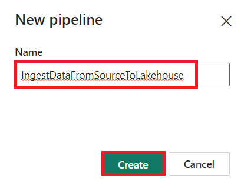

# 사용 사례 1: Lakehouse 생성, 샘플 데이터 수집 및 보고서 작성

**소개**

이 랩은 데이터 수집부터 데이터 사용까지 엔드 투 엔드 시나리오를
안내합니다. Fabric에 대한 기본적인 이해를 돕는데, 다양한 경험과 그 통합
방식, 그리고 이 플랫폼을 사용하는 전문가 및 일반 개발자의 경험까지
포함됩니다. 이 랩은 참조 아키텍처, 기능 및 기능의 전체 목록, 또는 특정
모범 사례에 대한 권장 사항을 제공하지 않습니다.

전통적으로 기업들은 트랜잭션 및 구조화된 데이터 분석 요구 사항을 위해
최신 데이터 웨어하우스를 구축해 왔습니다. 또한
빅데이터(반구조화/비구조화) 데이터 분석 요구 사항을 위해 데이터
lakehouse를 구축해 왔습니다. 이 두 시스템은 병렬로 실행되어 사일로,
데이터 중복, 총소유비용(TCO) 증가라는 문제를 야기했습니다.

데이터 저장소를 통합하고 Delta Lake 형식으로 표준화한 Fabric을 통해
사일로와 데이터 중복을 제거하고 총소유비용을 대폭 절감할 수 있습니다.

Fabric이 제공하는 유연성을 활용하여 lakehouse 아키텍처나
데이터웨어하우스 아키텍처를 모두 구현하거나, 두 아키텍처를 결합하여
간단한 구현으로 두 아키텍처의 장점을 모두 누릴 수 있습니다. 이
튜토리얼에서는 소매업체의 사례를 통해 처음부터 끝까지 lakehouse
아키텍처를 구축해 보겠습니다. [Medallion
architecture](https://learn.microsoft.com/en-us/azure/databricks/lakehouse/medallion) 를
사용하는데, 청동 계층에는 원시 데이터, 실버 계층에는 검증 및 중복 제거된
데이터, 그리고 골드 계층에는 고도로 정제된 데이터가 저장됩니다. 어떤
산업 분야의 어떤 조직이든 동일한 접근 방식을 사용하여 lakehouse를 구현할
수 있습니다.

이 랩에서는 소매 분야의 가상의 Wide World Importers 회사에서 개발자가
다음 단계를 완료하는 방법을 설명합니다.

**목표**:

1\. 1. Power BI 계정에 로그인하여 무료 Microsoft Fabric 평가판을
시작합니다.

2\. Power BI에서 Microsoft Fabric(미리 보기) 평가판을 시작합니다.

3\. Microsoft 365 관리 센터에 대한 OneDrive 가입을 구성합니다.

4\. Fabric 작업 공간과 lakehouse를 만드는 것을 포함하여 조직을 위한
엔드투엔드 lakehouse를 구축하고 구현합니다.

5\. 샘플 데이터를 lakehouse에 수집하고 추가 처리를 위해 준비합니다.

6\. Python/PySpark 및 SQL Notebook을 사용하여 데이터를 변환하고
준비합니다.

7\. 다양한 접근 방식을 사용하여 비즈니스 집계 테이블을 만듭니다.

8\. 원활한 보고를 위해 테이블 ​​간의 관계를 설정합니다.

9\. 준비된 데이터를 기반으로 시각화를 사용하여 Power BI 보고서를
작성합니다.

10\. 생성된 보고서를 나중에 참조하고 분석할 수 있도록 저장합니다.

## 연습 1: Lakehouse 종단 간 시나리오 설정

### 작업 1: Power BI 계정에 로그인하고 무료 [**Microsoft Fabric trial**](https://learn.microsoft.com/en-us/fabric/get-started/fabric-trial)에 가입함

### 브라우저를 열고 주소창으로 이동한 후 다음 URL을 입력하거나 붙여넣습니다:+++<https://app.fabric.microsoft.com/+++> 그런 다음 **Enter** 버튼을 누릅니다.

1.  **Microsoft Fabric** 창에서 **Microsoft 365** credentials를 입력하고
    **Submit** 버튼을 클릭합니다.

2.  그런 다음 **Microsoft** 창에서 비밀번호를 입력하고 **Sign in**
    버튼을 클릭합니다.

3.  **Stay signed in?** 창에서 **Yes** 버튼을 클릭합니다.

4.  Power BI 홈페이지로 이동하게 됩니다.

**작업 2: Microsoft Fabric 평가판 시작**

Fabric 체험판을 시작하려면 다음 단계를 따릅니다

1.  **Fabric**페이지에서 오른쪽에 있는 **Account manager** 를
    클릭하세요. 계정 관리자 블레이드에서 아래 이미지와 같이 **Start
    trial** 을 선택합니다.

2.  메시지가 표시되면 약관에 동의한 후 **Activate**를 선택합니다.

3.  Select **Got it** to begin working in Fabric. 체험판 용량이 준비되면
    확인 메시지가 표시됩니다. **Got it** 을 선택하여 Fabric에서 작업을
    시작합니다.

> 

4.  계정 관리자를 다시 열어 보세요. 이제 **Trial status**라는 제목이
    생긴 것을 확인할 수 있습니다. 계정 관리자는 평가판 사용 기간의 남은
    일수를 추적합니다. 제품 환경에서 작업할 때 Fabric 메뉴 막대에서도
    카운트다운을 확인할 수 있습니다.

> 

**연습 2: 조직을 위한 종단 간 Lakehouse 구축 및 구현**

**작업 1: Fabric 작업 공간 만들기**

이 작업에서는 Fabric 작업 공간을 만듭니다. 이 작업 공간에는 Lakehouse,
데이터 흐름, 데이터 팩터리 파이프라인, 노트북, Power BI 데이터 세트,
보고서 등 이 Lakehouse 튜토리얼에 필요한 모든 항목이 포함되어 있습니다.

1.  Fabric home page, select **+New workspace** tile. Fabric
    홈페이지에서 +새로운 작업 공간 타일을 선택합니다.

2.  오른쪽에 나타나는 **Create a workspace**  창에서 다음 세부 정보를
    입력하고 **Apply** 버튼을 클릭합니다.

[TABLE]

3.  **참고**: 랩 즉시 ID를 찾으려면 'Help'을 선택하고 즉시 ID를
    복사합니다.

> 
>
> 
>
> 

4.  배포가 완료될 때까지 기다리세요. 완료하는 데 2~3분 정도 걸립니다.

**작업 2: Lakehouse만들기**

1.  Create a new lakehouse by clicking on the **+New item** button in
    the navigation bar. 탐색 모음에서 **+New item** 버튼을 클릭하여
    새로운 lakehouse을 만듭니다.

> 

2.  " **Lakehouse** " 타일을 클릭합니다.

> 

3.  **New lakehouse** 대화 상자에서 **Name** 필드에 **wwilakehouse**를
    입력하고 만들기 버튼을 클릭하여 새로운 Lakehouse를 엽니다.

**참고**: wwilakehouse 앞에 있는 공간을 제거하세요.

> 

4.  **Successfully created SQL endpoint**라는 알림이 표시됩니다.

**작업 3: 샘플 데이터 수집**

1.  wwilakehouse 페이지에서 **Get data in your lakehouse** 섹션으로
    이동한 다음 **Upload files as shown in the below image**를
    클릭합니다.

2.  파일 업로드 탭에서 파일 아래의 폴더를 클릭합니다.

3.  VM에서 **C:\LabFiles** 로 이동한 다음,
    ***dimension_customer.csv*** 파일을 선택하고 **Open**버튼을
    클릭합니다.

4.  그런 다음 **Upload** 버튼을 클릭하고 닫습니다.

5.  **Files**에서 refresh를 클릭합니다. 파일이 나타납니다.

6.  **Lakehouse** 페이지의 탐색기 창에서 Files를 선택합니다. 이제
    마우스를 **dimension_customer.csv**파일로 이동합니다.
    'dimension_customer.csv' 옆의 가로 줄임표**(…)**를 클릭합니다.
    **Load Table**을 클릭한 후 **New table**을 선택합니다.

7.  **Load file to new table** 대화 상자에서 **Load** 버튼을 클릭합니다.

8.  그다음 왼쪽의 **Lakehouse explorer**창에서 **Table** 노드의 ...
    메뉴에서 **Refresh**를 선택합니다.

9.  Lakehouse의 SQL 엔드포인트를 사용하여 SQL 문으로 데이터를 쿼리할
    수도 있습니다. 화면 오른쪽 상단의 **Lakehouse**드롭다운 메뉴에서
    **SQL analytics endpoint** 를 선택합니다

10. wwilakehouse 페이지의 Explorer에서 **dimension_customer** 테이블을
    선택하여 데이터를 미리 보고, **New SQL query** 를 선택하여 SQL 문을
    작성합니다.

11. 다음 샘플 쿼리는 **dimension_customer** 테이블의 **BuyingGroup
    column** 을 기준으로 행 개수를 집계합니다. SQL 쿼리 파일은 나중에
    참조할 수 있도록 자동으로 저장되며, 필요에 따라 이름을 바꾸거나
    삭제할 수 있습니다. 아래 이미지와 같이 코드를 붙여넣은 후 재생
    아이콘을 클릭하여 스크립트를 실행합니다.

> SELECT BuyingGroup, Count(\*) AS Total
>
> FROM dimension_customer
>
> GROUP BY BuyingGroup

**참고:** 스크립트 실행 중 오류가 발생하면 위의 이미지와 스크립트 구문을
비교해 보세요.

12. 이전에는 모든 Lakehouse 테이블과 뷰가 시맨틱 모델에 자동으로
    추가되었습니다. 최근 업데이트로 인해 새로운 Lakehouse의 경우
    테이블을 시맨틱 모델에 수동으로 추가해야 합니다.

13. Lakehouse **Reporting** 탭에서 **Manage default Power BI semantic
    model**를 선택하고 의미 모델에 추가하려는 테이블을 선택합니다.

14. **Manage default semantic model**  탭에서
    **dimension_customer** 테이블을 선택하고 **Confirm**을 클릭합니다.

**작업 4: 보고서 작성**

1.  이제 왼쪽 탐색 창에서 **Fabric Lakehouse** **Tutorial-XX** 를
    클릭합니다.

2.  **Fabric Lakehouse Tutorial-XX** 에서 **Semantic model(default)**의
    **wwilakehouse**를 선택합니다. 이 데이터세트는 자동으로 생성되며
    lakehouse와 이름이 같습니다.

3.  시맨틱 모델 창에서 모든 테이블을 볼 수 있습니다. 보고서를 처음부터
    만들거나, 페이지가 매겨진 보고서를 만들거나, Power BI가 데이터를
    기반으로 자동으로 보고서를 생성하도록 할 수 있습니다. 이
    자습서에서는 아래 이미지와 같이 **Explore this data**에서
    **Auto-create a report** 을 선택합니다.

4.  테이블은 차원이고 측정값이 없으므로 Power BI는 행 개수에 대한
    측정값을 만들고 이를 여러 열에 걸쳐 집계한 다음, 다음 이미지에
    표시된 것처럼 다양한 차트를 만듭니다.

5.  상단 리본에서 **Save**를 선택하여 이 보고서를 나중에 사용할 수
    있도록 저장합니다.

6.  **Save your report**  대화 상자에서 보고서 이름을
    +++dimension_customer-report+++로 입력하고 **Save**를 선택합니다.

7.  You will see a notification stating **Report saved**.

**연습 3: Lakehouse에 데이터 수집**

이 연습에서는 Wide World Importers(WWI)에서 추가적인 차원 테이블과 사실
테이블을 Lakehouse로 수집합니다.

**작업 1: 데이터 수집**

1.  왼쪽 탐색 창에서 **Workspaces**를 선택한 후, **Workspaces**메뉴에서
    새 작업 공간(예: Fabric Lakehouse Tutorial-XX)을 선택하세요. 작업
    공간의 항목 보기가 나타납니다.

2.  **Fabric Lakehouse Tutorial-XX** 작업 공간 페이지에서 **+New
    item** 버튼을 클릭하고 **Data pipeline**을 선택합니다.

3.  새 파이프라인 대화 상자에서 이름을
    **+++IngestDataFromSourceToLakehouse+++**로 지정하고 **Create**를
    선택합니다. 새 데이터 팩터리 파이프라인이 생성되어 열립니다.

4.  새로 생성된 데이터 팩토리 파이프라인
    **IngestDataFromSourceToLakehouse**에서 **Copy data assistant** 를
    선택합니다.

5.  다음으로, 샘플 World Wide Importers 데이터를 Lakehouse로 가져오기
    위해 **HTTP** 연결을 설정합니다. **New sources**목록에서 **View
    more**선택하고 **Http**를 검색하여 선택합니다.

6.  **Connect to data source**창에서 아래 표의 세부 정보를 입력하고
    **Next**를 선택합니다.

[TABLE]

7.  

8.  다음 단계에서는 **Binary copy** 를 활성화하고, 원본이 .zip
    파일이므로 **Compression type** 로 **ZipDeflate (.zip)**를
    선택합니다. 다른 필드는 기본값으로 유지하고 **Next**를 클릭합니다.

9.  **Connect to data destination**창에서 **OneLake data hub** 와
    **wwilakehouse**를 차례로 선택합니다. 이제 **Root folder** 를
    **Files**로 지정하고 **Next**를 클릭합니다. 이렇게 하면 데이터가
    Lakehouse의 **Files** 섹션에 저장됩니다.

10. **File format** 을 (비어 있어야 함) 선택합니다. **Next**을 클릭한 후
    **Save+Run**을 클릭합니다. 파이프라인을 예약하여 데이터를 주기적으로
    새로 고칠 수 있습니다. 이 튜토리얼에서는 파이프라인을 한 번만
    실행합니다. 데이터 복사 프로세스는 완료하는 데 약 15~19분이
    소요됩니다. 

11. 이제 유효성 검사가 실패하는 것을 확인할 수 있습니다. **pipeline
    validation output**을 클릭합니다.

12. **Destination**탭에서 파일 형식을 드롭다운하여 **Binary**를
    선택합니다.

13. 이제 **Run** 버튼을 클릭합니다  

14. 출력 탭에서 **Copy_a1n** 을 선택하여 데이터 전송 세부 정보를
    확인하세요. **Status**가 **Succeeded**로 표시되면 **Close**버튼을
    클릭합니다.

15. 파이프라인을 성공적으로 실행한 후 Lakehouse(**wwilakehouse**)로 가서
    탐색기를 열어 가져온 데이터를 확인합니다.

16. **Explorer** 보기에 **WideWorldImportersDW** 폴더가 있고 모든
    테이블에 대한 데이터가 포함되어 있는지 확인합니다.

17. 데이터는 Lakehouse 탐색기의 **Files**  섹션에 생성됩니다. GUID가
    있는 새 폴더에 필요한 모든 데이터가 저장됩니다. GUID 이름을
    +++wwi-raw-data+++로 변경합니다.

**연습 4: Lakehouse에서 데이터 준비 및 변환**

**작업 1: 데이터 준비**

이전 연습 단계를 통해 소스에서 Lakehouse의 **Files**섹션으로 원시
데이터를 수집했습니다. 이제 해당 데이터를 변환하여 델타 테이블을 생성할
수 있습니다.

1.  이제 왼쪽 탐색 창에서 **Fabric Lakehouse Tutorial-XX**를 클릭합니다.

2.  **Homepage**에서 **Import**  섹션으로 이동한 후 **Notebook**을
    클릭하고 **From this computer**를 클릭합니다.

3.  **Import**  섹션으로 이동하여 **Upload** 를 선택하고, **Notebook**을
    클릭한 다음 **From this computer**를 클릭합니다.

**참고**: **File name**  필드 옆 드롭다운에서 **All files (\*.\*)** 을
선택해야 합니다. 

4.  **C:\LabFiles** 에서 01-델타 테이블 만들기, **01-Create Delta
    Tables, 02-Data Transformation-Business Aggregation** 노트북을 찾아
    선택하고 **Open** 버튼을 클릭합니다.

5.  **Imported successfully**라는 알림이 표시됩니다.

6.  가져오기가 성공적으로 완료된 후 새로 가져온 노트북을 보려면
    **Recommended** 섹션에서 **Fabric Lakehouse Tutorial-XX**를
    선택합니다.

7.  **Fabric Lakehouse Tutorial-XX**창에서 **wwilakehouse** lakehouse를
    선택하여 엽니다.

**작업 2: 데이터 변환 및 Silver Delta 테이블에 로드**

1.  **wwilakehouse** 페이지에서 명령 모음에 있는 **Open notebook** 을
    탐색하여 클릭한 다음 **Existing notebook**을 선택합니다.

2.  **Open existing notebook** 목록에서 **01 - Create Delta Tables**
    노트북을 선택하고 **Open**을 선택합니다.

3.  **Lakehouse explorer**에서 열린 노트북을 보면 해당 노트북이 이미
    열려 있는 Lakehouse에 연결되어 있는 것을 볼 수 있습니다.

\*\* 참고\*\*

Fabric은 최적화된 델타 레이크 파일을 작성할 수 있는
[**V-order**](https://learn.microsoft.com/en-us/fabric/data-engineering/delta-optimization-and-v-order)기능을
제공합니다. V-order는 최적화되지 않은 델타 레이크 파일보다 압축률을
3~4배, 성능은 최대 10배 향상시킵니다. Fabric의 Spark는 기본 128MB 크기의
파일을 생성하면서 파티션을 동적으로 최적화합니다. 대상 파일 크기는
구성을 사용하여 워크로드 요구 사항에 따라 변경할 수 있습니다. Apache
Spark 엔진은 [**optimize
write**](https://learn.microsoft.com/en-us/fabric/data-engineering/delta-optimization-and-v-order#what-is-optimized-write)기능을
통해 쓰기 파일 수를 줄이고 쓰기 데이터의 개별 파일 크기를 늘리는 것을
목표로 합니다.

4.  Lakehouse의 **Tables** 섹션에서 델타 레이크 테이블로 데이터를
    작성하기 전에, 두 가지 Fabric 기능(**V-order** 및 **Optimize
    Write)**을 사용하여 데이터 쓰기를 최적화하고 읽기 성능을
    향상시킵니다. 세션에서 이러한 기능을 활성화하려면 노트북의 첫 번째
    셀에서 다음 구성을 설정합니다.

5.  노트북을 시작하고 셀을 실행하려면 셀에 마우스를 올려 놓으면 왼쪽에
    나타나는 **Run** 아이콘을 선택합니다.

셀을 실행할 때 기본 Spark 풀이나 클러스터 세부 정보를 지정할 필요가
없었습니다. Fabric이 Live Pool을 통해 이를 제공하기 때문입니다. 모든
Fabric 작업 공간에는 Live Pool이라는 기본 Spark 풀이 포함되어 있습니다.
즉, 노트북을 생성할 때 Spark 구성이나 클러스터 세부 정보를 지정할 필요가
없습니다. 첫 번째 노트북 명령을 실행하면 몇 초 안에 라이브 풀이
실행됩니다. Spark 세션이 설정되고 코드 실행이 시작됩니다. 이후 Spark
세션이 활성화된 동안 이 노트북에서 코드 실행은 거의 즉시
이루어집니다. 

6.  다음으로, Lakehouse의 **Files** 섹션에서 원시 데이터를 읽고 변환의
    일부로 다양한 날짜 부분에 대한 열을 추가합니다. partitionBy Spark
    API를 사용하여 새로 생성된 데이터 부분 열(연도 및 분기)을 기반으로
    델타 테이블로 데이터를 분할합니다.

7.  두 번째 셀을 실행하려면 셀 위에 마우스를 올리면 왼쪽에 나타나는
    **Run**아이콘을 선택합니다.

**참고**: 출력을 볼 수 없는 경우 **Spark jobs**의 왼쪽에 있는 수평선을
클릭하세요.

\`\`\`

from pyspark.sql.functions import col, year, month, quarter

table_name = 'fact_sale'

df =
spark.read.format("parquet").load('Files/wwi-raw-data/full/fact_sale_1y_full')

df = df.withColumn('Year', year(col("InvoiceDateKey")))

df = df.withColumn('Quarter', quarter(col("InvoiceDateKey")))

df = df.withColumn('Month', month(col("InvoiceDateKey")))

df.write.mode("overwrite").format("delta").partitionBy("Year","Quarter").save("Tables/" +
table_name)

\`\`\`

 

8.  fact tables 로드되면 나머지 차원에 대한 데이터 로드로 넘어갈 수
    있습니다. 다음 셀은 매개변수로 전달된 각 테이블 이름에 대해
    Lakehouse의 **Files**  섹션에서 원시 데이터를 읽는 함수를
    생성합니다. 다음으로, 차원 테이블 목록을 생성합니다. 마지막으로,
    테이블 목록을 순회하며 입력 매개변수에서 읽은 각 테이블 이름에 대한
    델타 테이블을 생성합니다.

9.  셀을 선택하고 코드를 바꾼 다음 셀 위에 마우스를 올려 놓으면 왼쪽에
    나타나는 **Run**아이콘을 클릭합니다.

10. \`\`\`

11. from pyspark.sql.types import \*

12. def loadFullDataFromSource(table_name):

13. df = spark.read.format("parquet").load('Files/wwi-raw-data/full/' +
    table_name)

14. df.write.mode("overwrite").format("delta").save("Tables/" +
    table_name)

15. 

16. full_tables = \[

17. 'dimension_city',

18. 'dimension_date',

19. 'dimension_employee',

20. 'dimension_stock_item'

21. \]

22. 

23. for table in full_tables:

24. loadFullDataFromSource(table)

25. \`\`\`

 

26. To validate the created tables, click and select refresh on
    the **Tables**. The tables appear.  생성된 테이블의 유효성을
    검사하려면 **Tables**를 클릭하고 새로 고침을 선택합니다. 테이블이
    나타납니다. 

27. 작업 공간의 항목 보기로 다시 가서 **Fabric Lakehouse
    Tutorial-XX** 를 선택하고 **wwilakehouse**를 선택하여 엽니다.

28. 이제 두 번째 노트북을 엽니다. Lakehouse 뷰에서 **Open notebook**
    드롭다운하고 상단 탐색 메뉴에서 ' **Existing notebook** 을
    선택합니다.

29. 기존 노트북 열기 목록에서 **02 - Data Transformation -
    Business** **Aggregation** 노트북을 선택하고 **Open**을 클릭합니다.

30. **Lakehouse Explorer**에서 열린 노트북을 보면 해당 노트북이 이미
    열려 있는 Lakehouse에 연결되어 있는 것을 볼 수 있습니다.

31. 노트북을 시작하고 1^(st) 셀을 선택한 다음, 마우스를 올리면 셀 왼쪽에
    나타나는 **Run** 아이콘을 선택합니다.

32. 어떤 조직에서는 Scala/Python을 사용하는 데이터 엔지니어와 SQL(Spark
    SQL 또는 T-SQL)을 사용하는 다른 데이터 엔지니어가 모두 동일한 데이터
    복사본을 가지고 작업할 수 있습니다. Fabric은 다양한 경험과 선호도를
    가진 이러한 여러 그룹이 함께 작업하고 협업할 수 있도록 지원합니다.
    두 가지 접근 방식은 비즈니스 집계를 변환하고 생성합니다. 성능 저하
    없이 원하는 방식을 선택하거나, 필요에 따라 여러 접근 방식을 조합하여
    사용할 수 있습니다:

    - **접근 방식 \#1** - PySpark를 사용하여 데이터를 결합하고 집계하여
      비즈니스 집계를 생성합니다. 이 방법은 Python 또는 PySpark
      프로그래밍 경험이 있는 사용자에게 더 적합합니다.

    - **접근 방식 \#2**- Spark SQL을 사용하여 데이터를 조인하고 집계하여
      비즈니스 집계를 생성합니다. 이 방식은 SQL 관련 경험이 있고 Spark로
      전환하는 사용자에게 더 적합합니다.

33. **접근 방식 \#1 (sale_by_date_city)** - PySpark를 사용하여 데이터를
    조인하고 집계하여 비즈니스 집계를 생성합니다. 다음 코드를 사용하여
    기존 델타 테이블을 참조하는 세 개의 서로 다른 Spark 데이터프레임을
    생성합니다. 그런 다음, 데이터프레임을 사용하여 이 테이블들을
    조인하고, 그룹화하여 집계를 생성하고, 일부 열의 이름을 변경한 후,
    마지막으로 Lakehouse의 **Tables** 섹션에 델타 테이블로 작성하여
    데이터를 유지합니다.

이 셀에서 기존 델타 테이블을 참조하는 세 개의 서로 다른 Spark
데이터프레임을 만듭니다.

df_fact_sale = spark.read.table("wwilakehouse.fact_sale")

df_dimension_date = spark.read.table("wwilakehouse.dimension_date")

df_dimension_city = spark.read.table("wwilakehouse.dimension_city")

34. 이 셀에서 앞서 만든 데이터 프레임을 사용하여 이러한 테이블을
    결합하고, 그룹화를 수행하여 집계를 생성하고, 몇몇 열의 이름을
    바꾸고, 마지막으로 Lakehouse의 테이블 섹션에 델타 **Tables**로
    작성합니다.

35. \`\`\`

36. sale_by_date_city = df_fact_sale.alias("sale") \\

37. .join(df_dimension_date.alias("date"), df_fact_sale.InvoiceDateKey
    == df_dimension_date.Date, "inner") \\

38. .join(df_dimension_city.alias("city"), df_fact_sale.CityKey ==
    df_dimension_city.CityKey, "inner") \\

39. .select("date.Date", "date.CalendarMonthLabel", "date.Day",
    "date.ShortMonth", "date.CalendarYear", "city.City",
    "city.StateProvince",

40. "city.SalesTerritory", "sale.TotalExcludingTax", "sale.TaxAmount",
    "sale.TotalIncludingTax", "sale.Profit")\\

41. .groupBy("date.Date", "date.CalendarMonthLabel", "date.Day",
    "date.ShortMonth", "date.CalendarYear", "city.City",
    "city.StateProvince",

42. "city.SalesTerritory")\\

43. .sum("sale.TotalExcludingTax", "sale.TaxAmount",
    "sale.TotalIncludingTax", "sale.Profit")\\

44. .withColumnRenamed("sum(TotalExcludingTax)",
    "SumOfTotalExcludingTax")\\

45. .withColumnRenamed("sum(TaxAmount)", "SumOfTaxAmount")\\

46. .withColumnRenamed("sum(TotalIncludingTax)",
    "SumOfTotalIncludingTax")\\

47. .withColumnRenamed("sum(Profit)", "SumOfProfit")\\

48. .orderBy("date.Date", "city.StateProvince", "city.City")

49. 

50. sale_by_date_city.write.mode("overwrite").format("delta").option("overwriteSchema",
    "true").save("Tables/aggregate_sale_by_date_city")

51. \`\`\`

52. **접근 방식 \#2 (sale_by_date_employee)** - Spark SQL을 사용하여
    데이터를 조인하고 집계하여 비즈니스 집계를 생성합니다. 다음 코드를
    사용하여 세 개의 테이블을 조인하여 임시 Spark 뷰를 생성하고,
    그룹화하여 집계를 생성하고, 일부 열의 이름을 변경합니다. 마지막으로
    임시 Spark 뷰에서 데이터를 읽어와 Lakehouse의 **Tables**섹션에 델타
    테이블로 작성하여 데이터를 유지합니다.

이 셀에서 세 개의 테이블을 조인하여 임시 Spark 뷰를 만들고, 그룹화를
수행하여 집계를 생성하고, 몇몇 열의 이름을 바꿉니다.

\`\`\`

%%sql

CREATE OR REPLACE TEMPORARY VIEW sale_by_date_employee

AS

SELECT

DD.Date, DD.CalendarMonthLabel

, DD.Day, DD.ShortMonth Month, CalendarYear Year

,DE.PreferredName, DE.Employee

,SUM(FS.TotalExcludingTax) SumOfTotalExcludingTax

,SUM(FS.TaxAmount) SumOfTaxAmount

,SUM(FS.TotalIncludingTax) SumOfTotalIncludingTax

,SUM(Profit) SumOfProfit

FROM wwilakehouse.fact_sale FS

INNER JOIN wwilakehouse.dimension_date DD ON FS.InvoiceDateKey = DD.Date

INNER JOIN wwilakehouse.dimension_Employee DE ON FS.SalespersonKey =
DE.EmployeeKey

GROUP BY DD.Date, DD.CalendarMonthLabel, DD.Day, DD.ShortMonth,
DD.CalendarYear, DE.PreferredName, DE.Employee

ORDER BY DD.Date ASC, DE.PreferredName ASC, DE.Employee ASC

\`\`\`

53. 이 셀에서는 이전 셀에서 만든 임시 Spark 뷰에서 데이터를 읽어서
    마지막으로 Lakehouse의 **Tables** 섹션에 델타 테이블로 작성합니다.

54. sale_by_date_employee = spark.sql("SELECT \* FROM
    sale_by_date_employee")

55. sale_by_date_employee.write.mode("overwrite").format("delta").option("overwriteSchema",
    "true").save("Tables/aggregate_sale_by_date_employee")

56. 생성된 테이블의 유효성을 검사하려면 **Tables**를 클릭하고 새로
    고침을 선택하세요. 집계 테이블이 나타납니다.

두 접근 방식 모두 비슷한 결과를 가져옵니다. 새로운 기술을 배우거나 성능
저하를 최소화하기 위해 자신의 배경과 선호도에 따라 선택할 수 있습니다.

또한, 데이터를 델타 레이크 파일로 작성하고 있다는 것을 알 수 있습니다.
Fabric의 자동 테이블 검색 및 등록 기능이 이러한 데이터를 메타스토어에
자동으로 등록합니다. SQL에서 사용할 테이블을 생성하기 위해 CREATE TABLE
문을 명시적으로 호출할 필요가 없습니다.

**연습 5: Microsoft Fabric에서 보고서 작성**

이 튜토리얼 섹션에서는 Power BI 데이터 모델을 만들고 보고서를 처음부터
만듭니다.

**작업 1: SQL 엔드포인트를 사용하여 실버 레이어의 데이터 탐색**

Power BI는 전체 Fabric 환경에 기본적으로 통합되어 있습니다. 이 기본
통합은 DirectLake라는 고유한 모드를 통해 Lakehouse의 데이터에 액세스하여
가장 뛰어난 쿼리 및 보고 환경을 제공합니다. DirectLake 모드는 Power
BI에서 매우 큰 데이터 세트를 분석하는 획기적인 새로운 엔진 기능입니다.
이 기술은 데이터웨어하우스나 Lakehouse 엔드포인트에 쿼리하거나 Power BI
데이터 세트로 데이터를 가져오거나 복제하지 않고도 데이터 레이크에서
Parquet 형식의 파일을 직접 로드한다는 아이디어를 기반으로 합니다.
DirectLake는 데이터 레이크의 데이터를 Power BI 엔진으로 바로 로드하여
분석할 수 있는 빠른 경로입니다.

기존 DirectQuery 모드에서는 Power BI 엔진이 각 쿼리를 실행하기 위해
소스에서 데이터를 직접 쿼리하며, 쿼리 성능은 데이터 검색 속도에 따라
달라집니다. DirectQuery는 데이터 복사가 필요 없으므로, 소스의 변경
사항이 가져오기 과정에서 쿼리 결과에 즉시 반영됩니다. 반면, 가져오기
모드에서는 쿼리 실행 시마다 소스에서 데이터를 쿼리하지 않고도 메모리에서
데이터를 즉시 사용할 수 있으므로 성능이 향상됩니다. 하지만 Power BI
엔진은 데이터 새로 고침 중에 먼저 데이터를 메모리에 복사해야 합니다.
다음 데이터 새로 고침(예약된 새로 고침 및 요청 시 새로 고침 모두)에서는
기본 데이터 원본의 변경 사항만 반영됩니다.

DirectLake 모드는 이제 데이터 파일을 메모리에 직접 로드하여 이러한
가져오기 요구 사항을 제거합니다. 명시적인 가져오기 프로세스가 없기
때문에 소스에서 변경 사항을 즉시 가져올 수 있습니다. 따라서
DirectQuery와 가져오기 모드의 장점을 결합하는 동시에 단점은 피할 수
있습니다. 따라서 DirectLake 모드는 매우 큰 데이터 세트와 소스에서 자주
업데이트되는 데이터 세트를 분석하는 데 이상적인 선택입니다.

1.  왼쪽 탐색 창에서 **Fabric_LakehouseXX** 를 선택한 다음
    **Type** **SQL analytics endpoint**의 **wwilakehouse** 를
    선택합니다.

2.  SQL 엔드포인트 창에서 생성한 모든 테이블을 볼 수 있습니다. 아직
    테이블이 보이지 않으면 상단의 **Refresh**아이콘을 선택하세요. 그런
    다음 하단의 **Model layout**탭을 선택하여 기본 Power BI 데이터
    세트를 엽니다.

3.  이 데이터 모델의 경우 서로 다른 테이블 간의 관계를 정의해야 다양한
    테이블에서 들어오는 데이터를 기반으로 보고서와 시각화를 만들 수
    있습니다. **Auto layout**을 클릭합니다.  

4.  From the **fact_sale** table, drag the **CityKey** field and drop it
    on the **CityKey** field in the **dimension_city** table to create a
    relationship. The **Create Relationship** dialog box appears.
    **fact_sale** 테이블에서 **CityKey** 필드를 끌어서
    **dimension_city** 테이블의 **CityKey** 필드에 놓아 관계를 만듭니다.
    **Create Relationship** 대화 상자가 나타납니다.

참고: 테이블을 클릭하고 드래그 앤 드롭하여 dimension_city테이블과
fact_sale테이블을 나란히 배치하여 테이블을 재정렬할 수 있습니다. 관계를
설정하려는 두 테이블에도 동일하게 적용됩니다. 이는 테이블 간 열을 드래그
앤 드롭하는 작업을 더 쉽게 하기 위한 것입니다.

5.  **Create Relationship** 대화 상자에서:

    - **Table 1**은 **fact_sale**과 **CityKey**열로 채워집니다.

    - **Table 2** 는 **dimension_city**와 **CityKey** 열로 채워집니다.

    - Cardinality: **Many to one (\*:1)**

    - Cross filter direction: **Single**

    - **Make this relationship active** 옆의 상자를 선택된 상태로 둡니다

    - **Assume referential integrity**옆의 상자를 선택합니다

    - **Save**를 선택합니다

6.  다음으로, 위에 표시된 것과 동일한 **Create Relationship** 설정을
    사용하여 다음 표와 열을 사용하여 이러한 관계를 추가합니다:

    - **StockItemKey(fact_sale)** - **StockItemKey(dimension_stock_item)**

- **Salespersonkey(fact_sale)** - **EmployeeKey(dimension_employee)**

7.  위와 동일한 단계를 사용하여 아래 두 집합 간의 관계를 생성합니다.

    - **CustomerKey(fact_sale)** - **CustomerKey(dimension_customer)**

    - **InvoiceDateKey(fact_sale)** - **Date(dimension_date)**

8.  이러한 관계를 추가한 후에는 데이터 모델이 아래 이미지와 같아지고
    보고에 사용할 준비가 됩니다.

**작업 2: 보고서 작성**

1.  상단 리본에서 **Reporting**를 선택하고 **New report** 선택하여 Power
    BI에서 보고서/대시보드 만들기를 시작합니다.

2.  Power BI 보고서 캔버스에서는 **Data**  창에서 필요한 열을 캔버스로
    끌어다 놓고 사용 가능한 시각화 중 하나 이상을 사용하여 비즈니스 요구
    사항을 충족하는 보고서를 만들 수 있습니다.

**제목 추가:**

3.  리본에서 **Text box**를 선택하세요. **WW Importers Profit
    Reporting**을 입력하세요. 텍스트를 강조 표시하고 크기를 **20**으로
    늘립니다.

4.  텍스트 상자의 크기를 조정하여 보고서 페이지의 왼쪽 상단에 배치하고
    텍스트 상자 바깥쪽을 클릭합니다.

**카드 추가:**

- **Data** 창에서 **fact_sales**를 확장하고 **Profit** 옆의 확인란을
  선택합니다. 이렇게 하면 세로 막대형 차트가 생성되고 Y축에 필드가
  추가됩니다.

5.  Bar 차트를 선택한 후 시각화 창에서 **Card** visual를 선택합니다.

6.  이 옵션을 선택하면 시각적 요소가 카드로 변환됩니다. 제목 아래에
    카드를 배치합니다

7.  빈 캔버스의 아무 곳이나 클릭하거나 Esc 키를 눌러 방금 놓은 카드가
    선택되지 않도록 합니다.

**Bar 차트 추가:**

8.  **Data** 창에서 **fact_sales** 를 확장하고 **Profit**옆의 확인란을
    선택합니다. 이렇게 하면 세로 column 차트가 생성되고 Y축에 필드가
    추가됩니다. 

9.  **Data** 창에서 **dimension_city** 를 확장하고 **'SalesTerritory'**
    확인란을 선택합니다. 이렇게 하면 필드가 Y축에 추가됩니다. 

10. Bar chart를 선택한 상태에서 시각화 창에서 **Clustered bar chart**를
    선택합니다. 이렇게 하면 세로 막대형 차트가 가로 막대형 차트로
    변환됩니다.

11. 제목과 카드 아래 영역을 채우도록 막대형 차트의 크기를 조정합니다.

12. 빈 캔버스의 아무 곳이나 클릭하거나 Esc 키를 눌러 막대형 차트가
    선택되지 않도록 합니다.

**쌓인 영역형 차트 시각적 표현 만들기:**

13. **Visualizations**창에서 **Stacked area chart** visual를 선택합니다.

14. 이전 단계에서 만든 카드 및 막대형 차트 시각적 요소의 오른쪽에 쌓인
    영역형 차트의 위치와 크기를 조정합니다.

15. **Data** 창에서 **fact_sales** 를 확장하고 **Profit**옆의 확인란을
    선택합니다. **dimension_date**를 확장하고 **FiscalMonthNumber**옆의
    확인란을 선택합니다. 이렇게 하면 회계 월별 수익을 보여주는 채워진
    선형 차트가 생성됩니다.

16. **Data** 창에서 **dimension_stock_item** 을 확장하고
    **BuyingPackage**를 범례 필드로 끌어다 놓습니다. 이렇게 하면 각
    **BuyingPackage**에 대한 줄이 추가됩니다.

 

17. 빈 캔버스의 아무 곳이나 클릭하거나 Esc 키를 눌러서 쌓인 영역형
    차트가 더 이상 선택되지 않도록 합니다.

**Column 차트 만들기:**

18. **Visualizations** 창에서 **Stacked column chart** visualization를
    선택합니다.

19. **Data**창에서 **fact_sales** 를 확장하고 **Profit** 옆의 확인란을
    선택합니다. 이렇게 하면 필드가 Y축에 추가됩니다.

 

20. **Data** 창에서 **dimension_employee**를 확장하고 **Employee** 옆의
    확인란을 선택합니다. 이렇게 하면 필드가 X축에 추가됩니다.

21. 빈 캔버스의 아무 곳이나 클릭하거나 Esc 키를 눌러 차트가 선택되지
    않도록 합니다.

22. 리본에서 **File** \> **Save**를 선택합니다.

23. 보고서 이름을 **Profit Reporting**로 입력하고 **Save**를 선택합니다.

24. 보고서가 저장되었다는 알림이 표시됩니다. 

**연습 6: 리소스 정리**

개별 보고서, 파이프라인, 웨어하우스 및 기타 항목을 삭제하거나 전체 작업
공간을 제거할 수 있습니다. 이 튜토리얼을 위해 만든 작업 공간을
삭제하려면 다음 단계를 따릅니다.

1.  왼쪽 탐색 메뉴에서 **Fabric Lakehouse Tutorial-XX** 작업 공간을
    선택하세요. 작업 공간 항목 보기가 열립니다.

2.  작업 공간 이름 아래에서 ... 옵션을 선택하고 **Workspace settings**를
    선택합니다.

3.  **기타** 및 이 **작업 공간 제거를** 선택합니다.

4.  팝업되는 경고에서 **Delete** 를 클릭하세요.

5.  다음 실습으로 진행하기 전에 Workspace가 삭제되었다는 알림을
    기다립니다.

**요약:** 이 실습 랩은 데이터 관리 및 보고를 위해 Microsoft Fabric 및
Power BI의 필수 구성 요소를 설정하고 구성하는 데 중점을 둡니다. 평가판
활성화, OneDrive 구성, 작업 공간 생성, Lakehouse 설정 등의 작업이
포함됩니다. 또한 효과적인 데이터 분석을 위해 샘플 데이터 수집, 델타
테이블 최적화, Power BI 보고서 작성과 관련된 작업도 다룹니다. 본 랩의
목표는 데이터 관리 및 보고 목적으로 Microsoft Fabric 및 Power BI를
활용하는 실무 경험을 제공하는 것입니다.
