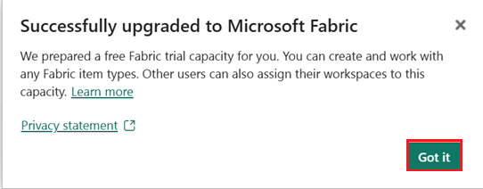
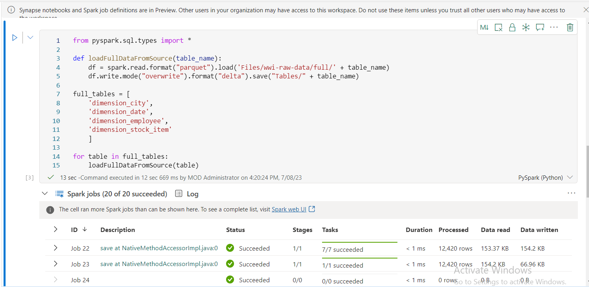

# Caso de uso 1: Criando um Lakehouse, inserindo dados de exemplo e construindo um relatório

**Introdução**

Este laboratório apresenta um cenário completo, desde a aquisição de
dados até o consumo. Ele ajuda você a desenvolver uma compreensão básica
do Fabric, incluindo as diferentes experiências e como elas se integram,
bem como as experiências de desenvolvedores profissionais e cidadãos que
acompanham o trabalho nesta plataforma. Este laboratório não pretende
ser uma arquitetura de referência, uma lista exaustiva de recursos e
funcionalidades ou uma recomendação de práticas recomendadas
específicas.

Tradicionalmente, as organizações vêm construindo data warehouses
modernos para suas necessidades de análise de dados transacionais e
estruturados. E data lakehouses para necessidades de análise de dados de
big data (semi/não estruturados). Esses dois sistemas funcionavam em
paralelo, criando silos, duplicidade de dados e aumento do custo total
de propriedade.

O Fabric, com sua unificação de armazenamento de dados e padronização no
formato Delta Lake, permite eliminar silos, remover duplicidade de dados
e reduzir drasticamente o custo total de propriedade.

Com a flexibilidade oferecida pelo Fabric, você pode implementar
arquiteturas do tipo lakehouse, armazém de dados ou combinar ambas para
obter o melhor dos dois mundos com uma implementação simples. Neste
tutorial, você usará o exemplo de uma organização de varejo e construirá
seu lakehouse do início ao fim. Ele utiliza a [medallion
architecture](https://learn.microsoft.com/en-us/azure/databricks/lakehouse/medallion),
em que a camada bronze contém os dados brutos, a camada Silver contém os
dados validados e desduplicados, e a camada Gold contém os dados
altamente refinados. Você pode adotar a mesma abordagem para implementar
um lakehouse em qualquer organização de qualquer setor.

Este laboratório explica como um desenvolvedor da empresa fictícia Wide
World Importers, do setor de varejo, conclui as seguintes etapas.

**Objetivos** :

1\. Entre na conta do Power BI e inicie uma avaliação gratuita do
Microsoft Fabric.

2\. Inicie a avaliação do Microsoft Fabric (Pré-visualização) no Power
BI.

3\. Configure a inscrição no OneDrive para o centro de administração do
Microsoft 365 .

4\. Criar e implementar um lakehouse de ponta a ponta para a
organização, incluindo a criação de um workspace no Fabric e de um
lakehouse.

5\. Ingira dados de amostra no lakehouse e prepare-os para processamento
posterior.

6\. Transforme e prepare os dados usando Python/ PySpark e notebooks
SQL.

7\. Crie tabelas de agregação de negócios usando diferentes abordagens.

8\. Estabeleça relações entre as tabelas para geração de relatórios
integrados.

9\. Crie um relatório do Power BI com visualizações baseadas nos dados
preparados.

10\. Salve e armazene o relatório criado para referência e análise
futuras.

## Exercício 1: Configuração do cenário completo do Lakehouse.

### Tarefa 1: Entre na conta do Power BI e inscreva-se para o [**Microsoft Fabric trial**](https://learn.microsoft.com/en-us/fabric/get-started/fabric-trial) gratuito

1.  Abra seu navegador, navegue até a barra de endereço e digite ou cole
    o seguinte URL: +++<https://app.fabric.microsoft.com/+++> e
    pressione o botão **Enter** .

2.  Na janela do **Microsoft Fabric,** insira suas credenciais do
    **Microsoft 365** e clique no botão **Submit**.

3.  Em seguida, na janela da **Microsoft**, digite a senha e clique no
    botão **Sign in**.

4.  Na janela **Stay signed in?,** clique no botão **Yes**.

5.  Você será direcionado para a página inicial do Power BI.

**Tarefa 2: iniciar o teste do Microsoft Fabric**

Siga estas etapas para iniciar seu teste do Fabric.

1.  Na página do **Fabric,** clique em **Account manager** no lado
    direito. Na tela Account manager, navegue e selecione **Start
    trial,** conforme mostrado na imagem abaixo.

2.  Se solicitado, concorde com os termos e selecione **Activate**.

3.  Quando a função de teste estiver disponível, você receberá uma
    mensagem de confirmação. Selecione **Got it** para começar a
    trabalhar no Fabric.

> 

4.  Abra o seu Gerenciador de Contas novamente. Observe que agora há um
    cabeçalho para **Trial status**. O seu Gerenciador de Contas
    monitora o número de dias restantes do seu teste. Você também verá a
    contagem regressiva na barra de menu do Fabric ao trabalhar em uma
    experiência de produto.

> 

**Exercício 2: Crie e implemente um lakehouse completo para sua
organização**

**Tarefa 1: Criar um workspace do Fabric**

Nesta tarefa, você criará um workspace no Fabric. O workspace contém
todos os itens necessários para este tutorial do Lakehouse, incluindo o
Lakehouse, fluxos de dados, pipelines do Data Factory, notebooks,
conjuntos de dados do Power BI e relatórios.

1.  Na página inicial do Fabric, selecione **+New workspace**.

2.  No painel **Create a workspace** que aparece no lado direito, insira
    os seguintes detalhes e clique no botão **Apply**.

[TABLE]

3.  Observação: para encontrar o ID
    instantâneo do seu laboratório, selecione 'Help' e copie o ID
    instantâneo.

> 
>
> 
>
> 

4.  Aguarde a conclusão da implementação. Leva de 2 a 3 minutos para ser
    concluída.

**Tarefa 2: Criar um lakehouse**

1.  Crie um novo lakehouse clicando no botão **+New item** na barra de
    navegação.

> 

2.  Clique em "**Lakehouse**".

> 

3.  Na caixa de diálogo **New lakehouse**, digite **wwilakehouse** no
    campo **Name**, clique no botão **Create** e abra o novo lakehouse .

**Observação:** Certifique-se de remover o espaço antes de
**wwilakehouse**.

> 

4.  Você verá uma notificação informando **Successfully created SQL
    endpoint**.

**Tarefa 3: Inserir dados de exemplo**

1.  Na página **wwilakehouse**, navegue até **Get data in your
    lakehouse** e clique em **Upload files**, **conforme mostrado na
    imagem abaixo**.

2.  Na aba Upload files, clique na pasta abaixo de Files

3.  Navegue até **C:\LabFiles** na sua VM, selecione o arquivo
    ***dimension_customer.csv*** e clique no botão **Open**.

4.  Em seguida, clique no botão **Upload** e feche

5.  Clique e selecione refresh em **Files**. O arquivo aparecerá.

6.  Na página **Lakehouse**, no painel Explorer, selecione Files. Agora,
    mova o cursor do mouse até o arquivo **dimension_customer.csv**.
    Clique nas reticências horizontais **(...)** ao lado de
    **dimension_customer**.csv. Navegue e clique em **Load Table** e
    selecione **New table**.

7.  Na caixa de diálogo **Load file to new table**, clique no botão
    **Load**.

8.  Em seguida, no painel do **Lakehouse explorer** à esquerda, no menu
    **…** do nó **Table**, selecione **Refresh**.

9.  Você também pode usar o endpoint SQL do Lakehouse para consultar os
    dados com instruções SQL. Selecione o **SQL analytics endpoint** no
    menu suspenso do **Lakehouse**, no canto superior direito da
    tela**.**

10. Na página wwilakehouse, em Explorer, selecione a tabela
    **dimension_customer** para visualizar seus dados e selecione **New
    SQL query** para escrever suas instruções SQL.

11. A consulta de exemplo a seguir agrega a contagem de linhas com base
    na **BuyingGroup column** da tabela **dimension_customer**. Os
    arquivos de consulta SQL são salvos automaticamente para referência
    futura, e você pode renomeá-los ou excluí-los conforme necessário.
    Cole o código conforme mostrado na imagem abaixo e clique no ícone
    de reprodução para **Run** o script.

> SELECT BuyingGroup, Count(\*) AS Total
>
> FROM dimension_customer
>
> GROUP BY BuyingGroup

**Observação:** Se você encontrar um erro durante a execução do script,
verifique a sintaxe do script com a imagem acima.

12. Anteriormente, todas as tabelas e visualizações do Lakehouse eram
    adicionadas automaticamente ao modelo semântico. Com as atualizações
    recentes, para novos Lakehouses, você precisa adicionar manualmente
    suas tabelas ao modelo semântico.

13. Na aba **Reporting** do lakehouse, selecione **Manage default Power
    BI semantic model** e selecione as tabelas que deseja adicionar ao
    modelo semântico.

14. Na aba **Manage default semantic model**, selecione a tabela
    **dimension_customer** e clique em **Confirm.**

**Tarefa 4: Criar um relatório**

1.  Agora, clique em **Fabric Lakehouse** **Tutorial-XX** no painel de
    navegação do lado esquerdo.

2.  Na visualização do **Fabric Lakehouse Tutorial-XX**, selecione
    **wwilakehouse** do tipo **Semantic model(default)**. Este conjunto
    de dados é criado automaticamente e tem o mesmo nome do lakehouse .

3.  No painel do modelo semântico, você pode visualizar todas as
    tabelas. Você tem opções para criar relatórios do zero, relatórios
    paginados ou deixar que o Power BI crie automaticamente um relatório
    com base nos seus dados. Para este tutorial, em **Explore this
    data**, selecione **Auto-create a report,** conforme mostrado na
    imagem abaixo.

4.  Como a tabela é uma dimensão e não há medidas nela, o Power BI cria
    uma medida para a contagem de linhas e a agrega em diferentes
    colunas, além de criar gráficos diferentes, conforme mostrado na
    imagem a seguir.

5.  Salve este relatório para o futuro selecionando **Save** na faixa
    superior.

6.  Na caixa de diálogo **Save your report**, insira um nome para seu
    relatório como +++dimension_customer-report+++ e selecione **Save.**

7.  Você verá uma notificação informando **Report saved**.

**Exercício 3: Inserir dados no lakehouse**

Neste exercício, você irá ingerir tabelas dimensionais e fatuais
adicionais do Wide World Importers (WWI) no lakehouse .

**Tarefa 1: Inserir dados**

1.  Selecione **Workspaces** no painel de navegação esquerdo e, em
    seguida, selecione seu novo workspace (por exemplo, Fabric Lakehouse
    Tutorial-XX) no menu **Workspaces**. A visualização de itens do seu
    workspace será exibida.

2.  Na página do workspace do **Fabric Lakehouse Tutorial-XX**, navegue
    e clique no botão **+New item** e selecione **Data pipeline**.

3.  Na caixa de diálogo New pipeline, especifique o nome como
    **+++IngestDataFromSourceToLakehouse+++** e selecione **Create.** Um
    novo pipeline de fábrica de dados será criado e aberto.

4.  No pipeline de fábrica de dados recém-criado, por
    exemplo **IngestDataFromSourceToLakehouse**, selecione **Copy data
    assistant**.

5.  Em seguida, configure uma conexão **HTTP** para importar os dados de
    exemplo do World Wide Importers para o Lakehouse. Na lista **New
    sources**, selecione **View more**, pesquise por **Http** e
    selecione-o.

6.  Na janela **Connect to data source**, insira os detalhes da tabela
    abaixo e selecione **Next**.

[TABLE]

> 

7.  Na próxima etapa, ative a **Binary copy** e escolha **ZipDeflate
    (.zip)** como o **Compression type,** já que a fonte é um arquivo
    .zip. Mantenha os outros campos com os valores padrão e clique em
    **Next**.

8.  Na janela **Connect to data destination**, selecione o **OneLake
    data hub** e selecione **wwilakehouse.** Agora, especifique a **Root
    folder** como **Files** e clique em **Next**. Isso escreverá os
    dados na seção **Files** do lakehouse .

9.  Escolha o **File format** que deve estar vazio para o destino.
    Clique em **Next** e depois em **Save+Run**. Você pode agendar
    pipelines para atualizar os dados periodicamente. Neste tutorial,
    executaremos o pipeline apenas uma vez. O processo de cópia de dados
    leva aproximadamente 15 a 19 minutos para ser
    concluído. 

10. Agora, você pode ver que a validação falhará. Clique na **pipeline
    validation output**

11. Na aba **destination**, selecione o formato do arquivo e selecione
    **Binary**.

12. Agora clique no botão Run 

13. Na aba Output, selecione **Copy_a1n** para ver os detalhes da
    transferência de dados. Após visualizar o
    **Status** como **Succeeded**, clique no botão **Close**.

14. Após a execução bem-sucedida do pipeline, vá para seu lakehouse
    (**wwilakehouse**) e abra o Explorer para ver os dados importados.

15. Verifique se a pasta **WideWorldImportersDW** está presente na
    visualização do **Explorer** e contém dados para todas as tabelas.

16. Os dados são criados na seção **Files** do Lakehouse Explorer. Uma
    nova pasta com GUID contém todos os dados necessários. Renomeie o
    GUID para +++wwi-raw-data+++

**Exercício 4: Preparar e transformar dados no lakehouse**

**Tarefa 1: Preparar dados**

A partir das etapas do exercício anterior, temos os dados brutos
ingeridos da fonte para a seção **Files** do lakehouse. Agora você pode
transformar esses dados e prepará-los para a criação de tabelas delta.

1.  Agora, clique em **Fabric Lakehouse** **Tutorial-XX** no painel de
    navegação do lado esquerdo.

2.  2.  Na página **Home**, navegue até a seção **Import,** clique em
        **Notebook** e clique em **From this computer**

3.  Selecione **Upload**, navegue até a seção **Import**, clique em
    **Notebook** e clique em **From this computer**

**Observação** : Certifique-se de
selecionar **All files (\*.\*)** no menu suspenso ao lado do campo
**File name**.

4.  Navegue e selecione **01-Create Delta Tables, 02-Data
    Transformation-Business Aggregation** notebook em **C:\LabFiles** e
    clique no botão **Open**.

5.  Você verá uma notificação informando **Imported successfully.**

6.  Após a importação ser bem-sucedida, para ver os notebooks
    recém-importados, selecione **Fabric Lakehouse Tutorial-XX** na
    seção **Recommended**.

7.  No painel **Fabric Lakehouse Tutorial-XX**, selecione
    **wwilakehouse** lakehouse para abri-lo.

**Tarefa 2: Transformar dados e carregar na tabela Delta Silver**

1.  Na página do **wwilakehouse**, navegue até a barra de comandos e
    clique em **Open notebook**, depois selecione **Existing notebook**.

2.  Na lista de **Open existing notebook**, selecione o notebook **01 -
    Create Delta Tables** e selecione **Open**.

3.  No notebook aberto no **Lakehouse explorer**, você vê que o notebook
    já está vinculado ao seu Lakehouse aberto.

\*\* Observação\*\*

O Fabric oferece a funcionalidade
[**V-order**](https://learn.microsoft.com/en-us/fabric/data-engineering/delta-optimization-and-v-order)
para escrever arquivos Delta Lake otimizados. O V-order geralmente
melhora a compactação em três a quatro vezes e acelera o desempenho em
até 10 vezes em relação aos arquivos Delta Lake não otimizados. O Spark
no Fabric otimiza partições dinamicamente enquanto gera arquivos com um
tamanho padrão de 128 MB. O tamanho do arquivo de destino pode ser
alterado de acordo com os requisitos da carga de trabalho, utilizando as
configurações. Com o recurso de [**optimize
write**](https://learn.microsoft.com/en-us/fabric/data-engineering/delta-optimization-and-v-order#what-is-optimized-write),
o mecanismo Apache Spark reduz o número de arquivos escritos e tem como
objetivo aumentar o tamanho individual dos arquivos de dados escritos.

4.  Antes de **escrever** dados como tabelas delta lake na seção
    **Tables** do lakehouse, vai utilizar dois recursos do Fabric
    (**V-order** e **Optimize Write**) para otimizar a gravação de dados
    e melhorar o desempenho de leitura. Para habilitar esses recursos na
    sua sessão, defina estas configurações na primeira célula do seu
    notebook.

5.  Para iniciar o notebook e executar a célula, selecione o ícone
    **Run** que aparece à esquerda da célula ao passar o mouse.

Ao executar uma célula, você não precisa especificar o Spark pool
subjacente nem os detalhes do cluster, porque o Fabric fornece isso por
meio do Live Pool. Cada workspace do Fabric vem com um Spark pool
padrão, chamado Live Pool. Isso significa que, ao criar notebooks, você
não precisa se preocupar em configurar o Spark ou definir detalhes de
cluster. Quando você executa o primeiro comando no notebook, o Live Pool
é iniciado em poucos segundos. A sessão Spark é então estabelecida e o
código começa a ser executado. As execuções subsequentes de código neste
notebook são quase instantâneas enquanto a sessão Spark estiver ativa.

6.  Em seguida, você lê os dados brutos da seção **Files** do Lakehouse
    e adiciona mais colunas para diferentes partes da data como parte da
    transformação. Use a API partitionBy do Spark para particionar os
    dados antes de escrevê-los como uma tabela delta com base nas
    colunas da parte de dados recém-criadas (Ano e Trimestre).

7.  Para executar a segunda célula, selecione o ícone **Run** que
    aparece à esquerda da célula ao passar o mouse.

**Observação** : caso você não consiga ver a saída, clique nas linhas
horizontais no lado esquerdo de **Spark jobs**.

\`\`\`

from pyspark.sql.functions import col, year, month, quarter

table_name = 'fact_sale'

df =
spark.read.format("parquet").load('Files/wwi-raw-data/full/fact_sale_1y_full')

df = df.withColumn('Year', year(col("InvoiceDateKey")))

df = df.withColumn('Quarter', quarter(col("InvoiceDateKey")))

df = df.withColumn('Month', month(col("InvoiceDateKey")))

df.write.mode("overwrite").format("delta").partitionBy("Year","Quarter").save("Tables/" +
table_name)

\`\`\`

 

8.  Após o carregamento das tabelas de fatos, você pode prosseguir com o
    carregamento dos dados para o restante das dimensões. A célula a
    seguir cria uma função para ler dados brutos da seção **Files** do
    lakehouse para cada nome de tabela passado como parâmetro. Em
    seguida, ela cria uma lista de tabelas dimensionais. Por fim,
    percorre essa lista de tabelas e cria uma tabela Delta para cada
    nome de tabela lido a partir do parâmetro de entrada.

9.  Selecione a célula, substitua o código e clique no ícone **Run** que
    aparece à esquerda da célula quando você passa o mouse sobre ela

10. \`\`\`

11. from pyspark.sql.types import \*

12. def loadFullDataFromSource(table_name):

13. df = spark.read.format("parquet").load('Files/wwi-raw-data/full/' +
    table_name)

14. df.write.mode("overwrite").format("delta").save("Tables/" +
    table_name)

15. 

16. full_tables = \[

17. 'dimension_city',

18. 'dimension_date',

19. 'dimension_employee',

20. 'dimension_stock_item'

21. \]

22. 

23. for table in full_tables:

24. loadFullDataFromSource(table)

25. \`\`\`

 

26. Para validar as tabelas criadas, clique em refresh e selecione a
    opção **Tables**. As tabelas serão exibidas. 

27. Vá para a visualização de itens do workspace novamente, selecione
    **Fabric Lakehouse Tutorial-XX** e selecione o
    **wwilakehouse** lakehouse para abri-lo.

28. Agora, abra o segundo notebook. Na visualização do Lakehouse, clique
    no menu **Open notebook** e selecione **Existing notebook** no menu
    de navegação superior.

29. Na lista Open existing notebook, selecione o notebook **02 - Data
    Transformation - Business** **Aggregation** e clique em **Open**.

30. No notebook aberto no **Lakehouse Explorer**, você vê que o notebook
    já está vinculado ao seu Lakehouse aberto .

31. Para iniciar o notebook, selecione a 1ª célula e selecione o ícone
    **Run** que aparece à esquerda da célula ao passar o mouse.

32. Uma organização pode ter engenheiros de dados trabalhando com
    Scala/Python e outros engenheiros de dados trabalhando com SQL
    (Spark SQL ou T-SQL), todos trabalhando na mesma cópia dos dados. O
    Fabric possibilita que esses diferentes grupos, com experiências e
    preferências variadas, trabalhem e colaborem. As duas abordagens
    diferentes transformam e geram agregações de negócios. Você pode
    escolher a mais adequada para você ou combinar essas abordagens de
    acordo com sua preferência, sem comprometer o desempenho:

    - **Abordagem nº 1** - Use o PySpark para unir e agregar dados para
      gerar agregados de negócios. Essa abordagem é preferível para
      alguém com experiência em programação (Python ou PySpark ).

    - **Abordagem nº 2** - Use Spark SQL para fazer junções e agregar
      dados para gerar agregações de negócios. Essa abordagem é
      preferível para alguém com experiência em SQL em transição para o
      Spark.

33. **Abordagem nº 1 ( sale_by_date_city )** - Use o PySpark para unir e
    agregar dados para gerar agregações de negócios. Com o código a
    seguir, você cria três dataframes diferentes do Spark, cada um
    referenciando uma tabela delta existente. Em seguida, você faz a
    junção dessas tabelas usando os dataframes, aplica um *group by*
    para gerar a agregação, renomeia algumas colunas e, por fim, escreve
    o resultado como uma tabela Delta na seção **Tables** do lakehouse
    para persistir os dados.

Nesta célula, você cria três dataframes diferentes do Spark, cada um
referenciando uma tabela delta existente.

df_fact_sale = spark.read.table("wwilakehouse.fact_sale")

df_dimension_date = spark.read.table("wwilakehouse.dimension_date")

df_dimension_city = spark.read.table("wwilakehouse.dimension_city")

34. Nesta célula, você faz a junção dessas tabelas usando os dataframes
    criados anteriormente, aplica o *group by* para gerar a agregação,
    renomeia algumas colunas e, por fim, escreve o resultado como uma
    tabela Delta na seção **Tables** do lakehouse.

35. \`\`\`

36. sale_by_date_city = df_fact_sale.alias("sale") \\

37. .join(df_dimension_date.alias("date"), df_fact_sale.InvoiceDateKey
    == df_dimension_date.Date, "inner") \\

38. .join(df_dimension_city.alias("city"), df_fact_sale.CityKey ==
    df_dimension_city.CityKey, "inner") \\

39. .select("date.Date", "date.CalendarMonthLabel", "date.Day",
    "date.ShortMonth", "date.CalendarYear", "city.City",
    "city.StateProvince",

40. "city.SalesTerritory", "sale.TotalExcludingTax", "sale.TaxAmount",
    "sale.TotalIncludingTax", "sale.Profit")\\

41. .groupBy("date.Date", "date.CalendarMonthLabel", "date.Day",
    "date.ShortMonth", "date.CalendarYear", "city.City",
    "city.StateProvince",

42. "city.SalesTerritory")\\

43. .sum("sale.TotalExcludingTax", "sale.TaxAmount",
    "sale.TotalIncludingTax", "sale.Profit")\\

44. .withColumnRenamed("sum(TotalExcludingTax)",
    "SumOfTotalExcludingTax")\\

45. .withColumnRenamed("sum(TaxAmount)", "SumOfTaxAmount")\\

46. .withColumnRenamed("sum(TotalIncludingTax)",
    "SumOfTotalIncludingTax")\\

47. .withColumnRenamed("sum(Profit)", "SumOfProfit")\\

48. .orderBy("date.Date", "city.StateProvince", "city.City")

49. 

50. sale_by_date_city.write.mode("overwrite").format("delta").option("overwriteSchema",
    "true").save("Tables/aggregate_sale_by_date_city")

51. \`\`\`

52. **Abordagem nº 2 (sale_by_date_employee)** - Use o Spark SQL para
    unir e agregar dados para gerar agregações de negócios. Com o código
    a seguir, você cria uma visualização temporária do Spark unindo três
    tabelas, usa a função group by para gerar agregação e renomeia
    algumas colunas. Por fim, você lê a visualização temporária do Spark
    e a escreva como uma tabela delta na seção **Tables** do lakehouse
    para persistir com os dados.

Nesta célula, você cria uma visualização temporária do Spark unindo três
tabelas, aplica o group by para gerar a agregação e renomeia algumas
colunas.

\`\`\`

%%sql

CREATE OR REPLACE TEMPORARY VIEW sale_by_date_employee

AS

SELECT

DD.Date, DD.CalendarMonthLabel

, DD.Day, DD.ShortMonth Month, CalendarYear Year

,DE.PreferredName, DE.Employee

,SUM(FS.TotalExcludingTax) SumOfTotalExcludingTax

,SUM(FS.TaxAmount) SumOfTaxAmount

,SUM(FS.TotalIncludingTax) SumOfTotalIncludingTax

,SUM(Profit) SumOfProfit

FROM wwilakehouse.fact_sale FS

INNER JOIN wwilakehouse.dimension_date DD ON FS.InvoiceDateKey = DD.Date

INNER JOIN wwilakehouse.dimension_Employee DE ON FS.SalespersonKey =
DE.EmployeeKey

GROUP BY DD.Date, DD.CalendarMonthLabel, DD.Day, DD.ShortMonth,
DD.CalendarYear, DE.PreferredName, DE.Employee

ORDER BY DD.Date ASC, DE.PreferredName ASC, DE.Employee ASC

\`\`\`

53. Nesta célula, você lê a visualização temporária do Spark criada na
    célula anterior e, por fim, a escreve como uma tabela delta na seção
    **Tables** do lakehouse .

54. sale_by_date_employee = spark.sql("SELECT \* FROM
    sale_by_date_employee")

55. sale_by_date_employee.write.mode("overwrite").format("delta").option("overwriteSchema",
    "true").save("Tables/aggregate_sale_by_date_employee")

56. Para validar as tabelas criadas, clique e selecione refresh em
    refresh. As tabelas agregadas serão exibidas.

Ambas as abordagens produzem resultados semelhantes. Você pode escolher
com base na sua experiência e preferências, minimizando a necessidade de
aprender uma nova tecnologia ou comprometendo o desempenho.

Também pode notar que está escrevendo dados como arquivos delta lake. O
recurso de descoberta e registro automático de tabelas do Fabric os
captura e registra no metastore. Você não precisa chamar explicitamente
instruções CREATE TABLE para criar tabelas para usar com SQL.

**Exercício 5: Criando relatórios no Microsoft Fabric**

Nesta seção do tutorial, você criará um modelo de dados do Power BI e
criará um relatório do zero.

**Tarefa 1: Explorar dados na camada Silver usando o endpoint SQL**

O Power BI é integrado nativamente a toda a experiência do Fabric. Essa
integração nativa traz um modo exclusivo, chamado DirectLake, de acesso
aos dados do lakehouse para fornecer a experiência de consulta e geração
de relatórios mais eficiente. O modo DirectLake é um novo recurso de
mecanismo inovador para analisar conjuntos de dados muito grandes no
Power BI. A tecnologia se baseia na ideia de carregar arquivos no
formato Parquet diretamente de um data lake sem precisar consultar um
armazém de dados ou endpoint do lakehouse e sem precisar importar ou
duplicar dados em um conjunto de dados do Power BI. O DirectLake é um
caminho rápido para carregar os dados do data lake diretamente no
mecanismo do Power BI, prontos para análise.

No modo DirectQuery tradicional, o mecanismo do Power BI consulta
diretamente os dados da fonte para executar cada consulta, e o
desempenho da consulta depende da velocidade de recuperação dos dados. O
DirectQuery elimina a necessidade de copiar dados, garantindo que
quaisquer alterações na fonte sejam imediatamente refletidas nos
resultados da consulta durante a importação. Por outro lado, no modo
Importar, o desempenho é melhor porque os dados estão prontamente
disponíveis na memória, sem a necessidade de consultar os dados da fonte
para cada execução da consulta. No entanto, o mecanismo do Power BI
precisa primeiro copiar os dados para a memória durante a atualização
dos dados. Somente as alterações na fonte de dados subjacente são
detectadas durante a próxima atualização de dados ( tanto na atualização
agendada quanto na sob demanda).

O modo DirectLake agora elimina esse requisito de importação, carregando
os arquivos de dados diretamente na memória. Como não há um processo de
importação explícito, é possível capturar quaisquer alterações na fonte
conforme elas ocorrem, combinando assim as vantagens do DirectQuery e do
modo de importação, evitando suas desvantagens. O modo DirectLake é,
portanto, a escolha ideal para analisar conjuntos de dados muito grandes
e conjuntos de dados com atualizações frequentes na fonte.

1.  No painel de navegação esquerdo, selecione **Fabric_LakehouseXX** e,
    em seguida, selecione **wwilakehouse** do **tipo** **Type** **SQL
    analytics endpoint.**

2.  No painel de endpoint do SQL, você poderá ver todas as tabelas
    criadas. Caso ainda não as veja, selecione o ícone **Refresh** na
    parte superior. Em seguida, selecione a aba **Model layout** na
    parte inferior para abrir o conjunto de dados padrão do Power BI.

3.  Para esse modelo de dados, você precisa definir a relação entre
    diferentes tabelas para que possa criar relatórios e visualizações
    com base nos dados provenientes de diferentes tabelas. Clique em
    **Auto layout**  

4.  Na tabela **fact_sale**, arraste o campo **CityKey** e solte-o no
    campo **CityKey** da tabela **dimension_city** para criar um
    relacionamento. A caixa de diálogo **Create Relationship** será
    exibida**.**

Observação: Reorganize as tabelas clicando nelas, arrastando e soltando
para que as tabelas dimension_city e fact_sale fiquem lado a lado. O
mesmo vale para quaisquer duas tabelas que você esteja tentando
relacionar. Isso serve apenas para facilitar o processo de arrastar e
soltar as colunas entre as tabelas.

5.  Na caixa de diálogo **Create Relationship**:

    - **A Tabela 1** é preenchida com **fact_sale** e a coluna
      **CityKey** .

    - **A Tabela 2** é preenchida com **dimension_city** e a coluna
      **CityKey** .

    - Cardinality: **Many to one (\*:1)**

    - Cross filter direction: **Single**

    - Deixe marcada a caixa ao lado de **Make this relationship
      active**.

    - Selecione a caixa ao lado de **Assume referential integrity.**

    - Selecione **Save.**

6.  Em seguida, adicione essas relações com as mesmas configurações de
    **Create Relationship** mostradas acima, mas com as seguintes
    tabelas e colunas:

    - **StockItemKey(fact_sale)** - **StockItemKey(dimension_stock_item)**

- **Salespersonkey(fact_sale)** - **EmployeeKey(dimension_employee)**

7.  Certifique-se de criar as relações entre os dois conjuntos abaixo
    usando as mesmas etapas acima.

    - **CustomerKey(fact_sale)** - **CustomerKey(dimension_customer)**

    - **InvoiceDateKey(fact_sale)** - **Date(dimension_date)**

8.  Depois de adicionar essas relações, seu modelo de dados deverá ficar
    igual ao mostrado na imagem abaixo e estará pronto para a geração de
    relatórios.

**Tarefa 2: Criar relatório**

1.  Na faixa de opções superior, selecione **Reporting** e **New
    report** para começar a criar relatórios/painéis no Power BI.

2.  Na tela de relatório do Power BI, você pode criar relatórios para
    atender aos seus requisitos de negócios arrastando as colunas
    necessárias do painel **Data** para a tela e usando uma ou mais das
    visualizações disponíveis.

**Adicione um título:**

3.  Na Faixa de Opções, selecione **Text box**. Digite **WW Importers
    Profit Reporting**. **Destaque** o **texto** e aumente o tamanho
    para **20** .

4.  Redimensione a caixa de texto e coloque-a no **canto superior
    esquerdo** da página do relatório e clique fora da caixa de texto.

**Adicionar um cartão:**

- No painel **Data**, expanda **fact_sales** e marque a caixa ao lado de
  **Profit**. Essa seleção cria um gráfico de colunas e adiciona o campo
  ao eixo Y.

5.  Com o gráfico de barras selecionado, selecione o visual **Card** no
    painel de visualização.

6.  Esta seleção converte o visual em um cartão. Coloque o cartão abaixo
    do título.

7.  Clique em qualquer lugar na tela em branco (ou pressione a tecla
    Esc) para que o cartão que acabamos de colocar não seja mais
    selecionado.

**Adicionar um gráfico de barras:**

8.  No painel **Data,** expanda **fact_sales** e marque a caixa ao lado
    de **Profit**. Essa seleção cria um gráfico de colunas e adiciona o
    campo ao eixo Y.

9.  No painel **Data**, expanda **dimension_city** e marque a caixa
    **SalesTerritory**. Essa seleção adiciona o campo ao eixo Y.

10. Com o gráfico de barras selecionado, selecione o visual **Clustered
    bar chart** no painel de visualização. Essa seleção converte o
    gráfico de colunas em um gráfico de barras.

11. Redimensione o gráfico de barras para preencher a área abaixo do
    título e do cartão.

12. Clique em qualquer lugar na tela em branco (ou pressione a tecla
    Esc) para que o gráfico de barras não seja mais selecionado.

**Crie um gráfico visual de área empilhada::**

13. No painel **Visualizations**, selecione o **Stacked area chart**
    visual.

14. Reposicione e redimensione o gráfico de área empilhada à direita das
    visualizações do *cartão* e do gráfico de barras criadas nas etapas
    anteriores.

15. No painel **Data**, expanda **fact_sales** e marque a caixa ao lado
    de **Profit**. Expanda **dimension_date** e marque a caixa ao lado
    de **FiscalMonthNumber**. Essa seleção cria um gráfico de linhas
    preenchido mostrando o lucro por mês fiscal.

16. No painel **Data**, expanda **dimension_stock_item** e arraste
    **BuyingPackage** para o campo Legenda. Essa seleção adiciona uma
    linha para cada um dos Pacotes de Compra.

 

17. Clique em qualquer lugar na tela em branco (ou pressione a tecla
    Esc) para que o gráfico de áreas empilhadas não seja mais
    selecionado.

**Crie um gráfico de colunas:**

18. No painel **Visualizations**, selecione o **Stacked column chart**
    visual.

19. No painel **Data**, expanda **fact_sales** e marque a caixa ao lado
    de **Profit**. Essa seleção adiciona o campo ao eixo Y.

 

20. No painel **Data**, expanda **dimension_employee** e marque a caixa
    ao lado de **Employee.** Essa seleção adiciona o campo ao eixo X.

21. Clique em qualquer lugar na tela em branco (ou pressione a tecla
    Esc) para que o gráfico não seja mais selecionado.

22. Na faixa de opções, selecione **File** \> **Save**.

23. Digite o nome do seu relatório como **Profit Reporting**. Selecione
    **Save**.

24. Você receberá uma notificação informando que o relatório foi
    salvo.

**Exercício 6: Limpar recursos**

Você pode excluir relatórios, pipelines, armazém de dados e outros itens
individualmente ou remover todo o workspace. Siga as etapas abaixo para
excluir o workspace criado para este tutorial.

1.  Selecione seu workspace, o **Fabric Lakehouse Tutorial-XX,** no menu
    de navegação à esquerda. Isso abrirá a visualização de itens do
    workspace.

2.  Selecione a opção *...* abaixo do nome do workspace e selecione
    **Workspace settings**.

3.  Selecione **Other** e **Remove this workspace.**

4.  Clique em **Delete** no aviso que aparece.

5.  Aguarde uma notificação de que o Workspace foi excluído antes de
    prosseguir para o próximo laboratório.

**Resumo** : Este laboratório prático concentra-se na instalação e
configuração de componentes essenciais do Microsoft Fabric e do Power BI
para gerenciamento de dados e geração de relatórios. Inclui tarefas como
ativação de testes, configuração do OneDrive, criação de workspaces e
configuração de lakehouses. O laboratório também abrange tarefas
relacionadas à ingestão de dados de exemplo, otimização de tabelas delta
e criação de relatórios no Power BI para análise de dados eficaz. Os
objetivos visam proporcionar experiência prática na utilização do
Microsoft Fabric e do Power BI para fins de gerenciamento de dados e
geração de relatórios.
