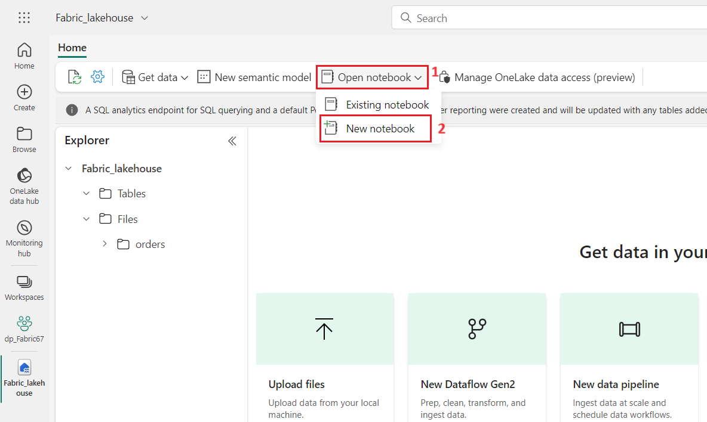
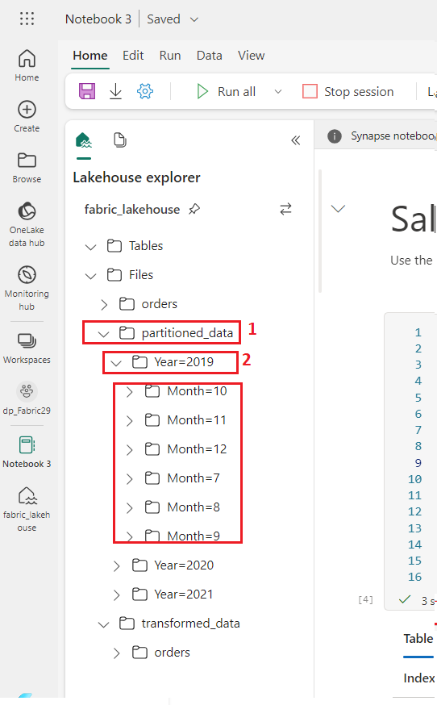
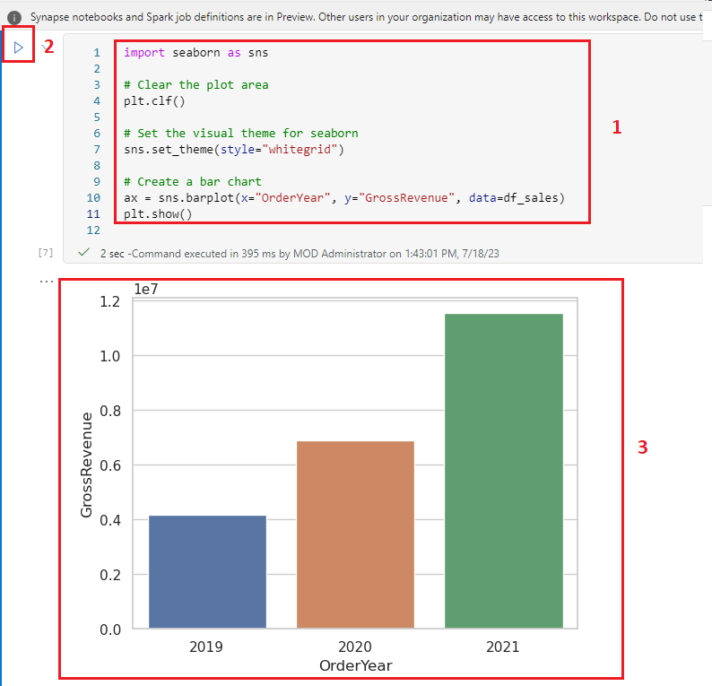
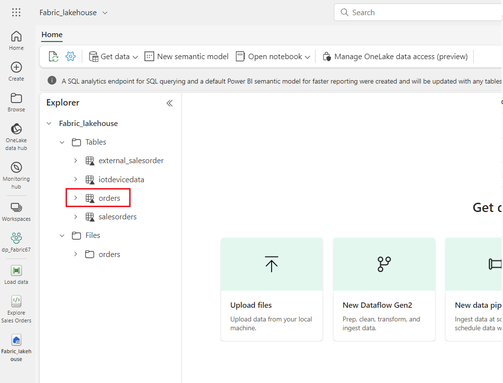

**Einleitung**

Apache Spark ist eine Open-Source-Engine für die verteilte
Datenverarbeitung und wird häufig zum Untersuchen, Verarbeiten und
Analysieren großer Datenmengen im Data Lake-Speicher verwendet. Spark
ist als Verarbeitungsoption in vielen Datenplattformprodukten verfügbar,
darunter Azure HDInsight, Azure Databricks, Azure Synapse Analytics und
Microsoft Fabric. Einer der Vorteile von Spark ist die Unterstützung
einer Vielzahl von Programmiersprachen, darunter Java, Scala, Python und
SQL. Dies macht Spark zu einer sehr flexiblen Lösung für
Datenverarbeitungs-Workloads, einschließlich Datenbereinigung und
-manipulation, statistischer Analyse und maschinellem Lernen sowie
Datenanalyse und -visualisierung.

Tabellen in einem Microsoft Fabric Lakehouse basieren auf dem
Open-Source-Delta Lake-Format für Apache Spark. Delta Lake bietet
Unterstützung für relationale Semantik sowohl für Batch- als auch für
Streamingdatenvorgänge und ermöglicht die Erstellung einer
Lakehouse-Architektur, in der Apache Spark zum Verarbeiten und Abfragen
von Daten in Tabellen verwendet werden kann, die auf zugrunde liegenden
Dateien in einem Data Lake basieren.

In Microsoft Fabric stellen Dataflows (Gen2) eine Verbindung mit
verschiedenen Datenquellen her, und führen Transformationen in Power
Query Online durch. Sie können dann in Datenpipelines verwendet werden,
um Daten in einem Lakehouse oder einem anderen Analysespeicher zu
erfassen oder um ein Dataset für einen Power BI-Bericht zu definieren.

In diesem Lab werden die verschiedenen Elemente von Dataflows (Gen2)
vorgestellt und keine komplexe Lösung erstellt, die in einem Unternehmen
vorhanden sein kann.

**Ziele**:

- Erstellen Sie einen Workspace in Microsoft Fabric mit aktivierter
  Fabric-Testversion.

- Richten Sie eine Lakehouse-Umgebung ein und laden Sie Datendateien zur
  Analyse hoch.

- Generieren Sie ein Notebook für die interaktive Datenexploration und
  -analyse.

- Laden Sie Daten zur weiteren Verarbeitung und Visualisierung in einen
  Datenrahmen.

- Wenden Sie Transformationen mit PySpark auf die Daten an.

- Speichern und partitionieren Sie die transformierten Daten für eine
  optimierte Abfrage.

- Erstellen einer Tabelle im Spark-Metastore für die Verwaltung
  strukturierter Daten

- Speichern Sie DataFrame als verwaltete Delta-Tabelle mit dem Namen
  "salesorders".

- Speichern Sie DataFrame als externe Delta-Tabelle mit dem Namen
  "external_salesorder" mit einem angegebenen Pfad.

- Beschreiben und vergleichen Sie die Eigenschaften von verwalteten und
  externen Tabellen.

- Führen Sie SQL-Abfragen für Tabellen für Analysen und Berichte aus.

- Visualisieren Sie Daten mit Python-Bibliotheken wie matplotlib und
  Seaborn.

- Richten Sie ein Data Lakehouse in der Data Engineering-Erfahrung ein
  und erfassen Sie relevante Daten für die nachfolgende Analyse.

- Definieren Sie einen Datenfluss zum Extrahieren, Transformieren und
  Laden von Daten in das Lakehouse.

- Konfigurieren Sie Datenziele in Power Query, um die transformierten
  Daten im Lakehouse zu speichern.

- Integrieren Sie den Datenfluss in eine Pipeline, um die geplante
  Datenverarbeitung und -erfassung zu ermöglichen.

- Entfernen Sie das Workspace und die zugehörigen Elemente, um die Übung
  abzuschließen.

# Übung 1: Erstellen eines Workspaces, eines Lakehouse oder eines Notebooks und Laden von Daten in den Datenrahmen 

## Aufgabe 1: Erstellen eines Workspaces 

Bevor Sie mit Daten in Fabric arbeiten, erstellen Sie ein Workspace mit
aktivierter Fabric-Testversion.

1.  Öffnen Sie Ihren Browser, navigieren Sie zur Adressleiste, und geben
    Sie die folgende URL ein oder fügen Sie sie ein:
    <https://app.fabric.microsoft.com/> Drücken Sie dann **Enter**.

> **Hinweis**: Wenn Sie zur Microsoft Fabric-Startseite weitergeleitet
> werden, überspringen Sie die Schritte von \#2 bis \#4.
>
> 

2.  Geben Sie im **Microsoft Fabric-Fenster** Ihre Anmeldeinformationen
    ein, und klicken Sie auf die Schaltfläche **Submit**.

> 

3.  Geben Sie dann im **Microsoft-Fenster** das Passwort ein und klicken
    Sie auf die Schaltfläche **Sign In.**

> 

4.  In **Stay signed in?** klicken Sie auf die Schaltfläche **Yes**.

> 

5.  Fabric-Startseite, wählen Sie **+ New Workspace** aus.

> 

6.  Geben Sie auf der Registerkarte **Create a workspace tab** die
    folgenden Details ein und klicken Sie auf die Schaltfläche
    **Apply**.

[TABLE]

> 
>
> 

7.  Warten Sie, bis die Bereitstellung abgeschlossen ist. Es dauert 2-3
    Minuten, bis der Vorgang abgeschlossen ist. Wenn Ihr neuer Workspace
    geöffnet wird, sollte er leer sein.

## Aufgabe 2: Erstellen eines Lakeshouses und Hochladen von Dateien

Nachdem Sie nun über ein Workspace verfügen, ist es an der Zeit, zur
*Data Engineering-Oberfläche* im Portal zu wechseln und ein Data
Lakehouse für die Datendateien zu erstellen, die Sie analysieren
möchten.

1.  Erstellen Sie ein neues Eventhouse, indem Sie in der
    Navigationsleiste auf die Schaltfläche +**New Item** klicken.

2.  Klicken Sie auf die Kachel **Lakehouse**.

3.  Geben Sie im Dialogfeld **New lakehouse**
    +**++Fabric_lakehouse+++** Klicken Sie im Feld **Name** auf die
    Schaltfläche **Create** und öffnen Sie das neue Lakehouse.

4.  Nach etwa einer Minute wird ein neues leeres Lakehouse erstellt. Sie
    müssen einige Daten zur Analyse in das Data Lakehouse aufnehmen.

5.  Sie sehen eine Benachrichtigung mit dem Hinweis **Successfully
    created SQL endpoint**.

6.  Bewegen Sie im **Explorer**-Bereich unter dem **fabric_lakehouse**
    den Mauszeiger neben den **Files folder** und klicken Sie dann auf
    die horizontalen Ellipsen **(...)** Menü. Navigieren Sie und klicken
    Sie auf **Upload**, dann klicken Sie auf den **folder Upload,** wie
    in der Abbildung unten gezeigt.

7.  On the **Upload folder** pane that appears on the right side, select
    the **folder icon** under the **Files/** and then browse to
    **C:\LabFiles** and then select the **orders** folder and click on
    the **Upload** button.

8.  Falls Sie **Upload 3 files to this site?** Dialogfeld erscheint,
    klicken Sie dann auf die Schaltfläche **Upload**.

9.  Klicken Sie im Bereich Ordner hochladen auf die Schaltfläche
    **Upload**.

> 

10. Nachdem die Dateien hochgeladen wurden, **Close** Sie den Bereich
    **Upload folder**.

> 

11. Erweitern Sie **Files**, wählen Sie den Ordner **Orders** aus und
    überprüfen Sie, ob die CSV-Dateien hochgeladen wurden.

## Aufgabe 3: Erstellen eines Notizbuchs

Um mit Daten in Apache Spark zu arbeiten, können Sie ein *Notebook
erstellen*. Notebooks bieten eine interaktive Umgebung, in der Sie Code
(in mehreren Sprachen) schreiben und ausführen und Notizen hinzufügen
können, um ihn zu dokumentieren.

1.  Wählen Sie auf der **Startseite** beim Anzeigen des Inhalts des
    Ordners **orders** in Ihrem Datalake im Menü **Open** Notebook die
    Option **New Notebook** aus.

2.  Nach einigen Sekunden wird ein neues Notebook geöffnet, das eine
    einzelne *Zelle* enthält. Notebooks bestehen aus einer oder mehreren
    Zellen, die *Code* oder *Markdown* (formatierter Text).

3.  Wählen Sie die erste Zelle aus (die derzeit eine *Codezelle ist)*
    und verwenden Sie dann in der dynamischen Symbolleiste oben rechts
    die Schaltfläche **M↓**, um **die Zelle in eine Markdown-Zelle
    umzuwandeln**.

4.  Wenn sich die Zelle in eine Markdown-Zelle ändert, wird der darin
    enthaltene Text gerendert.

5.  Verwenden Sie die **🖉** Schaltfläche (Bearbeiten), um die Zelle in
    den Bearbeitungsmodus zu versetzen, ersetzen Sie den gesamten Text
    und ändern Sie dann das Markdown wie folgt:

> Code Copy
>
> \# Sales order data exploration
>
> Use the code in this notebook to explore sales order data.

6.  Klicken Sie auf eine beliebige Stelle im Notebook außerhalb der
    Zelle, um die Bearbeitung zu beenden und das gerenderte Markdown
    anzuzeigen.

## Aufgabe 4: Laden von Daten in einen Datenrahmen

Jetzt können Sie Code ausführen, der die Daten in einen *Datenrahmen
lädt*. Datenrahmen in Spark ähneln den Pandas-Datenrahmen in Python und
bieten eine gemeinsame Struktur für die Arbeit mit Daten in Zeilen und
Spalten.

**Hinweis**: Spark unterstützt mehrere Programmiersprachen, darunter
Scala, Java und andere. In dieser Übung verwenden wir *PySpark*, eine
Spark-optimierte Variante von Python. PySpark ist eine der am häufigsten
verwendeten Sprachen in Spark und die Standardsprache in
Fabric-Notebooks.

1.  Wenn das Notebooks sichtbar ist, erweitern Sie die Liste **Files**,
    und wählen Sie den Ordner **orders** aus, sodass die CSV-Dateien
    neben dem Notebook-Editor aufgelistet werden.

2.  Wie auch immer, Ihre Maus zu 2019.csv Datei. Klicken Sie auf die
    horizontalen Ellipsen **(...)** neben 2019.csv. Navigieren Sie zu
    und klicken Sie auf **load data**, und wählen Sie dann **Spark**
    aus. Dem Notebook wird eine neue Codezelle mit dem folgenden Code
    hinzugefügt:

> CodeCopy
>
> df =
> spark.read.format("csv").option("header","true").load("Files/orders/2019.csv")
>
> \# df now is a Spark DataFrame containing CSV data from
> "Files/orders/2019.csv".
>
> display(df)

**Tipp**: Sie können die Lakehouse-Explorer-Fenster auf der linken Seite
ausblenden, indem Sie die **Symbole «** verwenden. Tun

So können Sie sich auf das Notebook konzentrieren.

3.  Verwenden Sie die Schaltfläche **▷ Run Cell** auf der linken Seite
    der Zelle, um sie auszuführen.

**Note**: Since this is the first time you’ve run any Spark code, a
Spark session must be started. This means that the first run in the
session can take a minute or so to complete. Subsequent runs will be
quicker.

4.  Wenn der Zellenbefehl abgeschlossen ist, überprüfen Sie die Ausgabe
    unter der Zelle, die in etwa wie folgt aussehen sollte:

5.  Die Ausgabe zeigt die Zeilen und Spalten mit Daten aus der 2019.csv
    Datei an. Beachten Sie jedoch, dass die Spaltenüberschriften nicht
    richtig aussehen. Der Standardcode, der zum Laden der Daten in einen
    Datenrahmen verwendet wird, geht davon aus, dass die CSV-Datei die
    Spaltennamen in der ersten Zeile enthält, aber in diesem Fall
    enthält die CSV-Datei nur die Daten ohne Headerinformationen.

6.  Ändern Sie den Code, um die **Header**-Option auf **false**
    festzulegen. Ersetzen Sie den gesamten Code in der **Cell** durch
    den folgenden Code und klicken Sie auf die Schaltfläche **▷ Run
    Cell** und überprüfen Sie die Ausgabe.

> CodeCopy
>
> df =
> spark.read.format("csv").option("header","false").load("Files/orders/2019.csv")
>
> \# df now is a Spark DataFrame containing CSV data from
> "Files/orders/2019.csv".
>
> display(df)
>
> 

7.  Jetzt enthält der Datenrahmen die erste Zeile korrekt als
    Datenwerte, aber die Spaltennamen werden automatisch generiert und
    sind nicht sehr hilfreich. Um die Daten sinnvoll zu nutzen, müssen
    Sie explizit das richtige Schema und den richtigen Datentyp für die
    Datenwerte in der Datei definieren.

8.  Ersetzen Sie den gesamten Code in der **Cell** durch den folgenden
    Code und klicken Sie auf die Schaltfläche **▷ Run Cell** und
    überprüfen Sie die Ausgabe.

> CodeCopy
>
> from pyspark.sql.types import \*
>
> orderSchema = StructType(\[
>
> StructField("SalesOrderNumber", StringType()),
>
> StructField("SalesOrderLineNumber", IntegerType()),
>
> StructField("OrderDate", DateType()),
>
> StructField("CustomerName", StringType()),
>
> StructField("Email", StringType()),
>
> StructField("Item", StringType()),
>
> StructField("Quantity", IntegerType()),
>
> StructField("UnitPrice", FloatType()),
>
> StructField("Tax", FloatType())
>
> \])
>
> df =
> spark.read.format("csv").schema(orderSchema).load("Files/orders/2019.csv")
>
> display(df)

> 

9.  Jetzt enthält der Datenrahmen die korrekten Spaltennamen (zusätzlich
    zum **Index**, der eine integrierte Spalte in allen Datenrahmen ist,
    die auf der Ordnungsposition jeder Zeile basiert). Die Datentypen
    der Spalten werden mithilfe eines Standardsatzes von Typen
    angegeben, die in der Spark SQL-Bibliothek definiert sind und am
    Anfang der Zelle importiert wurden.

10. Bestätigen Sie, dass Ihre Änderungen auf die Daten angewendet
    wurden, indem Sie den Datenrahmen anzeigen.

11. Verwenden Sie das Symbol **+ Code** unter der Zellenausgabe, um dem
    Notebook eine neue Codezelle hinzuzufügen, und geben Sie den
    folgenden Code ein. Klicken Sie auf die Schaltfläche **▷ Run Cell**
    und überprüfen Sie die Ausgabe.

> CodeCopy
>
> display(df)
>
> 

12. Der Datenrahmen enthält nur die Daten aus der **2019.csv** Datei.
    Ändern Sie den Code so, dass der Dateipfad einen Platzhalter \*
    verwendet, um die Auftragsdaten aus allen Dateien im Ordner
    **orders** zu lesen.

13. Verwenden Sie das Symbol **+ Code** unter der Zellenausgabe, um dem
    Notebook eine neue Codezelle hinzuzufügen, und geben Sie den
    folgenden Code ein.

CodeCopy

> from pyspark.sql.types import \*
>
> orderSchema = StructType(\[
>
>     StructField("SalesOrderNumber", StringType()),
>
>     StructField("SalesOrderLineNumber", IntegerType()),
>
>     StructField("OrderDate", DateType()),
>
>     StructField("CustomerName", StringType()),
>
>     StructField("Email", StringType()),
>
>     StructField("Item", StringType()),
>
>     StructField("Quantity", IntegerType()),
>
>     StructField("UnitPrice", FloatType()),
>
>     StructField("Tax", FloatType())
>
>     \])
>
> df =
> spark.read.format("csv").schema(orderSchema).load("Files/orders/\*.csv")
>
> display(df)

14. Führen Sie die geänderte Codezelle aus, und überprüfen Sie die
    Ausgabe, die jetzt die Verkäufe für 2019, 2020 und 2021 enthalten
    sollte.

**Hinweis**: Es wird nur eine Teilmenge der Zeilen angezeigt, sodass Sie
möglicherweise keine Beispiele aus allen Jahren sehen können.

# Übung 2: Untersuchen von Daten in einem Datenrahmen

Das Dataframe-Objekt enthält eine Vielzahl von Funktionen, mit denen Sie
die darin enthaltenen Daten filtern, gruppieren und anderweitig
bearbeiten können.

## Aufgabe 1: Filtern eines Datenrahmens

1.  Verwenden Sie das Symbol **+ Code** unter der Zellenausgabe, um dem
    Notebook eine neue Codezelle hinzuzufügen, und geben Sie den
    folgenden Code ein.

**CodeCopy**

> customers = df\['CustomerName', 'Email'\]
>
> print(customers.count())
>
> print(customers.distinct().count())
>
> display(customers.distinct())
>
> 

2.  **Führen Sie** die neue Codezelle aus, und überprüfen Sie die
    Ergebnisse. Beachten Sie die folgenden Details:

    - Wenn Sie einen Vorgang für einen Dataframe ausführen, ist das
      Ergebnis ein neuer Dataframe (in diesem Fall wird ein neuer
      **Kunden**-Dataframe erstellt, indem eine bestimmte Teilmenge von
      Spalten aus dem **DF**-Dataframe ausgewählt wird)

    - Dataframes bieten Funktionen wie **count** und **distinct**, die
      zum Zusammenfassen und Filtern der darin enthaltenen Daten
      verwendet werden können.

    - Das dataframe\['Feld1', 'Feld2', ...\] Die Syntax ist eine
      Kurzform zum Definieren einer Teilmenge von Spalten. Sie können
      auch die **select-Methode** verwenden, sodass die erste Zeile des
      obigen Codes wie folgt geschrieben werden kann als customers =
      df.select("CustomerName", "Email")

> 

3.  Ändern Sie den Code, ersetzen Sie den gesamten Code in der **Zelle**
    durch den folgenden Code und klicken Sie auf die Schaltfläche **▷
    Run Cell** wie folgt:

> CodeCopy
>
> customers = df.select("CustomerName",
> "Email").where(df\['Item'\]=='Road-250 Red, 52')
>
> print(customers.count())
>
> print(customers.distinct().count())
>
> display(customers.distinct())

1.  **Führen Sie** den geänderten Code aus, um die Kunden anzuzeigen,
    die das ***Produkt* Road-250 Red, 52** gekauft haben. Beachten Sie,
    dass Sie mehrere Funktionen miteinander Chain können, sodass die
    Ausgabe einer Funktion zur Eingabe für die nächste wird - in diesem
    Fall ist der von der **select**-Methode erstellte Datenrahmen der
    Quelldatenrahmen für die **where**-Methode, die zum Anwenden von
    Filterkriterien verwendet wird.

> 

## Aufgabe 2: Aggregieren und Gruppieren von Daten in einem Datenrahmen

1.  Klicken Sie auf **+ Code**, kopieren Sie den folgenden Code, fügen
    Sie ihn ein und klicken Sie dann auf die Schaltfläche **Run Cell**.

CodeCopy

> productSales = df.select("Item", "Quantity").groupBy("Item").sum()
>
> display(productSales)
>
> 

2.  Beachten Sie, dass die Ergebnisse die Summe der Bestellmengen
    gruppiert nach Produkten anzeigen. Die **groupBy**-Methode
    *gruppiert die Zeilen nach* Item, und die nachfolgende
    **Summenaggregatfunktion** wird auf alle verbleibenden numerischen
    Spalten (in diesem Fall *Quantity*) angewendet.

3.  Klicken Sie auf **+ Code**, kopieren Sie den folgenden Code, fügen
    Sie ihn ein und klicken Sie dann auf die Schaltfläche **Run Cell**.

> **CodeCopy**
>
> from pyspark.sql.functions import \*
>
> yearlySales =
> df.select(year("OrderDate").alias("Year")).groupBy("Year").count().orderBy("Year")
>
> display(yearlySales)

4.  Beachten Sie, dass die Ergebnisse die Anzahl der Kundenaufträge pro
    Jahr anzeigen. Beachten Sie, dass die **select-**Methode eine
    SQL**-year-**Funktion enthält**,** um die year-Komponente des
    *OrderDate-Felds zu extrahieren (weshalb der Code eine*
    **import**-Anweisung zu dem Import von Funktionen aus der Spark
    SQL-Bibliothek enthält). Anschließend wird eine **Alias**-Methode
    verwendet, um dem extrahierten Jahreswert einen Spaltennamen
    zuzuweisen. Die Daten werden dann nach der abgeleiteten *Spalte
    "Year"* gruppiert und die Anzahl der Zeilen in jeder Gruppe wird
    berechnet, bevor schließlich die **orderBy-**Methode verwendet wird,
    um den resultierenden Datenrahmen zu sortieren.

# Übung 3: Verwenden von Spark zum Transformieren von Datendateien

Eine häufige Aufgabe für Data Engineers besteht darin, Daten in einem
bestimmten Format oder einer bestimmten Struktur aufzunehmen und sie für
die weitere nachgelagerte Verarbeitung oder Analyse zu transformieren.

## Aufgabe 1: Verwenden von Datenrahmenmethoden und -funktionen zum Transformieren von Daten

1.  Klicken Sie auf **+** Code und kopieren Sie den folgenden Code und
    fügen Sie ihn ein.

**CodeCopy**

> from pyspark.sql.functions import \*
>
> \## Create Year and Month columns
>
> transformed_df = df.withColumn("Year",
> year(col("OrderDate"))).withColumn("Month", month(col("OrderDate")))
>
> \# Create the new FirstName and LastName fields
>
> transformed_df = transformed_df.withColumn("FirstName",
> split(col("CustomerName"), " ").getItem(0)).withColumn("LastName",
> split(col("CustomerName"), " ").getItem(1))
>
> \# Filter and reorder columns
>
> transformed_df = transformed_df\["SalesOrderNumber",
> "SalesOrderLineNumber", "OrderDate", "Year", "Month", "FirstName",
> "LastName", "Email", "Item", "Quantity", "UnitPrice", "Tax"\]
>
> \# Display the first five orders
>
> display(transformed_df.limit(5))

2.  **Führen Sie** den Code aus, um einen neuen Datenrahmen aus den
    ursprünglichen Bestelldaten mit den folgenden Transformationen zu
    erstellen:

    - Hinzufügen von **Year-**und **Month Spalten** basierend auf der
      Spalte **OrderDate**.

    - Hinzufügen von **FirstName** und **LastName** Spalten, die auf der
      Spalte **CustomerName** basieren.

    - Filtern und ordnen Sie die Spalten neu an, und entfernen Sie die
      Spalte **CustomerName.**

3.  Überprüfen Sie die Ausgabe, und stellen Sie sicher, dass die
    Transformationen an den Daten vorgenommen wurden.

Sie können die volle Leistung der Spark SQL-Bibliothek nutzen, um die
Daten zu transformieren, indem Sie Zeilen filtern, Spalten ableiten,
entfernen, umbenennen und alle anderen erforderlichen Datenänderungen
anwenden.

**Tipp**: Weitere Informationen zu den Methoden des Dataframe-Objekts
[*finden Sie in
der*](https://spark.apache.org/docs/latest/api/python/reference/pyspark.sql/dataframe.html)
Dokumentation zu Spark-Datenrahmen.

## Aufgabe 2: Speichern der transformierten Daten

1.  **Add a new Cell** mit dem folgenden Code hinzu, um den
    transformierten Datenrahmen im Parquet-Format zu speichern
    (Überschreiben der Daten, falls sie bereits vorhanden sind). **Run**
    die Zelle aus und warten Sie auf die Meldung, dass die Daten
    gespeichert wurden.

> CodeCopy
>
> transformed_df.write.mode("overwrite").parquet('Files/transformed_data/orders')
>
> print ("Transformed data saved!")
>
> **Hinweis**: In der Regel wird das *Parquet-Format* für Datendateien
> bevorzugt, die Sie für die weitere Analyse oder die Aufnahme in einen
> Analysespeicher verwenden. Parkett ist ein sehr effizientes Format,
> das von den meisten großen Datenanalysesystemen unterstützt wird.
> Manchmal besteht die Anforderung an die Datentransformation sogar
> darin, Daten aus einem anderen Format (z. B. CSV) in Parquet zu
> konvertieren!

2.  Dann, im **Lakehouse-Explorer-**Bereich auf der linken Seite, in der
    **...** für den Knoten **Files**, wählen Sie **Refresh** aus.

> 

3.  Klicken Sie auf den Ordner **transformed_data**, um zu überprüfen,
    ob er einen neuen Ordner mit dem Namen **orders** enthält, der
    wiederum einen oder mehrere **Parquet files**.

4.  Klicken Sie auf **+ Code** für den folgenden Code, um einen neuen
    Datenrahmen aus den Parquet-Dateien im Ordner **transformed_data**
    -\> **orders** zu laden:

> **CodeCopy**
>
> orders_df =
> spark.read.format("parquet").load("Files/transformed_data/orders")
>
> display(orders_df)
>
> 

5.  **Run** die Zelle, und stellen Sie sicher, dass die Ergebnisse die
    Bestelldaten anzeigen, die aus den Parquet-Dateien geladen wurden.

> 

## Aufgabe 3: Speichern von Daten in partitionierten Dateien

1.  Fügen Sie eine neue Zelle hinzu, klicken Sie auf **+ Code** mit dem
    folgenden Code, der den Datenrahmen speichert und die Daten nach
    **Year** und **Month** partitioniert. **Führen Sie** die Zelle und
    warten Sie auf die Meldung, dass die Daten gespeichert wurden.

> CodeCopy
>
> orders_df.write.partitionBy("Year","Month").mode("overwrite").parquet("Files/partitioned_data")
>
> print ("Transformed data saved!")
>
> 
>
> 

2.  Dann, im **Lakehouse-Explorer-**Bereich auf der linken Seite, in der
    **...** für den Knoten **Files**, wählen Sie **Refresh** aus**.**

3.  Erweitern Sie den Ordner **partitioned_orders**, um sicherzustellen,
    dass er eine Hierarchie von Ordnern mit dem Namen **Year=xxxx**
    enthält, die jeweils Ordner mit dem Namen **Month=xxxx** enthalten.
    Jeder Monatsordner enthält eine Parkettdatei mit den Bestellungen
    für den jeweiligen Monat.

> Das Partitionieren von Datendateien ist eine gängige Methode zur
> Optimierung der Leistung beim Umgang mit großen Datenmengen. Diese
> Technik kann die Leistung erheblich verbessern und das Filtern von
> Daten erleichtern.

4.  Fügen Sie eine neue Zelle hinzu, klicken Sie auf **+ Code** mit dem
    folgenden Code, um einen neuen Datenrahmen aus der Datei
    **orders.parquet** zu laden:

> CodeCopy
>
> orders_2021_df =
> spark.read.format("parquet").load("Files/partitioned_data/Year=2021/Month=\*")
>
> display(orders_2021_df)

**Führen Sie** die Zelle, und stellen Sie
sicher, dass die Ergebnisse die Bestelldaten für den Umsatz im Jahr 2021
anzeigen. Beachten Sie, dass die im Pfad angegebenen
Partitionierungsspalten (**Year** und **Month**) nicht im Datenrahmen
enthalten sind.

# **Übung 3: Arbeiten mit Tabellen und SQL**

Wie Sie gesehen haben, können Sie mit den systemeigenen Methoden des
dataframe-Objekts Daten aus einer Datei recht effektiv abfragen und
analysieren. Viele Datenanalysten arbeiten jedoch besser mit Tabellen,
die sie mithilfe der SQL-Syntax abfragen können. Spark stellt einen
*Metastore bereit*, in dem Sie relationale Tabellen definieren können.
Die Spark SQL-Bibliothek, die das Dataframe-Objekt bereitstellt,
unterstützt auch die Verwendung von SQL-Anweisungen zum Abfragen von
Tabellen im Metastore. Durch die Nutzung dieser Funktionen von Spark
können Sie die Flexibilität eines Data Lake mit dem strukturierten
Datenschema und den SQL-basierten Abfragen eines relationalen Data
Warehouse kombinieren – daher der Begriff "Data Lakehouse".

## Aufgabe 1: Erstellen einer verwalteten Tabelle

Tabellen in einem Spark-Metastore sind relationale Abstraktionen über
Dateien im Data Lake. Tabellen können *verwaltet* werden (in diesem Fall
werden die Dateien vom Metastore verwaltet) oder *extern* (in diesem
Fall verweist die Tabelle auf einen Dateispeicherort im Data Lake, den
Sie unabhängig vom Metastore verwalten).

1.  Fügen Sie einen neuen Code hinzu, klicken Sie auf **+ Code cell**
    zum Notebook und geben Sie den folgenden Code ein, der den
    Datenrahmen der Kundenauftragsdaten als Tabelle mit dem Namen
    **salesorders** speichert:

> CodeCopy
>
> \# Create a new table
>
> df.write.format("delta").saveAsTable("salesorders")
>
> \# Get the table description
>
> spark.sql("DESCRIBE EXTENDED salesorders").show(truncate=False)

**Hinweis**: Es lohnt sich, einige Dinge zu diesem Beispiel zu beachten.
Erstens wird kein expliziter Pfad angegeben, so dass die Dateien für die
Tabelle vom Metastore verwaltet werden. Zweitens wird die Tabelle im
Delta-Format gespeichert. Sie können Tabellen basierend auf mehreren
Dateiformaten (einschließlich CSV, Parquet, Avro und anderen) erstellen,
aber *Delta Lake* ist eine Spark-Technologie, die Tabellen relationale
Datenbankfunktionen hinzufügt, einschließlich Unterstützung für
Transaktionen, Zeilenversionierung und andere nützliche Features. Das
Erstellen von Tabellen im Delta-Format wird für Data Lakehouses in
Fabric bevorzugt.

2.  **Führen Sie** die Codezelle aus, und überprüfen Sie die Ausgabe, in
    der die Definition der neuen Tabelle beschrieben wird.

3.  Klicken Sie im **Explorer-Bereich "Lakehouse**" in der ... für den
    Ordner **Tables** die Option **Refresh.**

4.  Erweitern Sie dann den Knoten **Tables**, und überprüfen Sie, ob die
    Tabelle **Salesorders** erstellt wurde.

> 

5.  Bewegen Sie den Mauszeiger neben die Tabelle **salesorders** und
    klicken Sie dann auf die horizontalen Auslassungspunkte (...).
    Navigieren Sie zu und klicken Sie auf **load data**, und wählen Sie
    dann **Spark** aus.

6.  Klicken Sie auf die Schaltfläche **▷ Run Cell**, die die Spark
    SQL-Bibliothek verwendet, um eine SQL-Abfrage gegen die
    **salesorder-**Tabelle in PySpark-Code einzubetten und die
    Ergebnisse der Abfrage in einen Datenrahmen zu laden.

> CodeCopy
>
> df = spark.sql("SELECT \* FROM \[your_lakehouse\].salesorders LIMIT
> 1000")
>
> display(df)

## Aufgabe 2: Erstellen einer externen Tabelle

Sie können auch *externe* Tabellen erstellen, für die die
Schemametadaten im Metastore für das Lakehouse definiert sind, die
Datendateien jedoch an einem externen Speicherort gespeichert sind.

1.  Verwenden Sie unter den Ergebnissen, die von der ersten Codezelle
    zurückgegeben werden, die Schaltfläche **+ Code,** um eine neue
    Codezelle hinzuzufügen, falls noch keine vorhanden ist. Geben Sie
    dann den folgenden Code in die neue Zelle ein.

CodeCopy

> df.write.format("delta").saveAsTable("external_salesorder",
> path="\<abfs_path\>/external_salesorder")

2.  Klicken Sie im **Explorer-Bereich "Lakehouse**" in der ... Menü für
    den Ordner **Files** die Option **Copy ABFS-Path** im Editor.

> Der ABFS-Pfad ist der vollqualifizierte Pfad zum Ordner **Files** im
> OneLake-Speicher für Ihr Lakehouse – ähnlich wie dieser:

abfss://dp_Fabric29@onelake.dfs.fabric.microsoft.com/Fabric_lakehouse.Lakehouse/Files/external_salesorder

3.  Wechseln Sie nun in die Codezelle, und ersetzen Sie
    **\<abfs_path\>** durch den **Path,** den Sie in den Editor kopiert
    haben, sodass der Code den Datenrahmen als externe Tabelle mit
    Datendateien in einem Ordner mit dem Namen **external_salesorder**
    am Speicherort des Ordners **Files** speichert. Der vollständige
    Pfad sollte in etwa wie folgt aussehen.

abfss://dp_Fabric29@onelake.dfs.fabric.microsoft.com/Fabric_lakehouse.Lakehouse/Files/external_salesorder

4.  Verwenden Sie die Taste **▷ (*Run Cell*)** auf der linken Seite der
    Zelle, um sie auszuführen.

5.  Klicken Sie im **Explorer-Bereich "Lakehouse**" in der ... für den
    Ordner **Tables** die Option **Refresh** aus.

6.  Erweitern Sie dann den Knoten **Tables,** und überprüfen Sie, ob die
    **external_salesorder** Tabelle erstellt wurde.

7.  Klicken Sie im **Explorer-Bereich "Lakehouse**" in der ... für den
    Ordner **Files** die Option **Refresh.**

8.  Erweitern Sie dann den Knoten **Files**, und stellen Sie sicher,
    dass der Ordner **external_salesorder** für die Datendateien der
    Tabelle erstellt wurde.

## Aufgabe 3: Vergleichen von verwalteten und externen Tabellen

Sehen wir uns die Unterschiede zwischen verwalteten und externen
Tabellen an.

1.  Verwenden Sie unter den von der Codezelle zurückgegebenen
    Ergebnissen die Schaltfläche **+ Code,** um eine neue Codezelle
    hinzuzufügen. Kopieren Sie den folgenden Code in die Zelle Code und
    verwenden Sie die Schaltfläche **▷ (*Run Cell*)** auf der linken
    Seite der Zelle, um ihn auszuführen.

> SqlCopy
>
> %%sql
>
> DESCRIBE FORMATTED salesorders;

2.  Zeigen Sie in den Ergebnissen die **Location-**Eigenschaft für die
    Tabelle an, bei der es sich um einen Pfad zum OneLake-Speicher für
    das Lakehouse handeln sollte, der mit **/Tables/salesorders** endet
    (möglicherweise müssen Sie die Spalte **Data Type** erweitern, um
    den vollständigen Pfad anzuzeigen).

3.  Ändern Sie den **DESCRIBE-**Befehl, um die Details der
    **external_saleorder** Tabelle anzuzeigen, wie hier gezeigt.

4.  Verwenden Sie unter den von der Codezelle zurückgegebenen
    Ergebnissen die Schaltfläche **+ Code,** um eine neue Codezelle
    hinzuzufügen. Kopieren Sie den folgenden Code und verwenden Sie die
    Schaltfläche **▷ (*Run Cell*)** auf der linken Seite der Zelle, um
    ihn auszuführen.

> SqlCopy
>
> %%sql
>
> DESCRIBE FORMATTED external_salesorder;

5.  Zeigen Sie in den Ergebnissen die **Location-**Eigenschaft für die
    Tabelle an, bei der es sich um einen Pfad zum OneLake-Speicher für
    das Lakehouse handeln sollte, das mit **/Files/external_saleorder**
    endet (möglicherweise müssen Sie die Spalte **Data Type** erweitern,
    um den vollständigen Pfad anzuzeigen).

## Aufgabe 4: Ausführen von SQL-Code in einer Zelle

Es ist zwar nützlich, SQL-Anweisungen in eine Zelle mit PySpark-Code
einbetten zu können, aber Datenanalysten möchten oft einfach nur direkt
in SQL arbeiten.

1.  Klicken Sie auf **+ Code**-Zelle zum Notizbuch und geben Sie den
    folgenden Code ein. Klicken Sie auf die Schaltfläche **▷ Run Cell**
    und überprüfen Sie die Ergebnisse. Beachten Sie, dass:

    - Die %%sql-Zeile am Anfang der Zelle (als *Magie bezeichnet*) gibt
      an, dass die Spark SQL-Sprachlaufzeit anstelle von PySpark zum
      Ausführen des Codes in dieser Zelle verwendet werden soll.

    - Der SQL-Code verweist auf die Tabelle **salesorders**, die Sie
      zuvor erstellt haben.

    - Die Ausgabe der SQL-Abfrage wird automatisch als Ergebnis unter
      der Zelle angezeigt.

> SqlCopy
>
> %%sql
>
> SELECT YEAR(OrderDate) AS OrderYear,
>
> SUM((UnitPrice \* Quantity) + Tax) AS GrossRevenue
>
> FROM salesorders
>
> GROUP BY YEAR(OrderDate)
>
> ORDER BY OrderYear;

**Hinweis**: Weitere Informationen zu Spark SQL und Datenrahmen finden
Sie in der [*Spark
SQL-Dokumentation*](https://spark.apache.org/docs/2.2.0/sql-programming-guide.html).

# Übung 4: Visualisieren von Daten mit Spark

Ein Bild sagt sprichwörtlich mehr als tausend Worte, und ein Diagramm
ist oft besser als tausend Zeilen Daten. Notebooks in Fabric enthalten
zwar eine integrierte Diagrammansicht für Daten, die aus einem
Datenrahmen oder einer Spark SQL-Abfrage angezeigt werden, sie ist
jedoch nicht für die umfassende Diagrammerstellung konzipiert. Sie
können jedoch Python-Grafikbibliotheken wie **matplotlib** und
**Seaborn** verwenden, um Diagramme aus Daten in Datenrahmen zu
erstellen.

## Aufgabe 1: Anzeigen von Ergebnissen als Diagramm

1.  Klicken Sie auf **+** **Code**-Zelle zum Notizbuch und geben Sie den
    folgenden Code ein. Klicken Sie auf die Schaltfläche **▷ Run Cell**
    und beachten Sie, dass die Daten aus der zuvor erstellten Ansicht
    **salesorders** zurückgegeben werden.

> SqlCopy
>
> %%sql
>
> SELECT \* FROM salesorders

2.  Ändern Sie im Ergebnisbereich unter der Zelle die Option **View**
    von **Tables** in **Chart**.

3.  Verwenden Sie die Schaltfläche **View option** oben rechts im
    Diagramm, um den Optionsbereich für das Diagramm anzuzeigen. Legen
    Sie dann die Optionen wie folgt fest und wählen Sie **Apply**:

    - **Chart type**: Bar chart

    - **Key**: Item

    - **Values**: Quantity

    - **Series Group**: *leave blank*

    - **Aggregation**: Sum

    - **Stacked**: *Unselected*

4.  Stellen Sie sicher, dass das Diagramm in etwa wie folgt aussieht.

## Aufgabe 2: Erste Schritte mit matplotlib

1.  Klicken Sie auf **+ Code** und kopieren Sie den folgenden Code und
    fügen Sie ihn ein. **Führen Sie** den Code aus, und beachten Sie,
    dass ein Spark-Datenrahmen zurückgegeben wird, der den jährlichen
    Umsatz enthält.

> CodeCopy
>
> sqlQuery = "SELECT CAST(YEAR(OrderDate) AS CHAR(4)) AS OrderYear, \\
>
> SUM((UnitPrice \* Quantity) + Tax) AS GrossRevenue \\
>
> FROM salesorders \\
>
> GROUP BY CAST(YEAR(OrderDate) AS CHAR(4)) \\
>
> ORDER BY OrderYear"
>
> df_spark = spark.sql(sqlQuery)
>
> df_spark.show()

2.  Um die Daten als Diagramm zu visualisieren, verwenden wir zunächst
    die Python-Bibliothek **matplotlib**. Diese Bibliothek ist die
    zentrale Plotbibliothek, auf der viele andere basieren, und bietet
    ein hohes Maß an Flexibilität bei der Erstellung von Diagrammen.

3.  Klicken Sie auf **+ Code** und kopieren Sie den folgenden Code und
    fügen Sie ihn ein.

**CodeCopy**

> from matplotlib import pyplot as plt
>
> \# matplotlib requires a Pandas dataframe, not a Spark one
>
> df_sales = df_spark.toPandas()
>
> \# Create a bar plot of revenue by year
>
> plt.bar(x=df_sales\['OrderYear'\], height=df_sales\['GrossRevenue'\])
>
> \# Display the plot
>
> plt.show()

5.  Klicken Sie auf die Schaltfläche **Run Cell** und überprüfen Sie die
    Ergebnisse, die aus einem Säulendiagramm mit dem gesamten
    Bruttoumsatz für jedes Jahr bestehen. Beachten Sie die folgenden
    Funktionen des Codes, der zum Erstellen dieses Diagramms verwendet
    wird:

    - Für die **matplotlib-Bibliothek ist ein** *Pandas-Datenrahmen
      erforderlich, daher müssen Sie den* von *der Spark-SQL-Abfrage
      zurückgegebenen Spark-Datenrahmen in dieses Format konvertieren.*

    - Das Herzstück der **matplotlib-**Bibliothek ist das
      **pyplot**-Objekt. Dies ist die Grundlage für die meisten
      Plotfunktionen.

    - Die Standardeinstellungen führen zu einem brauchbaren Diagramm,
      aber es gibt einen erheblichen Spielraum, um es anzupassen.

6.  Ändern Sie den Code, um das Diagramm wie folgt darzustellen,
    ersetzen Sie den gesamten Code in der **Cell** durch den folgenden
    Code und klicken Sie auf die Schaltfläche **▷ Run Cell** und
    überprüfen Sie die Ausgabe.

> CodeCopy
>
> from matplotlib import pyplot as plt
>
> \# Clear the plot area
>
> plt.clf()
>
> \# Create a bar plot of revenue by year
>
> plt.bar(x=df_sales\['OrderYear'\], height=df_sales\['GrossRevenue'\],
> color='orange')
>
> \# Customize the chart
>
> plt.title('Revenue by Year')
>
> plt.xlabel('Year')
>
> plt.ylabel('Revenue')
>
> plt.grid(color='#95a5a6', linestyle='--', linewidth=2, axis='y',
> alpha=0.7)
>
> plt.xticks(rotation=45)
>
> \# Show the figure
>
> plt.show()

7.  Das Diagramm enthält jetzt etwas mehr Informationen. Ein Plot ist
    technisch gesehen mit einer **Figure** enthalten. In den vorherigen
    Beispielen wurde die Figur implizit für Sie erstellt. Sie können es
    jedoch explizit erstellen.

8.  Ändern Sie den Code, um das Diagramm wie folgt darzustellen, und
    ersetzen Sie den gesamten Code in der **Cell** durch den folgenden
    Code.

> CodeCopy
>
> from matplotlib import pyplot as plt
>
> \# Clear the plot area
>
> plt.clf()
>
> \# Create a Figure
>
> fig = plt.figure(figsize=(8,3))
>
> \# Create a bar plot of revenue by year
>
> plt.bar(x=df_sales\['OrderYear'\], height=df_sales\['GrossRevenue'\],
> color='orange')
>
> \# Customize the chart
>
> plt.title('Revenue by Year')
>
> plt.xlabel('Year')
>
> plt.ylabel('Revenue')
>
> plt.grid(color='#95a5a6', linestyle='--', linewidth=2, axis='y',
> alpha=0.7)
>
> plt.xticks(rotation=45)
>
> \# Show the figure
>
> plt.show()

9.  **Führen Sie** die Codezelle erneut aus, und zeigen Sie die
    Ergebnisse an. Die Abbildung bestimmt die Form und Größe des
    Diagramms.

> Ein Abzug kann mehrere Teildiagramme enthalten, die sich jeweils auf
> einer eigenen *Achse befinden*.

10. Ändern Sie den Code, um das Diagramm wie folgt darzustellen.
    **Führen Sie** die Codezelle erneut aus, und zeigen Sie die
    Ergebnisse an. Die Abbildung enthält die im Code angegebenen
    Teildiagramme.

> CodeCopy
>
> from matplotlib import pyplot as plt
>
> \# Clear the plot area
>
> plt.clf()
>
> \# Create a figure for 2 subplots (1 row, 2 columns)
>
> fig, ax = plt.subplots(1, 2, figsize = (10,4))
>
> \# Create a bar plot of revenue by year on the first axis
>
> ax\[0\].bar(x=df_sales\['OrderYear'\],
> height=df_sales\['GrossRevenue'\], color='orange')
>
> ax\[0\].set_title('Revenue by Year')
>
> \# Create a pie chart of yearly order counts on the second axis
>
> yearly_counts = df_sales\['OrderYear'\].value_counts()
>
> ax\[1\].pie(yearly_counts)
>
> ax\[1\].set_title('Orders per Year')
>
> ax\[1\].legend(yearly_counts.keys().tolist())
>
> \# Add a title to the Figure
>
> fig.suptitle('Sales Data')
>
> \# Show the figure
>
> plt.show()

**Hinweis**: Weitere Informationen zum Plotten mit matplotlib finden Sie
in der [*matplotlib documentation*](https://matplotlib.org/).

## Aufgabe 3: Verwenden Sie die Seaborn-Bibliothek

Mit **matplotlib** können Sie zwar komplexe Diagramme mehrerer Typen
erstellen, aber es kann etwas komplexer Code erforderlich sein, um die
besten Ergebnisse zu erzielen. Aus diesem Grund wurden im Laufe der
Jahre viele neue Bibliotheken auf der Basis von matplotlib erstellt, um
seine Komplexität zu abstrahieren und seine Fähigkeiten zu verbessern.
Eine dieser Bibliotheken ist **Seaborn.**

1.  Klicken Sie auf **+ Code** und kopieren Sie den folgenden Code und
    fügen Sie ihn ein.

CodeCopy

> import seaborn as sns
>
> \# Clear the plot area
>
> plt.clf()
>
> \# Create a bar chart
>
> ax = sns.barplot(x="OrderYear", y="GrossRevenue", data=df_sales)
>
> plt.show()

2.  **Führen Sie** den Code aus, und beachten Sie, dass ein
    Balkendiagramm mithilfe der Seaborn-Bibliothek angezeigt wird.

3.  **Ändern Sie** den Code wie folgt. **Führen Sie** den geänderten
    Code aus, und beachten Sie, dass Sie mit Seaborn ein konsistentes
    Farbschema für Ihre Diagramme festlegen können.

> CodeCopy
>
> import seaborn as sns
>
> \# Clear the plot area
>
> plt.clf()
>
> \# Set the visual theme for seaborn
>
> sns.set_theme(style="whitegrid")
>
> \# Create a bar chart
>
> ax = sns.barplot(x="OrderYear", y="GrossRevenue", data=df_sales)
>
> plt.show()
>
> 

4.  **Ändern Sie** den Code erneut wie folgt. **Führen Sie** den
    geänderten Code aus, um den Jahresumsatz als Liniendiagramm
    anzuzeigen.

> CodeCopy
>
> import seaborn as sns
>
> \# Clear the plot area
>
> plt.clf()
>
> \# Create a bar chart
>
> ax = sns.lineplot(x="OrderYear", y="GrossRevenue", data=df_sales)
>
> plt.show()

**Hinweis**: Weitere Informationen zum Plotten mit Seaborn finden Sie in
der [*seaborn documentation*](https://seaborn.pydata.org/index.html).

## Aufgabe 4: Verwenden von Deltatabellen für das Streamen von Daten

Delta Lake unterstützt das Streamen von Daten. Delta-Tabellen können
eine *Sink* oder eine *Source* für Datenströme sein, die mit der Spark
Structured Streaming API erstellt wurden. In diesem Beispiel verwenden
Sie eine Delta-Tabelle als Senke für einige Streamingdaten in einem
simulierten IoT-Szenario (IoT).

1.  Klicken Sie auf **+ Code**, kopieren Sie den folgenden Code, fügen
    Sie ihn ein und klicken Sie dann auf die Schaltfläche **Run Cell**.

CodeCopy

> from notebookutils import mssparkutils
>
> from pyspark.sql.types import \*
>
> from pyspark.sql.functions import \*
>
> \# Create a folder
>
> inputPath = 'Files/data/'
>
> mssparkutils.fs.mkdirs(inputPath)
>
> \# Create a stream that reads data from the folder, using a JSON
> schema
>
> jsonSchema = StructType(\[
>
> StructField("device", StringType(), False),
>
> StructField("status", StringType(), False)
>
> \])
>
> iotstream =
> spark.readStream.schema(jsonSchema).option("maxFilesPerTrigger",
> 1).json(inputPath)
>
> \# Write some event data to the folder
>
> device_data = '''{"device":"Dev1","status":"ok"}
>
> {"device":"Dev1","status":"ok"}
>
> {"device":"Dev1","status":"ok"}
>
> {"device":"Dev2","status":"error"}
>
> {"device":"Dev1","status":"ok"}
>
> {"device":"Dev1","status":"error"}
>
> {"device":"Dev2","status":"ok"}
>
> {"device":"Dev2","status":"error"}
>
> {"device":"Dev1","status":"ok"}'''
>
> mssparkutils.fs.put(inputPath + "data.txt", device_data, True)
>
> print("Source stream created...")

2.  Stellen Sie sicher, dass der ***Source stream created...*** gedruckt
    wird. Der Code, den Sie gerade ausgeführt haben, hat eine
    Streamingdatenquelle erstellt, die auf einem Ordner basiert, in dem
    einige Daten gespeichert wurden, die Messwerte von hypothetischen
    IoT-Geräten darstellen.

3.  Klicken Sie auf **+ Code**, kopieren Sie den folgenden Code, fügen
    Sie ihn ein und klicken Sie dann auf die Schaltfläche **Run Cell**.

CodeCopy

> \# Write the stream to a delta table
>
> delta_stream_table_path = 'Tables/iotdevicedata'
>
> checkpointpath = 'Files/delta/checkpoint'
>
> deltastream =
> iotstream.writeStream.format("delta").option("checkpointLocation",
> checkpointpath).start(delta_stream_table_path)
>
> print("Streaming to delta sink...")

4.  Dieser Code schreibt die Streaminggerätedaten im Deltaformat in
    einen Ordner mit dem Namen **iotdevicedata**. Da sich der Pfad für
    den Ordnerspeicherort im Ordner **Tables** befindet, wird
    automatisch eine Tabelle dafür erstellt. Klicken Sie auf die
    horizontalen Ellipsen neben der Tabelle und dann auf **Refresh**.

5.  Klicken Sie auf **+ Code**, kopieren Sie den folgenden Code, fügen
    Sie ihn ein und klicken Sie dann auf die Schaltfläche **Run Cell**.

> SqlCopy
>
> %%sql
>
> SELECT \* FROM IotDeviceData;

6.  Dieser Code fragt die **IotDeviceData-Tabelle** ab, die die
    Gerätedaten aus der Streamingquelle enthält.

7.  Klicken Sie auf **+ Code**, kopieren Sie den folgenden Code, fügen
    Sie ihn ein und klicken Sie dann auf die Schaltfläche **Run Cell**.

> CodeCopy
>
> \# Add more data to the source stream
>
> more_data = '''{"device":"Dev1","status":"ok"}
>
> {"device":"Dev1","status":"ok"}
>
> {"device":"Dev1","status":"ok"}
>
> {"device":"Dev1","status":"ok"}
>
> {"device":"Dev1","status":"error"}
>
> {"device":"Dev2","status":"error"}
>
> {"device":"Dev1","status":"ok"}'''
>
> mssparkutils.fs.put(inputPath + "more-data.txt", more_data, True)

8.  Dieser Code schreibt mehr hypothetische Gerätedaten in die
    Streamingquelle.

9.  Klicken Sie auf **+ Code**, kopieren Sie den folgenden Code, fügen
    Sie ihn ein und klicken Sie dann auf die Schaltfläche **Run Cell**.

> SqlCopy
>
> %%sql
>
> SELECT \* FROM IotDeviceData;
>
> 

10. Dieser Code fragt die **IotDeviceData-**Tabelle erneut ab, die jetzt
    die zusätzlichen Daten enthalten sollte, die der Streamingquelle
    hinzugefügt wurden.

11. Klicken Sie auf **+ Code**, kopieren Sie den folgenden Code, fügen
    Sie ihn ein und klicken Sie dann auf die Schaltfläche **Run Cell**.

> CodeCopy
>
> deltastream.stop()

12. Dieser Code stoppt den Stream.

## Aufgabe 5: Speichern des Notebooks und Beenden der Spark-Sitzung

Nachdem Sie die Arbeit mit den Daten abgeschlossen haben, können Sie das
Notebook unter einem aussagekräftigen Namen speichern und die
Spark-Sitzung beenden.

1.  Verwenden Sie in der Notebook-Menüleiste das ⚙️**Settings,** um die
    Notebook-Einstellungen anzuzeigen.

2.  Legen Sie den **Namen** des Notizbuchs auf ++**Explore Sales
    Orders++**, und schließen Sie dann den Einstellungsbereich.

3.  Wählen Sie im Notebookmenü die Option **Stop session** aus, um die
    Spark-Sitzung zu beenden.

# Übung 5: Erstellen eines Dataflows (Gen2) in Microsoft Fabric

In Microsoft Fabric stellen Dataflows (Gen2) eine Verbindung mit
verschiedenen Datenquellen her, und führen Transformationen in Power
Query Online durch. Sie können dann in Datenpipelines verwendet werden,
um Daten in einem Lakehouse oder einem anderen Analysespeicher zu
erfassen oder um ein Dataset für einen Power BI-Bericht zu definieren.

Diese Übung dient dazu, die verschiedenen Elemente von Dataflows (Gen2)
einzuführen und keine komplexe Lösung zu erstellen, die in einem
Unternehmen vorhanden sein kann

## Aufgabe 1: Erstellen eines Dataflows (Gen2) zum Erfassen von Daten

Jetzt, da Sie über ein Lakehouse verfügen, müssen Sie einige Daten darin
erfassen. Eine Möglichkeit, dies zu tun, besteht darin, einen Datenfluss
zu definieren, der einen *ETL-Prozess (Extract*, Transform, and Load)
kapselt.

1.  Klicken Sie nun im linken Navigationsbereich auf
    **Fabric_lakehouse**.

2.  Klicken Sie auf der **Startseite** von Fabric_lakehouse auf den
    Dropdown-Pfeil unter **Get Data**, und wählen Sie **New Dataflow
    Gen2** aus**.** Der Power Query-Editor für Ihren neuen Dataflow wird
    geöffnet.

3.  Klicken Sie im Bereich **Power Query** auf der Registerkarte
    **Start** auf **Import from a Text/CSV file**.

4.  Wählen Sie im Bereich **Connect to data source** unter **Connection
    settings** die Option **Link to file (Preview).**

- **Link to file**: *Ausgewählt*

- **File path or
  URL**: <https://raw.githubusercontent.com/MicrosoftLearning/dp-data/main/orders.csv>

5.  Geben Sie im Bereich **Connect to data source** unter **Connection
    Credentials** die folgenden Details ein, und klicken Sie auf die
    Schaltfläche **Next**.

    - **Connection**: Create new connection

    - **data gateway**: (none)

    - **Authentication kind**: Organizational account

6.  Klicken Sie im **Preview file data** auf **Create,** um die
    Datenquelle zu erstellen. 

7.  Der **Power Query-Editor** zeigt die Datenquelle und einen ersten
    Satz von Abfrageschritten zum Formatieren der Daten an.

8.  Wählen Sie im Menüband der Symbolleiste die Registerkarte **Add
    Column** aus. Wählen Sie dann **Custom Column** aus**.**

 

9.  Legen Sie den neuen Spaltennamen auf **MonthNo** fest, legen Sie den
    Datentyp auf **Whole Number** fest, und fügen Sie dann die folgende
    Formel hinzu: **Date.Month(\[OrderDate\])** unter **Custom column
    formula**. Wählen Sie **OK**.

10. Beachten Sie, wie der Schritt zum Hinzufügen der benutzerdefinierten
    Spalte der Abfrage hinzugefügt wird. Die resultierende Spalte wird
    im Datenbereich angezeigt.

**Tipp:** Beachten Sie, dass die angewendeten Schritte im Bereich
Abfrageeinstellungen auf der rechten Seite jeden Transformationsschritt
enthalten. Unten können Sie auch die Schaltfläche **Diagram flow**
umschalten, um das visuelle Diagramm der Schritte zu aktivieren.

Die Schritte können nach oben oder unten verschoben und durch Auswahl
des Zahnradsymbols bearbeitet werden, und Sie können jeden Schritt
auswählen, um die Transformationen im Vorschaufenster anzuzeigen.

Aufgabe 2: Hinzufügen eines Datenziels für Dataflow

1.  Wählen Sie im Menüband der **Power Query-**Symbolleiste die
    Registerkarte **Start** aus. Wählen Sie dann im Dropdown-Menü **Data
    destination** die Option **Lakehouse** aus (falls noch nicht
    ausgewählt).

**Hinweis:** Wenn diese Option abgeblendet ist, haben Sie möglicherweise
bereits ein Datenziel festgelegt. Überprüfen Sie das Datenziel am
unteren Rand des Bereichs Abfrageeinstellungen auf der rechten Seite des
Power Query-Editors. Wenn bereits ein Ziel festgelegt ist, können Sie es
mit dem Zahnrad ändern.

2.  Klicken Sie auf das Symbol **Settings** neben der ausgewählten
    Option **Lakehouse**.

3.  Wählen Sie im Dialogfeld **Connect to data destination** die Option
    **Edit connection** aus**.**

4.  Wählen Sie im Dialogfeld **Connect to data destination** die Option
    mit Ihrem Power BI-Organisationskonto **Sign In** aus, um die
    Identität festzulegen, die der Datenfluss für den Zugriff auf das
    Lakehouse verwendet.

5.  Wählen Sie im Dialogfeld Mit Datenziel verbinden die Option **Next**

6.  Wählen Sie im Dialogfeld Mit Datenziel verbinden die Option **New
    table**. Klicken Sie auf den **Ordner Lakehouse**, wählen Sie Ihr
    Workspace aus – **dp_FabricXX** und wählen Sie dann Ihr Seehaus aus,
    z.B **Fabric_lakehouse.** Geben Sie dann den Tabellennamen als
    **Orders** an und wählen Sie die Schaltfläche **Next**.

7.  Wählen Sie im Dialogfeld **Choose destination settings** unter **Use
    automatic settings off** aus und der **Update method** die Option
    **Append** aus, und klicken Sie dann auf die Schaltfläche **Save
    settings**.

8.  Das **Lakehouse-Ziel** wird als **Icon** in der **Query** im Power
    Query-Editor angezeigt.

9.  Wählen Sie **Publish** aus, um den Dataflow zu veröffentlichen.
    Warten Sie dann, bis der **Dataflow** 1 Dataflow in Ihrem Workspace
    erstellt wurde.

10. Nach der Veröffentlichung können Sie mit der rechten Maustaste auf
    den Dataflow in Ihrem Workspace klicken, **Properties** auswählen
    und Ihren Dataflow umbenennen.

11. Geben Sie im Dialogfeld **Dataflow1** den Namen **Gen2_Dataflow**
    ein und klicken Sie auf die Schaltfläche **Save**.

## Aufgabe 3: Hinzufügen eines Dataflows zu einer Pipeline

Sie können einen Dataflow als Aktivität in eine Pipeline einschließen.
Pipelines werden verwendet, um Datenerfassungs- und
-verarbeitungsaktivitäten zu orchestrieren, sodass Sie Dataflows mit
anderen Arten von Vorgängen in einem einzigen, geplanten Prozess
kombinieren können. Pipelines können in verschiedenen Umgebungen
erstellt werden, einschließlich Data Factory-Erfahrung.

1.  Wählen Sie auf der Synapse Data Engineering-Startseite unter
    **dp_FabricXX** Bereich die Option **+ New item** -\> **Data
    pipeline** aus.

2.  Geben Sie im Dialogfeld **New pipeline** im Feld Name den **Name**
    **Load data** ein**,** und klicken Sie auf die Schaltfläche
    **Create**, um die neue Pipeline zu öffnen.

3.  Der Pipeline-Editor wird geöffnet.

> **Tipp**: Wenn sich der Assistent zum Kopieren von Daten automatisch
> öffnet, schließen Sie ihn!

4.  Wählen Sie **Pipeline activity** aus, und fügen Sie der Pipeline
    eine **Dataflow** hinzu.

5.  Wenn die neue **Dataflow1-**Aktivität ausgewählt ist, wählen Sie auf
    der Registerkarte **Settings** in der Dropdownliste **Dataflow** die
    Option **Gen2_Dataflow** aus (der Datenfluss, den Sie zuvor erstellt
    haben).

6.  Speichern Sie die Pipeline auf der Registerkarte **Home** mit dem 🖫
    Symbol (***Save*)**.

7.  Verwenden Sie die Schaltfläche **▷ Run**, um die Pipeline
    auszuführen, und warten Sie, bis sie abgeschlossen ist. Es kann
    einige Minuten dauern.

> 
>
> 

8.  Wählen Sie in der Menüleiste am linken Rand Ihren Workspace aus, z.B
    **dp_FabricXX**.

9.  Wählen Sie im Bereich **Fabric_lakehouse** den
    **Gen2_FabricLakehouse** vom Typ Lakehouse aus.

10. Wählen Sie im **Explorer**-Bereich die Option **...** Menü für
    **Tables** die Option **Refresh** aus. Erweitern Sie dann **Tables**
    und wählen Sie **Orders** aus, die von Ihrem Datenfluss erstellt
    wurde.

**Tipp**: Verwenden Sie den Power BI Desktop*-Dataflows-Connector*, um
eine direkte Verbindung mit den Datentransformationen herzustellen, die
mit Ihrem Dataflow durchgeführt wurden.

Sie können auch zusätzliche Transformationen vornehmen, als neues
Dataset veröffentlichen und es an die Zielgruppe für spezialisierte
Datasets verteilen.

## Aufgabe 4: Bereinigen von Ressourcen

In dieser Übung haben Sie gelernt, wie Sie Spark verwenden, um mit Daten
in Microsoft Fabric zu arbeiten.

Wenn Sie mit der Erkundung Ihres Lakehouses fertig sind, können Sie den
Workspace löschen, den Sie für diese Übung erstellt haben.

1.  Wählen Sie in der linken Leiste das Symbol für Ihren Workspace aus,
    um alle darin enthaltenen Elemente anzuzeigen.

> 

2.  In der **...** in der Symbolleiste, wählen Sie **Workspace
    settings**.

3.  Wählen Sie **General** und klicken Sie auf **Remove this
    workspace.**

4.  In der Dialogbox **Delete workspace?** klicken Sie auf die
    Schaltfläche **Delete**.

> 
>
> 

**Zusammenfassung**

Dieser Anwendungsfall führt Sie durch den Prozess der Arbeit mit
Microsoft Fabric in Power BI. Es deckt verschiedene Aufgaben ab,
darunter das Einrichten eines Workspaces, das Erstellen eines Lakehouse,
das Hochladen und Verwalten von Datendateien und die Verwendung von
Notebooks zum Durchsuchen von Daten. Die Teilnehmer lernen, wie sie
Daten mit PySpark bearbeiten und transformieren, Visualisierungen
erstellen und Daten für effiziente Abfragen speichern und
partitionieren.

In diesem Anwendungsfall werden sich die Teilnehmer mit einer Reihe von
Aufgaben beschäftigen, die sich auf die Arbeit mit Delta-Tabellen in
Microsoft Fabric konzentrieren. Die Aufgaben umfassen das Hochladen und
Untersuchen von Daten, das Erstellen verwalteter und externer
Delta-Tabellen, den Vergleich ihrer Eigenschaften, das Lab führt
SQL-Funktionen für die Verwaltung strukturierter Daten ein und bietet
Einblicke in die Datenvisualisierung mit Python-Bibliotheken wie
matplotlib und seaborn. Die Übungen zielen darauf ab, ein umfassendes
Verständnis der Verwendung von Microsoft Fabric für die Datenanalyse und
der Integration von Deltatabellen für das Streaming von Daten in einem
IoT-Kontext zu vermitteln.

Dieser Anwendungsfall führt Sie durch den Prozess des Einrichtens eines
Fabric-Workspaces, des Erstellens eines Data Lakehouse und des Erfassens
von Daten für die Analyse. Es wird veranschaulicht, wie ein Datenfluss
zum Verarbeiten von ETL-Vorgängen definiert und Datenziele zum Speichern
der transformierten Daten konfiguriert werden. Darüber hinaus erfahren
Sie, wie Sie den Datenfluss in eine Pipeline für die automatisierte
Verarbeitung integrieren. Schließlich erhalten Sie Anweisungen zum
Bereinigen von Ressourcen, sobald die Übung abgeschlossen ist.

Dieses Lab vermittelt Ihnen die grundlegenden Fähigkeiten für die Arbeit
mit Fabric und ermöglicht es Ihnen, Workspaces zu erstellen und zu
verwalten, Data Lakehouses einzurichten und Datentransformationen
effizient durchzuführen. Durch die Integration von Dataflows in
Pipelines erfahren Sie, wie Sie Datenverarbeitungsaufgaben
automatisieren, Ihren Workflow optimieren und die Produktivität in
realen Szenarien steigern können. Die Bereinigungsanweisungen stellen
sicher, dass Sie keine unnötigen Ressourcen übriglassen, und fördern
einen organisierten und effizienten Ansatz für die
Arbeitsplatzverwaltung.
