**紹介**

Apache
Sparkは、分散データ処理用のオープンソースエンジンであり、データレイクストレージ内の膨大なデータの探索、処理、分析に広く利用されています。Sparkは、Azure
HDInsight、Azure Databricks、Azure Synapse Analytics、Microsoft
Fabricなど、多くのデータプラットフォーム製品の処理オプションとして利用できます。Sparkの利点の一つは、Java、Scala、Python、SQLなど、幅広いプログラミング言語をサポートしていることです。これにより、Sparkは、データのクレンジングと操作、統計分析と機械学習、データ分析と可視化といったデータ処理ワークロードに対して、非常に柔軟なソリューションとなっています。

Microsoft Fabric Lakehouseのテーブルは、Apache Spark
向けのオープンソース Delta Lake 形式に基づいています。Delta Lake
は、バッチ処理とストリーミング処理の両方でリレーショナルセマンティクスのサポートを追加し、データレイク内の基盤ファイルに基づくテーブル内のデータを
Apache Spark
で処理およびクエリできるLakehouseアーキテクチャの作成を可能にします。

Microsoft Fabric では、データフロー (Gen2) はさまざまなデータ
ソースに接続し、Power Query Online で変換を実行します。その後、データ
パイプラインで使用して、Lakehouseやその他の分析ストアにデータを取り込んだり、Power
BI レポートのデータセットを定義したりできます。

このラボは、データフロー(Gen2)のさまざまな要素を紹介することを目的としており、企業内に存在する可能性のある複雑なソリューションを作成するものではありません。

**目的**:

1.  Fabric 試用版が有効になっている Microsoft Fabric
    でワークスペースを作成します。

2.  Lakehouse環境を確立し、分析用のデータファイルをアップロードします。

3.  対話型のデータ探索と分析のためのノートブックを生成します。

4.  データをデータフレームにロードして、さらに処理して視覚化します。

5.  PySpark を使用してデータに変換を適用します。

6.  変換されたデータを保存してパーティション分割し、クエリを最適化します。

- 構造化データ管理のために Spark メタストアにテーブルを作成する

- DataFrameを「salesorders」という名前の管理されたデルタテーブルとして保存します。"

- 指定されたパスを持つ「external_salesorder」という名前の外部デルタテーブルとして
  DataFrame を保存します。

- 分析とレポート作成のためにテーブルに対して SQL
  クエリを実行する管理テーブルと外部テーブルのプロパティを説明および比較します。

1.  分析とレポート作成のために、テーブルに対して SQL
    クエリを実行します。

- matplotlib や seaborn などの Python
  ライブラリを使用してデータを視覚化します。

- データエンジニアリングの経験を活かしてデータLakehouseを構築し、後続の分析に必要なデータを取り込みます。

- Lakehouseへのデータの抽出、変換、ロードのためのデータフローを定義します。

- Power
  Query内でデータの保存先を構成して、変換されたデータをLakehouseに保存します。

- データフローをパイプラインに組み込んで、スケジュールされたデータ処理と取り込みを可能にします.

- ワークスペースと関連要素を削除し、手順を終了する。

# 手順 1: ワークスペース、Lakehouse、ノートブックを作成し、データをデータフレームにロードする 

## Task 1: ワークスペースを作成する 

Fabric でデータを操作する前に、Fabric
試用版を有効にしたワークスペースを作成してください。

1.  ブラウザを開き、アドレスバーに移動して、次のURLを入力または貼り付けます:<https://app.fabric.microsoft.com/>
    次に**Enter**ボタンを押します.

> **注**: Microsoft Fabric のホーム ページに移動した場合は、#2 から \#4
> までの手順をスキップする。
>
> 

2.  **Microsoft
    Fabricウィンドウに資格情報を入力してSubmitボタンをクリックする。**

> 

3.  次に、 **Microsoft** ウィンドウでパスワードを入力し、\[
    **Sign-in**\]ボタンをクリックします**.**

> 

4.  **Stay signed in?ウィンドウにYesボタンをクリックする。**

> 

5.  Fabricホームページで**+New workspace**タイルを選択する**。**

> 

6.  In the **Create a workspace
    tabに以下の詳細を入力してApplyボタンをクリックする。**

[TABLE]

> 
>
> 

7.  デプロイが完了するまで待ちます。完了するまでに2〜3分かかります。
    新しいワークスペースが開いたとき、それは空になっているはずです.

## タスク 2: Lakehouseの作成とファイルのアップロード

ワークスペースが用意できたので、ポータルで*データ エンジニアリング*
エクスペリエンスに切り替えて、分析するデータ ファイル用のデータ
Lakehouseを作成します.

1.  新しいEventhouseを作成するには **、**ナビゲーションバーの「**+New
    item**」ボタンをクリックします。

1.  「**Lakehouse」**タイルをクリックします。

2.  \[**New Lakehouse\]ダイアログボックス**で
    **、\[Name\]フィールドに**++ +
    Fabric_lakehouse+++と入力し**、\[Create**\]ボタンをクリックして新しいLakehouseを開きます。

3.  1分ほどすると、新しい空のLakehouseが作成されます。分析のために、一部のデータをデータLakehouseに取り込む必要があります。

4.  **Successfully created SQL endpointと言う通知が表示されます。**

5.  **エクスプローラ**ーセクションの **fabric_lakehouse**
    で、**ファイルフォルダ**の横にマウスを移動し、横長の三つのドット (…)
    メニューをクリックします。「**アップロード**」に移動し、下の画像のように**アップロード**フォルダをクリックします。

6.  右側に表示される**アップロード**フォルダペインで、**Files/**の下の**フォルダ**アイコンを選択し、**C:\LabFiles**を参照して**ordersフォルダ**を選択し、アップロードボタンをクリックします。.

7.  「**Upload 3 files to this
    site?**」というダイアログボックスが表示されたら、「アップロード」ボタンをクリックします。

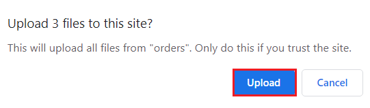

8.  「アップロードフォルダ」ウィンドウに、「 **アップロード**
    」ボタンをクリックします。

> 

1.  ファイルがアップロードされたら 、\[**Upload folder\]**
    ウィンドウを閉じます。

> 

9.  \[**ファイル\]** を展開し て**orders**フォルダーを選択し、CSV
    ファイルがアップロードされたことを確認します.

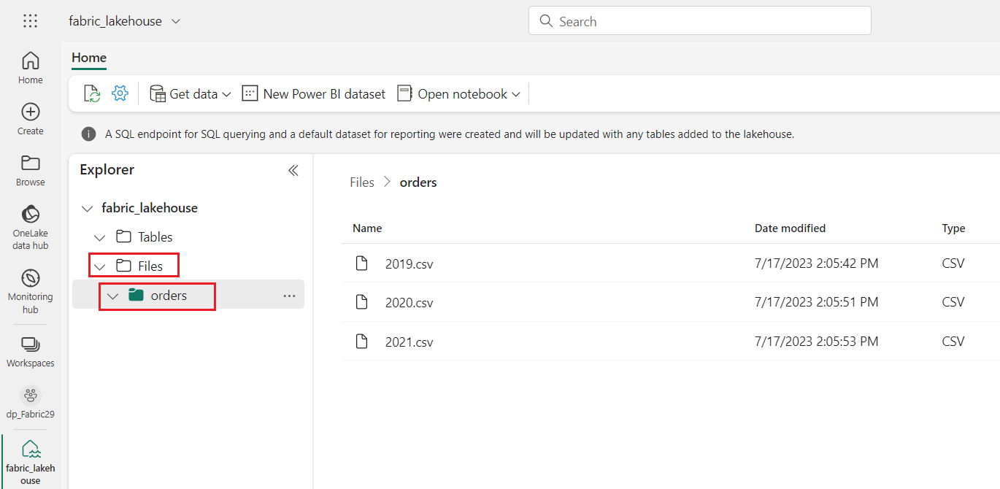

## タスク 3: Create a notebook

Apache
Sparkでデータを扱うには、*ノートブック*を作成します。ノートブックは、複数の言語でコードを書きたり実行したり、メモを追加して記録できるインタラクティブな環境を提供します。.

1.  **Home**
    ページで、Datalakeの**Orders**フォルダーの内容を表示した状態で、
    \[**Open notebook**\] メニューで、 \[**New notebook\]
    を選択します**。

2.  数秒後、1つのセルを含む新しいノートブックが開きます。ノートブックは、コードまたはマークダウン（フォーマットされたテキスト）を含む1つ以上のセルで構成されています。

3.  最初のセル (現在は*コード* セル) を選択し、右上の動的ツール バーで
    **M↓** ボタンを使用して**convert to markdown cell。**

4.  セルがマークダウンセルに変わると、セルに含まれるテキストがレンダリングされます.

5.  **🖉**(編集)ボタンを使用してセルを編集モードに切り替え、すべてのテキストを置き換えてから、次のようにマークダウンを変更します:

> CodeCopy
>
> \# Sales order data exploration
>
> Use the code in this notebook to explore sales order data.

6.  ノートブックのセルの外側の任意の場所をクリックして編集を停止し、レンダリングされたマークダウンを表示します。

## タスク 4: データフレームにデータをロードする

これで、データをデータフレームにロードするコードを実行する準備が整いました。SparkのデータフレームはPythonのPandasデータフレームに似ており、行と列のデータを扱うための共通構造を提供します。

**注:
SparkはScala、Javaなど、複数のコーディング言語をサポートしています。この演習では、Spark向けに最適化されたPythonであるPySparkを使用します。PySparkはSparkで最もよく使われる言語の一つであり、Fabricノートブックのデフォルト言語です。**

1.  ノートブックが表示されている状態で、ファイルリストを拡張し、注文フォルダを選択して、CSVファイルがノートブックエディタの横に表示されるようにします。

2.  2019.csvファイルにマウスを移動します。2019.csvの横にある三つのドット（…）をクリックします。「**データの読み込み**」をクリックし、「**Spark**」を選択します。以下のコードを含む新しいコードセルがノートブックに追加されます。

> CodeCopy
>
> df =
> spark.read.format("csv").option("header","true").load("Files/orders/2019.csv")
>
> \# df now is a Spark DataFrame containing CSV data from
> "Files/orders/2019.csv".
>
> display(df)

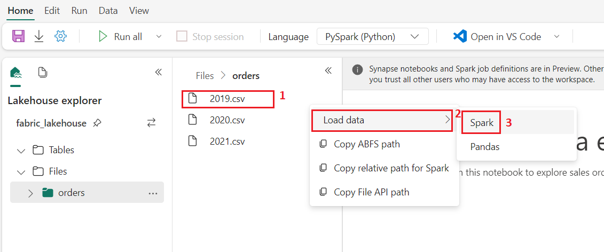

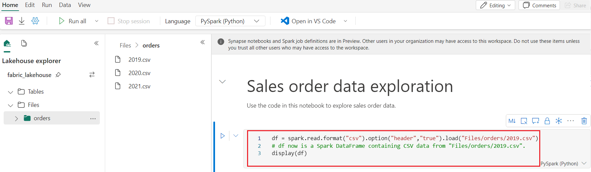

**ヒント:
左側のLakehouseエクスプローラーパネルは、«アイコンを使って非表示にできます。こうすることで、ノートブックに集中しやすくなります。**

3.  セルの左側にある▷セル実行ボタンを使用してセルを実行します。

**注:
Sparkコードを実行するのは初めてなので、Sparkセッションを開始する必要があります。そのため、セッションの最初の実行には1分ほどかかる場合があります。その後の実行はより短時間で完了します。**

4.  セルコマンドが完了したら、セルの下の出力を確認します。次のようになります:

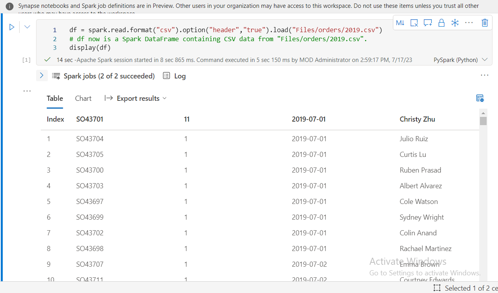

5.  出力には、2019.csvファイルのデータの行と列が表示されています。ただし、列ヘッダーが正しく表示されないことに注意してください。データフレームにデータを読み込むために使用されるデフォルトのコードでは、CSVファイルの1行目に列名が含まれていると想定されていますが、このCSVファイルにはヘッダー情報のないデータのみが含まれています。

6.  コードを修正して、ヘッダーオプションをfalseに設定します。セル内のすべてのコードを以下のコードに置き換え、▷セル実行ボタンをクリックして出力を確認します。

> CodeCopy
>
> df =
> spark.read.format("csv").option("header","false").load("Files/orders/2019.csv")
>
> \# df now is a Spark DataFrame containing CSV data from
> "Files/orders/2019.csv".
>
> display(df)
>
> 

7.  データフレームの最初の行はデータ値として正しく含まれていますが、列名は自動生成されており、あまり役に立ちません。データを理解するには、ファイル内のデータ値に対して正しいスキーマとデータ型を明示的に定義する必要があります。

8.  セル内のすべてのコードを以下のコードに置き換え、▷「セルを実行」ボタンをクリックして出力を確認してください。

> CodeCopy
>
> from pyspark.sql.types import \*
>
> orderSchema = StructType(\[
>
> StructField("SalesOrderNumber", StringType()),
>
> StructField("SalesOrderLineNumber", IntegerType()),
>
> StructField("OrderDate", DateType()),
>
> StructField("CustomerName", StringType()),
>
> StructField("Email", StringType()),
>
> StructField("Item", StringType()),
>
> StructField("Quantity", IntegerType()),
>
> StructField("UnitPrice", FloatType()),
>
> StructField("Tax", FloatType())
>
> \])
>
> df =
> spark.read.format("csv").schema(orderSchema).load("Files/orders/2019.csv")
>
> display(df)

> 

9.  これで、データフレームに正しい列名が含まれるようになりました（各行の順序位置に基づいてすべてのデータフレームに組み込まれている列であるインデックスに加えて）。列のデータ型は、セルの先頭にインポートされたSpark
    SQLライブラリで定義された標準の型セットを使用して指定されます。

10. データフレームを表示して、変更がデータに適用されていることを確認してください。

11. セル出力の下にある「+コード」アイコンを使用してノートブックに新しいコードセルを追加し、次のコードを入力します。▷「セルを実行」ボタンをクリックして出力を確認します。

> CodeCopy
>
> display(df)
>
> 

12. 12\.
    データフレームには2019.csvファイルのデータのみが含まれています。コードを修正し、ファイルパスにワイルドカード「\*」を使用して、ordersフォルダ内のすべてのファイルから販売注文データを読み込みます。

13. 13\.
    セル出力の下にある「+コード」アイコンを使用して、ノートブックに新しいコードセルを追加し、次のコードを入力します。

CodeCopy

> from pyspark.sql.types import \*
>
> orderSchema = StructType(\[
>
>     StructField("SalesOrderNumber", StringType()),
>
>     StructField("SalesOrderLineNumber", IntegerType()),
>
>     StructField("OrderDate", DateType()),
>
>     StructField("CustomerName", StringType()),
>
>     StructField("Email", StringType()),
>
>     StructField("Item", StringType()),
>
>     StructField("Quantity", IntegerType()),
>
>     StructField("UnitPrice", FloatType()),
>
>     StructField("Tax", FloatType())
>
>     \])
>
> df =
> spark.read.format("csv").schema(orderSchema).load("Files/orders/\*.csv")
>
> display(df)

14. 変更したコードセルを実行して出力を確認します。2019年、2020年、2021年の売上が含まれているはずです。

**注:
行のサブセットのみが表示されるため、すべての年の例を表示できない場合があります。**

# 手順 2: データフレーム内のデータを探索する

データフレーム
オブジェクトには、そこに含まれるデータのフィルタリング、グループ化、その他の操作に使用できるさまざまな関数が含まれています。

## タスク 1: データフレームのフィルタリング

1.  セル出力の下にある \[+ コード**\] アイコンを使用して、新しいコード
    セルをノートブックに追加し、次のコードを入力します。**

**CodeCopy**

> customers = df\['CustomerName', 'Email'\]
>
> print(customers.count())
>
> print(customers.distinct().count())
>
> display(customers.distinct())
>
> 

2.  新しいコードセルを実行し、結果を確認します。以下の点に注意する:

    - データフレームに対して操作を実行すると、新しいデータフレームが作成されます（この場合は、df
      データフレームから特定の列のサブセットを選択して、新しい顧客データフレームが作成されます）。

    - データフレームには、count や distinctive
      などの関数が用意されており、それらを使用して、データフレームに含まれるデータを集計およびフィルタリングできます.

    - dataframe\['Field1', 'Field2', ...\] 
      構文は、列のサブセットを定義するための簡潔な方法です。select
      メソッドを使用することもできます。つまり、上記のコードの最初の行は、customers
      = df.select("CustomerName", "Email")と記述できます

> 

3.  コードを変更し、セル内のすべてのコードを
    次のコードに置き換えて、次のように**\[セルを実行**\]ボタンをクリックします:

> CodeCopy
>
> customers = df.select("CustomerName",
> "Email").where(df\['Item'\]=='Road-250 Red, 52')
>
> print(customers.count())
>
> print(customers.distinct().count())
>
> display(customers.distinct())

4.  **修正したコードを実行すると、Road-250 Red,
    52を購入した顧客が表示されます。複数の関数を「連鎖」して、ある関数の出力を次の関数の入力として使用できることに注意してください。この場合、selectメソッドによって作成されたデータフレームが、フィルタリング条件を適用するために使用するwhereメソッドのソースデータフレームとなります。**

> 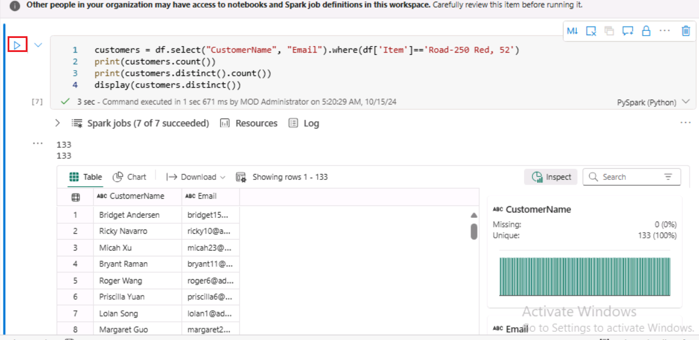

## タスク 2: データフレーム内のデータの集計とグループ化

1.  \[+Code\]**をクリックし**
    、以下のコードをコピーして貼り付け、\[**セルの実行**\]ボタンをクリックします。

CodeCopy

> productSales = df.select("Item", "Quantity").groupBy("Item").sum()
>
> display(productSales)
>
> 

1.  結果には、製品ごとにグループ化された注文数量の合計が表示されます。**groupBy**
    メソッドは Item ごとに行をグループ化し、後続の **sum**
    集計関数が残りのすべての数値列 (この場合は *Quantity*)
    に適用されます

2.  \[+Code\]**をクリックし**
    、以下のコードをコピーして貼り付け、\[**Run
    cell**\]ボタンをクリックします。

> **CodeCopy**
>
> from pyspark.sql.functions import \*
>
> yearlySales =
> df.select(year("OrderDate").alias("Year")).groupBy("Year").count().orderBy("Year")
>
> display(yearlySales)

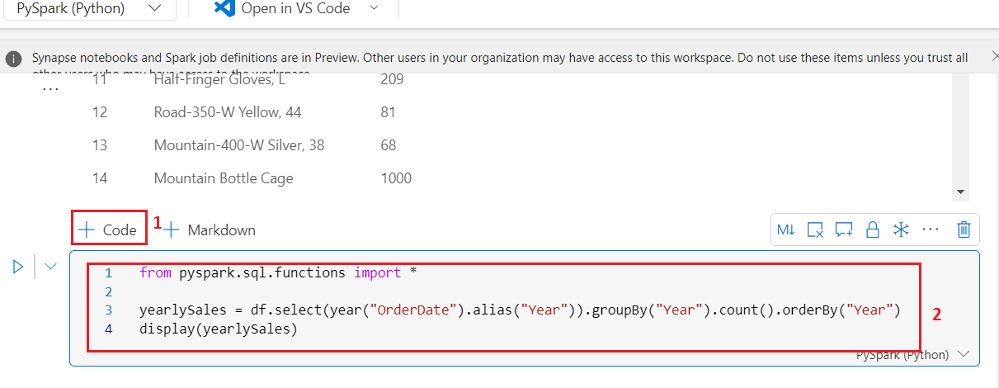

3.  結果には年間の販売注文数が表示されています。selectメソッドには、OrderDateフィールドの年要素を抽出するSQL
    year関数が含まれていることに注目してください（そのため、コードにはSpark
    SQLライブラリから関数をインポートするためのimport文が含まれています）。次に、aliasメソッドを使用して、抽出された年値に列名を割り当てます。その後、データは導出されたYear列でグループ化され、各グループの行数が計算された後、最後にorderByメソッドを使用して結果のデータフレームを並べ替えます。

# 手順 3: Spark を使用してデータ ファイルを変換する

データエンジニアの一般的なタスクは、特定の形式または構造でデータを取り込み、それをさらにダウンストリームの処理または分析のために変換することです。

## タスク 1: データフレームのメソッドと関数を使用してデータを変換する

1.  \[+Code\]をクリックし、以下のコードをコピーして貼り付けます

**CodeCopy**

> from pyspark.sql.functions import \*
>
> \## Create Year and Month columns
>
> transformed_df = df.withColumn("Year",
> year(col("OrderDate"))).withColumn("Month", month(col("OrderDate")))
>
> \# Create the new FirstName and LastName fields
>
> transformed_df = transformed_df.withColumn("FirstName",
> split(col("CustomerName"), " ").getItem(0)).withColumn("LastName",
> split(col("CustomerName"), " ").getItem(1))
>
> \# Filter and reorder columns
>
> transformed_df = transformed_df\["SalesOrderNumber",
> "SalesOrderLineNumber", "OrderDate", "Year", "Month", "FirstName",
> "LastName", "Email", "Item", "Quantity", "UnitPrice", "Tax"\]
>
> \# Display the first five orders
>
> display(transformed_df.limit(5))

2.  **コードを実行して**、次の変換を使用して元の注文データから新しいデータフレームを作成します:

    - OrderDate **列に基づいて** Year **列と** Month
      **列**を追加します。

    - CustomerName **列に基づいて** FirstName **列と** LastName
      **列**を追加します。

    - 列をフィルター処理して並べ替え、**CustomerName** 列を削除します。

3.  出力を確認し、データに変換が行われたことを確認します。

Spark SQL
ライブラリのフル機能を利用して、行のフィルタリング、列の派生、削除、名前の変更、およびその他の必要なデータ変更の適用を行うことで、データを変換できます。

**ヒント**: [*Dataframe
オブジェクトのメソッドの詳細については*](https://spark.apache.org/docs/latest/api/python/reference/pyspark.sql/dataframe.html)、Spark
データフレームの資料を参照してください。

## タスク 2: 変換されたデータを保存する

1.  以下のコードで**新しいセルを追加**し、変換されたデータフレームをParquet形式で保存します（既存のデータがある場合は上書きします）。セルを**実行**し、データが保存されたことを示すメッセージが表示されるまで待ちます。.

> CodeCopy
>
> transformed_df.write.mode("overwrite").parquet('Files/transformed_data/orders')
>
> print ("Transformed data saved!")
>
> **注:
> 一般的に、さらなる分析や分析ストアへの取り込みに使用するデータファイルには、Parquet
> 形式が推奨されます。Parquet
> は非常に効率的な形式で、ほとんどの大規模データ分析システムでサポートされています。実際、データ変換の要件が、他の形式（CSV
> など）から Parquet 形式へのデータ変換だけである場合もあります。**

2.  次に、左側の**Lakehouse Explorer** ペインの**...**\[**Files\]
    ノードのメニューで**、\[**Refresh**\] **を選択します** .

> 

3.  **transformed_data** フォルダーをクリックして、**orders**
    という名前の新しいフォルダーが含まれていることを確認し、そのフォルダーに
    1 つ以上の **Parquet** ファイルが含まれていることを確認します。

4.  次のコード **+ Code**をクリックして、**transformed_data -\> order**
    フォルダー内の parquet ファイルから新しい DataFrame
    を読み込みます。:

> **CodeCopy**
>
> orders_df =
> spark.read.format("parquet").load("Files/transformed_data/orders")
>
> display(orders_df)
>
> 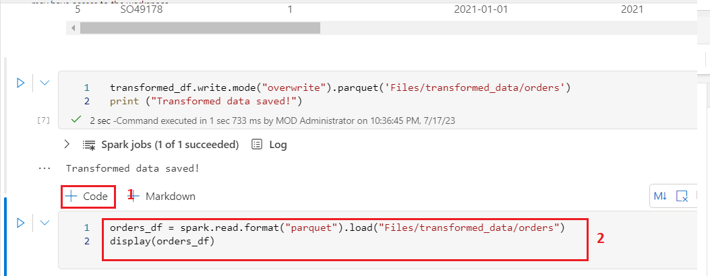

5.  セルを**実行**し、Parquet
    ファイルから読み込まれた注文データが結果に表示されていることを確認します.

> 

## タスク 3: パーティションファイルにデータを保存する

> 新しいセルを追加し、「**+Code**」をクリックして以下のコードを入力します。これにより、データフレームが保存され、データが**年と月**で分割されます。セルを**実行**し、データが保存されたことを示すメッセージが表示されるまで待ちます。CodeCopy
>
> orders_df.write.partitionBy("Year","Month").mode("overwrite").parquet("Files/partitioned_data")
>
> print ("Transformed data saved!")
>
> 
>
> 

1.  次に、左側の**Lakehouse
    Explorerウィンド**の**Files**ノードの…メニューで、**Refresh**を選択します。**.**

2.  「**partitioned_orders**」フォルダを展開し、「**Year=xxxx**」という名前のフォルダが階層構造になっていることを確認します。各フォルダには「**Month=xxxx**」という名前のフォルダが含まれています。各月フォルダには、その月の注文情報を含むParquetファイルが含まれています。

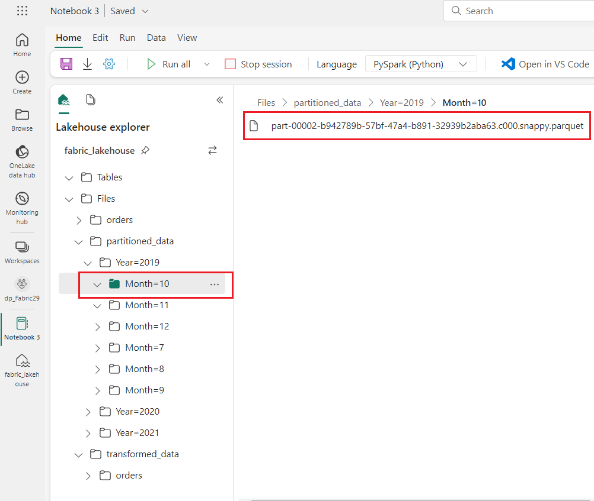

> データファイルのパーティション分割は、大量のデータを扱う際にパフォーマンスを最適化するための一般的な方法です。この手法により、パフォーマンスが大幅に向上し、データのフィルタリングが容易になります。

3.  新しいセルを追加し、次のコードで **+
    Code**をクリックして、**orders.parquet**
    ファイルから新しいデータフレームを読み込みます。:

> CodeCopy
>
> orders_2021_df =
> spark.read.format("parquet").load("Files/partitioned_data/Year=2021/Month=\*")
>
> display(orders_2021_df)

4.  セルを**実行**し、結果に2021年の売上の注文データが表示されることを確認します。パスで指定されたパーティション列（**年と月**）はデータフレームに含まれていないことに注意する**。**

# **手順 3: テーブルと SQL の操作**

ご覧のとおり、データフレームオブジェクトのネイティブメソッドを使用すると、ファイルからデータを非常に効率的にクエリおよび分析できます。しかし、多くのデータアナリストは、SQL構文を使用してクエリを実行できるテーブルを扱うことに慣れています。Sparkは、リレーショナルテーブルを定義できるメタストアを提供しています。データフレームオブジェクトを提供するSpark
SQLライブラリは、メタストア内のテーブルをクエリするためのSQLステートメントの使用もサポートしています。Sparkのこれらの機能を使用することで、データレイクの柔軟性と、リレーショナルデータウェアハウスの構造化データスキーマおよびSQLベースのクエリを組み合わせることができます。これが「データLakehouse」と呼ばれる理由です。

## タスク 1: 管理テーブルの作成

Spark メタストア内のテーブルは、データ
レイク内のファイルに対するリレーショナル抽象化です。テーブルは管理対象
(この場合、ファイルはメタストアによって管理されます) または外部
(この場合、テーブルはメタストアとは独立して管理されるデータ
レイク内のファイルの場所を参照します) になります。

1.  新しいコードを追加するには、ノートブックの **+
    Code**セルをクリックし、次のコードを入力します。これにより、販売注文データのデータフレームが
    **salesorders** という名前のテーブルとして保存されます。:

> CodeCopy
>
> \# Create a new table
>
> df.write.format("delta").saveAsTable("salesorders")
>
> \# Get the table description
>
> spark.sql("DESCRIBE EXTENDED salesorders").show(truncate=False)

**注**:
この例にはいくつか注目すべき点があります。まず、明示的なパスが指定されていないため、テーブルのファイルはメタストアによって管理されます。次に、テーブルは**デルタ**形式で保存されます。テーブルは複数のファイル形式（CSV、Parquet、Avroなど）に基づいて作成できますが、デルタレイクは、トランザクションのサポート、行のバージョン管理、その他の便利な機能を含むリレーショナルデータベース機能をテーブルに追加するSparkテクノロジーです。FabricのデータLakehouseでは、デルタ形式でのテーブル作成が推奨されます**。**

2.  コードセルを**実行**し、新しいテーブルの定義を示す出力を確認します。

3.  **Lakehouse Explorer** ウィンドの \[Tables\] フォルダーの \[…\]
    メニューで、\[**Refresh**\] を選択します。

4.  次に、\[**Tables\]** ノードを拡張し、**salesorders**
    テーブルが作成されていることを確認します。

> 

5.  salesordersテーブルの横にマウスを移動し、三つのドット（…）をクリックします。「**Load
    data**」をクリックし、「**Spark**」を選択します。

6.  ▷ Run cellボタンをクリックすると、Spark SQL
    ライブラリを使用して、PySpark コード内の **salesorder**
    テーブルに対して SQL
    クエリを埋め込み、クエリの結果をデータフレームに読み込みます。

> CodeCopy
>
> df = spark.sql("SELECT \* FROM \[your_lakehouse\].salesorders LIMIT
> 1000")
>
> display(df)

## タスク 2: 外部テーブルの作成

Lakehouseのメタストアでスキーマメタデータが定義されているが、データファイルは外部の場所に保存される外部テーブルを作成することもできます。

1.  最初のコード セルから返された結果の下で、\[**+ Code**\]
    ボタンを使用して、新しいコード セルを追加します
    (まだ存在しない場合)。次に、新しいセルに次のコードを入力します。

CodeCopy

> df.write.format("delta").saveAsTable("external_salesorder",
> path="\<abfs_path\>/external_salesorder")

1.  **Lakehouse
    Explorer**ウィンドの**ファイル**フォルダの…メニューで、メモ帳で**ABFSパス**を**コピー**を選択します。

> ABFS パスは、 Lakehouseの OneLake ストレージ内の Files
> **フォルダ**ーへの完全パスです - これに似ています:

abfss://dp_Fabric29@onelake.dfs.fabric.microsoft.com/Fabric_lakehouse.Lakehouse/Files/external_salesorder

2.  コードセルに移動し、**\<abfs_path\>**
    をメモ帳にコピーした**パス**に置き換えます。これにより、コードがデータフレームが外部テーブルとして保存されることで**Files**
    フォルダ内の **external_salesorder**
    というフォルダにデータファイルが保存されます。完全なパスは次のようになります。

abfss://dp_Fabric29@onelake.dfs.fabric.microsoft.com/Fabric_lakehouse.Lakehouse/Files/external_salesorder

3.  実行するためにセルの左側にある▷ (**Run cell**) を使用する.

4.  **Lakehouse Explorer** ウィンドの ...
    メニューを開き、\[**テーブル**\] フォルダの**\[Refresh**\]
    を選択する**。**

5.  それから**Tablesノードを拡張してexternal_salesorder** テーブルが作成されたことを確認する。

6.  **Lakehouse
    Explorer**ウィンドのファイルフォルダの…メニューで、**Refresh**を選択します。

7.  次に、\[**ファイル**\] ノードを展開し、テーブルのデータ ファイル用に
    **external_salesorder** フォルダが作成されていることを確認します .

## タスク 3: 管理テーブルと外部テーブルの比較

管理テーブルと外部テーブルの違いを探ってみましょう。

1.  コード セルによって返された結果の下にある \[**+ Code**\]
    ボタンを使用して、新しいコード
    セルを追加します。以下のコードを\[コード\]セルにコピーし、セルの左側にある
    **▷*Run cell***ボタンを使用して実行します。

> SqlCopy
>
> %%sql
>
> DESCRIBE FORMATTED salesorders;

2.  結果で、テーブルの **Location**
    プロパティを確認します。これは、/**Tables/salesorders**
    で終わるLakehouseの OneLake ストレージへのパスである必要があります
    (完全なパスを表示するには、**データ型**の列を広げる必要がある場合があります)

3.  次に示すように、**DESCRIBE**コマンドを変更して、external_saleorder
    テーブルの詳細を表示します。

4.  コードセルから返された結果の下にある「+Code」ボタンを使用して、新しいコードセルを追加します。以下のコードをコピーし、セルの左側にある「▷
    Run cell」ボタンを使用して実行します。

> SqlCopy
>
> %%sql
>
> DESCRIBE FORMATTED external_salesorder;

5.  結果で、テーブル**の Location**
    プロパティを確認します。これは、/**Files/external_saleorder**
    で終わるLakehouseの OneLake ストレージへのパスである必要があります
    (完全なパスを表示するには、**データ型**の列を広げる必要がある場合があります)。

## タスク 4: セル内での SQL コードの実行

PySparkコードを含むセルにSQL文を埋め込むことができるのは便利ですが、データアナリストはSQLで直接作業したい場合が多いです。

1.  ノートブックの「+コード」セルをクリックし、以下のコードを入力します。「▷Run
    cell」ボタンをクリックして結果を確認する。そして以下を確認する:

    - セルの先頭にある
      %%sql 行（マジック行と呼ばれる）は、このセルのコードを実行するために
      PySpark ではなく Spark SQL
      言語ランタイムを使用する必要があることを示しています。

    - SQL コードは、 前に作成した **salesorders** テーブルを参照します。

    - SQLクエリの出力は、セルの下に結果として自動的に表示されます。

> SqlCopy
>
> %%sql
>
> SELECT YEAR(OrderDate) AS OrderYear,
>
> SUM((UnitPrice \* Quantity) + Tax) AS GrossRevenue
>
> FROM salesorders
>
> GROUP BY YEAR(OrderDate)
>
> ORDER BY OrderYear;

**注: Spark SQL とデータフレームの詳細については、Spark SQL
のドキュメントを参照してください。**[*Spark SQL
documentation*](https://spark.apache.org/docs/2.2.0/sql-programming-guide.html).

# 手順 4: Spark でデータを視覚化する

諺にもあるように、一枚の写真は千の言葉に値し、グラフは千行のデータよりも優れたものとなることがよくあります。Fabricのノートブックには、データフレームまたはSpark
SQLクエリから表示されるデータ用のグラフビューが組み込まれていますが、包括的なグラフ作成には設計されていません。ただし、**matplotlib**や**seaborn**などのPythonグラフィックライブラリを使用すれば、データフレーム内のデータからグラフを作成できます。

## タスク 1: 結果をグラフとして表示する

1.  ノートブックの **\[+ Code**\]
    セルをクリックし、次のコードを入力します。▷ **\[Run cell**\]
    ボタンをクリックして、以前に作成した **salesorders** ビュー
    からデータが返されることを確認します。

> SqlCopy
>
> %%sql
>
> SELECT \* FROM salesorders

2.  セルの下の結果セクションで、\[**View**\] オプションを **\[Table\]**
    から **\[Chart\] に変更します**。

3.  グラフの右上にある \[**View options\] ボタンを使用して**
    、グラフのオプション
    ウィンドウを表示します。次に、オプションを次のように設定し、\[**Apply**\]
    を選択します :

    - **Chart type**: Bar chart

    - **Key**: Item

    - **Values**: Quantity

    - **Series Group**: *leave blank*

    - **Aggregation**: Sum

    - **Stacked**: *Unselected*

4.  グラフが次のように表示されていることを確認します

## タスク 2: matplotlib を使ってみる

1.  \[+Code**\]をクリックし** 、以下のコードをコピーして貼り付けます。
    コード**をRunし**、年間収益を含む Spark
    データフレームが返されることを確認します。

> CodeCopy
>
> sqlQuery = "SELECT CAST(YEAR(OrderDate) AS CHAR(4)) AS OrderYear, \\
>
> SUM((UnitPrice \* Quantity) + Tax) AS GrossRevenue \\
>
> FROM salesorders \\
>
> GROUP BY CAST(YEAR(OrderDate) AS CHAR(4)) \\
>
> ORDER BY OrderYear"
>
> df_spark = spark.sql(sqlQuery)
>
> df_spark.show()

2.  データをグラフとして視覚化するために、まずはmatplotlib
    Pythonライブラリを使用します。このライブラリは、コアプロットライブラリであり、他の多くのベースとなっていて、グラフ作成において非常に柔軟な機能を提供します。

3.  3\. 「+Code」をクリックし、以下のコードをコピーして貼り付けます。

**CodeCopy**

> from matplotlib import pyplot as plt
>
> \# matplotlib requires a Pandas dataframe, not a Spark one
>
> df_sales = df_spark.toPandas()
>
> \# Create a bar plot of revenue by year
>
> plt.bar(x=df_sales\['OrderYear'\], height=df_sales\['GrossRevenue'\])
>
> \# Display the plot
>
> plt.show()

5.  **Run
    cell**ボタンをクリックし、結果を確認します。結果は、各年の総売上高を示す縦棒グラフで構成されています。このグラフを作成するために使用されたコードの以下の特徴に注意してください:

    - matplotlib ライブラリは Pandas
      データフレームを必要とするため、Spark SQL クエリによって返される
      Spark データフレームをこの形式に変換する必要があります。

    - matplotlib ライブラリの中核は pyplot
      オブジェクトです。これはほとんどのプロット機能の基盤となります。

    - デフォルト設定でも使用可能なチャートが作成されますが、カスタマイズの余地はかなりあります。

6.  次のようにコードを変更してチャートをプロットし、セル内のすべてのコードを次のコードに置き換えて、▷Run
    cellボタンをクリックして出力を確認します。

> CodeCopy
>
> from matplotlib import pyplot as plt
>
> \# Clear the plot area
>
> plt.clf()
>
> \# Create a bar plot of revenue by year
>
> plt.bar(x=df_sales\['OrderYear'\], height=df_sales\['GrossRevenue'\],
> color='orange')
>
> \# Customize the chart
>
> plt.title('Revenue by Year')
>
> plt.xlabel('Year')
>
> plt.ylabel('Revenue')
>
> plt.grid(color='#95a5a6', linestyle='--', linewidth=2, axis='y',
> alpha=0.7)
>
> plt.xticks(rotation=45)
>
> \# Show the figure
>
> plt.show()

7.  グラフに少しだけ情報が追加されました。プロットは厳密には**図**に含まれています。前の例では、図は暗黙的に作成されていましたが、明示的に作成することもできます。

8.  グラフをプロットするには、**セル**内のすべてのコードを次のコードに置き換えてコードを次のように変更してください。

> CodeCopy
>
> from matplotlib import pyplot as plt
>
> \# Clear the plot area
>
> plt.clf()
>
> \# Create a Figure
>
> fig = plt.figure(figsize=(8,3))
>
> \# Create a bar plot of revenue by year
>
> plt.bar(x=df_sales\['OrderYear'\], height=df_sales\['GrossRevenue'\],
> color='orange')
>
> \# Customize the chart
>
> plt.title('Revenue by Year')
>
> plt.xlabel('Year')
>
> plt.ylabel('Revenue')
>
> plt.grid(color='#95a5a6', linestyle='--', linewidth=2, axis='y',
> alpha=0.7)
>
> plt.xticks(rotation=45)
>
> \# Show the figure
>
> plt.show()

9.  コードセルを**再実行**して結果を確認します。図はプロットの形状とサイズを決定します**。**

> 図には、それぞれ独自の*軸上*に複数のサブプロットを含めることができます。

10. コードを以下のように修正してグラフをプロットします。コードセルを**再実行**し、結果を確認します。図には、コードで指定したサブプロットが含まれています。

> CodeCopy
>
> from matplotlib import pyplot as plt
>
> \# Clear the plot area
>
> plt.clf()
>
> \# Create a figure for 2 subplots (1 row, 2 columns)
>
> fig, ax = plt.subplots(1, 2, figsize = (10,4))
>
> \# Create a bar plot of revenue by year on the first axis
>
> ax\[0\].bar(x=df_sales\['OrderYear'\],
> height=df_sales\['GrossRevenue'\], color='orange')
>
> ax\[0\].set_title('Revenue by Year')
>
> \# Create a pie chart of yearly order counts on the second axis
>
> yearly_counts = df_sales\['OrderYear'\].value_counts()
>
> ax\[1\].pie(yearly_counts)
>
> ax\[1\].set_title('Orders per Year')
>
> ax\[1\].legend(yearly_counts.keys().tolist())
>
> \# Add a title to the Figure
>
> fig.suptitle('Sales Data')
>
> \# Show the figure
>
> plt.show()

**注: matplotlib を使ったプロットの詳細については、**[*matplotlib
documentation*](https://matplotlib.org/)**を参照してください。** 

## タスク 3: seabornライブラリを使用する

**matplotlib**は複数の種類の複雑なグラフを作成できますが、最良の結果を得るには複雑なコードが必要になる場合があります。そのため、長年にわたり、matplotlibをベースに多くの新しいライブラリが開発され、複雑さを抽象化し、機能を強化してきました。そのようなライブラリの1つが**seaborn**です。

1.  **\[+Code\]**をクリックし 、以下のコードをコピーして貼り付けます。

CodeCopy

> import seaborn as sns
>
> \# Clear the plot area
>
> plt.clf()
>
> \# Create a bar chart
>
> ax = sns.barplot(x="OrderYear", y="GrossRevenue", data=df_sales)
>
> plt.show()

2.  コードを**実行し**、seaborn
    ライブラリを使用して棒グラフが表示されることを確認します。

3.  コードを以下のように**修正**します。修正したコードを**実行**すると、Seabornでプロットに一貫したカラーテーマを設定できることがわかります。

> CodeCopy
>
> import seaborn as sns
>
> \# Clear the plot area
>
> plt.clf()
>
> \# Set the visual theme for seaborn
>
> sns.set_theme(style="whitegrid")
>
> \# Create a bar chart
>
> ax = sns.barplot(x="OrderYear", y="GrossRevenue", data=df_sales)
>
> plt.show()
>
> 

4.  コードを以下のように**修正**してください。修正したコードを**実行**すると、年間収益が折れ線グラフで表示されます**。**

> CodeCopy
>
> import seaborn as sns
>
> \# Clear the plot area
>
> plt.clf()
>
> \# Create a bar chart
>
> ax = sns.lineplot(x="OrderYear", y="GrossRevenue", data=df_sales)
>
> plt.show()

**注: seaborn を使ったプロットの詳細については、**[*seaborn
documentation*](https://seaborn.pydata.org/index.html)**を参照してください。**

## タスク 4: データのストリーミングに差分テーブルの使用

Delta
Lakeはストリーミングデータをサポートしています。Deltaテーブルは、Spark
Structured Streaming
APIを使用して作成されたデータストリームのシンクまたはソースとして使用できます。この例では、internet
of
things（IoT）のシミュレーションシナリオにおいて、Deltaテーブルをストリーミングデータのシンクとして使用します。

1.  \[+Code**\]をクリックし**
    、以下のコードをコピーして貼り付け、\[**Run
    cell**\]ボタンをクリックします.

CodeCopy

> from notebookutils import mssparkutils
>
> from pyspark.sql.types import \*
>
> from pyspark.sql.functions import \*
>
> \# Create a folder
>
> inputPath = 'Files/data/'
>
> mssparkutils.fs.mkdirs(inputPath)
>
> \# Create a stream that reads data from the folder, using a JSON
> schema
>
> jsonSchema = StructType(\[
>
> StructField("device", StringType(), False),
>
> StructField("status", StringType(), False)
>
> \])
>
> iotstream =
> spark.readStream.schema(jsonSchema).option("maxFilesPerTrigger",
> 1).json(inputPath)
>
> \# Write some event data to the folder
>
> device_data = '''{"device":"Dev1","status":"ok"}
>
> {"device":"Dev1","status":"ok"}
>
> {"device":"Dev1","status":"ok"}
>
> {"device":"Dev2","status":"error"}
>
> {"device":"Dev1","status":"ok"}
>
> {"device":"Dev1","status":"error"}
>
> {"device":"Dev2","status":"ok"}
>
> {"device":"Dev2","status":"error"}
>
> {"device":"Dev1","status":"ok"}'''
>
> mssparkutils.fs.put(inputPath + "data.txt", device_data, True)
>
> print("Source stream created...")

2.  「Source stream
    created…」というメッセージが表示されていることを確認してください。実行したコードは、仮想IoTデバイスからの読み取りデータが格納されているフォルダに基づいてストリーミングデータソースを作成しました。

3.  **\[+Code\]**をクリックし
    、以下のコードをコピーして貼り付け、\[**Run
    cell**\]ボタンをクリックします.

CodeCopy

> \# Write the stream to a delta table
>
> delta_stream_table_path = 'Tables/iotdevicedata'
>
> checkpointpath = 'Files/delta/checkpoint'
>
> deltastream =
> iotstream.writeStream.format("delta").option("checkpointLocation",
> checkpointpath).start(delta_stream_table_path)
>
> print("Streaming to delta sink...")

4.  このコードは、ストリーミングデバイスの**データ**を差分形式で**iotdevicedata**というフォルダに書き込みます。フォルダのパスは**Tables**フォルダ内にあるため、自動的にテーブルが作成されます。テーブルの横にある三つのドットをクリックし、「Refresh」をクリックしてください。.

5.  \[+Code**\]をクリックし**
    、以下のコードをコピーして貼り付け、\[**Run
    cell**\]ボタンをクリックします。

> SqlCopy
>
> %%sql
>
> SELECT \* FROM IotDeviceData;

6.  このコードは、ストリーミング ソースからのデバイス データを含む
    **IotDeviceData** テーブルに対してクエリを実行します .

7.  **\[+Code\]** をクリックし**、**以下のコードをコピーして貼り付け、
    \[**Run cell**\] ボタンをクリックします。

> CodeCopy
>
> \# Add more data to the source stream
>
> more_data = '''{"device":"Dev1","status":"ok"}
>
> {"device":"Dev1","status":"ok"}
>
> {"device":"Dev1","status":"ok"}
>
> {"device":"Dev1","status":"ok"}
>
> {"device":"Dev1","status":"error"}
>
> {"device":"Dev2","status":"error"}
>
> {"device":"Dev1","status":"ok"}'''
>
> mssparkutils.fs.put(inputPath + "more-data.txt", more_data, True)

8.  このコードは、ストリーミングソースにさらに仮想デバイスデータを書き込みます。

9.  **\[+Code\]** をクリックし**、**以下のコードをコピーして貼り付け、
    \[**Run cell**\] ボタンをクリックします。

> SqlCopy
>
> %%sql
>
> SELECT \* FROM IotDeviceData;
>
> 

10. このコードは、 ストリーミング ソースに追加された追加のデータを含む
    **IotDeviceData** テーブルに対して再度クエリを実行します.

11. **\[+Code\]** をクリックし**、**以下のコードをコピーして貼り付け、
    \[**Run cell**\] ボタンをクリックします。

> CodeCopy
>
> deltastream.stop()

12. このコードはストリームを停止します。

## タスク 5: ノートブックを保存し、Spark セッションを終了します

データの操作が完了したので、ノートブックをわかりやすい名前で保存し、Spark
セッションを終了できます。

1.  ノートブックのメニューバーで、\[Settings\] ⚙️
    アイコンを使用してノートブックの設定を表示します。

1.  ノートブックの \[**名前\] を** 「**++Explore Sales
    Orders++**」に設定し、設定ウィンドウを閉じます.

2.  ノートブック メニューで \[**Stop session\]** を選択して Spark
    セッションを終了します。

# 手順 5: Microsoft Fabric でデータフロー (Gen2) を作成する

Microsoft Fabric では、データフロー (Gen2)
はさまざまなデータソースに接続し、Power Query Online
で変換を実行します。その後、データ
パイプラインで使用して、Lakehouseやその他の分析ストアにデータを取り込み、Power
BI レポート用のデータセットを定義することができます。

この手順は、データフロー (Gen2)
のさまざまな要素を紹介することを目的としており、企業で発生する可能性のある複雑なソリューションを作成するものではありません。

## タスク 1: データを取り込むためのデータフロー(Gen2)を作成する

1.  Lakehouseが完成したら、そこにデータを取り込む必要があります。その方法の一つは、*extract,
    transform,
    load*（ETL）プロセスを囲むデータフローを定義することです。次に、
    左側のナビゲーションペインの**Fabric_lakehouse**をクリックします。

2.  **Fabric Lakehouse** のホームページで、「**Get
    data**」のドロップダウン矢印をクリックし、「**New Dataflow
    Gen2**」を選択します。新しいデータフロー用の Power Query
    エディターが開きます。

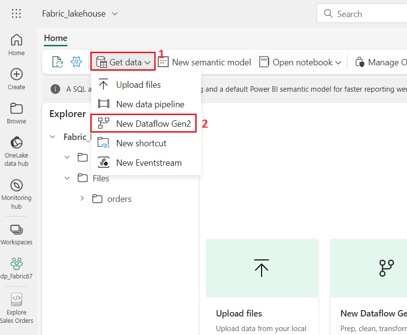

3.  \[**ホーム**\] タブの **Power Query** ウィンドウで、\[**テキスト/CSV
    ファイル**からのインポート\] をクリックします。

4.  **Connect to data source**ウィンドの**接続設定**で、**Link to file
    (Preview)**ラジオボタンを選択します。

- **Link to file**: *Selected*

- **File path or
  URL**: <https://raw.githubusercontent.com/MicrosoftLearning/dp-data/main/orders.csv>

5.  **Connect to data
    source**ウィンドの**接続資格情報**で、次の詳細を入力し、**Next**ボタンをクリックします。.

    - **Connection**: Create new connection

    - **data gateway**: (none)

    - **Authentication kind**: Organizational account

6.  **Preview file data** ウィンドで**、\[Create\]**
    をクリックしてデータ ソースを作成します。

**Power Query** エディターには、データ
ソースと、データをフォーマットするためのクエリ手順の初期セットが表示されます。

7.  ツールバーのリボンで、\[**Add
    column\]**タブを選択します。次に、\[**Custom column\]**
    を選択します。

 

8.  New column nameをMonthNoに設定し、Data typeを**Whole
    Number**に設定し、「**Custom column
    formula**」に次の式を追加します：**Date.Month(\[OrderDate\])**。「**OK**」を選択します。

9.  カスタム列を追加する手順がクエリに追加されていることに注意する。結果の列はデータペインに表示されます。

**ヒント: 右側の「Query Settings」ペインでは、「Applied
steps」に各変換ステップが含まれていることをご確認ください。また、下部にある「ダイアグラムフロー」ボタンを切り替えることで、ステップのビジュアルダイアグラムを表示できます。**

**ステップは上下に移動したり、設定のアイコンを選択して編集したりできます。また、各ステップを選択すると、プレビューペインで変換が適用されている様子を確認できます。**

タスク 2: Dataflow のデータ保存先を追加する

1.  **Power Query**
    ツールバーのリボンで、「**Home**」タブを選択します。次に、「**Data
    destination**」ドロップダウンメニューで「**Lakehouse**」を選択します（まだ選択されていない場合）。

**注:
このオプションがグレー表示になっている場合は、既にデータの保存先が設定されている可能性があります。Power
Query
エディターの右側にあるクエリ設定ウィンドウの下部で、データの保存先を確認する。保存先が既に設定されている場合は、Settingsのアイコンを使って変更できます。**

2.  選択したLakehouseオプションの横にある\[Settings\]アイコンをクリックします
    .

3.  **Connect to data destination**ダイアログボックスで**Edit
    connectionを選択する。**

4.  **「Connect to data destination**」ダイアログボックスで、Power
    BI組織アカウントを使用して**サインイン**を選択し、データフローがLakehouseにアクセスするために使用するIDを設定します。.

5.  Connect to data destinationダイアログボックスで**Nextを選択する。**

6.  Connect to data destinationダイアログボックスで**New
    tableを選択する。Lakehouse folderをクリックして、**ワークスペース–
    **dp_FabricXXを選択してから、**lakehouse i.e
    **Fabric_lakehouseを選択する。次、**Table
    nameで**ordersを指定し、Nextボタンを選択する。**

7.  **Choose destination settingsダイアログボックスでUse automatic
    settings off** と**Update methodの下にAppendを選択して、Save
    settingsボタンを選択する。**

8.  **Lakehouse** の宛先は、Power Query
    エディターの**クエリ**で**アイコン**として表示されます。

9.  「**Publish**」を選択してデータフローを公開します。それで、ワークスペースに**データフロー1**が作成されるまで待ちます。.

10. 公開したら、ワークスペース内のデータフローを右クリックし、\[**Properties**\]
    を選択して、データフローの名前を変更できます。

11. In the
    **Dataflow1ダイアログボックスでNameをGen2_Dataflowとして入力してSaveボタンをクリックする。**

## タスク 3: パイプラインにデータフローを追加する

データフローをパイプラインのアクティビティとして組み込むことができます。パイプラインは、データの取り込みと処理のアクティビティをオーケストレーションするために使用され、データフローを他の種類の操作と組み合わせた単一のスケジュールされたプロセスを作成できます。パイプラインは、Data
Factoryエクスペリエンスなど、いくつかの異なるエクスペリエンスで作成できます。

1.  In the Synapse Data Engineeringホームページで,
    **dp_FabricXXウィンドの下に+New item** -\> **Data
    pipeline**を選択する**。**

2.  In the **New pipelineダイアログボックスでNameフィールドにLoad
    dataを記入してCreateボタンをクリックしたらNew
    Pipelineを開きます。**

3.  パイプラインエディターが開きます。

> **ヒント: データのコピー
> ウィザードが自動的に開いた場合は、閉じてください！**

4.  **Pipeline
    activity**を選択して、パイプラインに**Dataflow**アクティビティを追加する。

5.  新しい**Dataflow1**アクティビティが選択した状況で**Settings**タブでthe **DataflowのドロップダウンリストにGen2_Dataflow**を選択する (前回作成したデータフロー)

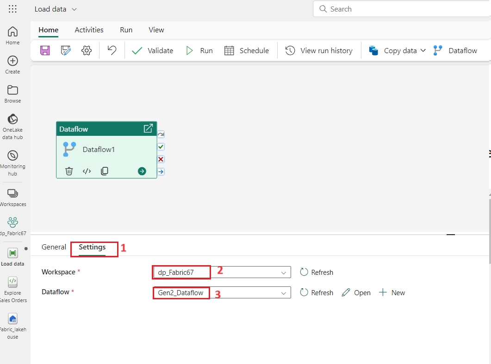

6.  **Home**タブで **🖫 (*Save*)**
    アイコンを使用してパイプラインを保存する。

7.  **▷
    Run**ボタンを使用してパイプラインを実行し、完了するまでに待つ。数分かかる場合があります

> 
>
> 

8.  左側にあるメニューバーでワークスペースを選択す-**dp_FabricXX**.

9.  **Fabric_lakehouse**ウィンドにLakehouse種類の**Gen2_FabricLakehouse**を選択する
    。

10. In
    **ExplorerウィンドにTablesの** **…** メニューを選択して**refreshを選択する。**次、データフローに作成された**Tablesを拡張してordersテーブルを選択する。**

**ヒント: Power BI Desktop データフロー
コネクタを使用すると、データフローで実行されたデータ変換に直接接続できます。また、追加の変換を行ったり、新しいデータセットとして公開したり、特殊なデータセットを対象に配布したりすることもできます。**

## タスク 4: リソースの削除

この手順では、Spark を使用して Microsoft Fabric
でデータを操作する方法を学習しました。

Lakehouseの探索が終了したら、この手順で作成したワークスペースを削除できます。

1.  左側のバーで、ワークスペースのアイコンを選択して、そこに含まれるすべての項目を表示します。

> 

2.  ツールバー上**…** メニューで **Workspace settings**を選択する。

3.  **General**を選択し**、Remove this workspace**をクリックする**。**

4.  **Delete workspace?**
    ダイアログボックスで**Delete**ボタンをクリックする**。**

> 
>
> 

**要約**

このユースケースでは、Power BI 内で Microsoft Fabric
を操作するプロセスを解説します。ワークスペースの設定、Lakehouseの作成、データファイルのアップロードと管理、ノートブックを使用したデータ探索など、様々なタスクを網羅しています。参加者は、PySpark
を使用したデータの操作と変換、視覚化の作成、効率的なクエリ実行のためのデータの保存とパーティション分割の方法を学びます。

このユースケースでは、参加者はMicrosoft
Fabricの差分テーブルを操作することに焦点を当てた一連のタスクに取り組みます。タスクには、データのアップロードと探索、マネージドおよび外部差分テーブルの作成、それらのプロパティの比較が含まれます。ラボでは、構造化データを管理するためのSQL機能を紹介し、matplotlibやseabornなどのPythonライブラリを使用したデータ視覚化に関する洞察を提供します。この手順は、Microsoft
Fabricをデータ分析に活用し、IoTコンテキストでストリーミングデータに差分テーブルを組み込む方法について包括的な理解を提供することを目的としています。

このユースケースでは、Fabricワークスペースの設定、データLakehouseの作成、分析用データの取り込みのプロセスを解説します。ETL処理を処理するデータフローの定義方法と、変換されたデータの保存先となるデータデスティネーションの設定方法も紹介します。さらに、データフローをパイプラインに統合して自動処理を実現する方法も学習します。最後に、手順完了後にリソースを解除する手順を説明します。

このラボでは、Fabric
を使用するために必要なスキルを習得し、ワークスペースの作成と管理、データLakehouseの構築、そして効率的なデータ変換を行えるようになります。データフローをパイプラインに組み込むことで、データ処理タスクを自動化し、ワークフローを効率化し、実際のシナリオにおける生産性を向上させる方法を習得します。削除手順に従うことで、不要なリソースを残さず、整理された効率的なワークスペース管理アプローチを実現できます。
