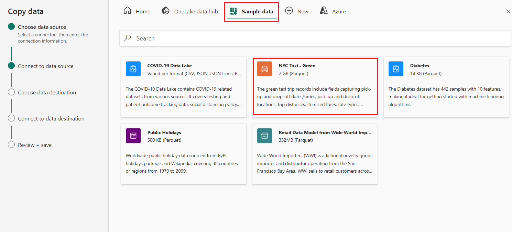
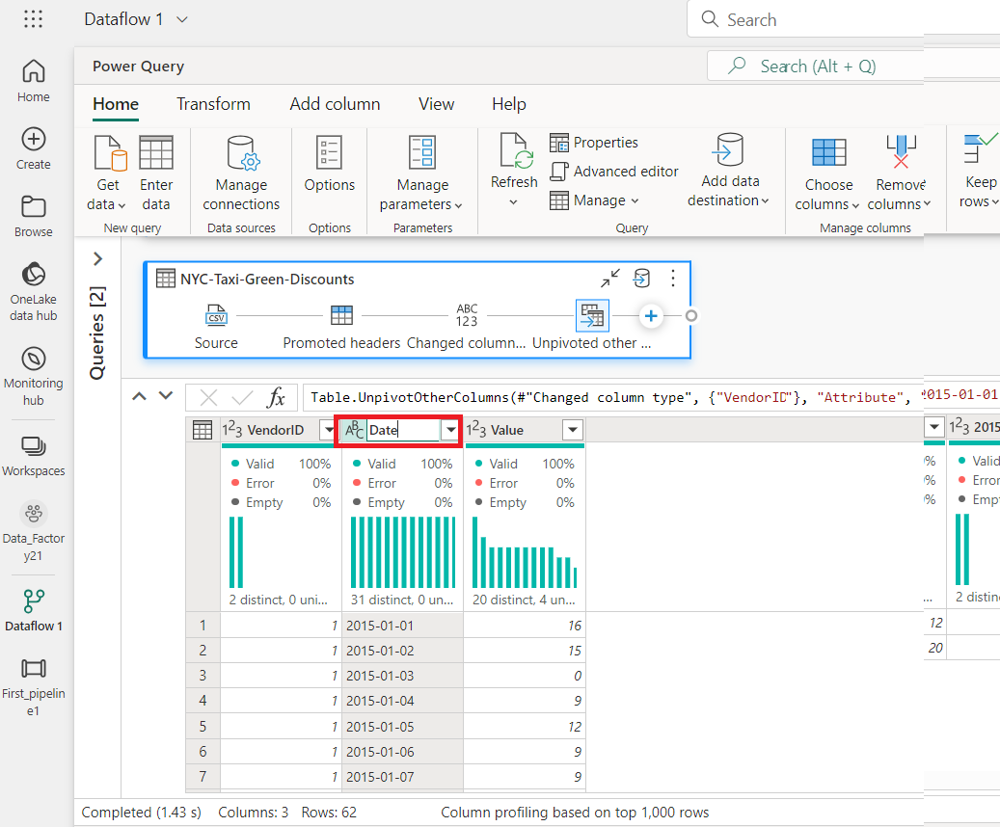
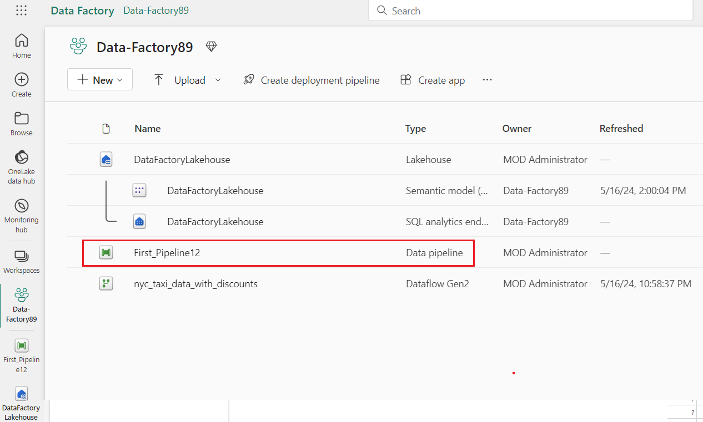

Cas d'utilisation 03 : solution Data Factory pour déplacer et
transformer les données avec des flux de données et des pipelines de
données

**Introduction**

Cet atelier vous permet d'accélérer le processus d'évaluation de Data
Factory dans Microsoft Fabric en fournissant des instructions étape par
étape pour un scénario d'intégration de données complet en une heure. À
la fin de ce tutoriel, vous comprendrez la valeur et les fonctionnalités
clés de Data Factory et saurez comment réaliser un scénario
d'intégration de données de bout en bout courant.

**Objectif**

Le laboratoire est divisé en trois modules :

- Exercice 1 : Créer un pipeline avec Data Factory pour ingérer des
  données brutes d'un stockage Blob vers une table Bronze dans un Data
  Lakehouse.

- Exercice 2 : Transformer des données à l'aide d'un flux de données
  dans Data Factory pour traiter les données brutes de votre table
  Bronze et les déplacer vers une table Gold dans le Data Lakehouse.

- Exercice 3 : Automatiser et envoyer des notifications avec Data
  Factory pour envoyer un e-mail afin de vous informer une fois que
  toutes les tâches sont terminées, et enfin, configurer l'ensemble du
  flux pour qu'il s'exécute de manière planifiée.

# Exercice 1 : Créer un pipeline avec Data Factory

**Important**

Microsoft Fabric est actuellement en préversion. Ces informations
concernent un produit en version préliminaire qui peut être
considérablement modifié avant sa sortie. Microsoft n'offre aucune
garantie, expresse ou implicite, concernant les informations fournies
ici. Reportez-vous à [***la documentation Azure Data
Factory***](https://learn.microsoft.com/en-us/azure/data-factory/) pour
connaître le service dans Azure.

## Tâche 1 : Créer un espace de travail

Avant d'utiliser des données dans Fabric, créez un espace de travail
avec la version d'essai de Fabric activée.

1.  Ouvrez votre navigateur, accédez à la barre d'adresse et tapez ou
    collez l'URL suivante : <https://app.fabric.microsoft.com/> puis
    appuyez sur le bouton **Entrer**.

> 
>
> **Remarque** : Si vous êtes redirigé vers la page d'accueil de
> Microsoft Fabric, ignorez les étapes de \#2 à \#4.

2.  Dans la fenêtre **Microsoft Fabric**, entrez vos informations
    d'identification, puis cliquez sur le bouton **Envoyer**.

> 

3.  Ensuite, dans la fenêtre **Microsoft**, entrez le mot de passe et
    cliquez sur le bouton **Sign in.**

> 

4.  Dans **Stay signed in?** cliquez sur le bouton **Yes**.

> 

5.  Créez une nouvelle Eventhouse en cliquant sur le bouton **+New
    workshop** dans la barre de navigation.

> 

6.  Dans l'onglet **Create a workspace**, entrez les détails suivants et
    cliquez sur le bouton **Apply**.

[TABLE]

> 

7.  Attendez la fin du déploiement. Cela prendra environ 2-3 minutes.

8.  Dans la page Workspace de **Data-FactoryXX**, naviguez et cliquez
    sur le bouton **+New item**, puis sélectionnez **Lakehouse.**

> 
>
> 

9.  Dans la boîte de dialogue **New lakehouse, entrez
    +++DataFactoryLakehouse+++** dans le champ Name**,** cliquez sur le
    bouton **Create** et ouvrez le new lakehouse.

> 

10. Maintenant, cliquez sur **Data-FactoryXX** dans le volet de
    navigation de gauche.

##  Tâche 2 : Créer un pipeline de données

1.  Créez une nouvelle cabane au bord du lac en cliquant sur le bouton
    +Nouvel élément dans la barre de navigation. Cliquez sur la tuile
    « Data pipeline »

2.  Dans la boîte de dialogue **New pipeline**, entrez +++
    **First_Pipeline1**+++ dans le champ **Name**, puis cliquez sur le
    bouton **Create**.

> 

## Tâche 3 : Utiliser une activité Copy dans le pipeline pour charger des exemples de données dans un Lakehouse de données

1.  Sur la page d'accueil **First_Pipeline1**, sélectionnez **Copy data
    assistant** pour ouvrir l'outil Assistant de copie.

> 

2.  La boîte de dialogue **Copy data** s'affiche avec la première étape,
    **Choose data source**, en surbrillance. Sélectionnez la section
    **Sample data**, puis sélectionnez le type de source de données
    **NYC Taxi-Green**. Sélectionnez ensuite **Next**.

3.  Dans la section **Connect to data source**, cliquez sur le bouton
    **Next**.

4.  Pour l'étape **Choose data destination** de l'assistant de copie,
    sélectionnez **Lakehouse**, puis **Next**.

5.  Sélectionnez le hub de données OneLake, puis **Lakehouse** existant
    sur la page de configuration de la destination des données qui
    s'affiche.

6.  Configurez maintenant les détails de votre destination Lakehouse sur
    le chemin d'accès ou le tableau **Sélectionner et mapper au
    dossier.** page. Sélectionnez **Tables** pour le **Root folder**,
    indiquez le nom de la table +++**Bronze**+++, puis sélectionnez
    **Next**.

> 

7.  Enfin, sur la page **Review + save** de l'assistant de copie de
    données, vérifiez la configuration. Pour cet atelier, décochez la
    case **Start data transfer immediately**, car nous exécutons
    l'activité manuellement à l'étape suivante. Sélectionnez ensuite
    **OK.**

## **Tâche 4 : Exécutez et affichez les résultats de votre activité de copie**.

1.  Dans l'onglet **Home** de la fenêtre de l'éditeur de pipeline,
    sélectionnez le bouton **Run**.

2.  Dans la section Enregistrer **et exécuter ?** , cliquez sur **le
    bouton Enregistrer et exécuter** pour exécuter ces activités. Cette
    activité durera environ 11-12 min

> 

3.  Vous pouvez surveiller l'exécution et vérifier les résultats dans
    l'onglet **Output** sous le canevas du pipeline. Sélectionnez
    **activity name** comme **Copy_ihy** pour afficher les détails de
    l'exécution.

4.  Les détails de l'exécution indiquent 76 513 115 lignes lues et
    écrites.

5.  Développez la section **Duration breakdown** pour voir la durée de
    chaque étape de l'activité Copie. Après avoir examiné les détails de
    la copie, sélectionnez **Close**.

**Exercice 2 : Transformer des données à l'aide d'un flux de données
dans Data Factory**

## Tâche 1 : Obtenir des données à partir d'une table Lakehouse

1.  Sur la page **First_Pipeline 1**, dans la barre latérale,
    sélectionnez **Create.**

2.  Sur la page d'accueil **de Data Factory Data-FactoryXX**, pour créer
    un nouveau flux de données gen2, cliquez sur **Dataflow Gen2** sous
    **Data** **Factory.**

3.  Dans le nouveau menu de flux de données, sous le volet **Power
    Query**, cliquez sur **Get data**, puis sélectionnez **More...**.

> 

4.  Dans l'onglet **Choose data source**, recherchez la zone de
    recherche tapez +++ **Lakehouse+++**, puis cliquez sur le connecteur
    **Lakehouse**.

> 

5.  La boîte de dialogue **Connect to data source** s'affiche, puis
    sélectionnez **Edit connection.** 

6.  Dans la boîte de dialogue **Connect to data source,** sélectionnez
    **Sign in** à l'aide de votre compte d'organisation Power BI pour
    définir l'identité que le flux de données utilise pour accéder au
    lakehouse.

7.  Dans la **Connect to data source** Se connecter à la source de
    données**,** sélectionnez **Next.**

> 

8.  La boîte de dialogue **Choose data** s'affiche. Utilisez le volet de
    navigation pour trouver le Lakehouse que vous avez créé pour la
    destination dans le module précédent, puis sélectionnez la table de
    données **DataFactoryLakehouse**, puis cliquez sur le bouton
    **Create**.

9.  Une fois que votre canevas est rempli avec les données, vous pouvez
    définir des informations de **column profile**, car cela est utile
    pour le profilage des données. Vous pouvez appliquer la bonne
    transformation et cibler les bonnes valeurs de données en fonction
    de celle-ci.

10. Pour ce faire, sélectionnez **Options** dans le volet du ruban, puis
    sélectionnez les trois premières options sous **Column profile**,
    puis sélectionnez **OK**.

## Tâche 2 : Transformer les données importées du Lakehouse

1.  Sélectionnez l'icône du type de données dans l'en-tête de colonne de
    la deuxième colonne, **IpepPickupDatetime**, pour afficher **right
    click** sur le menu et sélectionnez **Change type** dans le menu
    pour convertir la colonne du type **Date/Time** en **Date** Type.

2.  Sous l'onglet **Home** du ruban, sélectionnez l'option **Choose
    columns** dans le groupe **Manage columns**.

3.  Dans la **boîte de dialogue** Choisir des colonnes**,
    désélectionnez** certaines colonnes répertoriées ici, puis
    sélectionnez **OK.**

    - lpepDropoffDatetime

    &nbsp;

    - puLocationId

    &nbsp;

    - doLocationId

    &nbsp;

    - prise en chargeLatitude

    &nbsp;

    - déposeLongitude

    &nbsp;

    - rateCodeID

> 

4.  Sélectionnez le menu déroulant filtre et tri de la colonne
    **storeAndFwdFlag**. (Si vous voyez un avertissement **List may be
    incomplete**, sélectionnez **Load more** pour voir toutes les
    données.)

5.  Sélectionnez « **Y »** pour afficher uniquement les lignes où une
    remise a été appliquée, puis sélectionnez **OK**.

6.  Sélectionnez le menu déroulant **Ipep_Pickup_Datetime** trier et
    filtrer les colonnes, puis sélectionnez **Date filters** et
    choisissez l'icône **Between...** filtre fourni pour les types Date
    et Date/Heure.

11. Dans la boîte de dialogue **Filtrer rows**, sélectionnez les dates
    comprises entre **January 1, 2015** et **January 31, 2015**, puis
    sélectionnez **OK**.

> 

## Tâche 3 : Se connecter à un fichier CSV contenant des données de remise

Maintenant, avec les données des trajets en place, nous voulons charger
les données qui contiennent les remises respectives pour chaque jour et
VendorID, et préparer les données avant de les combiner avec les données
des trajets.

1.  Dans l’onglet **Home** du menu de l'éditeur de flux de données,
    sélectionnez l'option **Get data**, puis choisissez **Text/CSV**.

2.  Dans le volet **Connect to data source**, sous **Connection
    settings**, sélectionnez la case d'option **Upload file (Preview),**
    puis cliquez sur le bouton **Browse** et parcourez votre VM
    **C :\LabFiles**, puis sélectionnez le fichier
    **NYC-Taxi-Green-Discounts** et cliquez sur le bouton **Open**.

3.  Dans le volet **Connect to data source**, cliquez sur le bouton
    **Next**.

4.  Dans la boîte de dialogue Aperçu des données du fichier**,**
    sélectionnez **Create**.

## Tâche 4 : Transformer les données de remise

1.  En examinant les données, nous voyons que les en-têtes semblent être
    dans la première rangée. Promouvez-les en en-têtes en sélectionnant
    le menu contextuel du tableau en haut à gauche de la zone de grille
    d'aperçu pour sélectionner **Utiliser la première ligne comme
    en-tête.**

***Remarque :** Après avoir promu les en-têtes, vous pouvez voir une
nouvelle étape ajoutée au volet **Applied steps** en haut de l'éditeur
de flux de données pour les types de données de vos colonnes.*

2.  Cliquez avec le bouton droit de la souris sur la colonne
    **VendorID** et, dans le menu contextuel affiché, sélectionnez
    l'option **Unpivot other columns**. Cela vous permet de transformer
    des colonnes en paires attribut-valeur, où les colonnes deviennent
    des lignes.

3.  Une fois la table dépivotée, renommez les colonnes **Attribute** et
    **Value** en double-cliquant dessus et en remplaçant **Attribute**
    par **Date** et **Value** par **Discount**.

4.  Modifiez le type de données de la colonne Date en sélectionnant le
    menu Type de données à gauche du nom de la colonne et en choisissant
    **Date**.

5.  Sélectionnez la colonne **Discount**, puis l'onglet **Transform**
    dans le menu. Sélectionnez **column Number**, puis Transformations
    numériques **standard** dans le sous-menu, puis choisissez
    **Divide**.

6.  Dans la boîte de dialogue **Discount**, entrez la valeur +++100+++,
    puis cliquez sur le bouton **OK**.

**Tâche 5 : Combiner les données des courses et des remises**

L'étape suivante consiste à combiner les deux tables en une seule table
qui contient la réduction qui doit être appliquée au voyage et le total
ajusté.

1.  Tout d'abord, basculez le bouton **Diagram view** pour afficher vos
    deux requêtes.

2.  Sélectionnez la requête **Bronze**, puis sous l'onglet **Home**,
    sélectionnez le menu **Combine** et choisissez **Merge queries**,
    puis **Merge queries as new**.

3.  Dans la boîte de dialogue **Merge,** sélectionnez
    **Generated-NYC-Taxi-Green-Discounts** dans la liste déroulante
    **Right table for merge**, puis sélectionnez l'icône « **light
    bulb** » en haut à droite de la boîte de dialogue pour voir le
    mappage suggéré des colonnes entre les trois tables.

4.  Choisissez chacun des deux mappages de colonnes suggérés, un par un,
    en mappant les colonnes VendorID et date des deux tables. Lorsque
    les deux mappages sont ajoutés, les en-têtes de colonne
    correspondants sont mis en surbrillance dans chaque table.

5.  Un message s'affiche vous demandant d'autoriser la combinaison de
    données provenant de plusieurs sources de données pour afficher les
    résultats. Sélectionnez **OK**

6.  Dans la zone du tableau, vous verrez initialement un avertissement
    indiquant : « L'évaluation a été annulée, car la combinaison de
    données provenant de plusieurs sources peut révéler des données
    d'une source à une autre. Sélectionnez Continuer si la possibilité
    de révéler des données est acceptable. Sélectionnez **Continue**
    pour afficher les données combinées.

7.  Dans la boîte de dialogue Niveaux de confidentialité, cochez la
    **case : Ignore Privacy Lavels checks for this document. Ignoring
    privacy Levels could expose sensitive or confidential data to an
    unauthorized person** sur le bouton **Save**.

8.  Notez qu'une nouvelle requête a été créée dans la vue Diagramme,
    montrant la relation entre la nouvelle requête Merge et les deux
    requêtes que vous avez créées précédemment. En regardant le volet de
    table de l'éditeur, faites défiler vers la droite de la liste de
    colonnes Fusionner la requête pour voir qu'une nouvelle colonne avec
    des valeurs de table est présente. Il s'agit de la colonne
    « Generated NYC Taxi-Green-Discounts », et son type est
    **\[Table\]**. Dans l'en-tête de colonne, il y a une icône avec deux
    flèches allant dans des directions opposées, vous permettant de
    sélectionner des colonnes dans le tableau. Désélectionnez toutes les
    colonnes à l'exception de **Discount**, puis sélectionnez **OK**.

9.  Avec la valeur de la remise maintenant au niveau de la ligne, nous
    pouvons créer une nouvelle colonne pour calculer le montant total
    après remise. Pour ce faire, sélectionnez l’onglet **Add colunn** en
    haut de l'éditeur, puis choisissez **Custom column** dans le groupe
    **General**.

10. Dans la boîte de dialogue **Custom column**, vous pouvez utiliser le
    langage de [formule Power Query (également connu sous le nom de
    M)](https://learn.microsoft.com/en-us/powerquery-m) pour définir le
    mode de calcul de votre nouvelle colonne. Entrez +++
    **TotalAfterDiscount+++** pour le nom de la  **New column name**,
    sélectionnez **Currency** pour le type de **data** et fournissez
    l'expression M suivante pour la formule de **Custom column
    formula**:

> *+++if \[totalAmount\] \> 0 then \[totalAmount\] \* ( 1 -\[Remise\] )
> else \[totalAmount\]+++*
>
> Sélectionnez ensuite **OK.**

11. Sélectionnez la colonne **TotalAfterDiscount** nouvellement créée ,
    puis sélectionnez l’onglet **Transform** en haut de la fenêtre de
    l'éditeur. Dans le groupe de **Number column**, sélectionnez la
    liste **Rounding** Arrondi, puis choisissez **Round...**.

12. Dans la boîte de dialogue **Round**, entrez **2** pour le nombre de
    décimales, puis sélectionnez **OK**.

> 

13. Modifiez le type de données de **IpepPickupDatetime** de **Date** à
    **Date/Time**.

14. Enfin, développez le volet **Query settings** à partir du côté droit
    de l'éditeur s'il n'est pas déjà développé, puis renommez la requête
    de **Merge** à **Output**.

**Tâche 6 : Charger la requête de sortie dans une table du Lakehouse**

Une fois la requête de sortie entièrement préparée et les données prêtes
à être sorties, nous pouvons définir la destination de sortie de la
requête.

1.  Sélectionnez la requête de fusion **Output** créée précédemment.
    Sélectionnez ensuite l’onglet **Home** dans l'éditeur, puis **Add
    data destination** de données dans le groupe **Query**, pour
    sélectionner une destination **Lakehouse**.

2.  Dans la boîte de dialogue **Connect to data destination**, votre
    connexion doit déjà être sélectionnée. Sélectionnez **Next** pour
    continuer.

3.  Dans la boîte de dialogue **Choose destination target**, accédez au
    Lakehouse où vous souhaitez charger les données et nommez la
    nouvelle table+++ **nyc_taxi_with_discounts+++**, puis sélectionnez
    à nouveau **Next**.

4.  Dans la boîte de dialogue **Choose destination settings**, conservez
    la méthode de mise à jour Remplacer par défaut, vérifiez que vos
    colonnes sont correctement mappées, puis sélectionnez **Save
    settings**.

5.  De retour dans la fenêtre principale de l'éditeur, vérifiez que vous
    voyez votre destination de sortie dans le volet **Query settings**
    de la table **Output**, puis sélectionnez **Publish**.

6.  Sur la page de l'espace de travail, vous pouvez renommer votre flux
    de données en sélectionnant les points de suspension à droite du nom
    du flux de données qui s'affiche après avoir sélectionné la ligne,
    puis en choisissant **Proprieties**.

7.  Dans la boîte de dialogue **Dataflow 1**, entrez
    +++nyc_taxi_data_with_discounts+++ dans la zone de nom, puis
    sélectionnez **Save**.

> 

8.  Sélectionnez l'icône d'actualisation du flux de données après avoir
    sélectionné sa ligne et, une fois l'opération terminée, votre
    nouvelle table Lakehouse doit être créée comme configurée dans les
    paramètres de **Data destination**.

9.  Dans le volet **Data_FactoryXX**, sélectionnez
    **DataFactoryLakehouse** pour afficher la nouvelle table qui y est
    chargée.

# Exercice 3 : Automatiser et envoyer des notifications avec Data Factory

**Important**

Microsoft Fabric est actuellement en préversion. Ces informations
concernent un produit en version préliminaire qui peut être
considérablement modifié avant sa sortie. Microsoft n'offre aucune
garantie, expresse ou implicite, concernant les informations fournies
ici. Reportez-vous à [***la documentation Azure Data
Factory***](https://learn.microsoft.com/en-us/azure/data-factory/) pour
connaître le service dans Azure.

## Tâche 1 : Ajouter une activité Office 365 Outlook à votre pipeline

1.  À partir de **Tutorial_Lakehouse** page, naviguez et cliquez sur
    **Data_FactoryXX** Espace de travail dans le menu de navigation de
    gauche.

2.  Dans la vue **Data_FactoryXX**, sélectionnez le **First_Pipeline1**.

3.  Sélectionnez l'onglet **Activités** dans l'éditeur de pipeline et
    recherchez l'activité **Office Outlook**.

4.  Sélectionnez et faites glisser le chemin d'accès **On success**
    (case à cocher verte en haut à droite de l'activité dans le canevas
    du pipeline) de votre **Copy activity** vers votre nouvelle activité
    **Office 365 Outlook**.

5.  Sélectionnez l'activité Office 365 Outlook dans le canevas du
    pipeline, puis sélectionnez l’onglet **Settings** de la zone de
    propriété sous le canevas pour configurer l'e-mail. Cliquez sur le
    bouton **Sing**.

6.  Sélectionnez votre compte d'organisation Power BI, puis sélectionnez
    **Allow access** pour confirmer.

**Remarque :** Le service ne prend actuellement pas en charge l'e-mail
personnel. Vous devez utiliser une adresse e-mail d'entreprise.

7.  Sélectionnez l'activité Office 365 Outlook dans le canevas du
    pipeline, sous l’onglet **Settings** de la zone de propriété sous le
    canevas pour configurer l'e-mail.

    - Entrez votre adresse e-mail dans la section **To**. Si vous
      souhaitez utiliser plusieurs adresses, utilisez **;** pour les
      séparer.

    &nbsp;

    - Pour **Subject**, sélectionnez le champ de sorte que l’option
      **Add dynamic content** s'affiche, puis sélectionnez-le pour
      afficher le canevas du générateur d'expressions de pipeline.

8.  La boîte de dialogue **Générateur d'expressions de pipeline**
    s'affiche. Entrez l'expression suivante, puis sélectionnez **OK** :

> *@concat('DI in an Hour Pipeline Succeeded with Pipeline Run Id',
> pipeline().RunId)*

9.  Pour le **corps**, sélectionnez à nouveau le champ et choisissez l'
    option **Afficher dans le générateur d'expressions** lorsqu'elle
    apparaît sous la zone de texte. Ajoutez à nouveau l'expression
    suivante dans la boîte de dialogue Générateur d'expressions de
    **pipeline** qui s'affiche, puis sélectionnez **OK** :

> *@concat('RunID = ', pipeline().RunId, ' ; ', 'Copied rows ',
> activity('Copy data1').output.rowsCopied, ' ; ','Throughput ',
> activity('Copy data1').output.throughput)*

**Remarque :** Remplacez **Copy data1** par le nom de votre propre
activité de copie de pipeline.

10. Enfin, sélectionnez l’onglet **Home** en haut de l'éditeur de
    pipeline, puis choisissez **Exécuter**. Sélectionnez ensuite **Save
    and run** à nouveau dans la boîte de dialogue de confirmation pour
    exécuter ces activités.

> 
>
> 
>
> 

11. Une fois que le pipeline s'est exécuté avec succès, vérifiez votre
    e-mail pour trouver l'e-mail de confirmation envoyé à partir du
    pipeline.

**Tâche 2 : Planifier l'exécution du pipeline**

Une fois que vous avez terminé de développer et de tester votre
pipeline, vous pouvez planifier son exécution automatique.

1.  Dans l’onglet **Accueil** de la fenêtre de l'éditeur de pipeline,
    sélectionnez **Planifier**.

2.  Configurez la planification selon vos besoins. L'exemple ici
    planifie l'exécution du pipeline tous les jours à 20h00 jusqu'à la
    fin de l'année.

***Tâche 3 :* Ajouter une activité Dataflow au pipeline**

1.  Passez la souris sur la ligne verte reliant **Copy activity** et l'
    activité **Office 365 Outlook** sur votre canevas de pipeline, puis
    sélectionnez le bouton **+** pour insérer une nouvelle activité.

> 

2.  Choisissez **Dataflow** dans le menu qui s'affiche.

3.  L'activité Dataflow nouvellement créée est insérée entre l'activité
    Copie et l'activité Office 365 Outlook, et sélectionnée
    automatiquement, affichant ses propriétés dans la zone située sous
    le canevas. Sélectionnez l’onglet **Settings** dans la zone des
    propriétés, puis sélectionnez le flux de données créé dans
    l'**Exercice 2 : Transformer des données à l'aide d'un flux de
    données dans Data Factory (Transform data with a dataflow in Data
    Factory)**.

12. Sélectionnez l’onglet **Home** en haut de l'éditeur de pipeline,
    puis choisissez **Run**. Sélectionnez ensuite **Save and run** à
    nouveau dans la boîte de dialogue de confirmation pour exécuter ces
    activités.

## Tâche 4 : Nettoyer les ressources

Vous pouvez supprimer des rapports, des pipelines, des entrepôts et
d'autres éléments individuels ou supprimer l'ensemble de l'espace de
travail. Procédez comme suit pour supprimer l'espace de travail que vous
avez créé pour ce didacticiel.

1.  Sélectionnez votre espace de travail, la **Data-FactoryXX** dans le
    menu de navigation de gauche. Il ouvre la vue des éléments de
    l'espace de travail.

2.  Sélectionnez l'icône ***...*** sous le nom de l'espace de travail et
    sélectionnez **Workspace settings**.

3.  Sélectionnez **Autre** et **Supprimer cet espace de travail.**

