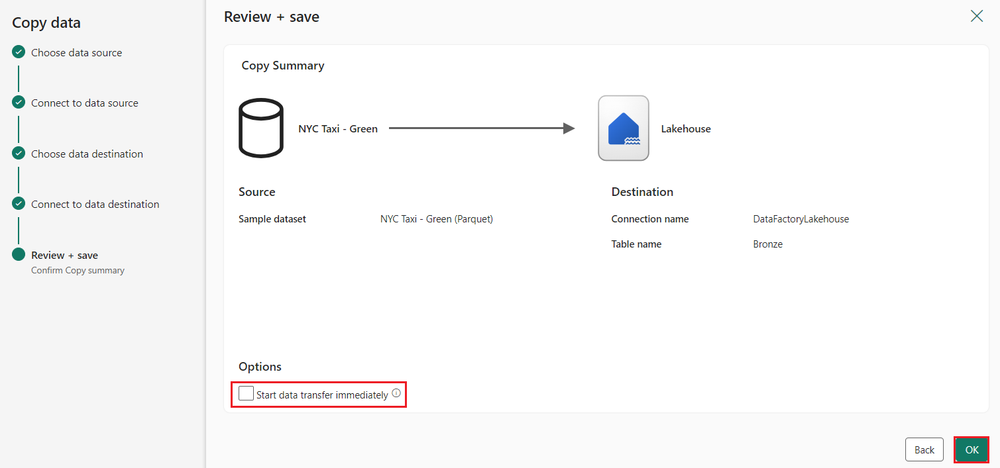
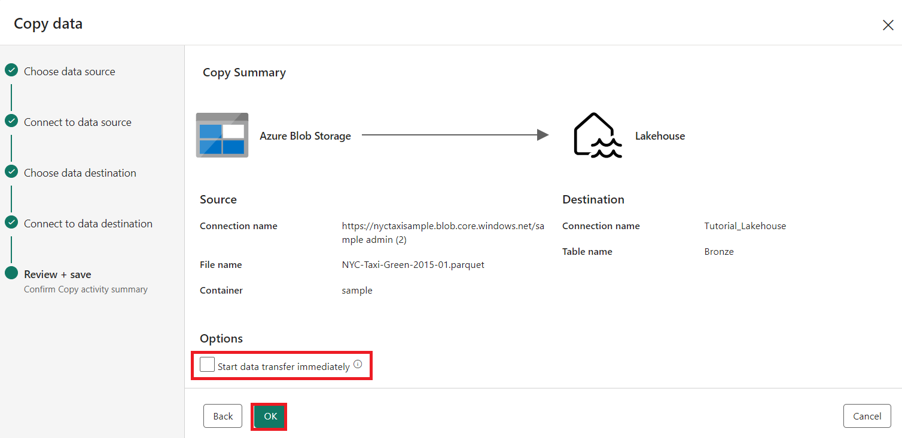
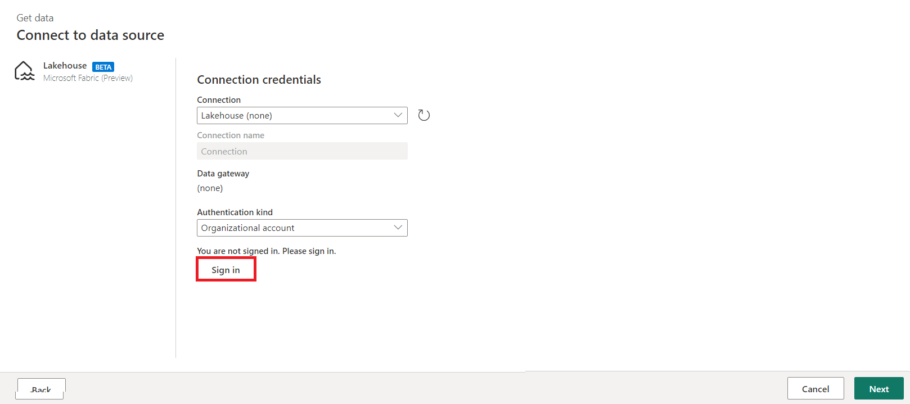
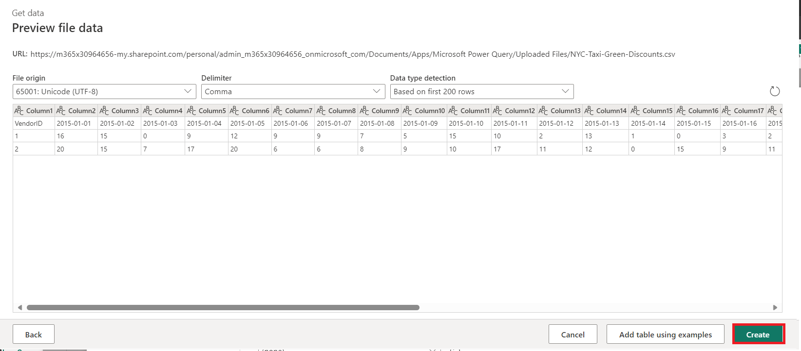
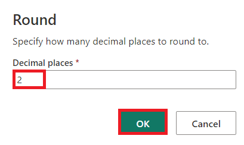
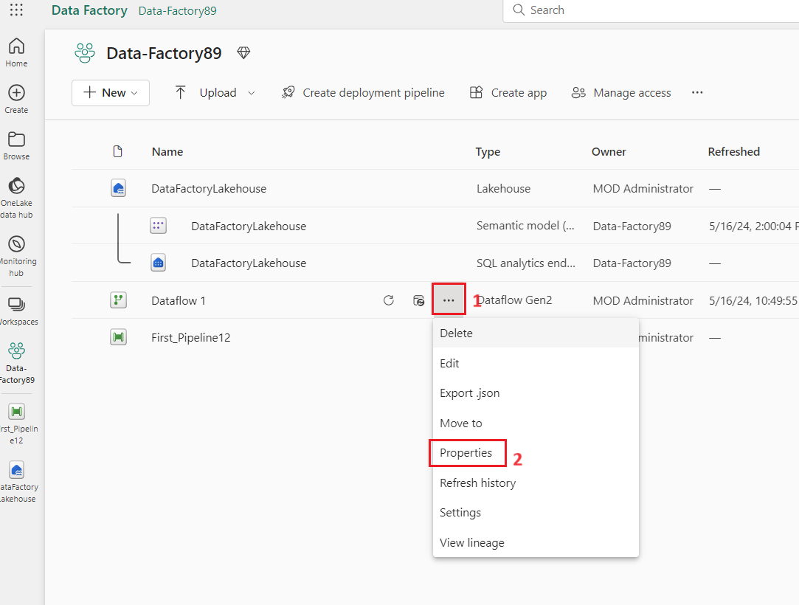
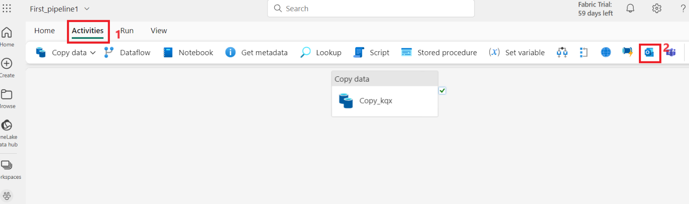
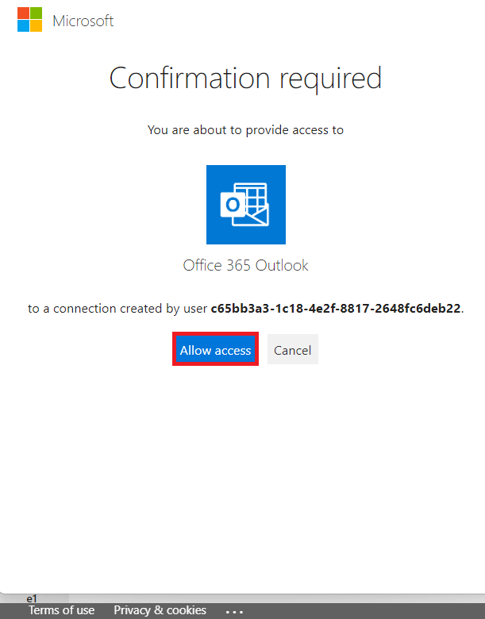
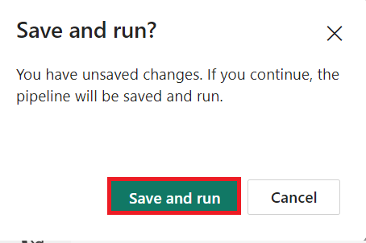

사용 사례 03: 데이터 흐름 및 데이터 파이프라인을 통해 데이터를 이동하고
변환하기 위한 Data Factory 솔루션

**소개**

이 랩은 한 시간 안에 전체 데이터 통합 ​​시나리오에 대한 단계별 지침을
제공하여 Microsoft Fabric에서 Data Factory 평가 프로세스를 가속화하는 데
도움이 됩니다. 이 튜토리얼을 마치면 Data Factory의 가치와 주요 기능을
이해하고 일반적인 엔드투엔드 데이터 통합 ​​시나리오를 완료하는 방법을 알게
됩니다.

**목적**

연구실은 3개의 모듈로 나뉩니다:

- 연습 1: Data Factory를 사용하여 Blob 저장소의 원시 데이터를 Data
  Lakehouse의 Bronze 테이블로 수집하는 파이프라인을 생성합니다.

- 연습 2: Data Factory의 데이터 흐름을 사용하여 데이터를 변환하고 Bronze
  테이블의 원시 데이터를 처리하여 Data Lakehouse의 Gold 테이블로
  이동합니다.

- 연습 3: Data Factory를 사용하여 알림을 자동화하고 전송하여 모든 작업이
  완료되면 이메일을 보내고, 마지막으로 전체 흐름이 예약된 방식으로
  실행되도록 설정합니다.

# 연습 1: Data Factory를 사용하여 파이프라인 만들기

** 중요**

Microsoft Fabric은 현재 미리 보기(Preview) 상태입니다. 이 정보는 출시 전
상당한 수정이 있을 수 있는 사전 출시 제품과 관련이 있습니다. Microsoft는
여기에 제공된 정보와 관련하여 명시적이든 묵시적이든 어떠한 보증도 하지
않습니다. Azure의 해당 서비스에 대한 자세한 내용은 [***Azure Data
Factory
documentation***](https://learn.microsoft.com/en-us/azure/data-factory/)를
참조하세요.

## 작업 1: 작업 공간 만들기

Fabric에서 데이터 작업을 하기 전에 Fabric 평가판을 활성화하여 작업
공간을 만듭니다.

1.  브라우저를 열고 주소 표시줄로 이동한 후 다음 URL을 입력하거나
    붙여넣습니다. <https://app.fabric.microsoft.com/> 그런 다음
    **Enter** 버튼을 누릅니다.

> 
>
> **참고:** Microsoft Fabric 홈페이지로 이동되면 2번부터 4번까지 단계를
> 건너뜁니다.

2.  **Microsoft Fabric**창에서 자격 증명을 입력하고 **Submit** 버튼을
    클릭합니다.

> 

3.  그런 다음 **Microsoft** 창에서 비밀번호를 입력하고 **Sign in**
    버튼을 클릭합니다.

> 

4.  In **Stay signed in?** window, click on the **Yes** button. 로그인
    상태 유지? 창에서 예 버튼을 클릭합니다.

> 

5.  탐색 바에서 **+New workshop** 버튼을 클릭하여 새로운 이벤트하우스를
    만듭니다.

> 

6.  **Create a workspace**탭에서 다음 세부 정보를 입력하고 **Apply**
    버튼을 클릭합니다.

[TABLE]

> 

7.  배포가 완료될 때까지 기다리세요. 약 2~3분 정도 걸립니다.

8.  **Data-FactoryXX** 작업 공간 페이지에서 **+New item** 버튼을
    클릭하고 **Lakehouse**를 선택합니다.

> 
>
> 

9.  **New lakehouse**  대화 상자에서 **Name** 필드에
    +++**DataFactoryLakehouse+++**를 입력하고 **Create** 버튼을 클릭하여
    새로운 레이크하우스를 엽니다.

> 

10. 이제 왼쪽 탐색 창에서 **Data-FactoryXX**를 클릭합니다.

##  작업 2: 데이터 파이프라인 만들기

1.  탐색 모음에서 **+New item**버튼을 클릭하여 새 레이크하우스를
    만듭니다. **Data pipeline** 타일을 클릭합니다.

2.  **New pipeline** 대화 상자에서 **Name** 필드에
    +++**First_Pipeline1+++**을 입력한 다음 **Create** 버튼을
    클릭합니다.

> 

## 작업 3: 파이프라인에서 복사 활동을 사용하여 샘플 데이터를 데이터 레이크하우스에 로드하기

1.  **First_Pipeline1**홈페이지에서 **Copy data assistant**  을 선택하여
    복사 지원 도구를 엽니다.

> 

2.  **Copy data** 대화 상자가 표시되고 첫 번째 단계인 **Choose data
    source**,이 강조 표시됩니다. **Sample data** 섹션을 선택하고 **NYC
    Taxi-Green** 데이터 소스 유형을 선택합니다. 그런 다음 **Next**을
    클릭합니다.

3.  **Connect to data source**에서 **Next**  버튼을 클릭합니다.

4.  복사 도움의 **Choose data destination** 단계에서 **Lakehouse**를
    선택한 후 **Next**을 선택합니다.

5.  OneLake 데이터 허브를 선택하고 나타나는 데이터 대상 구성 페이지에서
    **Existing Lakehouse** 를 선택합니다.

6.  이제 **Select and map to folder path or table** 페이지에서 Lakehouse
    대상의 세부 정보를 구성하세요. **Root folder**의 **Tables**을
    선택하고 테이블 이름을 +++**Bronze+++**로 지정한 후 **Next**을
    선택합니다.

> 

7.  마지막으로, 데이터 복사 지원 도구의 **Review + save**  페이지에서
    구성을 검토합니다. 다음 단계에서는 활동을 수동으로 실행하므로 이
    랩에서는 **Start data transfer immediately** 체크박스의 선택을
    해제합니다. 그런 다음 **OK를** 선택합니다.

## **작업 4: 복사 활동 실행 및 결과 보기**

1.  파이프라인 편집기 창의 **Home** 탭에서 **Run**  버튼을
    선택합니다.

2.  **Save and run?** 대화 상자에서 **Save and run** 버튼을 클릭하여
    다음 작업을 실행하세요. 이 작업은 약 11~12분 정도 소요됩니다.

> 

3.  파이프라인 캔버스 아래의 **Output** 탭에서 실행을 모니터링하고
    결과를 확인할 수 있습니다. 실행 세부 정보를 보려면 **activity
    name**을 **Copy_ihy**로 선택합니다.

4.  실행 세부 정보에는 76,513,115개 행이 읽히고 쓰여졌다는 것이
    표시됩니다.

5.  **Duration breakdown** 섹션을 확장하여 복사 활동의 각 단계별 기간을
    확인하세요. 복사 세부 정보를 검토한 후 **Close**를 선택합니다.

**연습 2: Data Factory에서 데이터 흐름을 사용하여 데이터 변환**

## 작업 1: Lakehouse 테이블에서 데이터 가져오기

1.  **First_Pipeline 1** 페이지의 사이드바에서 **Create**를 선택합니다.

2.  **Data Factory Data-FactoryXX**홈페이지에서 새로운 **Dataflow
    Gen2** 를 만들려면 **Data Factory**아래에 있는 Dataflow Gen2를
    클릭합니다.

3.  새 데이터 흐름 메뉴에서 **Power Query**창 아래에 있는 **Get data**를
    클릭한 다음, **More...**를 선택합니다.

> 

4.  **Choose data source** 탭에서 검색 상자에 **+++Lakehouse+++**를
    입력한 다음 **Lakehouse**  커넥터를 클릭합니다.

> 

5.  **Connect to data source**  대화 상자가 나타나면 **Edit
    connection**을 선택합니다.

6.  **Connect to data source**  대화 상자에서 Power BI 조직 계정을
    사용하여 **sign in**을 선택하여 데이터 흐름이 레이크하우스에
    액세스하는 데 사용하는 ID를 설정합니다.

7.  **Connect to data source**대화 상자에서 **Next**을 선택합니다.

> 

8.  **Choose data** 대화 상자가 표시됩니다. 탐색 창을 사용하여 이전
    모듈에서 대상에 대해 만든 Lakehouse를 찾은 후
    **DataFactoryLakehouse**  데이터 테이블을 선택하고 **Create**버튼을
    클릭합니다.

9.  캔버스에 데이터가 입력되면 데이터 프로파일링에 유용한 **column
    profile** 정보를 설정할 수 있습니다. 이를 통해 적절한 변환을
    적용하고 이를 기반으로 적절한 데이터 값을 타겟팅할 수 있습니다.

10. 이렇게 하려면 리본 창에서 **Options**을 선택한 다음 **Column
    profile**에서 처음 세 가지 옵션을 선택하고 **OK를** 선택합니다.

## 작업 2: Lakehouse에서 가져온 데이터 변환

1.  두 번째 열인 , **IpepPickupDatetime**의 열 머리글에서 데이터 유형
    아이콘을 선택하고, 메뉴를 **마우스 오른쪽** 버튼으로 클릭한 후
    메뉴에서 유형 변경을 선택하면 해당 열의 **Date/Time** 유형이
    **Date** 유형으로 변환됩니다.

2.  On the **Home** tab of the ribbon, select the **Choose
    columns** option from the **Manage columns** group. 리본의 **Home**
    탭에서 **Manage columns** 그룹의 **Choose columns** 옵션을
    선택합니다.

3.  On the **Choose columns** dialog, **deselect** some columns listed
    here, then select **OK**. **Choose columns** 대화 상자에서 여기에
    나열된 일부 열의 선택을 해제한 다음**OK를**선택합니다.

    - lpepDropoffDatetime

    &nbsp;

    - puLocationId

    &nbsp;

    - doLocationId

    &nbsp;

    - pickupLatitude

    &nbsp;

    - dropoffLongitude

    &nbsp;

    - rateCodeID

> 

4.  **storeAndFwdFlag** 열의 필터 및 정렬 드롭다운 메뉴를 선택합니다.
    **List may be incomplete**라는 경고가 표시되면 **Load more** 를
    선택하여 모든 데이터를 확인합니다.

5.  할인이 적용된 행만 표시하려면 **'Y**'를 선택한 다음 **OK**.를
    선택합니다.

6.  **Ipep_Pickup_Datetime** 열 정렬 및 필터 드롭다운 메뉴를 선택한
    다음, select **Date filters**를 선택하고 날짜 및 날짜/시간 유형에
    제공되는 **Between...**필터를 선택합니다.

11. **Filter rows**대화 상자에서 **January 1, 2015**부터 **January 31,
    2015** 사이의 날짜를 선택한 다음 **OK**를 선택합니다.

> 

## 작업 3: 할인 데이터가 포함된 CSV 파일에 연결

이제 여행 데이터가 준비되었으므로 각 요일과 VendorID에 대한 할인이
포함된 데이터를 로드하고, 여행 데이터와 결합하기 전에 데이터를
준비하려고 합니다.

1.  데이터 흐름 편집기 메뉴의 **Home** 탭에서 **Home**옵션을 선택한 다음
    **Text/CSV**를 선택합니다.

2.  **Connect to data source**창의 **Connection settings**에서 **Upload
    file (Preview)** 라디오 버튼을 선택한 다음, **Browse** 버튼을
    클릭하고 VM **C:\LabFiles**를 찾은 다음,
    **NYC-Taxi-Green-Discounts**파일을 선택하고 **Open**버튼을
    클릭합니다.

3.  **Connect to data source**창에서 **Next** 버튼을 클릭합니다.

4.  **Preview file data**  대화 상자에서 **Create**를 선택합니다.

## 작업 4: 할인 데이터 변환

1.  데이터를 검토해 보니 헤더가 첫 번째 행에 있는 것으로 보입니다.
    미리보기 그리드 영역 왼쪽 상단의 테이블 컨텍스트 **Use first row as
    headers**을 선택하여 헤더로 승격합니다.

*** 참고:** 헤더를 승격한 후 데이터 흐름 편집기 상단의 적용된 단계 창에
열의 데이터 유형에 대한 새 단계가 추가된 것을 볼 수 있습니다.*

2.  **VendorID** 열을 마우스 오른쪽 버튼으로 클릭하고 표시되는 상황에
    맞는 메뉴에서 **Unpivot other columns**옵션을 선택합니다. 이렇게
    하면 열을 속성-값 쌍으로 변환할 수 있으며, 이때 열은 행이 됩니다.

3.  테이블의 피벗을 해제한 상태에서 **Attribute**과 **Value** 열의
    이름을 두 번 클릭하고 **Attribute**을 **Date**로, **Value**을
    **Discount**로 변경하여 바꿉니다.

4.  열 이름 왼쪽에 있는 데이터 유형 메뉴를 선택하고 날짜를 선택하여 날짜
    열의 데이터 유형을 변경합니다.

5.  **Discount** 열을 선택한 다음 메뉴에서 **Transform** 탭을
    선택합니다. **Number column**을 선택한 다음 하위 메뉴에서 **Standard
    numeric transformations**을 선택하고 나누기를 선택합니다.

6.  **Divide** 대화 상자에서 값 +++100+++을 입력한 다음 **OK**버튼을
    클릭합니다.

**작업 5: 여행 및 할인 데이터 결합**

다음 단계는 두 표를 하나의 표로 결합하여 여행에 적용할 할인율과 조정된
총액을 나타내는 표입니다.

1.  먼저 **Diagram view**  버튼을 전환하여 두 가지 쿼리를 모두 볼 수
    있습니다.

2.  **Bronze** 쿼리를 선택하고 **Home** 탭에서 **Combine** 메뉴를 선택한
    다음 **Merge queries를** 선택하고 **Merge queries as new를
    선택**합니다.

3.  **Merge** 대화 상자에서 **Right table for merge** 드롭다운에서
    **Generated-NYC-Taxi-Green-Discounts**를 선택한 다음 대화 상자의
    오른쪽 상단에 있는 "**light bulb**" 아이콘을 선택하여 세 테이블 간의
    열 매핑 제안을 확인합니다.

4.  두 개의 제안된 열 매핑을 각각 하나씩 선택하여 두 테이블의 VendorID
    및 date 열에 매핑합니다. 두 매핑을 모두 추가하면 각 테이블에서
    일치하는 열 헤더가 강조 표시됩니다.

5.  여러 데이터 소스의 데이터를 결합하여 결과를 볼 수 있도록 허용할지
    묻는 메시지가 표시됩니다. **OK를** 선택합니다.

6.  표 영역에는 처음에 "여러 소스의 데이터를 결합하면 한 소스의 데이터가
    다른 소스로 유출될 수 있으므로 평가가 취소되었습니다. 데이터 유출
    가능성이 괜찮다면 **continue**를 선택합니다."라는 경고가 표시됩니다.
    결합된 데이터를 표시하려면 '**continue**'를 선택합니다.

7.  Privacy levels 대화 상자에서 Ignore Privacy Levels checks for this
    document. Ignoring privacy Levels could expose sensitive or
    confidential data to an unauthorized person확인란을 선택합니다. 저장
    버튼을 클릭합니다.

8.  다이어그램 뷰에서 새 쿼리가 생성되어 이전에 만든 두 쿼리와 새 병합
    쿼리의 관계를 확인할 수 있습니다. 편집기의 테이블 창에서 병합 쿼리
    열 목록 오른쪽으로 스크롤하면 테이블 값이 포함된 새 열이 표시됩니다.
    " Generated NYC Taxi-Green-Discounts " 열이며, 유형은
    **\[Table\]**.입니다. 열 머리글에 반대 방향으로 이동하는 두 개의
    화살표가 있는 아이콘이 있는데, 이를 통해 표에서 열을 선택할 수
    있습니다. **Discount를** 제외한 모든 열의 선택을 해제한 후 Ok를
    선택합니다.

9.  이제 할인 값이 행 수준에 있으므로 할인 후 총액을 계산하는 새 열을
    만들 수 있습니다. 이렇게 하려면 편집기 **Add column** 탭을 선택하고
    **General** 그룹에서 **Custom column**을 선택합니다.

10. **Custom column** 대화 상자에서 Power Query 수식 언어(M이라고도
    함)를 사용하여 새 열을 계산하는 방법을 정의할 수 있습니다. **새 열
    이름**에 **+++TotalAfterDiscount+++**를 입력하고, **Data type**로
    **Currency** 를 선택한 다음, **Custom column formula**에 다음 M
    표현식을 제공합니다:

> *+++if \[totalAmount\] \> 0 then \[totalAmount\] \* ( 1 -\[Discount\]
> ) else \[totalAmount\]+++*
>
> 그런 다음 **OK를** 선택합니다

11. 새로 만든 **TotalAfterDiscount**열을 선택한 다음 편집기 창 상단의
    **Transform**탭을 선택합니다. **Number column**그룹에서
    **Rounding**드롭다운 메뉴를 선택한 다음 ' **Round...**'을
    선택합니다.

12. **Round**대화 상자에서 소수 자릿수로 **2**를 입력한 다음 **OK를**
    선택합니다.

> 

13. **IpepPickupDatetime**의 데이터 유형을 **Date**에서 **Date/Time**로
    변경합니다.

14. 마지막으로 편집기 오른쪽에서 **Query settings** 창을 확장합니다(아직
    확장되어 있지 않으면). 그리고 쿼리 이름을 **Merge**에서
    **Output**으로 바꿉니다.

**작업 6: Lakehouse의 테이블에 출력 쿼리 로드**

이제 출력 쿼리가 완전히 준비되고 출력할 데이터가 준비되었으므로 쿼리에
대한 출력 대상을 정의할 수 있습니다.

1.  이전에 만든 **Outputmerge**쿼리를 선택합니다. 그런 다음 편집기에서
    **Home** 탭을 선택하고 **Query** 그룹에서 **Add data
    destination** 를 선택하여 **Lakehouse** 대상을 선택합니다.

2.  **Connect to data destination** 대화 상자에서 연결이 이미 선택되어
    있어야 합니다. **Next**를 선택하여 계속 진행합니다

3.  **Choose destination target**대화 상자에서 데이터를 로드할
    Lakehouse로 이동하여 새 테이블의 이름을 **+++
    nyc_taxi_with_discounts+++**로 지정한 후 **Next를** 선택합니다.

4.  **Choose destination settings** 대화 상자에서 기본 업데이트 방법
    **Replace**를 그대로 두고 열이 올바르게 매핑되었는지 다시 한 번
    확인한 다음 **Save settings**을 선택합니다.

5.  기본 편집기 창으로 돌아와서 **Output** 테이블의 **Query
    settings**창에 출력 대상이 표시되는지 확인한 다음 **Publish**를
    선택합니다.

6.  작업 공간 페이지에서 행을 선택한 후 나타나는 데이터 흐름 이름
    오른쪽에 있는 줄임표를 선택하고 **Properties를** 선택하여 데이터
    흐름의 이름을 바꿀 수 있습니다.

7.  **Dataflow 1** 대화 상자에서 이름 상자에
    **+++nyc_taxi_data_with_discounts+++** 를 입력한 다음 **Save**를
    선택합니다.

> 

8.  행을 선택한 후 데이터 흐름의 새로 고침 아이콘을 선택하면 완료되면
    **Data destination** 설정에 구성된 대로 새 Lakehouse 테이블이 생성된
    것을 볼 수 있습니다.

9.  **Data_FactoryXX** 창에서 **DataFactoryLakehouse**를 선택하면 해당
    위치에 로드된 새 테이블이 표시됩니다.

# 연습 3: Data Factory를 사용하여 알림 자동화 및 전송

** 중요**

Microsoft Fabric은 현재 미리 보기 상태입니다. 이 정보는 출시 전 상당한
수정이 있을 수 있는 사전 출시 제품과 관련이 있습니다. Microsoft는 여기에
제공된 정보와 관련하여 명시적이든 묵시적이든 어떠한 보증도 하지
않습니다. Azure의 서비스에 대한 자세한 내용은 [***Azure Data Factory
documentation***](https://learn.microsoft.com/en-us/azure/data-factory/)를
참조하세요.

## 작업 1: 파이프라인에 Office 365 Outlook 활동 추가

1.  **Tutorial_Lakehouse**페이지에서 왼쪽 탐색 메뉴에 있는
    **Data_FactoryXX** Workspace를 탐색하고 클릭합니다.

2.  **Data_FactoryXX** 뷰에서 **First_Pipeline1**을 선택합니다.

3.  파이프라인 편집기에서 **Activities** 탭을 선택하고 **Office
    Outlook**활동을 찾습니다.

4.  파이프라인 캔버스의 활동 오른쪽 상단에 있는 녹색 확인란인 **On
    success** 경로를 **Copy activity**에서 새 **Office 365 Outlook**
    활동으로 선택하여 끌어다 놓습니다.

5.  파이프라인 캔버스에서 Office 365 Outlook 활동을 선택한 다음, 캔버스
    아래 속성 영역의 **Settings**탭을 선택하여 이메일을 구성합니다.
    **Sing in**버튼을 클릭합니다.

6.  Power BI 조직 계정을 선택한 다음 **Allow access** 를 선택하여
    확인합니다.

**참고:** 현재 이 서비스는 개인 이메일을 지원하지 않습니다. 회사 이메일
주소를 사용해야 합니다.

7.  파이프라인 캔버스에서 Office 365 Outlook 활동을 선택하고 캔버스 아래
    속성 영역의 **Settings** 탭에서 이메일을 구성합니다.

    - **To** 사람 섹션에 이메일 주소를 입력하세요. 여러 주소를
      입력하려면 ;를 사용하여 구분합니다.

    - **Subject**에서 필드를 선택하면 **Add dynamic content** 옵션이
      나타나고, 해당 필드를 선택하면 파이프라인 표현식 빌더 캔버스가
      표시됩니다.

8.  **Pipeline expression builder** 대화 상자가 나타납니다. 다음
    표현식을 입력하고 Ok를 선택합니다.

> *@concat('DI in an Hour Pipeline Succeeded with Pipeline Run Id',
> pipeline().RunId)*

9.  **Body**에서 필드를 다시 선택하고 텍스트 영역 아래에 **View in
    expression builder** 옵션이 나타나면 선택합니다. 나타나는 **Pipeline
    expression builder** 대화 상자에 다음 표현식을 다시 추가한 후
    **OK**를 선택합니다.

> *@concat('RunID = ', pipeline().RunId, ' ; ', 'Copied rows ',
> activity('Copy data1').output.rowsCopied, ' ; ','Throughput ',
> activity('Copy data1').output.throughput)*

** 참고: Copy data1**을 자신의 파이프라인 복사 활동 이름으로 바꾸세요.

10. 마지막으로 파이프라인 편집기 상단의 **Home**탭을 선택하고 **Run**을
    선택합니다. 그런 다음 확인 대화 상자에서 **Save and run** 을 다시
    선택하여 이러한 작업을 실행합니다.

> 
>
> 
>
> 

11. 파이프라인이 성공적으로 실행된 후, 파이프라인에서 보낸 확인 이메일을
    확인합니다.

**작업 2: 파이프라인 실행 일정 예약**

파이프라인 개발과 테스트를 마치면 자동으로 실행되도록 예약할 수
있습니다.

1.  파이프라인 편집기 창의 **Home** 탭에서 **Schedule를** 선택합니다.

2.  필요에 따라 일정을 구성하세요. 이 예시에서는 파이프라인이 연말까지
    매일 오후 8시에 실행되도록 예약합니다.

**작업 3: 파이프라인에 Dataflow 활동 추가**

1.  파이프라인 캔버스에서 **Copy activity**과 **Office 365 Outlook**
    활동을 연결하는 녹색 선 위에 마우스를 놓고 + 버튼을 선택하여 새
    활동을 삽입합니다.

> 

2.  나타나는 메뉴에서 **Dataflow를** 선택합니다.

3.  새로 생성된 데이터 흐름 활동이 복사 활동과 Office 365 Outlook 활동
    사이에 삽입되고 자동으로 선택되며, 캔버스 아래 영역에 해당 속성이
    표시됩니다. 속성 영역에서 **settings** 탭을 선택한 다음, **연습 2:
    Data Factory의 데이터 흐름으로 데이터 변환**에서 만든 Dataflow를
    선택합니다.

12. 파이프라인 편집기 상단의 **Home**탭을 선택하고 **Run**을 선택합니다.
    그런 다음 확인 대화 상자에서 **Save and run** 을 선택하여 작업을
    실행합니다.

## 작업 4: 리소스 정리

개별 보고서, 파이프라인, 웨어하우스 및 기타 항목을 삭제하거나 전체 작업
공간을 제거할 수 있습니다. 이 튜토리얼을 위해 만든 작업 공간을
삭제하려면 다음 단계를 따릅니다.

1.  왼쪽 탐색 메뉴에서 **Data-FactoryXX** 작업 공간을 선택합니다. 작업
    공간 항목 보기가 열립니다.

2.  작업 공간 이름 아래에서 ... 옵션을 선택하고 **Workspace
    settings**.를 선택합니다.

3.  **Other를 선택하고 Remove this workspace을 선택합니다.**

