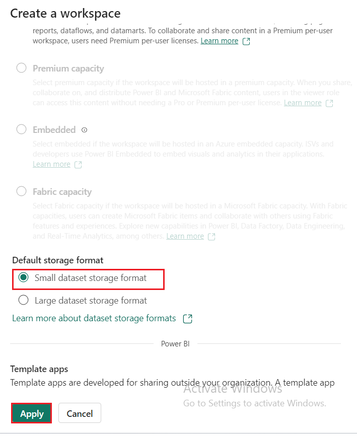
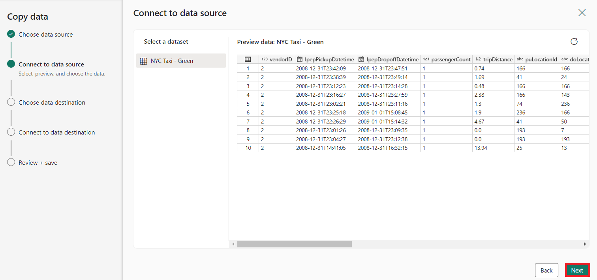
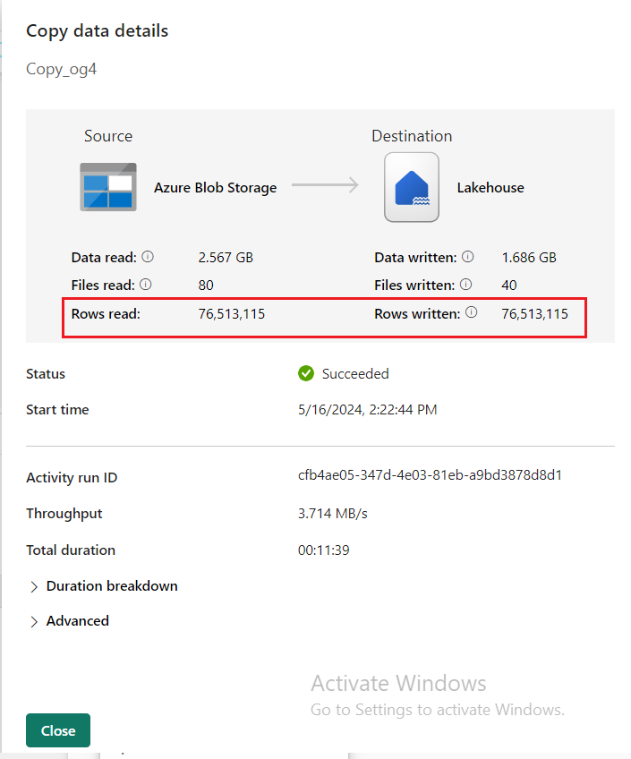
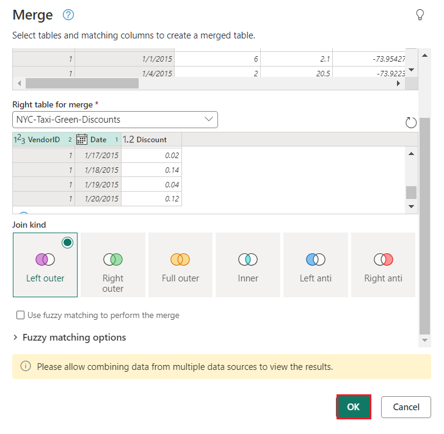
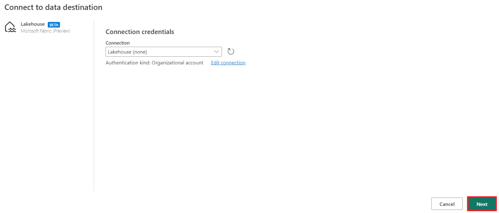
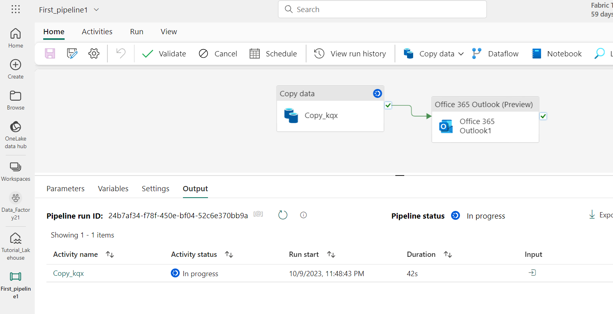
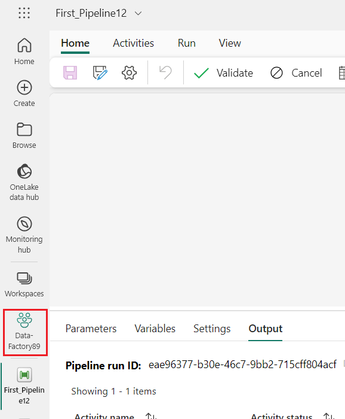

Anwendungsfall 03: Data Factory-Lösung zum Verschieben und
Transformieren von Daten mit Dataflows und Datenpipelines

**Einleitung**

Dieses Lab hilft Ihnen, den Evaluierungsprozess für Data Factory in
Microsoft Fabric zu beschleunigen, indem es eine
Schritt-für-Schritt-Anleitung für ein vollständiges
Datenintegrationsszenario innerhalb einer Stunde bereitstellt. Am Ende
dieses Tutorials verstehen Sie den Wert und die wichtigsten Funktionen
von Data Factory und wissen, wie Sie ein allgemeines
End-to-End-Datenintegrationsszenario ausführen.

**Ziel**

Das Lab ist in drei Module unterteilt:

- Übung 1: Erstellen einer Pipeline mit Data Factory zum Erfassen von
  Rohdaten aus einem Blob Storage in einer Bronze-Tabelle in einem Data
  Lakehouse.

- Übung 2: Transformieren von Daten mit einem Dataflow in Data Factory,
  um die Rohdaten aus der Bronze-Tabelle zu verarbeiten und in eine
  Gold-Tabelle in der Daten-Lakehouse zu verschieben.

- Übung 3: Automatisieren und Senden von Benachrichtigungen mit Data
  Factory, um eine E-Mail zu senden, um Sie zu benachrichtigen, sobald
  alle Aufträge abgeschlossen sind, und schließlich den gesamten Ablauf
  so einzurichten, dass er nach einem Zeitplan ausgeführt wird.

# Übung 1: Erstellen einer Pipeline mit Data Factory

**Wichtig**

Microsoft Fabric befindet sich derzeit in der VORSCHAU. Diese
Informationen beziehen sich auf ein Vorabprodukt, das vor seiner
Veröffentlichung erheblich geändert werden kann. Microsoft übernimmt
keine ausdrücklichen oder stillen Garantien in Bezug auf die hier
bereitgestellten Informationen. Informationen zum [***Dienst in Azure
finden Sie in
der***](https://learn.microsoft.com/en-us/azure/data-factory/) Azure
Data Factory-Dokumentation.

## Aufgabe 1: Erstellen eines Workspace

Bevor Sie mit Daten in Fabric arbeiten, erstellen Sie einen Workspace
mit aktivierter Fabric-Testversion.

1.  Öffnen Sie Ihren Browser, navigieren Sie zur Adressleiste, und geben
    Sie die folgende URL ein oder fügen Sie sie ein:
    <https://app.fabric.microsoft.com/> Drücken Sie dann **Enter**.

> 
>
> **Hinweis**: Wenn Sie zur Microsoft Fabric-Startseite weitergeleitet
> werden, überspringen Sie die Schritte von \#2 bis \#4.

2.  Geben Sie im Microsoft **Fabric-Fenster** Ihre Anmeldeinformationen
    ein, und klicken Sie auf die Schaltfläche **Submit**.

> 

3.  Geben Sie dann im **Microsoft-Fenster** das Passwort ein und klicken
    Sie auf die Schaltfläche **Sign In.**

> 

4.  In **Stay signed in?** klicken Sie auf die Schaltfläche **Yes**.

> 

5.  Erstellen Sie ein neues Eventhouse, indem Sie in der
    Navigationsleiste auf den Button +**New Workshop** klicken.

> 

6.  Geben Sie auf der Registerkarte **Create a workspace** die folgenden
    Details ein und klicken Sie auf die Schaltfläche **Apply**.

[TABLE]

> 

7.  Warten Sie, bis die Bereitstellung abgeschlossen ist. Es dauert ca.
    2-3 Minuten.

8.  Navigieren Sie auf der **Data-FactoryXX-**Workspace Seite, klicken
    Sie auf die Schaltfläche **+New Item** und wählen Sie dann
    **Lakehouse** aus**.**

> 
>
> 

9.  Geben Sie im Dialogfeld **New
    Lakehouse**+++**DataFactoryLakehouse**+++ in das Feld **Name** ein,
    klicken Sie auf die Schaltfläche **Create** und öffnen Sie das neue
    Lakehouse.

> 

10. Klicken Sie nun im linken Navigationsbereich auf **Data-FactoryXX.**

##  Aufgabe 2: Erstellen einer Datenpipeline

1.  Erstellen Sie ein neues Lakehouse, indem Sie in der
    Navigationsleiste auf die Schaltfläche +**New Item** klicken.
    Klicken Sie auf die Kachel **Data Pipeline.**

2.  Geben Sie im Dialogfeld **New Pipeline** +++ **First_Pipeline1**+++
    in das Feld **Name** ein und klicken Sie dann auf die Schaltfläche
    **Create**.

> 

## Aufgabe 3: Verwenden einer Kopieraktivität in der Pipeline zum Laden von Beispieldaten in ein Daten-Lakehouse

1.  Wählen Sie auf der Startseite **First_Pipeline1\>** **Copy data
    assistant** aus, um den Copy Assistant zu öffnen.

> 

2.  Das Dialogfeld **Copy Data** wird angezeigt, wobei der erste
    Schritt, **Choose data source**, hervorgehoben ist. Wählen Sie den
    Abschnitt **Sample Data** und dann den Datenquellentyp **NYC
    Taxi-Green** aus. Wählen Sie dann **Next**.

3.  Klicken Sie in der Verbindung **Connect to data source** auf die
    Schaltfläche **Next**.

4.  Wählen Sie für den Schritt **Choose data destination** des
    Kopierassistenten die Option **Lakehouse** und dann **Next** aus.

5.  Wählen Sie OneLake Data Hub und wählen sie dann **Existing
    Lakehouse** auf der Konfigurationsseite für das Datenziel, die
    angezeigt wird.

6.  Konfigurieren Sie nun die Details Ihres Lakehouse-Ziels auf der
    Registerkarte **Select and map to folder path or table**. Wählen Sie
    **Tables** für den **Root folder** aus, geben Sie einen
    Tabellennamen +++**Bronze**+++ an, und wählen Sie **Next** aus.

> 

7.  Überprüfen Sie abschließend auf der Seite **Review + save** des
    Assistenten zum Kopieren von Daten die Konfiguration. Deaktivieren
    Sie für dieses Lab das Kontrollkästchen **Start data transfer
    immediately**, da wir die Aktivität im nächsten Schritt manuell
    ausführen. Wählen Sie dann **OK**.

## **Aufgabe 4: Ausführen und Anzeigen der Ergebnisse der Copy Activity**.

1.  Wählen Sie auf der Registerkarte **Home** des Fensters des
    Pipeline-Editors die Schaltfläche **Run**
    aus.

2.  In der Dialogbox **Save and run?** klicken Sie auf **Save and run**
    um diese Aktivitäten auszuführen. Diese Aktivität dauert ca. 11-12
    Minuten.

> 

3.  Sie können die Ausführung überwachen und die Ergebnisse auf der
    Registerkarte **Output** unterhalb des Pipelinezeichenbereichs
    überprüfen. Wählen Sie den **activity name** als **Copy_ihy** aus,
    um die Ausführungsdetails anzuzeigen.

4.  Die Ausführungsdetails zeigen 76.513.115 gelesene und geschriebene
    Zeilen an.

5.  Erweitern Sie den Abschnitt **Duration breakdown**, um die Dauer der
    einzelnen Phasen der Kopieraktivität anzuzeigen. Nachdem Sie die
    Kopierdetails überprüft haben, wählen Sie **Close** aus.

**Übung 2: Transformieren von Daten mit einem Dataflow in Data Factory**

## Aufgabe 1: Abrufen von Daten aus einer Lakehouse-Tabelle

1.  Wählen Sie auf der Seite **First_Pipeline 1** in der Seitenleiste
    **Create** aus.

2.  Klicken Sie auf der **Data Factory Data-FactoryXX-Startseite** unter
    der **Data Factory** auf Dataflow Gen2, um einen neuen **Dataflow
    Gen2** zu erstellen**.**  

3.  Klicken Sie im Menü new dataflow im Bereich **Power Query** auf
    **Get data** und wählen Sie dann **more** aus.

> 

4.  Auf der Registerkarte **Choose data source** gibt das Suchfeld den
    Suchtyp +++**Lakehouse+++** und klicken Sie dann auf den
    **Lakehouse**-Konnektor**.**

> 

5.  Das Dialogfeld **Connect to data source** wird angezeigt, wählen Sie
    **Edit connection** aus**.** 

6.  Wählen Sie im Dialogfeld **Connect to data source** die Option Mit
    Ihrem Power BI-Organisationskonto **Sign in** aus, um die Identität
    festzulegen, die der Datenfluss für den Zugriff auf das Lakehouse
    verwendet.

7.  Wählen Sie im Dialogfeld **Connect to data source** die Option
    **Next.**

> 

8.  Das Dialogfeld **Choose data** wird angezeigt. Verwenden Sie den
    Navigationsbereich, um das Lakehouse zu finden, das Sie im
    vorherigen Modul für das Ziel erstellt haben, wählen Sie die
    Datentabelle **DataFactoryLakehouse** aus und klicken Sie dann auf
    die Schaltfläche **Create**.

9.  Sobald Ihre Arbeitsfläche mit den Daten gefüllt ist, können Sie
    **column profile** festlegen, da dies für die Erstellung von
    Datenprofilen nützlich ist. Sie können die richtige Transformation
    anwenden und darauf basierend die richtigen Datenwerte festlegen.

10. Wählen Sie dazu im Menübandbereich **Options** aus, wählen Sie dann
    die ersten drei Optionen unter **Column profile** aus, und wählen
    Sie dann **OK** aus.

## Aufgabe 2: Transformieren der aus dem Lakehouse importierten Daten

1.  Wählen Sie das Datentypsymbol in der Spaltenüberschrift der zweiten
    Spalte, **IpepPickupDatetime**, aus, um mit der **rechten
    Maustaste** auf das Menü zu klicken, und wählen Sie im Menü den
    **Change Type** aus, um die Spalte vom Typ **Date/Time** in den
    **Date Type** zu konvertieren. 

2.  Wählen Sie auf der Registerkarte **Home** des Menübands die Option
    **Choose columns** aus der **Manage columns** group aus.

3.  Deaktivieren Sie im Dialogfeld **Choose columns** einige der hier
    aufgeführten Spalten, und wählen Sie dann **OK**.

    - lpepDropoffDatetime

    &nbsp;

    - puLocationId

    &nbsp;

    - doLocationId

    &nbsp;

    - pickupLatitude

    &nbsp;

    - dropoffLongitude

    &nbsp;

    - rateCodeID

> 

4.  Wählen Sie das **Dropdown**-Menü für Filter und Sortierung in der
    Spalte **storeAndFwdFlag** aus. (Wenn eine Warnung angezeigt wird,
    **Die Liste ist möglicherweise unvollständig**. Wählen Sie **Load
    More** aus, um alle Daten anzuzeigen.)

5.  Wählen Sie "**Y"** aus, um nur Zeilen anzuzeigen, auf die ein Rabatt
    angewendet wurde, und wählen Sie dann **OK**.

6.  Wählen Sie das Dropdown-Menü **Ipep_Pickup_Datetime** Spalten
    sortieren und filtern aus, wählen Sie dann **Date filters** aus und
    wählen Sie die Option **Between...** Filter für Date- und
    Date/Time-Typen bereitgestellt.

11. Wählen Sie im Dialogfeld **Filter rows** die Daten zwischen **dem 1.
    Januar 2015** und **dem 31. Januar 2015 aus**, und wählen Sie dann
    **OK** aus.

> 

## Aufgabe 3: Herstellen einer Verbindung mit einer CSV-Datei mit Rabattdaten

Nachdem wir nun die Daten aus den Fahrten gespeichert haben, möchten wir
die Daten laden, die die jeweiligen Rabatte für jeden Tag und die
VendorID enthalten, und die Daten vorbereiten, bevor wir sie mit den
Fahrtdaten kombinieren.

1.  Wählen Sie auf der Registerkarte **Start** im Menü des
    Datenfluss-Editors die Option **Get Data** aus, und wählen Sie dann
    **Text/CSV** aus.

2.  Wählen Sie im Bereich **Connect to data source** unter **Connection
    settings** das Optionsfeld **Upload file (Preview)** aus, klicken
    Sie dann auf die Schaltfläche **Browse** und durchsuchen Sie Ihre VM
    **C:\LabFiles**, wählen Sie dann die Datei
    **NYC-Taxi-Green-Discounts** aus und klicken Sie auf die
    Schaltfläche **Open**.

3.  Klicken Sie im Bereich **Connect to data source** die Schaltfläche
    **Next**.

4.  Wählen Sie im Dialogfeld **Preview file data** die Option
    **Create**.

## Aufgabe 4: Transformieren der Rabattdaten

1.  Beim Überprüfen der Daten sehen wir, dass sich die Überschriften in
    der ersten Zeile zu befinden scheinen. Stufen Sie sie zu
    Überschriften herauf, indem Sie das Kontextmenü der Tabelle oben
    links im Vorschau-Rasterbereich auswählen, um **Use first row as
    headers**.

***Hinweis:** Nachdem Sie die Überschriften heraufgestuft haben, sehen
Sie einen neuen Schritt, der dem Bereich **"Applied Steps"** oben im
Datenfluss-Editor für die Datentypen Ihrer Spalten hinzugefügt wurde.*

2.  Klicken Sie mit der rechten Maustaste auf die Spalte **VendorID**,
    und wählen Sie im angezeigten Kontextmenü die Option **Unpivot other
    columns** aus. Auf diese Weise können Sie Spalten in
    Attribut-Wert-Paare transformieren, wobei Spalten zu Zeilen werden.

3.  Wenn die Tabelle nicht pivotiert ist, benennen Sie die Spalten
    **Attribut** und **Value** um, indem Sie darauf doppelklicken und
    **Attribut** in **Date** und **Value** in **Discount** ändern.

4.  Ändern Sie den Datentyp der Spalte Datum, indem Sie das Datentypmenü
    links neben dem Spaltennamen auswählen und dann **Date** auswählen.

5.  Wählen Sie die Spalte **Discount** und dann im Menü die
    Registerkarte **Transform** aus. Wählen Sie **Number Column** aus,
    wählen Sie dann im Untermenü numerische **Standard**transformationen
    aus, und wählen Sie **Divide** aus.

6.  Geben Sie im Dialogfeld **Divide** den Wert +++100+++ ein und
    klicken Sie dann auf die Schaltfläche OK.

**Aufgabe 5: Kombinieren von Fahrten- und Rabattdaten**

Der nächste Schritt besteht darin, beide Tabellen in einer einzigen
Tabelle zu kombinieren, die den Rabatt enthält, der auf die Reise
angewendet werden soll, und die angepasste Summe.

1.  Schalten Sie zunächst die Schaltfläche **Diagram view** um, damit
    Sie beide Abfragen sehen können.

2.  Wählen Sie die **Bronze**-Abfrage aus, und wählen Sie auf der
    Registerkarte **Home** das Menü **Combine** aus**,** und wählen Sie
    **Merge queries** und dann **Merge queries as new** aus**.**

3.  Wählen Sie im Dialogfeld **Merge** in der Dropdown-Liste **Right
    table for merge** die Option
    **Generated-NYC-Taxi-Green-Discounts** aus, und wählen Sie dann das
    Symbol **light bulb** oben rechts im Dialogfeld aus, um die
    vorgeschlagene Zuordnung von Spalten zwischen den drei Tabellen
    anzuzeigen.

4.  Wählen Sie nacheinander jede der beiden vorgeschlagenen
    Spaltenzuordnungen aus, und ordnen Sie die Spalten VendorID und date
    aus beiden Tabellen zu. Wenn beide Zuordnungen hinzugefügt werden,
    werden die übereinstimmenden Spaltenüberschriften in jeder Tabelle
    hervorgehoben.

5.  Es wird eine Meldung angezeigt, in der Sie aufgefordert werden, das
    Kombinieren von Daten aus mehreren Datenquellen zuzulassen, um die
    Ergebnisse anzuzeigen. Wählen Sie **OK** aus. 

6.  Im Tabellenbereich wird zunächst die Warnung "Die Auswertung wurde
    abgebrochen, da durch das Kombinieren von Daten aus mehreren Quellen
    Daten von einer Quelle in eine andere gelangen können. Wählen Sie
    Continue aus, wenn die Möglichkeit, Daten preiszugeben, in Ordnung
    ist." Wählen Sie **Continue** aus, um die kombinierten Daten
    anzuzeigen.

7.  Aktivieren Sie im Dialogfeld **Privacy Levels** das
    **Kontrollkästchen: Ignore Privacy Lavels checks for this document.
    Ignoring privacy Levels could expose sensitive or confidential data
    to an unauthorized person** und klicken Sie auf die Schaltfläche
    **Save**.

8.  Beachten Sie, wie in der Diagrammansicht eine neue Abfrage erstellt
    wurde, in der die Beziehung der neuen Mergeabfrage zu den beiden
    zuvor erstellten Abfragen angezeigt wird. Scrollen Sie im
    Tabellenbereich des Editors nach rechts in der Liste der
    Mergeabfragespalten, um eine neue Spalte mit Tabellenwerten
    anzuzeigen. Dies ist die Spalte "Generierte NYC-Taxi-Green-Rabatte"
    und ihr Typ ist **\[Table\].** In der Spaltenüberschrift befindet
    sich ein Symbol mit zwei Pfeilen, die in entgegengesetzte Richtungen
    gehen, sodass Sie Spalten aus der Tabelle auswählen können.
    Deaktivieren Sie alle Spalten mit Ausnahme von **Discount**, und
    wählen Sie dann **OK**.

9.  Da sich der Rabattwert nun auf Zeilenebene befindet, können wir eine
    neue Spalte erstellen, um den Gesamtbetrag nach Abzug des Abzugs zu
    berechnen. Wählen Sie dazu die Schaltfläche **Add column** am oberen
    Rand des Editors, und wählen Sie **Custom column** aus der Gruppe
    **General**.

10. Im Dialogfeld **Custom column** können Sie die [Power
    Query-Formelsprache (auch als M bezeichnet)
    verwenden,](https://learn.microsoft.com/en-us/powerquery-m) um zu
    definieren, wie die neue Spalte berechnet werden soll. Geben Sie
    +++TotalAfterDiscount+++ als **New column name**, wählen Sie
    **Currency** als **Data Type** aus, und geben Sie den folgenden
    M-Ausdruck für die **Custom column formula** an:

> *+++if \[totalAmount\] \> 0 then \[totalAmount\] \* ( 1 -\[Discount\]
> ) else \[totalAmount\]+++*
>
> Wählen Sie dann **OK**.

11. Wählen Sie die neu erstellte Spalte **TotalAfterDiscount** aus, und
    wählen Sie dann oben im Editorfenster die Registerkarte
    **Transform** aus. Wählen Sie in der **Number column** die
    Dropdownliste **Rounding** aus, und wählen Sie dann **Round**
    aus**...**.

12. Geben Sie im Dialogfeld **Round** 2 für die Anzahl der
    Dezimalstellen ein, und wählen Sie dann **OK**.

> 

13. Ändern Sie den Datentyp von **IpepPickupDatetime** von **Date** in
    **Date/Time**.

14. Erweitern Sie abschließend den Bereich **Query settings** auf der
    rechten Seite des Editors, falls er noch nicht erweitert ist, und
    benennen Sie die Abfrage von **Merge** in **Output** um.

**Aufgabe 6: Laden der Ausgabeabfrage in eine Tabelle im Lakehouse**

Nachdem die Ausgabeabfrage nun vollständig vorbereitet und die Daten zur
Ausgabe bereit sind, können wir das Ausgabeziel für die Abfrage
definieren.

1.  Wählen Sie die zuvor erstellte Seriendruckabfrage **Output** aus.
    Wählen Sie dann im Editor die Registerkarte **Home** aus, und **Add
    data destination** aus der Gruppierung Query, um ein Ziel in
    **Lakehouse** auszuwählen.

2.  Im Dialogfeld **Connect to data destination** sollte Ihre Verbindung
    bereits ausgewählt sein. Wählen Sie **Next** aus, um fortzufahren.

3.  Navigieren Sie im Dialogfeld **Choose destination target** zu dem
    Lakehouse, in das Sie die Daten laden möchten, benennen Sie die neue
    Tabelle+++ **nyc_taxi_with_discounts+++**, und wählen Sie dann
    erneut **Next** aus.

4.  Behalten Sie im Dialogfeld **Choose destination settings** die
    standardmäßige Aktualisierungsmethode **Replace** bei, überprüfen
    Sie, ob die Spalten korrekt zugeordnet sind, und wählen Sie **Save
    settings**.

5.  Vergewissern Sie sich im Hauptfenster des Editors, dass das
    Ausgabeziel im Bereich **Query Setting** für die Tabelle **Output**
    angezeigt wird, und wählen Sie dann **Publish** aus.

6.  Auf der Workspace Seite können Sie Ihren Dataflow umbenennen, indem
    Sie die Auslassungspunkte rechts neben dem Dataflownamen auswählen,
    der nach dem Auswählen der Zeile angezeigt wird, und dann
    **Properties**.

7.  Geben Sie im Dialogfeld
    **Dataflow1**+++**nyc_taxi_data_with_discounts+++** im Feld Name und
    wählen Sie dann **Save**.

> 

8.  Wählen Sie das Aktualisierungssymbol für den Datenfluss aus, nachdem
    Sie die Zeile ausgewählt haben, und wenn Sie fertig sind, sollte
    Ihre neue Lakehouse-Tabelle wie in den **Data Destination**
    konfiguriert erstellt sehen.

9.  Im Bereich **Data_FactoryXX**, wählen Sie **DataFactoryLakehouse**,
    um die neue Tabelle anzuzeigen, die dort geladen wurde.

# Übung 3: Automatisieren und Senden von Benachrichtigungen mit Data Factory

**Wichtig**

Microsoft Fabric befindet sich derzeit in der VORSCHAU. Diese
Informationen beziehen sich auf ein Vorabprodukt, das vor seiner
Veröffentlichung erheblich geändert werden kann. Microsoft übernimmt
keine ausdrücklichen oder stille Garantien in Bezug auf die hier
bereitgestellten Informationen. Informationen zum [***Dienst in Azure
finden Sie in der Azure Data
Factory-Dokumentation***](https://learn.microsoft.com/en-us/azure/data-factory/).

## Aufgabe 1: Hinzufügen einer Office 365 Outlook-Aktivität zu Ihrer Pipeline

1.  Navigieren Sie auf **Tutorial_Lakehouse** Seite und klicken Sie im
    linken Navigationsmenü auf **Data_FactoryXX** Workspace.

2.  Wählen Sie in der **Data_FactoryXX** Ansicht das Symbol
    **First_Pipeline1** aus.

3.  Wählen Sie im Pipeline-Editor die Registerkarte **Activities** aus,
    und suchen Sie die **Office Outlook-**Aktivität.

4.  Wählen Sie den Pfad **On success** (ein grünes Kontrollkästchen oben
    rechts neben der Aktivität im Pipelinebereich**)** aus, und ziehen
    Sie ihn aus Ihrer **Copy Activitiy** in Ihre neue **Office 365
    Outlook-**Aktivität.

5.  Wählen Sie die Office 365 Outlook-Aktivität aus dem Pipeline-Canvas
    aus, und wählen Sie dann die Registerkarte **Settings** des
    Eigenschaftenbereichs unterhalb des Canvas aus, um die E-Mail zu
    konfigurieren. Klicken Sie auf die Schaltfläche **Sign In**.

6.  Wählen Sie Ihr Power BI-Organisationskonto aus, und wählen Sie dann
    zur **Allow access** aus.

**Hinweis:** Der Dienst unterstützt derzeit keine persönlichen E-Mails.
Sie müssen eine Unternehmens-E-Mail-Adresse verwenden.

7.  Wählen Sie die Office 365 Outlook-Aktivität aus dem Pipeline-Canvas
    auf der Registerkarte **Settings** des Eigenschaftenbereichs
    unterhalb des Canvas aus, um die E-Mail zu konfigurieren.

    - Geben Sie Ihre E-Mail-Adresse im Abschnitt **To** ein. Wenn Sie
      mehrere Adressen verwenden möchten, verwenden Sie; um sie zu
      trennen.

    &nbsp;

    - Wählen Sie für den **Subject** das Feld aus, sodass die Option
      **Add dynamic content** angezeigt wird, und wählen Sie es dann
      aus, um den Zeichenbereich des Pipelineausdrucks-Generators
      anzuzeigen.

8.  Das Dialogfeld **Pipeline expression builder** wird angezeigt. Geben
    Sie den folgenden Ausdruck ein, und wählen Sie dann **OK**:

> *@concat('DI in an Hour Pipeline Succeeded with Pipeline Run Id',
> pipeline().RunId)*

9.  Wählen Sie für den **Body** das Feld erneut aus, und wählen Sie die
    Option **View in expression builder** aus, wenn sie unter dem
    Textbereich angezeigt wird. Fügen Sie im angezeigten Dialogfeld
    **Pipeline expression builder** den folgenden Ausdruck erneut hinzu,
    und wählen Sie dann **OK** aus:

> *@concat('RunID = ', pipeline().RunId, ' ; ', 'Copied rows ',
> activity('Copy data1').output.rowsCopied, ' ; ','Throughput ',
> activity('Copy data1').output.throughput)*

**Hinweis:** Ersetzen Sie **Copy data1** durch den Namen Ihrer eigenen
Pipeline-Kopieraktivität.

10. Wählen Sie abschließend oben im Pipeline-Editor die Registerkarte
    **Home** aus, und klicken Sie dann auf **Run**. Wählen Sie dann im
    Bestätigungsdialogfeld **Save and** **Run** aus, um diese
    Aktivitäten auszuführen.

> 
>
> 
>
> 

11. Nachdem die Pipeline erfolgreich ausgeführt wurde, überprüfen Sie
    Ihre E-Mails, um die Bestätigungs-E-Mail zu finden, die von der
    Pipeline gesendet wurde.

**Aufgabe 2: Planen der Pipelineausführung**

Sobald Sie die Entwicklung und das Testen Ihrer Pipeline abgeschlossen
haben, können Sie die automatische Ausführung planen.

1.  Wählen Sie auf der Registerkarte **Home** des Fensters des
    Pipeline-Editors die Option **Schedule**.

2.  Konfigurieren Sie den Zeitplan nach Bedarf. Im folgenden Beispiel
    wird die Pipeline so geplant, dass sie bis zum Ende des Jahres
    täglich um 20:00 Uhr ausgeführt wird.

***Aufgabe 3:* Hinzufügen einer Dataflow-Aktivität zur Pipeline**

1.  Zeigen Sie mit der Maus auf die grüne Linie, die die **Copy
    activity** und die **Office 365 Outlook-Aktivität** auf Ihrer
    Pipeline-Arbeitsfläche verbindet, und wählen Sie die Schaltfläche
    **+** aus, um eine neue Aktivität einzufügen.

> 

2.  Wählen Sie **Dataflow** aus dem angezeigten Menü aus.

3.  Die neu erstellte Dataflow-Aktivität wird zwischen der Copy-Aktivity
    und der Office 365 Outlook-Aktivity eingefügt und automatisch
    ausgewählt, wobei ihre Eigenschaften im Bereich unterhalb des
    Zeichenbereichs angezeigt werden. Wählen Sie im Eigenschaftenbereich
    die Registerkarte **Settings** aus, und wählen Sie dann den Dataflow
    aus, der in **Übung 2: Transformieren von Daten mit einem Dataflow
    in Data Factory erstellt wurde**.

12. Wählen Sie oben im Pipeline-Editor die Registerkarte **Home** aus,
    und wählen Sie **Run** aus. Wählen Sie dann im
    Bestätigungsdialogfeld **Save and Run** aus, um diese Aktivitäten
    auszuführen.

## Aufgabe 4: Bereinigen von Ressourcen

Sie können einzelne Berichte, Pipelines, Warehouses und andere Elemente
löschen oder den gesamten Workspace entfernen. Führen Sie die folgenden
Schritte aus, um das Workspace zu löschen, den Sie für dieses Tutorial
erstellt haben.

1.  Wählen Sie Ihrem Workspace, die **Data-FactoryXX,** aus dem linken
    Navigationsmenü aus. Es öffnet sich die Ansicht der Workspace
    Elemente.

2.  Wählen Sie die Option ***...*** unter dem Namen des Workspace und
    wählen Sie **Workspace settings**.

3.  Wählen Sie, **Other** und **Remove this workspace.**

