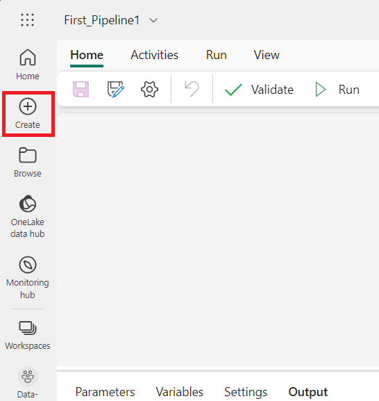
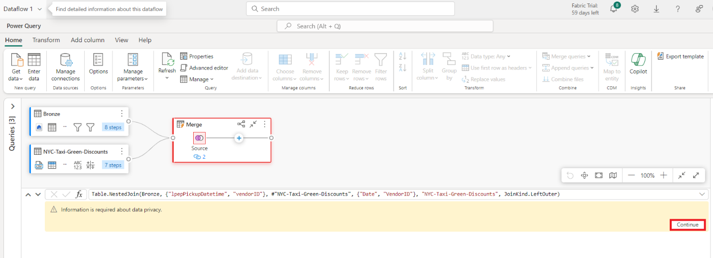
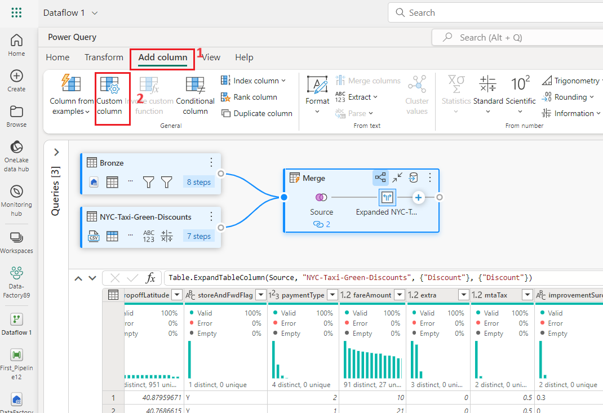
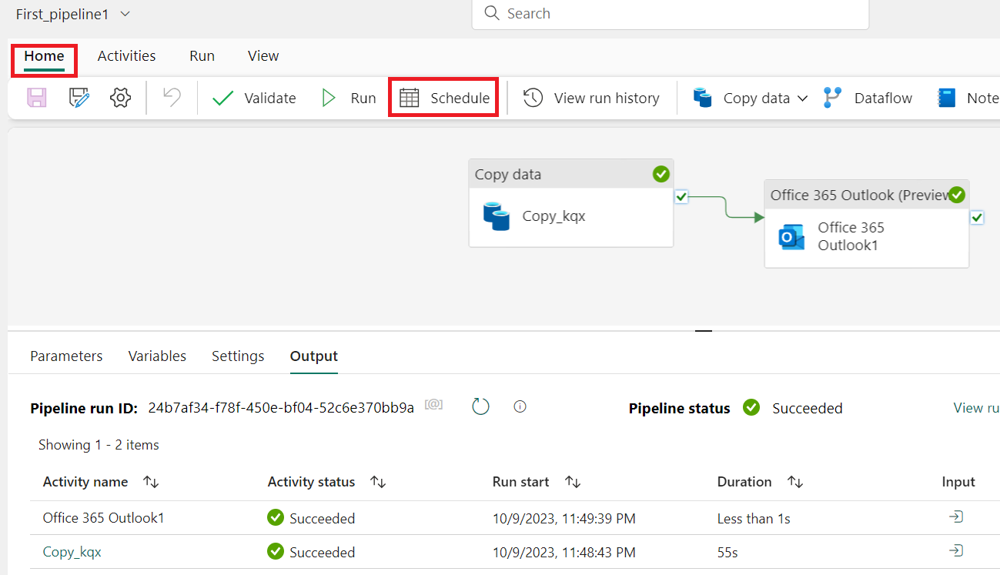

ユース ケース 03: データフローとデータ
パイプラインを使用してデータを移動および変換するための Data Factory
ソリューション

**紹介**

このラボでは、1時間以内に完全なデータ統合シナリオを段階的に説明するガイダンスを提供することで、Microsoft
FabricにおけるData
Factoryの評価プロセスを加速させます。このチュートリアルを完了すると、Data
Factoryの価値と主要な機能を理解し、一般的なエンドツーエンドのデータ統合シナリオを実行する方法を習得できます。

**目的**

ラボは 3 つのモジュールに分かれています:

- 演習 1: Data Factory を使用してパイプラインを作成し、BLOB
  ストレージからデータ Lakehouseの Bronze
  テーブルに生データを取り込みます。

- 演習 2: Data Factory のデータフローを使用してデータを変換し、Bronze
  テーブルからの生データを処理して、データ Lの Gold
  テーブルに移動します。

- 演習 3: Data Factory
  を使用して通知を自動化し、すべてのジョブが完了したらメールで通知を送信します。最後に、フロー全体をスケジュールに従って実行するように設定します。

# 手順 1: Create a pipeline with Data Factory

** Important**

Microsoft Fabric is currently in PREVIEW. This information relates to a
prerelease product that may be substantially modified before it's
released. Microsoft makes no warranties, expressed or implied, with
respect to the information provided here. Refer to [***Azure Data
Factory
documentation***](https://learn.microsoft.com/en-us/azure/data-factory/) for
the service in Azure.

## タスク 1: Create a workspace

Fabric でデータを操作する前に、Fabric
試用版を有効にしたワークスペースを作成する。

1.  ブラウザを開き、アドレスバーに移動して、次のURLを入力または貼り付けます:<https://app.fabric.microsoft.com/>
    次に**Enter**ボタンを押します。

> 
>
> **注**: Microsoft Fabric のホーム ページに移動した場合は、#2 から \#4
> までの手順をスキップする。

2.  **Microsoft
    Fabricウィンドに資格情報を入力してSubmitボタンをクリックする。**

> 

3.  次、**Microsoftウィンドにパスワードを入力してSign
    inボタンをクリックする。**

> 

4.  **Stay signed in?ウィンドにYesボタンをクリックする。**

> 

5.  ナビゲーションバーで**+New
    workshop**ボタンをクリックして新しい Eventhouse を作成する。

> 

6.  **Create a
    workspace**タブに以下の詳細を入力して**Apply**ボタンをクリックする。

[TABLE]

> 

7.  展開が完了するまでに待ちます。約2-3 分かかります。

8.  In the **Data-FactoryXXワークスペースページで+New
    item** に移動してクリックし、そして**Lakehouse**を選択する**。**

> 
>
> 

9.  In the **New
    lakehouse**ダイアログボックスで**Nameに**+++**DataFactoryLakehouse+++**を入力して**Create**ボタンをクリックし、新しいlakehouseを開きます。

> 

10. 左側のナビゲーションウィンドウで**Data-FactoryXX**をクリックする**。**

##  タスク 2: データパイプラインの作成

1.  ナビゲーションバーに+New
    itemボタンをクリックして、新しいlakehouseを作成する。 "Data
    pipeline" タイルにクリックする。

2.  **New pipeline**ダイアログボックスで**Name**
    フィールドに+++**First_Pipeline1+++**
    を入力して**Create**ボタンをクリックする**。**

> 

## タスク 3: パイプラインのコピー アクティビティを使用して、サンプル データをデータ Lakehouseに読み込みます。

1.  **First_Pipeline1**ホームページに**Copy data assistant**
    を選択し、アシスタントツールを開きます。

> 

2.  最初のステップで「**Copy data**」ダイアログが表示され、「**Choose
    data source**」がハイライト表示されます。「Sample
    data」セクションを選択し、「**NYC
    Taxi-Green**」データソースタイプを選択します。次、「**Next**」を選択します。

3.  **Connect to data sourceでNextボタンをクリックする。**

4.  コピーアシスタントの**Choose data
    destination**ステップに **Lakehouse**を選択してから**Next**を選択する**。**

5.  表示するdata destination 構成ページでOneLake data
    hubを選択して、**Existing
    Lakehouse**を選択する**。**

6.  今、Lakehouse先の詳細を**Select and map to folder path or
    tableページに設定する。** **Root
    folderのTablesを選択して、**テーブル名を+++**Bronze+++と入力し、Next**を選択する。

> 

7.  最後に、コピーデータアシスタントの「**Review +
    save**」ページで設定を確認します。このラボでは、次のステップでアクティビティを手動で実行するため、「**Start
    data transfer
    immediately**」チェックボックスをオフにします。「**OK**」を選択します。

## **タスク 4: コピーアクティビティを実行して結果を表示する**

1.  パイプラインエディターウィンドの**Home**タブで**Run**ボタンを選択する。

2.  **Save and run?** ダイアログボックスで**Save and
    run**ボタンをクリックしてそのアクティビティを実行する。このアクティビティを完了するには約11‐12分かかります**。**

> 

3.  パイプラインカンバスの**Output** 
    タブで実行を監視して結果を確認できる。**アクティビティ名**を**Copy_ihy**
    と選択して実行の詳細を表示できます。

4.  実行の詳細には、76,513,115
    行が読み取られ、書き込まれたことが示されています。

5.  「**Duration
    breakdown**」セクションを拡張すると、コピーアクティビティの各段階の期間が表示されます。コピーの詳細を確認したら、「Close」を選択します。

**手順 2: Data Factoryのデータフローを使用してデータを変換する**

## タスク 1: Lakehouse表からデータを受け取る

1.  **First_Pipeline 1ページでサイドバーからCreateを選択する。**

2.  **Data Factory Data-FactoryXXホームページで新しい**dataflow gen2
    **を作成するためにData Factory** で**Dataflow Gen2をクリックする。**

3.  新しいdataflowメニューで**Power QueryウィンドにGet
    dataをクリックして**、**More...を選択する。**.

> 

4.  **Choose data sourceタブに 検索ボックスに**tab, search box search
    type +++**Lakehouse+++**
    aを入力して**Lakehouseコネクターをクリックする。**

> 

5.  **Connect to data sourceが表示されて、次Edit
    connectionを選択する。** 

6.  In the **Connect to data sourceダイアログボックスで** Power BI
    組織アカウントを使用して**sign in**
    し、データフローがlakehouseをアクセルするために使用するアイデンティティーを設定する。

7.  **Connect to data sourceダイアログボックスでNextを選択する。**

> 

8.  **Choose
    data**ダイアログが表示されます。ナビゲーションペインから、前のモジュールで作成したLakehouseを探し、**DataFactoryLakehouse**データテーブルを選択して「**Create**」ボタンをクリックします。.

9.  キャンバスにデータが入力されたら、データプロファイリングに役立つ列プロファイル情報を設定できます。これに基づいて適切な変換を適用し、適切なデータ値をターゲットにすることができます。

10. これを行うには、リボン ペインから \[**Options**\]
    を選択し、\[**Column profile**\] の最初の 3
    つのオプションを選択して、\[**OK**\] を選択します。.

## タスク 2: Lakehouseからインポートしたデータの変換

1.  2番目の列IpepPickupDatetimeの列ヘッダーにあるデータ型アイコンを選択して、表示するためにメニューを**右クリック**し、メニューから「**Change
    type**」を選択して、列を**日付/時刻型**から**日付型**に変換します。. 

2.  リボンの**HomeタブでManage columns** グループの**Choose
    columns** オプションを選択する。 

3.  Choose **columnsダイアログで**、
    **ここにリストされているいくつかの列の選択を解除し、OKを選択します**

    - lpepDropoffDatetime

    &nbsp;

    - puLocationId

    &nbsp;

    - doLocationId

    &nbsp;

    - pickupLatitude

    &nbsp;

    - dropoffLongitude

    &nbsp;

    - rateCodeID

> 

4.  **storeAndFwdFlag** 列のフィルター、および並べ替えのドロップダウン
    メニューを選択します。(「**List may be
    incomplete**」という警告が表示された場合は、「**Load more**
    」を選択してすべてのデータを表示します。)

5.  割引が適用された行のみを表示するには「**Y**」を選択し、「**OK**」を選択します。

6.  **Ipep_Pickup_Datetime**列の並べ替えを選択して、ドロップダウンメニュをフィルターしてから、**Date
    filters**を選択してから、日付と日付/時刻タイプ向けに提供される**Between...**フィルターを選択します。.

11. **Filter rowsダイアログでJanuary 1, 2015**, と**January 31,
    201間の日付を選択して、OK**を選択する。

> 

## 

## タスク 3: 割引データを含むCSVファイルに接続する

> これで、トリップのデータが揃ったので、各日とベンダーIDのそれぞれの割引を含むデータをロードし、トリップデータと組み合わせる前にデータを準備します。.

1.  データフローエディターメニューにある**HomeタブにGet
    dataオプション選択してからText/CSV**を選択する。

2.  **Connect to data sourceウィンドにConnection settingsのUpload file
    (Preview)ラジオボタンを選択して 、Browse** ボタンをクリックして、VM
    **C:\LabFiles**
    をブラウズしてからを選択し、**NYC-Taxi-Green-Discounts**
    を選択してから**Openボタンをクリック**。

3.  **Connect to data sourceウィンドにNextボタンをクリックする。**

4.  **Preview file data**ダイアログでで**Create**を選択する。

## タスク 4: 割引データの変換

1.  データを確認すると、ヘッダーが最初の行にあることがわかります。プレビューグリッド領域の左上にあるテーブルのコンテキストメニューを選択し、「**Use
    first row as headers**」を選択して、ヘッダーに昇格します.

*** ***注: ヘッダーを昇格すると、データフロー エディターの上部にある
\[Applied steps\]
ウィンドに、列のデータ型に新しいステップが追加されます。.

2.  **VendorID** columnを右クリックして表示されたコンテキスメニュで、**Unpivot
    other columns**
    のオプションを選択する。これにより、列を属性と値のペアに変換することができ、列が行になります。

3.  テーブルをピボットしていない状態で、\[**Attribute**\] 列と
    \[**Value**\] 列をダブルクリックし、\[**Attribute**\] を
    \[**Date**\] に、\[**Value**\] を \[**Discount**\]
    に名前を変更します

4.  Date列のデータタイプを変更するには列名の左側にあるデータタイプメニューを選択して**Date**を選択する。

5.  「**Discount**」列を選択し、メニューの「**Transform**」タブを選択します。「**Number
    column**」を選択し、サブメニューから「**Standard numeric
    transformations**」を選択し、「**Divide**」を選択します。.

6.  **Divide**ダイアログで**+++100+++**の値を入力して**OK**ボタンを選択する**。**

**タスク 5: トリップと割引データを組み合わせる**

次のステップは、両方のテーブルを、トリップに適用する割引と調整された合計を含む1つのテーブルに結合することです。

1.  まず、**Diagram
    viewー**ボタンを切り替えて、両方のクエリが表示されるようにします.

2.  **Bronze**クエリを選択し、**Home**タブでCombineメニューを選択し、**Merge
    queries**を選択し、**Merge queries as new**を選択します。

3.  **Mergeダイアログで** **Right table for
    merge** のドロップダウンから**Generated-NYC-Taxi-Green-Discountsを選択して** からダイアログの右上の"**light
    bulb**"アイコンを選択して三つのテーブル間推奨された列のマッピングを表示する。

1.  推奨される 2 つの列マッピングをそれぞれ 1
    つずつ選択し、両方のテーブルの VendorID 列と date
    列をマッピングします。両方のマッピングが追加されると、一致した列ヘッダーが各テーブルで強調表示されます。

1.  複数のデータソースからのデータを組み合わせて結果を表示することを許可するようのメッセージが表示されます。\[**OK\]
    を選択します**

4.  テーブル領域には、最初に「複数のソースからのデータを組み合わせると、あるソースのデータが別のソースに漏れる可能性があるため、評価はキャンセルされました。データが漏れる可能性に問題がない場合は、Continueを選択してください。」という警告が表示されます。**Continue**を選択すると、結合されたデータが表示されます。

5.  Privacy Levels ダイアログボックスで「**Ignore Privacy Lavels checks
    for this document. Ignoring privacy Levels could expose sensitive or
    confidential data to an unauthorized
    person」**チェックボックスを選択してSaveボタンをクリックする**。**

6.  ダイアグラムビューに新しいクエリが作成され、新しいマージクエリと以前に作成した2つのクエリの関係が表示されています。エディターのテーブルペインで、マージクエリの列リストの右までスクロールすると、テーブル値を持つ新しい列が表示されます。これは「Generated
    NYC
    Taxi-Green-Discounts」列であり、種類は\[**Table**\]です。列ヘッダーには、反対方向に2つの矢印が付いたアイコンがあり、これを使用してテーブルから列を選択できます。Discount以外のすべての列の選択を解除し、\[**OK**\]を選択します。

7.  割引値が行レベルに設定されたので、割引後の合計金額を計算するための新しい列を作成できます。そのためには、エディター上部の「**Add
    column**」タブを選択し、「**General**」グループから「**Custom
    column**」を選択します。

8.  「**Custom column**」ダイアログでは、Power
    Queryの式言語（M）を使用して、新しい列の計算方法を定義できます。「**New
    column name**」に「**+++TotalAfterDiscount+++**」と入力し、「**Data
    type**」で「Currency」を選択し、「Custom column
    formula」に次のM式を入力します。:

> *+++if \[totalAmount\] \> 0 then \[totalAmount\] \* ( 1 -\[Discount\]
> ) else \[totalAmount\]+++*
>
> それから**OK**を選択する

9.  新規作成された**TotalAfterDiscount列を選択してエディターウィンドの上にあるTransformタブを選択する。Number
    columnグループでRoundingドロップダウンを選択してからRound...**.を選択する。  

10. **Round**ダイアログで、
    小数点以下の桁数に**2**を入力し、**OK**を選択します.

> 

11. **IpepPickupDatetimeのデータタイプをDate** から
    **Date/Time**に変更する。

12. 最後に、エディターの右側にある**クエリ**設定ペインがまだ展開されていない場合は展開し、クエリの名前を
    **Merge** から **Output** に変更します。

**タスク 6: 出力クエリを Lakehouse のテーブルに読み込みます**

出力クエリが完全に準備され、データの出力準備が整ったので、クエリの出力先を定義できます。

1.  先ほど作成した**Output**マージクエリを選択します。次に、エディターの「**Home**

」タブを選択し、「**Query**」グループから「**Add data
destination**」を選択して、Lakehouseの出力先を選択します。

2.  On the **Connect to data
    destination**ダイアログで貴社のコネクションがすでに千選択された状況にしたはずです**。NEXT**
    を選択すします**。** **Next**を選択して続行する。

3.  **Choose destination
    target**ダイアログでデータをロードするLakehouseにブラウズして新しいテーブルに+++ **nyc_taxi_with_discounts+++**と名前を付けてからまた**Nextを**選択する。

4.  **Choose destination settings**ダイアログでupdate
    methodをデフォルトの**Replace**のままにして、列が大切にマップされていることを再度チェック行ってから**Save
    settings**を選択する。

1.  メイン エディター ウィンドウに戻り、**Output tableの Query**設定
    **ウィンドウ**に出力先が表示されていることを確認してから、
    **\[Publish\] を選択します**。

5.  ワークスペース
    ページで、行を選択した後に表示されるデータフロー名の右側にある三つのドットを選択し、\[**Properties**\]
    を選択することで、データフローの名前を変更できます。

6.  In the **Dataflow
    1**ダイアログボックスでNameのボックスに+++**nyc_taxi_data_with_discounts+++**を入力してから**Save**を選択する。

> 

7.  データフローの行を選択した後、更新アイコンを選択します。完了すると、**Data
    destination** 設定で構成されたとおりに新しい Lakehouse
    テーブルが作成されます。

8.  **Data_FactoryXXウィンドにDataFactoryLakehouseを選択し、ロードされた新しいテーブルを表示できます。**

# 手順 3: Data Factory による通知の自動化と送信

**重要**

Microsoft
Fabricは現在プレビュー段階です。この情報はプレリリース版製品に関するものであり、リリース前に大幅に変更される可能性があります。Microsoftは、ここで提供される情報に関して、明示的または黙示的を問わず、一切の保証を行いません。Azureのサービスについては、[***Azure
Data Factory
documentation***](https://learn.microsoft.com/en-us/azure/data-factory/) を参照。

## タスク 1: パイプラインにOffice 365 Outlookアクティビティを追加する。

1.  From
    **Tutorial_Lakehouseページから左側ナビゲーションメニュー上Data_FactoryXXワークスペースに移動してクリックする。**

2.  **Data_FactoryXX**ビューで**First_Pipeline1**を選択する。

3.  パイプラインエディターで**Activitiesタブを選択して、Office
    Outlookアクティビティへ移動する。**

4.  **On success path** (パイプライン
    キャンバス内のアクティビティの右上にある緑色のチェックボックス)
    を選択し、**コピー アクティビティ**から新しい **Office 365 Outlook**
    アクティビティにドラッグします。

5.  パイプラインカンバスからOffice 365
    Outlookアクティビティを選択してからカンバスの下のプロパティ領域から**Settings**タブを選択し、メールを構成する**。Sign-in**ボタンをクリックする。

6.  Power BI組織アカウントを選択して、確認するよう**Allow
    access** を選択する。

**注:**
このサービスは現在、個人用メールアドレスをサポートしていません。企業のメールアドレスをご利用ください。

7.  パイプライン キャンバスから Office 365 Outlook
    アクティビティを選択し、 キャンバスの下のプロパティ領域の
    \[Settings\] タブでメールを構成します.

    - 「**To**」欄にメールアドレスを入力してください。複数のアドレスを入力する場合は、「;」で区切る.

    &nbsp;

    - **Subject**を選択して、**Add dynamic
      content**オプションを表示し、こそれからこれを選択するとpipeline
      expression builderカンバスが表示します

8.  The **Pipeline expression
    builderダイアログが表示します。以下を入力してからOK**を選択する：

> *@concat('DI in an Hour Pipeline Succeeded with Pipeline Run Id',
> pipeline().RunId)*

9.  メール本文については、フィールドを再度選択し、テキストエリアの下に表示される「expression
    builder 」オプションにViewを選択します。表示されるPipeline
    expression builder
    ダイアログに以下の式を再度追加し、「OK」を選択します:

> *@concat('RunID = ', pipeline().RunId, ' ; ', 'Copied rows ',
> activity('Copy data1').output.rowsCopied, ' ; ','Throughput ',
> activity('Copy data1').output.throughput)*

** 注:** Copy data1 を、独自のパイプライン コピー
アクティビティの名前に置き換えます。

10. 最後に、パイプラインエディタ上部の「**Home**」タブを選択し、「**Run**」を選択します。確認ダイアログで「**Save
    and run**」を選択し、これらのアクティビティを実行します.

> 
>
> 
>
> 

11. パイプラインが正常に実行されたら、パイプラインから送信された確認メールを見つけるためにメールをチェックする。

**タスク 2: パイプライン実行のスケジュール**

パイプラインの開発とテストが完了したら、パイプラインを自動的に実行するようにスケジュールできます.

1.  パイプラインエディターウィンドの**Home**タブに**Schedule**を選択する**。**

1.  必要に応じてスケジュールを設定します。この例では、年末まで毎日午後
    8:00 にパイプラインを実行するようにスケジュールしています。

***タスク 3:* パイプラインにデータフローアクティビティを追加する。**

1.  パイプライン キャンバス上の **Copy アクティビティ**と **Office 365
    Outlook** アクティビティを接続する緑色の線にカーソルを合わせ、**+**
    ボタンを選択して新しいアクティビティを挿入します。

> 

2.  表示するメニューから**Dataflowを選択する。**

3.  新しく作成されたデータフローアクティビティは、コピーアクティビティとOffice
    365
    Outlookアクティビティの間に挿入され、自動的に選択されて、キャンバスの下の領域にそのプロパティが表示されます。プロパティ領域の\[Settings\]タブを選択し、「**手順2：Data
    Factoryでデータフローを使用してデータを変換する**」で作成したデータフローを選択します。

12. Select
    the パイプラインエディターの上にある**Home**タブを選択して**、Run**を選択する**。**そして、これらのアクティビティを実施するには確認ダイアログで再度**Save
    and run**を選択する**。**

## タスク 4: リソースの削除

レポート、パイプライン、ウェアハウスなどのアイテムを個別に削除することも、ワークスペース全体を削除することもできます。このチュートリアル用に作成したワークスペースを削除するには、以下の手順に従ってください。

1.  左側のナビゲーション メニューからワークスペース (**Data-FactoryXX**)
    を選択します。ワークスペース項目ビューが開きます。

2.  ワークスペース名下の***...***オプションを選択し、**Workspace
    settings** を選択する。

3.  **Other**及び**Remove this workspace**を選択する。

