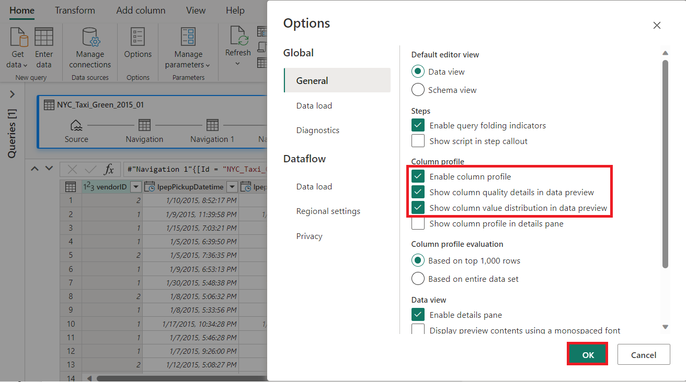
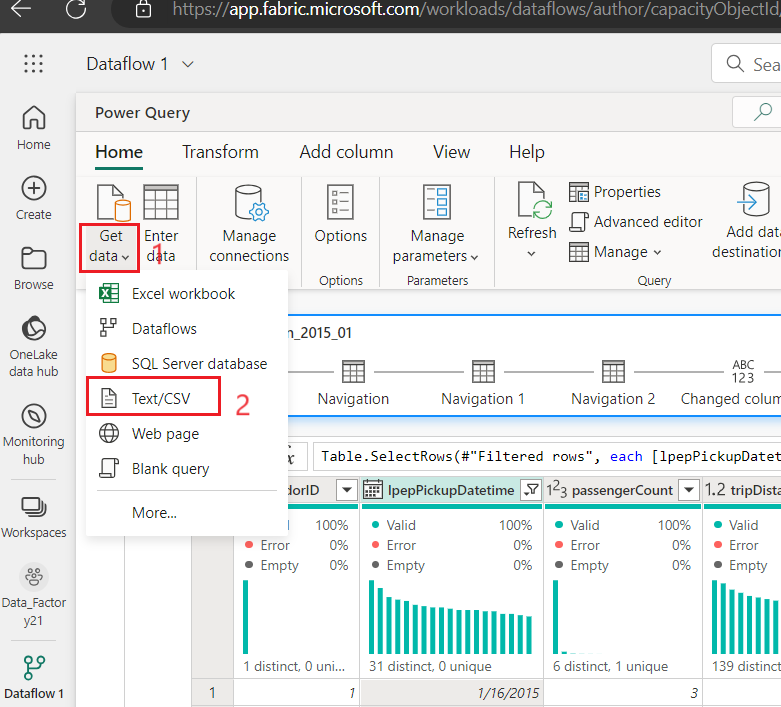
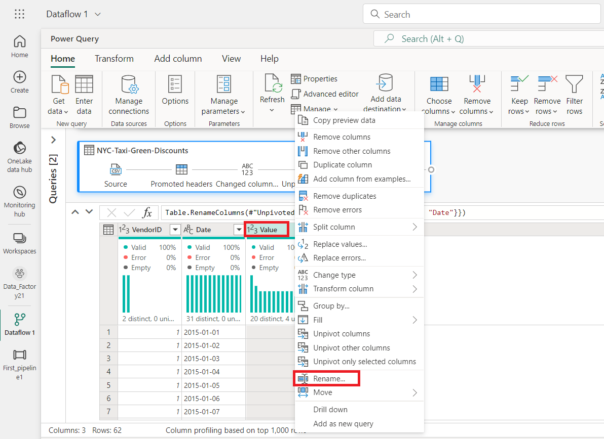
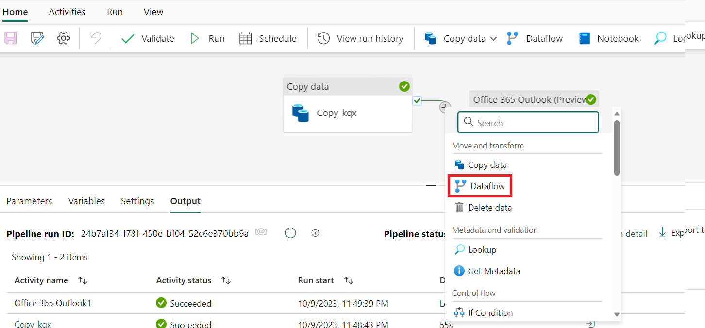

Caso de Uso 03: Solución Data Factory para mover y transformar datos con
dataflows y pipelines de datos

**Introducción**

Este laboratorio le ayuda a acelerar el proceso de evaluación de Data
Factory en Microsoft Fabric, proporcionándole una guía paso a paso para
un escenario completo de integración de datos en una hora. Al final de
este tutorial, comprenderá el valor y las características clave de Data
Factory y sabrá cómo completar un escenario común de integración de
datos de extremo a extremo.

**Objetivo**

El laboratorio está dividido en tres módulos:

- Ejercicio 1: Cree un pipeline con Data Factory para ingestar datos sin
  procesar de un almacenamiento Blob a una tabla Bronze en Lakehouse.

- Ejercicio 2: Transforme los datos con un flujo de datos en Data
  Factory para procesar los datos sin procesar de su tabla Bronze y
  trasladarlos a una tabla Gold en Lakehouse.

- Ejercicio 3: Automatice y envíe notificaciones con Data Factory para
  que le envíe un correo electrónico cuando se completen todos los
  trabajos y, por último, configure todo el flujo para que se ejecute de
  forma programada.

# Ejercicio 1: Cree un pipeline con Data Factory 

** Importante**

Microsoft Fabric se encuentra actualmente en VERSIÓN PRELIMINAR
(PREVIEW). Esta información hace referencia a un producto en fase de
prerelease que podría sufrir modificaciones sustanciales antes de su
lanzamiento oficial. Microsoft no ofrece garantías, ni explícitas ni
implícitas, respecto a la información proporcionada aquí. Para el
servicio disponible con soporte completo, consulte la [***documentación
de Azure Data
Factory***](https://learn.microsoft.com/en-us/azure/data-factory/) en
Azure.

## Tarea 1: Crear un workspace 

B Antes de trabajar con datos en Fabric, cree un workspace con la
versión de prueba de Fabric activada.

1.  Abra su navegador, vaya a la barra de direcciones y escriba o pegue
    la siguiente URL: <https://app.fabric.microsoft.com/> y, a
    continuación, presione la tecla **Enter**.

> 
>
> **Nota**: Si se le dirige a la página de inicio de Microsoft Fabric,
> omita los pasos del \#2 al \#4.

2.  En la ventana **Microsoft Fabric**, ingrese sus credenciales y haga
    clic en el botón **Submit**.

> 

3.  Luego, en la ventana de **Microsoft**, ingrese la contraseña y haga
    clic en el botón **Sign in.**

> 

4.  En la ventana **Stay signed in?** haga clic en el botón **Yes**.

> 

5.  Cree un nuevo Eventhouse haciendo clic en el botón **+New workshop**
    en la barra de navegación.

> 

6.  En la pestaña **Create a workspace**, ingrese los siguientes datos y
    haga clic en el botón **Apply**.

[TABLE]

> 

7.  Espere a que se complete la implementación. Tardará aproximadamente
    2-3 minutos.

8.  En la página del workspace **Data-FactoryXX**, navegue y haga clic
    en el botón **+New item**, luego seleccione **Lakehouse.**

> 
>
> 

9.  En el cuadro de diálogo **New lakehouse**, ingrese
    +++**DataFactoryLakehouse+++** en el campo **Name**, haga clic en el
    botón **Create** y abra el nuevo lakehouse.

> 

10. Ahora, haga clic en **Data-FactoryXX** en el panel de navegación de
    la izquierda.

## Tarea 2: Crear un pipeline de datos 

1.  Cree un nuevo lakehouse haciendo clic en el botón +New item en la
    barra de navegación. Haga clic en el mosaico “Data pipeline”.

2.  En el cuadro de diálogo **New pipeline**,
    ingrese +++**First_Pipeline1+++** en el campo **Name**, y luego haga
    clic en el botón **Create**.

> 

## Tarea 3: Configuración de una actividad de copia en el pipeline para ingestar datos muestrales en un Lakehouse

1.  En la página de inicio **First_Pipeline1**, seleccione **Copy data
    assistant** para abrir la herramienta de copia asistente.

> 

2.  Se muestra el cuadro de diálogo **Copy data** con el primer paso,
    **Choose data source**, resaltado. Seleccione la sección **Sample
    data** y seleccione el tipo de origen de datos **NYC Taxi-Green**. A
    continuación, seleccione **Next**.

3.  En **Connect to data source**, haga clic en el botón **Next**.

4.  Para el paso **Choose data destination** del asistente de copia,
    seleccione **Lakehouse** y, a continuación, **Next**.

5.  Seleccione OneLake data hub y seleccione **Existing Lakehouse** en
    la página de configuración de destino de datos que
    aparece.

6.  Ahora configure los detalles de su Lakehouse destino en la
    página **Select and map to folder path or
    table.** Seleccione **Tables** para **Root folder**, proporcione un
    nombre de tabla +++**Bronze+++**, y seleccione **Next**.

> 

7.  Finalmente, en la página **Review + save** del asistente de copia de
    datos, revise la configuración. Para este laboratorio, desmarque la
    casilla **Start data transfer immediately**, ya que ejecutaremos la
    actividad manualmente en el siguiente paso. A continuación,
    seleccione **OK**.

## **Tarea 4: Ejecute y vea los resultados de su actividad de copia**

1.  En la pestaña **Home **de la ventana del editor de pipeline,
    seleccione el botón **Run**.

2.  En el cuadro de diálogo **Save and run?** haga clic en el
    botón **Save and run **para ejecutar estas actividades. Esta
    actividad le llevará entre 11 y 12 minutos.

> 

3.  Puede supervisar la ejecución y comprobar los resultados en la
    pestaña **Output **situada debajo del lienzo del pipeline.
    Seleccione **activity name** como **Copy_ihy** para ver los detalles
    de la ejecución.

4.  Los detalles de la ejecución muestran 76 513 115 filas leídas y
    escritas.

5.  Expanda la sección **Duration breakdown** para ver la duración de
    cada etapa de la actividad de copia. Después de revisar los detalles
    de la copia, seleccione **Close**.

**Ejercicio 2: Transforme datos con un dataflow en Data Factory**

## Tarea 1: Obtener datos de una tabla Lakehouse

1.  En la página **First_Pipeline 1**, seleccione **Create** en la barra
    lateral**.**

2.  En la página de inicio **Data Factory Data-FactoryXX**, para crear
    un nuevo dataflow gen2m haga clic en **Dataflow Gen2** en **Data
    Factory.** 

3.  En el nuevo menú de dataflow, en el panel **Power Query**, haga clic
    en **Get data** y, a continuación, seleccione **More...**.

> 

4.  En la pestaña **Choose data source**, busque en el cuadro de
    búsqueda el tipo +++**Lakehouse+++** y luego haga clic en el
    conector **Lakehouse**.

> 

5.  Aparece el cuadro de diálogo **Connect to data source**, seleccione
    **Edit connection.** 

6.  En el cuadro de diálogo **Connect to data source**,
    seleccione **sign in** utilizando su cuenta de organización de Power
    BI para establecer la identidad que utiliza dataflow para acceder al
    lakehouse.

7.  En el cuadro de diálogo **Connect to data source**, seleccione
    **Next.**

> 

8.  Se muestra el cuadro de diálogo **Choose data**. Utilice el panel de
    navegación para buscar el Lakehouse que creó para el destino en el
    módulo anterior, seleccione la tabla de
    datos **DataFactoryLakehouse** y haga clic en el botón **Create**.

9.  Una vez que su lienzo esté relleno con los datos, puede establecer
    la información del **perfil de columna**, ya que es útil para la
    creación de perfiles de datos. Puede aplicar la transformación
    adecuada y orientar los valores de datos correctos en función de
    ella.

10. Para ello, seleccione **Options** en el panel de la cinta,
    seleccione las tres primeras opciones en **Column profile** y, a
    continuación, seleccione **OK**.

## Tarea 2: Transformar los datos importados desde el Lakehouse 

1.  Seleccione el icono de tipo de datos en el encabezado de la segunda
    columna, **IpepPickupDatetime**, para mostrar **haga clic
    derecho** en el menú y seleccione **Change type** en el menú para
    convertir la columna de tipo **Date/Time** a **Date**. 

2.  En la pestaña **Home** de la cinta, seleccione la opción **Choose
    columns** del grupo **Manage columns**.

3.  En el cuadro de diálogo **Choose columns**, **desmarque** algunas de
    las columnas que se enumeran aquí, y luego seleccione **OK**.

    - lpepDropoffDatetime

    &nbsp;

    - puLocationId

    &nbsp;

    - doLocationId

    &nbsp;

    - pickupLatitude

    &nbsp;

    - dropoffLongitude

    &nbsp;

    - rateCodeID

> 

4.  Seleccione el filtro de la columna **storeAndFwdFlag** y el menú
    desplegable de clasificación. (Si aparece una advertencia **List may
    be incomplete**, seleccione **Load more** para ver todos los datos.)

5.  Seleccione '**Y'** para mostrar solo las filas en las que se aplicó
    un descuento y, a continuación, seleccione **OK**.

6.  Seleccione el menú desplegable de clasificación y filtrado de la
    columna **Ipep_Pickup_Datetime**, luego seleccione **Date
    filters** y elija el filtro **Between...** proporcionado para los
    tipos de filtro Date y Date/Time.

11. En el cuadro de diálogo **Filter rows**, seleccione las fechas entre
    el **1 de enero de 2015** y el **31 de enero de 2015**, y luego
    seleccione **OK**.

> 

**Tarea 3: Establecer conexión con archivo CSV que contiene datos de
descuentos**

Ahora, con los datos de los viajes en su lugar, queremos cargar los
datos que contienen los respectivos descuentos para cada día y VendorID,
y preparar los datos antes de combinarlos con los datos de los viajes.

1.  En la pestaña **Home** del menú del editor de dataflow, seleccione
    la opción **Get data **y, a continuación, elija **Text/CSV**.

2.  En el panel **Connect to data source**, en **Connection settings**,
    seleccione el botón de opción** Upload file (Preview)**, luego haga
    clic en el botón** Browse** y** **navegue por su VM **C:\LabFiles**,
    luego** **seleccione** **el archivo** NYC-Taxi-Green-Discounts** y
    haga clic en el botón** Open**.

3.  En el panel **Connect to data source**, haga clic en el botón
    **Next**.

4.  En el cuadro de diálogo **Preview file data**, seleccione
    **Create**.

## Tarea 4: Transformar los datos de descuento 

1.  Al revisar los datos, vemos que los encabezados parecen estar en la
    primera fila. Conviértalos en encabezados seleccionando el menú
    contextual de la tabla en la parte superior izquierda del área de la
    cuadrícula de vista previa para seleccionar **Use first row as
    headers**.

*** Nota:** Después de promover los encabezados, verá un nuevo paso
añadido al panel **Applied steps** en la parte superior del editor de
dataflow para los tipos de datos de sus columnas.*

2.  Haga clic con el botón derecho en la columna **VendorID** y, en el
    menú contextual que aparece, seleccione la opción **Unpivot other
    columns**. Esto le permite transformar columnas en pares
    atributo-valor, donde las columnas se convierten en filas.

3.  Con la tabla sin girar, cambie el nombre de las
    columnas **Attribute** y **Value** haciendo doble clic en ellas y
    cambiando **Attribute** por **Date** y **Value** por **Discount**.

4.  Cambie el tipo de datos de la columna Date seleccionando el menú de
    tipo de datos a la izquierda del nombre de la columna y
    eligiendo **Date**.

5.  Seleccione la columna **Discount **y, a continuación, seleccione la
    pestaña **Transform** en el menú. Seleccione **Number column **y,
    después, seleccione **Standard **numeric transformations en el
    submenú y elija **Divide**.

6.  En el cuadro de diálogo **Divide**, ingrese el valor +++100+++, y
    haga clic en el botón **OK**.

**Tarea 5: Combinar datos de viajes y descuentos**

El siguiente paso es combinar ambas tablas en una sola que tenga el
descuento que debe aplicarse al viaje y el total ajustado.

1.  Primero, active el botón **Diagram view** para poder ver ambas
    consultas.

2.  Seleccione la consulta **Bronze** y, en la pestaña **Home**,
    seleccione el menú **Combine** y elija **Merge queries**,
    luego **Merge queries as new**.

3.  En el cuadro de diálogo **Merge**,
    seleccione **Generated-NYC-Taxi-Green-Discounts** en el menú
    desplegable **Right table for merge** y, a continuación, seleccione
    el icono de la “**bombilla"** en la parte superior derecha del
    cuadro de diálogo para ver la asignación sugerida de columnas entre
    las tres tablas.

4.  Elija una a una cada una de las dos asignaciones de columnas
    sugeridas, asignando las columnas VendorID y date de ambas tablas.
    Cuando se añaden ambas asignaciones, los encabezados de columna
    coincidentes se resaltan en cada tabla.

5.  Aparecerá un mensaje pidiéndole que permita combinar datos de
    múltiples fuentes de datos para ver los resultados. Seleccione
    **OK**.

6.  En el área de la tabla, verá inicialmente una advertencia que dice:
    "The evaluation was canceled because combining data from multiple
    sources may reveal data from one source to another. Select continue
    if the possibility of revealing data is okay."
    Seleccione **Continue **para mostrar los datos combinados.

7.  En el cuadro de diálogo Privacy Levels, seleccione la **casilla de
    verificación: Ignore Privacy Levels checks for this document.
    Ignoring privacy Levels could expose sensitive or confidential data
    to an unauthorized person **y haga clic en el botón **Save**.

8.  Observe cómo se ha creado una nueva consulta en la vista Diagram que
    muestra la relación de la nueva consulta Merge con las dos consultas
    que creó anteriormente. Si mira el panel de la tabla del editor,
    desplácese a la derecha de la lista de la columna de la consulta de
    fusión para ver que hay una nueva columna con valores de tabla. Esta
    es la columna “Generated NYC Taxi-Green-Discounts”, y su tipo
    es **\[Table\]**. En el encabezado de la columna hay un icono con
    dos flechas que van en direcciones opuestas, lo que le permite
    seleccionar columnas de la tabla. Deseleccione todas las columnas
    excepto **Discount** y, a continuación, seleccione **OK**.

9.  Con el valor de descuento ahora en el nivel de fila, podemos crear
    una nueva columna para calcular el importe total después del
    descuento. Para ello, seleccione la pestaña **Add column** en la
    parte superior del editor y elija **Custom column** en el
    grupo **General**.

10. En el cuadro de diálogo de **Custom column**, puede utilizar el
    lenguaje de fórmulas de [Power Query (también conocido como
    M)](https://learn.microsoft.com/en-us/powerquery-m) para definir
    cómo debe calcularse su nueva columna. Ingrese
    +++**TotalAfterDiscount+++** para **New column name**,
    seleccione **Currency** para **Data type** y proporcione la
    siguiente expresión M para **Custom column formula**:

> *+++if \[totalAmount\] \> 0 then \[totalAmount\] \* ( 1 -\[Discount\]
> ) else \[totalAmount\]+++*
>
> A continuación, seleccione **OK**.

11. Seleccione la columna **TotalAfterDiscount** recién creada y, a
    continuación, seleccione la pestaña **Transform** en la parte
    superior de la ventana del editor. En el grupo **Number column**,
    seleccione el menú desplegable **Rounding** y, a continuación, elija
    **Round...**.

12. En el cuadro de diálogo **Round**, ingrese **2** para el número de
    decimales y luego seleccione **OK**.

> 

13. Cambie el tipo de datos
    de **IpepPickupDatetime** de **Date **a **Date/Time**.

14. Finalmente, expanda el panel **Query settings** desde el lado
    derecho del editor si aún no está expandido, y cambie el nombre de
    la consulta de **Merge** a **Output**.

**Tarea 6: Cargue la consulta de salida en una tabla en Lakehouse**

Con la consulta de salida ahora completamente preparada y con los datos
listos para la salida, podemos definir el destino de salida para la
consulta.

1.  Seleccione la consulta de fusión de **Output** creada anteriormente.
    A continuación, seleccione la pestaña **Home **en el editor y **Add
    data destination** en la agrupación **Query** para seleccionar un
    destino **Lakehouse**.

2.  En el cuadro de diálogo **Connect to data destination**, su conexión
    ya debería estar seleccionada. Seleccione **Next **para continuar.

3.  En el cuadro de diálogo **Choose destination target**, busque el
    Lakehouse donde desea cargar los datos y asigne a la nueva tabla el
    nombre +++ **nyc_taxi_with_discounts+++**, luego
    seleccione **Next **de nuevo.

4.  En el cuadro de diálogo **Choose destination settings**, deje el
    método de actualización **Replace** predeterminado, compruebe que
    las columnas están asignadas correctamente y seleccione **Save
    settings**.

5.  De vuelta a la ventana principal del editor, confirme que ve su
    destino de salida en el panel **Query settings** para la
    tabla **Output** y, a continuación, seleccione **Publish**.

6.  En la página workspace, puede cambiar el nombre de su dataflow
    seleccionando los puntos suspensivos a la derecha del nombre del
    dataflow que aparece después de seleccionar la fila, y
    eligiendo **Properties**.

7.  En el cuadro de diálogo **Dataflow 1**, ingrese
    +++**nyc_taxi_data_with_discounts+++** en el campo de nombre y, a
    continuación, seleccione **Save**.

> 

8.  Seleccione el icono de actualización para el dataflow después de
    seleccionar su fila, y cuando se complete, debería ver su nueva
    tabla Lakehouse creada según lo configurado en los ajustes de **Data
    destination**.

9.  En el panel **Data_FactoryXX**, seleccione **DataFactoryLakehouse**
    para ver la nueva table cargada allí.

# Ejercicio 3: Automatice y envíe notificaciones con Data Factory

** Importante**

Microsoft Fabric se encuentra actualmente en VERSIÓN PRELIMINAR
(PREVIEW). Esta información se refiere a un producto en versión
preliminar que puede sufrir modificaciones sustanciales antes de su
lanzamiento. Microsoft no ofrece ninguna garantía, expresa o implícita,
con respecto a la información aquí proporcionada. Consulte
la [**documentación de Azure Data
Factory**](https://learn.microsoft.com/en-us/azure/data-factory/) para
el servicio en Azure.

## Tarea 1: Añada una actividad de Outlook de Office 365 a su pipeline

1.  Desde la página **Tutorial_Lakehouse**, navegue y haga clic en el
    workspace **Data_FactoryXX** en el menú de navegación de la
    izquierda.

2.  En la vista **Data_FactoryXX**, seleccione **First_Pipeline1**.

3.  Seleccione la pestaña **Activities** en el editor de pipeline y
    busque la actividad de **Office Outlook**.

4.  Seleccione y arrastre la ruta **On success** (una casilla de
    verificación verde en la parte superior derecha de la actividad en
    el lienzo del pipeline) desde su **Copy activity** hasta su nueva
    actividad **Office 365 Outlook**.

5.  Seleccione la actividad de Office 365 Outlook en el lienzo del
    pipeline y, a continuación, seleccione la pestaña **Settings** del
    área de propiedades situada debajo del lienzo para configurar el
    correo electrónico. Haga clic en el botón **Sing** **in**.

6.  Seleccione su cuenta de organización de Power BI y, a continuación,
    seleccione **Allow access** para confirmar.

**Nota:** El servicio no admite actualmente el correo electrónico
personal. Debe utilizar una dirección de correo electrónico empresarial.

7.  Seleccione la actividad de Office 365 Outlook en el lienzo del
    pipeline, en la pestaña **Settings** del área de propiedades debajo
    del lienzo para configurar el correo electrónico.

    - Ingrese su dirección de correo electrónico en la sección **To**.
      Si desea utilizar varias direcciones, utilice **;** para
      separarlas.

    &nbsp;

    - Para **Subject**, seleccione el campo para que aparezca la opción
      **Add dynamic content** y, a continuación, selecciónelo para
      mostrar el lienzo del generador de expresiones de pipeline.

8.  Aparecerá el cuadro de diálogo **Pipeline expression builder**.
    Ingrese la siguiente expresión y luego seleccione **OK**:

> *@concat('DI in an Hour Pipeline Succeeded with Pipeline Run Id',
> pipeline().RunId)*

9.  Para **Body**, seleccione el campo de nuevo y elija la opción **View
    in expression builder** cuando aparezca debajo del área de texto.
    Añada de nuevo la siguiente expresión en el cuadro de diálogo
    **Pipeline expression builder** que aparece, y luego seleccione
    **OK**:

> *@concat('RunID = ', pipeline().RunId, ' ; ', 'Copied rows ',
> activity('Copy data1').output.rowsCopied, ' ; ','Throughput ',
> activity('Copy data1').output.throughput)*

** Nota:** Reemplace **Copy data1** con el nombre de su propia actividad
de copia de pipeline.

10. Finalmente, seleccione la pestaña **Home** en la parte superior del
    editor de pipeline y elija **Run**. A continuación, seleccione
    **Save and run** de nuevo en el cuadro de diálogo de confirmación
    para ejecutar estas actividades.

> 
>
> 
>
> 

11. Después de que el pipeline se ejecute correctamente, compruebe su
    correo electrónico para encontrar el correo electrónico de
    confirmación enviado desde el pipeline.

**Tarea 2: Programar la ejecución del pipeline**

Una vez que termine de desarrollar y probar su pipeline, puede
programarlo para que se ejecute automáticamente.

1.  En la pestaña **Home** de la ventana del editor de pipeline,
    seleccione **Schedule**.

2.  Configure el programa según sea necesario. En el ejemplo, el
    pipeline se programa para ejecutarse diariamente a las 8:00 p. m.
    hasta fin de año.

***Tarea 3:* Añada una actividad de Dataflow al pipeline**

1.  Sitúe el cursor sobre la línea verde que conecta la **Copy data** y
    la actividad **Office 365 Outlook** en su lienzo de pipeline y
    seleccione el botón + para insertar una nueva actividad.

> 

2.  Elija **Dataflow** en el menú que aparece.

3.  La actividad Dataflow recién creada se inserta entre la actividad
    Copy y la actividad Office 365 Outlook, y se selecciona
    automáticamente, mostrando sus propiedades en el área debajo del
    lienzo. Seleccione la pestaña **Settings** en el área de propiedades
    y, a continuación, seleccione su dataflow creado en el **Ejercicio
    2: Transformar datos con un dataflow en Data Factory**.

12. Seleccione la pestaña **Home** en la parte superior del editor de
    pipeline y elija **Run**. A continuación, seleccione **Save and
    run** de nuevo en el cuadro de diálogo de confirmación para ejecutar
    estas actividades.

## Tarea 4: Liberación de recursos 

Puede eliminar informes, pipelines, almacenes y otros elementos
individuales o eliminar todo el workspace. Siga estos pasos para
eliminar el workspace que ha creado para este tutorial.

1.  Seleccione su workspace, **Data-FactoryXX**, en el menú de
    navegación de la izquierda. Se abrirá la vista de elementos del
    workspace.

2.  Seleccione la opción ***...*** bajo el nombre del workspace y
    seleccione **Workspace settings**.

3.  Seleccione **Other** y **Remove this workspace.**

