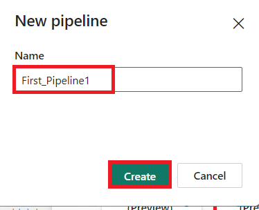
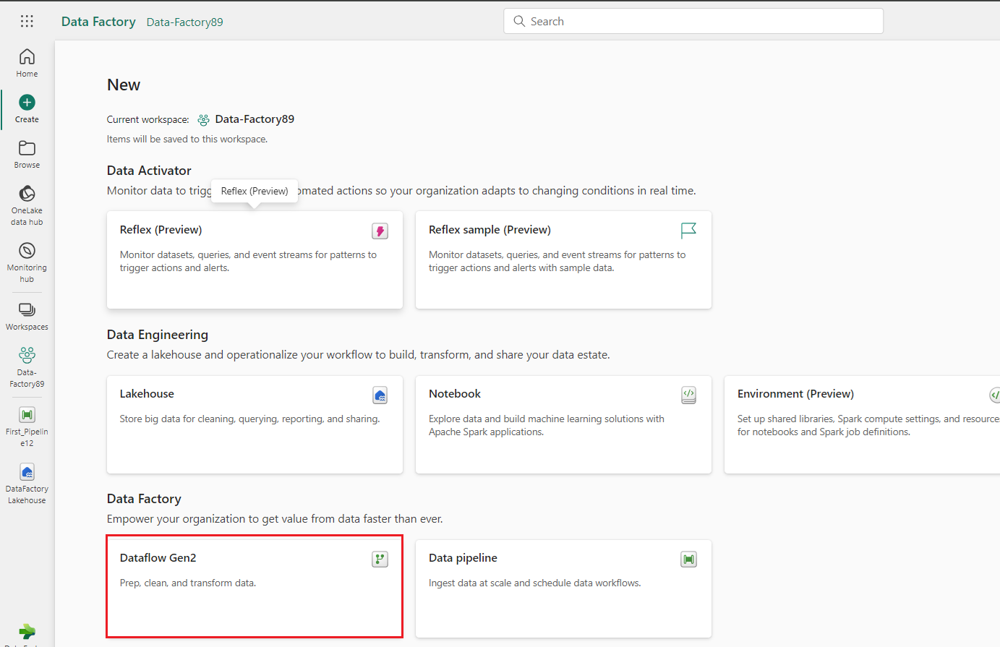
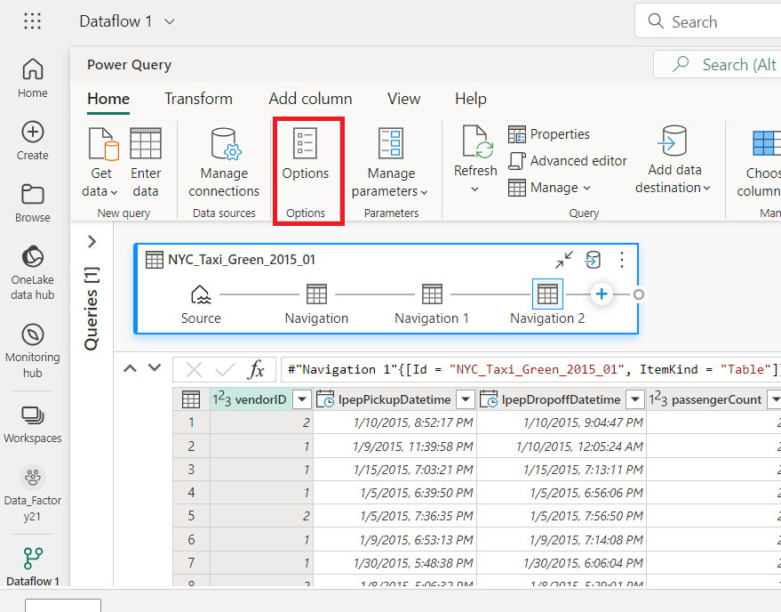
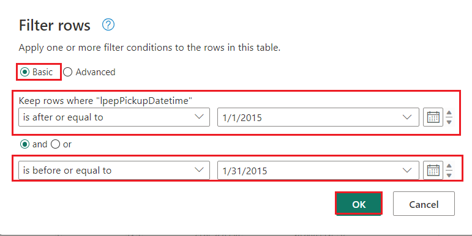
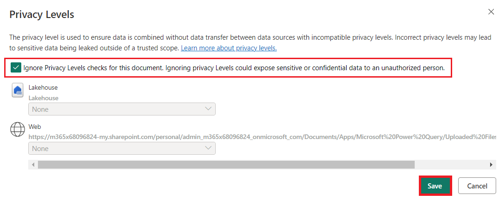
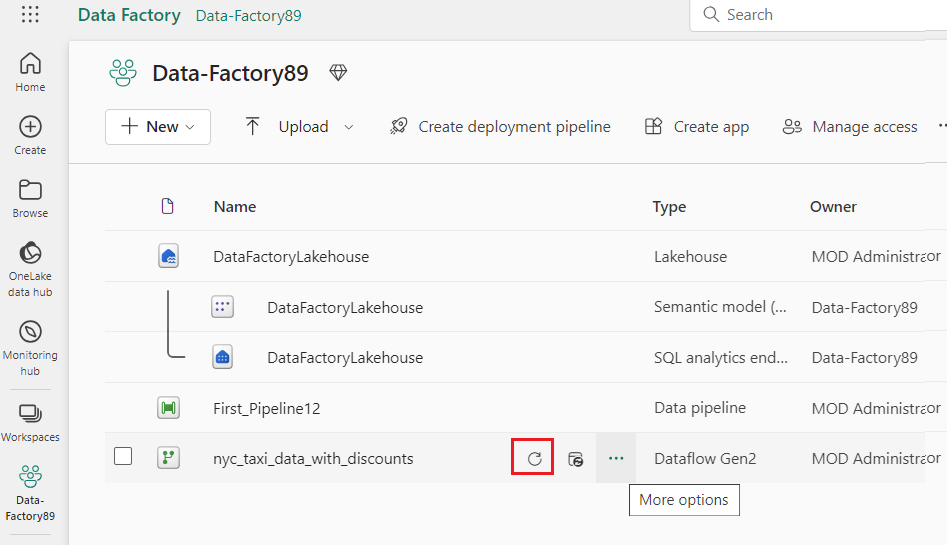
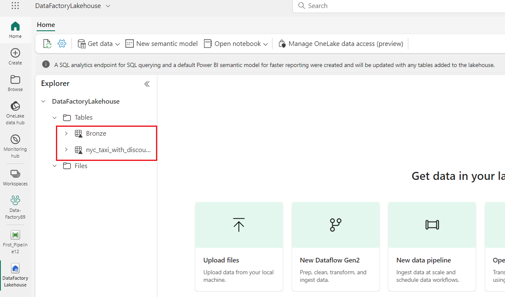
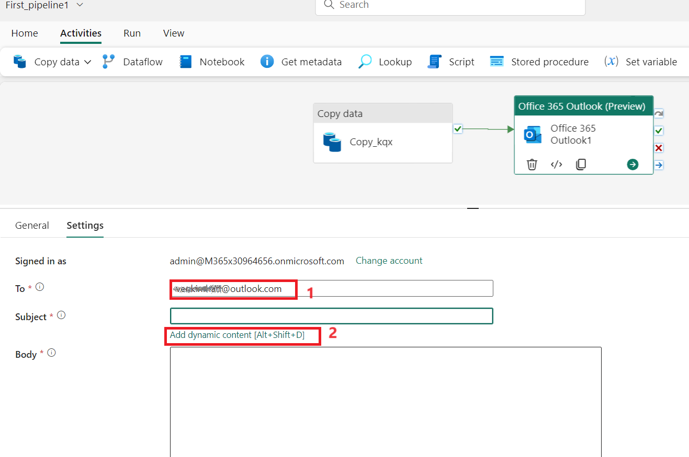

Caso d'uso 03: Soluzione Data Factory per lo spostamento e la
trasformazione dei dati con dataflows e pipeline di dati

**Introduzione**

Questo lab consente di accelerare il processo di valutazione per Data
Factory in Microsoft Fabric fornendo indicazioni dettagliate per uno
scenario di integrazione dei dati completo entro un'ora. Al termine di
questa esercitazione, si comprende il valore e le funzionalità chiave di
Data Factory e si sa come completare uno scenario di integrazione dei
dati end-to-end comune.

**Obiettivo**

Il laboratorio si articola in tre moduli:

- Esercizio 1: Creare una pipeline con Data Factory per inserire dati
  non elaborati da un archivio BLOB a una tabella Bronze in un data
  lakehouse.

- Esercizio 2: Trasformare i dati con un flusso di dati in Data Factory
  per elaborare i dati non elaborati dalla tabella Bronze e spostarli in
  una tabella Gold nella data lakehouse.

- Esercizio 3: Automatizzare e inviare notifiche con Data Factory per
  inviare un messaggio di posta elettronica per ricevere una notifica
  una volta completati tutti i processi e, infine, configurare l'intero
  flusso per l'esecuzione in base a una pianificazione.

# Esercizio 1: Creare una pipeline con Data Factory

**Importante**

Microsoft Fabric è attualmente in ANTEPRIMA. Queste informazioni si
riferiscono a un prodotto non definitivo che può essere modificato in
modo sostanziale prima del rilascio. Microsoft non fornisce alcuna
garanzia, espressa o implicita, in relazione alle informazioni fornite
nel presente documento. Fare riferimento alla [***documentazione di
Azure Data
Factory***](https://learn.microsoft.com/en-us/azure/data-factory/) per
il servizio in Azure.

## Attività 1: Creare un'area di lavoro

Prima di utilizzare i dati in Fabric, creare un'area di lavoro con la
versione di valutazione di Fabric abilitata.

1.  Aprire il browser, andare alla barra degli indirizzi e digitare o
    incollare il seguente URL: <https://app.fabric.microsoft.com/>
    quindi premere il pulsante **Enter**.

> 
>
> **Nota**: se si viene indirizzati alla home page di Microsoft Fabric,
> saltare i passaggi da \#2 a \#4.

2.  Nella finestra di **Microsoft Fabric**, inserire le tue credenziali
    e fare clic sul pulsante **Submit**.

> 

3.  Quindi, nella finestra **Microsoft**, inserire la password e fare
    clic sul pulsante **Sign in.**

> 

4.  In finestra **Stay signed in?**, fare clic sul pulsante **Yes**.

> 

5.  Crea una nuova Eventhouse cliccando sul pulsante **+ New workshop**
    nella barra di navigazione.

> 

6.  Nella scheda **Create a workspace**, inserire i seguenti dettagli e
    fare clic sul pulsante **Apply**.

[TABLE]

> 

7.  Attendere il completamento della distribuzione. Ci vorranno circa
    2-3 minuti.

8.  Nella pagina dell'area di lavoro **Data-FactoryXX**, navigare e fare
    clic sul pulsante **+ New item**, quindi selezionare **Lakehouse.**

> 
>
> 

9.  Nella finestra di dialogo **New lakehouse**, inserire
    +++**DataFactoryLakehouse+++** nel campo **Name **, fare clic sul
    pulsante **Create** e aprire la nuova lakehouse.

> 

10. Ora, fare clic su **Data-FactoryXX** nel riquadro di navigazione a
    sinistra.

##  Attività 2: Creare una pipeline di dati

1.  Crea una nuova lakehouse facendo clic sul pulsante  **+New**
    elemento nella barra di navigazione. Fare clic sul riquadro **"Data
    pipeline"**

2.  Nella finestra di dialogo **New pipeline,** immettere
    **+++First_Pipeline1+++** nel campo **Name**, quindi fare clic sul
    pulsante **Create**.

> 

## Attività 3: Usare un'attività di copia nella pipeline per caricare i dati di esempio in un data lakehouse

1.  Nella home page **First_Pipeline1,** selezionare **Copy data
    assistant** per aprire lo strumento Copy assistant.

> 

2.  Viene visualizzata la finestra di dialogo **Copy data** con il primo
    passaggio,  **Choose data source** evidenziato. Selezionare la
    sezione **Sample data** e selezionare il tipo di origine dati **NYC
    Taxi-Green**. Quindi seleziona **Next**.

3.  In **Connect to data source**, fare clic sul pulsante **Next**.

4.  Per il passaggio **Choose data destination,** dell'assistente copia,
    selezionare **Lakehouse** e quindi **Next**.

5.  Selezionare **OneLake data hub** e selezionare **Existing
    Lakehouse** nella pagina di configurazione della destinazione dati
    visualizzata.

6.  Configurare ora i dettagli della destinazione Lakehouse in  **Select
    and map to folder path or table** pagina. Selezionare **Tables **per
    **Root folder**, specificare un nome di tabella +++**Bronze+++** e
    selezionare **Next**.

> 

7.  Infine, nella pagina **Review + save** dell'assistente di copia
    dati, rivedi la configurazione. Per questo lab, deselezionare la
    casella di controllo **Start data transfer immediately**, poiché
    l'attività viene eseguita manualmente nel passaggio successivo.
    Quindi selezionare **OK.**

## **Attività 4: Eseguire e visualizzare i risultati dell'attività di** Copy. 

1.  Nella scheda **Home** della finestra dell'editor della pipeline,
    selezionare il pulsante **Run**.

2.  Nella finestra di dialogo **Save and run?**, fare clic sul pulsante
    **Save and run** per eseguire queste attività. Questa attività
    durerà circa 11-12 minuti

> 

3.  È possibile monitorare l'esecuzione e controllare i risultati nella
    scheda **Output** sotto l'area di disegno della pipeline.
    Selezionare il **activity name** come **Copy_ihy** per visualizzare
    i dettagli dell'esecuzione.

4.  I dettagli della corsa mostrano 76.513.115 righe lette e scritte.

5.  Espandere la sezione **Duration breakdown** per visualizzare la
    durata di ogni fase dell'attività di Copy. Dopo aver esaminato i
    dettagli della copia, selezionare **Close**.

**Esercizio 2: Trasformare i dati con un dataflow in Data Factory**

## Attività 1: Ottenere dati da una tabella Lakehouse

1.  Nella pagina **First_Pipeline 1**, dalla barra laterale selezionare
    **Create.**

2.  Nella home page di **Data Factory Data-FactoryXX** per creare un
    nuovo flusso di dati gen2 fare clic su **Dataflow Gen2** in **Data
    Factory.**

3.  Dal nuovo menu del dataflow, nel riquadro **Power Query**, fare clic
    su **Get data**, quindi selezionare **More.... **

> 

4.  Nella scheda **Choose data source**, nella casella di ricerca
    digitare **+++Lakehouse+++** e quindi fare clic sul connettore
    **Lakehouse**.

> 

5.  Viene visualizzata la finestra di dialogo **Connect to data
    source**, selezionare **Edit connection.** 

6.  Nella finestra di dialogo  **Connect to data source,** selezionare
    **sign in** con l'account aziendale di Power BI per impostare
    l'identità usata dal flusso di dati per accedere al lakehouse.

7.  Nella finestra di dialogo **Connect to data source,** selezionare
    **Next.**

> 

8.  Viene visualizzata la finestra di dialogo **Choose data**.
    Utilizzare il riquadro di navigazione per trovare la Lakehouse che
    hai creato per la destinazione nel modulo precedente e selezionare
    la tabella di dati **DataFactoryLakehouse**, quindi fare clic sul
    pulsante **Create**.

9.  Una volta che l'area di disegno è stata popolata con i dati, è
    possibile impostare le informazioni del **column profile**, in
    quanto ciò è utile per la profilatura dei dati. È possibile
    applicare la trasformazione corretta e impostare come destinazione i
    valori di dati corretti in base ad essa.

10. A tale scopo, selezionare **Options **dal riquadro della barra
    multifunzione, quindi selezionare le prime tre opzioni in **Column
    profile** e quindi selezionare **OK**.

## Attività 2: Trasformare i dati importati dalla Lakehouse

1.  Selezionare l'icona del tipo di dati nell'intestazione della colonna
    della seconda colonna, **IpepPickupDatetime**, per visualizzare
    facendo **clic con il pulsante destro** del mouse sul menu e
    selezionare **Change type** dal menu per convertire la colonna dal
    tipo **Date/Time** a **Date**.

2.  Nella scheda **Home** della barra multifunzione selezionare
    l'opzione **Choose columns** dal gruppo **Manage columns**.

3.  Nella finestra di dialogo **Choose columns**, **deselezionare**
    alcune colonne elencate qui, quindi selezionare **OK**.

    - lpepDropoffDatetime

    &nbsp;

    - puLocationId

    &nbsp;

    - doLocationId

    &nbsp;

    - ritiroLatitude

    &nbsp;

    - dropoffLongitudine

    &nbsp;

    - rateCodeID

> 

4.  Selezionare il menu a discesa del filtro e dell'ordinamento della
    colonna **storeAndFwdFlag**. (Se viene visualizzato un avviso **List
    may be incomplete**, selezionare **Load more** per visualizzare
    tutti i dati.)

5.  Selezionare "**Y"** per visualizzare solo le righe in cui è stato
    applicato uno sconto, quindi selezionare **OK.**

6.  Selezionare il menu a discesa Ordina e filtra
    **Ipep_Pickup_Datetime** colonne, quindi seleziona **Date filters**
    e scegliere l'opzione **Between...** filtro fornito per i tipi di
    data e data/ora.

11. Nella finestra di dialogo **Filter rows**, selezionare le date
    comprese tra **il 1° gennaio 2015** e il **31 gennaio 2015**, quindi
    seleziona **OK**.

> 

## Attività 3: Connettersi a un file CSV contenente i dati sugli sconti

A questo punto, con i dati delle corse, si desidera caricare i dati che
contengono i rispettivi sconti per ogni giorno e l'ID fornitore e
preparare i dati prima di combinarli con i dati delle corse.

1.  Nella scheda **Home** del menu dell'editor del dataflow selezionare
    l'opzione **Get data** e quindi scegliere **Text/CSV**.

2.  Nel riquadro **Connect to data source**, in **Connection settings**,
    selezionare il pulsante di opzione **Upload file (Preview),** quindi
    fare clic sul pulsante **Browse** ed esplorare la macchina virtuale
    **C:\LabFiles**, quindi selezionare il file
    **NYC-Taxi-Green-Discounts** e fare clic sul pulsante **Open**.

3.  Nel riquadro **Connect to data source**, fare clic sul pulsante
    **Next**.

4.  Nella finestra di dialogo **Preview file data,** selezionare
    **Create**.

## Attività 4: Trasformare i dati sugli sconti

1.  Esaminando i dati, vediamo che le intestazioni sembrano essere nella
    prima riga. Promuovili a intestazioni selezionando il menu di scelta
    rapida della tabella in alto a sinistra nell'area della griglia di
    anteprima per selezionare **Use first row as headers**.

***Nota:** Dopo aver promosso le intestazioni, è possibile visualizzare
un nuovo passaggio aggiunto al riquadro **Applied steps** nella parte
superiore dell'editor del flusso di dati per i tipi di dati delle
colonne.*

2.  Fare clic con il pulsante destro del mouse sulla colonna
    **VendorID** e, dal menu contestuale visualizzato, selezionare
    l'opzione **Unpivot other columns**. In questo modo è possibile
    trasformare le colonne in coppie attributo-valore, in cui le colonne
    diventano righe.

3.  Con la tabella non trasformata in pivot, rinominare le colonne
    **Attribute **e **Value **facendo doppio clic su di esse e
    modificando **Attribute **in **Date **e **Value **in **Discount**.

4.  Modificare il tipo di dati della colonna Date selezionando il menu
    del tipo di dati a sinistra del nome della colonna e scegliendo
    **Date**.

5.  Selezionare la colonna **Discount **e quindi selezionare la scheda
    **Trasform** nel menu. Selezionare **Number column**, quindi
    selezionare Trasformazioni numeriche **Standard** dal sottomenu e
    scegliere **Divide**.

6.  Nella finestra di dialogo **Divide**, inserire il valore +++100+++,
    quindi fare clic sul pulsante **OK**.

**Attività 5: Combinare i dati relativi a viaggi e sconti**

Il passaggio successivo consiste nel combinare entrambe le tabelle in
un'unica tabella che contiene lo sconto da applicare al viaggio e il
totale rettificato.

1.  Innanzitutto, attivare il pulsante **Diagram view **in modo da poter
    visualizzare entrambe le query.

2.  Selezionare la query **Bronze**, quindi nella scheda **Home**
    selezionare il menu **Combine **e scegliere **Merge queries**,
    quindi **Merge queries as new**.

3.  Nella finestra di dialogo **Merge**, selezionare
    **Generated-NYC-Taxi-Green-Discounts** dal menu a discesa **Right
    table for merge**, quindi seleziona l'icona " **light bulb**" in
    alto a destra della finestra di dialogo per visualizzare la
    mappatura suggerita delle colonne tra le tre tabelle.

4.  Scegliere ognuno dei due mapping delle colonne suggeriti, uno alla
    volta, mappando le colonne VendorID e date di entrambe le tabelle.
    Quando vengono aggiunti entrambi i mapping, le intestazioni di
    colonna corrispondenti vengono evidenziate in ogni tabella.

5.  Viene visualizzato un messaggio che richiede di consentire la
    combinazione di dati provenienti da più origini dati per
    visualizzare i risultati. Selezionare **OK**

6.  Nell'area della tabella, inizialmente vedrai un avviso che indica
    che "The evaluation was canceled because combining data from
    multiple sources may reveal data from one source to another. Select
    continue if the possibility of revealing data is okay." Selezionare
    **Continue ** per visualizzare i dati combinati.

7.  Nella finestra di dialogo **Privacy Levels**, selezionare **check
    box :Ignore Privacy Lavels checks for this document. Ignoring
    privacy Levels could expose sensitive or confidential data to an
    unauthorized person** e fare clic sul pulsante **Save**.

8.  Si noti che è stata creata una nuova query in visualizzazione
    diagramma che mostra la relazione della nuova query di unione con le
    due query create in precedenza. Esaminando il riquadro della tabella
    dell'editor, scorrere verso destra dell'elenco delle colonne della
    query di unione per visualizzare la presenza di una nuova colonna
    con i valori della tabella. Questa è la colonna "Generated NYC
    Taxi-Green-Discounts" e il suo tipo è **\[Tabella\].**
    Nell'intestazione della colonna c'è un'icona con due frecce che
    vanno in direzioni opposte, permettendoti di selezionare le colonne
    dalla tabella. Deselezionare tutte le colonne tranne **Discount**,
    quindi seleziona **OK**.

9.  Con il valore dello sconto ora a livello di riga, possiamo creare
    una nuova colonna per calcolare l'importo totale dopo lo sconto. A
    tale scopo, selezionare la scheda ** Add column** nella parte
    superiore dell'editor e scegliere **Custom column** dal gruppo
    **General**.

10. Nella finestra di dialogo **Custom column** è possibile usare il
    [linguaggio delle formule di Power Query (noto anche come
    M)](https://learn.microsoft.com/en-us/powerquery-m) per definire la
    modalità di calcolo della nuova colonna. Immettere
    +++**TotalAfterDiscount+++** per **New column name**, selezionare
    **Currency **per il **Data type** e fornire l'espressione M seguente
    per **Custom column formula**:

> *+++if \[totalAmount\] \> 0 then \[totalAmount\] \* ( 1 -\[Discount\]
> ) else \[totalAmount\]+++*
>
> Quindi selezionare **OK.**

11. Selezionare la colonna **TotalAfterDiscount** appena creata, quindi
    selezionare la scheda **Transform **nella parte superiore della
    finestra dell'editor. Nel gruppo di ** Number column** selezionare
    l'elenco a discesa **Rounding** e quindi scegliere **Round.... **

12. Nella finestra di dialogo **Round,** immettere **2** per il numero
    di cifre decimali, quindi selezionare **OK**.

> 

13. Modificare il tipo di dati di **IpepPickupDatetime** da **Date** a
    **Date/Time**.

14. Infine, espandere il riquadro **Query settings** dal lato destro
    dell'editor, se non è già espanso, e rinominare la query da
    **Merge **a **Output**.

**Attività 6: Caricare la query di output in una tabella in Lakehouse**

Con la query di output ora completamente preparata e con i dati pronti
per l'output, è possibile definire la destinazione di output per la
query.

1.  Selezionare la query di unione di output creata in precedenza.
    Selezionare quindi la scheda **Home** nell'editor e **Add data
    destination** dal raggruppamento **Query** per selezionare una
    destinazione **Lakehouse.**

2.  Nella finestra di dialogo **Connect to data destination**, la
    connessione dovrebbe essere già selezionata. Selezionare
    **Next **per continuare.

3.  Nella finestra di dialogo **Choose destination target**, individuare
    la Lakehouse in cui si desidera caricare i dati e denominare la
    nuova tabella+++ **nyc_taxi_with_discounts+++**, quindi selezionare
    nuovamente **Next**.

4.  Nella finestra di dialogo **Choose destination settings,** lasciare
    il metodo di aggiornamento predefinito **Replace**, verificare che
    le colonne siano mappate correttamente e selezionare **Save
    settings**.

5.  Tornando alla finestra principale dell'editor, verificare che la
    destinazione di output sia visualizzata nel riquadro **Query
    settings** per la tabella di **Output**, quindi selezionare
    **Publish**.

6.  Nella pagina dell'area di lavoro è possibile rinominare il flusso di
    dati selezionando i puntini di sospensione a destra del nome del
    flusso di dati visualizzato dopo aver selezionato la riga e
    scegliendo **Properties**.

7.  Nella finestra di dialogo **Dataflow 1** immettere
    +++**nyc_taxi_data_with_discounts+++** nella casella del nome,
    quindi selezionare **Save**.

> 

8.  Selezionare l'icona di aggiornamento per il flusso di dati dopo aver
    selezionato la riga e, al termine, verrà visualizzata la nuova
    tabella Lakehouse creata come configurato nelle impostazioni di
    **Data destination**.

9.  Nel riquadro **Data_FactoryXX,** selezionare
    **DataFactoryLakehouse** per visualizzare la nuova tabella caricata.

# Esercizio 3: Automatizzare e inviare notifiche con Data Factory

**Importante**

Microsoft Fabric è attualmente in ANTEPRIMA. Queste informazioni si
riferiscono a un prodotto non definitivo che può essere modificato in
modo sostanziale prima del rilascio. Microsoft non fornisce alcuna
garanzia, espressa o implicita, in relazione alle informazioni fornite
nel presente documento. Fare riferimento alla [***documentazione di
Azure Data
Factory***](https://learn.microsoft.com/en-us/azure/data-factory/) per
il servizio in Azure.

## Attività 1: Aggiungere un'attività di Office 365 Outlook alla pipeline

1.  Dalla pagina **Tutorial_Lakehouse**, navigare e fare clic su
    **Data_FactoryXX** Workspace nel menu di navigazione a sinistra.

2.  Nella vista **Data_FactoryXX**, selezionare l'**First_Pipeline1**.

3.  Selezionare la scheda **Activities **nell'editor della pipeline e
    trovare l'attività di **Office Outlook**.

4.  Selezionare e trascinare il percorso ** On success **(una casella di
    controllo verde nella parte superiore destra dell'attività nell'area
    di disegno della pipeline) dal **Copy activity** alla nuova attività
    di **Office 365 Outlook**.

5.  Selezionare l'attività di Office 365 Outlook dall'area di disegno
    della pipeline, quindi selezionare la scheda **Settings **dell'area
    delle proprietà sotto l'area di disegno per configurare l'e-mail.
    Fare clic sul pulsante **Sing in**.

6.  Selezionare l'account aziendale di Power BI e quindi selezionare
    **Allow access** per confermare.

**Nota:** al momento il servizio non supporta l'email personale. È
necessario utilizzare un indirizzo e-mail aziendale.

7.  Selezionare l'attività di Office 365 Outlook dall'area di disegno
    della pipeline, nella **scheda Impostazioni** dell'area delle
    proprietà sotto l'area di disegno per configurare l'e-mail.

    - Inserire il tuo indirizzo email nella sezione **To**. Se si
      desidera utilizzare più indirizzi, utilizzare**;** per separarli.

    &nbsp;

    - Per **Subject,** selezionare il campo in modo che venga
      visualizzata l'opzione **Add dynamic content** e quindi
      selezionarla per visualizzare l'area di disegno del generatore di
      espressioni della pipeline.

8.  Viene visualizzata la finestra di dialogo **Pipeline expression
    builder**. Immettere l'espressione seguente, quindi selezionare
    **OK:**

*@concat('DI in an Hour Pipeline Succeeded with Pipeline Run Id',
pipeline().RunId) *

9.  Per il **Corpo**, selezionare nuovamente il campo e scegliere
    l'opzione **View in expression builder** quando viene visualizzata
    sotto l'area di testo. Aggiungere di nuovo l'espressione seguente
    nella finestra di dialogo **Pipeline expression builder**
    visualizzata, quindi selezionare **OK**:

*@concat('RunID = ', pipeline().RunId, ' ; ', 'Copied rows ',
activity('Copy data1').output.rowsCopied, ' ; ','Throughput ',
activity('Copy data1').output.throughput) *

**Nota:** Sostituire **Copy data1** con il nome della tua attività di
copia della pipeline.

10. Infine, selezionare la scheda **Home** nella parte superiore
    dell'editor della pipeline e scegliere **Run**. Selezionare quindi
    **Save and run** di nuovo nella finestra di dialogo di conferma per
    eseguire queste attività.

> 
>
> 
>
> 

11. Dopo che la pipeline è stata eseguita correttamente, controllare
    l'e-mail per trovare l'e-mail di conferma inviata dalla pipeline.

**Attività 2: Pianificare l'esecuzione della pipeline**

Una volta terminato lo sviluppo e il test della pipeline, è possibile
pianificarne l'esecuzione automatica.

1.  Nella scheda **Home **della finestra dell'editor della pipeline
    selezionare **Schedule**.

2.  Configurare la pianificazione in base alle esigenze. Nell'esempio
    seguente viene pianificata l'esecuzione della pipeline ogni giorno
    alle 20:00 fino alla fine dell'anno.

***Attività 3:* Aggiungere un'attività Dataflow alla pipeline**

1.  Passare il puntatore del mouse sulla linea verde che collega **Copy
    activity** e l'attività di **Office 365 Outlook** nell'area di
    disegno della pipeline e selezionare il pulsante **+** per inserire
    una nuova attività.

> 

2.  Scegliere **Dataflow **dal menu visualizzato.

3.  L'attività Dataflow appena creata viene inserita tra l'attività Copy
    e l'attività Outlook di Office 365 e selezionata automaticamente,
    visualizzando le relative proprietà nell'area sotto l'area di
    disegno. Selezionare la scheda **Settings **nell'area delle
    proprietà e quindi selezionare il flusso di dati creato in
    **Exercise 2: Transform data with a dataflow in Data Factory**.

12. Selezionare la scheda **Home** nella parte superiore dell'editor
    pipeline e scegliere **Run**. Selezionare quindi **Save and run **di
    nuovo nella finestra di dialogo di conferma per eseguire queste
    attività.

## Attività 4: Pulire le risorse

È possibile eliminare singoli report, pipeline, magazzini e altri
elementi oppure rimuovere l'intero workspace. Usare la procedura
seguente per eliminare l'area di lavoro creata per questa esercitazione.

1.  Selezionare la tua area di lavoro, **Data-FactoryXX** dal menu di
    navigazione a sinistra. Apre la visualizzazione degli elementi
    dell'area di lavoro.

2.  Selezionare l'icona ***...*** sotto il nome dell'area di lavoro e
    selezionare **Workspace settings**.

3.  Selezionare **Other **e **Remove this workspace.**

