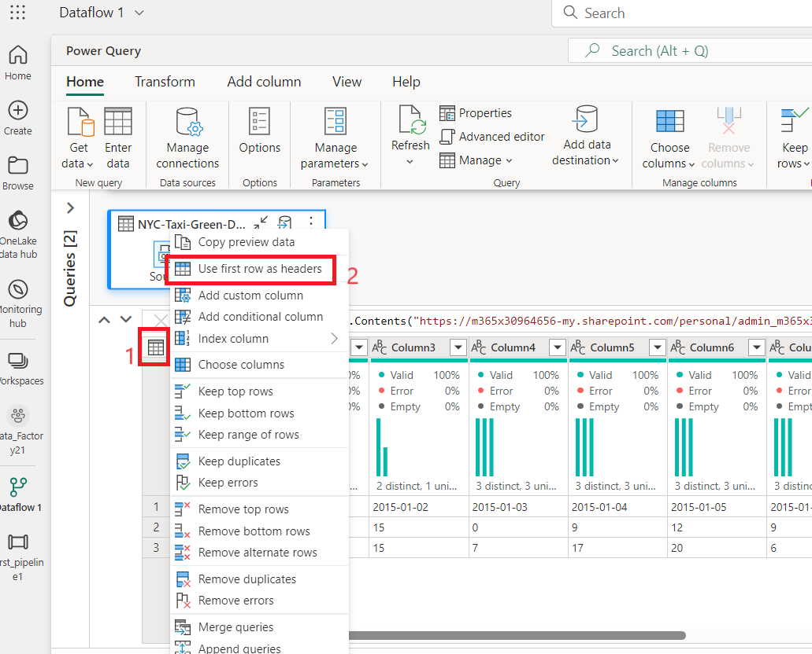
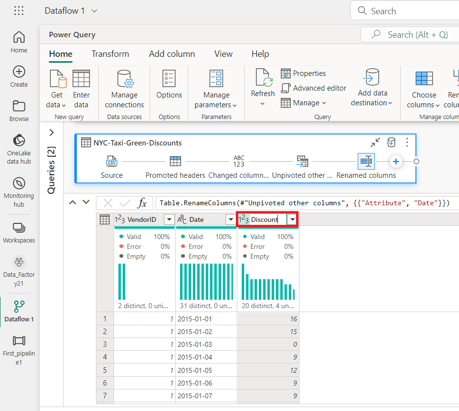
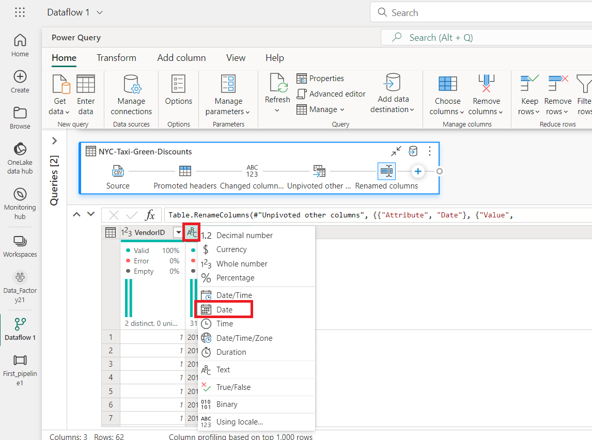
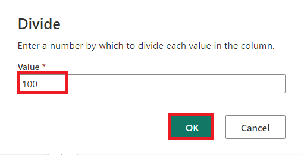
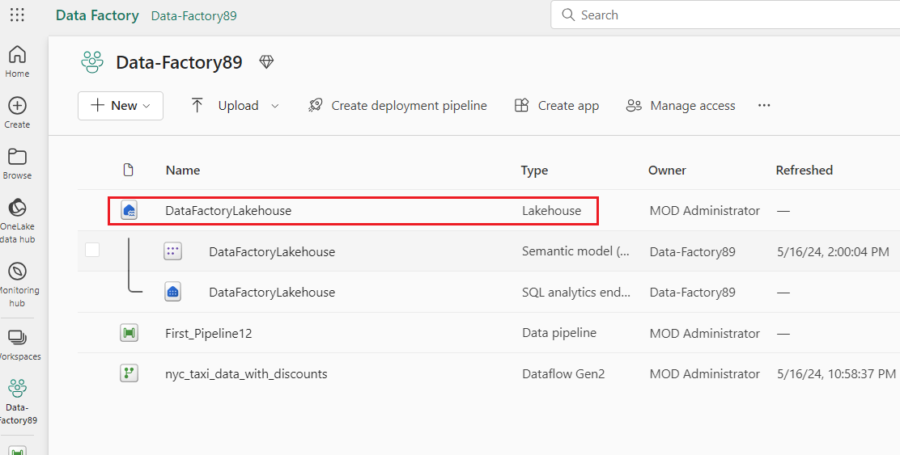
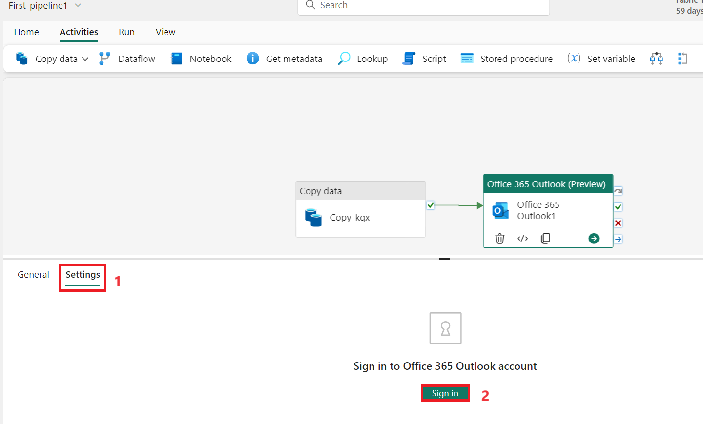
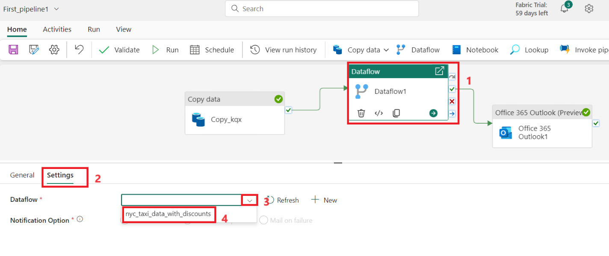

Caso de uso 03: Solução de Data Factory para movimentação e
transformação de dados com fluxos de dados e pipelines de dados

**Introdução**

Este laboratório ajuda você a acelerar o processo de avaliação do Data
Factory no Microsoft Fabric, fornecendo orientações detalhadas para um
cenário completo de integração de dados em até uma hora. Ao final deste
tutorial, você compreenderá o valor e os principais recursos do Data
Factory e saberá como concluir um cenário comum de integração de dados
do início ao fim.

**Objetivo**

O laboratório é dividido em três módulos:

- Exercício 1: Crie um pipeline com o Data Factory para inserir dados
  brutos de um armazenamento de Blobs para uma tabela Bronze em um Data
  Lakehouse.

- Exercício 2: Transforme dados com um fluxo de dados no Data Factory
  para processar os dados brutos da sua tabela Bronze e movê-los para
  uma tabela Gold no Data Lakehouse .

- Exercício 3: Automatize e envie notificações com o Data Factory para
  enviar um e-mail para notificá-lo quando todos os trabalhos forem
  concluídos e, por fim, configurar todo o fluxo para ser executado de
  forma programada.

# Exercício 1: Criar um pipeline com o Data Factory

**Importante**

O Microsoft Fabric está atualmente em PRÉ-VISUALIZAÇÃO. Estas
informações se referem a um produto de pré-lançamento que pode ser
substancialmente modificado antes de seu lançamento. A Microsoft não
oferece nenhuma garantia, expressa ou implícita, com relação às
informações aqui fornecidas. Consulte a [***Azure Data Factory
documentation***](https://learn.microsoft.com/en-us/azure/data-factory/)
para o serviço no Azure.

## Tarefa 1: Criar um workspace

Antes de trabalhar com dados no Fabric, crie um workspace com o teste do
Fabric habilitado.

1.  Abra seu navegador, navegue até a barra de endereço e digite ou cole
    o seguinte URL: <https://app.fabric.microsoft.com/> então pressione
    o botão **Enter .**

> 
>
> **Observação**: Se você for direcionado para a página inicial do
> Microsoft Fabric, pule as etapas de 2 a 4.

2.  Na janela **do Microsoft Fabric**, insira suas credenciais e clique
    no botão **Submit**.

> 

3.  Em seguida, na janela da **Microsoft**, digite a senha e clique no
    botão **Sign in.**

> 

4.  Na janela **Stay signed in?,** clique no botão **Yes**.

> 

5.  Crie um novo Eventhouse clicando no botão **+New workshop** na barra
    de navegação.

> 

6.  Na aba **Create a workspace**, insira os seguintes detalhes e clique
    no botão **Apply**.

[TABLE]

> 

7.  Aguarde a conclusão da implementação. Isso levará aproximadamente 2
    a 3 minutos.

8.  Na página do workspace **Data- FactoryXX**, navegue e clique no
    botão **+New item** e selecione **Lakehouse.**

> 
>
> 

9.  Na caixa de diálogo **New lakehouse**, digite
    +++**DataFactoryLakehouse+++** no campo **Name,** clique no botão
    **Create** e abra o novo lakehouse.

> 

10. Agora, clique em **Data-FactoryXX** no painel de navegação do lado
    esquerdo.

##  Tarefa 2: Criar um pipeline de dados

1.  Crie um novo lakehouse clicando no botão +New item na barra de
    navegação. Clique em "Data pipeline"

2.  Na caixa de diálogo **New pipeline**, insira
    +++**First_Pipeline1+++** no campo **Name** e clique no botão
    **Create**.

> 

## Tarefa 3: Use uma atividade de cópia no pipeline para carregar dados de amostra em um data lakehouse

1.  No Página inicial **First_Pipeline1** Selecione **Copy data
    assistant** para abrir a ferramenta Assistente de cópia.

> 

2.  A caixa de diálogo **Copy data** é exibida com a primeira etapa,
    **escolha data source**, destacado. Selecione a seção **Sample
    data** e selecione o tipo de fonte de dados **NYC Taxi-Green. Em
    seguida, selecione Next**.

3.  Em **Connect to data source**, clique no botão **Next**.

4.  Para a etapa **Choose data destination** do assistente de cópia,
    selecione **Lakehouse** e depois **Next**.

5.  Selecione OneLake data hub e selecione **Existing Lakehouse** na
    página de configuração de destino de dados que
    aparece.

6.  Agora configure os detalhes do seu destino Lakehouse na página
    **Selecione and map to folder path or table.** Selecione **Tables**
    para a **Root folder**, informe o nome da +++**Bronze+++** e
    selecione **Next**.

> 

7.  Por fim, na página **Review + save** do assistente de cópia de
    dados, revise a configuração. Para este laboratório, desmarque a
    caixa de seleção **Start data transfer immediately**, pois
    executaremos a atividade manualmente na próxima etapa. Em seguida,
    selecione **OK** .

## **Tarefa 4: Execute e visualize os resultados da sua atividade de cópia**.

1.  Na aba **Home** da janela do editor de pipeline, selecione o botão
    **Run**.

2.  Na caixa de diálogo **Save and run?,** clique no botão **Save and
    run** para executar estas atividades. Esta atividade levará cerca de
    11 a 12 minutos.

> 

3.  Você pode monitorar a execução e verificar os resultados na aba
    **Output**, abaixo da tela do pipeline. Selecione o **activity
    name** como **Copy_ihy** para visualizar os detalhes da execução.

4.  Os detalhes da execução mostram 76.513.115 linhas lidas e escritas.

5.  Expanda a seção **Duration breakdown** para ver a duração de cada
    etapa da atividade de cópia. Após revisar os detalhes da cópia,
    selecione **Close**.

**Exercício 2: Transformar dados com um fluxo de dados no Data Factory**

## Tarefa 1: Obter dados de uma tabela Lakehouse

1.  Na página **First_Pipeline 1**, na barra lateral, selecione
    **Create.**

2.  Na página inicial **Data Factory Data-FactoryXX**, para criar um
    novo dataflow gen2, clique em **Dataflow Gen2** em **Data
    Factory.** 

3.  No novo menu de fluxo de dados, no painel do **Power Query,** clique
    em **Get data** e selecione **More...**.

> 

4.  Na aba **Choose data source**, na caixa de pesquisa, digite
    +++**Lakehouse+++** e então clique em Conector **Lakehouse** .

> 

5.  A caixa de diálogo **Connect to data source** é exibida, selecione
    **Edit connection.** 

6.  Na caixa de diálogo **Connect to data source**, selecione **sign
    in** usando sua conta organizacional do Power BI para definir a
    identidade que o fluxo de dados usa para acessar o lakehouse .

7.  Na caixa de diálogo **Connect to data source**, selecione **Next.**

> 

8.  A caixa de diálogo **Choose data** será exibida. Use o painel de
    navegação para encontrar o Lakehouse que você criou como destino no
    módulo anterior, selecione a tabela de dados
    **DataFactoryLakehouse** e clique no botão **Create**.

9.  Depois que a tela estiver preenchida com os dados, você poderá
    definir as informações de **column profile**, o que é útil para a
    criação de perfil de dados. Você pode aplicar a transformação
    correta e direcionar os valores de dados corretos com base nisso.

10. Para fazer isso, selecione **Options** no painel da faixa de opções,
    depois selecione as três primeiras opções em **Column profile** e
    depois selecione **OK** .

## Tarefa 2: Transformar os dados importados do Lakehouse

1.  Selecione o ícone do tipo de dados no cabeçalho da segunda coluna,
    **IpepPickupDatetime**, para exibir, **right click** no menu e
    selecione **Change type** no menu para converter a coluna do tipo
    **Date/Time** para **Data** .

2.  Na aba **Home** da faixa de opções, selecione a opção **Choose
    columns** no grupo **Manage columns**.

3.  Na caixa de diálogo **Choose columns**, **desmarque** algumas
    colunas listadas aqui e selecione **OK** .

    - lpepDropoffDatetime

    &nbsp;

    - puLocationId

    &nbsp;

    - doLocationId

    &nbsp;

    - pickupLatitude

    &nbsp;

    - dropoffLongitude

    &nbsp;

    - rateCodeID

> 

4.  Selecione o filtro e o menu suspenso de classificação da coluna
    **storeAndFwdFlag. (Se você ver um aviso “List may be incomplete”**,
    selecione **Load more** para ver todos os dados.)

5.  Selecione '**Y'** para mostrar apenas as linhas onde um desconto foi
    aplicado e, em seguida, selecione **OK** .

6.  Selecione o menu suspenso de classificação e filtro da coluna
    **Ipep_Pickup_Datetime, depois selecione Date filters** e escolha o
    filtro **Between...** fornecido para os tipos Data e Data/Hora.

7.  Na caixa de diálogo **Filter rows**, selecione datas entre **January
    1, 2015**, e **January 31, 2015** e selecione **OK** .

> 

## Tarefa 3: Conectar a um arquivo CSV contendo dados de desconto

Agora, com os dados das viagens em vigor, queremos carregar os dados que
contêm os respectivos descontos para cada dia e VendorID e preparar os
dados antes de combiná-los com os dados das viagens.

1.  Na aba **Home** no menu do editor de fluxo de dados, selecione a
    opção **Get data** e escolha **Text/CSV**.

2.  No painel **Connect to data source**, em **Connection settings**,
    selecione o botão de opção **Upload file (Preview)**, então clique
    no botão **Browse** e navegue em sua VM **C:\LabFiles** e então
    selecionar o arquivo **NYC-Taxi-Green-Discounts** e clique no botão
    **Open**.

3.  No painel **Connect to data source**, clique no botão **Next**.

4.  Na caixa de diálogo **Preview file data**, selecione **Create**.

## Tarefa 4: Transformar os dados de desconto

1.  Ao analisar os dados, vemos que os cabeçalhos parecem estar na
    primeira linha. Promova-os para cabeçalhos selecionando o menu de
    contexto da tabela no canto superior esquerdo da área da grade de
    visualização para selecionar **Use first row as headers**.

***Observação:** depois de promover os cabeçalhos, você poderá ver uma
nova etapa adicionada ao painel **Applied steps** na parte superior do
editor de fluxo de dados para os tipos de dados das suas colunas.*

2.  Clique com o botão direito na coluna **VendorID** e, no menu de
    contexto exibido, selecione a opção **Unpivot other columns**. Isso
    permite transformar colunas em pares atributo-valor, onde colunas se
    tornam linhas.

3.  Com a tabela não dinamizada, renomeie as colunas **Attribute** e
    **Value** clicando duas vezes nelas e alterando **Attribute** para
    **Date** e **Value** para **Discount**.

4.  Altere o tipo de dados da coluna Date selecionando o menu de tipo de
    dados à esquerda do nome da coluna e escolhendo **Date**.

5.  Selecione a coluna **Discount** e, em seguida, a aba **Transform**
    no menu. Selecione a **Number column** e, em seguida, Transformações
    numéricas **Standard** no submenu e escolha **Divide**.

6.  Na caixa de diálogo **Divide**, insira o valor +++100+++ e clique no
    botão **OK** .

**Tarefa 5: Combinar dados de viagens e descontos**

O próximo passo é combinar ambas as tabelas em uma única tabela que
contém o desconto que deve ser aplicado à viagem e o total ajustado.

1.  Primeiro, alterne o botão **Diagram view** para que você possa ver
    ambas as consultas.

2.  Selecione a consulta **Bronze** e, na aba **Home**, selecione o menu
    **Combine** e escolha **Merge queries** e, em seguida, **Merge
    queries as new**.

3.  Na caixa de diálogo **Merge**, selecione
    **Generated-NYC-Taxi-Green-Discounts** no menu suspenso **Right
    table for merge** e, em seguida, selecione o ícone de "**light
    bulb**" no canto superior direito da caixa de diálogo para ver o
    mapeamento sugerido de colunas entre as três tabelas.

4.  Selecione cada um dos dois mapeamentos de colunas sugeridos, um de
    cada vez, mapeando as colunas VendorID e Date de ambas as tabelas.
    Quando ambos os mapeamentos são adicionados, os cabeçalhos de coluna
    correspondentes são destacados em cada tabela.

5.  Uma mensagem será exibida solicitando que você permita a combinação
    de dados de várias fontes para visualizar os resultados. Selecione
    **OK.** 

6.  Na área da tabela, você verá inicialmente um aviso informando que
    "The evaluation was canceled because combining data from multiple
    sources may reveal data from one source to another. Select continue
    if the possibility of revealing data is okay." Selecione
    **Continue** para exibir os dados combinados.

7.  Na caixa de diálogo Níveis de Privacidade, marque a caixa de
    seleção**: Ignore Privacy Levels checks for this document. Ignoring
    privacy Levels could expose sensitive or confidential data to an
    unauthorized person.** Clique no botão **Save**.

8.  Observe como uma nova consulta foi criada na Visualização de
    Diagrama, mostrando a relação da nova consulta de Mesclagem com as
    duas consultas criadas anteriormente. Observando o painel de tabela
    do editor, role para a direita da lista de colunas da consulta de
    Mesclagem para ver uma nova coluna com valores de tabela. Esta é a
    coluna "Generated NYC Taxi-Green-Discounts" e seu tipo é
    **\[Table\].** No cabeçalho da coluna, há um ícone com duas setas em
    direções opostas, permitindo selecionar colunas da tabela. Desmarque
    todas as colunas, exceto **Discount**, e selecione **OK** .

9.  Com o valor do desconto agora no nível da linha, podemos criar uma
    nova coluna para calcular o valor total após o desconto. Para isso,
    selecione a aba **Add column** na parte superior do editor e escolha
    **Custom column** no grupo **General**.

10. Na caixa de diálogo **Custom column**, você pode usar a [linguagem
    de fórmula do Power Query (também conhecida como
    M)](https://learn.microsoft.com/en-us/powerquery-m) para definir
    como sua nova coluna deve ser calculada. Insira
    +++**TotalAfterDiscount+++** em **New column name**, selecione
    **Currency** em **Data type** e forneça a seguinte expressão M em
    **Custom column formula**:

> *+++if \[totalAmount\] \> 0 then \[totalAmount\] \* ( 1 -\[Discount\]
> ) else \[totalAmount\]+++*
>
> Em seguida selecione **OK** .

11. coluna recém-criada **TotalAfterDiscount** e, em seguida, selecione
    a aba **Transform** na parte superior da janela do editor. No grupo
    de **Number column**, selecione o menu suspenso **Rounding** e
    escolha **Round...**.

12. Na caixa de diálogo **Round**, digite **2** para o número de casas
    decimais e selecione **OK** .

> 

13. Altere o tipo de dados do **IpepPickupDatetime** de **Date** para
    **Date/Time**.

14. Por fim, expanda o painel **Query settings** no lado direito do
    editor, se ele ainda não estiver expandido, e renomeie a consulta de
    **Merge** para **Output**.

**Tarefa 6: Carregar a consulta de saída em uma tabela no Lakehouse**

Com a consulta de saída totalmente preparada e com os dados prontos para
saída, podemos definir o destino de saída da consulta.

1.  Selecione a consulta de mesclagem **Output** criada anteriormente.
    Em seguida, selecione a aba **Home** no editor e **Add data
    destination** no agrupamento **Query** para selecionar um destino
    **Lakehouse** .

2.  Na caixa de diálogo **Connect to data destination**, sua conexão já
    deve estar selecionada. Selecione **Next** para continuar.

3.  Na caixa de diálogo **Choose destination target**, navegue até o
    Lakehouse onde deseja carregar os dados e nomeie a nova tabela
    +++ **nyc_taxi_with_discounts+++** e selecione **Next** novamente.

4.  Na caixa de diálogo **Choose destination settings**, deixe o método
    de atualização padrão **Replace**, verifique se suas colunas estão
    mapeadas corretamente e selecione **Save settings**.

5.  De volta à janela principal do editor, confirme se você vê o destino
    de saída no painel **Query settings** para a tabela **Output** e
    selecione **Publish**.

6.  Na página workspace, você pode renomear seu fluxo de dados
    selecionando as reticências à direita do nome do fluxo de dados que
    aparece depois de selecionar a linha e escolhendo **Properties**.

7.  Na caixa de diálogo **Dataflow 1,** insira
    +++**nyc_taxi_data_with_discounts+++** na caixa de nome e selecione
    **Save**.

> 

8.  Selecione o ícone de atualização para o fluxo de dados depois de
    selecionar sua linha e, quando concluído, você deverá ver sua nova
    tabela Lakehouse criada conforme configurado nas configurações de
    **Data destination**.

9.  No painel **Data_FactoryXX**, selecione **DataFactoryLakehouse**
    para visualizar a nova tabela carregada naquele local.

# Exercício 3: Automatizar e enviar notificações com o Data Factory

**Importante**

O Microsoft Fabric está atualmente em PRÉ-VISUALIZAÇÃO. Estas
informações se referem a um produto de pré-lançamento que pode ser
substancialmente modificado antes de seu lançamento. A Microsoft não
oferece nenhuma garantia, expressa ou implícita, com relação às
informações aqui fornecidas. Consulte a [***Azure Data Factory
documentation***](https://learn.microsoft.com/en-us/azure/data-factory/)
para o serviço no Azure.

## Tarefa 1: adicionar uma atividade do Outlook do Office 365 ao seu pipeline

1.  Na página **Tutorial_Lakehouse**, navegue e clique em
    **Data_FactoryXX** Workspace no menu de navegação do lado esquerdo.

2.  Na exibição **Data_FactoryXX**, selecione **First_Pipeline1** .

3.  Selecione a aba **Activities** no editor de pipeline e encontre a
    atividade do **Office Outlook**.

4.  Selecione e arraste o caminho **On success** (uma caixa de seleção
    verde no canto superior direito da atividade na tela do pipeline) da
    sua **Copy activity** para a sua nova atividade do **Office 365
    Outlook**.

5.  Selecione a atividade do Outlook do Office 365 na tela do pipeline
    e, em seguida, selecione a aba **Settings** na área de propriedades
    abaixo da tela para configurar o e-mail. Clique no botão **Sing
    in**.

6.  Selecione sua conta organizacional do Power BI e selecione **Allow
    access** para confirmar.

**Observação:** o serviço não oferece suporte para e-mail pessoal no
momento. Você deve usar um endereço de e-mail empresarial.

7.  Selecione a atividade do Office 365 Outlook na tela do pipeline, na
    aba **Settings** da área de propriedades abaixo da tela para
    configurar o e-mail.

    - Insira seu endereço de e-mail na seção **To**. Se quiser usar
      vários endereços, use **;** para separá-los.

    &nbsp;

    - Para o **Subject**, selecione o campo para que a opção **Add
      dynamic content** apareça e, em seguida, selecione-o para exibir a
      tela do construtor de expressões de pipeline.

8.  A caixa de diálogo **Pipeline expression builder** é exibida. Insira
    a seguinte expressão e selecione **OK**:

> *@concat('DI in an Hour Pipeline Succeeded with Pipeline Run Id',
> pipeline().RunId)*

9.  Para o **Body**, selecione o campo novamente e escolha a opção
    **View in expression builder** quando ela aparecer abaixo da área de
    texto. Adicione a seguinte expressão novamente na caixa de diálogo
    **Pipeline expression builder** que aparece e selecione **OK** :

> *@concat('RunID = ', pipeline().RunId, ' ; ', 'Copied rows ',
> activity('Copy data1').output.rowsCopied, ' ; ','Throughput ',
> activity('Copy data1').output.throughput)*

**Observação:** substitua **Copy data1** pelo nome da sua própria
atividade de cópia do pipeline.

10. Por fim, selecione a aba **Home** na parte superior do editor de
    pipeline e escolha **Run**. Em seguida, selecione **Save and run**
    novamente na caixa de diálogo de confirmação para executar essas
    atividades.

> 
>
> 
>
> 

11. Depois que o pipeline for executado com sucesso, verifique seu
    e-mail para encontrar o e-mail de confirmação enviado pelo pipeline.

**Tarefa 2: Agendar execução do pipeline**

Depois de terminar de desenvolver e testar seu pipeline, você pode
agendá-lo para execução automática.

1.  Na aba **Home** da janela do editor de pipeline, selecione
    **Schedule**.

2.  Configure o agendamento conforme necessário. O exemplo aqui agenda o
    pipeline para ser executado diariamente às 8:00 PM até o final do
    ano.

***Tarefa 3:* Adicionar uma atividade do fluxo de dados ao pipeline**

1.  Passe o mouse sobre a linha verde que conecta a **Copy activity** e
    a atividade do **Office 365 Outlook** na tela do seu pipeline e
    selecione o botão **+** para inserir uma nova atividade.

> 

2.  Selecione **Dataflow** no menu exibido.

3.  A atividade de Fluxo de Dados recém-criada é inserida entre a Copy
    activity e a atividade do Outlook do Office 365 e selecionada
    automaticamente, exibindo suas propriedades na área abaixo da tela.
    Selecione a aba **Settings** na área de propriedades e, em seguida,
    selecione o fluxo de dados criado no **Exercise 2: Transform data
    with a dataflow in Data Factory.**

4.  Selecione a aba **Home** na parte superior do editor de pipeline e
    escolha **Run**. Em seguida, selecione **Save and run** novamente na
    caixa de diálogo de confirmação para executar essas atividades.

## Tarefa 4: Limpar recursos

Você pode excluir relatórios, pipelines, warehouses e outros itens
individualmente ou remover todo o workspace. Siga as etapas abaixo para
excluir o workspace criado para este tutorial.

1.  Selecione seu workspace, o **Data-FactoryXX,** no menu de navegação
    à esquerda. Isso abrirá a visualização de itens do workspace.

2.  Selecione a opção ***...*** abaixo do nome do workspace e selecione
    **Workspace settings**.

3.  Selecione **Other** e **Remove this workspace.**

