# Cas d'utilisation 04 : Analytique moderne à l'échelle du cloud avec Azure Databricks et Microsoft Fabric

**Introduction**

Dans cet atelier, vous allez explorer l'intégration d'Azure Databricks à
Microsoft Fabric pour créer et gérer un lakehouse à l'aide de
l'architecture Medallion, créer une table Delta à l'aide de votre compte
Azure Data Lake Storage (ADLS) Gen2 à l'aide d'Azure Databricks et
Ingérer des données avec Azure Databricks. Ce guide pratique vous
guidera à travers les étapes nécessaires à la création d'un lakehouse, y
charger des données et explorer les couches de données structurées pour
faciliter l'analyse des données et la création de rapports efficaces.

L'architecture des médaillons se compose de trois couches (ou zones)
distinctes.

- Bronze : Aussi appelée zone brute, cette première couche stocke les
  données sources dans leur format d'origine. Les données de cette
  couche sont généralement immuables et immuables.

- Argent : Également connue sous le nom de zone enrichie, cette couche
  stocke les données provenant de la couche bronze. Les données brutes
  ont été nettoyées et standardisées, et elles sont maintenant
  structurées sous forme de tables (lignes et colonnes). Elles peuvent
  également être intégrées à d'autres données pour fournir une vue
  d'entreprise de toutes les entités commerciales, telles que le client,
  le produit, etc.

- Or : Également connue sous le nom de zone organisée, cette dernière
  couche stocke les données provenant de la couche argentée. Les données
  sont affinées pour répondre aux exigences spécifiques de l'activité et
  de l'analytique en aval. Les tables sont généralement conformes à la
  conception de schéma en étoile, qui prend en charge le développement
  de modèles de données optimisés pour les performances et la
  convivialité.

**Objectives**:

- Comprendre les principes de l'architecture Medallion dans Microsoft
  Fabric Lakehouse.

- Mettez en place un processus de gestion des données structuré à l'aide
  de couches Medallion (Bronze, Argent, Or).

- Transformez les données brutes en données validées et enrichies pour
  des analyses et des rapports avancés.

- Découvrez les bonnes pratiques en matière de sécurité des données, de
  CI/CD et d'interrogation efficace des données.

- Téléchargez des données sur OneLake à l'aide de l'explorateur de
  fichiers OneLake.

- Utilisez un Notebook Fabric pour lire les données sur OneLake et les
  réécrire sous forme de table Delta.

- Analysez et transformez des données avec Spark à l'aide d'un notebook
  Fabric.

- Interrogez une copie de données sur OneLake avec SQL.

- Créez une table Delta dans votre compte Azure Data Lake Storage (ADLS)
  Gen2 à l'aide d'Azure Databricks.

- Créez un raccourci OneLake vers une table Delta dans ADLS.

- Utilisez Power BI pour analyser les données via le raccourci ADLS.

- Lire et modifier une table Delta dans OneLake avec Azure Databricks.

# Exercice 1 : Importer vos exemples de données dans Lakehouse

Dans cet exercice, vous allez passer par le processus de création d'un
lakehouse et d'y charger des données à l'aide de Microsoft Fabric.

Tâche : sentier

## **Tâche 1 : Créer un espace de travail Fabric**

Dans cette tâche, vous allez créer un espace de travail Fabric. L'espace
de travail contient tous les éléments nécessaires à ce didacticiel
lakehouse, notamment lakehouse, les flux de données, les pipelines Data
Factory, les notebooks, les jeux de données Power BI et les rapports.

1.  Ouvrez votre navigateur, accédez à la barre d'adresse et tapez ou
    collez l'URL suivante :
    [https://app.fabric.microsoft.com/](https://app.fabric.microsoft.com/,)
    puis appuyez sur le bouton **Enter**.

> 

2.  Revenez à la fenêtre **Power BI**. Dans le menu de navigation de
    gauche de la page d'accueil de Power BI, naviguez et cliquez sur
    **Workspaces**.

3.  Dans le volet Workspaces, cliquez sur le bouton **+** **New
    workspace.**

> 

4.  Dans le volet **Create a workspace** qui s'affiche sur le côté
    droit, entrez les détails suivants, puis cliquez sur le bouton
    **Apply**.

[TABLE]

5.  

> 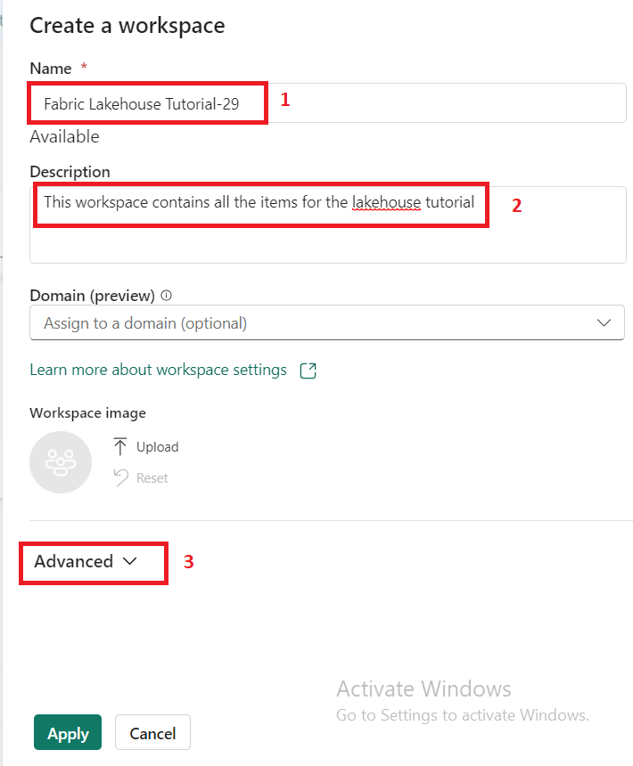

6.  Attendez la fin du déploiement. Cela prend 2-3 minutes à compléter.

## **Tâche 2 : Créer une maison au bord du lac**

1.  Dans la page **Power BI Fabric Lakehouse Tutorial-XX**, cliquez sur
    l'icône **Power BI** située en bas à gauche et sélectionnez **Data
    Engineering**.

> 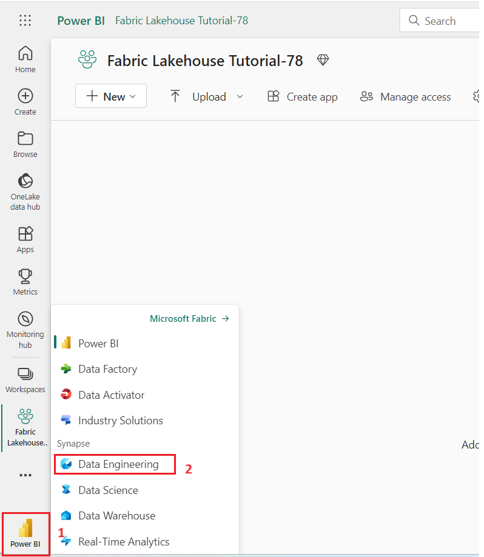

2.  Sur la page d'accueil de **Synapse Data Engineering** , sélectionnez
    **Lakehouse** pour créer un lakehouse.

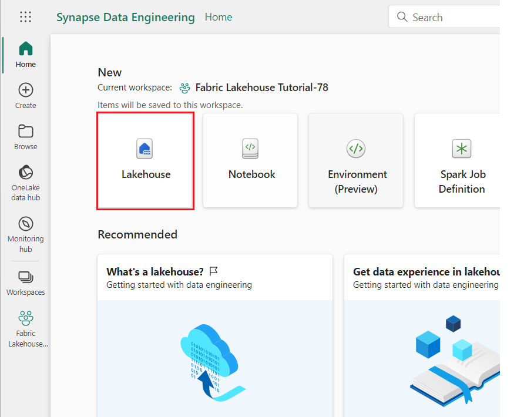

3.  Dans la boîte de dialogue New lakehouse, entrez **wwilakehouse**
    dans le champ **Name**, cliquez sur le bouton **Create** et ouvrez
    le New lakehouse.

> **Remarque** : Assurez-vous de supprimer l'espace avant
> **wwilakehouse**.
>
> 
>
> 
>
> 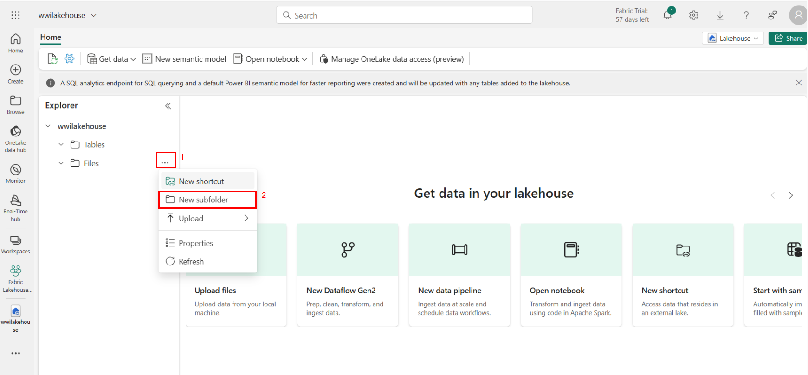

4.  Une notification indiquant **Successfully created SQL endpoint**,
    s'affiche.

> 

# Exercice 2 : Implémentation de l'architecture Medallion à l'aide d'Azure Databricks

## **Tâche 1 : Mise en place de la couche de bronze**

1.  Sur la **page wwilakehouse**, sélectionnez l'icône Plus à côté des
    fichiers (...), puis sélectionnez **New subfolder**

2.  Dans la fenêtre contextuelle, indiquez le nom du dossier bronze,
    puis sélectionnez Créer.

3.  Maintenant, sélectionnez l'icône Plus à côté des fichiers bronze
    (...), puis sélectionnez **Upload**, puis **upload files**.

4.  Dans le volet **upload file**, sélectionnez la case d'option
    **Upload file**. Cliquez sur le bouton **Browse** et accédez à
    **C :\LabFiles**, puis sélectionnez le fichier de fichiers de
    données de vente requis (2019, 2020, 2021) et cliquez sur le bouton
    Open.

Ensuite, sélectionnez **Upload** pour télécharger les fichiers dans le
nouveau dossier « bronze » de votre Lakehouse.

> 

5.  Cliquez sur le dossier **bronze** pour vérifier que les fichiers ont
    été téléchargés avec succès et qu'ils sont reflétés.

# Exercice 3 : Transformation de données avec Apache Spark et requête avec SQL dans l'architecture médaillon

## **Tâche 1 : Transformer les données et les charger dans la table Delta Silver**

Dans la page **wwilakehouse**, naviguez et cliquez sur **Open notebook**
dans la barre de commandes, puis sélectionnez **New notebook**.

1.  Sélectionnez la première cellule (qui est actuellement une *cellule
    de code*), puis dans la barre d'outils dynamique en haut à droite,
    utilisez le bouton **M↓** pour **convertir la cellule en cellule
    Markdown (convert the cell to a markdown cell)**.

2.  Lorsque la cellule se transforme en cellule Markdown, le texte
    qu'elle contient est affiché.

3.  Utilisez le **🖉** bouton (Modifier) pour passer la cellule en mode
    édition, remplacez tout le texte puis modifiez la démarque comme
    suit :

CodeCopy

\# Exploration des données de commande client

Utilisez le code de ce notebook pour explorer les données de commande
client.

4.  Cliquez n'importe où dans le Notebook en dehors de la cellule pour
    arrêter de le modifier et voir le markdown rendu.

5.  Utilisez l'icône de code + sous la sortie de la cellule pour ajouter
    une nouvelle cellule de code au Notebook.

6.  Maintenant, utilisez le notebook pour charger les données de la
    couche bronze dans un DataFrame Spark.

Sélectionnez la cellule existante dans le Notebook, qui contient un code
commenté simple. Mettez en surbrillance et supprimez ces deux lignes -
vous n'aurez pas besoin de ce code.

*Remarque : Les notebooks vous permettent d'Run du code dans divers
langages, notamment Python, Scala et SQL. Dans cet exercice, vous allez
utiliser PySpark et SQL. Vous pouvez également ajouter des cellules
Markdown pour fournir du texte et des images formatés afin de documenter
votre code.*

Pour cela, entrez le code suivant et cliquez sur **Run**.

CodeCopy

from pyspark.sql.types import \*

\# Create the schema for the table

orderSchema = StructType(\[

StructField("SalesOrderNumber", StringType()),

StructField("SalesOrderLineNumber", IntegerType()),

StructField("OrderDate", DateType()),

StructField("CustomerName", StringType()),

StructField("Email", StringType()),

StructField("Item", StringType()),

StructField("Quantity", IntegerType()),

StructField("UnitPrice", FloatType()),

StructField("Tax", FloatType())

\])

\# Import all files from bronze folder of lakehouse

df = spark.read.format("csv").option("header",
"true").schema(orderSchema).load("Files/bronze/\*.csv")

\# Display the first 10 rows of the dataframe to preview your data

display(df.head(10))

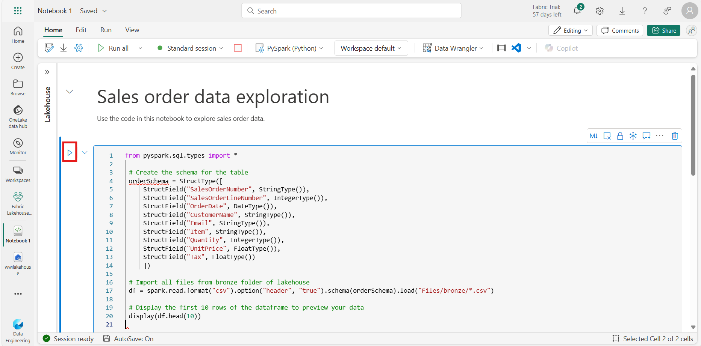

***Remarque** : Comme c'est la première fois que vous exécutez du code
Spark dans ce notebook, une session Spark doit être démarrée. Cela
signifie que la première exécution peut prendre environ une minute. Les
exécutions suivantes seront plus rapides.*

7.  Le code que vous avez exécuté a chargé les données des fichiers CSV
    dans le dossier **bronze** dans une trame de données Spark, puis a
    affiché les premières lignes de la trame de données.

> **Remarque** : Vous pouvez effacer, masquer et redimensionner
> automatiquement le contenu de la sortie de cellule en sélectionnant
> l'icône **...** en haut à gauche du volet de sortie.

8.  Vous allez maintenant **add columns for data validation and
    cleanup** des données, à l'aide d'une trame de données PySpark pour
    ajouter des colonnes et mettre à jour les valeurs de certaines
    colonnes existantes. Utilisez le bouton + pour **add a new code
    block** et ajoutez le code suivant à la cellule :

> CodeCopy
>
> from pyspark.sql.functions import when, lit, col, current_timestamp,
> input_file_name
>
> \# Add columns IsFlagged, CreatedTS and ModifiedTS
>
> df = df.withColumn("FileName", input_file_name()) \\
>
> .withColumn("IsFlagged", when(col("OrderDate") \<
> '2019-08-01',True).otherwise(False)) \\
>
> .withColumn("CreatedTS", current_timestamp()).withColumn("ModifiedTS",
> current_timestamp())
>
> \# Update CustomerName to "Unknown" if CustomerName null or empty
>
> df = df.withColumn("CustomerName", when((col("CustomerName").isNull()
> |
> (col("CustomerName")=="")),lit("Unknown")).otherwise(col("CustomerName")))
>
> La première ligne du code importe les fonctions nécessaires de
> PySpark. Vous ajoutez ensuite de nouvelles colonnes à la trame de
> données afin de pouvoir suivre le nom du fichier source, si la
> commande a été marquée comme étant avant l'exercice fiscal qui vous
> intéresse et quand la ligne a été créée et modifiée.
>
> Enfin, vous mettez à jour la colonne CustomerName sur “Unknown” si
> elle est null ou vide.
>
> Ensuite, exécutez la cellule pour Run le code à l'aide du bouton
> **\*\*▷** (*Run cell*)\*\*.

9.  Ensuite, vous allez définir le schéma de la table **sales_silver**
    dans la base de données de vente au format Delta Lake. Créez un
    nouveau bloc de code et ajoutez le code suivant à la cellule :

> CodeCopy

from pyspark.sql.types import \*

from delta.tables import \*

\# Define the schema for the sales_silver table

silver_table_schema = StructType(\[

    StructField("SalesOrderNumber", StringType(), True),

    StructField("SalesOrderLineNumber", IntegerType(), True),

    StructField("OrderDate", DateType(), True),

    StructField("CustomerName", StringType(), True),

    StructField("Email", StringType(), True),

    StructField("Item", StringType(), True),

    StructField("Quantity", IntegerType(), True),

    StructField("UnitPrice", FloatType(), True),

    StructField("Tax", FloatType(), True),

    StructField("FileName", StringType(), True),

    StructField("IsFlagged", BooleanType(), True),

    StructField("CreatedTS", TimestampType(), True),

    StructField("ModifiedTS", TimestampType(), True)

\])

\# Create or replace the sales_silver table with the defined schema

DeltaTable.createIfNotExists(spark) \\

    .tableName("wwilakehouse.sales_silver") \\

    .addColumns(silver_table_schema) \\

    .execute()

   

10. Exécutez la cellule pour Run le code à l'aide du bouton **\*\*▷**
    (*Run cell*)\*\*.

11. Sélectionnez l'icône **...** dans la section Tables du volet de
    l'explorateur lakehouse et sélectionnez **Refresh**. Vous devriez
    maintenant voir la nouvelle table **sales_silver** répertoriée. Le
    **▲** (icône en forme de triangle) indique qu'il s'agit d'une table
    Delta.

> **Remarque** : Si vous ne voyez pas le nouveau tableau, patientez
> quelques secondes, puis sélectionnez à nouveau **Refresh** ou
> actualisez l'ensemble de l'onglet du navigateur.
>
> 
>
> 

12. Vous allez maintenant effectuer une **opération de mise à niveau
    (upsert operation)** sur une table Delta, en mettant à jour les
    enregistrements existants en fonction de conditions spécifiques et
    en insérant de nouveaux enregistrements lorsqu'aucune correspondance
    n'est trouvée. Ajoutez un nouveau bloc de code et collez le code
    suivant :

> CodeCopy
>
> from pyspark.sql.types import \*
>
> from pyspark.sql.functions import when, lit, col, current_timestamp,
> input_file_name
>
> from delta.tables import \*
>
> \# Define the schema for the source data
>
> orderSchema = StructType(\[
>
> StructField("SalesOrderNumber", StringType(), True),
>
> StructField("SalesOrderLineNumber", IntegerType(), True),
>
> StructField("OrderDate", DateType(), True),
>
> StructField("CustomerName", StringType(), True),
>
> StructField("Email", StringType(), True),
>
> StructField("Item", StringType(), True),
>
> StructField("Quantity", IntegerType(), True),
>
> StructField("UnitPrice", FloatType(), True),
>
> StructField("Tax", FloatType(), True)
>
> \])
>
> \# Read data from the bronze folder into a DataFrame
>
> df = spark.read.format("csv").option("header",
> "true").schema(orderSchema).load("Files/bronze/\*.csv")
>
> \# Add additional columns
>
> df = df.withColumn("FileName", input_file_name()) \\
>
> .withColumn("IsFlagged", when(col("OrderDate") \< '2019-08-01',
> True).otherwise(False)) \\
>
> .withColumn("CreatedTS", current_timestamp()) \\
>
> .withColumn("ModifiedTS", current_timestamp()) \\
>
> .withColumn("CustomerName", when((col("CustomerName").isNull()) |
> (col("CustomerName") == ""),
> lit("Unknown")).otherwise(col("CustomerName")))
>
> \# Define the path to the Delta table
>
> deltaTablePath = "Tables/sales_silver"
>
> \# Create a DeltaTable object for the existing Delta table
>
> deltaTable = DeltaTable.forPath(spark, deltaTablePath)
>
> \# Perform the merge (upsert) operation
>
> deltaTable.alias('silver') \\
>
> .merge(
>
> df.alias('updates'),
>
> 'silver.SalesOrderNumber = updates.SalesOrderNumber AND \\
>
> silver.OrderDate = updates.OrderDate AND \\
>
> silver.CustomerName = updates.CustomerName AND \\
>
> silver.Item = updates.Item'
>
> ) \\
>
> .whenMatchedUpdate(set = {
>
> "SalesOrderLineNumber": "updates.SalesOrderLineNumber",
>
> "Email": "updates.Email",
>
> "Quantity": "updates.Quantity",
>
> "UnitPrice": "updates.UnitPrice",
>
> "Tax": "updates.Tax",
>
> "FileName": "updates.FileName",
>
> "IsFlagged": "updates.IsFlagged",
>
> "ModifiedTS": "current_timestamp()"
>
> }) \\
>
> .whenNotMatchedInsert(values = {
>
> "SalesOrderNumber": "updates.SalesOrderNumber",
>
> "SalesOrderLineNumber": "updates.SalesOrderLineNumber",
>
> "OrderDate": "updates.OrderDate",
>
> "CustomerName": "updates.CustomerName",
>
> "Email": "updates.Email",
>
> "Item": "updates.Item",
>
> "Quantity": "updates.Quantity",
>
> "UnitPrice": "updates.UnitPrice",
>
> "Tax": "updates.Tax",
>
> "FileName": "updates.FileName",
>
> "IsFlagged": "updates.IsFlagged",
>
> "CreatedTS": "current_timestamp()",
>
> "ModifiedTS": "current_timestamp()"
>
> }) \\
>
> .execute()

13. Exécutez la cellule pour Run le code à l'aide du bouton **\*\*▷**
    (*Run cell*)\*\*.

Cette opération est importante car elle vous permet de mettre à jour les
enregistrements existants dans la table en fonction des valeurs de
colonnes spécifiques et d'insérer de nouveaux enregistrements
lorsqu'aucune correspondance n'est trouvée. Il s'agit d'une exigence
courante lorsque vous chargez des données à partir d'un système source
qui peut contenir des mises à jour d'enregistrements existants et
nouveaux.

Vous avez maintenant des données dans votre table delta Silver qui sont
prêtes pour une transformation et une modélisation ultérieure.

Vous avez réussi à prendre des données de votre couche bronze, à les
transformer et à les charger dans une table Delta argentée. Vous allez
maintenant utiliser un nouveau notebook pour transformer davantage les
données, les modéliser dans un schéma en étoile et les charger dans des
tables Delta dorées.

*Notez que vous auriez pu effectuer tout cela dans un seul Notebook,
mais pour les besoins de cet exercice, vous utilisez des Notebook
distincts pour illustrer le processus de transformation des données de
bronze à argent, puis d'argent à or. Cela peut faciliter le débogage, le
dépannage et la réutilisation*.

## **Tâche 2 : Charger des données dans des tables Gold Delta**

1.  Retournez à la page d'accueil de Fabric Lakehouse Tutorial-29.

> 

2.  Sélectionnez **wwilakehouse.**

3.  Dans le volet de l'explorateur Lakehouse, vous devez voir la **table
    sales_silver** répertoriée dans la section **Tables** du volet de
    l'explorateur.

4.  Maintenant, créez un Notebook appelé **Transform data for Gold**.
    Pour cela, naviguez et cliquez sur **Open notebook** dans la barre
    de commandes, puis sélectionnez **New notebook**.

5.  Dans le bloc de code existant, supprimez le texte standard et
    **ajoutez le code suivant (add the following code)** pour charger
    les données dans votre trame de données et commencer à créer votre
    schéma en étoile, puis exécutez-le :

> CodeCopy

\# Load data to the dataframe as a starting point to create the gold
layer

df = spark.read.table("wwilakehouse.sales_silver")

\# Display the first few rows of the dataframe to verify the data

df.show()

6.  Ensuite**, Add a new code block** et collez le code suivant pour
    créer votre table de dimension de date et exécutez-la :

 from pyspark.sql.types import \*

 from delta.tables import\*

   

 # Define the schema for the dimdate_gold table

 DeltaTable.createIfNotExists(spark) \\

     .tableName("wwilakehouse.dimdate_gold") \\

     .addColumn("OrderDate", DateType()) \\

     .addColumn("Day", IntegerType()) \\

     .addColumn("Month", IntegerType()) \\

     .addColumn("Year", IntegerType()) \\

     .addColumn("mmmyyyy", StringType()) \\

     .addColumn("yyyymm", StringType()) \\

     .execute()

**Remarque** : Vous pouvez Run la **commande** display(df) à tout moment
pour vérifier l'avancement de votre travail. Dans ce cas, vous devez Run
'display(dfdimDate_gold) pour voir le contenu de la trame de données
dimDate_gold.

7.  Dans un nouveau bloc de code, **add and run the following code**
    pour créer une trame de données pour votre dimension de date,
    **dimdate_gold** :

> CodeCopy

from pyspark.sql.functions import col, dayofmonth, month, year,
date_format

   

 # Create dataframe for dimDate_gold

   

dfdimDate_gold
=df.dropDuplicates(\["OrderDate"\]).select(col("OrderDate"), \\

         dayofmonth("OrderDate").alias("Day"), \\

         month("OrderDate").alias("Month"), \\

         year("OrderDate").alias("Year"), \\

         date_format(col("OrderDate"), "MMM-yyyy").alias("mmmyyyy"), \\

         date_format(col("OrderDate"), "yyyyMM").alias("yyyymm"), \\

     ).orderBy("OrderDate")

 # Display the first 10 rows of the dataframe to preview your data

display(dfdimDate_gold.head(10))

8.  Vous séparez le code en nouveaux blocs de code afin de pouvoir
    comprendre et observer ce qui se passe dans le Notebook pendant que
    vous transformez les données. Dans un autre nouveau bloc de code,
    **ajoutez et exécutez le code suivant  
    (add and run the following code)** pour mettre à jour la dimension
    de date à mesure que de nouvelles données arrivent :

> CodeCopy
>
> from delta.tables import \*
>
> deltaTable = DeltaTable.forPath(spark, 'Tables/dimdate_gold')
>
> dfUpdates = dfdimDate_gold
>
> deltaTable.alias('silver') \\
>
> .merge(
>
> dfUpdates.alias('updates'),
>
> 'silver.OrderDate = updates.OrderDate'
>
> ) \\
>
> .whenMatchedUpdate(set =
>
> {
>
> }
>
> ) \\
>
> .whenNotMatchedInsert(values =
>
> {
>
> "OrderDate": "updates.OrderDate",
>
> "Day": "updates.Day",
>
> "Month": "updates.Month",
>
> "Year": "updates.Year",
>
> "mmmyyyy": "updates.mmmyyyy",
>
> "yyyymm": "yyyymm"
>
> }
>
> ) \\
>
> .execute()

> Votre dimension de date est configurée.

## **Tâche 3 : Créez votre dimension client.**

1.  Pour créer la table de dimension client, **add a new code block**,
    collez et exécutez le code suivant :

> CodeCopy

 from pyspark.sql.types import \*

 from delta.tables import \*

   

 # Create customer_gold dimension delta table

 DeltaTable.createIfNotExists(spark) \\

     .tableName("wwilakehouse.dimcustomer_gold") \\

     .addColumn("CustomerName", StringType()) \\

     .addColumn("Email",  StringType()) \\

     .addColumn("First", StringType()) \\

     .addColumn("Last", StringType()) \\

     .addColumn("CustomerID", LongType()) \\

     .execute()

2.  Dans un nouveau bloc de code, **ajoutez et exécutez le code
    suivant** (**add and run the following code)** pour supprimer les
    clients en double, sélectionnez des colonnes spécifiques et
    fractionnez la colonne « CustomerName » pour créer des colonnes «
    First » et « Last » name :

> CodeCopy
>
> from pyspark.sql.functions import col, split
>
> \# Create customer_silver dataframe
>
> dfdimCustomer_silver =
> df.dropDuplicates(\["CustomerName","Email"\]).select(col("CustomerName"),col("Email"))
> \\
>
> .withColumn("First",split(col("CustomerName"), " ").getItem(0)) \\
>
> .withColumn("Last",split(col("CustomerName"), " ").getItem(1))
>
> \# Display the first 10 rows of the dataframe to preview your data
>
> display(dfdimCustomer_silver.head(10))
>
> 

Ici, vous avez créé un nouveau DataFrame dfdimCustomer_silver en
effectuant diverses transformations telles que la suppression des
doublons, la sélection de colonnes spécifiques et la division de la
colonne « CustomerName » pour créer des colonnes « First » et « Last
name ». Le résultat est un DataFrame avec des données client nettoyées
et structurées, y compris des colonnes de nom de famille et de prénom
distinctes extraites de la colonne de type “CustomerName”.

3.  Ensuite, nous allons **create the ID column for our customers**.
    Dans un nouveau bloc de code, collez et exécutez ce qui suit :

CodeCopy

from pyspark.sql.functions import monotonically_increasing_id, col,
when, coalesce, max, lit

\# Read the existing data from the Delta table

dfdimCustomer_temp = spark.read.table("wwilakehouse.dimCustomer_gold")

\# Find the maximum CustomerID or use 0 if the table is empty

MAXCustomerID =
dfdimCustomer_temp.select(coalesce(max(col("CustomerID")),
lit(0)).alias("MAXCustomerID")).first()\[0\]

\# Assume dfdimCustomer_silver is your source DataFrame with new data

\# Here, we select only the new customers by doing a left anti join

dfdimCustomer_gold = dfdimCustomer_silver.join(

    dfdimCustomer_temp,

    (dfdimCustomer_silver.CustomerName ==
dfdimCustomer_temp.CustomerName) &

    (dfdimCustomer_silver.Email == dfdimCustomer_temp.Email),

    "left_anti"

)

\# Add the CustomerID column with unique values starting from
MAXCustomerID + 1

dfdimCustomer_gold = dfdimCustomer_gold.withColumn(

    "CustomerID",

    monotonically_increasing_id() + MAXCustomerID + 1

)

\# Display the first 10 rows of the dataframe to preview your data

dfdimCustomer_gold.show(10)

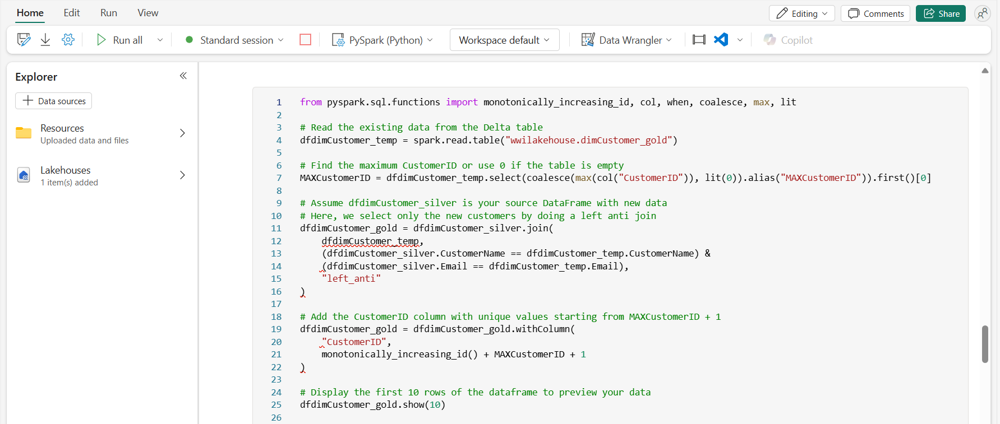

4.  Vous vous assurez désormais que votre table de clients reste à jour
    au fur et à mesure que de nouvelles données arrivent. **Dans un
    nouveau bloc de code (In a new code block)**, collez et exécutez ce
    qui suit :

> CodeCopy

from delta.tables import DeltaTable

\# Define the Delta table path

deltaTable = DeltaTable.forPath(spark, 'Tables/dimcustomer_gold')

\# Use dfUpdates to refer to the DataFrame with new or updated records

dfUpdates = dfdimCustomer_gold

\# Perform the merge operation to update or insert new records

deltaTable.alias('silver') \\

  .merge(

    dfUpdates.alias('updates'),

    'silver.CustomerName = updates.CustomerName AND silver.Email =
updates.Email'

  ) \\

  .whenMatchedUpdate(set =

    {

      "CustomerName": "updates.CustomerName",

      "Email": "updates.Email",

      "First": "updates.First",

      "Last": "updates.Last",

      "CustomerID": "updates.CustomerID"

    }

  ) \\

  .whenNotMatchedInsert(values =

    {

      "CustomerName": "updates.CustomerName",

      "Email": "updates.Email",

      "First": "updates.First",

      "Last": "updates.Last",

      "CustomerID": "updates.CustomerID"

    }

  ) \\

  .execute()

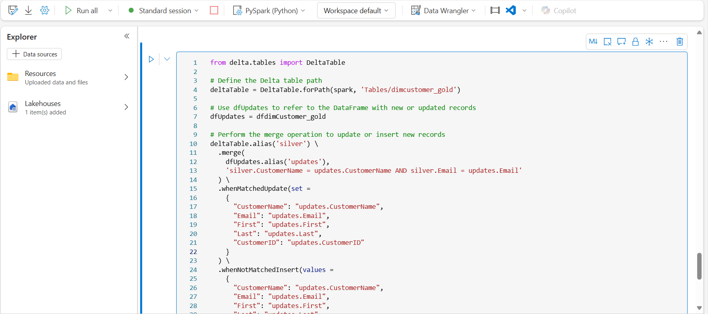

5.  Vous allez maintenant **repeat those steps to create your product
    dimension**. Dans un nouveau bloc de code, collez et exécutez ce qui
    suit :

> CodeCopy
>
> from pyspark.sql.types import \*
>
> from delta.tables import \*
>
> DeltaTable.createIfNotExists(spark) \\
>
> .tableName("wwilakehouse.dimproduct_gold") \\
>
> .addColumn("ItemName", StringType()) \\
>
> .addColumn("ItemID", LongType()) \\
>
> .addColumn("ItemInfo", StringType()) \\
>
> .execute()

6.  **Add another code block** pour créer le **product_silver**
    dataframe.

> CodeCopy
>
> from pyspark.sql.functions import col, split, lit
>
> \# Create product_silver dataframe
>
> dfdimProduct_silver =
> df.dropDuplicates(\["Item"\]).select(col("Item")) \\
>
> .withColumn("ItemName",split(col("Item"), ", ").getItem(0)) \\
>
> .withColumn("ItemInfo",when((split(col("Item"), ",
> ").getItem(1).isNull() | (split(col("Item"), ",
> ").getItem(1)=="")),lit("")).otherwise(split(col("Item"), ",
> ").getItem(1)))
>
> \# Display the first 10 rows of the dataframe to preview your data
>
> display(dfdimProduct_silver.head(10))

7.  Vous allez maintenant créer des ID pour votre **table
    dimProduct_gold**. Ajoutez la syntaxe suivante à un nouveau bloc de
    code et exécutez-le :

CodeCopy

from pyspark.sql.functions import monotonically_increasing_id, col, lit,
max, coalesce

\#dfdimProduct_temp = dfdimProduct_silver

dfdimProduct_temp = spark.read.table("wwilakehouse.dimProduct_gold")

MAXProductID =
dfdimProduct_temp.select(coalesce(max(col("ItemID")),lit(0)).alias("MAXItemID")).first()\[0\]

dfdimProduct_gold =
dfdimProduct_silver.join(dfdimProduct_temp,(dfdimProduct_silver.ItemName
== dfdimProduct_temp.ItemName) & (dfdimProduct_silver.ItemInfo ==
dfdimProduct_temp.ItemInfo), "left_anti")

dfdimProduct_gold =
dfdimProduct_gold.withColumn("ItemID",monotonically_increasing_id() +
MAXProductID + 1)

\# Display the first 10 rows of the dataframe to preview your data

display(dfdimProduct_gold.head(10))

Cela calcule le prochain ID de produit disponible en fonction des
données actuelles de la table, attribue ces nouveaux ID aux produits,
puis affiche les informations sur le produit mises à jour.

8.  À l'instar de ce que vous avez fait avec vos autres dimensions, vous
    devez vous assurer que votre tableau de produits reste à jour au fur
    et à mesure que de nouvelles données arrivent. **In a new code
    block**, collez et exécutez ce qui suit :

CodeCopy

from delta.tables import \*

deltaTable = DeltaTable.forPath(spark, 'Tables/dimproduct_gold')

dfUpdates = dfdimProduct_gold

deltaTable.alias('silver') \\

.merge(

dfUpdates.alias('updates'),

'silver.ItemName = updates.ItemName AND silver.ItemInfo =
updates.ItemInfo'

) \\

.whenMatchedUpdate(set =

{

}

) \\

.whenNotMatchedInsert(values =

{

"ItemName": "updates.ItemName",

"ItemInfo": "updates.ItemInfo",

"ItemID": "updates.ItemID"

}

) \\

.execute()

**Maintenant que vous avez défini vos dimensions, la dernière étape
consiste à créer la table de faits.**

9.  **In a new code block**, collez et exécutez le code suivant pour
    créer **la table de faits (fact table)**:

> CodeCopy
>
> from pyspark.sql.types import \*
>
> from delta.tables import \*
>
> DeltaTable.createIfNotExists(spark) \\
>
> .tableName("wwilakehouse.factsales_gold") \\
>
> .addColumn("CustomerID", LongType()) \\
>
> .addColumn("ItemID", LongType()) \\
>
> .addColumn("OrderDate", DateType()) \\
>
> .addColumn("Quantity", IntegerType()) \\
>
> .addColumn("UnitPrice", FloatType()) \\
>
> .addColumn("Tax", FloatType()) \\
>
> .execute()

10. **In a new code block**, collez et exécutez le code suivant pour
    créer un **new dataframe** afin de combiner les données de vente
    avec les informations sur le client et le produit, notamment l'ID
    client, l'ID de l'article, la date de commande, la quantité, le prix
    unitaire et les taxes :

CodeCopy

from pyspark.sql import SparkSession

from pyspark.sql.functions import split, col, when, lit

from pyspark.sql.types import StructType, StructField, StringType,
IntegerType, DateType, FloatType, BooleanType, TimestampType

\# Initialize Spark session

spark = SparkSession.builder \\

    .appName("DeltaTableUpsert") \\

    .config("spark.sql.extensions",
"io.delta.sql.DeltaSparkSessionExtension") \\

    .config("spark.sql.catalog.spark_catalog",
"org.apache.spark.sql.delta.catalog.DeltaCatalog") \\

    .getOrCreate()

\# Define the schema for the sales_silver table

silver_table_schema = StructType(\[

    StructField("SalesOrderNumber", StringType(), True),

    StructField("SalesOrderLineNumber", IntegerType(), True),

    StructField("OrderDate", DateType(), True),

    StructField("CustomerName", StringType(), True),

    StructField("Email", StringType(), True),

    StructField("Item", StringType(), True),

    StructField("Quantity", IntegerType(), True),

    StructField("UnitPrice", FloatType(), True),

    StructField("Tax", FloatType(), True),

    StructField("FileName", StringType(), True),

    StructField("IsFlagged", BooleanType(), True),

    StructField("CreatedTS", TimestampType(), True),

    StructField("ModifiedTS", TimestampType(), True)

\])

\# Define the path to the Delta table (ensure this path is correct)

delta_table_path =
"abfss://\<container\>@\<storage-account\>.dfs.core.windows.net/path/to/wwilakehouse/sales_silver"

\# Create a DataFrame with the defined schema

empty_df = spark.createDataFrame(\[\], silver_table_schema)

\# Register the Delta table in the Metastore

spark.sql(f"""

    CREATE TABLE IF NOT EXISTS wwilakehouse.sales_silver

    USING DELTA

    LOCATION '{delta_table_path}'

""")

\# Load data into DataFrame

df = spark.read.table("wwilakehouse.sales_silver")

\# Perform transformations on df

df = df.withColumn("ItemName", split(col("Item"), ", ").getItem(0)) \\

    .withColumn("ItemInfo", when(

        (split(col("Item"), ", ").getItem(1).isNull()) |
(split(col("Item"), ", ").getItem(1) == ""),

        lit("")

    ).otherwise(split(col("Item"), ", ").getItem(1)))

\# Load additional DataFrames for joins

dfdimCustomer_temp = spark.read.table("wwilakehouse.dimCustomer_gold")

dfdimProduct_temp = spark.read.table("wwilakehouse.dimProduct_gold")

\# Create Sales_gold dataframe

dffactSales_gold = df.alias("df1").join(dfdimCustomer_temp.alias("df2"),
(df.CustomerName == dfdimCustomer_temp.CustomerName) & (df.Email ==
dfdimCustomer_temp.Email), "left") \\

    .join(dfdimProduct_temp.alias("df3"), (df.ItemName ==
dfdimProduct_temp.ItemName) & (df.ItemInfo ==
dfdimProduct_temp.ItemInfo), "left") \\

    .select(

        col("df2.CustomerID"),

        col("df3.ItemID"),

        col("df1.OrderDate"),

        col("df1.Quantity"),

        col("df1.UnitPrice"),

        col("df1.Tax")

    ).orderBy(col("df1.OrderDate"), col("df2.CustomerID"),
col("df3.ItemID"))

\# Show the result

dffactSales_gold.show()

1.  Vous allez maintenant vous assurer que les données de vente restent
    à jour en exécutant le code suivant dans un **new code block** :

> CodeCopy
>
> from delta.tables import \*
>
> deltaTable = DeltaTable.forPath(spark, 'Tables/factsales_gold')
>
> dfUpdates = dffactSales_gold
>
> deltaTable.alias('silver') \\
>
> .merge(
>
> dfUpdates.alias('updates'),
>
> 'silver.OrderDate = updates.OrderDate AND silver.CustomerID =
> updates.CustomerID AND silver.ItemID = updates.ItemID'
>
> ) \\
>
> .whenMatchedUpdate(set =
>
> {
>
> }
>
> ) \\
>
> .whenNotMatchedInsert(values =
>
> {
>
> "CustomerID": "updates.CustomerID",
>
> "ItemID": "updates.ItemID",
>
> "OrderDate": "updates.OrderDate",
>
> "Quantity": "updates.Quantity",
>
> "UnitPrice": "updates.UnitPrice",
>
> "Tax": "updates.Tax"
>
> }
>
> ) \\
>
> .execute()

Ici, vous utilisez l'opération de fusion de Delta Lake pour synchroniser
et mettre à jour la table factsales_gold avec de nouvelles données de
vente (dffactSales_gold). L'opération compare la date de commande, l'ID
client et l'ID d'article entre les données existantes (table argentée)
et les nouvelles données (mise à jour DataFrame), en mettant à jour les
enregistrements correspondants et en insérant de nouveaux
enregistrements si nécessaire.

Vous disposez maintenant d’une couche **gold** organisée et modélisée
qui peut être utilisée pour la création de rapports et l'analyse.

# Exercice 4 : Établissement de la connectivité entre Azure Databricks et Azure Data Lake Storage (ADLS) Gen 2

Nous allons maintenant créer une table Delta à l'aide de votre compte
Azure Data Lake Storage (ADLS) Gen2 à l'aide d'Azure Databricks.
Ensuite, vous allez créer un raccourci OneLake vers une table Delta dans
ADLS et utiliser Power BI pour analyser les données via le raccourci
ADLS.

## **Tâche 0 : Utiliser un pass Azure et activer l'abonnement Azure**

1.  Naviguez sur le lien suivant !!
    https://www.microsoftazurepass.com/ !! et cliquez sur le bouton
    **Démarrer**.

2.  Sur la page de connexion Microsoft, entrez Tenant ID**,** cliquez
    sur **Next**.

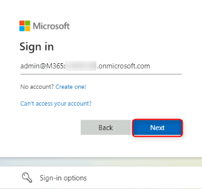

3.  Sur la page suivante, entrez votre mot de passe et cliquez sur
    **Sign In**.

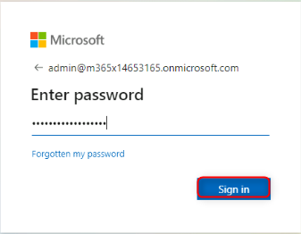

4.  Une fois connecté, sur la page Microsoft Azure, cliquez sur l’onglet
    **Confirm Microsoft Account**

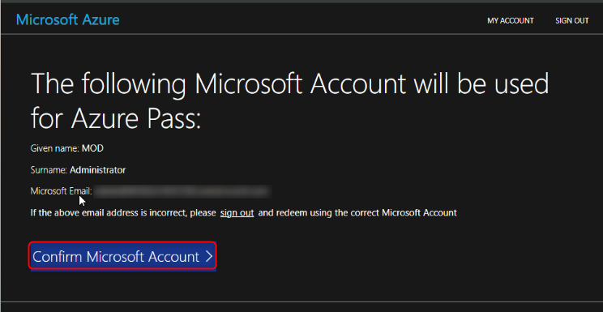

5.  Sur la page suivante, entrez le code promotionnel, les caractères
    Captcha et cliquez sur **Submit.**

6.  Sur la page Votre profil, entrez les détails de votre profil et
    cliquez sur **SIgn up.**

7.  si vous y êtes invité, inscrivez-vous à l'authentification
    multifacteur, puis connectez-vous au portail Azure en naviguant
    jusqu'au lien suivant !! <https://portal.azure.com/#home> !!

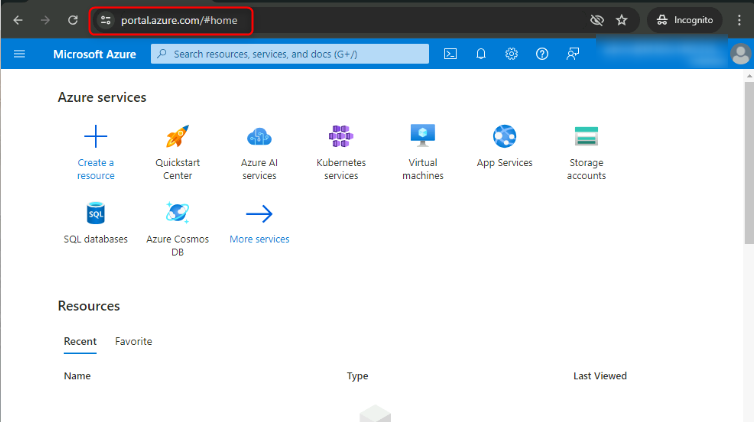

8.  Dans la barre de recherche, tapez Abonnement et cliquez sur l'icône
    Abonnement sous **Services.**

9.  Une fois l'échange réussi d'Azure Pass réussi, un ID d'abonnement
    est généré.

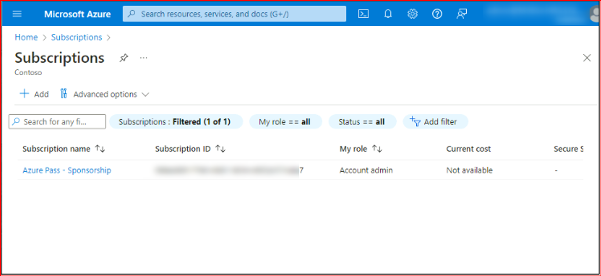

## **Tâche 1 : Créer un compte Azure Data Storage**

1.  Connectez-vous à votre portail Azure à l'aide de vos informations
    d'identification Azure.

2.  Sur la page d'accueil, dans le menu du portail de gauche,
    sélectionnez **Storage accounts** pour afficher la liste de vos
    comptes de stockage. Si le menu du portail n'est pas visible,
    sélectionnez le bouton de menu pour l'activer.

3.  Sur la page **Storage accounts**, sélectionnez **Create**.

4.  Sous l'onglet Informations de base, après avoir sélectionné un
    groupe de ressources, fournissez les informations essentielles pour
    votre compte de stockage :

[TABLE]

Laissez les autres paramètres tels quels et sélectionnez **Review +
create** pour accepter les options par défaut et procéder à la
validation et à la création du compte.

Remarque : Si vous n'avez pas encore créé de groupe de ressources, vous
pouvez cliquer sur “**Create new**” et créer une ressource pour votre
compte de stockage.

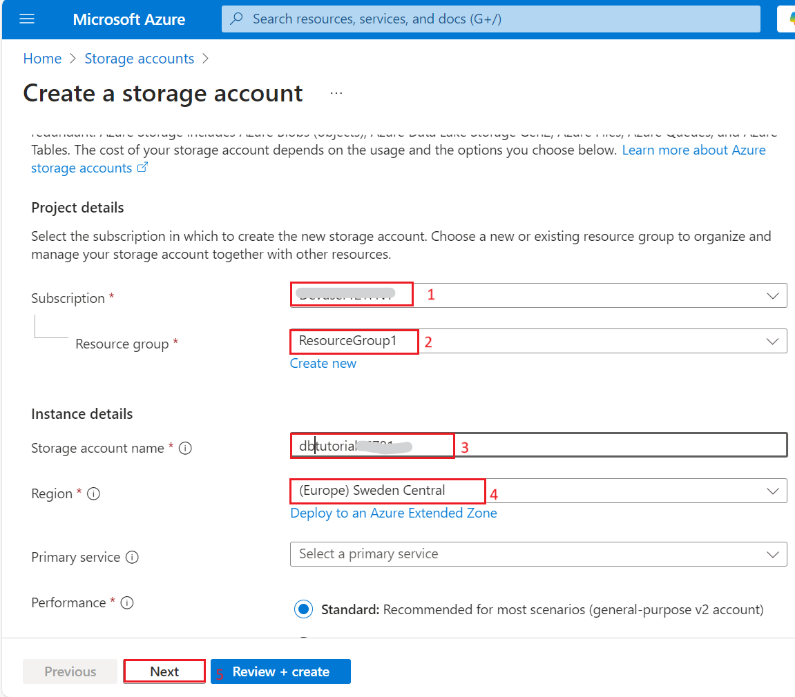

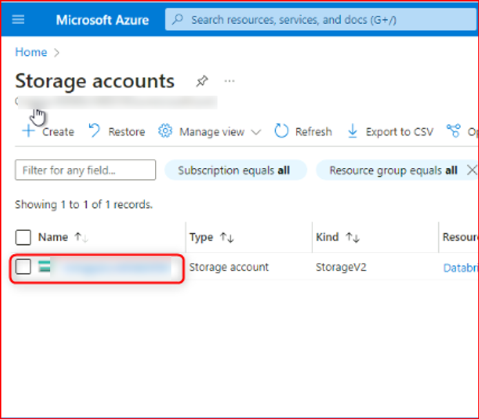

5.  Lorsque vous accédez à l'onglet **Review + create**, Azure exécute
    la validation sur les paramètres du compte de stockage que vous avez
    choisis. Si la validation réussit, vous pouvez procéder à la
    création du compte de stockage.

En cas d'échec de la validation, le portail indique les paramètres à
modifier.

Vous avez maintenant créé votre compte de stockage de données Azure.

6.  Accédez à la page des comptes de stockage en effectuant une
    recherche dans la barre de recherche en haut de la page, puis
    sélectionnez le compte de stockage nouvellement créé.

7.  Sur la page du compte de stockage, accédez à **Containers** sous
    **Data storage** dans le volet de navigation de gauche, créez un
    conteneur avec le nom !! médaillon1 !! et cliquez sur le bouton
    **Create**.

 

8.  Revenez maintenant sur la page du **storage account**, sélectionnez
    **Endpoints** dans le menu de navigation de gauche. Faites défiler
    l'écran vers le bas et copiez l'URL du **Primary endpoint URL** et
    collez-la sur un Notebook. Cela vous sera utile lors de la création
    du raccourci.

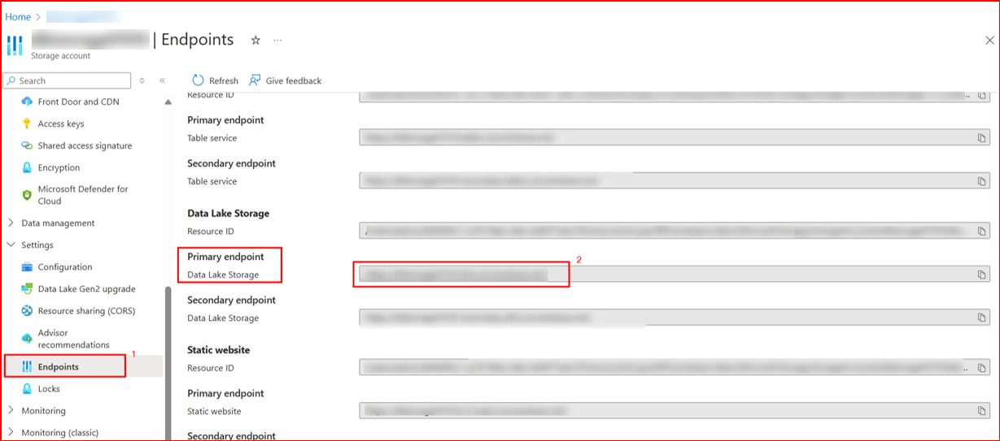

9.  De même, accédez aux **Access keys** dans le même panneau de
    navigation.

## **Tâche 2 : Créez une table Delta, créez un raccourci et analysez les données de votre Lakehouse**

1.  Dans votre lakehouse, sélectionnez les (...) à côté de fichiers,
    puis sélectionnez **New shortcut**.

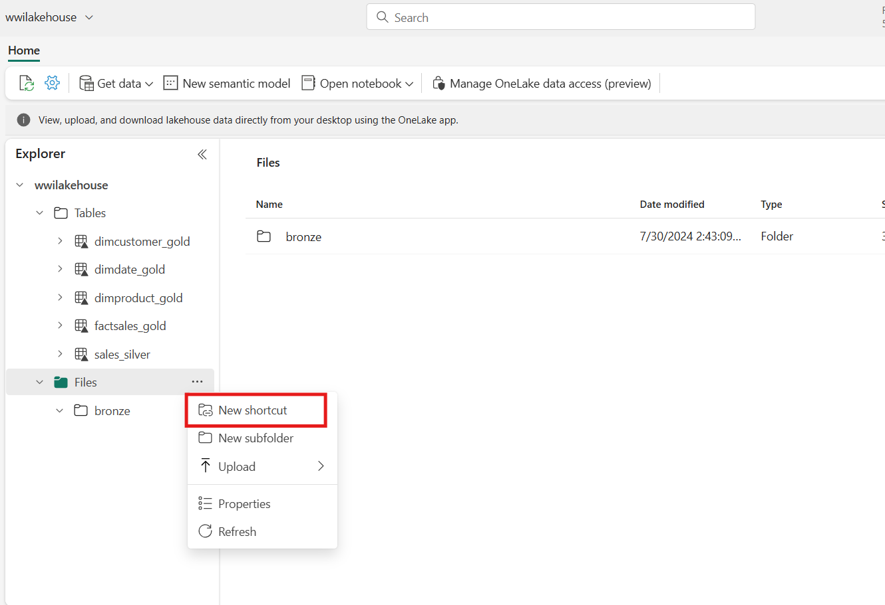

2.  Dans l'écran **New shortcut**, sélectionnez la vignette **Azure Data
    Lake Storage Gen2**.

3.  Spécifiez les détails de connexion du raccourci :

[TABLE]

4.  Et cliquez sur **Next**.

5.  Cela établira un lien avec votre conteneur de stockage Azure.
    Sélectionnez le stockage, puis sélectionnez le bouton **Next**.

6.  Une fois l'Assistant lancé, sélectionnez **Files** et sélectionnez
    l'icône **"... »** sur la lime en **bronze**.

7.  Sélectionnez **load to tables** et **new table**.

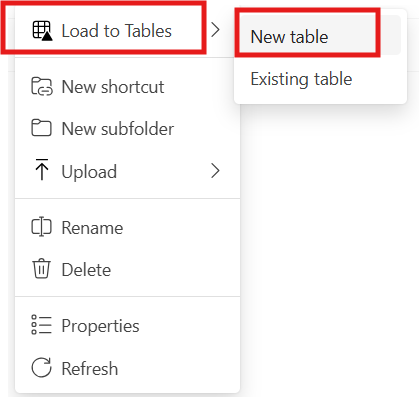

8.  Dans la fenêtre contextuelle, indiquez le nom de votre table sous la
    forme **bronze_01** et sélectionnez le type de fichier **Parquet**.

9.  Le fichier **bronze_01** est maintenant visible dans les fichiers.

10. Ensuite, sélectionnez l'icône **"... »** sur la lime en **bronze**.
    Sélectionnez **load to tables** et **existing table..**

11. Indiquez le nom de la table existante sous la forme
    **dimcustomer_gold.** Sélectionnez le type de fichier **Parquet** et
    sélectionnez **load.**

## **Tâche 3 : Création d'un modèle sémantique Utilisation de la couche d'or pour créer un rapport**

Dans votre espace de travail, vous pouvez désormais utiliser la couche
or pour créer un rapport et analyser les données. Vous pouvez accéder au
modèle sémantique directement dans votre espace de travail pour créer
des relations et des mesures pour la création de rapports.

*Notez que vous ne pouvez pas utiliser le  **default semantic model**
qui est créé automatiquement lorsque vous créez une Lakehouse. Vous
devez créer un modèle sémantique qui inclut les tables d'or que vous
avez créées dans cet atelier, à partir de l'explorateur lakehouse.*

1.  Dans votre espace de travail, accédez à votre lakehouse
    **wwilakehouse**. Sélectionnez ensuite **New semantic model** dans
    le ruban de la vue Lakehouse Explorer.

2.  Dans la fenêtre contextuelle, attribuez le nom
    **DatabricksTutorial** à votre nouveau modèle sémantique et
    sélectionnez l'espace de travail Fabric **Lakehouse Tutorial-29**.

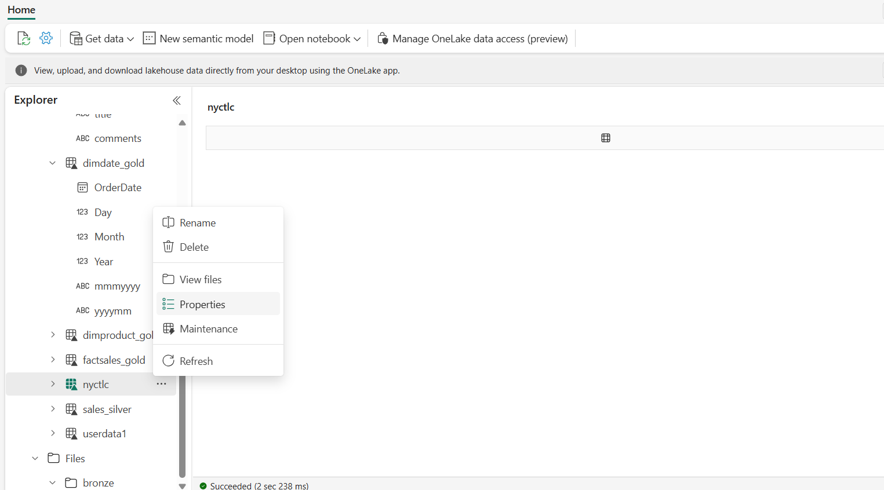

3.  Ensuite, faites défiler vers le bas et sélectionnez tout ce à
    inclure dans votre modèle sémantique, puis sélectionnez **Confirm**.

Cela ouvrira le modèle sémantique dans Fabric où vous pourrez créer des
relations et des mesures, comme illustré ici :

À partir de là, vous ou d'autres membres de votre équipe de données
pouvez créer des rapports et des tableaux de bord basés sur les données
de votre lakehouse. Ces rapports seront connectés directement à la
couche d'or de votre lakehouse, de sorte qu'ils refléteront toujours les
dernières données.

# Exercice 5 : Ingestion de données et analyse avec Azure Databricks

1.  Accédez à votre lakehouse dans le service Power BI et sélectionnez
    **Obtenir des données**, puis Nouveau **pipeline de données**.

1.  Dans l'invite **New pipeline**, entrez un nom pour le nouveau
    pipeline, puis sélectionnez **Create**. **IngestionDatapipeline01**

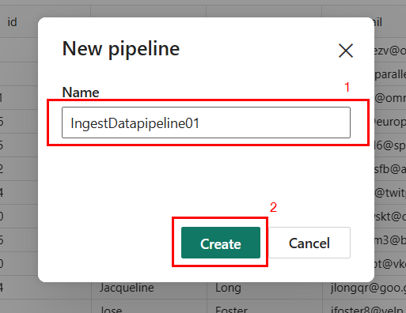

2.  Pour cet exercice, sélectionnez l’exemple de données **NYC Taxi -
    Green** comme source de données.

3.  Sur l'écran d'aperçu, sélectionnez **Next**.

4.  Pour Destination des données, sélectionnez le nom de la table que
    vous souhaitez utiliser pour stocker les données de la table OneLake
    Delta. Vous pouvez choisir une table existante ou en créer une
    nouvelle. Pour les besoins de cet atelier, sélectionnez **load into
    new table**, puis sélectionnez **Next**.

5.  Sur l'écran **Review + Save**, sélectionnez **Start data transfer
    immediately**, puis **Save** **+ Run**.

6.  Une fois le travail terminé, accédez à votre lakehouse et affichez
    la table delta répertoriée sous /Tables.

7.  Copiez le chemin d'accès au système de fichiers Azure Blob (ABFS)
    dans votre table delta en cliquant avec le bouton droit sur le nom
    de la table dans la vue de l'Explorateur et en sélectionnant
    **Properties**.

8.  Ouvrez votre notebook Azure Databricks et exécutez le code.

olsPath = "**abfss://\<replace with workspace
name\>@onelake.dfs.fabric.microsoft.com/\<replace with item
name\>.Lakehouse/Tables/nycsample**"

df=spark.read.format('delta').option("inferSchema","true").load(olsPath)

df.show(5)

*Remarque : Remplacez le chemin d'accès du fichier en gras par celui que
vous avez copié.*

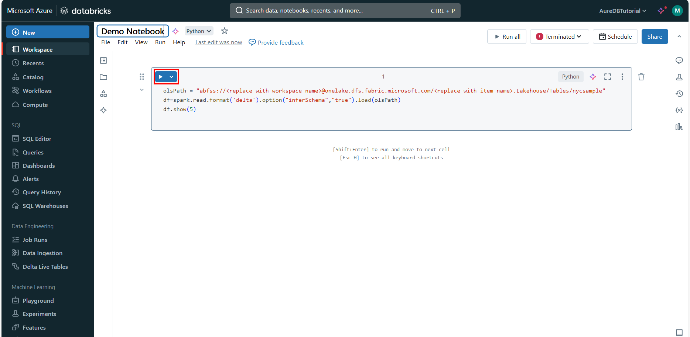

9.  Mettez à jour les données de la table Delta en modifiant une valeur
    de champ.

%sql

update delta.\`abfss://\<replace with workspace
name\>@onelake.dfs.fabric.microsoft.com/\<replace with item
name\>.Lakehouse/Tables/nycsample\` set vendorID = 99999 where vendorID
= 1;

*Remarque : Remplacez le chemin d'accès du fichier en gras par celui que
vous avez copié.*

# Exercice 6 : Nettoyer les ressources

Dans cet exercice, vous allez apprendre à créer une architecture de
médaillon dans un lakehouse Microsoft Fabric.

Si vous avez terminé d'explorer votre lakehouse, vous pouvez supprimer
l'espace de travail que vous avez créé pour cet exercice.

1.  Sélectionnez votre espace de travail, le **Fabric Lakehouse
    Tutorial-29** dans le menu de navigation de gauche. Il ouvre la vue
    des éléments de l'espace de travail.

2.  Sélectionnez l'icône ***...*** sous le nom de l'espace de travail et
    sélectionnez **Workspace settings**.

3.  Faites défiler vers le bas et **Remove this workspace.**

4.  Cliquez sur **Delete** dans l'avertissement qui s'affiche.

5.  Attendez une notification indiquant que l'espace de travail a été
    supprimé avant de passer au labo suivant.

**Résumé** :

Cet atelier guide les participants dans la création d'une architecture
de médaillon dans un lakehouse Microsoft Fabric à l'aide de Notebook.
Les étapes clés comprennent la mise en place d'un espace de travail, la
création d'un lakehouse, le téléchargement des données dans la couche
bronze pour l'ingestion initiale, la transformation en une table Delta
argentée pour un traitement structuré, l'affinement en tables Delta
dorées pour des analyses avancées, l'exploration de modèles sémantiques
et la création de relations entre les données pour une analyse
perspicace.

## 
