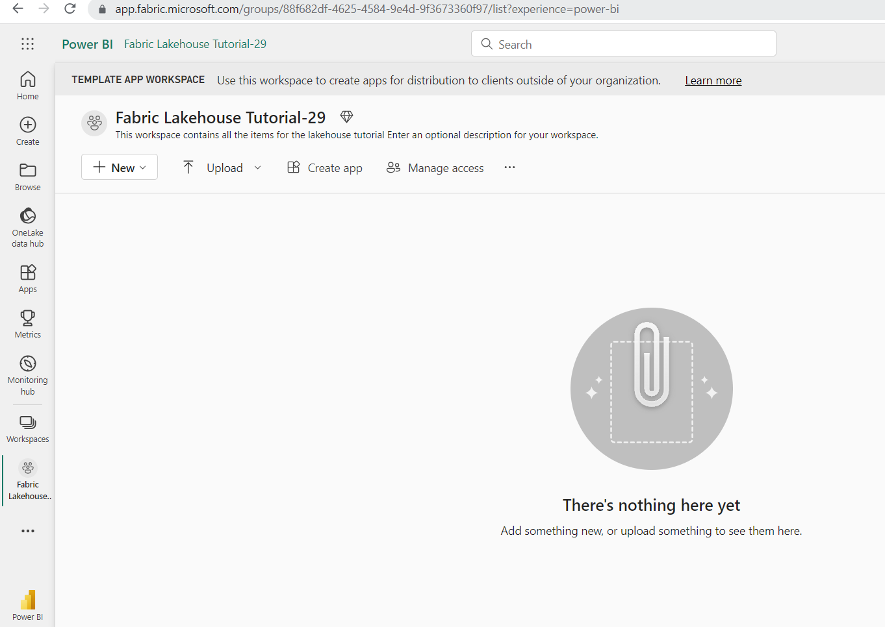
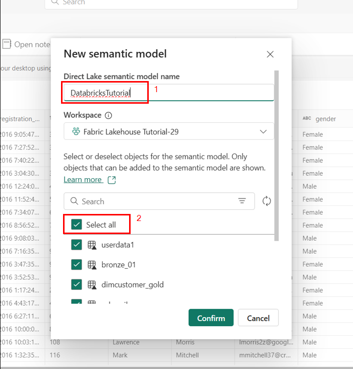

# Caso de uso 04: Análisis moderno a escala en la nube con Azure Databricks y Microsoft Fabric

**Introducción**

En este laboratorio, explorará la integración de Azure Databricks con
Microsoft Fabric para crear y gestionar un lakehouse utilizando la
arquitectura Medallion, crear una tabla Delta con la ayuda de su cuenta
de Azure Data Lake Storage (ADLS) Gen2 utilizando Azure Databricks e
Ingestar datos con Azure Databricks. Esta guía práctica le guiará a
través de los pasos necesarios para crear un lakehouse, cargar datos en
él y explorar las capas de datos estructurados para facilitar el
análisis de datos y la generación de informes eficientes.

La arquitectura Medallion consta de tres capas (o zonas) distintas.

- Bronze: También conocida como zona bruta, esta primera capa almacena
  los datos de origen en su formato original. Los datos en esta capa son
  típicamente append-only e inmutables.

- Silver: También conocida como zona enriquecida, esta capa almacena
  datos procedentes de la capa bronze. Los datos brutos se han limpiado
  y normalizado, y ahora están estructurados en forma de tablas (filas y
  columnas). También podría integrarse con otros datos para proporcionar
  una visión empresarial de todas las entidades de negocio, como el
  cliente, el producto y otros.

- Gold: También conocida como la zona curada, esta capa final almacena
  los datos procedentes de la capa silver. Los datos se refinan para
  satisfacer requisitos empresariales y analíticos específicos
  posteriores. Las tablas suelen ajustarse al diseño de esquema en
  estrella, que apoya el desarrollo de modelos de datos optimizados para
  el rendimiento y la facilidad de uso.

**Objetivos**:

- Comprender los principios de la arquitectura Medallion dentro de
  Microsoft Fabric Lakehouse.

- Implementar un proceso de gestión de datos estructurado utilizando
  capas Medallion (Bronze, Silver, Gold).

- Transformar datos sin procesar en datos validados y enriquecidos para
  análisis e informes avanzados.

- Aprender las mejores prácticas para la seguridad de datos, CI/CD, y la
  consulta eficiente de datos.

- Cargar datos en OneLake con el explorador de archivos de OneLake.

- Utilizar un notebook Fabric para leer datos en OneLake y escribir de
  nuevo como una tabla Delta.

- Analizar y transformar datos con Spark utilizando un Fabric notebook.

- Consultar una copia de los datos en OneLake con SQL.

- Crear una tabla Delta en su cuenta Azure Data Lake Storage (ADLS) Gen2
  utilizando Azure Databricks.

- Crear un shortcut de OneLake a una tabla Delta en ADLS.

- Utilizar Power BI para analizar datos a través del shortcut ADLS.

- Leer y modificar una tabla Delta en OneLake con Azure Databricks.

# Ejercicio 1: Introducir datos de muestra en Lakehouse

En este ejercicio, usted irá a través del proceso de creación de un
lakehouse y la carga de datos en él utilizando Microsoft Fabric.

Tarea:ruta

**Tarea 1: Crear un workspace de Fabric**

En esta tarea, se crea un workspace de Fabric. El workspace contiene
todos los elementos necesarios para este tutorial de lakehouse, que
incluye lakehouse, dataflows, pipelines de Data Factory, los notebooks,
los conjuntos de datos de Power BI y los informes.

1.  Abra su navegador, vaya a la barra de direcciones y escriba o pegue
    la siguiente URL:
    [https://app.fabric.microsoft.com/](https://app.fabric.microsoft.com/,)
    luego presione la tecla **Enter**.

> 

2.  Vuelva a la ventana de **Power** **BI**. En el menú de navegación de
    la izquierda de la página de inicio de Power BI, navegue y haga clic
    en **Workspaces**.

3.  En el panel Workspaces, haga clic en el botón **+** **New
    workspace.**

> 

4.  En el panel **Create** **a workspace** que aparece a la derecha,
    introduzca los siguientes datos y haga clic en el botón **Apply**.

[TABLE]

> 

5.  Espere a que finalice la implementación. Tarda de 2 a 3 minutos en
    completarse.

## **Tarea 2: Crear un lakehouse**

1.  En la página **Power BI Fabric Lakehouse Tutorial-XX**, haga clic en
    el icono de **Power BI **situado en la parte inferior izquierda y
    seleccione **Data Engineering**.

> 

2.  En la página **Synapse** **Data Engineering** **Home**,
    seleccione **Lakehouse** para crear un lakehouse.

3.  En el cuadro de diálogo **New lakehouse**, ingrese **wwilakehouse**
    en el campo **Name**, haga clic en el botón **Create** button y abra
    el nuevo lakehouse.

> **Nota**: Asegúrese de eliminar el espacio antes de **wwilakehouse**.
>
> 
>
> 
>
> 

4.  Verá una notificación que dice **Successfully created SQL
    endpoint**.

> 

# Ejercicio 2: Implementación de la arquitectura Medallion utilizando Azure Databricks 

## **Tarea 1: Configuración de la capa Bronze**

1.  En la página **wwilakehouse**, seleccione el icono More junto a los
    archivos (…), y seleccione **New subfolder**

2.  En la ventana emergente proporcione el nombre de la carpeta
    como **bronze**, y seleccione Create.

3.  Ahora, seleccione el icono More junto a los archivos bronze (...), y
    seleccione **Upload** y luego, **upload files**.

4.  En el panel **upload file**, seleccione el botón de opción **Upload
    file**. Haga clic en el botón **Browse** y vaya **C:\LabFiles**,
    luego seleccione los archivos de datos de ventas requeridos (2019,
    2020, 2021) y haga clic en el botón **Open**.

Y a continuación, seleccione **Upload** para cargar los archivos en la
nueva carpeta ‘bronze’ de su Lakehouse.

> 

5.  Haga clic en carpeta **bronze **para validar que los archivos se han
    cargado correctamente y los archivos están reflejando.

# Ejercicio 3: Transformación de datos con Apache Spark y consulta con SQL en arquitectura Medallion

## **Tarea 1: Transformar datos y cargarlos en la tabla Silver Delta** 

En la página **wwilakehouse**, navegue y haga clic en **Open
notebook** desplegable en la barra de comandos, y luego seleccione **New
notebook**.

1.  Seleccione la primera celda (que actualmente es una celda
    de *código*) y, a continuación, en la barra de herramientas dinámica
    situada en la parte superior derecha, utilice el
    botón **M↓** para **convertir la celda en una celda de marcado**.

2.  Cuando la celda cambia a una celda markdown, el texto que contiene
    se renderiza.

3.  Utilice el botón **🖉** (Editar) para cambiar la celda al modo de
    edición, sustituya todo el texto y, a continuación, modifique el
    markdown como sigue:

CodeCopy

\# Sales order data exploration

Utilice el código de este notebook para explorar los datos de los
pedidos de venta.

4.  Haga clic en cualquier parte del notebook fuera de la celda para
    dejar de editarla y ver el markdown renderizado.

5.  Utilice el icono + Code debajo de la salida de la celda para añadir
    una nueva celda de código al notebook.

6.  Ahora, utilice el notebook para cargar los datos de la capa bronze
    en un DataFrame de Spark.

Seleccione la celda existente en el notebook, que contiene algún código
simple comentado. Resalte y elimine estas dos líneas - no necesitará
este código.

*Nota: Los notebooks le permiten ejecutar código en una variedad de
lenguajes, incluyendo Python, Scala y SQL. En este ejercicio, utilizará
PySpark y SQL. También puede añadir celdas markdown para proporcionar
texto formateado e imágenes para documentar su código.*

Para ello, ingrese el siguiente código en él y haga clic en **Run**.

CodeCopy

from pyspark.sql.types import \*

\# Create the schema for the table

orderSchema = StructType(\[

StructField("SalesOrderNumber", StringType()),

StructField("SalesOrderLineNumber", IntegerType()),

StructField("OrderDate", DateType()),

StructField("CustomerName", StringType()),

StructField("Email", StringType()),

StructField("Item", StringType()),

StructField("Quantity", IntegerType()),

StructField("UnitPrice", FloatType()),

StructField("Tax", FloatType())

\])

\# Import all files from bronze folder of lakehouse

df = spark.read.format("csv").option("header",
"true").schema(orderSchema).load("Files/bronze/\*.csv")

\# Display the first 10 rows of the dataframe to preview your data

display(df.head(10))

***Nota**: Dado que es la primera vez que ejecuta código Spark en este
notebook, debe iniciarse una sesión Spark. Esto significa que la primera
ejecución puede tardar más o menos un minuto en completarse. Las
ejecuciones posteriores serán más rápidas.*

7.  El código que ejecutó cargó los datos de los archivos CSV de la
    carpeta **bronze** en un dataframe de Spark y, a continuación,
    mostró las primeras filas del dataframe.

> **Nota**: Puede borrar, ocultar y redimensionar automáticamente el
> contenido de la salida de celdas seleccionando el menú **...** en la
> parte superior izquierda del panel de salida.

8.  Ahora **añadirá columnas para la validación y limpieza de datos**,
    utilizando un dataframe PySpark para añadir columnas y actualizar
    los valores de algunas de las columnas existentes. Utilice el
    botón + para **añadir un nuevo bloque de código** y añada el
    siguiente código a la celda:

> CodeCopy
>
> from pyspark.sql.functions import when, lit, col, current_timestamp,
> input_file_name
>
> \# Add columns IsFlagged, CreatedTS and ModifiedTS
>
> df = df.withColumn("FileName", input_file_name()) \\
>
> .withColumn("IsFlagged", when(col("OrderDate") \<
> '2019-08-01',True).otherwise(False)) \\
>
> .withColumn("CreatedTS", current_timestamp()).withColumn("ModifiedTS",
> current_timestamp())
>
> \# Update CustomerName to "Unknown" if CustomerName null or empty
>
> df = df.withColumn("CustomerName", when((col("CustomerName").isNull()
> |
> (col("CustomerName")=="")),lit("Unknown")).otherwise(col("CustomerName")))
>
> La primera línea del código importa las funciones necesarias de
> PySpark. A continuación, añade nuevas columnas al dataframe para poder
> rastrear el nombre del archivo de origen, si el pedido se marcó como
> anterior al ejercicio de interés y cuándo se creó y modificó la fila..
>
> Por último, está actualizando la columna CustomerName a “Unknown” si
> es nula o está vacía.
>
> A continuación, ejecute la celda para ejecutar el código utilizando el
> botón **\*\*▷** (*Ejecutar celda*)\*\*.

9.  A continuación, definirá el esquema de la tabla **sales_silver** de
    la base de datos de ventas utilizando el formato Delta Lake. Cree un
    nuevo bloque de código y añada el siguiente código a la celda:

> CodeCopy

from pyspark.sql.types import \*

from delta.tables import \*

\# Define the schema for the sales_silver table

silver_table_schema = StructType(\[

    StructField("SalesOrderNumber", StringType(), True),

    StructField("SalesOrderLineNumber", IntegerType(), True),

    StructField("OrderDate", DateType(), True),

    StructField("CustomerName", StringType(), True),

    StructField("Email", StringType(), True),

    StructField("Item", StringType(), True),

    StructField("Quantity", IntegerType(), True),

    StructField("UnitPrice", FloatType(), True),

    StructField("Tax", FloatType(), True),

    StructField("FileName", StringType(), True),

    StructField("IsFlagged", BooleanType(), True),

    StructField("CreatedTS", TimestampType(), True),

    StructField("ModifiedTS", TimestampType(), True)

\])

\# Create or replace the sales_silver table with the defined schema

DeltaTable.createIfNotExists(spark) \\

    .tableName("wwilakehouse.sales_silver") \\

    .addColumns(silver_table_schema) \\

    .execute()

   

10. Ejecute la *celda* para ejecutar el código utilizando el
    botón **\*\*▷** (*Ejecutar celda*)\*\*.

11. Seleccione **...** en la sección Tables del panel del explorador de
    lakehouse y seleccione **Refresh**. Ahora debería ver la nueva
    tabla **sales_silver** en la lista. El **▲** (icono del triángulo)
    indica que se trata de una tabla Delta.

> **Nota**: Si no ve la nueva tabla, espere unos segundos y
> seleccione **Refresh **de nuevo, o actualice toda la pestaña del
> navegador.
>
> 
>
> 

12. Ahora va a realizar una **operación upsert** en una tabla Delta,
    actualizando los registros existentes basándose en condiciones
    específicas e insertando nuevos registros cuando no se encuentre
    ninguna coincidencia. Añada un nuevo bloque de código y pegue el
    siguiente código:

> CodeCopy
>
> from pyspark.sql.types import \*
>
> from pyspark.sql.functions import when, lit, col, current_timestamp,
> input_file_name
>
> from delta.tables import \*
>
> \# Define the schema for the source data
>
> orderSchema = StructType(\[
>
> StructField("SalesOrderNumber", StringType(), True),
>
> StructField("SalesOrderLineNumber", IntegerType(), True),
>
> StructField("OrderDate", DateType(), True),
>
> StructField("CustomerName", StringType(), True),
>
> StructField("Email", StringType(), True),
>
> StructField("Item", StringType(), True),
>
> StructField("Quantity", IntegerType(), True),
>
> StructField("UnitPrice", FloatType(), True),
>
> StructField("Tax", FloatType(), True)
>
> \])
>
> \# Read data from the bronze folder into a DataFrame
>
> df = spark.read.format("csv").option("header",
> "true").schema(orderSchema).load("Files/bronze/\*.csv")
>
> \# Add additional columns
>
> df = df.withColumn("FileName", input_file_name()) \\
>
> .withColumn("IsFlagged", when(col("OrderDate") \< '2019-08-01',
> True).otherwise(False)) \\
>
> .withColumn("CreatedTS", current_timestamp()) \\
>
> .withColumn("ModifiedTS", current_timestamp()) \\
>
> .withColumn("CustomerName", when((col("CustomerName").isNull()) |
> (col("CustomerName") == ""),
> lit("Unknown")).otherwise(col("CustomerName")))
>
> \# Define the path to the Delta table
>
> deltaTablePath = "Tables/sales_silver"
>
> \# Create a DeltaTable object for the existing Delta table
>
> deltaTable = DeltaTable.forPath(spark, deltaTablePath)
>
> \# Perform the merge (upsert) operation
>
> deltaTable.alias('silver') \\
>
> .merge(
>
> df.alias('updates'),
>
> 'silver.SalesOrderNumber = updates.SalesOrderNumber AND \\
>
> silver.OrderDate = updates.OrderDate AND \\
>
> silver.CustomerName = updates.CustomerName AND \\
>
> silver.Item = updates.Item'
>
> ) \\
>
> .whenMatchedUpdate(set = {
>
> "SalesOrderLineNumber": "updates.SalesOrderLineNumber",
>
> "Email": "updates.Email",
>
> "Quantity": "updates.Quantity",
>
> "UnitPrice": "updates.UnitPrice",
>
> "Tax": "updates.Tax",
>
> "FileName": "updates.FileName",
>
> "IsFlagged": "updates.IsFlagged",
>
> "ModifiedTS": "current_timestamp()"
>
> }) \\
>
> .whenNotMatchedInsert(values = {
>
> "SalesOrderNumber": "updates.SalesOrderNumber",
>
> "SalesOrderLineNumber": "updates.SalesOrderLineNumber",
>
> "OrderDate": "updates.OrderDate",
>
> "CustomerName": "updates.CustomerName",
>
> "Email": "updates.Email",
>
> "Item": "updates.Item",
>
> "Quantity": "updates.Quantity",
>
> "UnitPrice": "updates.UnitPrice",
>
> "Tax": "updates.Tax",
>
> "FileName": "updates.FileName",
>
> "IsFlagged": "updates.IsFlagged",
>
> "CreatedTS": "current_timestamp()",
>
> "ModifiedTS": "current_timestamp()"
>
> }) \\
>
> .execute()

13. Ejecute la *celda* para ejecutar el código utilizando el
    botón **\*\*▷** (*Ejecutar celda*)\*\*.

Esta operación es importante porque le permite actualizar los registros
existentes en la tabla basándose en los valores de columnas específicas,
e insertar nuevos registros cuando no se encuentra ninguna coincidencia.
Se trata de un requisito habitual cuando se cargan datos de un sistema
fuente que puede contener actualizaciones de registros existentes y
nuevos.

Ahora tiene datos en su tabla delta silver que están listos para su
posterior transformación y modelización.

Ha tomado con éxito los datos de su capa bronze, los ha transformado y
los ha cargado en una tabla Delta silver. Ahora utilizará un nuevo
notebook para transformar aún más los datos, modelarlos en un esquema de
estrella y cargarlos en tablas Delta gold.

*Tenga en cuenta que podría haber hecho todo esto en un único notebook,
pero a efectos de este ejercicio va a utilizar notebooks separados para
demostrar el proceso de transformación de datos de bronze a silver y
luego de silver a gold. Esto puede ayudar a depurar, solucionar
problemas y reutilizar*.

## **Tarea 2: Cargar datos en tablas Gold Delta** 

1.  Volver a la página de inicio de Fabric Lakehouse Tutorial-29.

> 

2.  Seleccione **wwilakehouse.**

3.  En el panel del explorador de lakehouse, debería ver la
    tabla **sales_silver** en la sección **Tables** del panel del
    explorador.

4.  Ahora, cree un nuevo notebook llamado **Transform data for Gold**.
    Para ello, navegue y haga clic en **Open notebook** en la barra de
    comandos, luego seleccione **New notebook**.

5.  En el bloque de código existente, elimine el texto repetitivo
    y **añada el siguiente código** para cargar los datos en su
    dataframe y empezar a construir su esquema estrella, luego
    ejecútelo:

> CodeCopy

\# Load data to the dataframe as a starting point to create the gold
layer

df = spark.read.table("wwilakehouse.sales_silver")

\# Display the first few rows of the dataframe to verify the data

df.show()

6.  **A continuación, añada un nuevo bloque de código** y pegue el
    siguiente código para crear su tabla de dimensiones de fecha y
    ejecútela:

 from pyspark.sql.types import \*

 from delta.tables import\*

   

 # Define the schema for the dimdate_gold table

 DeltaTable.createIfNotExists(spark) \\

     .tableName("wwilakehouse.dimdate_gold") \\

     .addColumn("OrderDate", DateType()) \\

     .addColumn("Day", IntegerType()) \\

     .addColumn("Month", IntegerType()) \\

     .addColumn("Year", IntegerType()) \\

     .addColumn("mmmyyyy", StringType()) \\

     .addColumn("yyyymm", StringType()) \\

     .execute()

**Nota**: Puede ejecutar el comando display(df)  en cualquier momento
para comprobar el progreso de su trabajo. En este caso, ejecutaría
'display(dfdimDate_gold)' para ver el contenido del dataframe
dimDate_gold.

7.  En un nuevo bloque de código, **añada y ejecute el siguiente
    código** para crear un dataframe para su dimensión de
    fecha, **dimdate_gold**:

> CodeCopy

from pyspark.sql.functions import col, dayofmonth, month, year,
date_format

   

 # Create dataframe for dimDate_gold

   

dfdimDate_gold
=df.dropDuplicates(\["OrderDate"\]).select(col("OrderDate"), \\

         dayofmonth("OrderDate").alias("Day"), \\

         month("OrderDate").alias("Month"), \\

         year("OrderDate").alias("Year"), \\

         date_format(col("OrderDate"), "MMM-yyyy").alias("mmmyyyy"), \\

         date_format(col("OrderDate"), "yyyyMM").alias("yyyymm"), \\

     ).orderBy("OrderDate")

 # Display the first 10 rows of the dataframe to preview your data

display(dfdimDate_gold.head(10))

8.  Está separando el código en nuevos bloques de código para que pueda
    entender y observar lo que ocurre en el notebook a medida que
    transforma los datos. En otro nuevo bloque de código, **añada y
    ejecute el siguiente código** para actualizar la dimensión fecha a
    medida que entren nuevos datos:

> CodeCopy
>
> from delta.tables import \*
>
> deltaTable = DeltaTable.forPath(spark, 'Tables/dimdate_gold')
>
> dfUpdates = dfdimDate_gold
>
> deltaTable.alias('silver') \\
>
> .merge(
>
> dfUpdates.alias('updates'),
>
> 'silver.OrderDate = updates.OrderDate'
>
> ) \\
>
> .whenMatchedUpdate(set =
>
> {
>
> }
>
> ) \\
>
> .whenNotMatchedInsert(values =
>
> {
>
> "OrderDate": "updates.OrderDate",
>
> "Day": "updates.Day",
>
> "Month": "updates.Month",
>
> "Year": "updates.Year",
>
> "mmmyyyy": "updates.mmmyyyy",
>
> "yyyymm": "yyyymm"
>
> }
>
> ) \\
>
> .execute()

> Su dimensión de fecha está completamente configurada.

## **Tarea 3: Creación de la dimensión de cliente**

1.  Para construir la tabla de dimensiones de clientes, **añada un nuevo
    bloque de** código , pegue y ejecute el siguiente código:

> CodeCopy

 from pyspark.sql.types import \*

 from delta.tables import \*

   

 # Create customer_gold dimension delta table

 DeltaTable.createIfNotExists(spark) \\

     .tableName("wwilakehouse.dimcustomer_gold") \\

     .addColumn("CustomerName", StringType()) \\

     .addColumn("Email",  StringType()) \\

     .addColumn("First", StringType()) \\

     .addColumn("Last", StringType()) \\

     .addColumn("CustomerID", LongType()) \\

     .execute()

2.  En un nuevo bloque de código, **añada y ejecute el siguiente
    código** para eliminar los clientes duplicados, seleccionar columnas
    específicas y dividir la columna “CustomerName” para crear las
    columnas “First” y “Last” name:

> CodeCopy
>
> from pyspark.sql.functions import col, split
>
> \# Create customer_silver dataframe
>
> dfdimCustomer_silver =
> df.dropDuplicates(\["CustomerName","Email"\]).select(col("CustomerName"),col("Email"))
> \\
>
> .withColumn("First",split(col("CustomerName"), " ").getItem(0)) \\
>
> .withColumn("Last",split(col("CustomerName"), " ").getItem(1))
>
> \# Display the first 10 rows of the dataframe to preview your data
>
> display(dfdimCustomer_silver.head(10))

Aquí ha creado un nuevo dataFrame dfdimCustomer_silver realizando varias
transformaciones como eliminar duplicados, seleccionar columnas
específicas y dividir la columna “CustomerName” para crear columnas de
nombre “First” y “Last”. El resultado es un dataFrame con los datos de
los clientes limpios y estructurados, incluidas las columnas separadas
“First“ y ”Last “ extraídas de la columna ”CustomerName”.

3.  A continuación, **crearemos la columna ID para nuestros clientes**.
    En un nuevo bloque de código, pegue y ejecute lo siguiente:

CodeCopy

from pyspark.sql.functions import monotonically_increasing_id, col,
when, coalesce, max, lit

\# Read the existing data from the Delta table

dfdimCustomer_temp = spark.read.table("wwilakehouse.dimCustomer_gold")

\# Find the maximum CustomerID or use 0 if the table is empty

MAXCustomerID =
dfdimCustomer_temp.select(coalesce(max(col("CustomerID")),
lit(0)).alias("MAXCustomerID")).first()\[0\]

\# Assume dfdimCustomer_silver is your source DataFrame with new data

\# Here, we select only the new customers by doing a left anti join

dfdimCustomer_gold = dfdimCustomer_silver.join(

    dfdimCustomer_temp,

    (dfdimCustomer_silver.CustomerName ==
dfdimCustomer_temp.CustomerName) &

    (dfdimCustomer_silver.Email == dfdimCustomer_temp.Email),

    "left_anti"

)

\# Add the CustomerID column with unique values starting from
MAXCustomerID + 1

dfdimCustomer_gold = dfdimCustomer_gold.withColumn(

    "CustomerID",

    monotonically_increasing_id() + MAXCustomerID + 1

)

\# Display the first 10 rows of the dataframe to preview your data

dfdimCustomer_gold.show(10)

4.  Ahora se asegurará de que su tabla de clientes se mantiene
    actualizada a medida que llegan nuevos datos. **En un nuevo bloque
    de código**, pegue y ejecute lo siguiente:

> CodeCopy

from delta.tables import DeltaTable

\# Define the Delta table path

deltaTable = DeltaTable.forPath(spark, 'Tables/dimcustomer_gold')

\# Use dfUpdates to refer to the DataFrame with new or updated records

dfUpdates = dfdimCustomer_gold

\# Perform the merge operation to update or insert new records

deltaTable.alias('silver') \\

  .merge(

    dfUpdates.alias('updates'),

    'silver.CustomerName = updates.CustomerName AND silver.Email =
updates.Email'

  ) \\

  .whenMatchedUpdate(set =

    {

      "CustomerName": "updates.CustomerName",

      "Email": "updates.Email",

      "First": "updates.First",

      "Last": "updates.Last",

      "CustomerID": "updates.CustomerID"

    }

  ) \\

  .whenNotMatchedInsert(values =

    {

      "CustomerName": "updates.CustomerName",

      "Email": "updates.Email",

      "First": "updates.First",

      "Last": "updates.Last",

      "CustomerID": "updates.CustomerID"

    }

  ) \\

  .execute()

5.  Ahora **repetirá esos pasos para crear la dimensión de su
    producto**. En un nuevo bloque de código, pegue y ejecute lo
    siguiente:

> CodeCopy
>
> from pyspark.sql.types import \*
>
> from delta.tables import \*
>
> DeltaTable.createIfNotExists(spark) \\
>
> .tableName("wwilakehouse.dimproduct_gold") \\
>
> .addColumn("ItemName", StringType()) \\
>
> .addColumn("ItemID", LongType()) \\
>
> .addColumn("ItemInfo", StringType()) \\
>
> .execute()

6.  **Añada otro bloque de código** para crear el dataframe
    **product_silver**.

> CodeCopy
>
> from pyspark.sql.functions import col, split, lit
>
> \# Create product_silver dataframe
>
> dfdimProduct_silver =
> df.dropDuplicates(\["Item"\]).select(col("Item")) \\
>
> .withColumn("ItemName",split(col("Item"), ", ").getItem(0)) \\
>
> .withColumn("ItemInfo",when((split(col("Item"), ",
> ").getItem(1).isNull() | (split(col("Item"), ",
> ").getItem(1)=="")),lit("")).otherwise(split(col("Item"), ",
> ").getItem(1)))
>
> \# Display the first 10 rows of the dataframe to preview your data
>
> display(dfdimProduct_silver.head(10))

7.  Ahora creará IDs para su **tabla dimProduct_gold**. Añada la
    siguiente sintaxis a un nuevo bloque de código y ejecútelo:

CodeCopy

from pyspark.sql.functions import monotonically_increasing_id, col, lit,
max, coalesce

\#dfdimProduct_temp = dfdimProduct_silver

dfdimProduct_temp = spark.read.table("wwilakehouse.dimProduct_gold")

MAXProductID =
dfdimProduct_temp.select(coalesce(max(col("ItemID")),lit(0)).alias("MAXItemID")).first()\[0\]

dfdimProduct_gold =
dfdimProduct_silver.join(dfdimProduct_temp,(dfdimProduct_silver.ItemName
== dfdimProduct_temp.ItemName) & (dfdimProduct_silver.ItemInfo ==
dfdimProduct_temp.ItemInfo), "left_anti")

dfdimProduct_gold =
dfdimProduct_gold.withColumn("ItemID",monotonically_increasing_id() +
MAXProductID + 1)

\# Display the first 10 rows of the dataframe to preview your data

display(dfdimProduct_gold.head(10))

Esto calcula el siguiente ID de producto disponible basándose en los
datos actuales de la tabla, asigna estos nuevos ID a los productos y, a
continuación, muestra la información actualizada del producto.

8.  De forma similar a lo que ha hecho con sus otras dimensiones, debe
    asegurarse de que su tabla de productos se mantiene actualizada a
    medida que llegan nuevos datos. **En un nuevo bloque de código**,
    pegue y ejecute lo siguiente:

CodeCopy

from delta.tables import \*

deltaTable = DeltaTable.forPath(spark, 'Tables/dimproduct_gold')

dfUpdates = dfdimProduct_gold

deltaTable.alias('silver') \\

.merge(

dfUpdates.alias('updates'),

'silver.ItemName = updates.ItemName AND silver.ItemInfo =
updates.ItemInfo'

) \\

.whenMatchedUpdate(set =

{

}

) \\

.whenNotMatchedInsert(values =

{

"ItemName": "updates.ItemName",

"ItemInfo": "updates.ItemInfo",

"ItemID": "updates.ItemID"

}

) \\

.execute()

**Ahora que tiene sus dimensiones construidas, el paso final es crear la
tabla de hechos.**

9.  **En un nuevo bloque de código,** pegue y ejecute el siguiente
    código para crear la** tabla de hechos.**

> CodeCopy
>
> from pyspark.sql.types import \*
>
> from delta.tables import \*
>
> DeltaTable.createIfNotExists(spark) \\
>
> .tableName("wwilakehouse.factsales_gold") \\
>
> .addColumn("CustomerID", LongType()) \\
>
> .addColumn("ItemID", LongType()) \\
>
> .addColumn("OrderDate", DateType()) \\
>
> .addColumn("Quantity", IntegerType()) \\
>
> .addColumn("UnitPrice", FloatType()) \\
>
> .addColumn("Tax", FloatType()) \\
>
> .execute()

10. **En un nuevo bloque de código,** pegue y ejecute el siguiente
    código para crear un **nuevo dataframe** que combine los datos de
    ventas con la información del cliente y del producto, incluyendo el
    ID del cliente, el ID del elemento, la fecha del pedido, la
    cantidad, el precio unitario y los impuestos:

CodeCopy

from pyspark.sql import SparkSession

from pyspark.sql.functions import split, col, when, lit

from pyspark.sql.types import StructType, StructField, StringType,
IntegerType, DateType, FloatType, BooleanType, TimestampType

\# Initialize Spark session

spark = SparkSession.builder \\

    .appName("DeltaTableUpsert") \\

    .config("spark.sql.extensions",
"io.delta.sql.DeltaSparkSessionExtension") \\

    .config("spark.sql.catalog.spark_catalog",
"org.apache.spark.sql.delta.catalog.DeltaCatalog") \\

    .getOrCreate()

\# Define the schema for the sales_silver table

silver_table_schema = StructType(\[

    StructField("SalesOrderNumber", StringType(), True),

    StructField("SalesOrderLineNumber", IntegerType(), True),

    StructField("OrderDate", DateType(), True),

    StructField("CustomerName", StringType(), True),

    StructField("Email", StringType(), True),

    StructField("Item", StringType(), True),

    StructField("Quantity", IntegerType(), True),

    StructField("UnitPrice", FloatType(), True),

    StructField("Tax", FloatType(), True),

    StructField("FileName", StringType(), True),

    StructField("IsFlagged", BooleanType(), True),

    StructField("CreatedTS", TimestampType(), True),

    StructField("ModifiedTS", TimestampType(), True)

\])

\# Define the path to the Delta table (ensure this path is correct)

delta_table_path =
"abfss://\<container\>@\<storage-account\>.dfs.core.windows.net/path/to/wwilakehouse/sales_silver"

\# Create a DataFrame with the defined schema

empty_df = spark.createDataFrame(\[\], silver_table_schema)

\# Register the Delta table in the Metastore

spark.sql(f"""

    CREATE TABLE IF NOT EXISTS wwilakehouse.sales_silver

    USING DELTA

    LOCATION '{delta_table_path}'

""")

\# Load data into DataFrame

df = spark.read.table("wwilakehouse.sales_silver")

\# Perform transformations on df

df = df.withColumn("ItemName", split(col("Item"), ", ").getItem(0)) \\

    .withColumn("ItemInfo", when(

        (split(col("Item"), ", ").getItem(1).isNull()) |
(split(col("Item"), ", ").getItem(1) == ""),

        lit("")

    ).otherwise(split(col("Item"), ", ").getItem(1)))

\# Load additional DataFrames for joins

dfdimCustomer_temp = spark.read.table("wwilakehouse.dimCustomer_gold")

dfdimProduct_temp = spark.read.table("wwilakehouse.dimProduct_gold")

\# Create Sales_gold dataframe

dffactSales_gold = df.alias("df1").join(dfdimCustomer_temp.alias("df2"),
(df.CustomerName == dfdimCustomer_temp.CustomerName) & (df.Email ==
dfdimCustomer_temp.Email), "left") \\

    .join(dfdimProduct_temp.alias("df3"), (df.ItemName ==
dfdimProduct_temp.ItemName) & (df.ItemInfo ==
dfdimProduct_temp.ItemInfo), "left") \\

    .select(

        col("df2.CustomerID"),

        col("df3.ItemID"),

        col("df1.OrderDate"),

        col("df1.Quantity"),

        col("df1.UnitPrice"),

        col("df1.Tax")

    ).orderBy(col("df1.OrderDate"), col("df2.CustomerID"),
col("df3.ItemID"))

\# Show the result

dffactSales_gold.show()

1.  Ahora se asegurará de que los datos de ventas permanezcan
    actualizados ejecutando el siguiente código en un **nuevo bloque de
    código**:

> CodeCopy
>
> from delta.tables import \*
>
> deltaTable = DeltaTable.forPath(spark, 'Tables/factsales_gold')
>
> dfUpdates = dffactSales_gold
>
> deltaTable.alias('silver') \\
>
> .merge(
>
> dfUpdates.alias('updates'),
>
> 'silver.OrderDate = updates.OrderDate AND silver.CustomerID =
> updates.CustomerID AND silver.ItemID = updates.ItemID'
>
> ) \\
>
> .whenMatchedUpdate(set =
>
> {
>
> }
>
> ) \\
>
> .whenNotMatchedInsert(values =
>
> {
>
> "CustomerID": "updates.CustomerID",
>
> "ItemID": "updates.ItemID",
>
> "OrderDate": "updates.OrderDate",
>
> "Quantity": "updates.Quantity",
>
> "UnitPrice": "updates.UnitPrice",
>
> "Tax": "updates.Tax"
>
> }
>
> ) \\
>
> .execute()

Aquí está utilizando la operación de fusión de Delta Lake para
sincronizar y actualizar la tabla factsales_gold con los nuevos datos de
ventas (dffactSales_gold). La operación compara la fecha del pedido, el
ID del cliente y el ID del elemento entre los datos existentes (tabla
silver) y los nuevos datos (actualiza dataframe), actualizando los
registros coincidentes e insertando nuevos registros según sea
necesario.

Ahora dispone de una capa **gold** curada y modelada que puede
utilizarse para informes y análisis.

# Ejercicio 4: Establecimiento de la conectividad entre Azure Databricks y Azure Data Lake Storage (ADLS) Gen 2

Ahora vamos a crear una tabla Delta con la ayuda de su cuenta Azure Data
Lake Storage (ADLS) Gen2 utilizando Azure Databricks. A continuación,
creará un shortcut de OneLake a una tabla Delta en ADLS y utilizará
Power BI para analizar los datos a través del shortcut ADLS.

## **Tarea 0: Canjear un pase Azure y activar la suscripción Azure**

1.  Navegue en el siguiente enlace
    !!https://www.microsoftazurepass.com/!! y haga clic en el
    botón **Start**.

2.  En la página de inicio de sesión de Microsoft introduzca el **ID de
    tenant, **haga clic en **Next.**

3.  En la página siguiente ingrese su contraseña y haga clic en **Sign
    In**.

4.  Una vez iniciada la sesión, en la página de Microsoft Azure, haga
    clic en la pestaña **Confirm Microsoft Account**.

5.  En la página siguiente, ingrese el código de promoción, los
    caracteres Captcha y haga clic en **Submit.**

6.  En la página Your profile ingrese los datos de su perfil y haga clic
    en **Sign up.**

7.  Si se le solicita, regístrese para la autenticación multifactor y, a
    continuación, inicie sesión en el portal Azure navegando hasta el
    siguiente enlace!! <https://portal.azure.com/#home>!!

8.  En la barra de búsqueda escriba Subscriptions y haga clic en el
    icono Subscriptions bajo **Services.**

9.  Después de canjear con éxito el pase Azure se generará un ID de
    suscripción.

## **Tarea 1: Crear una cuenta Azure Data Storage**

1.  Inicie sesión en su portal Azure, utilizando sus credenciales azure.

2.  En la página de inicio, en el menú izquierdo del portal,
    seleccione **Storage accounts** para ver una lista de sus cuentas de
    almacenamiento. Si el menú del portal no está visible, seleccione el
    botón del menú para activarlo.

3.  En la página **Storage accounts**, seleccione **Create**.

4.  En la pestaña Basics, al seleccionar un grupo de recursos,
    proporcione la información esencial para su cuenta de
    almacenamiento:

[TABLE]

Deje los demás ajustes como están y seleccione **Review + create **para
aceptar las opciones por defecto y proceder a validar y crear la cuenta.

Nota: Si aún no tiene un grupo de recursos creado, puede hacer clic en
**“Create new”** y crear un nuevo recurso para su cuenta de
almacenamiento.

.

5.  Cuando navega a la pestaña **Review + create**, Azure ejecuta la
    validación de la configuración de la cuenta de almacenamiento que ha
    elegido. Si la validación pasa, puede proceder a crear la cuenta de
    almacenamiento.

Si la validación falla, el portal indica qué ajustes deben modificarse.

Ahora ha creado correctamente su cuenta de almacenamiento de datos
Azure.

6.  Navegue a la página de cuentas de almacenamiento buscando en la
    barra de búsqueda de la parte superior de la página, seleccione la
    cuenta de almacenamiento recién creada.

7.  En la página de la cuenta de almacenamiento, vaya
    a **Containers** en **Data storage** en el panel de navegación de la
    izquierda, cree un nuevo contenedor con el nombre !!medalion1!! y
    haga clic en el botón **Create**. 

 

8.  Ahora vuelva a la página **storage account** y
    seleccione **Endpoints **en el menú de navegación de la izquierda.
    Desplácese hacia abajo y copie la **URL del endpoint principal** y
    péguela en un bloc de notas. Esto le será útil mientras crea el
    shortcut.

9.  Del mismo modo, navegue hasta **Access keys** en el mismo panel de
    navegación.

## **Tarea 2: Cree una tabla Delta, cree un shortcut y analice los datos en su Lakehouse**

1.  En su lakehouse, seleccione las elipses **(...)** junto a los
    archivos y, a continuación, seleccione **New shortcut**.

2.  En la pantalla **New shortcut**, seleccione el mosaico **Azure Data
    Lake Storage Gen2**.

3.  Especifique los detalles de conexión para el shortcut:

[TABLE]

4.  Y haga clic en **Next**.

5.  Esto establecerá un enlace con su contenedor de almacenamiento
    Azure. Seleccione el almacenamiento y haga clic en el
    botón **Next**.

6.  Una vez iniciado el Wizard, seleccione **Files **y seleccione
    el **“...” **en el archivo** bronze**.

7.  Seleccione **load to tables** y **new table**.

8.  En la ventana emergente indique el nombre de su tabla
    como **bronze_01** y seleccione el tipo de archivo como **parquet**.

9.  El archivo **bronze_01** es ahora visible en los archivos.

10. A continuación, seleccione **"..." **en el archivo** bronze**.
    Seleccione **load to tables** y **existing table.**

11. Proporcione el nombre de la tabla existente
    como **dimcustomer_gold.** Seleccione el tipo de archivo
    como** parquet **y seleccione** load.**

## **Tarea 3: Crear un modelo semántico utilizando la capa gold para crear un informe**

En su workspace, ahora puede utilizar la capa gold para crear un informe
y analizar los datos. Puede acceder al modelo semántico directamente en
su workspace para crear relaciones y medidas para los informes.

*Tenga en cuenta que no puede utilizar el **modelo semántico por
defecto** que se crea automáticamente al crear un lakehouse. Debe crear
un nuevo modelo semántico que incluya las tablas gold que ha creado en
este laboratorio, desde el explorador de lakehouse.*

1.  En su workspace, navegue hasta su **wwilakehouse **lakehouse. A
    continuación, seleccione **New semantic model** en la cinta de la
    vista del explorador de lakehouse.

2.  En la ventana emergente, asigne el nombre **DatabricksTutorial** a
    su nuevo modelo semántico y seleccione el workspace como **Fabric
    Lakehouse Tutorial-29**.

3.  A continuación, desplácese hacia abajo y seleccione todo lo que
    desee incluir en su modelo semántico y seleccione **Confirm**.

Esto abrirá el modelo semántico en Fabric donde podrá crear relaciones y
medidas, como se muestra aquí:

Desde aquí, usted u otros miembros de su equipo de datos pueden crear
informes y cuadros de mando basados en los datos de su lakehouse. Estos
informes estarán conectados directamente a la capa gold de su lakehouse,
por lo que siempre reflejarán los datos más recientes.

# Ejercicio 5: Ingesta de datos y análisis con Azure Databricks

1.  Navegue hasta su lakehouse en el servicio Power BI y
    seleccione **Get data** y luego seleccione **New data pipeline**.

1.  En el prompt **New** **Pipeline**, ingrese un nombre para el nuevo
    pipeline y luego seleccione **Create**.

**IngestDatapipeline01**

2.  Para este ejercicio, seleccione los datos de la muestra **NYC Taxi -
    Green** como fuente de datos.

3.  En la pantalla de vista previa, seleccione **Next**.

4.  Para el destino de los datos, seleccione el nombre de la tabla que
    desea utilizar para almacenar los datos de la tabla OneLake Delta.
    Puede elegir una tabla existente o crear una nueva. Para el
    propósito de este laboratorio, seleccione **load into new table **y
    seleccione **Next**.

5.  En la pantalla **Review + Save**, seleccione **Start data transfer
    immediately** y después **Save + Run**.

6.  Una vez finalizado el trabajo, navegue hasta su lakehouse y
    visualice la tabla delta que aparece en /Tables.

7.  Copie la ruta del Azure Blob Filesystem (ABFS) de su tabla delta a
    haciendo clic con el botón derecho del mouse en el nombre de la
    tabla en la vista del explorador y seleccionando **Properties.**

8.  Abra su notebook Azure Databricks y ejecute el código.

olsPath = "**abfss://\<replace with workspace
name\>@onelake.dfs.fabric.microsoft.com/\<replace with item
name\>.Lakehouse/Tables/nycsample**"

df=spark.read.format('delta').option("inferSchema","true").load(olsPath)

df.show(5)

*Nota: Sustituya la ruta del archivo en negrita por la que ha copiado.*

9.  Actualizar los datos de la tabla Delta cambiando el valor de un
    campo.

%sql

update delta.\`abfss://\<replace with workspace
name\>@onelake.dfs.fabric.microsoft.com/\<replace with item
name\>.Lakehouse/Tables/nycsample\` set vendorID = 99999 where vendorID
= 1;

*Nota: Sustituya la ruta del archivo en negrita por la que ha copiado.*

# Ejercicio 6: Liberación de recursos 

En este ejercicio, ha aprendido a crear una arquitectura Medallion en un
lakehouse de Microsoft Fabric.

Si ha terminado de explorar su lakehouse, puede eliminar el workspace
que creó para este ejercicio.

1.  Seleccione su workspace, el **Tutorial-29 de Fabric Lakehouse **en
    el menú de navegación de la izquierda. Se abrirá la vista de
    elementos del workspace.

2.  Seleccione la opción ***...*** bajo el nombre del workspace y
    seleccione **Workspace settings**.

3.  Desplácese hasta la parte inferior y **Remove this workspace.**

4.  Haga clic en **Delete **en la advertencia que aparece.

5.  Espere a recibir una notificación de que el workspace ha sido
    eliminado, antes de pasar al siguiente laboratorio.

**Resumen**:

Este laboratorio guía a los participantes a través de la construcción de
una arquitectura Medallion en un lakehouse Microsoft Fabric utilizando
notebooks. Los pasos clave incluyen la configuración de un workspace, el
establecimiento de un lakehouse, la carga de datos en la capa bronze
para la ingestión inicial, su transformación en una tabla Delta silver
para el procesamiento estructurado, el refinamiento posterior en tablas
Delta gold para el análisis avanzado, la exploración de modelos
semánticos y la creación de relaciones de datos para un análisis
profundo.

## 
