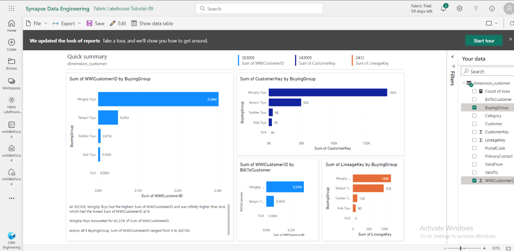
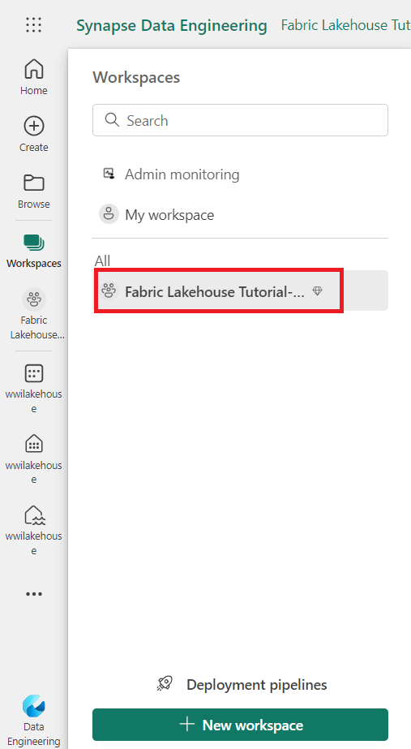
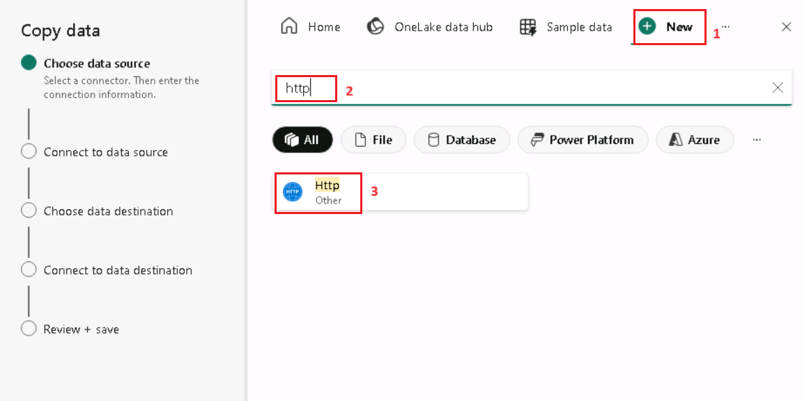
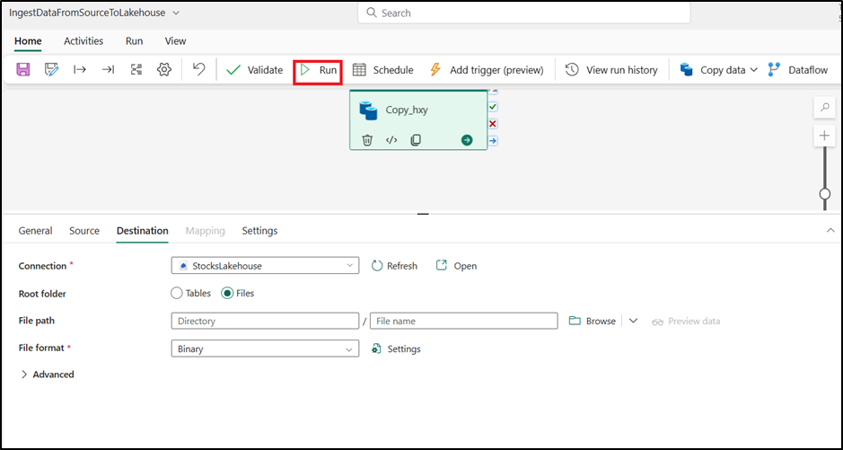
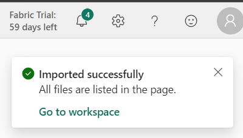
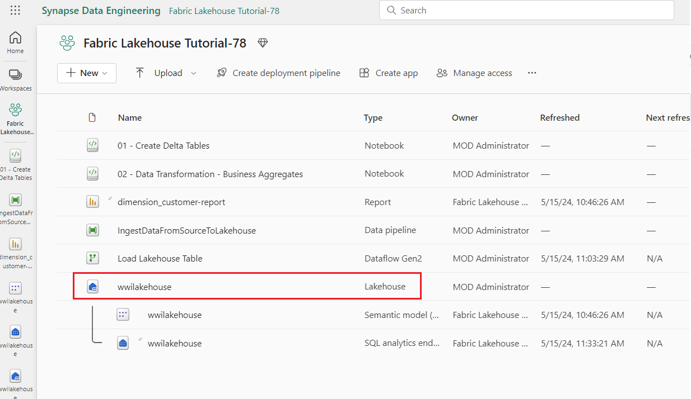
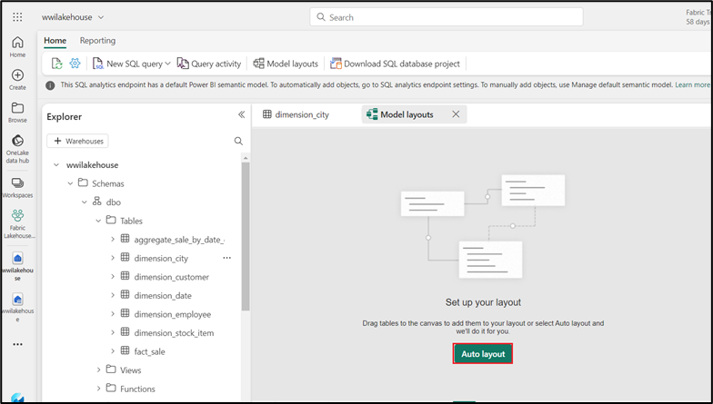
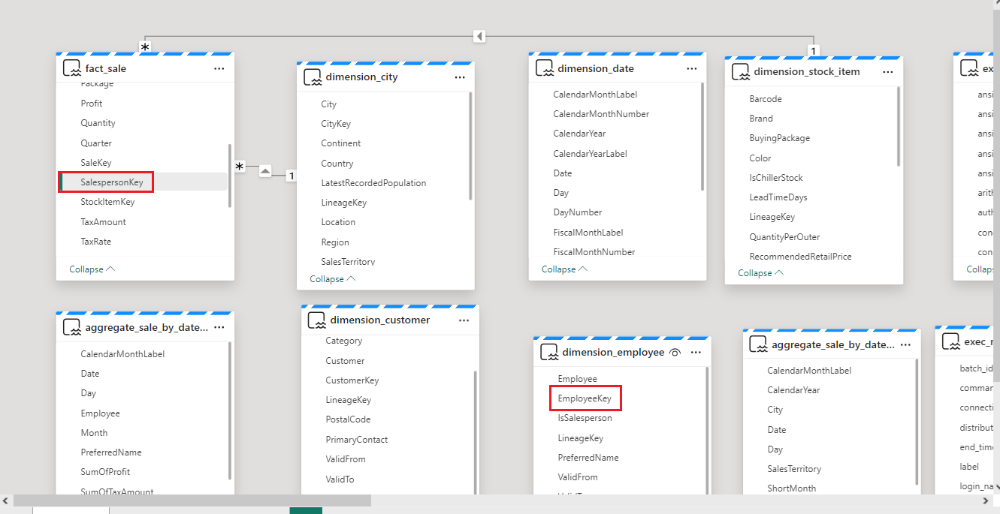

# 使用案例 1：創建 Lakehouse、提取示例數據並構建報告

**介紹**

此實驗室將引導您完成從數據採集到數據使用的端到端方案。它可以幫助您對
Fabric
有基本的瞭解，包括不同的體驗和它們的集成方式，以及在此平臺上工作時獲得的專業和平民開發人員體驗。本實驗不是參考體系結構、特性和功能的詳盡列表，也不是特定最佳實踐的建議。

傳統上，組織一直在構建現代數據倉庫來滿足其事務性和結構化數據分析需求。以及滿足大數據（半/非結構化）數據分析需求的數據湖倉一體。這兩個系統並行運行，造成孤島、數據重複性並增加總擁有成本。

Fabric 將數據存儲統一並標準化為 Delta Lake
格式，使您能夠消除孤島、消除數據重複性並大幅降低總擁有成本。

借助 Fabric
提供的靈活性，您可以實施湖倉一體或數據倉庫架構，也可以將它們組合在一起，通過簡單的實施實現兩者的最佳效果。在本教程中，您將以一個零售組織為例，從頭到尾構建其湖倉一體。它使用
[medallion
architecture](https://learn.microsoft.com/en-us/azure/databricks/lakehouse/medallion) ，其中青銅層具有原始數據，銀色層具有經過驗證和重複數據刪除的數據，而黃金層具有高度精細的數據。您可以採用相同的方法為任何行業的任何組織實施湖倉一體。

本實驗介紹了來自零售域的虛構 Wide World Importers
公司的開發人員如何完成以下步驟。

**目標**:

1\. 登錄到 Power BI 帳戶並啟動免費的 Microsoft Fabric 試用。

2\. 在 Power BI 中開始 Microsoft Fabric （預覽版） 試用版。

3\. 為 Microsoft 365 管理中心配置 OneDrive 註冊。

4\. 為組織構建和實施端到端的湖倉一體，包括創建 Fabric 工作區和湖倉一體。

5\. 將示例數據攝取到 Lakehouse 中，並準備進一步處理。

6\. 使用 Python/PySpark 和 SQL 筆記本轉換和準備數據。

7\. 使用不同的方法創建業務聚合表。

8\. 在表之間建立關係以實現無縫報告。

9\. 根據準備好的數據構建具有可視化效果的 Power BI 報表。

10\. 保存並存儲創建的報表以供將來參考和分析。

# 練習 1：設置 Lakehouse 端到端場景 

## 任務 1：登錄到 Power BI 帳戶並註冊免費的 [**Microsoft Fabric trial**](https://learn.microsoft.com/en-us/fabric/get-started/fabric-trial)

## 

1.  打開瀏覽器，導航到地址欄，然後鍵入或粘貼以下
    URL：:+++<https://app.fabric.microsoft.com/+++> 然後按 **Enter**
    按鈕。

> 

2.  在 **Microsoft Fabric** 窗口中，輸入您的 **Microsoft 365**
    憑據，然後單擊 **Submit** 按鈕。

> 

3.  然後，在 **Microsoft** 窗口中輸入密碼並單擊 **Sign in** 按鈕**。**

> 

4.  在 **Stay signed in?** 窗口中，單擊 **Yes** 按鈕。

> 

5.  您將被定向到 Power BI 主頁。

## 任務 2：開始 Microsoft Fabric trial

請按照以下步驟開始您的 Fabric trial 。

1.  在 **Fabric** 主頁上，單擊右側的 **Account manager** 。在 Account
    manager 邊欄選項卡中，導航並選擇 **Start trial**，如下圖所示**。**

2.  如果出現提示，請同意條款，然後選擇 **Activate**。

> 

3.  試用容量準備就緒後，您會收到一條確認消息。選擇 **Got it** 以開始使用
    Fabric 。

4.  再次打開您的客戶經理。請注意，您現在有一個 **Trial status**
    的標題。您的客戶經理會跟蹤您的試用期剩餘天數。當您在產品體驗中工作時，您還將在
    Fabric 菜單欄中看到倒計時。

> 

# 練習 2： 為您的組織構建和實施端到端 lakehouse

## **任務 1：創建 Fabric workspace**

在此任務中，您將創建一個 Fabric 工作區。工作區包含此 Lakehouse
教程所需的所有項，其中包括
Lakehouse、數據流、數據工廠管道、筆記本、Power BI 數據集和報表。

1.  Fabric 主頁，選擇 **+New workspace** tile。

2.  在右側顯示的 **Create a workspace**
    窗格中，輸入以下詳細信息，然後單擊 **Apply** 按鈕。

[TABLE]

3.  注意：要查找您的實驗室即時 ID，請選擇 'Help' 並複製即時 ID。

> 
>
> 
>
> 
>
> 

4.  等待部署完成。完成需要 2-3 分鐘。

## **任務 2：創建 Lakehouse**

1.  通過單擊導航欄中的 **+New item** 按鈕創建新的湖倉一體 。

2\. 點擊“**Lakehouse**” tile。

3.  在 **New lakehouse**  對話框中，**Name** 字段中輸入
    **wwilakehouse**，單擊 **Create** 按鈕並打開新的 lakehouse。

**注意**：確保在 **wwilakehouse** 之前刪除空格。

4.  您將看到一條通知，指出 **Successfully created SQL endpoint** 。

## **任務 3：引入示例數據**

1.  在 **wwilakehouse** 頁面中，導航到 **Get data in your lakehouse**
    部分，然後單擊 **Upload files as shown in the below
    image**，如下圖所示。

> 

2.  在 Upload files 選項卡上，單擊 Files下的 folder

> 

3.  瀏覽到 VM 上的
    **C：\LabFiles**，然後選擇***dimension_customer.csv***文件並單擊
    **Open** 按鈕 。

> 

4.  然後，單擊 **Upload** 按鈕並關閉。

> 

5.  單擊並選擇 **Files** 上的 refresh 。此時會顯示 Files 。

> 
>
> 

6.  在 **Lakehouse** 頁面中，在 Explorer 窗格下，選擇
    Files。現在，您的鼠標**dimension_customer.csv**
    文件。單擊**dimension_customer**.csv旁邊的水平省略號
    （...）。導航並單擊 **Load Table**，然後選擇 **New table** 。

> 

7.  在 **Load file to new table** 對話框中，單擊 **Load** 按鈕。

> 

8.  然後，在左側的 **Lakehouse explorer** 窗格中，在 **Table** 節點的
    ... 菜單中，選擇 **Refresh** 。 

9.  您還可以使用湖倉一體的 SQL 終端節點通過 SQL
    語句查詢數據。從屏幕右上角的 **Lakehouse** 下拉菜單中選擇 **SQL
    analytics endpoint** 。

10. 在 wwilakehouse 頁面的 Explorer 下，選擇 **dimension_customer**
    表以預覽其數據，然後選擇 **New SQL query** 以編寫 SQL 語句。

> 

11. 以下示例查詢根據 **dimension_customer** 表的 **BuyingGroup**
    列聚合行計數。SQL
    查詢文件會自動保存以供將來參考，您可以根據需要重命名或刪除這些文件。粘貼代碼，如下圖所示，然後單擊播放圖標以
    **Run** 腳本。

> SELECT BuyingGroup, Count(\*) AS Total
>
> FROM dimension_customer
>
> GROUP BY BuyingGroup
>
> 
>
> **注意**：如果您在執行腳本期間遇到錯誤，請使用上圖交叉檢查腳本語法。
>
> 

12. 以前，所有 Lakehouse
    表和視圖都自動添加到語義模型中。在最近的更新中，對於新的
    Lakehouse，您必須手動將表添加到語義模型中。

13. 從 Lakehouse 的 **Reporting** 選項卡中，選擇 **Manage default Power
    BI semantic model，**然後選擇要添加到語義模型的表。

14. 在 **Manage default semantic model** 選項卡中，選擇
    **dimension_customer** 表，然後單擊 **Confirm** 。

## **任務 4：生成報表**

1.  現在，單擊 左側導航窗格中的 **Fabric Lakehouse Tutorial-XX**。

2.  在 **Fabric Lakehouse Tutorial-XX** 視圖中，選擇 Type **Semantic
    model（default）** 的 **wwilakehouse**。此數據集是自動創建的，並且與
    Lakehouse 同名。

> 

3.  在語義模型窗格中，您可以查看所有表。您可以選擇從頭開始創建報表、分頁報表，或者讓
    Power BI 根據您的數據自動創建報表。在本教程中，在 **Explore this
    data** 下，選擇 **Auto-create a report**，如下圖所示。

4.  由於表是一個維度，並且其中沒有度量，因此 Power BI
    會為行計數創建一個度量，並在不同的列中聚合該度量，並創建不同的圖表，如下圖所示。

5.  通過從頂部功能區中選擇 **Save** 來保存此報表以供將來 使用。

> 

6.  在 **Save your replort** 對話框中，將報告的名稱輸入為 ！！
    +++dimension_customer-report+++，然後選擇 **Save。**

7.  您將看到一條通知，指出 **Report saved**。

> 

# 練習 3：將數據引入 Lakehouse

在本練習中，您將從 Wide World Importers （WWI）
中提取其他維度表和事實表到湖倉一體中。

## **任務 1：攝取數據**

1.  在左側導航窗格中選擇 **Workspaces**，然後從 **Workspaces**
    菜單中選擇您的新工作區（即 Fabric Lakehouse
    Tutorial-XX）。此時將顯示工作區的項視圖。

> 
>
> 

2.  在 **Fabric Lakehouse Tutorial-XX** 工作區頁面中，導航並單擊 **+New
    item** 按鈕，然後選擇 **Data pipeline**。

> 

3.  在 New pipeline 對話框中，將名稱指定為
    **+++IngestDataFromSourceToLakehouse+++ ** ，然後選擇 **Create。**
    創建並打開新的數據工廠管道

> 
>
> 

4.  在新創建的數據工廠管道 即
    **IngestDataFromSourceToLakehouse**上，選擇 **Copy data
    assistant**。

> 

5.  接下來，設置 **HTTP** 連接以將示例 Worldwide Importers 數據導入
    Lakehouse。從 **New sources** 列表中，選擇 **View more**，搜索
    **Http** 並選擇它。

> 

6.  在 **Connect to data source** 窗口中，輸入下表中的詳細信息，然後選擇
    **Next。**

[TABLE]

7.  

8.  在下一步中，啟用 **Binary copy** 並選擇 **ZipDeflate （.zip）** 作為
    **Compression type**，因為源是 .zip
    文件。將其他字段保留為默認值，然後單擊 **Next**。

> 

9.  在 **Connect to data destination** 窗口中，選擇 **OneLake Data
    hub**，然後選擇 **wwilakehouse。** 現在將 **Root folder **指定為
    **Files**，然後單擊 **Next**。這會將數據寫入 Lakehouse 的 **Files**
    部分。

> 
>
> 

10. 為目標選擇 **File format** shoul be empty。單擊 **Next**，然後單擊
    **Save+Run**
    。您可以計劃管道定期刷新數據。在本教程中，我們只運行管道一次。數據複製過程大約需要
    15-19 分鐘才能完成。。

> 
>
> 

11. 現在，你可以看到驗證將失敗。單擊 **pipeline validation output**

> 

12. 在 **destination** 選項卡中，下拉 文件格式 並選擇 **Binary**。

> 

13. 現在點擊 **Run** 按鈕

> 
>
> 
>
> 

14. 在 Output 選項卡下，選擇 **Copy_a1n** 以查看數據傳輸的詳細信息。看到
    **Status** 為 **Succeeded** 後，單擊 **Close** 按鈕。

> 
>
> 

15. 成功執行管道後，轉到您的 lakehouse（**wwilakehouse**）
    並打開資源管理器以查看導入的數據。

> 

16. 驗證文件夾 **WideWorldImportersDW** 是否存在於 **Explorer**
    視圖中，並包含所有表的數據。

> 

17. 數據在 Lakehouse Explorer 的 **Files** 部分下創建。具有 GUID
    的新文件夾包含所有需要的數據。將 GUID 重命名為 +++wwi-raw-data+++

> 
>
> 

# 練習 4：在 Lakehouse 中準備和轉換數據

## **任務 1：準備數據**

在前面的練習步驟中，我們已將原始數據從源提取到 Lakehouse 的 **Files**
部分。現在，您可以轉換該數據並準備創建增量表。

1.  現在，單擊 左側導航窗格中的 **Fabric Lakehouse Tutorial-XX。**

> 

2.  

> ii\. 在 **Home** 中，導航到 **Import** 部分，單擊
> **Notebook**，然後單擊 **From this computer**
>
> 

3.  從導航到 **Import** 部分選擇 **Upload**，單擊 **Notebook**，然後單擊
    **From this computer**。

> **注意：**確保從 **File Name** 字段旁邊的下拉列表中選擇 **All files
> （\*.\*）。**
>
> 

4.  從 **C：\LabFiles** 導航並選擇 **01-Create Delta Tables、02-Data
    Transformation-Business Aggregation** 筆記本 ，然後單擊 **Open**
    按鈕。

> 

5.  您將看到一條通知，指出 **Imported successfully。**

> 

6.  導入成功後，要查看新導入的筆記本，請在 **Recommended** 部分下選擇
    **Fabric Lakehouse Tutorial-XX** 。

> 
>
> 

7.  在 **Fabric Lakehouse Tutorial-XX** 窗格中，選擇 **wwilakehouse**
    lakehouse 將其打開。

## **任務 2：轉換數據並加載到 silver Delta 表**

1.  在 **wwilakehouse** 頁面中，導航並單擊命令欄中的 **Open notebook**
    drop，然後選擇 **Existing notebook**。

> 

2.  從 **Open existing notebook** 列表中，選擇 **01 - Create Delta
    Tables** 筆記本，然後選擇 **Open** 。

3.  在 **Lakehouse explorer**
    中打開的筆記本中，您會看到筆記本已鏈接到您打開的 Lakehouse。

\*\* 注意\*\*

Fabric 提供
[**V-order**](https://learn.microsoft.com/en-us/fabric/data-engineering/delta-optimization-and-v-order) 功能來寫入優化的
delta lake 文件。與未優化的 Delta Lake 文件相比，V-order
通常可將壓縮率提高 3 到 4 倍，並將性能提高多達 10 倍。Fabric 中的 Spark
動態優化分區，同時生成默認大小為 128 MB
的文件。可以使用配置根據工作負載要求更改目標文件大小。借助 [**optimize
write**](https://learn.microsoft.com/en-us/fabric/data-engineering/delta-optimization-and-v-order#what-is-optimized-write) 
功能，Apache Spark
引擎可減少寫入的文件數，並旨在增加寫入數據的單個文件大小。

4.  在湖倉一體的 **Tables** 部分中將數據作為 delta lake 表寫入之前
    ，您需要使用兩個 Fabric 功能（**V-order （V-order** 和 **Optimize
    Write**））來優化數據寫入並提高讀取性能。要在會話中啟用這些功能，請在筆記本的第一個單元格中設置這些配置。

5.  要啟動筆記本並執行單元格，請選擇 懸停時顯示在單元格左側的 **Run**
    圖標。

運行單元時，您不必指定底層 Spark 池或集群詳細信息，因為 Fabric
通過實時池提供它們。每個 Fabric 工作區都附帶一個默認的 Spark 池，稱為
Live Pool。這意味著，在創建筆記本時，您不必擔心指定任何 Spark
配置或集群詳細信息。當您執行第一個 notebook
命令時，實時池將在幾秒鐘內啟動並運行。Spark
會話已建立，並開始執行代碼。當 Spark
會話處於活動狀態時，此筆記本中的後續代碼執行幾乎是即時的。

6.  接下來，您從 Lakehouse 的 **Files**
    部分讀取原始數據，並在轉換過程中為不同的日期部分添加更多列。使用
    partitionBy Spark API
    對數據進行分區，然後根據新創建的數據部分列（Year 和
    Quarter）將數據寫入 delta 表。

7.  要執行第二個單元格，請選擇 懸停時顯示在單元格左側的 **Run** 圖標。

> **注意**：如果您看不到輸出，請單擊 **Spark jobs** 左側的水平線。
>
> \`\`\`
>
> from pyspark.sql.functions import col, year, month, quarter
>
> df =
> spark.read.format("parquet").load('Files/wwi-raw-data/full/fact_sale_1y_full')
>
> df = df.withColumn('Year', year(col("InvoiceDateKey")))
>
> df = df.withColumn('Quarter', quarter(col("InvoiceDateKey")))
>
> df = df.withColumn('Month', month(col("InvoiceDateKey")))
>
> df.write.mode("overwrite").format("delta").partitionBy("Year","Quarter").save("Tables/" +
> table_name)
>
> \`\`\`

8.  加載事實數據表後，您可以繼續加載其餘維度的數據。以下單元格創建一個函數，用於從
    Lakehouse 的 **Files**
    部分讀取作為參數傳遞的每個表名的原始數據。接下來，它會創建一個維度表列表。最後，它遍歷表列表，並為從
    input 參數讀取的每個表名創建一個 delta 表。

9.  選擇單元格，然後選擇 懸停時顯示在單元格左側的 **Run** 圖標。

10. \`\`\`

11. from pyspark.sql.types import \*

12. def loadFullDataFromSource(table_name):

13. df = spark.read.format("parquet").load('Files/wwi-raw-data/full/' +
    table_name)

14. df.write.mode("overwrite").format("delta").save("Tables/" +
    table_name)

15. 

16. full_tables = \[

17. 'dimension_city',

18. 'dimension_date',

19. 'dimension_employee',

20. 'dimension_stock_item'

21. \]

22. 

23. for table in full_tables:

24. loadFullDataFromSource(table)

25. \`\`\`

26. 要驗證創建的表，請單擊 **Tables** 上的 Refresh 。此時將顯示表。

> 
>
> 

27. 再次進入工作區的項目視圖，選擇 **Fabric Lakehouse Tutorial-XX**
    並選擇 **wwilakehouse** Lakehouse 以將其打開。

> 
>
> 

28. 現在，打開第二個筆記本。在 Lakehouse 視圖中，下拉列表 **Open
    notebook ，**然後從頂部導航菜單中選擇 **Existing notebook** 。

> 

29. 從 Open existing notebook 列表中，選擇 **02 - Data Transformation -
    Business Aggregation** 筆記本，然後單擊 **Open**.

> 

30. 在 **Lakehouse explorer**
    中打開的筆記本中，您會看到筆記本已鏈接到您打開的 Lakehouse。

31. 啟動筆記本並選擇 1^（st） 單元格，然後選擇懸停時顯示在單元格左側的
    **Run** 圖標 。

32. 一個組織可能有使用 Scala/Python 的數據工程師和使用 SQL（Spark SQL 或
    T-SQL）的其他數據工程師，他們都在處理相同的數據副本。Fabric
    使這些具有不同經驗和偏好的不同群體能夠工作和協作。這兩種不同的方法轉換和生成業務聚合。您可以選擇適合您的一種，也可以根據自己的喜好混合和匹配這些方法，而不會影響性能:

- **Approach \#1** - 使用 PySpark
  聯接和聚合數據以生成業務聚合。這種方法比具有編程 （Python 或 PySpark）
  背景的人更可取。

- **Approach \#2** - 使用 Spark SQL
  聯接和聚合數據以生成業務聚合。這種方法比具有 SQL 背景、過渡到 Spark
  的人更可取。

33. **Approach \#1 (sale_by_date_city)** - 使用 PySpark
    聯接和聚合數據以生成業務聚合。使用以下代碼，您可以創建三個不同的
    Spark 數據幀，每個數據幀都引用一個現有的 delta 表。然後，您使用
    DataFrames 聯接這些表，執行 group by
    以生成聚合，重命名一些列，最後將其作為增量表寫入 Lakehouse 的
    **Tables** 部分以保留數據。

> 在此單元格中，您將創建三個不同的 Spark
> 數據幀，每個數據幀都引用一個現有的 delta 表。
>
> df_fact_sale = spark.read.table("wwilakehouse.fact_sale")
>
> df_dimension_date = spark.read.table("wwilakehouse.dimension_date")
>
> df_dimension_city = spark.read.table("wwilakehouse.dimension_city")
>
> 

34. 在此單元格中，使用之前創建的數據幀聯接這些表，執行 group by
    以生成聚合，重命名一些列，最後將其作為增量表寫入 Lakehouse 的
    **Tables** 部分。

35. \`\`\`

36. sale_by_date_city = df_fact_sale.alias("sale") \\

37. .join(df_dimension_date.alias("date"), df_fact_sale.InvoiceDateKey
    == df_dimension_date.Date, "inner") \\

38. .join(df_dimension_city.alias("city"), df_fact_sale.CityKey ==
    df_dimension_city.CityKey, "inner") \\

39. .select("date.Date", "date.CalendarMonthLabel", "date.Day",
    "date.ShortMonth", "date.CalendarYear", "city.City",
    "city.StateProvince",

40. "city.SalesTerritory", "sale.TotalExcludingTax", "sale.TaxAmount",
    "sale.TotalIncludingTax", "sale.Profit")\\

41. .groupBy("date.Date", "date.CalendarMonthLabel", "date.Day",
    "date.ShortMonth", "date.CalendarYear", "city.City",
    "city.StateProvince",

42. "city.SalesTerritory")\\

43. .sum("sale.TotalExcludingTax", "sale.TaxAmount",
    "sale.TotalIncludingTax", "sale.Profit")\\

44. .withColumnRenamed("sum(TotalExcludingTax)",
    "SumOfTotalExcludingTax")\\

45. .withColumnRenamed("sum(TaxAmount)", "SumOfTaxAmount")\\

46. .withColumnRenamed("sum(TotalIncludingTax)",
    "SumOfTotalIncludingTax")\\

47. .withColumnRenamed("sum(Profit)", "SumOfProfit")\\

48. .orderBy("date.Date", "city.StateProvince", "city.City")

49. 

50. sale_by_date_city.write.mode("overwrite").format("delta").option("overwriteSchema",
    "true").save("Tables/aggregate_sale_by_date_city")

51. \`\`\`

> 

52. **Approach \#2 (sale_by_date_employee)** - 使用 Spark SQL
    聯接和聚合數據以生成業務聚合。使用以下代碼，您可以通過聯接三個表來創建一個臨時
    Spark 視圖，執行 group by
    以生成聚合，並重命名其中的一些列。最後，您從臨時 Spark
    視圖中讀取數據，最後將其作為增量表寫入 湖倉一體的 **Tables**
    部分，以保留數據。

> 在此單元格中，您可以通過聯接三個表來創建一個臨時 Spark 視圖，執行
> group by 以生成聚合，並重命名其中的一些列。
>
> \`\`\`
>
> %%sql
>
> CREATE OR REPLACE TEMPORARY VIEW sale_by_date_employee
>
> AS
>
> SELECT
>
> DD.Date, DD.CalendarMonthLabel
>
> , DD.Day, DD.ShortMonth Month, CalendarYear Year
>
> ,DE.PreferredName, DE.Employee
>
> ,SUM(FS.TotalExcludingTax) SumOfTotalExcludingTax
>
> ,SUM(FS.TaxAmount) SumOfTaxAmount
>
> ,SUM(FS.TotalIncludingTax) SumOfTotalIncludingTax
>
> ,SUM(Profit) SumOfProfit
>
> FROM wwilakehouse.fact_sale FS
>
> INNER JOIN wwilakehouse.dimension_date DD ON FS.InvoiceDateKey =
> DD.Date
>
> INNER JOIN wwilakehouse.dimension_Employee DE ON FS.SalespersonKey =
> DE.EmployeeKey
>
> GROUP BY DD.Date, DD.CalendarMonthLabel, DD.Day, DD.ShortMonth,
> DD.CalendarYear, DE.PreferredName, DE.Employee
>
> ORDER BY DD.Date ASC, DE.PreferredName ASC, DE.Employee ASC
>
> \`\`\`

53. 在此單元格中，您從上一個單元格中創建的臨時 Spark
    視圖讀取數據，最後將其作為增量表寫入 湖倉一體的 **Tables** 部分中。

54. sale_by_date_employee = spark.sql("SELECT \* FROM
    sale_by_date_employee")

55. sale_by_date_employee.write.mode("overwrite").format("delta").option("overwriteSchema",
    "true").save("Tables/aggregate_sale_by_date_employee")

56. 要驗證創建的表，請單擊 **Tables** 上的 Refresh 。此時將顯示聚合表。

這兩種方法都會產生類似的結果。您可以根據自己的背景和偏好進行選擇，以最大限度地減少學習新技術或犧牲性能的需要。

此外，你可能會注意到你正在將數據寫入 delta lake 文件。Fabric
的自動表發現和註冊功能會拾取它們並在元存儲中註冊它們。您無需顯式調用
CREATE TABLE 語句來創建用於 SQL 的表。

# 練習 5：在 Microsoft Fabric 中構建報表

在本教程的這一部分中，您將創建 Power BI 數據模型並從頭開始創建報表。

** **

## **任務 1：使用 SQL 終端節點瀏覽白銀層中的數據**

Power BI 本機集成在整個 Fabric 體驗中。這種本機集成帶來了一種稱為
DirectLake 的獨特模式，用於從 Lakehouse
訪問數據，以提供最高性能的查詢和報告體驗。DirectLake
模式是一項開創性的新引擎功能，用於分析 Power BI
中的超大型數據集。該技術基於直接從數據湖加載 Parquet
格式文件的理念，無需查詢數據倉庫或湖倉一體終端節點，也無需將數據導入或複製到
Power BI 數據集中。DirectLake 是將數據從數據湖直接加載到 Power BI
引擎中以備分析的快速路徑。

在傳統的 DirectQuery 模式下，Power BI
引擎直接從源查詢數據來執行每個查詢，查詢性能取決於數據檢索速度。DirectQuery
無需複製數據，確保在導入期間源中的任何更改都會立即反映在查詢結果中。另一方面，
在 Import 模式下
，性能會更好，因為數據在內存中隨時可用，而無需為每次查詢執行從源查詢數據。但是，Power
BI
引擎必須先在數據刷新期間將數據複製到內存中。在下次數據刷新期間（計劃刷新和按需刷新），僅選取對基礎數據源的更改。

DirectLake
模式現在通過將數據文件直接加載到內存中來消除此導入要求。由於沒有顯式導入過程，因此可以在發生任何更改時在源中選取這些更改，從而將
DirectQuery 和導入模式的優點相結合，同時避免其缺點。因此，DirectLake
模式是分析超大型數據集和在源處頻繁更新的數據集的理想選擇。

1.  從左側導航窗格中，選擇 **Fabric_LakehouseXX** 然後選擇 **Type SQL
    analytics endpoint** 類型的 **wwilakehouse。**

> 
>
> 

2.  在 SQL endpoint
    窗格中，您應該能夠看到您創建的所有表。如果您尚未看到它們，請選擇頂部的
    **Refresh** 圖標。接下來，選擇底部的 **Model layouts**
    選項卡以打開默認的 Power BI 數據集。

> 

3.  對於此數據模型，您需要定義不同表之間的關係，以便可以根據不同表中的數據創建報表和可視化。點擊
    **Auto layout** 

>  

4.  從 **fact_sale** 表中，將 **CityKey** 字段拖放到 **dimension_city**
    表中的 **CityKey** 字段 上以創建關係。此時將顯示 **Create
    Relationship** 對話框。

> 注意：通過單擊表格、拖放以使 dimension_city 和 fact_sale
> 表格彼此相鄰來重新排列表格。這同樣適用於您嘗試創建關係的任意兩個表。這只是為了使表格之間的列拖放更容易。

5.  在 **Create Relationship** 對話框中:

    - **Table 1** 中填充了 **fact_sale** 和 **CityKey** 列。

    - **Table 2** 中填充了 **dimension_city** 和 **CityKey** 列。

    - Cardinality: **Many to one (\*:1)**

    - Cross filter direction: **Single**

    - 選中 **Make this relationship active** 旁邊的框。

    - 選中 **Assume referential integrity** 旁邊的框。

    - 選擇 **Save.** 

6.  接下來，使用與上面所示相同的 **Create Relationship**
    設置添加這些關係，但使用以下表格和列:

- **StockItemKey(fact_sale)** - **StockItemKey(diension_stock_item)**

- **Salespersonkey(fact_sale)** - **EmployeeKey(dimension_employee)**

7.  確保使用與上述相同的步驟在以下兩個集合之間創建關係。

- **CustomerKey(fact_sale)** - **CustomerKey(dimension_customer)**

- **InvoiceDateKey(fact_sale)** - **Date(dimension_date)**

8.  添加這些關係後，您的數據模型應如下圖所示，並已準備好進行報告。

## **任務 2：生成報告**

1.  從頂部功能區中選擇 **Reporting ，**然後選擇 **New report** 以開始在
    Power BI 中創建報表/儀錶板。

> 

2\. 在 Power BI 報表畫布上，您可以通過將所需列從 **Data**
窗格拖動到畫布並使用一個或多個可用的可視化效果來創建報表以滿足您的業務要求。

> 

**添加標題:**

> 3.在 Ribbon （功能區） 中，選擇 **Text box** 。輸入 **WW Importers
> Profit Reporting**。 **Highlight text** 並將大小增加到 **20**。

> 4.調整文本框的大小並將其放在 報表頁的 **upper
> left**，然後在文本框外部單擊。

**添加卡：**

- 在 **Data** 窗格中，展開 **fact_sales** 並選中 **Profit**
  旁邊的框。此選擇將創建一個柱形圖並將字段添加到 Y 軸。

> 

5.  選擇條形圖後，在 可視化效果窗格中選擇 **Card** 視覺對象。

> 

6.  此選擇會將視覺對象轉換為卡片。將卡片放在標題下方。

> 

7.  單擊空白畫布上的任意位置（或按 Esc 鍵），以便不再選擇我們剛剛放置的
    Card。

**添加條形圖：**

8.  在 **Data** 窗格中，展開 **fact_sales** 並選中 **Profit**
    旁邊的框。此選擇將創建一個柱形圖並將字段添加到 Y 軸。

> 

9.  在 **Data** 窗格中，展開 **dimension_city** 並選中
    **SalesTerritory** 的框。此選擇會將字段添加到 Y 軸。

> 

10. 選擇條形圖後，在可視化效果窗格中選擇 **Clustered bar chart**
    視覺對象。此選擇將柱形圖轉換為條形圖。

> 

11. 調整條形圖的大小以填充標題和卡片下方的區域。

> 

12. 單擊空白畫布上的任意位置（或按 Esc 鍵），以便不再選擇條形圖。

> **構建堆疊面積圖視覺對象：**

13. 在 **Visualizations** 窗格中，選擇 **Stacked Area chart** 視覺對象。

> 

14. 將堆積面積圖重新定位到前面步驟中創建的卡片和條形圖視覺對象的右側並調整其大小。

> 

15. 在 **Data** 窗格中，展開 **fact_sales** 並選中 **Profit**
    旁邊的框。展開 **dimension_date** 並選中 **FiscalMonthNumber**
    旁邊的複選框。此選擇將創建一個填充折線圖，按會計月份顯示利潤。

> 

16. 在 **Data** 窗格上，展開 **dimension_stock_item** 並將
    **BuyingPackage** 拖到“圖例”字段井中。此選擇將為每個 Purchasing
    Packages 添加一行。

> 
>
> 

17. 單擊空白畫布上的任意位置（或按 Esc 鍵），以便不再選擇堆積面積圖。

**構建柱形圖：**

18. 在 **Visualizations** 窗格中，選擇 **Stacked column chart**
    視覺對象。

> 

19. 在 **Data** 窗格中，展開 **fact_sales** 並選中 **Profit**
    旁邊的框。此選擇會將字段添加到 Y 軸。

20. 在 **Data** 窗格中，展開 **dimension_employee** 並選中 **Employee**
    旁邊的框。此選擇會將字段添加到 X 軸。

> 

21. 單擊空白畫布上的任意位置（或按 Esc 鍵），以便不再選擇圖表。

22. 從功能區中，選擇 **File** \> **Save**。

> 

23. 將報表名稱輸入為 **Profit Reporting**。選擇 **Save**。

> 

24. 您將收到一條通知，指出報告已保存。

> 

# 練習 6：清理資源

您可以刪除單個報表、管道、倉庫和其他項目，也可以刪除整個工作區。使用以下步驟刪除您為本教程創建的工作區。

1.  從左側導航菜單中選擇您的工作區 **Fabric Lakehouse
    Tutorial-XX**。此時將打開工作區項視圖。

2.  選擇 ***...*** 選項，然後選擇 **Workspace settings**。

3.  選擇 **Other** 和 **Remove this workspace。**

4.  點擊 **Delete** 在彈出的警告中。

5.  等待工作區已刪除的通知，然後再繼續進行下一個實驗。

**摘要**：此實踐實驗室重點介紹如何在 Microsoft Fabric 和 Power BI
中設置和配置用於數據管理和報告的基本組件。它包括激活試用版、配置
OneDrive、創建工作區和設置湖倉一體等任務。該實驗室還涵蓋與引入示例數據、優化增量表以及在
Power BI 中構建報表以進行有效數據分析相關的任務。這些目標旨在提供利用
Microsoft Fabric 和 Power BI 進行數據管理和報告目的的實踐經驗。

## 
