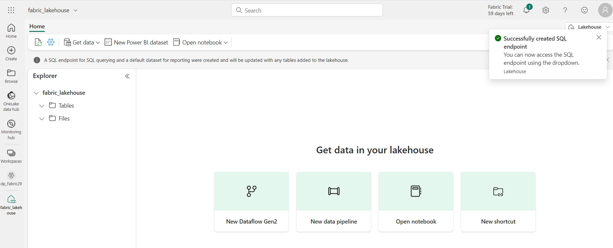

**소개**

Apache Spark는 분산 데이터 처리를 위한 오픈 소스 엔진이며 데이터 레이크
스토리지에서 방대한 양의 데이터를 탐색, 처리 및 분석하는 데 널리
사용됩니다. Spark는 Azure HDInsight, Azure Databricks, Azure Synapse
Analytics 및 Microsoft Fabric을 비롯한 많은 데이터 플랫폼 제품에서 처리
옵션으로 사용할 수 있습니다. Spark의 이점 중 하나는 Java, Scala, Python
및 SQL을 포함한 다양한 프로그래밍 언어를 지원한다는 것입니다. Spark는
데이터 정리 및 조작, 통계 분석 및 기계 학습, 데이터 분석 및 시각화를
포함한 데이터 처리 워크로드를 위한 매우 유연한 솔루션입니다

Microsoft Fabric Lakehouse의 테이블은 Apache Spark용 오픈 소스 *Delta
Lake* 형식을 기반으로 합니다 . Delta Lake는 일괄 처리 및 스트리밍 데이터
작업 모두에 대한 관계형 의미 체계에 대한 지원을 추가하고, Apache Spark를
사용하여 데이터 레이크의 기본 파일을 기반으로 하는 테이블의 데이터를
처리하고 쿼리할 수 있는 Lakehouse 아키텍처를 만들 수 있습니다.

Microsoft Fabric에서 데이터 흐름(Gen2)은 다양한 데이터 원본에 연결하고
Power Query Online에서 변환을 수행합니다. 그런 다음 데이터
파이프라인에서 Lakehouse 또는 기타 분석 저장소로 데이터를 수집하거나
Power BI 보고서에 대한 데이터 세트를 정의하는 데 사용할 수 있습니다.

이 랩은 데이터 흐름(Gen2)의 다양한 요소를 소개하도록 설계되었으며,
엔터프라이즈에 존재할 수 있는 복잡한 솔루션을 만들지 않습니다.

**목표**:

- Fabric 평가판을 활성화하여 Microsoft Fabric에서 작업 공간을 만듭니다.

- lakehouse 환경을 구축하고 분석을 위한 데이터 파일을 업로드합니다.

- 대화형 데이터 탐색 및 분석을 위한 노트북을 생성합니다.

- 추가 처리 및 시각화를 위해 데이터프레임에 데이터를 로드합니다.

- PySpark를 사용하여 데이터에 변환을 적용합니다.

- 최적화된 쿼리를 위해 변환된 데이터를 저장하고 분할합니다.

- 구조화된 데이터 관리를 위해 Spark 메타스토어에 테이블을 생성합니다.

- DataFrame을 "salesorders"라는 이름의 관리형 델타 테이블로 저장합니다.

- DataFrame을 지정된 경로를 사용하여 "external_salesorder"라는 이름의
  외부 델타 테이블로 저장합니다.

- matplotlib 및 seaborn과 같은 Python 라이브러리를 사용하여 데이터를
  시각화합니다.

- 데이터 엔지니어링 환경에서 Data lakehouse를 구축하고 후속 분석을 위해
  관련 데이터를 수집합니다.

- lakehouse에 데이터를 추출, 변환 및 로드하기 위한 데이터 흐름을
  정의합니다.

- Power Query 내에서 데이터 대상을 구성하여 변환된 데이터를 lakehouse에
  저장합니다.

- 데이터 흐름을 파이프라인에 통합하여 예약된 데이터 처리 및 수집을
  활성화합니다.

- 작업 공간 및 관련 요소를 제거하여 연습을 마무리합니다.

# 연습 1: 작업 공간, lakehouse, 노트북을 만들고 데이터 프레임에 데이터 로드 

## 작업 1: 작업 공간 만들기 

Fabric에서 데이터 작업을 하기 전에 Fabric 평가판을 활성화하여 작업
공간을 만드세요.

1.  브라우저를 열고 주소 표시줄로 이동한 후 다음 URL을 입력하거나
    붙여넣습니다. : <https://app.fabric.microsoft.com/> 그런 다음
    **Enter** 버튼을 누릅니다.

> **참고:** Microsoft Fabric 홈페이지로 이동되면 2번부터 4번까지 단계를
> 건너뛰세요.
>
> 

2.  **Microsoft Fabric** 창에서 자격 증명을 입력하고 **Submit** 버튼을
    클릭합니다.

> 

3.  그런 다음 **Microsoft** 창에서 비밀번호를 입력하고 **Sign in**버튼을
    클릭합니다.

> 

4.  **Stay signed in?**창에서 **Yes** 버튼을 클릭합니다.

> 

5.  Fabric 홈페이지에서 **+New workspace** 타일을 선택합니다.

> 

6.  **Create a workspace tab** 탭에서 다음 세부 정보를 입력하고
    **Apply** 버튼을 클릭합니다.

[TABLE]

> 
>
> 

7.  배포가 완료될 때까지 기다리세요. 완료하는 데 2~3분 정도 걸립니다. 새
    작업 공간이 열리면 비어 있을 것입니다.

## 작업 2: lakehouse를 만들고 파일 업로드

이제 작업 공간이 생겼으니 포털에서 데이터 엔지니어링 환경으로 전환하고
분석할 데이터 파일을 위한 Data lakehouse를 만들 차례입니다.

1.  탐색 모음에서 **+New item** 버튼을 클릭하여 새로운 이벤트하우스를
    만듭니다.

2.  " **Lakehouse** " 타일을 클릭합니다.

3.  **New lakehouse**  대화 상자에서 **Name** 필드에
    **+++Fabric_lakehouse+++** 를 입력하고 **Create** 버튼을 클릭하여
    새로운 lakehouse를 엽니다.

4.  약 1분 후, 비어 있는 새 lakehouse가 생성됩니다. 분석을 위해 Data
    lakehouse에 데이터를 수집해야 합니다.

5.  **Successfully created SQL endpoint**라는 알림이 표시됩니다.

6.  **Explorer** 섹션의 **fabric_lakehouse**아래에서 **Files
    folder**옆에 마우스를 올린 다음, 가로 줄임표**(…)** 메뉴를
    클릭합니다. 탐색 후 **Upload**를 클릭하고, 아래 이미지와 같이
    **Upload folder**를 클릭합니다.

7.  오른쪽에 나타나는 **Upload folder**창에서 파일/ 폴더 아래의 **folder
    icon**선택한 다음 **C:\LabFiles**로 이동하고 **orders** 폴더를
    선택한 후 **Upload** 버튼을 클릭합니다.

8.  **Upload 3 files to this site?** 대화 상자가 나타나면 **Upload**
    버튼을 클릭하세요.

9.  업로드 폴더 창에서 **Upload** 버튼을 클릭합니다.

> 

10. 파일을 업로드한 후 **Upload folder**창을 닫습니다.

> 

11. **Files**을 확장하고 **orders** 폴더를 선택한 후 CSV 파일이
    업로드되었는지 확인합니다.

## 과제 3: 노트북 만들기

Apache Spark에서 데이터 작업을 하려면 노트북을 만들 수 있습니다.
노트북은 여러 언어로 코드를 작성하고 실행하며, 메모를 추가하여 문서화할
수 있는 대화형 환경을 제공합니다.

1.  **Home** 페이지에서 Datalake의 주문 폴더 내용을 보면서 **Open
    notebook** 메뉴에서 **New notebook**을 선택합니다.

2.  몇 초 후, 셀 하나가 포함된 새 노트북이 열립니다. 노트북은 코드나
    마크다운(서식이 지정된 텍스트)을 포함할 수 있는 하나 이상의 셀로
    구성됩니다.

3.  Select the first cell (which is currently a *code* cell), and then
    in the dynamic tool bar at its top-right, use the **M↓** button to
    **convert the cell to a markdown cell**. 3. 첫 번째 셀(현재는 코드
    셀)을 선택한 다음, 오른쪽 상단의 동적 도구 모음에서 **M↓** 버튼을
    사용하여 **셀을 마크다운 셀로 변환합니다.**

4.  셀이 마크다운 셀로 변경되면 셀에 포함된 텍스트가 렌더링됩니다.

5.  🖉 (편집) 버튼을 사용하여 셀을 편집 모드로 전환하고 모든 텍스트를
    바꾼 다음 다음과 같이 마크다운을 수정합니다:

> CodeCopy
>
> \# Sales order data exploration
>
> Use the code in this notebook to explore sales order data.

6.  셀 밖의 노트북 아무 곳이나 클릭하면 편집을 중단하고 렌더링된
    마크다운을 볼 수 있습니다.

## 작업 4: 데이터프레임에 데이터 로드하기

이제 데이터를 데이터프레임으로 로드하는 코드를 실행할 준비가 되었습니다.
Spark의 데이터프레임은 Python의 Pandas 데이터프레임과 유사하며, 행과
열로 구성된 데이터 작업을 위한 공통 구조를 제공합니다.

**참고:** Spark는 Scala, Java 등 여러 코딩 언어를 지원합니다. 이
연습에서는 Spark에 최적화된 Python의 변형인 PySpark를 사용합니다.
PySpark는 Spark에서 가장 널리 사용되는 언어 중 하나이며 Fabric
Notebook의 기본 언어입니다.

1.  노트북이 표시된 상태에서 **Files** 목록을 확장하고 **orders** 폴더를
    선택하면 CSV 파일이 노트북 편집기 옆에 나열됩니다.

2.  이제 마우스를 2019.csv 파일로 이동합니다. 2019.csv 파일 옆에 있는
    가로 줄임표(…)를 클릭합니다. **Load data**를 클릭하고 **Spark**를
    선택합니다. 다음 코드가 포함된 새 코드 셀이 노트북에 추가됩니다:

> CodeCopy
>
> df =
> spark.read.format("csv").option("header","true").load("Files/orders/2019.csv")
>
> \# df now is a Spark DataFrame containing CSV data from
> "Files/orders/2019.csv".
>
> display(df)

**팁:** 왼쪽의 Lakehouse 탐색기 창은 "" 아이콘을 사용하여 숨길 수
있습니다.

그러면 노트북에 집중하는 데 도움이 됩니다.

3.  셀을 실행하려면 셀 왼쪽에 있는 ▷ **Run Cell**버튼을 사용합니다.

**참고:** Spark 코드를 처음 실행하는 것이므로 Spark 세션을 시작해야
합니다. 즉, 세션의 첫 번째 실행은 완료되는 데 1분 정도 걸릴 수 있습니다.
이후 실행은 더 빨리 완료됩니다.

4.  셀 명령이 완료되면 셀 아래의 출력을 검토하세요. 출력은 다음과
    비슷해야 합니다.

5.  출력에는 2019.csv 파일의 데이터 행과 열이 표시됩니다. 그러나 열
    헤더가 제대로 표시되지 않습니다. 데이터프레임에 데이터를 로드하는 데
    사용되는 기본 코드는 CSV 파일의 첫 번째 행에 열 이름이 포함되어
    있다고 가정하지만, 이 경우 CSV 파일에는 헤더 정보 없이 데이터만
    포함되어 있습니다.

6.  **Header** 옵션을 **false**로 설정하도록 코드를 수정하세요.
    **Cell의** 모든 코드를 다음 코드로 바꾸고 **▷ Run cell** 버튼을
    클릭하여 출력을 확인하세요.

> CodeCopy
>
> df =
> spark.read.format("csv").option("header","false").load("Files/orders/2019.csv")
>
> \# df now is a Spark DataFrame containing CSV data from
> "Files/orders/2019.csv".
>
> display(df)
>
> 

7.  이제 데이터프레임에 첫 번째 행이 데이터 값으로 올바르게 포함되어
    있지만, 열 이름은 자동 생성되어 그다지 도움이 되지 않습니다.
    데이터를 이해하려면 파일에서 데이터 값의 스키마와 데이터 유형을
    명확하게 정의해야 합니다.

8.  **cell**의 모든 코드를 다음 코드로 바꾸고 **▷ Run cell** 버튼을
    클릭하여 출력을 검토합니다.

> CodeCopy
>
> from pyspark.sql.types import \*
>
> orderSchema = StructType(\[
>
> StructField("SalesOrderNumber", StringType()),
>
> StructField("SalesOrderLineNumber", IntegerType()),
>
> StructField("OrderDate", DateType()),
>
> StructField("CustomerName", StringType()),
>
> StructField("Email", StringType()),
>
> StructField("Item", StringType()),
>
> StructField("Quantity", IntegerType()),
>
> StructField("UnitPrice", FloatType()),
>
> StructField("Tax", FloatType())
>
> \])
>
> df =
> spark.read.format("csv").schema(orderSchema).load("Files/orders/2019.csv")
>
> display(df)

> 

9.  이제 데이터프레임에 올바른 열 이름이 포함됩니다(각 행의 순서 위치에
    따라 모든 데이터프레임에 내장된 열인 **Index** 외에도). 열의 데이터
    유형은 Spark SQL 라이브러리에 정의된 표준 유형 집합을 사용하여
    지정되며, 이 유형들은 셀 시작 부분에서 가져옵니다.

10. 데이터프레임을 보고 변경 사항이 데이터에 적용되었는지 확인합니다.

11. 셀 출력 아래에 있는 **+ Code** 아이콘을 사용하여 노트북에 새 코드
    셀을 추가하고 다음 코드를 입력하세요. **▷ Run cell** 버튼을 클릭하고
    출력을 검토합니다.

> CodeCopy
>
> display(df)
>
> 

12. 데이터프레임에는 **2019.csv** 파일의 데이터만 포함됩니다. 파일
    경로에 \* 와일드카드를 사용하여 orders 폴더의 모든 파일에서 판매
    **orders** 데이터를 읽도록 코드를 수정합니다.

13. 셀 출력 아래에 있는 **+ Code**  아이콘을 사용하여 노트북에 새 코드
    셀을 추가하고 다음 코드를 입력합니다.

CodeCopy

> from pyspark.sql.types import \*
>
> orderSchema = StructType(\[
>
>     StructField("SalesOrderNumber", StringType()),
>
>     StructField("SalesOrderLineNumber", IntegerType()),
>
>     StructField("OrderDate", DateType()),
>
>     StructField("CustomerName", StringType()),
>
>     StructField("Email", StringType()),
>
>     StructField("Item", StringType()),
>
>     StructField("Quantity", IntegerType()),
>
>     StructField("UnitPrice", FloatType()),
>
>     StructField("Tax", FloatType())
>
>     \])
>
> df =
> spark.read.format("csv").schema(orderSchema).load("Files/orders/\*.csv")
>
> display(df)

14. 수정된 코드 셀을 실행하고 출력을 검토하면 이제 2019년, 2020년,
    2021년의 매출이 포함되어 있어야 합니다.

**참고:** 행의 하위 집합만 표시되므로 모든 연도의 예를 보지 못할 수도
있습니다.

# 연습 2: 데이터 프레임에서 데이터 탐색

데이터프레임 객체에는 필터링, 그룹화 및 그 밖의 방식으로 포함된 데이터를
조작하는 데 사용할 수 있는 다양한 함수가 포함되어 있습니다.

## 작업 1: 데이터 프레임 필터링하기

1.  셀 출력 아래에 있는 **+ Code** 아이콘을 사용하여 노트북에 새 코드
    셀을 추가하고 다음 코드를 입력합니다.

**CodeCopy**

> customers = df\['CustomerName', 'Email'\]
>
> print(customers.count())
>
> print(customers.distinct().count())
>
> display(customers.distinct())
>
> 

2.  새 코드 셀을 **실행**하고 결과를 검토합니다. 다음 세부 사항을
    확인합니다:

    - 데이터프레임에서 작업을 수행하면 결과는 새로운
      데이터프레임입니다(이 경우 df 데이터프레임에서 특정 열 하위 집합을
      선택하여 새로운 **customers**데이터프레임이 생성됩니다)

    - 데이터 프레임은 **count, distinct**와 같은 함수를 제공하며, 이를
      사용하여 데이터 프레임에 포함된 데이터를 요약하고 필터링할 수
      있습니다.

    - dataframe\['Field1', 'Field2', ...\] 구문은 열의 하위 집합을
      정의하는 단축 방식입니다. select 메서드를 사용할 수도 있으므로 위
      코드의 첫 번째 줄은 다음과 같이 작성할 수 있습니다. customers =
      df.select("CustomerName", "Email")

> 

3.  코드를 수정하고 **cell**의 모든 코드를 다음 코드로 바꾸고 다음과
    같이 **▷ Run cell** 버튼을 클릭합니다:

> CodeCopy
>
> customers = df.select("CustomerName",
> "Email").where(df\['Item'\]=='Road-250 Red, 52')
>
> print(customers.count())
>
> print(customers.distinct().count())
>
> display(customers.distinct())

4.  수정된 코드를 **실행**하여 **Road-250 Red, 52** 제품을 구매한 고객을
    확인하세요. 여러 함수를 "**chain**"하여 한 함수의 출력을 다음 함수의
    입력으로 사용할 수 있습니다. 이 경우, **select** 메서드로 생성된
    데이터프레임이 필터링 기준을 적용하는 데 사용되는 **where** 메서드의
    원본 데이터프레임입니다.

> 

## 작업 2: 데이터 프레임에서 데이터 집계 및 그룹화

1.  **+ Code**를 클릭하고 아래 코드를 복사하여 붙여넣은 다음 **Run
    cell**버튼을 클릭합니다.

CodeCopy

> productSales = df.select("Item", "Quantity").groupBy("Item").sum()
>
> display(productSales)
>
> 

2.  결과는 제품별로 그룹화된 주문 수량의 합계를 보여줍니다. **groupBy**
    메서드는 행을 Item별로 그룹화하고, 이후의 **sum** 집계 함수는 나머지
    모든 숫자 열(이 경우 Quantity)에 적용됩니다.

3.  \+ **Code**를 클릭하고 아래 코드를 복사하여 붙여넣은 다음 **Run
    cell**버튼을 클릭합니다.

> **CodeCopy**
>
> from pyspark.sql.functions import \*
>
> yearlySales =
> df.select(year("OrderDate").alias("Year")).groupBy("Year").count().orderBy("Year")
>
> display(yearlySales)

4.  결과는 연간 판매 주문 건수를 보여줍니다. **select** 메서드에는
    OrderDate 필드의 연도 구성 요소를 추출하는 SQL **year** 함수가
    포함되어 있습니다(이 때문에 코드에 Spark SQL 라이브러리에서 함수를
    가져오는 **import** 문이 포함되어 있습니다). 그런 다음 **alias**
    메서드를 사용하여 추출된 연도 값에 열 이름을 지정합니다. 그런 다음
    파생된 Year 열을 기준으로 데이터를 그룹화하고, 각 그룹의 행 수를
    계산한 후, 마지막으로 **orderBy** 메서드를 사용하여 결과
    데이터프레임을 정렬합니다.

# 연습 3: Spark를 사용하여 데이터 파일 변환

데이터 엔지니어의 일반적인 업무는 특정 형식이나 구조의 데이터를 수집하고
이를 후속 처리나 분석을 위해 변환하는 것입니다.

## 작업 1: 데이터프레임 메서드와 함수를 사용하여 데이터 변환

1.  **+ 코드**를 클릭하고 아래 코드를 복사하여 붙여넣습니다.

**CodeCopy**

> from pyspark.sql.functions import \*
>
> \## Create Year and Month columns
>
> transformed_df = df.withColumn("Year",
> year(col("OrderDate"))).withColumn("Month", month(col("OrderDate")))
>
> \# Create the new FirstName and LastName fields
>
> transformed_df = transformed_df.withColumn("FirstName",
> split(col("CustomerName"), " ").getItem(0)).withColumn("LastName",
> split(col("CustomerName"), " ").getItem(1))
>
> \# Filter and reorder columns
>
> transformed_df = transformed_df\["SalesOrderNumber",
> "SalesOrderLineNumber", "OrderDate", "Year", "Month", "FirstName",
> "LastName", "Email", "Item", "Quantity", "UnitPrice", "Tax"\]
>
> \# Display the first five orders
>
> display(transformed_df.limit(5))

2.  다음 변환을 사용하여 원래 주문 데이터에서 새 데이터 프레임을
    생성하는 코드를 **실행합니다**:

    - **OrderDate** 열을 기준으로 **Year** 및 **Month** 열을 추가합니다.

    - **CustomerName** 열을 기반으로 **FirstName**과 **LastName** 열을
      추가합니다.

    - 열을 필터링하고 순서를 변경하여 **CustomerName** 열을 제거합니다.

3.  **Output**을 검토하고 데이터에 변환이 적용되었는지 확인합니다.

Spark SQL 라이브러리의 모든 기능을 활용하여 행 필터링, 열 파생, 제거,
이름 변경, 기타 필요한 데이터 수정을 적용하여 데이터를 변환할 수
있습니다.

**팁**: Dataframe 객체의 메서드에 대해 자세히 알아보려면 [*Spark
dataframe
documentation*](https://spark.apache.org/docs/latest/api/python/reference/pyspark.sql/dataframe.html)를
참조하세요.

## 작업 2: 변환된 데이터 저장

1.  다음 코드를 사용하여 변환된 데이터프레임을 Parquet 형식으로 저장하는
    **새 셀을 추가합니다**(이미 데이터가 있는 경우 덮어씁니다). 셀을
    **실행하고** 데이터가 저장되었다는 메시지를 기다립니다.

> CodeCopy
>
> transformed_df.write.mode("overwrite").parquet('Files/transformed_data/orders')
>
> print ("Transformed data saved!")
>
> **참고:** 일반적으로 Parquet 형식은 추가 분석이나 분석 저장소에 저장할
> 데이터 파일에 적합합니다. Parquet은 대부분의 대규모 데이터 분석
> 시스템에서 지원하는 매우 효율적인 형식입니다. 실제로, CSV와 같은 다른
> 형식의 데이터를 Parquet으로 변환하기만 하면 되는 경우도 있습니다!

2.  그런 다음 왼쪽의 **Lakehouse explorer** 창에서 **Files** 노드의 ...
    메뉴에서 **Refresh**을 선택합니다.

> 

3.  **transformed_data** 폴더를 클릭하여 **orders**라는 이름의 새 폴더가
    있는지 확인합니다. 이 폴더에는 하나 이상의 **Parquet files**이 들어
    있습니다.

4.  **transformed_data -\> orders**  폴더의 Parquet 파일에서 새 데이터
    프레임을 로드하려면 다음 코드를 **+ Code**로 클릭합니다.

> **CodeCopy**
>
> orders_df =
> spark.read.format("parquet").load("Files/transformed_data/orders")
>
> display(orders_df)
>
> 

5.  셀을 **실행**하고 결과에 Parquet 파일에서 로드된 주문 데이터가
    표시되는지 확인합니다.

> 

## 작업 3: 분할된 파일에 데이터 저장

1.  새 셀을 추가하고, **+ Code**를 클릭하여 다음 코드를 추가합니다. 이
    코드는 **연도와 월별로** 데이터를 분할하여 데이터프레임을
    저장합니다. 셀을 **실행하고** 데이터가 저장되었다는 메시지를
    기다립니다.

> CodeCopy
>
> orders_df.write.partitionBy("Year","Month").mode("overwrite").parquet("Files/partitioned_data")
>
> print ("Transformed data saved!")
>
> 
>
> 

2.  그런 다음 왼쪽의 **Lakehouse explorer**  창에서 파일 노드의 ...
    메뉴에서 **Refresh**을 선택합니다.

3.  **partitioned_orders** 폴더를 확장하여 **Year=xxxx**라는 이름의 폴더
    계층 구조가 있는지 확인합니다. 각 폴더는 **Month=*xxxx***라는 이름의
    폴더를 포함합니다. 각 Month 폴더에는 해당 월의 주문 내역이 저장된
    Parquet 파일이 있습니다.

> 데이터 파일을 분할하는 것은 대용량 데이터를 처리할 때 성능을
> 최적화하는 일반적인 방법입니다. 이 기법을 사용하면 성능을 크게
> 향상시키고 데이터 필터링을 더 쉽게 할 수 있습니다.

4.  새 셀을 추가하고 다음 코드로 **+ Code**를 클릭하여
    **orders.parquet** 파일에서 새 데이터 프레임을 로드합니다:

> CodeCopy
>
> orders_2021_df =
> spark.read.format("parquet").load("Files/partitioned_data/Year=2021/Month=\*")
>
> display(orders_2021_df)

5.  셀을 **실행하고** 결과에 2021년 판매 주문 데이터가 표시되는지
    확인합니다. 경로에 지정된 분할 열(**Year & Month**)은 데이터프레임에
    포함되지 않습니다.

# **연습 3: 테이블 및 SQL 작업**

보시다시피, 데이터프레임 객체의 네이티브 메서드를 사용하면 파일에서
데이터를 매우 효과적으로 쿼리하고 분석할 수 있습니다. 하지만 많은 데이터
분석가는 SQL 구문을 사용하여 쿼리할 수 있는 테이블 작업을 더 선호합니다.
Spark는 관계형 테이블을 정의할 수 있는 메타스토어를 제공합니다.
데이터프레임 객체를 제공하는 Spark SQL 라이브러리는 메타스토어의
테이블을 쿼리하는 SQL 문도 지원합니다. Spark의 이러한 기능을 사용하면
데이터 레이크의 유연성과 관계형 데이터 웨어하우스의 구조화된 데이터
스키마 및 SQL 기반 쿼리를 결합할 수 있습니다. 따라서 "데이터
Lakehouse"라는 용어가 탄생했습니다.

## 작업 1: 관리되는 테이블 만들기

Spark 메타스토어의 테이블은 데이터 레이크의 파일에 대한 관계형
추상화입니다. 테이블은 관리될 수 있습니다(이 경우 파일은 메타스토어에서
관리됨) 또는 외부 테이블일 수 있습니다(이 경우 테이블은 메타스토어와
별도로 관리하는 데이터 레이크의 파일 위치를 참조함).

1.  새로운 코드를 추가하고, 노트북의 **+ Code** 셀을 클릭한 후 다음
    코드를 입력하면 판매 주문 데이터의 데이터프레임이
    **salesorders**라는 이름의 테이블로 저장됩니다:

> CodeCopy
>
> \# Create a new table
>
> df.write.format("delta").saveAsTable("salesorders")
>
> \# Get the table description
>
> spark.sql("DESCRIBE EXTENDED salesorders").show(truncate=False)

**참고:** 이 예제에서 몇 가지 유의해야 할 사항이 있습니다. 첫째,
명시적인 경로가 제공되지 않으므로 테이블 파일은 메타스토어에서
관리됩니다. 둘째, 테이블은 **델타** 형식으로 저장됩니다. CSV, Parquet,
Avro 등 다양한 파일 형식을 기반으로 테이블을 생성할 수 있지만, 델타
레이크는 테이블에 트랜잭션 지원, 행 버전 관리 및 기타 유용한 기능을
포함하여 관계형 데이터베이스 기능을 추가하는 Spark 기술입니다. Fabric의
데이터 Lakehouse에서는 델타 형식으로 테이블을 생성하는 것이 좋습니다.

2.  코드 셀을 **실행하고** 새 테이블의 정의를 설명하는 출력을
    검토합니다.

3.  **Lakehouse** **explorer**창에서 **Tables** 폴더의 ... 메뉴에서
    **Refresh**을 선택합니다.

4.  그런 다음 **Tables** 노드를 확장하여 **salesorders** 테이블이
    생성되었는지 확인합니다.

> 

5.  **Salesorders** 테이블 옆에 마우스를 올린 다음, 가로 줄임표(…)를
    클릭하세요. 탐색하여 **Load data**를 클릭한 다음, **Spark**를
    선택하세요.

6.  **▷ Run cell** 버튼을 클릭하면 Spark SQL 라이브러리를 사용하여
    PySpark 코드의 **salesorder** 테이블에 대한 SQL 쿼리를 내장하고 쿼리
    결과를 데이터프레임에 로드합니다.

> CodeCopy
>
> df = spark.sql("SELECT \* FROM \[your_lakehouse\].salesorders LIMIT
> 1000")
>
> display(df)

## 작업 2: 외부 테이블 만들기

스키마 메타데이터가 Lakehouse의 메타스토어에 정의되어 있지만 데이터
파일은 외부 위치에 저장되는 외부 테이블을 생성할 수도 있습니다.

1.  첫 번째 코드 셀에서 반환된 결과 아래에서 **+code** 버튼을 사용하여
    새 코드 셀이 없는 경우 추가합니다. 그런 다음 새 셀에 다음 코드를
    입력합니다.

CodeCopy

> df.write.format("delta").saveAsTable("external_salesorder",
> path="\<abfs_path\>/external_salesorder")

2.  **Lakehouse explorer**창에서 **Files** 폴더의 ... 메뉴에서
    메모장에서 **Copy ABFS path**를 선택합니다.

> ABFS 경로는 Lakehouse의 OneLake 저장소에 있는 파일 폴더에 대한
> 정규화된 경로입니다-이와 비슷합니다.:

abfss://dp_Fabric29@onelake.dfs.fabric.microsoft.com/Fabric_lakehouse.Lakehouse/Files/external_salesorder

3.  이제 코드 셀로 이동하여 **\<abfs_path\>**를 메모장에 복사한
    **경로**로 바꾸세요. 그러면 코드가 데이터프레임을 **Files** 폴더의
    **external_salesorder** 폴더에 데이터 파일이 포함된 외부 테이블로
    저장합니다. 전체 경로는 다음과 같습니다.

abfss://dp_Fabric29@onelake.dfs.fabric.microsoft.com/Fabric_lakehouse.Lakehouse/Files/external_salesorder

4.  Use the **▷ (*Run cell*)** button on the left of the cell to run it.
    셀을 실행하려면 셀 왼쪽의 ▷ **(*Run cell*)** 버튼을 사용합니다.

5.  **Lakehouse explorer** 창에서 **Tables** 폴더의 ... 메뉴에서
    **Refresh을** 선택합니다.

6.  그런 다음 **Tables** 노드를 확장하여
    **external_salesorder** 테이블이 생성되었는지 확인합니다.

7.  **Lakehouse explorer** 창에서 **Files** 폴더의 ... 메뉴에서
    **Refresh**을 선택합니다.

8.  그런 다음 **Files** 노드를 확장하여 테이블의 데이터 파일에 대한
    **external_salesorder** 폴더가 생성되었는지 확인합니다.

## 작업 3: 관리형 테이블과 외부 테이블 비교

관리형 테이블과 외부 테이블의 차이점을 살펴보겠습니다.

1.  코드 셀에서 반환된 결과 아래에서 **+ Code** 버튼을 사용하여 새 코드
    셀을 추가합니다. 아래 코드를 코드 셀에 복사하고 셀 왼쪽의 **▷ (*Run
    cell*)** 버튼을 사용하여 실행합니다.

> SqlCopy
>
> %%sql
>
> DESCRIBE FORMATTED salesorders;

2.  결과에서 테이블의 **Location** 속성을 확인하면
    **/Tables/salesorders**로 끝나는 Lakehouse의 OneLake 저장소 경로가
    됩니다(전체 경로를 보려면 **Data type** 열을 넓혀야 할 수도 있음).

3.  여기에 표시된 것처럼 **external_saleorder** 테이블의 세부 정보를
    표시하도록 **DESCRIBE** 명령을 수정합니다.

4.  코드 셀에서 반환된 결과 아래에서 **+ Code** 버튼을 사용하여 새 코드
    셀을 추가합니다. 아래 코드를 복사하고 셀 왼쪽의 **▷ (*Run cell*)**
    버튼을 사용하여 실행합니다.

> SqlCopy
>
> %%sql
>
> DESCRIBE FORMATTED external_salesorder;

5.  결과에서 테이블의 **Location** 속성을 확인하면
    **/Files/external_saleorder** 로 끝나는 Lakehouse의 OneLake 저장소
    경로가 됩니다(전체 경로를 보려면 **Data type** 열을 넓혀야 할 수도
    있음)

## 작업 4: 셀에서 SQL 코드 실행

PySpark 코드가 포함된 셀에 SQL 문을 내장할 수 있는 기능은 유용하지만,
데이터 분석가는 종종 SQL에서 직접 작업하기를 원합니다.

1.  **+ Code**를 노트북에 클릭하고 다음 코드를 입력하세요. ▷ **Run
    cell** 버튼을 클릭하고 결과를 확인하세요.

    - 셀 시작 부분의 %%sql줄(매직이라고 함)은 PySpark 대신 Spark SQL
      언어 런타임을 사용하여 이 셀의 코드를 실행해야 함을 나타냅니다.

    - SQL 코드는 이전에 생성한 **salesorders**테이블을 참조합니다.

    - SQL 쿼리의 출력은 셀 아래에 결과로 자동 표시됩니다.

> SqlCopy
>
> %%sql
>
> SELECT YEAR(OrderDate) AS OrderYear,
>
> SUM((UnitPrice \* Quantity) + Tax) AS GrossRevenue
>
> FROM salesorders
>
> GROUP BY YEAR(OrderDate)
>
> ORDER BY OrderYear;

**참고:** Spark SQL 및 데이터 프레임에 대한 자세한 내용은 다음을
참조하세요. [*Spark SQL
documentation*](https://spark.apache.org/docs/2.2.0/sql-programming-guide.html).

# 연습 4: Spark를 사용하여 데이터 시각화

그림 한 장은 천 마디 말보다 가치가 있고, 차트는 천 줄의 데이터보다 훨씬
나은 경우가 많습니다. Fabric 노트북에는 데이터프레임이나 Spark SQL
쿼리에서 표시되는 데이터에 대한 차트 뷰가 내장되어 있지만, 포괄적인 차트
작성을 위해 설계된 것은 아닙니다. 하지만 **matplotlib**이나
**seaborn**과 같은 Python 그래픽 라이브러리를 사용하면 데이터프레임의
데이터로 차트를 만들 수 있습니다.

## 과제 1: 결과를 차트로 보기

1.  노트북에 **+ Code**셀 추가를 클릭하고 다음 코드를 입력합니다. ▷ 셀
    실행 버튼을 클릭하면 이전에 생성한 **salesorders**뷰의 데이터가
    반환되는 것을 확인할 수 있습니다.

> SqlCopy
>
> %%sql
>
> SELECT \* FROM salesorders

2.  셀 아래의 결과 섹션에서 **View** 옵션을 **Table**에서 **Chart**로
    변경합니다.

3.  차트 오른쪽 상단의 **View options** 버튼을 사용하여 차트 옵션 창을
    표시합니다. 그런 다음 다음과 같이 옵션을 설정하고 **Apply**을
    선택합니다:

    - **Chart type**: Bar chart

    - **Key**: Item

    - **Values**: Quantity

    - **Series Group**: *leave blank*

    - **Aggregation**: Sum

    - **Stacked**: *Unselected*

4.  차트가 이와 유사한지 확인합니다

## 작업 2: matplotlib 시작하기

1.  Click on **+ Code** and copy and paste the below code. **Run** the
    code and observe that it returns a Spark dataframe containing the
    yearly revenue. **+ Code**를 클릭하고 아래 코드를 복사하여
    붙여넣습니다. 코드를 **실행하면** 연간 수익이 포함된 Spark
    데이터프레임이 반환되는 것을 확인할 수 있습니다.

> CodeCopy
>
> sqlQuery = "SELECT CAST(YEAR(OrderDate) AS CHAR(4)) AS OrderYear, \\
>
> SUM((UnitPrice \* Quantity) + Tax) AS GrossRevenue \\
>
> FROM salesorders \\
>
> GROUP BY CAST(YEAR(OrderDate) AS CHAR(4)) \\
>
> ORDER BY OrderYear"
>
> df_spark = spark.sql(sqlQuery)
>
> df_spark.show()

2.  데이터를 차트로 시각화하기 위해 먼저 **matplotlib** Python
    라이브러리를 사용하겠습니다. 이 라이브러리는 다른 많은 라이브러리의
    기반이 되는 핵심 플로팅 라이브러리이며, 차트 생성에 있어 뛰어난
    유연성을 제공합니다.

3.  **+ Code**를 클릭하고 아래 코드를 복사하여 붙여넣습니다

**CodeCopy**

> from matplotlib import pyplot as plt
>
> \# matplotlib requires a Pandas dataframe, not a Spark one
>
> df_sales = df_spark.toPandas()
>
> \# Create a bar plot of revenue by year
>
> plt.bar(x=df_sales\['OrderYear'\], height=df_sales\['GrossRevenue'\])
>
> \# Display the plot
>
> plt.show()

5.  **Run cell**버튼을 클릭하고 각 연도의 총 매출을 보여주는 세로 막대형
    차트로 구성된 결과를 확인하세요. 이 차트를 생성하는 데 사용된 코드의
    다음 기능을 참고하세요. '+ 코드'를 클릭하고 아래 코드를 복사하여
    붙여넣습니다.

    - **matplotlib** 라이브러리는 Pandas 데이터프레임을 필요로 하므로
      Spark SQL 쿼리에서 반환된 Spark 데이터프레임을 이 형식으로
      변환해야 합니다.

    - **matplotlib** 라이브러리의 핵심은 **pyplot** 객체입니다. 이는
      대부분의 플로팅 기능의 기반이 됩니다.

    - 기본 설정으로도 사용 가능한 차트를 만들 수 있지만, 사용자 정의
      범위가 상당히 넓습니다.

6.  다음과 같이 차트를 그리도록 코드를 수정하고 **셀**의 모든 코드를
    다음 코드로 바꾸고 **▷ Run cell** 버튼을 클릭하여 출력을 검토합니다.

> CodeCopy
>
> from matplotlib import pyplot as plt
>
> \# Clear the plot area
>
> plt.clf()
>
> \# Create a bar plot of revenue by year
>
> plt.bar(x=df_sales\['OrderYear'\], height=df_sales\['GrossRevenue'\],
> color='orange')
>
> \# Customize the chart
>
> plt.title('Revenue by Year')
>
> plt.xlabel('Year')
>
> plt.ylabel('Revenue')
>
> plt.grid(color='#95a5a6', linestyle='--', linewidth=2, axis='y',
> alpha=0.7)
>
> plt.xticks(rotation=45)
>
> \# Show the figure
>
> plt.show()

7.  이제 차트에 정보가 조금 더 추가되었습니다. 플롯은 기술적으로
    Figure에 포함됩니다. 이전 예제에서는 **Figure**가 자동으로
    생성되었지만, 사용자가 직접 생성할 수 있습니다.

8.  다음과 같이 차트를 그리도록 **코드**를 수정하고, 셀의 모든 코드를
    다음 코드로 바꿉니다

> CodeCopy
>
> from matplotlib import pyplot as plt
>
> \# Clear the plot area
>
> plt.clf()
>
> \# Create a Figure
>
> fig = plt.figure(figsize=(8,3))
>
> \# Create a bar plot of revenue by year
>
> plt.bar(x=df_sales\['OrderYear'\], height=df_sales\['GrossRevenue'\],
> color='orange')
>
> \# Customize the chart
>
> plt.title('Revenue by Year')
>
> plt.xlabel('Year')
>
> plt.ylabel('Revenue')
>
> plt.grid(color='#95a5a6', linestyle='--', linewidth=2, axis='y',
> alpha=0.7)
>
> plt.xticks(rotation=45)
>
> \# Show the figure
>
> plt.show()

9.  코드 셀을 **다시 실행하여** 결과를 확인하세요. 그림에 따라 플롯의
    모양과 크기가 결정됩니다.

> 그림에는 각각 별도의 축에 여러 개의 하위 플롯이 포함될 수 있습니다.

10. 다음과 같이 코드를 수정하여 차트를 그리세요. 코드 셀을 **다시
    실행하고** 결과를 확인하세요. 그림에는 코드에 지정된 하위 플롯이
    포함되어 있습니다.

> CodeCopy
>
> from matplotlib import pyplot as plt
>
> \# Clear the plot area
>
> plt.clf()
>
> \# Create a figure for 2 subplots (1 row, 2 columns)
>
> fig, ax = plt.subplots(1, 2, figsize = (10,4))
>
> \# Create a bar plot of revenue by year on the first axis
>
> ax\[0\].bar(x=df_sales\['OrderYear'\],
> height=df_sales\['GrossRevenue'\], color='orange')
>
> ax\[0\].set_title('Revenue by Year')
>
> \# Create a pie chart of yearly order counts on the second axis
>
> yearly_counts = df_sales\['OrderYear'\].value_counts()
>
> ax\[1\].pie(yearly_counts)
>
> ax\[1\].set_title('Orders per Year')
>
> ax\[1\].legend(yearly_counts.keys().tolist())
>
> \# Add a title to the Figure
>
> fig.suptitle('Sales Data')
>
> \# Show the figure
>
> plt.show()

**참고:** matplotlib을 사용한 플로팅에 대해 자세히 알아보려면 다음을
참조하세요**.** [*matplotlib documentation*](https://matplotlib.org/).

## 과제 3: seaborn 라이브러리 사용

Matplotlib을 사용하면 여러 유형의 복잡한 차트를 만들 수 있지만, 최상의
결과를 얻으려면 다소 복잡한 코드가 필요할 수 있습니다. 이러한 이유로
지난 몇 년 동안 Matplotlib의 복잡성을 추상화하고 기능을 향상시키기 위해
Matplotlib을 기반으로 하는 많은 새로운 라이브러리가 개발되었습니다.
이러한 라이브러리 중 하나가 **seaborn**입니다.

1.  **+ 코드를** 클릭하고 아래 코드를 복사하여 붙여넣습니다.

CodeCopy

> import seaborn as sns
>
> \# Clear the plot area
>
> plt.clf()
>
> \# Create a bar chart
>
> ax = sns.barplot(x="OrderYear", y="GrossRevenue", data=df_sales)
>
> plt.show()

2.  코드를 **실행하고** seaborn 라이브러리를 사용하여 막대 차트가
    표시되는지 살펴봅니다.

3.  다음과 같이 코드를 **수정하세요**. 수정된 코드를 **실행하면**
    seaborn을 통해 플롯에 일관된 색상 테마를 설정할 수 있음을 확인할 수
    있습니다.

> CodeCopy
>
> import seaborn as sns
>
> \# Clear the plot area
>
> plt.clf()
>
> \# Set the visual theme for seaborn
>
> sns.set_theme(style="whitegrid")
>
> \# Create a bar chart
>
> ax = sns.barplot(x="OrderYear", y="GrossRevenue", data=df_sales)
>
> plt.show()
>
> 

4.  코드를 다음과 같이 다시 **수정합니다.** 수정된 코드를 **실행하여**
    연간 수익을 선형 차트로 확인합니다.

> CodeCopy
>
> import seaborn as sns
>
> \# Clear the plot area
>
> plt.clf()
>
> \# Create a bar chart
>
> ax = sns.lineplot(x="OrderYear", y="GrossRevenue", data=df_sales)
>
> plt.show()

**참고:** seaborn을 사용한 플로팅에 대해 자세히 알아보려면 다음을
참조하세요. [*seaborn
documentation*](https://seaborn.pydata.org/index.html).

## 작업 4: 스트리밍 데이터에 델타 테이블 사용

델타 레이크는 스트리밍 데이터를 지원합니다. 델타 테이블은 Spark
Structured Streaming API를 사용하여 생성된 데이터 스트림의 싱크 또는
소스가 될 수 있습니다. 이 예제에서는 시뮬레이션된 사물 인터넷(IoT)
시나리오에서 델타 테이블을 일부 스트리밍 데이터의 싱크로 사용합니다.

1.  **+ Code**를 클릭하고 아래 코드를 복사하여 붙여넣은 다음 **Run
    cell**버튼을 클릭합니다.

CodeCopy

> from notebookutils import mssparkutils
>
> from pyspark.sql.types import \*
>
> from pyspark.sql.functions import \*
>
> \# Create a folder
>
> inputPath = 'Files/data/'
>
> mssparkutils.fs.mkdirs(inputPath)
>
> \# Create a stream that reads data from the folder, using a JSON
> schema
>
> jsonSchema = StructType(\[
>
> StructField("device", StringType(), False),
>
> StructField("status", StringType(), False)
>
> \])
>
> iotstream =
> spark.readStream.schema(jsonSchema).option("maxFilesPerTrigger",
> 1).json(inputPath)
>
> \# Write some event data to the folder
>
> device_data = '''{"device":"Dev1","status":"ok"}
>
> {"device":"Dev1","status":"ok"}
>
> {"device":"Dev1","status":"ok"}
>
> {"device":"Dev2","status":"error"}
>
> {"device":"Dev1","status":"ok"}
>
> {"device":"Dev1","status":"error"}
>
> {"device":"Dev2","status":"ok"}
>
> {"device":"Dev2","status":"error"}
>
> {"device":"Dev1","status":"ok"}'''
>
> mssparkutils.fs.put(inputPath + "data.txt", device_data, True)
>
> print("Source stream created...")

2.  ***Source stream created…*** 라는 메시지가 출력되는지 확인하세요.
    방금 실행한 코드는 데이터가 저장된 폴더를 기반으로 가상 IoT 기기의
    측정값을 나타내는 스트리밍 데이터 소스를 생성했습니다.

3.  **+ Code**를 클릭하고 아래 코드를 복사하여 붙여넣은 다음 **Run
    cell**버튼을 클릭합니다.

CodeCopy

> \# Write the stream to a delta table
>
> delta_stream_table_path = 'Tables/iotdevicedata'
>
> checkpointpath = 'Files/delta/checkpoint'
>
> deltastream =
> iotstream.writeStream.format("delta").option("checkpointLocation",
> checkpointpath).start(delta_stream_table_path)
>
> print("Streaming to delta sink...")

4.  이 코드는 스트리밍 장치 데이터를 델타 형식으로 **iotdevicedata**라는
    폴더에 기록합니다. 폴더 위치 경로가 **Tables** 폴더에 있으므로 해당
    폴더의 테이블이 자동으로 생성됩니다. 테이블 옆의 가로 줄임표를
    클릭한 다음 **Refresh**을 클릭하세요.

5.  **+Code**를 클릭하고 아래 코드를 복사하여 붙여넣은 다음 **Run cell**
    버튼을 클릭합니다.

> SqlCopy
>
> %%sql
>
> SELECT \* FROM IotDeviceData;

6.  이 코드는 스트리밍 소스의 장치 데이터가 포함된 **IotDeviceData**
    테이블을 쿼리합니다.

7.  +Code를 클릭하고 아래 코드를 복사하여 붙여넣은 다음 Run cell 버튼을
    클릭합니다.

> CodeCopy
>
> \# Add more data to the source stream
>
> more_data = '''{"device":"Dev1","status":"ok"}
>
> {"device":"Dev1","status":"ok"}
>
> {"device":"Dev1","status":"ok"}
>
> {"device":"Dev1","status":"ok"}
>
> {"device":"Dev1","status":"error"}
>
> {"device":"Dev2","status":"error"}
>
> {"device":"Dev1","status":"ok"}'''
>
> mssparkutils.fs.put(inputPath + "more-data.txt", more_data, True)

8.  이 코드는 스트리밍 소스에 더 많은 가상 장치 데이터를 기록합니다.

9.  **+Code**를 클릭하고 아래 코드를 복사하여 붙여넣은 다음 **Run cell**
    버튼을 클릭합니다.

> SqlCopy
>
> %%sql
>
> SELECT \* FROM IotDeviceData;
>
> 

10. 이 코드는 **IotDeviceData** 테이블을 다시 쿼리하는데, 이제 스트리밍
    소스에 추가된 데이터가 포함되어야 합니다.

11. **+Code**를 클릭하고 아래 코드를 복사하여 붙여넣은 다음 **Run cell**
    버튼을 클릭합니다.

> CodeCopy
>
> deltastream.stop()

12. 이 코드는 스트림을 중지합니다.

## 작업 5: 노트북을 저장하고 Spark 세션을 종료

이제 데이터 작업이 끝났으므로 의미 있는 이름으로 노트북을 저장하고 Spark
세션을 종료할 수 있습니다.

1.  노트북 메뉴 표시줄에서 ⚙️ **Settings** 아이콘을 사용하여 노트북
    설정을 확인합니다.

2.  노트북 **Name** 을 ++ **Explore Sales Orders** ++로 설정한 다음 설정
    창을 닫습니다.

3.  노트북 메뉴에서 **Stop session** 를 선택하여 Spark 세션을
    종료합니다.

# 연습 5: Microsoft Fabric에서 데이터 흐름(Gen2) 만들기

Microsoft Fabric에서 데이터 흐름(Gen2)은 다양한 데이터 소스에 연결되고
Power Query Online에서 변환을 수행합니다. 그런 다음 데이터
파이프라인에서 Lakehouse 또는 기타 분석 저장소로 데이터를 수집하거나
Power BI 보고서의 데이터 세트를 정의하는 데 사용할 수 있습니다.

이 연습은 데이터 흐름(Gen2)의 다양한 요소를 소개하기 위한 것이며,
기업에서 흔히 볼 수 있는 복잡한 솔루션을 만드는 것이 아닙니다.

## 작업 1: 데이터를 수집하기 위한 데이터 흐름(Gen2) 생성

이제 Lakehouse가 생겼으니 데이터를 수집해야 합니다. 한 가지 방법은 추출,
변환, 로드(ETL) 프로세스를 캡슐화하는 데이터 흐름을 정의하는 것입니다.

1.  이제 왼쪽 탐색 창에서 Fabric Lakehouse를 클릭합니다.

2.  **Fabric_lakehouse** 홈페이지에서 **Get data**드롭다운 화살표를
    클릭하고 **New Dataflow Gen2**를 선택하세요. 새 데이터 흐름의 Power
    Query 편집기가 열립니다.

3.  **Power Query** 창의 **Home tab**에서 **Import from a Text/CSV
    file**를 클릭합니다.

4.  In the **Connect to data source** pane, under **Connection
    settings**, select **Link to file (Preview)** radio button 4.
    **Connect to data source**창의 **Connection settings**에서 **Link to
    file (Preview)** 라디오 버튼을 선택합니다.

- **Link to file**: 선택

- **파일 경로 또는
  URL**: <https://raw.githubusercontent.com/MicrosoftLearning/dp-data/main/orders.csv>

5.  **Connect to data source** 창의 연결 자격 증명에서 다음 세부 정보를
    입력하고 다음 버튼을 클릭합니다.

    - **Connection**: Create new connection

    - **data gateway**: (none)

    - **Authentication kind**: Organizational account

6.  **Preview file data**창에서 **Create**를 클릭하여 데이터 소스를
    만듭니다. 

7.  **Power Query**편집기는 데이터 소스와 데이터를 서식 지정하는 초기
    쿼리 단계를 보여줍니다.

8.  도구 모음 리본에서 **Add column** 탭을 선택하세요. 그런 다음
    **Custom column** 을 선택하세요.

 

9.  새 열 이름을 **MonthNo**로, 데이터 형식을 **Whole Number**로 설정한
    후 **Custom column formula** 아래에 **Date.Month(\[OrderDate\])**
    수식을 추가합니다. **OK**를 선택합니다.

10. 사용자 지정 열을 추가하는 단계가 쿼리에 어떻게 추가되는지
    확인하세요. 결과 열이 데이터 창에 표시됩니다.

**팁:** 오른쪽의 쿼리 설정 창에서 적용된 단계에 각 변환 단계가 포함되어
있는지 확인하세요. 하단의 다이어그램 흐름 버튼을 토글하여 단계의 시각적
다이어그램을 켤 수도 있습니다.

단계를 위아래로 이동하고, 기어 아이콘을 선택하여 편집할 수 있으며, 각
단계를 선택하여 미리보기 창에서 변환이 적용되는 것을 확인할 수 있습니다.

작업 2: Dataflow에 대한 데이터 대상 추가

1.  **Power Query** 도구 모음 리본에서 **Home** 탭을 선택하세요. 그런
    다음 **Data destination** 드롭다운 메뉴에서 **Lakehouse**를
    선택하세요(아직 선택되어 있지 않은 경우).

**참고: 이 옵션이 회색으로 표시되어 있으면 이미 데이터 대상이 설정되어
있을 수 있습니다. Power Query 편집기 오른쪽의 쿼리 설정 창 하단에서
데이터 대상을 확인하세요. 대상이 이미 설정되어 있는 경우 기어 아이콘을
사용하여 변경할 수 있습니다.**.

2.  선택한 **Lakehouse** 옵션 옆에 있는 **Settings** 아이콘을
    클릭합니다.

3.  **Connect to data destination** 대화 상자에서 **Edit connection**을
    선택합니다.

4.  **Connect to data destination**  대화 상자에서 Power BI 조직 계정을
    사용하여 **sign in**을 선택하여 데이터 흐름이 lakehouse에 액세스하는
    데 사용하는 ID를 설정합니다.

5.  데이터 대상에 연결 대화 상자에서 **Next**을 선택합니다.

6.  데이터 대상에 연결 대화 상자에서 **New table**을 선택합니다.
    **Lakehouse folder**를 클릭하고 작업 공간 **dp_FabricXX**을 선택한
    후, lakehouse **Fabric_lakehouse**를 선택합니다. 테이블 이름을
    **orders**로 지정하고 **Next** 버튼을 클릭합니다.

7.  **Choose destination settings** 대화 상자에서 **Use automatic
    settings off**및 **Update method**에서 **Append**를 선택한 다음
    **Save settings**버튼을 클릭합니다.

8.  **Lakehouse** 목적지는 Power Query 편집기의 **query**에서
    **icon**으로 표시됩니다.

9.  **Publish**를 선택하여 데이터 흐름을 게시합니다. 그런 다음 작업
    공간에 **Dataflow 1**데이터 흐름이 생성될 때까지 기다립니다.

10. 게시한 후 작업 공간에서 데이터 흐름을 마우스 오른쪽 버튼으로
    클릭하고 **Properties**을 선택한 다음 데이터 흐름의 이름을 바꿀 수
    있습니다.

11. **Dataflow1** 대화 상자에서 **Name**을 **Gen2_Dataflow**로 입력하고
    **Save** 버튼을 클릭합니다.

## 작업 3: 파이프라인에 데이터 흐름 추가

파이프라인에 데이터 흐름을 활동으로 포함할 수 있습니다. 파이프라인은
데이터 수집 및 처리 활동을 조율하는 데 사용되며, 이를 통해 데이터 흐름을
다른 유형의 작업과 결합하여 단일 예약 프로세스로 구현할 수 있습니다.
파이프라인은 Data Factory 환경을 포함한 여러 환경에서 생성할 수
있습니다.

1.  Synapse Data Engineering 홈페이지의 **dp_FabricXX** 창에서 **+New
    item** **-\> Data pipeline**을 선택합니다.

2.  **New pipeline**대화 상자에서 이름 필드에 **Load dat**를 입력하고
    **Create** 버튼을 클릭하여 **New pipeline**을 엽니다.

3.  파이프라인 편집기가 열립니다.

> **팁:** 데이터 복사 마법사가 자동으로 열리면 닫으세요!

4.  **Pipeline activity**을 선택하고 파이프라인에 **Dataflow** 활동을
    추가합니다.

5.  새로운 **Dataflow1** 활동을 선택한 상태에서**Settings** 탭의
    **Dataflow** 드롭다운 목록에서 **Gen2_Dataflow**(이전에 만든 데이터
    흐름)를 선택합니다.

6.  **Home** 탭에서 🖫**(*Save*)** 아이콘을 사용하여 파이프라인을
    저장합니다.

7.  ▷ **Run** 버튼을 사용하여 파이프라인을 실행하고 완료될 때까지
    기다리세요. 몇 분 정도 걸릴 수 있습니다.

> 
>
> 

8.  왼쪽 가장자리에 있는 메뉴 모음에서 작업 공간 **dp_FabricXX**을
    선택합니다.

9.  **Fabric_lakehouse** 창에서 Lakehouse 유형의
    **Gen2_FabricLakehouse**를 선택합니다.

10. **Explorer** 창에서 **Tables**의 ... 메뉴를 선택하고 **refresh**을
    선택합니다. 그런 다음 **Tables** 을 확장하고 데이터 흐름에서 생성된
    **orders** 테이블을 선택합니다.

**팁**: Power BI Desktop data flow connector를 사용하여 데이터 흐름에서
수행된 데이터 변환에 직접 연결할 수 있습니다.

추가 변환을 수행하고, 새 데이터 세트로 게시하고, 특정 데이터 세트에 대해
의도한 대상에게 배포할 수도 있습니다.

## 작업 4: 리소스 정리

이 연습에서는 Spark를 사용하여 Microsoft Fabric에서 데이터를 처리하는
방법을 알아보았습니다.

lakehouse 탐색을 마쳤다면 이 연습을 위해 만든 작업 공간을 삭제할 수
있습니다.

1.  왼쪽 막대에서 작업 공간 아이콘을 선택하면 해당 작업 공간에 포함된
    모든 항목을 볼 수 있습니다.

> 

2.  도구 모음의 ... 메뉴에서 **Workspace setting**을 선택합니다.

3.  **General을 선택하고 Remove this workspace를 클릭합니다.**

4.  Delete workspace? 대화 상자에서 Delete 버튼을 클릭합니다.

> 
>
> 

**요약**

이 사용 사례 는 Power BI 내에서 Microsoft Fabric을 사용하는 프로세스를
안내합니다. 작업 공간 설정, Lakehouse 생성, 데이터 파일 업로드 및 관리,
데이터 탐색을 위한 노트북 사용 등 다양한 작업을 다룹니다. 참가자는
PySpark를 사용하여 데이터를 조작 및 변환하고, 시각화를 만들고, 효율적인
쿼리를 위해 데이터를 저장 및 분할하는 방법을 배웁니다.

이 사용 사례에서 참가자는 Microsoft Fabric에서 델타 테이블 작업에 초점을
맞춘 일련의 작업에 참여하게 됩니다. 이 작업에는 데이터 업로드 및 탐색,
관리형 및 외부 델타 테이블 생성, 속성 비교, 구조화된 데이터 관리를 위한
SQL 기능을 소개하고 matplotlib 및 seaborn과 같은 Python 라이브러리를
사용하여 데이터 시각화에 대한 통찰력을 제공하는 것이 포함됩니다. 이
연습은 데이터 분석을 위해 Microsoft Fabric을 활용하고 IoT 컨텍스트에서
데이터를 스트리밍하기 위해 델타 테이블을 통합하는 방법에 대한 포괄적인
이해를 제공하는 것을 목표로 합니다.

이 사용 사례는 Fabric Workspace를 설정하고, 데이터 Lakehouse를 생성하고,
분석을 위해 데이터를 수집하는 프로세스를 안내합니다. ETL 작업을 처리하기
위해 데이터 흐름을 정의하고 변환된 데이터를 저장하기 위한 데이터 대상을
구성하는 방법을 보여 줍니다. 또한 자동화된 처리를 위해 데이터 흐름을
파이프라인에 통합하는 방법을 알아봅니다. 마지막으로, 연습이 완료되면
리소스를 정리하기 위한 지침이 제공됩니다.

이 실습에서는 Fabric 작업에 필요한 필수 기술을 갖추고, Workspace를 생성
및 관리하고, 데이터 Lakehouse를 구축하고, 데이터 변환을 효율적으로
수행할 수 있습니다. 데이터 흐름을 파이프라인에 통합하면 실제
시나리오에서 데이터 처리 작업을 자동화하고, 워크플로를 간소화하고,
생산성을 향상시키는 방법을 배울 수 있습니다. 정리 지침은 불필요한
리소스를 남기지 않도록 하여 체계적이고 효율적인 작업 공간 관리 접근
방식을 촉진합니다.
