**介绍**

Apache Spark
是一个用于分布式数据处理的开源引擎，广泛用于探索、处理和分析 Data Lake
Storage 中的大量数据。Spark 在许多数据平台产品中作为处理选项提供，包括
Azure HDInsight、Azure Databricks、Azure Synapse Analytics 和 Microsoft
Fabric。Spark 的好处之一是支持多种编程语言，包括 Java、Scala、Python 和
SQL;使 Spark
成为数据处理工作负载的非常灵活的解决方案，包括数据清理和作、统计分析和机器学习以及数据分析和可视化。

Microsoft Fabric Lakehouse 中的表基于 Apache Spark 的开源 *Delta Lake*
格式。Delta Lake 增加了对批处理和流数据作的关系语义的支持，并支持创建
Lakehouse 体系结构，在该体系结构中，Apache Spark
可用于处理和查询基于数据湖中基础文件的表中的数据。

在 Microsoft Fabric 中，数据流 （Gen2） 连接到各种数据源，并在 Power
Query Online 中执行转换。然后，可以在 Data Pipelines
中使用它们将数据引入 Lakehouse 或其他分析存储，或为 Power BI
报表定义数据集。

此实验室旨在介绍 Dataflows （Gen2）
的不同元素，而不是创建企业中可能存在的复杂解决方案。

**目标：**

- 在 Microsoft Fabric 中创建工作区，并启用 Fabric 试用版。

- 建立湖仓一体环境并上传数据文件进行分析。

- 生成用于交互式数据探索和分析的笔记本。

- 将数据加载到 DataFrame 中，以便进一步处理和可视化。

- 使用 PySpark 对数据应用转换。

- 保存转换后的数据并对其进行分区，以实现优化查询。

- 在 Spark 元存储中创建表以进行结构化数据管理

&nbsp;

- 将 DataFrame 另存为名为 “salesorders” 的托管增量表。

- 将 DataFrame 另存为具有指定路径的名为 “external_salesorder” 的外部
  delta 表。

- 描述和比较托管表和外部表的属性。

- 对表执行 SQL 查询以进行分析和报告。

- 使用 Python 库（如 matplotlib 和 seaborn）可视化数据。

- 在数据工程体验中建立数据湖仓一体，并摄取相关数据以供后续分析。

- 定义用于提取、转换数据并将其加载到 Lakehouse 中的数据流。

- 在 Power Query 中配置数据目标，以将转换后的数据存储在 Lakehouse 中。

- 将数据流合并到管道中，以启用计划的数据处理和摄取。

- 删除工作区和关联的元素以结束练习。

# 练习 1：创建 workspace、Lakehouse、Notebook 并将数据加载到 DataFrame 中 

## 任务 1：创建工作区 

在 Fabric 中处理数据之前，请创建一个启用了 Fabric 试用版的工作区。

1.  打开浏览器，导航到地址栏，然后键入或粘贴以下
    URL：<https://app.fabric.microsoft.com/> 然后按 **Enter** 按钮。

> **注意**：如果您被定向到 Microsoft Fabric 主页，请跳过从 \#2 到 \#4
> 的步骤。
>
> 

2.  在 **Microsoft Fabric** 窗口中，输入您的凭据，然后单击 **Submit**
    按钮。

> 

3.  然后，在 **Microsoft** 窗口中输入密码并单击 **Sign in** 按钮**。**

> 

4.  在 **Stay signed in?** 窗口中，单击 **Yes** 按钮。

> 

5.  Fabric 主页，选择 **+New workspace tile**。

> 

6.  在 **Create a workspace tab** 中，输入以下详细信息，然后单击
    **Apply** 按钮。

[TABLE]

> 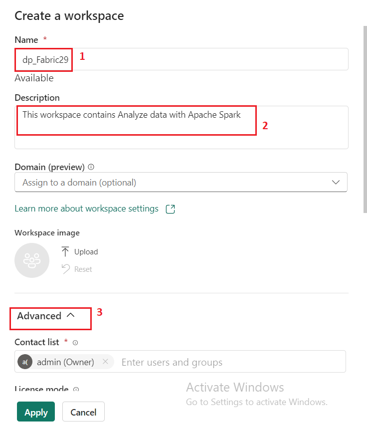

7.  等待部署完成。完成需要 2-3 分钟。当您的新 workspace
    打开时，它应该是空的。

## 任务 2：创建 Lakehouse 并上传文件

现在，你已拥有工作区，可以切换到门户中的 *Data engineering*
体验，并为要分析的数据文件创建数据湖仓一体。

1.  通过单击导航栏中的 **+New item** 按钮创建新的 Eventhouse。

2.  点击“**Lakehouse”**磁贴。

3.  在 **New lakehouse** 对话框中， 在 **Name** 字段中输入
    **+++Fabric_lakehouse+++ **，单击 **Create** 按钮并打开新的
    Lakehouse。

4.  大约一分钟后，将创建一个新的空
    Lakehouse。您需要将一些数据提取到数据湖仓一体中进行分析。

5.  您将看到一条通知，指出 **Successfully created SQL endpoint**。

> 

6.  在 **Explorer** 部分的 **fabric_lakehouse** 下，将鼠标悬停在 **Files
    folder** 旁边，然后单击水平省略号 **（...）** 菜单。导航并单击
    **Upload**，然后单击 **Upload folder**，如下图所示。

7.  在右侧显示的 **Upload folder** 窗格中，选择 **Files/** 下的 **folder
    icon**，然后浏览到 **C：\LabFiles**，然后选择 **orders**
    文件夹并单击 Upload 按钮。

8.  如果上传 **Upload 3 files to this site?** 对话框，然后单击
    **Upload** 按钮。

9.  在 Upload folder 窗格中，单击 **Upload** 按钮。

> 

10. 上传文件后，**关闭 Upload folder** 窗格。

> 

11. 展开 **Files** 并选择 **orders** 文件夹，并验证 CSV 文件是否已上传。

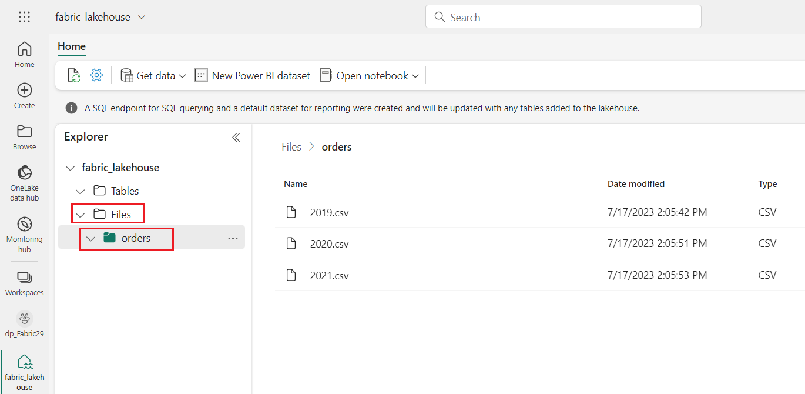

## 任务 3：创建 notebook

要在 Apache Spark
中处理数据，您可以创建一个*笔记本*。笔记本提供了一个交互式环境，您可以在其中编写和运行代码（以多种语言），并添加注释以记录代码。

1.  在 **Home** 上，查看数据湖中 **orders** 文件夹的内容时，在 **Open
    notebook** 菜单中，选择 **New notebook**。

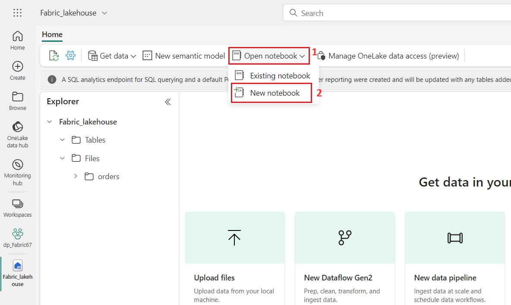

2.  几秒钟后，将打开一个包含单个单元格的新笔记本
    。笔记本由一个或多个单元格组成，这些单元格可以包含*代码*或
    *Markdown*（格式化文本）。

3.  选择第一个单元格（当前为*代码*单元格），然后在其右上角的动态工具栏中，使用
    **M↓** 按钮 **convert the cell to a markdown cell**。

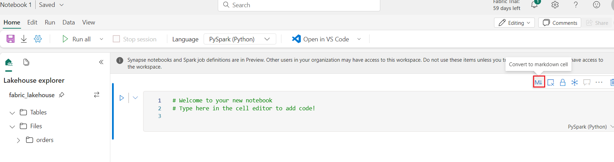

4.  当单元格更改为 Markdown 单元格时，将呈现它包含的文本。

5.  **🖉** 使用 （Edit）
    按钮将单元格切换到编辑模式，替换所有文本，然后按如下方式修改
    markdown:

> CodeCopy
>
> \# Sales order data exploration
>
> Use the code in this notebook to explore sales order data.

6.  单击笔记本中单元格外部的任意位置可停止编辑它并查看呈现的 Markdown。

## 任务 4：将数据加载到 DataFrame 中

现在，您可以运行将数据加载到 *DataFrame* 中的代码。Spark
中的数据帧类似于 Python 中的 Pandas
数据帧，并提供一种通用结构来处理行和列中的数据。

**注意**：Spark 支持多种编码语言，包括 Scala、Java
等。在本练习中，我们将使用 *PySpark*，它是 Spark 优化的 Python
变体。PySpark 是 Spark 上最常用的语言之一，也是 Fabric
笔记本中的默认语言。

1.  在笔记本可见的情况下，展开 **Files** 列表并选择 **orders**
    文件夹，以便 CSV 文件列在笔记本编辑器旁边。

2.  现在，您的鼠标2019.csv文件。单击水平省略号 **（...）**
    除了2019.csv。导航并单击 **Load data**，然后选择
    **Spark**。包含以下代码的新代码单元格将添加到笔记本中：

> CodeCopy
>
> df =
> spark.read.format("csv").option("header","true").load("Files/orders/2019.csv")
>
> \# df now is a Spark DataFrame containing CSV data from
> "Files/orders/2019.csv".
>
> display(df)

**提示**： 您可以使用左侧的 « 图标来隐藏左侧的 Lakehouse Explorer 窗格
。行为

所以将帮助您专注于笔记本。

3.  使用单元格左侧的 **▷ Run cell** 按钮来运行它。

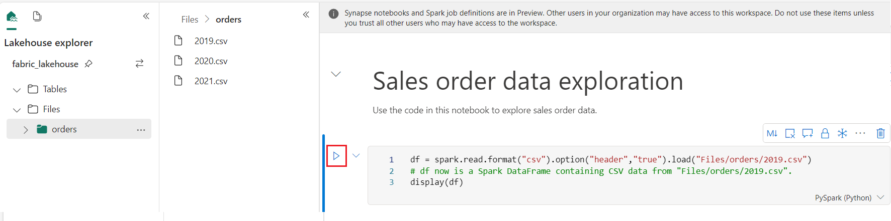

**注意**：由于这是您第一次运行任何 Spark 代码，因此必须启动 Spark
会话。这意味着会话中的第一次运行可能需要一分钟左右才能完成。后续运行会更快。

4.  cell 命令完成后，查看单元格下方的输出，该输出应类似于以下内容：

5.  输出显示 2019.csv
    文件中数据的行和列。但是，请注意，列标题看起来不正确。用于将数据加载到
    DataFrame 的默认代码假定 CSV
    文件在第一行中包含列名，但在这种情况下，CSV
    文件仅包含数据，而不包含标题信息。

6.  修改代码以将 **header** 选项设置为 **false**。将单元格中的所有代码
    替换为以下代码，然后单击 **▷ Run cell** 按钮并查看输出

> CodeCopy
>
> df =
> spark.read.format("csv").option("header","false").load("Files/orders/2019.csv")
>
> \# df now is a Spark DataFrame containing CSV data from
> "Files/orders/2019.csv".
>
> display(df)

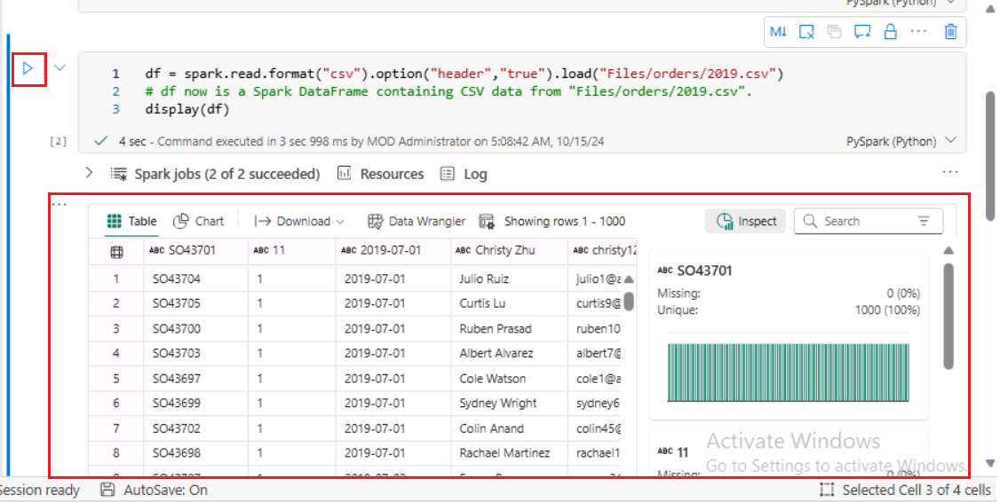

7.  现在，dataframe
    正确地包含第一行作为数据值，但列名是自动生成的，不是很有帮助。要理解数据，您需要为文件中的数据值显式定义正确的架构和数据类型。

8.  将 **cell** 中的所有代码 替换为以下代码，然后单击 **▷ Run cell**
    按钮并查看输出

> CodeCopy
>
> from pyspark.sql.types import \*
>
> orderSchema = StructType(\[
>
> StructField("SalesOrderNumber", StringType()),
>
> StructField("SalesOrderLineNumber", IntegerType()),
>
> StructField("OrderDate", DateType()),
>
> StructField("CustomerName", StringType()),
>
> StructField("Email", StringType()),
>
> StructField("Item", StringType()),
>
> StructField("Quantity", IntegerType()),
>
> StructField("UnitPrice", FloatType()),
>
> StructField("Tax", FloatType())
>
> \])
>
> df =
> spark.read.format("csv").schema(orderSchema).load("Files/orders/2019.csv")
>
> display(df)

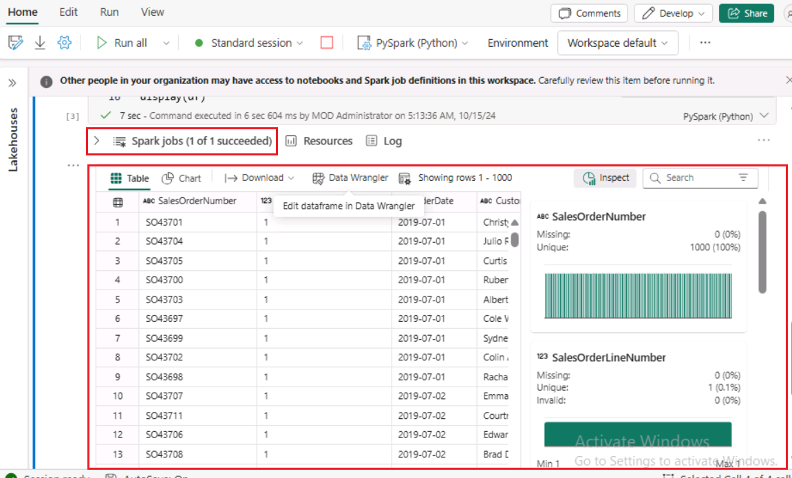

9.  现在 DataFrame 包含正确的列名（除了 **Index，**它是所有 DataFrame
    中的内置列，基于每行的序号位置）。列的数据类型是使用 Spark SQL
    库中定义的一组标准类型指定的，这些类型是在单元格的开头导入的。

10. 通过查看数据帧确认您的更改已应用于数据。

11. 使用 单元格输出下方的 **+ Code**
    图标将新的代码单元格添加到笔记本中，然后在其中输入以下代码。点击 **▷
    Run cell** 按钮并查看输出

> CodeCopy
>
> display(df)
>
> 

12. 数据帧仅包含 **2019.csv** 文件中的数据。修改代码，以便文件路径使用
    \* 通配符从 orders 文件夹中的所有文件中读取销售订单数据

13. 使用 单元格输出下方的 **+ Code**
    图标将新的代码单元格添加到笔记本中，然后在其中输入以下代码。

CodeCopy

> from pyspark.sql.types import \*
>
> orderSchema = StructType(\[
>
>     StructField("SalesOrderNumber", StringType()),
>
>     StructField("SalesOrderLineNumber", IntegerType()),
>
>     StructField("OrderDate", DateType()),
>
>     StructField("CustomerName", StringType()),
>
>     StructField("Email", StringType()),
>
>     StructField("Item", StringType()),
>
>     StructField("Quantity", IntegerType()),
>
>     StructField("UnitPrice", FloatType()),
>
>     StructField("Tax", FloatType())
>
>     \])
>
> df =
> spark.read.format("csv").schema(orderSchema).load("Files/orders/\*.csv")
>
> display(df)

14. 运行修改后的代码单元并查看输出，现在应包括 2019 年、2020 年和 2021
    年的销售额。

**注意**：仅显示行的子集，因此您可能无法看到所有年份的示例。

# 练习 2：浏览 dataframe 中的数据

dataframe
对象包含各种函数，您可以使用这些函数来筛选、分组和以其他方式作它所包含的数据。

## 任务 1：筛选 dataframe

1.  使用 单元格输出下方的 **+ Code**
    图标将新的代码单元格添加到笔记本中，然后在其中输入以下代码。

**CodeCopy**

> customers = df\['CustomerName', 'Email'\]
>
> print(customers.count())
>
> print(customers.distinct().count())
>
> display(customers.distinct())
>
> 

2.  **Run** 新的代码单元，并查看结果。请注意以下详细信息:

    - 当您对 DataFrame 执行作时，结果是一个新的
      DataFrame（在本例中，通过从 **df** DataFrame
      中选择特定的列子集来创建新的 **customers** DataFrame）

    &nbsp;

    - Dataframes 提供 **count** 和 **distinct**
      等函数，可用于汇总和筛选它们包含的数据。

    &nbsp;

    - dataframe\['Field1'， 'Field2'， ...\]
      语法是定义列子集的简写方法。您还可以使用 **select**
      方法，因此上面代码的第一行可以写成 customers =
      df.select（“CustomerName”， “Email”）

> 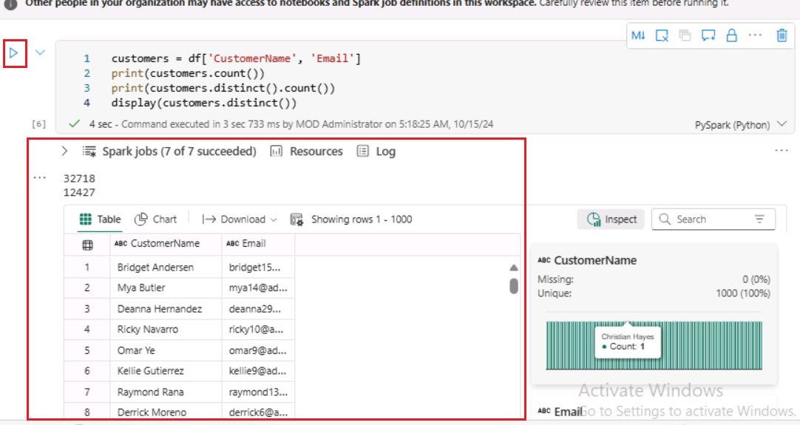

3.  修改代码，将 **cell** 中的所有代码替换为 以下代码，然后单击 **▷ Run
    cell** 按钮，如下所示：

> CodeCopy
>
> customers = df.select("CustomerName",
> "Email").where(df\['Item'\]=='Road-250 Red, 52')
>
> print(customers.count())
>
> print(customers.distinct().count())
>
> display(customers.distinct())

4.  **Run运行**修改后的代码以查看已购买 ***Road-250 Red， 52* product**
    的客户。请注意，您可以将多个函数 **“chain”**
    在一起，以便一个函数的输出成为下一个函数的输入 -
    在这种情况下，**select** 方法创建的数据帧是用于应用筛选条件的
    **where** 方法的源数据帧。

> 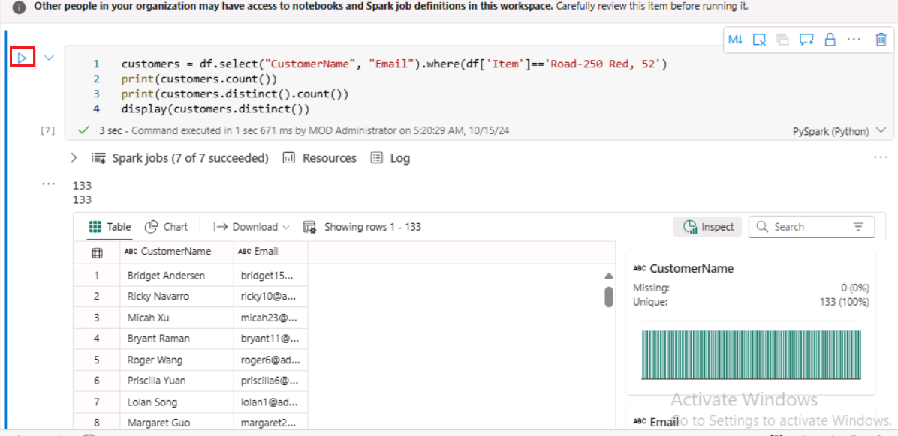

## 任务 2：在 dataframe 中聚合和分组数据

1.  单击 **+ Code** **+** 并复制并粘贴以下代码，然后单击 **Run cell**
    按钮。

CodeCopy

> productSales = df.select("Item", "Quantity").groupBy("Item").sum()
>
> display(productSales)
>
> 

2.  请注意，结果显示按产品分组的订单数量总和。**groupBy** 方法按 Item
    对行进行分组，随后的 **sum**
    聚合函数将应用于所有剩余的数字列（在本例中为 *Quantity*）

3.  单击 **+ Code** 并复制并粘贴以下代码，然后单击 **Run cell** 按钮。

> **CodeCopy**
>
> from pyspark.sql.functions import \*
>
> yearlySales =
> df.select(year("OrderDate").alias("Year")).groupBy("Year").count().orderBy("Year")
>
> display(yearlySales)

4.  请注意，结果显示每年的销售订单数量。请注意，**select** 方法包括一个
    SQL **year** 函数，用于提取 *OrderDate*
    字段的年份部分（这就是代码包含一个 **import** 语句以从 Spark SQL
    库导入函数的原因）。然后，它使用** alias**
    方法为提取的年份值分配列名称。然后，按派生的 Year 列对数据进行分组
    ，并计算每个组中的行数，最后使用 **orderBy**
    方法对生成的数据帧进行排序。

# 练习 3：使用 Spark 转换数据文件

数据工程师的一项常见任务是以特定格式或结构摄取数据，并对其进行转换以进行进一步的下游处理或分析。

## 任务 1：使用 DataFrame 方法和函数转换数据

1.  单击 + Code 并复制并粘贴以下代码

**CodeCopy**

> from pyspark.sql.functions import \*
>
> \## Create Year and Month columns
>
> transformed_df = df.withColumn("Year",
> year(col("OrderDate"))).withColumn("Month", month(col("OrderDate")))
>
> \# Create the new FirstName and LastName fields
>
> transformed_df = transformed_df.withColumn("FirstName",
> split(col("CustomerName"), " ").getItem(0)).withColumn("LastName",
> split(col("CustomerName"), " ").getItem(1))
>
> \# Filter and reorder columns
>
> transformed_df = transformed_df\["SalesOrderNumber",
> "SalesOrderLineNumber", "OrderDate", "Year", "Month", "FirstName",
> "LastName", "Email", "Item", "Quantity", "UnitPrice", "Tax"\]
>
> \# Display the first five orders
>
> display(transformed_df.limit(5))

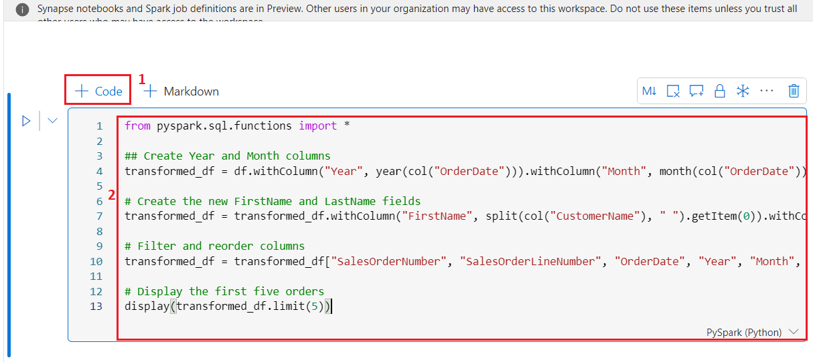

1.  **Run** 代码，通过以下转换从原始订单数据创建新的 DataFrame:

    - 根据 **OrderDate** 列添加 **Year** 和 **Month** 列。

    - 根据 **CustomerName** 列添加 **FirstName** 和 **LastName** 列。

    - 筛选并重新排序列，删除 **CustomerName** 列。

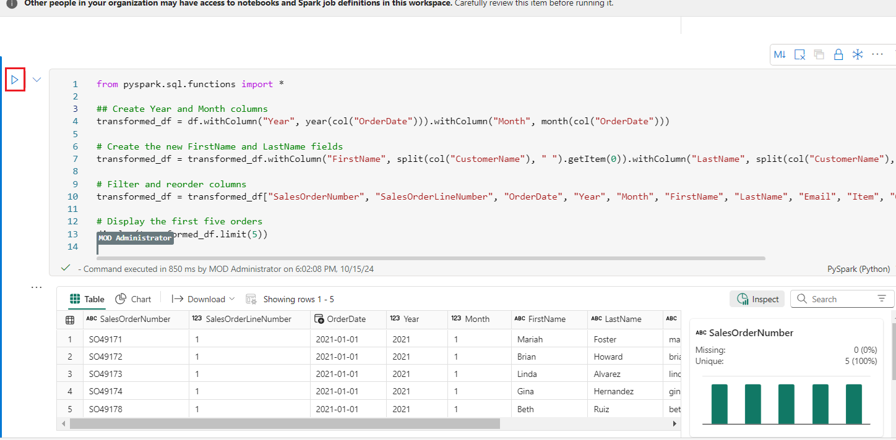

2.  查看输出并验证是否已对数据进行转换。

您可以使用 Spark SQL
库的全部功能，通过筛选行、派生、删除、重命名列以及应用任何其他所需的数据修改来转换数据。

**提示**：请参阅 [*Spark DataFrame
documentation*](https://spark.apache.org/docs/latest/api/python/reference/pyspark.sql/dataframe.html)，了解有关
Dataframe 对象方法的更多信息。

## 任务 2：保存转换后的数据

1.  使用以下代码 **Add a new cell**，以 Parquet
    格式保存转换后的数据帧（如果数据已存在，则覆盖数据）。**Run**
    单元格并等待数据已保存的消息。

> CodeCopy
>
> transformed_df.write.mode("overwrite").parquet('Files/transformed_data/orders')
>
> print ("Transformed data saved!")
>
> **注意**：通常，*Parquet*
> 格式是用于进一步分析或引入分析存储的数据文件的首选格式。Parquet
> 是一种非常有效的格式，大多数大型数据分析系统都支持它。事实上，有时您的数据转换要求可能只是将数据从其他格式（例如
> CSV）转换为 Parquet！

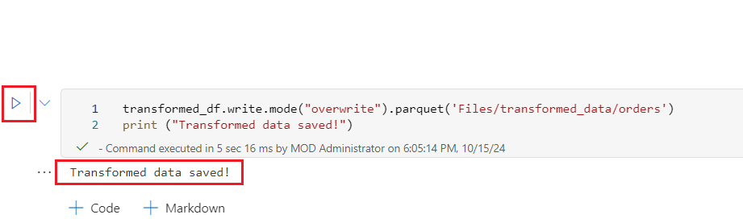

2.  然后，在左侧的 **Lakehouse explorer** 窗格中，在 **Files** 节点的
    ... 菜单中，选择**Refresh**。

> 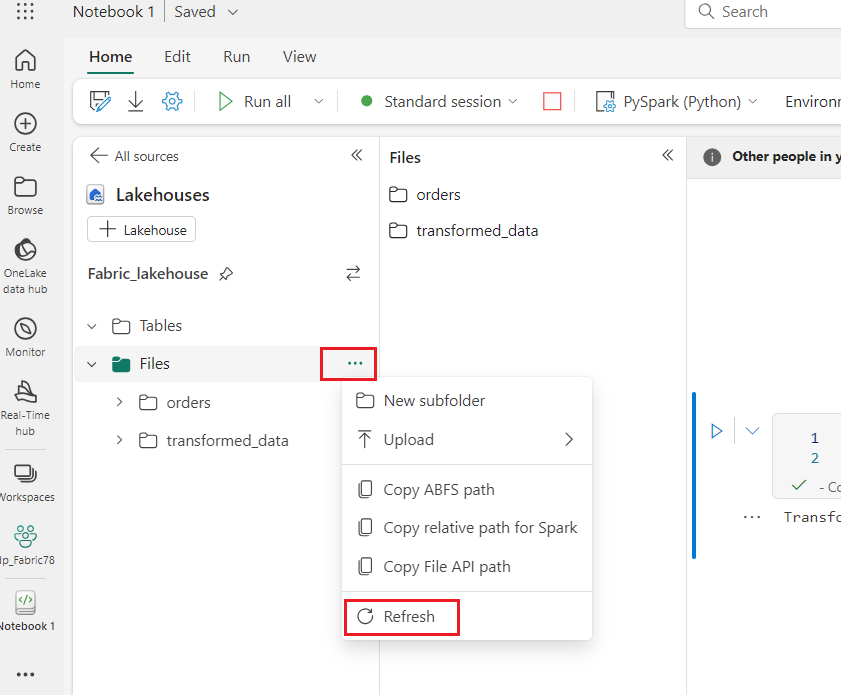

3.  单击 **transformed_data** 文件夹以验证它是否包含名为 **orders**
    的新文件夹，而该文件夹又包含一个或多个 **Parquet files**。

4.  单击 **+ Code** following code**，**从 **transformed_data -\>
    orders** 文件夹中的 parquet 文件加载新的数据帧 :

> **CodeCopy**
>
> orders_df =
> spark.read.format("parquet").load("Files/transformed_data/orders")
>
> display(orders_df)
>
> 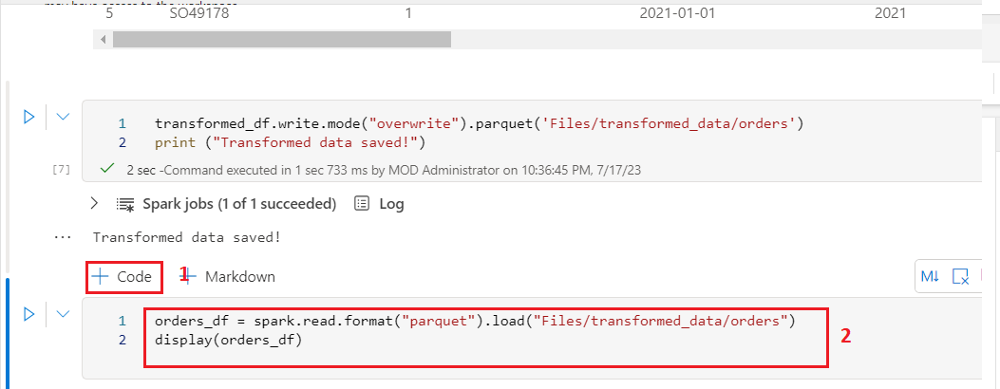

5.  **Run** 单元格并验证结果是否显示已从 parquet 文件加载的订单数据。

> 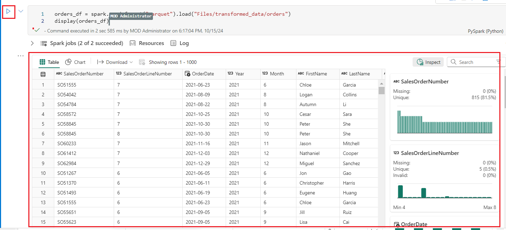

## 任务 3：将数据保存在分区文件中

1.  添加一个新单元格，单击使用以下代码的 **+ Code** ;这将保存
    DataFrame，并按 **Year** 和**Month** 对数据进行分区。 **Run**
    单元格并等待数据已保存的消息

> CodeCopy
>
> orders_df.write.partitionBy("Year","Month").mode("overwrite").parquet("Files/partitioned_data")
>
> print ("Transformed data saved!")
>
> 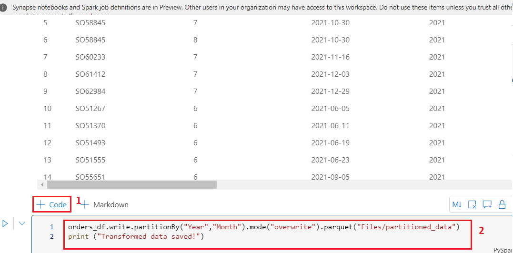
>
> 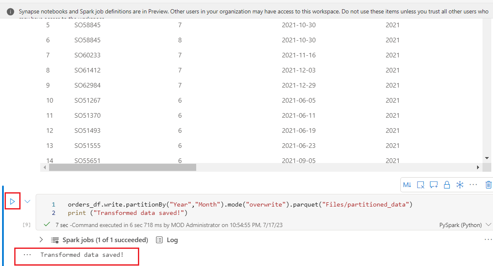

2.  然后，在左侧的 **Lakehouse** 资源管理器窗格中，在 **Files** 节点的
    ... 菜单中，选择刷新**Refresh**。

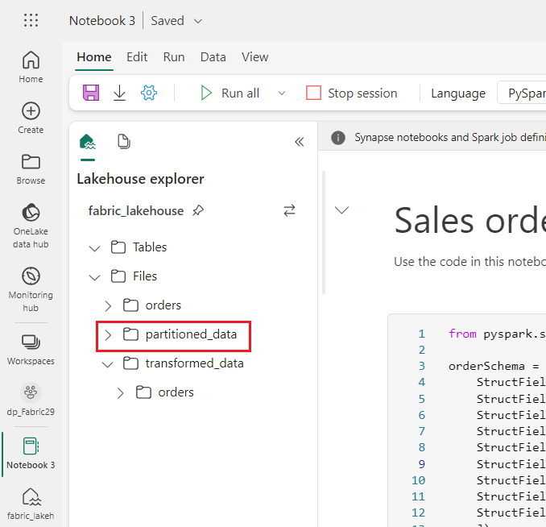

3.  展开 **partitioned_orders** 文件夹以验证它是否包含名为 **Year=xxxx**
    的文件夹层次结构，每个文件夹都包含名为 **Month=xxxx**
    的文件夹。每个月份文件夹都包含一个 parquet
    文件，其中包含该月的订单。

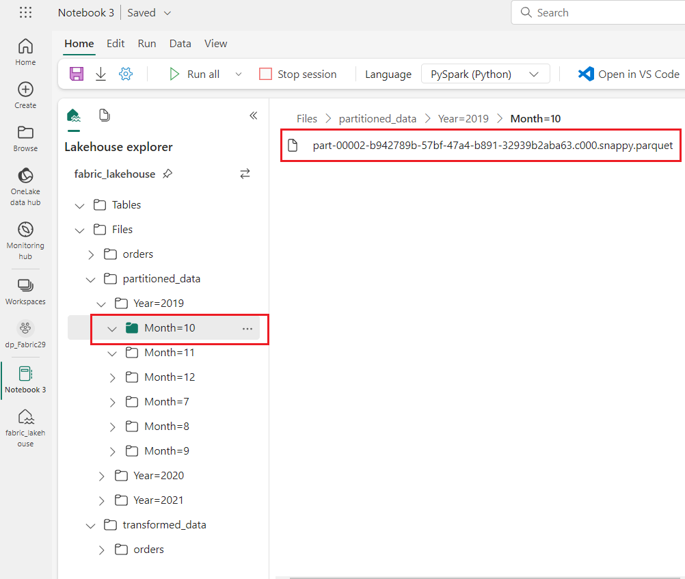

> 在处理大量数据时，对数据文件进行分区是优化性能的常用方法。此技术可以显著提高性能，并使其更易于筛选数据。

4.  添加新单元格，单击包含以下代码的 **+ Code，**从 **orders.parquet**
    文件加载新数据帧：

> CodeCopy
>
> orders_2021_df =
> spark.read.format("parquet").load("Files/partitioned_data/Year=2021/Month=\*")
>
> display(orders_2021_df)

5.  **Run** 单元格并验证结果是否显示 2021
    年销售额的订单数据。请注意，在路径中指定的分区列（**Year** 和
    **Month**）不包含在数据帧中。

# **练习 3：使用** tables **和 SQL**

正如您所看到的，DataFrame
对象的本机方法使您能够非常有效地查询和分析文件中的数据。但是，许多数据分析师更习惯于使用他们可以使用
SQL 语法查询的表。Spark
提供了一个*metastore *，您可以在其中定义关系表。提供 DataFrame 对象的
Spark SQL 库还支持使用 SQL 语句来查询元存储中的表。通过使用 Spark
的这些功能，您可以将数据湖的灵活性与关系数据仓库的结构化数据架构和基于
SQL 的查询相结合，因此称为“数据湖仓一体”。

## 任务 1：创建托管 table

Spark
元存储中的表是对数据湖中文件的关系抽象。表可以是*托管*的（在这种情况下，文件由元存储管理）或*外部*的（在这种情况下，表引用数据湖中您独立于元存储管理的文件位置）。

1.  添加新代码，单击笔记本的 **+ Code** cell
    并输入以下代码，该代码将销售订单数据的数据帧保存为名为
    **salesorders** 的表：

> CodeCopy
>
> \# Create a new table
>
> df.write.format("delta").saveAsTable("salesorders")
>
> \# Get the table description
>
> spark.sql("DESCRIBE EXTENDED salesorders").show(truncate=False)

**注意**：值得注意的是此示例的几点。首先，没有提供显式路径，因此表的文件将由
metastore 管理。其次，该表以 **delta**
格式保存。您可以基于多种文件格式（包括 CSV、Parquet、Avro 等）创建表，但
*delta lake* 是一种 Spark
技术，可向表添加关系数据库功能;包括对事务、行版本控制和其他有用功能的支持。对于
Fabric 中的数据湖仓一体，最好以 delta 格式创建表。

2.  **Run** 代码单元并查看输出，其中描述了新表的定义。

3.  在  **Lakehouse explorer** 窗格中，在 **Tables** 文件夹的 ...
    菜单中，选择 **Refresh**。

4.  然后，展开 **Tables** 节点并验证是否已创建 **salesorders** 表。

> 

5.  将鼠标悬停在 **salesorders** 表旁边，然后单击水平省略号
    （...）。导航并单击 **Load data**，然后选择 **Spark**。

6.  单击 **▷ Run cell** 按钮，该按钮使用 Spark SQL 库在 PySpark
    代码中嵌入针对 **salesorder** 表的 SQL
    查询，并将查询结果加载到数据帧中。

> CodeCopy
>
> df = spark.sql("SELECT \* FROM \[your_lakehouse\].salesorders LIMIT
> 1000")
>
> display(df)

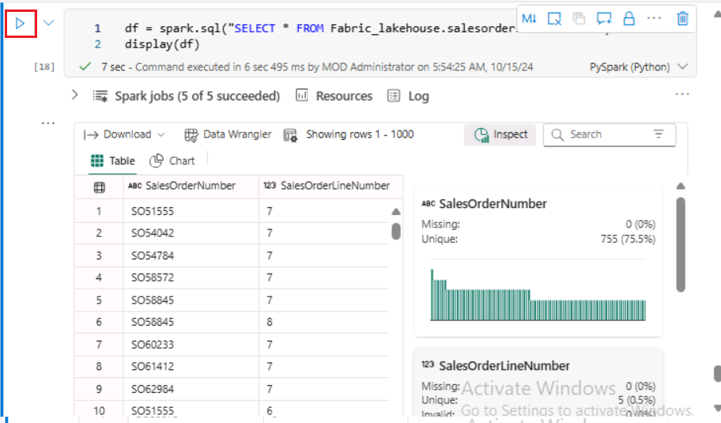

## 任务 2：创建 external table

您还可以创建*外部* tables，其中架构元数据在 Lakehouse
的元存储中定义，但数据文件存储在外部位置。

1.  在第一个代码单元格返回的结果下，使用 **+ Code**
    按钮添加新的代码单元格（如果尚不存在）。然后在新单元格中输入以下代码。

CodeCopy

> df.write.format("delta").saveAsTable("external_salesorder",
> path="\<abfs_path\>/external_salesorder")

2.  在 **Lakehouse explorer** 窗格中的 **...** 菜单中 ，选择** Files**
    中的 Copy ABFS path。

> ABFS 路径是指向 **Lakehouse** 的 OneLake 存储中 **Files**
> 文件夹的完全限定路径 - 类似于：

abfss://dp_Fabric29@onelake.dfs.fabric.microsoft.com/Fabric_lakehouse.Lakehouse/Files/external_salesorder

3.  现在，移动到代码单元格中，将 **\<abfs_path\>** 替换为
    您复制到记事本的 path，以便代码将 DataFrame
    保存为外部表，其中包含数据文件，位于 **Files** 文件夹**path** 名为
    **external_salesorder** 的文件夹中。完整路径应类似于

abfss://dp_Fabric29@onelake.dfs.fabric.microsoft.com/Fabric_lakehouse.Lakehouse/Files/external_salesorder

4.  使用单元格左侧的 **▷ （*Run cell*）** 按钮运行它。

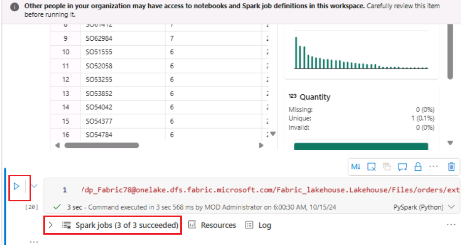

5.  在 **Lakehouse explorer** 窗格中，在 **Tables** 文件夹的 ...
    菜单中，选择 **Refresh**。

6.  然后展开 **Tables** 节点并验证是否已创建 **external_salesorder**
    表。

7.  在 **Lakehouse** 资源管理器窗格中，在 **Files** 文件夹的 ...
    菜单中，选择 **Refres**。

8.  然后展开 **Files** 节点并验证 是否已为表的数据文件创建
    **external_salesorder** 文件夹。

## 任务 3：比较托管表和 external tables

让我们探讨一下托管表和外部表之间的区别。

1.  在代码单元格返回的结果下，使用 **+ Code**
    按钮添加新的代码单元格。将下面的代码复制到 Code
    单元格中，然后使用单元格左侧的 **▷ （*Run cell*）** 按钮运行它。

> SqlCopy
>
> %%sql
>
> DESCRIBE FORMATTED salesorders;

2.  在结果中，查看 表的 **Location** 属性，该属性应该是以
    **/Tables/salesorders** 结尾的湖仓一体的 **OneLake** 存储的路径
    （您可能需要扩大 **Data type** 列才能查看完整路径）。

3.  修改 **DESCRIBE** 命令以显示 **external_saleorder**
    表的详细信息，如下所示。

4.  在代码单元格返回的结果下，使用 **+ Code**
    按钮添加新的代码单元格。复制下面的代码，并使用单元格左侧的 **▷
    （*Run cell*）** 按钮运行它。

> SqlCopy
>
> %%sql
>
> DESCRIBE FORMATTED external_salesorder;

5.  在结果中，查看 表的 **Location** 属性，该属性应该是以
    **/Files/external_saleorder** 结尾的湖仓一体的 OneLake 存储路径
    （您可能需要扩大 **Data type** 列才能查看完整路径）。

## 任务 4：在单元格中运行 SQL 代码

虽然能够将 SQL 语句嵌入到包含 PySpark
代码的单元格中很有用，但数据分析师通常只想直接在 SQL 中工作。

1.  单击 Notebook 的 **+ Code** 单元格，然后在其中输入以下代码。单击 **▷
    Run cell** 按钮并查看结果。请注意:

    - 单元格开头的 %%sql 行（称为*魔术*）表示应使用 Spark SQL
      语言运行时而不是 PySpark 来运行此单元格中的代码。

    - SQL 代码引用 您之前创建的 **salesorders** 表。

    - SQL 查询的输出将自动作为结果显示在单元格下

> SqlCopy
>
> %%sql
>
> SELECT YEAR(OrderDate) AS OrderYear,
>
> SUM((UnitPrice \* Quantity) + Tax) AS GrossRevenue
>
> FROM salesorders
>
> GROUP BY YEAR(OrderDate)
>
> ORDER BY OrderYear;

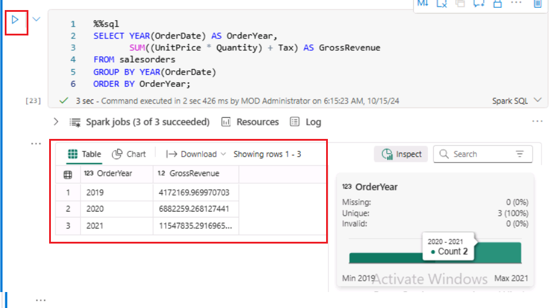

**注意**：有关 Spark SQL 和数据帧的更多信息，请参阅 [*Spark SQL
documentation*](https://spark.apache.org/docs/2.2.0/sql-programming-guide.html)。

# 练习 4：使用 Spark 可视化数据

众所周知，一张图片胜过千言万语，一张图表通常胜过一千行数据。虽然 Fabric
中的笔记本包括一个内置的图表视图，用于从数据帧或 Spark SQL
查询显示的数据，但它并不是为全面的图表而设计的。但是，您可以使用
**matplotlib** 和 **seaborn** 等 Python
图形库根据数据帧中的数据创建图表。

## 任务 1：以图表形式查看结果

1.  单击 Notebook 的 **+ Code** 单元格，然后在其中输入以下代码。单击 **▷
    Run cell** 按钮，并观察它从 您之前创建的 **salesorders**
    视图中返回数据。

> SqlCopy
>
> %%sql
>
> SELECT \* FROM salesorders

2.  在单元格下方的结果部分中，将 **View** 选项从 **Table** 更改为
    **Chart**。

3.  使用图表右上角的 **View options**
    按钮显示图表的选项窗格。然后按如下方式设置选项并选择 **Apply** :

    - **Chart type**: Bar chart

    - **Key**: Item

    - **Values**: Quantity

    - **Series Group**: *leave blank*

    - **Aggregation**: Sum

    - **Stacked**: *Unselected*

4.  验证图表是否与此类似

## 任务 2：matplotlib 入门

1.  单击**+ Code** 并复制并粘贴以下代码。 **Run**
    代码并观察它是否返回包含年收入的 Spark 数据帧。

> CodeCopy
>
> sqlQuery = "SELECT CAST(YEAR(OrderDate) AS CHAR(4)) AS OrderYear, \\
>
> SUM((UnitPrice \* Quantity) + Tax) AS GrossRevenue \\
>
> FROM salesorders \\
>
> GROUP BY CAST(YEAR(OrderDate) AS CHAR(4)) \\
>
> ORDER BY OrderYear"
>
> df_spark = spark.sql(sqlQuery)
>
> df_spark.show()

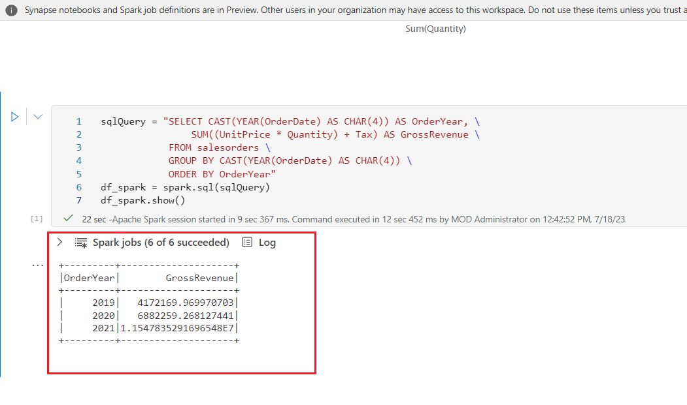

2.  要将数据可视化为图表，我们将首先使用 **matplotlib** Python
    库。该库是许多其他库所基于的核心绘图库，并在创建图表时提供了极大的灵活性。

3.  单击 **+ Code**并复制并粘贴以下代码。

**CodeCopy**

> from matplotlib import pyplot as plt
>
> \# matplotlib requires a Pandas dataframe, not a Spark one
>
> df_sales = df_spark.toPandas()
>
> \# Create a bar plot of revenue by year
>
> plt.bar(x=df_sales\['OrderYear'\], height=df_sales\['GrossRevenue'\])
>
> \# Display the plot
>
> plt.show()

5.  单击 **Run cell**
    按钮并查看结果，其中包括一个柱形图，其中包含每年的总收入。请注意用于生成此图表的代码的以下功能:

    - **matplotlib** 库需要 *Pandas* 数据帧，因此您需要将 Spark SQL
      查询返回的 Spark 数据帧转换为此格式。

    - **matplotlib** 库的核心是 **pyplot**
      对象。这是大多数绘图功能的基础。

    - 默认设置会生成可用的图表，但有相当大的空间可以对其进行自定义

6.  修改代码以绘制图表，如下所示，将 **Cell** 中的所有代码替换为
    以下代码，然后单击 **▷ Run cell** 按钮并查看输出

> CodeCopy
>
> from matplotlib import pyplot as plt
>
> \# Clear the plot area
>
> plt.clf()
>
> \# Create a bar plot of revenue by year
>
> plt.bar(x=df_sales\['OrderYear'\], height=df_sales\['GrossRevenue'\],
> color='orange')
>
> \# Customize the chart
>
> plt.title('Revenue by Year')
>
> plt.xlabel('Year')
>
> plt.ylabel('Revenue')
>
> plt.grid(color='#95a5a6', linestyle='--', linewidth=2, axis='y',
> alpha=0.7)
>
> plt.xticks(rotation=45)
>
> \# Show the figure
>
> plt.show()

7.  该图表现在包含更多信息。从技术上讲，绘图包含在 **Figure**
    中。在前面的示例中，该图是为您隐式创建的;但您可以显式创建它。

8.  修改代码以绘制图表，如下所示，将 **cell** 中的所有代码替换为
    以下代码。

> CodeCopy
>
> from matplotlib import pyplot as plt
>
> \# Clear the plot area
>
> plt.clf()
>
> \# Create a Figure
>
> fig = plt.figure(figsize=(8,3))
>
> \# Create a bar plot of revenue by year
>
> plt.bar(x=df_sales\['OrderYear'\], height=df_sales\['GrossRevenue'\],
> color='orange')
>
> \# Customize the chart
>
> plt.title('Revenue by Year')
>
> plt.xlabel('Year')
>
> plt.ylabel('Revenue')
>
> plt.grid(color='#95a5a6', linestyle='--', linewidth=2, axis='y',
> alpha=0.7)
>
> plt.xticks(rotation=45)
>
> \# Show the figure
>
> plt.show()

9.  **Re-run** 代码单元并查看结果。该图确定图的形状和大小。

> 一个图窗可以包含多个子图，每个子图都有自己的*axis*。

10. 修改代码以绘制图表，如下所示。 **Re-run**
    代码单元并查看结果。该图窗包含代码中指定的子图。

> CodeCopy
>
> from matplotlib import pyplot as plt
>
> \# Clear the plot area
>
> plt.clf()
>
> \# Create a figure for 2 subplots (1 row, 2 columns)
>
> fig, ax = plt.subplots(1, 2, figsize = (10,4))
>
> \# Create a bar plot of revenue by year on the first axis
>
> ax\[0\].bar(x=df_sales\['OrderYear'\],
> height=df_sales\['GrossRevenue'\], color='orange')
>
> ax\[0\].set_title('Revenue by Year')
>
> \# Create a pie chart of yearly order counts on the second axis
>
> yearly_counts = df_sales\['OrderYear'\].value_counts()
>
> ax\[1\].pie(yearly_counts)
>
> ax\[1\].set_title('Orders per Year')
>
> ax\[1\].legend(yearly_counts.keys().tolist())
>
> \# Add a title to the Figure
>
> fig.suptitle('Sales Data')
>
> \# Show the figure
>
> plt.show()

**注意**：要了解有关使用 matplotlib 绘图的更多信息，请参阅 [*matplotlib
documentation*](https://matplotlib.org/).

## 任务 3：使用 seaborn 库

虽然 **matplotlib**
使您能够创建多种类型的复杂图表，但它可能需要一些复杂的代码才能获得最佳结果。出于这个原因，多年来，在
matplotlib
的基础上构建了许多新的库，以抽象其复杂性并增强其功能。**seaborn**
就是这样一个库。

1.  单击 **+ Code** 并复制并粘贴以下代码。

CodeCopy

> import seaborn as sns
>
> \# Clear the plot area
>
> plt.clf()
>
> \# Create a bar chart
>
> ax = sns.barplot(x="OrderYear", y="GrossRevenue", data=df_sales)
>
> plt.show()

2.  **Run** 代码并观察它是否使用 seaborn 库显示条形图。

3.  **Modify** 代码如下。 **Run** 修改后的代码，请注意，seaborn
    使您能够为绘图设置一致的颜色主题。

> CodeCopy
>
> import seaborn as sns
>
> \# Clear the plot area
>
> plt.clf()
>
> \# Set the visual theme for seaborn
>
> sns.set_theme(style="whitegrid")
>
> \# Create a bar chart
>
> ax = sns.barplot(x="OrderYear", y="GrossRevenue", data=df_sales)
>
> plt.show()
>
> 

4.  再次 **Modify**代码，如下所示。 **Run**
    修改后的代码以折线图的形式查看年收入。

> CodeCopy
>
> import seaborn as sns
>
> \# Clear the plot area
>
> plt.clf()
>
> \# Create a bar chart
>
> ax = sns.lineplot(x="OrderYear", y="GrossRevenue", data=df_sales)
>
> plt.show()

**注**： 要了解有关使用 seaborn 进行打印的更多信息，请参见 [*seaborn
documentation*](https://seaborn.pydata.org/index.html)。

## 任务 4：使用增量 tables 流式传输数据

Delta Lake 支持流式处理数据。Delta 表可以是 使用 Spark Structured
Streaming API
创建的数据流的接收器或源。在此示例中，你将使用增量表作为模拟物联网
（IoT） 场景中某些流数据的接收器。

1.  单击 **+ Code** 并复制并粘贴以下代码，然后单击 **Run cell** 按钮。

CodeCopy

> from notebookutils import mssparkutils
>
> from pyspark.sql.types import \*
>
> from pyspark.sql.functions import \*
>
> \# Create a folder
>
> inputPath = 'Files/data/'
>
> mssparkutils.fs.mkdirs(inputPath)
>
> \# Create a stream that reads data from the folder, using a JSON
> schema
>
> jsonSchema = StructType(\[
>
> StructField("device", StringType(), False),
>
> StructField("status", StringType(), False)
>
> \])
>
> iotstream =
> spark.readStream.schema(jsonSchema).option("maxFilesPerTrigger",
> 1).json(inputPath)
>
> \# Write some event data to the folder
>
> device_data = '''{"device":"Dev1","status":"ok"}
>
> {"device":"Dev1","status":"ok"}
>
> {"device":"Dev1","status":"ok"}
>
> {"device":"Dev2","status":"error"}
>
> {"device":"Dev1","status":"ok"}
>
> {"device":"Dev1","status":"error"}
>
> {"device":"Dev2","status":"ok"}
>
> {"device":"Dev2","status":"error"}
>
> {"device":"Dev1","status":"ok"}'''
>
> mssparkutils.fs.put(inputPath + "data.txt", device_data, True)
>
> print("Source stream created...")

2.  确保消息 ***Source stream created...***
    被打印出来。您刚刚运行的代码基于一个文件夹创建了一个流数据源，该文件夹已保存了一些数据，表示来自假设
    IoT 设备的读数。

3.  单击 **+ Code** 并复制并粘贴以下代码，然后单击运行 **Run cell**
    按钮。

CodeCopy

> \# Write the stream to a delta table
>
> delta_stream_table_path = 'Tables/iotdevicedata'
>
> checkpointpath = 'Files/delta/checkpoint'
>
> deltastream =
> iotstream.writeStream.format("delta").option("checkpointLocation",
> checkpointpath).start(delta_stream_table_path)
>
> print("Streaming to delta sink...")

4.  此代码将 delta 格式的流式处理设备数据写入名为 **iotdevicedata**
    的文件夹。由于文件夹位置的路径位于 **Tables**
    文件夹中，因此将自动为其创建一个表。单击表格旁边的水平省略号，然后单击
    **Refresh**。

5.  单击 **+ Code** 并复制并粘贴以下代码，然后单击 **Run cell** 按钮。

> SqlCopy
>
> %%sql
>
> SELECT \* FROM IotDeviceData;

6.  此代码查询 **IotDeviceData** 表，其中包含来自流式处理源的设备数据。

7.  单击 **+ Code** 并复制并粘贴以下代码，然后单击 **Run cell** 按钮。

> CodeCopy
>
> \# Add more data to the source stream
>
> more_data = '''{"device":"Dev1","status":"ok"}
>
> {"device":"Dev1","status":"ok"}
>
> {"device":"Dev1","status":"ok"}
>
> {"device":"Dev1","status":"ok"}
>
> {"device":"Dev1","status":"error"}
>
> {"device":"Dev2","status":"error"}
>
> {"device":"Dev1","status":"ok"}'''
>
> mssparkutils.fs.put(inputPath + "more-data.txt", more_data, True)

8.  此代码将更多假设的设备数据写入流式处理源。

9.  单击 **+ Code** 并复制并粘贴以下代码，然后单击 **Run Cell** 按钮。

> SqlCopy
>
> %%sql
>
> SELECT \* FROM IotDeviceData;
>
> 

10. 此代码再次查询 **IotDeviceData**
    表，该表现在应包含已添加到流式处理源的其他数据。

11. 单击 **+ Code** 并复制并粘贴以下代码，然后单击 **Run cell** 按钮。

> CodeCopy
>
> deltastream.stop()

12. 此代码将停止流。

## 任务 5：保存 notebook 并结束 Spark 会话

现在，您已经完成了对数据的处理，您可以使用有意义的名称保存笔记本并结束
Spark 会话。

1.  在笔记本菜单栏中，使用 ⚙️ **Settings** 图标查看笔记本设置。

2.  将笔记本的 **Name** 设置为 ++**Explore Sales
    Orders**++，然后关闭设置窗格。

3.  在笔记本菜单上，选择 **Stop session** 以结束 Spark 会话。

# 练习 5：在 Microsoft Fabric 中创建数据流（第 2 代）

在 Microsoft Fabric 中，数据流 （Gen2） 连接到各种数据源，并在 Power
Query Online 中执行转换。然后，可以在 Data Pipelines
中使用它们将数据引入 Lakehouse 或其他分析存储，或为 Power BI
报表定义数据集。

本练习旨在介绍 Dataflows （Gen2）
的不同元素，而不是创建企业中可能存在的复杂解决方案

## 任务 1：创建 Dataflow （Gen2） 以摄取数据

现在，您有一个
Lakehouse，您需要将一些数据提取到其中。实现此目的的一种方法是定义封装*提取、转换和加载*
（ETL） 流程的数据流。

1.  现在，单击 左侧导航窗格中的 **Fabric_lakehouse**。

2.  在 **Fabric_lakehouse** 主页中，单击 **Get data** ，然后选择 **New
    Dataflow Gen2。** 此时将打开新数据流的 Power Query 编辑器。

3.  在 **Power Query** 窗格中的 **Home tab** 下，单击 **Import from a
    Text/CSV file**。

4.  在 **Connect to data source** 窗格的 **Connection settings**
    下，选择 **Link to file （preview）**单选按钮

- **Link to file**: *Selected*

- **File path or
  URL**: [https://raw.githubusercontent.com/MicrosoftLearning/dp-
  data/main/orders.csv](https://raw.githubusercontent.com/MicrosoftLearning/dp-%20%20data/main/orders.csv)

5.  在 **Connect to data source** 窗格的 **Connection credentials**
    下，输入以下详细信息，然后单击 **Next** 按钮。

    - **Connection**: Create new connection

    - **data gateway**: (none)

    - **Authentication kind**: Organizational account

6.  在 **Preview file data** 窗格中，单击 **Create** 以创建数据源。 

7.  **Power Query**
    编辑器显示数据源和一组用于设置数据格式的初始查询步骤。

8.  在工具栏功能区上，选择 **Add column** 选项卡。然后，选择 **Custom
    column。**

 

9.  将 新列名称 设置为 **MonthNo** ，将 数据类型 设置为 Whole
    Number，然后在 **Custom column formula** 下
    添加以下公式：**Date.Month(\[OrderDate\])** 。选择 **OK。**

10. 请注意添加自定义列的步骤是如何添加到查询中的。结果列将显示在数据窗格中。

**提示：**在右侧的 Query Settings 窗格中，请注意 **Applied Steps**
包括每个转换步骤。在底部，您还可以切换 **Diagram flow** 按钮以打开步骤的
Visual Diagram（可视化图表）。

可以向上或向下移动步骤，通过选择齿轮图标进行编辑，并且您可以选择每个步骤以在预览窗格中查看应用的转换。

任务 2：为 Dataflow 添加数据目标

1.  在 **Power Query** 工具栏功能区上，选择 **Home** 选项卡。然后，在
    Data destination 下拉菜单中，选择 **Lakehouse**（如果尚未选择）。

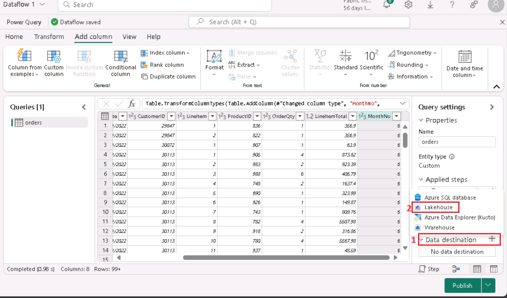

**注意：**如果此选项灰显，则您可能已经设置了数据目标。检查 Power Query
编辑器右侧 Query settings （查询设置）
窗格底部的数据目标。如果已设置目标，则可以使用 齿轮 更改它。

2.  单击 所选 **Lakehouse** 选项旁边的 **Settings** 图标。

3.  在 **Connect to data destination** 对话框中，选择 **Edit
    connection。**

4.  在 **Connect to data destination** 对话框中，选择 **Sign in**
    使用您的 Power BI 组织帐户登录 ,
    以设置数据流用于访问湖仓一体的身份。

5.  在 Connect to data destination 对话框中，选择 **Next**

6.  在 **Connect to data destination** 对话框中，选择 **New
    table**。单击 **Lakehouse folder** ，选择您的工作区 –
    **dp_FabricXX** 然后选择您的 Lakehouse，即 **Fabric_lakehouse。**
    然后将 Table name 指定为 **orders** 并选择 **Next** 按钮。

7.  在 **Choose destination settings** 对话框的 **Use automatic settings
    off** 和 **Update method** 下，选择 **Append** ，然后单击 **Save
    settings** 按钮。

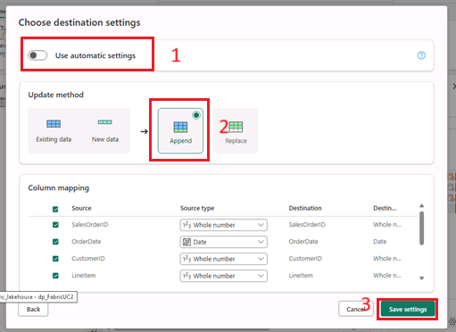

8.  **Lakehouse** 目标在 **Power Query** 编辑器的 **query** 中指示为
    **icon。**

9.  选择 **Publish ** 以发布数据流。然后等待 **Dataflow 1**
    数据流在您的工作区中创建。

10. 发布后，您可以右键单击工作区中的数据流，选择
    **Properties**，然后重命名数据流。

11. 在 **Dataflow1** 对话框中，输入 **Name** 作为 **Gen2_Dataflow**
    然后单击 **Save** 按钮。

## 任务 3：将数据流添加到管道

您可以将数据流作为活动包含在管道中。管道用于编排数据摄取和处理活动，使您能够在单个计划流程中将数据流与其他类型的作相结合。可以在几种不同的体验中创建管道，包括数据工厂体验。

1.  在 Synapse 数据工程主页的 **dp_FabricXX** 窗格下，选择 **+New -\>
    Data pipeline**

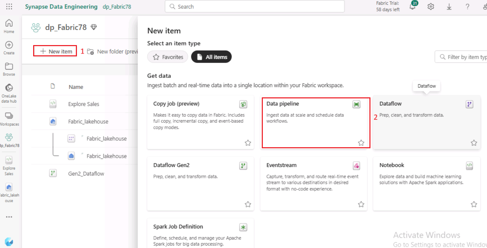

2.  在 **New pipeline** 对话框中，在 **Name** 字段中输入 **Load data**
    ，然后单击 **Create** 按钮以打开新管道。

3.  管道编辑器随即打开。

> **提示**： 如果 Copy Data 向导自动打开，请将其关闭！

4.  选择 **Pipeline activity，**然后向管道中添加 **Dataflow** 活动。

5.  选择新的 **Dataflow1** 活动后，在 **Settings** 选项卡的 **Dataflow**
    下拉列表中，选择 **Gen2_Dataflow** （您之前创建的数据流）

6.  在 **Home** 选项卡上，使用 **🖫 （*Save*）** 图标保存管道。

7.  使用 **▷ Run** 按钮运行管道，并等待其完成。这可能需要几分钟时间。

> 
>
> 

8.  在左边缘的菜单栏中，选择您的工作区，即 **dp_FabricXX**。

9.  在 **Fabric_lakehouse** 窗格中，选择 Lakehouse
    类型的**Gen2_FabricLakehouse**。

12. 在 **Explorer** 窗格中，选择 **...** 菜单，选择
    **Refresh**。然后展开 **Tables** 并选择 **orders** 表，该表已由
    **dataflow**。

**提示**： 使用 Power BI Desktop
*数据流连接器*直接连接到通过数据流完成的数据转换。

您还可以进行其他转换，发布为新数据集，并与专用数据集的目标受众一起分发。

## 任务 4：清理资源

在本练习中，您学习了如何使用 Spark 处理 Microsoft Fabric 中的数据。

如果您已完成对 Lakehouse 的探索，则可以删除为本练习创建的工作区。

1.  在左侧的栏中，选择工作区的图标以查看其包含的所有项目。

> 

2.  在 **...** 菜单中，选择 **Workspace settings**。

3.  选择 **General** 并单击 **Remove this workspace。**

4.  在 **Delete workspace?** 对话框中，单击 **Delete** 按钮。

> 
>
> 

**总结**

此 用例 将指导您完成在 Power BI 中使用 Microsoft Fabric
的过程。它涵盖各种任务，包括设置工作区、创建湖仓一体、上传和管理数据文件以及使用
Notebook 进行数据探索。参与者将学习如何使用
PySpark作和转换数据、创建可视化以及保存和分区数据以实现高效查询。

在此用例中，参与者将参与一系列任务，重点是在 Microsoft Fabric
中使用增量表。这些任务包括上传和探索数据、创建托管和外部增量表、比较它们的属性，该实验室介绍了用于管理结构化数据的
SQL 功能，并使用 matplotlib 和 seaborn 等 Python
库提供有关数据可视化的见解。这些练习旨在全面了解如何利用 Microsoft
Fabric 进行数据分析，以及在 IoT 上下文中合并增量表以流式传输数据。

此使用案例将指导您完成设置 Fabric
工作区、创建数据湖仓一体和摄取数据进行分析的过程。它演示了如何定义数据流来处理
ETL作并配置数据目标以存储转换后的数据。此外，您还将学习如何将数据流集成到管道中以进行自动化处理。最后，您将获得在练习完成后清理资源的说明。

此实验室为您提供使用 Fabric
的基本技能，使您能够创建和管理工作区、建立数据湖仓一体以及高效执行数据转换。通过将数据流整合到管道中，您将学习如何自动执行数据处理任务、简化工作流程并提高实际场景中的生产力。清理说明可确保您不会留下不必要的资源，从而促进有序且高效的工作区管理方法。
