用例 03：用於使用數據流和數據管道移動和轉換數據的數據工廠解決方案

**介紹**

此實驗室通過在一小時內為完整數據集成方案提供分步指導，幫助你加快
Microsoft Fabric
中數據工廠的評估過程。在本教程結束時，你將瞭解數據工廠的價值和關鍵功能，並知道如何完成常見的端到端數據集成方案。

**目的**

該實驗室分為三個模塊:

- 練習 1：使用數據工廠創建管道 ，以將原始數據從 Blob
  存儲引入數據湖倉一體中的 Bronze 表。

- 練習 2：使用數據工廠中的數據流轉換數據，以處理 Bronze
  表中的原始數據，並將其移動到數據 Lakehouse 中的 Gold 表。

- 練習
  3：使用數據工廠自動執行並發送通知，以便在所有作業完成後發送電子郵件通知您，最後，將整個流程設置為按計劃運行。

# 練習 1：使用數據工廠創建管道

** 重要**

Microsoft Fabric
目前為預覽版。此信息與預發行產品相關，該產品在發佈之前可能會進行重大修改。Microsoft
對此處提供的信息不作任何明示或暗示的保證。請參閱 [***Azure Data Factory
documentation***](https://learn.microsoft.com/en-us/azure/data-factory/)，瞭解
Azure 中的服務。

## 任務 1：創建工作區

在 Fabric 中處理數據之前，請創建一個啟用了 Fabric 試用版的工作區。

1.  打開瀏覽器，導航到地址欄，然後鍵入或粘貼以下
    URL：<https://app.fabric.microsoft.com/> 然後按 **Enter** 按鈕。

> 
>
> **注意**：如果您被定向到 Microsoft Fabric 主頁，請跳過從 \#2 到 \#4
> 的步驟。

2.  在 **Microsoft Fabric** 窗口中，輸入您的憑據，然後單擊 **Submit**
    按鈕。

> 

3.  然後，在 **Microsoft** 窗口中，輸入密碼並單擊 **Sign in** 按鈕**。**

> 

4.  在 **Stay signed in?** 窗口中，單擊 **Yes** 按鈕。

> 

5.  點擊導航欄中的 **+New workshop** 按鈕創建新的 Eventhouse。

> 

6.  在 **Create a workspace** 選項卡中，輸入以下詳細信息，然後單擊
    **Apply** 按鈕 。

[TABLE]

> 
>
> 
>
> 

7.  等待部署完成。大約需要 2-3 分鐘。

8.  在 **Data-FactoryXX** 工作區頁面中，導航並單擊 **+New item**
    按鈕，然後選擇 **Lakehouse**。

> 

9.  在 **New lakehouse** 對話框中，在 **Nam**e 字段中輸入
    +++**DataFactoryLakehouse**+++，單擊 **Create** 按鈕並打開新的
    Lakehouse。

10. 現在，單擊左側導航窗格中的 **Data-FactoryXX**。

##  任務 2：創建數據管道

1.  通過單擊導航欄中的 +New item 按鈕創建新的湖倉一體。單擊“Data
    pipeline”磁。

2.  在 **New pipeline** 對話框中，在 **Name** 字段中輸入
    +++**First_Pipeline1**+++，然後單擊 **Create** 按鈕。

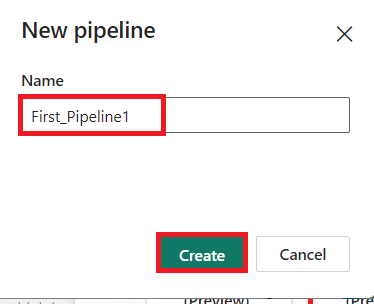

## 任務 3：使用管道中的 Copy 活動將示例數據加載到數據 Lakehouse

1.  在 **First_Pipeline1** 主頁 中，選擇 **Copy data assistant**
    以打開複製助手工具。

> 

2.  此時將顯示 **Copy data** 對話框，其中突出顯示了第一步 **Choose data
    source**。選擇 **Sample data** section，然後選擇 **NYC Taxi-Green**
    數據源類型。然後選擇 **Next**。

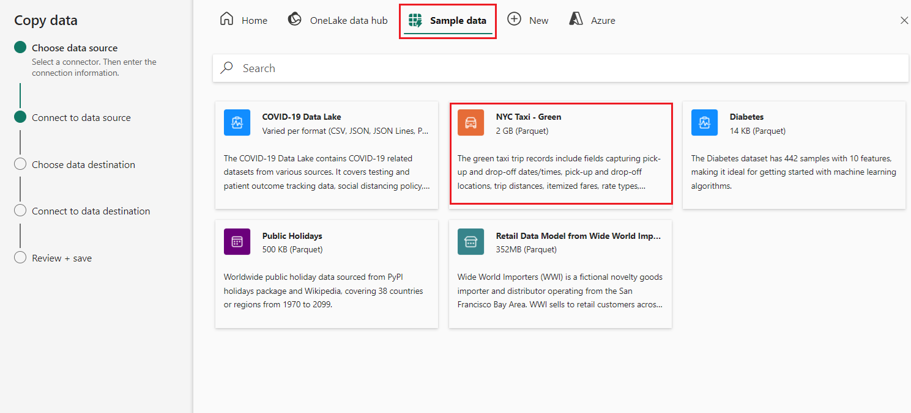

3.  在 **Connect to data source** 中，單擊 **Next** 按鈕。

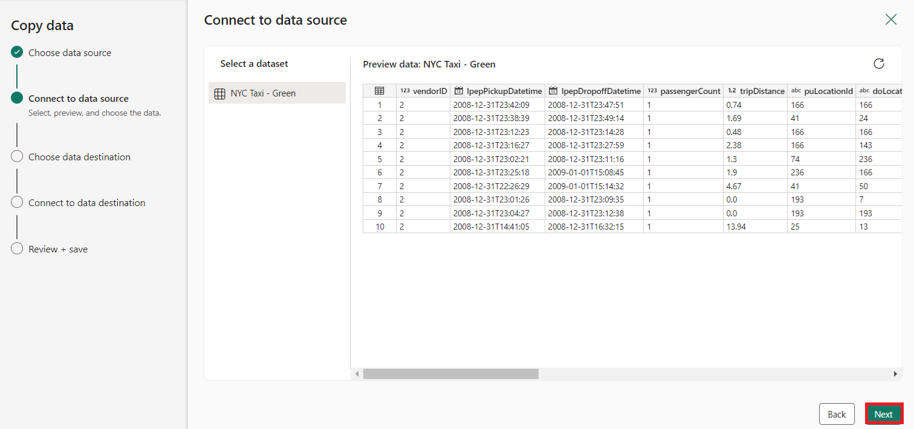

4.  對於複製助手的 **Choose data destination** 步驟，選擇
    **Lakehouse**，然後選擇 **Next**。

5.  選擇 OneLake Data Hub，然後在 出現的數據目標配置頁面上選擇
    **Existing Lakehouse**。

6.  現在，在 **Select and map to folder path or table** 上配置 Lakehouse
    目標的詳細信息**。** 頁。為 **Root folder** 選擇
    **Tables**，提供表名稱 +++**Bronze**+++，然後選擇 **Next**。

> 

7.  最後，在複製數據助手的 **Review + save**
    頁面上，查看配置。對於此實驗，請取消選中 **Start data transfer
    immediately** 複選框，因為我們在下一步中手動運行活動。然後選擇
    **OK。**

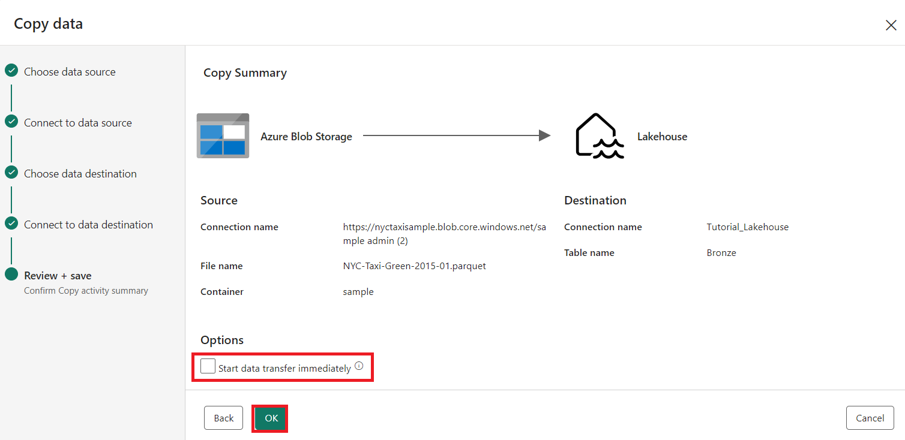

## **任務 4：運行並查看 Copy 活動的結果**。

1.  在 管道編輯器窗口的 **Home** 選項卡上，選擇 **Run**
    按鈕。

2.  在 **Save and run？** 對話框中， 單擊 **Save and run**
    按鈕以執行這些活動。此活動大約需要 11-12 分鐘

> 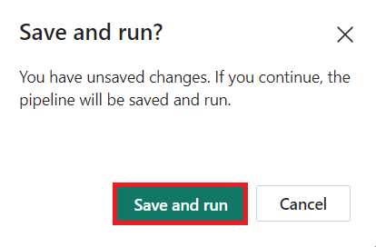

3.  您可以在管道畫布下方的 Output 選項卡上監控運行並檢查結果 。選擇
    **activity name** 作為 **Copy_ihy** 以查看運行詳細信息。

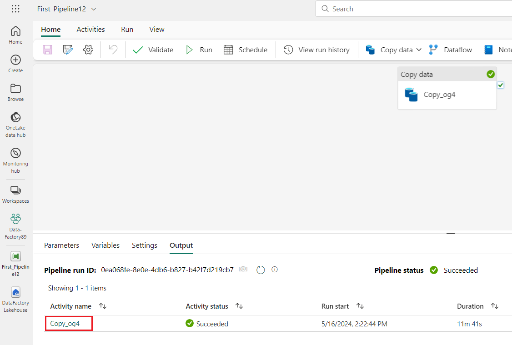

4.  運行詳細信息顯示讀取和寫入的 76,513,115 行。

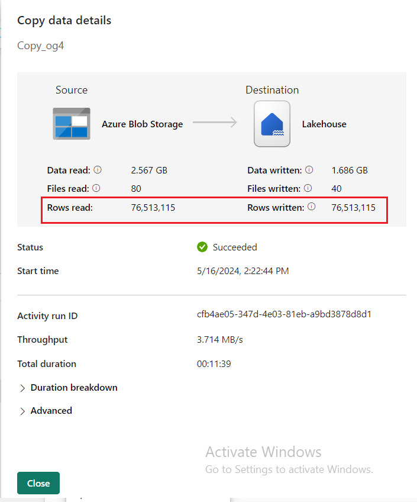

5.  展開 **Duration breakdown** 部分，以查看 Copy
    活動的每個階段的持續時間。查看複製詳細信息後，選擇 **Close**。

**練習 2：使用數據工廠中的數據流轉換數據**

## 任務 1：從 Lakehouse 表中獲取數據

1.  在 **First_Pipeline 1** 頁面上，從側邊欄中選擇 **Create。**

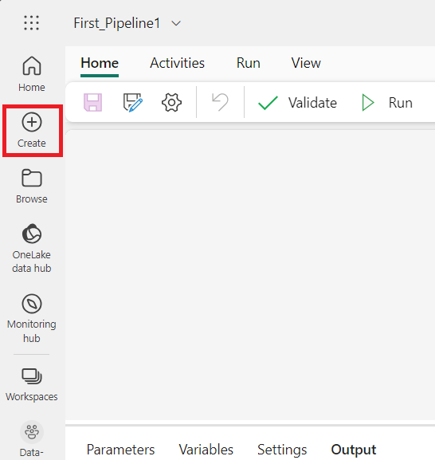

2.  在 **Data Factory Data-FactoryXX** 主頁上，要創建新的數據流第 2
    代，請單擊 **Data Factory** 下的 **Dataflow Gen2。**

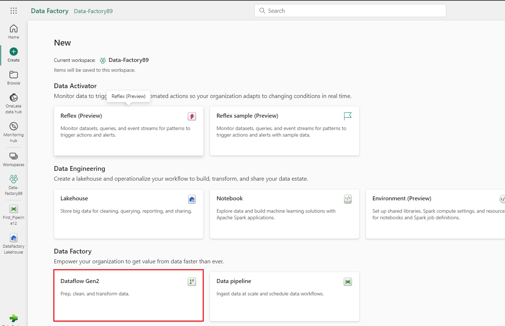

3.  從新的數據流菜單中，在 **Power Query** 窗格下，單擊 **Get
    data**，然後選擇 **More...**。

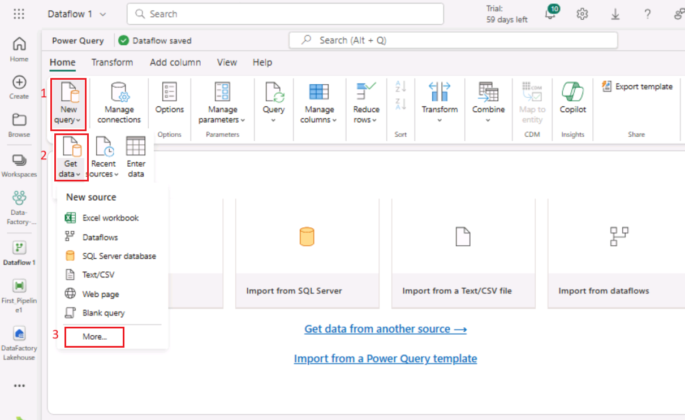

> 

4.  在 **Choose data source** 選項卡中，搜索框搜索鍵入
    +++**Lakehouse**+++，然後單擊 **Lakehouse** 連接器。

> 

5.  此時將顯示 **Connect to data source** 對話框，選擇 **Edit
    connection.** 

6.  在 **Connect to data source** 對話框中，選擇 **Sign in** using your
    Power BI 組織帳戶 以設置數據流用於訪問湖倉一體的身份。

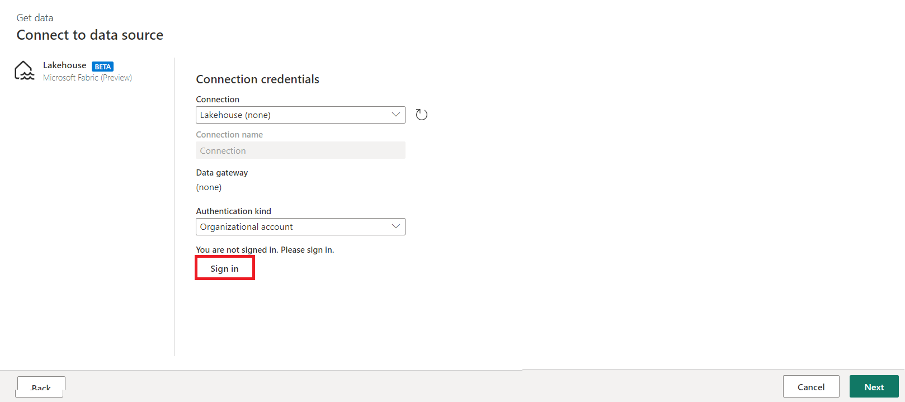

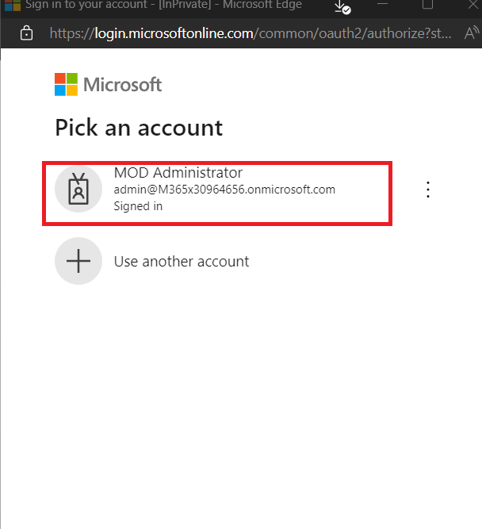

7.  在 **Connect to data source** 對話框中，選擇 **Next。**

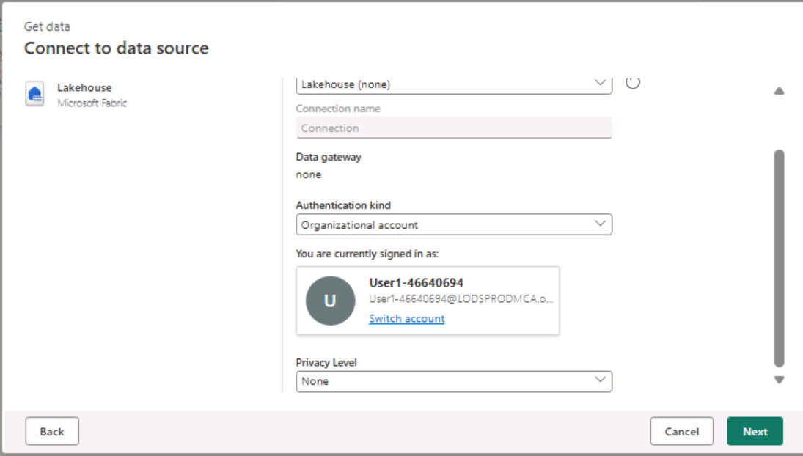

> 

8.  此時將顯示 **Choose data**
    對話框。使用導航窗格查找您在上一個模塊中為目標創建的
    Lakehouse，然後選擇 **DataFactoryLakehouse** 數據表，然後單擊
    **Create** 按鈕。

9.  在畫布中填充數據後，您可以設置 **column profile**
    信息，因為這對於數據概要分析非常有用。您可以應用正確的轉換，並基於它定位正確的數據值。

10. 為此，請從功能區窗格中選擇 **Options** ，然後在 Column
    profile下選擇前三個選項，然後選擇 **OK**。

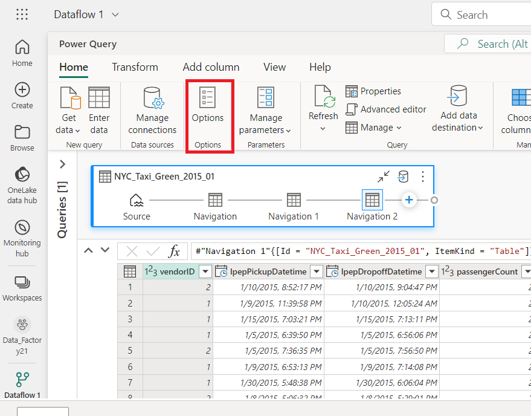

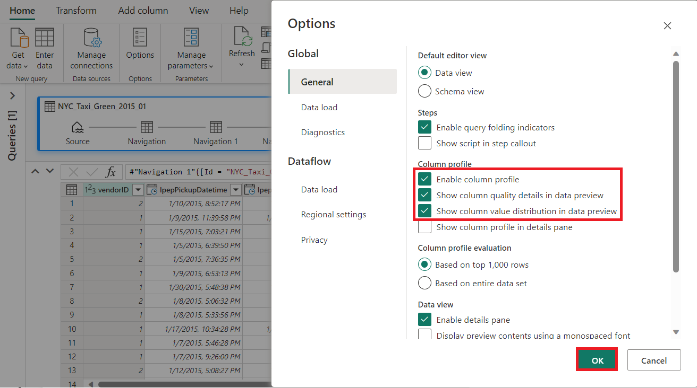

## 任務 2：轉換從 Lakehouse 導入的數據

1.  選擇第二列列標題中的數據類型圖標 **IpepPickupDatetime**
    以顯示**右鍵單擊**菜單，然後從菜單中選擇 **Change type** 以將列從
    **Date/Time** 轉換為 **Date** 類型。

2.  在 功能區的 **Home** 選項卡上，從 **Choose columns** 組中選擇
    **Manage columns** 選項。

3.  在 **Choose columns** 對話框中，**deselect**
    選擇此處列出的一些列，然後選擇 **OK**。

    - lpepDropoffDatetime

    &nbsp;

    - puLocationId

    &nbsp;

    - doLocationId

    &nbsp;

    - pickupLatitude

    &nbsp;

    - dropoffLongitude

    &nbsp;

    - rateCodeID

> 

4.  選擇 **storeAndFwdFlag** 列的 **filter and sort**
    下拉菜單。（如果您看到警告 列表可能不完整，請選擇 **Load more**
    以查看所有數據。

5.  選擇“**Y”**以僅顯示應用了折扣的行，然後選擇 **OK。**

6.  選擇 **Ipep_Pickup_Datetime** 列排序和篩選器下拉菜單，然後選擇
    日期篩選器，然後選擇 **Between...** filter 為 Date 和 Date/Time
    類型提供。

11. 在 **Filter rows** 對話框中，選擇 **2015 年 1 月 1** 日至 **2015 年
    1 月 31 日**之間的日期，然後選擇 **OK**。

> 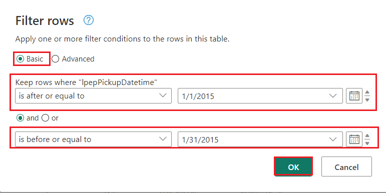

## 任務 3：連接到包含折扣數據的 CSV 文件

現在，有了行程的數據，我們想要加載包含每天的相應折扣和 VendorID
的數據，並在將數據與行程數據合併之前準備數據。

1.  從 **Home** 選項卡的數據流編輯器菜單中，選擇 **Get data **
    選項，然後選擇 **Text/CSV。**

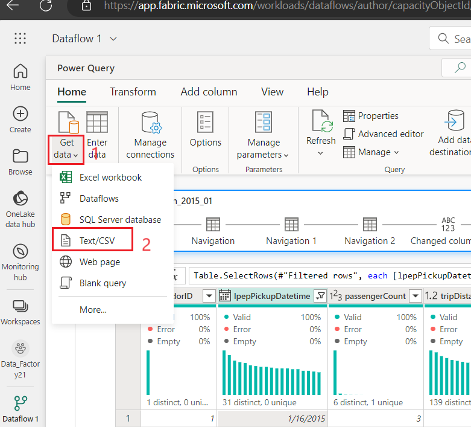

2.  在**Connect to data source** 窗格的 **Connection settings 下**，選擇
    **Upload file (Preview)** 單選按鈕，然後單擊
    **Browse**按鈕並瀏覽您的 VM **C：\LabFiles**，然後選擇
    **NYC-Taxi-Green-Discounts** 文件並單擊 **Open** 按鈕。

3.  在 **Connect to data source** 窗格中，單擊 **Next** 按鈕。

4.  在 **Preview file data** 對話框中，選擇 **Create**。

## 任務 4：轉換折扣數據

1.  查看數據，我們看到標題似乎位於第一行。通過選擇預覽網格區域左上角的表上下文菜單以選擇
    **Use first row as headers ，**將它們提升到標題。

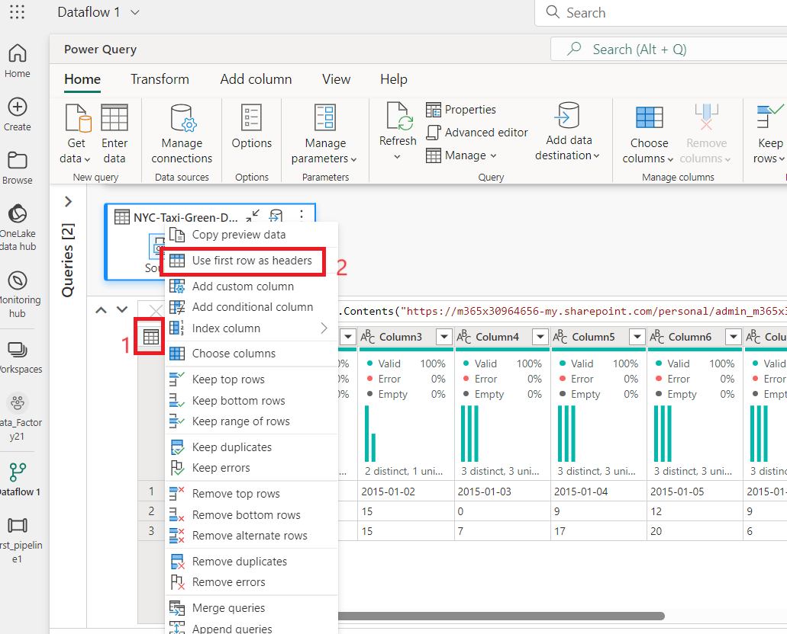

***注意：**提升標題後，您可以看到一個新步驟添加到數據流編輯器頂部的
**Applied steps** 窗格中，該步驟添加到列的數據類型中。*

2.  右鍵單擊 **VendorID** 列，然後從顯示的上下文菜單中選擇選項 **Unpivot
    other columns**。這允許您將列轉換為屬性-值對，其中列變為行。

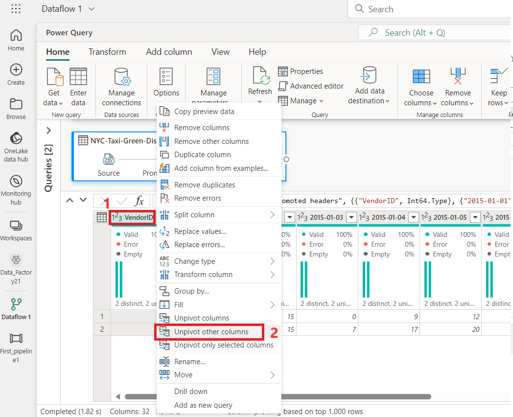

3.  在表未透視的情況下，雙擊 **Attribute** 和 **Value** 列，然後將
    **Attribute** 更改為 **Date**，將 **Value** 更改為
    **Discount**，從而重命名這些列。

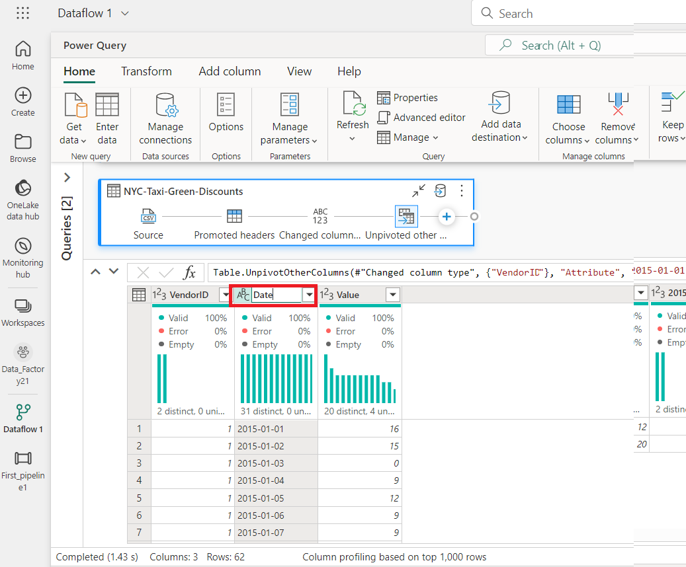

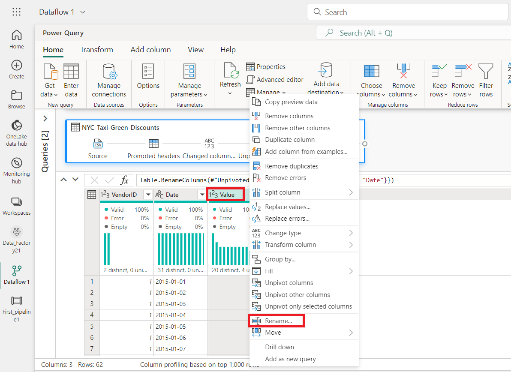

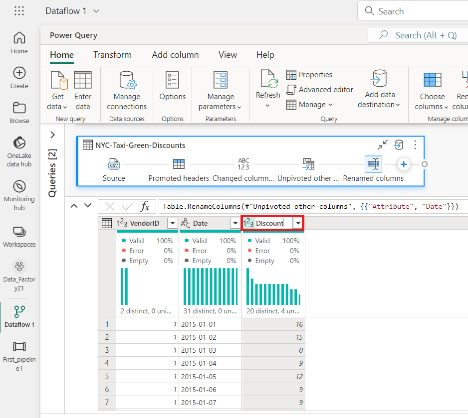

4.  通過選擇列名稱左側的數據類型菜單並選擇 **Date** 來更改 Date
    列的數據類型。

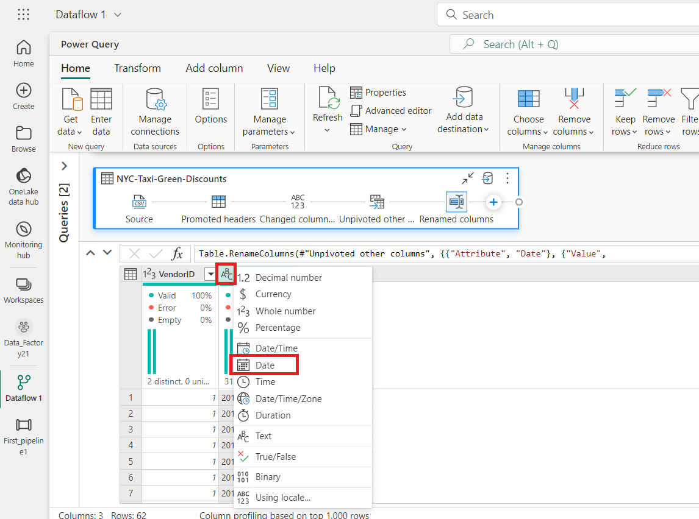

5.  選擇 **Discount** 列，然後選擇 菜單上的 **Transform** 選項卡。選擇
    **Number column**，然後從 子菜單中選擇 **Standard** numeric
    transformations，然後選擇 **Divide**。

6.  在 ** Divide** 對話框中，輸入值 +++100+++，然後單擊 **OK** 按鈕。

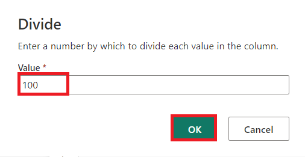

**任務 5：合併行程和折扣數據**

下一步是將兩個表合併到一個表中，該表包含應應用於行程的折扣和調整後的總計。

1.  首先，切換 **Diagram view** 按鈕，以便您可以看到兩個查詢。

2.  選擇 **Bronze** 查詢，然後在 **Home** 選項卡上，選擇 **Combine**
    菜單，然後選擇 **Merge queries**，然後選擇 **Merge queries as
    new**。

3.  在 **Merge** 對話框中， **從** Right table for merge
    **下拉列表中選擇
    Generated-NYC-Taxi-Green-Discounts**，然後選擇對話框右上角的
    "**light bulb"** 圖標，以查看三個表之間建議的列映射。

4.  選擇兩個建議的列映射中的每一個，一次一個，映射兩個表中的 VendorID 和
    date 列。添加兩個映射後，匹配的列標題將在每個表中突出顯示。

5.  此時將顯示一條消息，要求您允許合併來自多個數據源的數據以查看結果。選擇
    **OK**

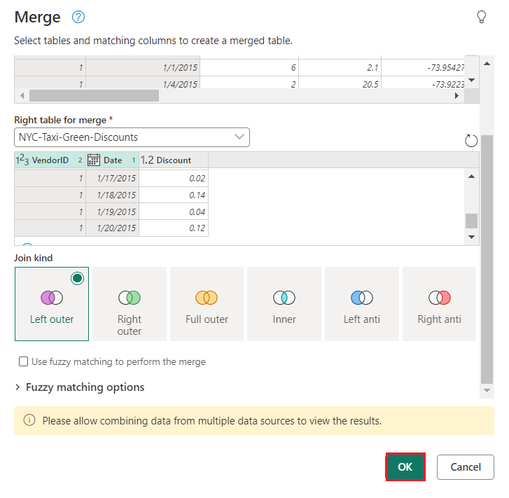

6.  在表區域中，您最初會看到一條警告，指出“評估已取消，因為合併來自多個源的數據可能會將數據從一個源顯示到另一個源。如果可以顯示數據，請選擇
    continue （繼續）。選擇 **Continue** 以顯示組合數據。

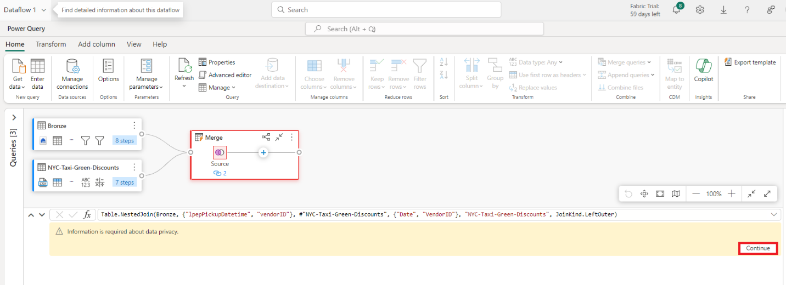

7.  在 Privacy Levels 對話框中，選中 **check box :Ignore Privacy Lavels
    checks for this document. Ignoring privacy Levels could expose
    sensitive or confidential data to an unauthorized person**，然後單擊
    **Save** 按鈕。

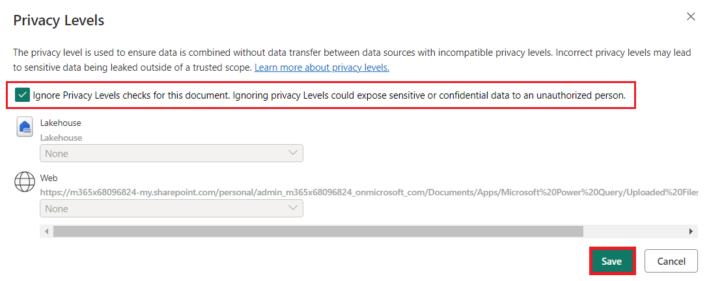

8.  請注意在關係圖視圖中創建新查詢的方式，其中顯示了新 Merge
    查詢與之前創建的兩個查詢的關係。查看編輯器的表窗格，滾動到 Merge
    query column （合併查詢列）
    列表的右側，以查看存在具有表值的新列。這是“Generated NYC
    Taxi-Green-Discounts”列，其類型為
    **\[Table\]。**在列標題中，有一個圖標，其中有兩個相反方向的箭頭，允許您從表中選擇列。取消選擇除
    **Discount** 之外的所有列，然後選擇 **OK。**

9.  現在，discount 值位於行級別，我們可以創建一個新列來計算 discount
    後的總金額。為此，請選擇編輯器頂部的 **Add column** 選項卡，然後從
    **General** 組中選擇 **Custom column**。

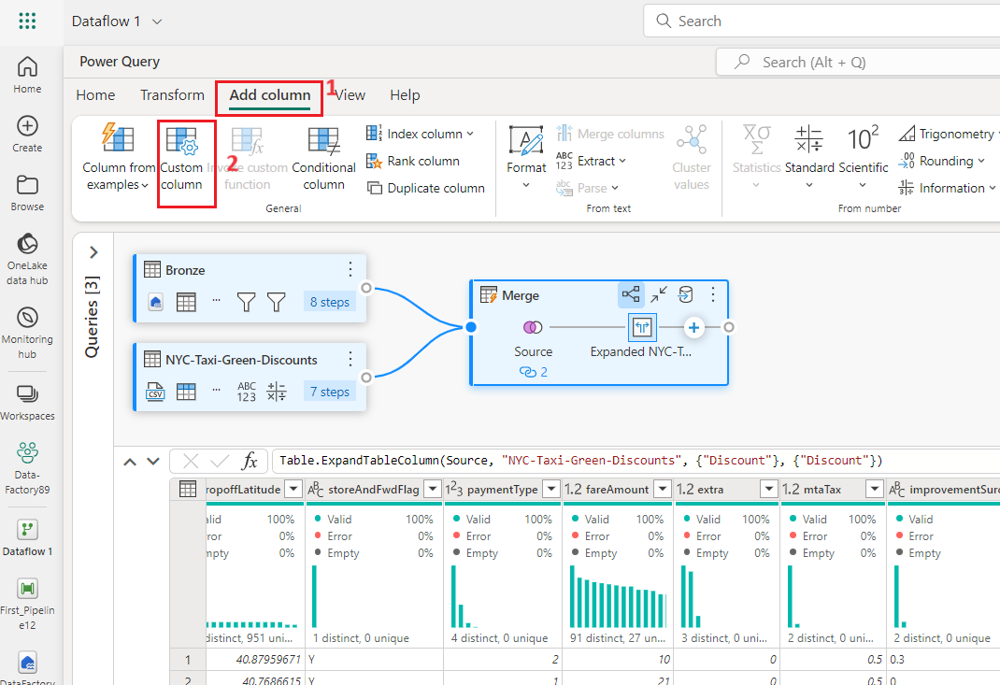

10. 在 **Custom column** 對話框中，您可以使用 [Power Query 公式語言
    （也稱為 M）](https://learn.microsoft.com/en-us/powerquery-m)
    來定義新列的計算方式。輸入 +++**TotalAfterDiscount**+++ 作為 **New
    column name**，選擇 **Currency** 作為 **Data type**，並為 **Custom
    column** formula 提供以下 M 表達式：

> *+++if \[totalAmount\] \> 0 then \[totalAmount\] \* ( 1 -\[Discount\]
> ) else \[totalAmount\]+++*
>
> 然後選擇 **OK。**

11. 選擇新創建的 **TotalAfterDiscount** 列，然後選擇 編輯器窗口頂部的
    Transform 選項卡。在 **Number column** group 組中，選擇 **Rounding**
    下拉列表，然後選擇 **Round...**。

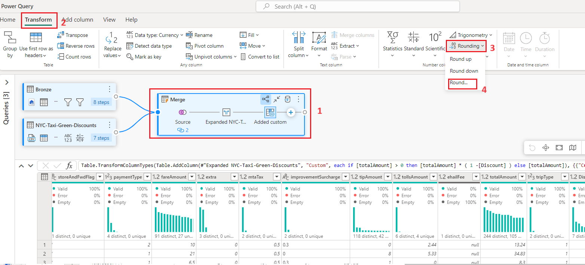

12. 在 **Round** 對話框中，輸入 **2** 作為小數位數，然後選擇 **OK。**

> 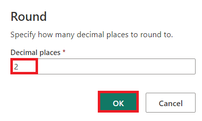

13. 將 **IpepPickupDatetime** 的數據類型 從 **Date** 更改為
    **Date/Time**。

14. 最後，從編輯器右側展開 **Query settings**
    窗格（如果尚未展開），然後將查詢從 **Merge** 重命名為 **Output**。

**任務 6：將輸出查詢加載到 Lakehouse 中的表**

輸出查詢現已完全準備好，數據已準備好輸出，我們可以定義查詢的輸出目標。

1.  選擇 **Output** merge query created 之前創建。然後選擇編輯器中的
    **Home** 選項卡，並從 **Query 分**組中選擇 **Add data destination**
    以選擇 **Lakehouse** 目標。

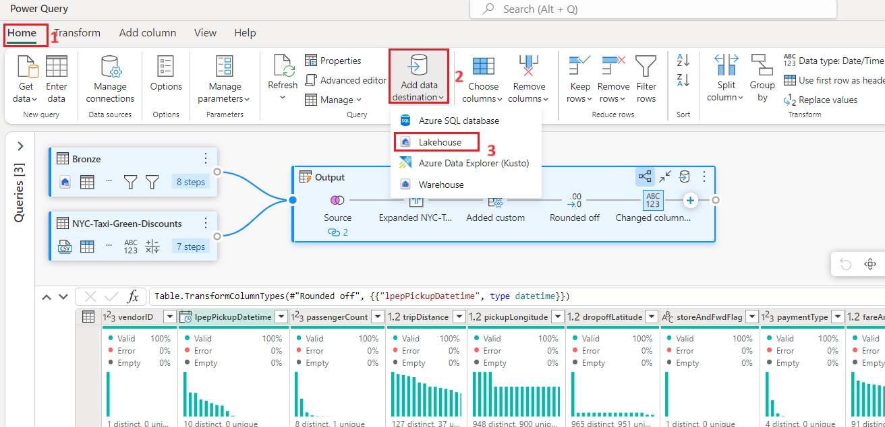

2.  在 **Connect to data destination** 對話框中，您的連接應已選中。選擇
    **Next** 繼續。

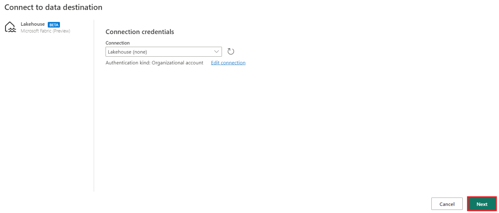

3.  在 **Choose destination target** 對話框中，瀏覽到要加載數據的
    Lakehouse，並將新表命名為 +++
    **nyc_taxi_with_discounts+++**，然後再次選擇 **Next**。

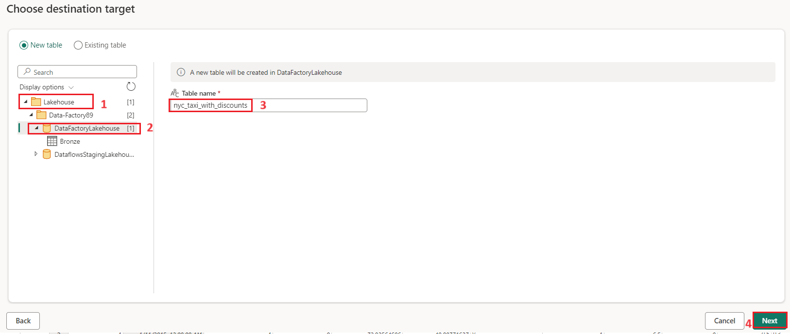

4.  在 **Choose destination settings** 對話框中，保留默認的 **Replace**
    update method，仔細檢查您的列是否正確映射，然後選擇 **Save
    settings**。

5.  返回主編輯器窗口，確認您在 **Output** 表的 **Query settings**
    窗格中看到輸出目標，然後選擇 **Publish**。

6.  在工作區頁面上，您可以通過選擇選擇行後顯示的數據流名稱右側的省略號，然後選擇
    **Properties** 來重命名數據流。

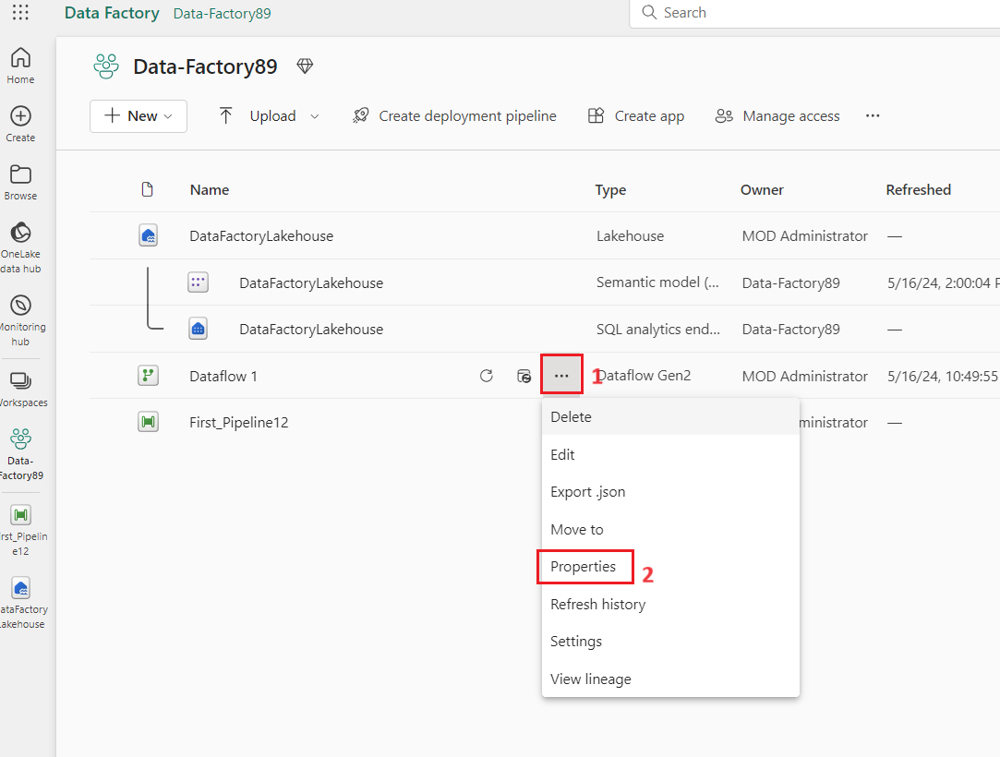

7.  在 **Dataflow 1** 對話框中，在名稱框中輸入
    +++**nyc_taxi_data_with_discounts**+++，然後選擇 **Save**。

> 

8.  選擇數據流的行後，選擇數據流的刷新圖標，完成後，您應該會看到按照
    **Data destination** 設置中的配置創建了新的 Lakehouse 表 。

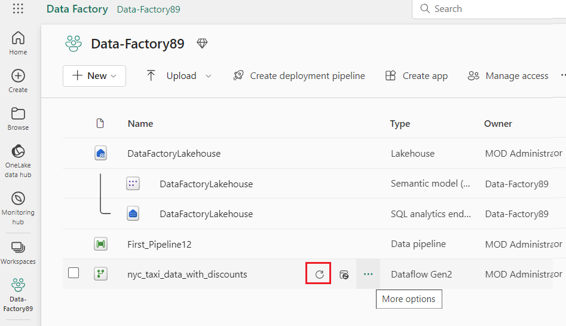

9.  在 **Data_FactoryXX** 窗格中， 選擇 **DataFactoryLakehouse**
    以查看其中加載的新表。

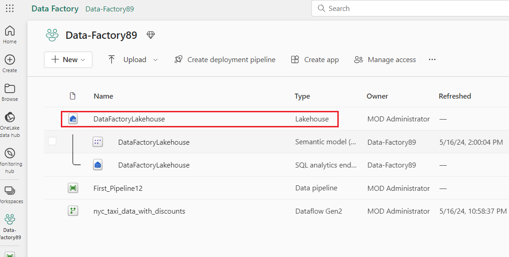

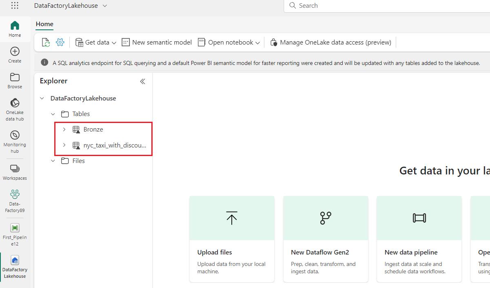

# 練習 3：使用數據工廠自動執行和發送通知

**重要**

Microsoft Fabric
目前為預覽版。此信息與預發行產品相關，該產品在發佈之前可能會進行重大修改。Microsoft
對此處提供的信息不作任何明示或暗示的保證。請參閱 [***Azure Data Factory
documentation***](https://learn.microsoft.com/en-us/azure/data-factory/)，瞭解
Azure 中的服務。

## 任務 1：將 Office 365 Outlook 活動添加到管道

1.  在 **Tutorial_Lakehouse** 頁面中，導航並單擊 左側導航菜單上的
    **Data_FactoryXX** Workspace。

2.  在 **Data_FactoryXX** 視圖中，選擇 **First_Pipeline1**。

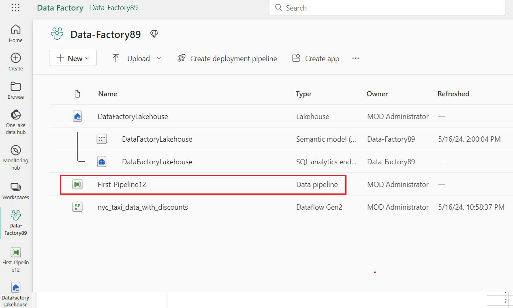

3.  在管道編輯器中選擇 **Activities** 選項卡，然後找到 **Office
    Outlook** 活動。

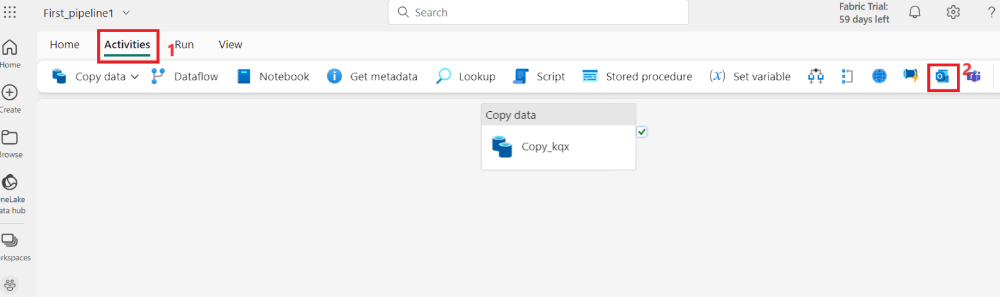

4.  選擇 **On success** 路徑（管道畫布中活動右上角的綠色複選框）並將其從
    **Copy activity** 拖動到新的 **Office 365 Outlook** 活動。

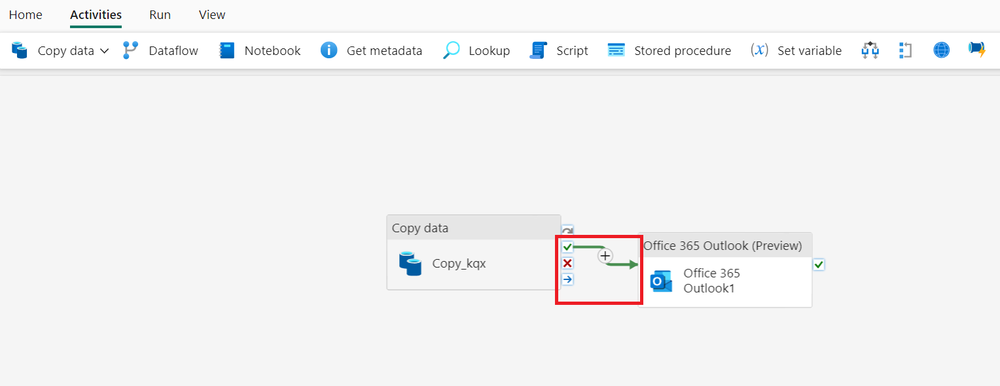

5.  從管道畫布中選擇 Office 365 Outlook 活動，然後選擇
    畫布下方屬性區域的 **Settings** 選項卡以配置電子郵件。點擊 **Sing
    in** 按鈕。

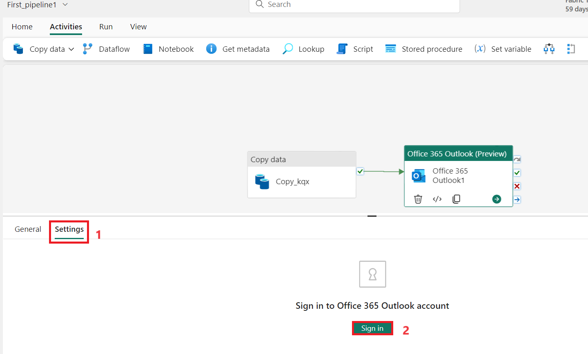

6.  選擇您的 Power BI 組織帳戶， 然後選擇 **Allow access** 進行確認。

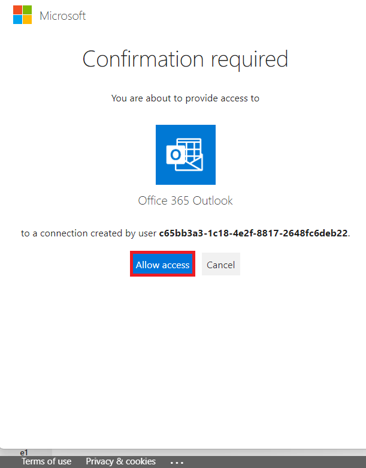

**注意：** 該服務目前不支持個人電子郵件。您必須使用企業電子郵件地址。

7.  從管道畫布中選擇 Office 365 Outlook 活動，在 畫布下方屬性區域的
    **Settings** 選項卡上，以配置電子郵件。

    - 在 **To** 部分。如果要使用多個地址，請使用 ;將它們分開。

    &nbsp;

    - 對於 **Subject**，選擇字段以顯示 **Add dynamic content**
      選項，然後選擇它以顯示管道表達式生成器畫布。

8.  此時將顯示 **Pipeline expression builder**
    對話框。輸入以下表達式，然後選擇 **OK：**

> *@concat('DI in an Hour Pipeline Succeeded with Pipeline Run Id',
> pipeline().RunId)*

9.  對於 **Body**，再次選擇該字段，然後在文本區域下方顯示 **View in
    expression builder** 選項時選擇該選項。在出現的 **Pipeline
    expression builder** 對話框中再次添加以下表達式，然後選擇 **OK：**

> *@concat('RunID = ', pipeline().RunId, ' ; ', 'Copied rows ',
> activity('Copy data1').output.rowsCopied, ' ; ','Throughput ',
> activity('Copy data1').output.throughput)*

** 注意：** 將 **Copy data1** 替換為您自己的管道複製活動的名稱。

10. 最後，選擇 管道編輯器頂部的 **Home** 選項卡，然後選擇 Run。然後選擇
    **Save and run** 再次在確認對話框中執行這些活動。

> 
>
> 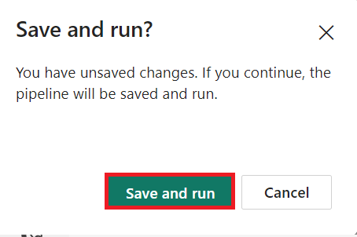
>
> 

11. 管道成功運行後，檢查您的電子郵件以查找從管道發送的確認電子郵件。

**任務 2：計劃管道執行**

完成管道的開發和測試後，您可以安排它自動執行。

1.  在 管道編輯器窗口的 **Home** 選項卡上，選擇 **Schedule**。

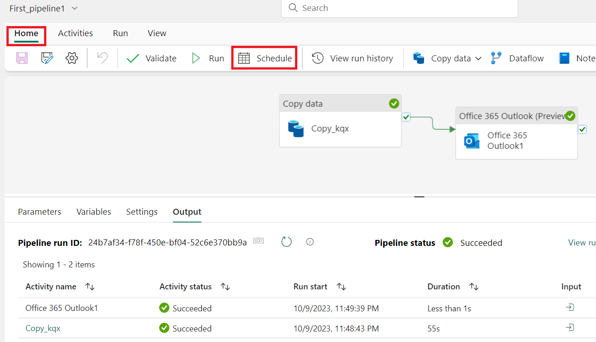

2.  根據需要配置計劃。此處的示例將管道安排為每天晚上 8：00
    執行，直到年底。

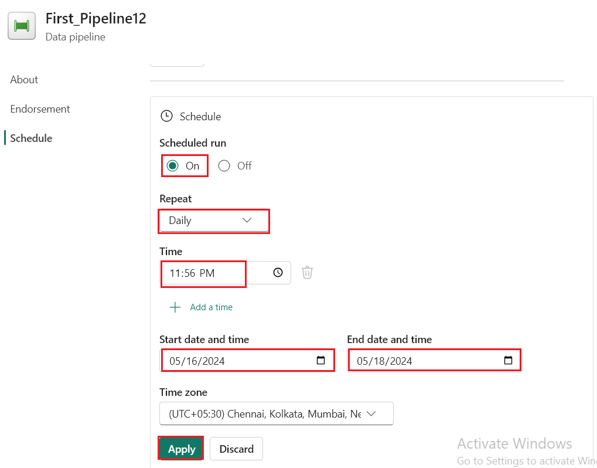

***任務 3：* 將 Dataflow 活動添加到管道**

1.  將鼠標懸停在管道畫布上連接 **Copy activity** 和 **Office 365
    Outlook** 活動的綠線上，然後選擇 **+** 按鈕以插入新活動。

> 

2.  從 顯示的菜單中選擇 **Dataflow**。

3.  新創建的 Dataflow 活動將插入到 Copy 活動和 Office 365 Outlook
    活動之間，並自動選中，並在畫布下方的區域中顯示其屬性。選擇
    屬性區域上的 **Settings** 選項卡，然後選擇在 **Exercise 2: Transform
    data with a dataflow in Data Factory**。

12. 選擇 管道編輯器頂部的 **Home** 選項卡，然後選擇 **Run**。然後選擇
    **Save and run** 再次在確認對話框中執行這些活動。

## 任務 4：清理資源

您可以刪除單個報表、管道、倉庫和其他項目，也可以刪除整個工作區。使用以下步驟刪除您為本教程創建的工作區。

1.  從左側導航菜單中選擇您的工作區
    **Data-FactoryXX**。此時將打開工作區項視圖。

2.  選擇 ***...*** 選項，然後選擇 **Workspace settings**。

3.  選擇 **Other** 和 **Remove this workspace。**

