# 用例 04：使用 Azure Databricks 和 Microsoft Fabric 进行现代云规模分析

**介绍**

在本实验室中，你将探索 Azure Databricks 与 Microsoft Fabric
的集成，以使用 Medallion 体系结构创建和管理湖仓一体，在 Azure Data Lake
Storage （ADLS） Gen2 帐户的帮助下使用 Azure Databricks 创建 Delta
表，以及使用 Azure Databricks
引入数据。本实践指南将引导您完成创建湖仓一体所需的步骤，将数据加载到其中，并探索结构化数据层以促进高效的数据分析和报告。

奖章架构由三个不同的层（或区域）组成。

- Bronze：也称为原始区域，第一层以其原始格式存储源数据。此层中的数据通常是仅附加且不可变的。

- Silver：也称为扩充区域，此层存储源自 bronze
  层的数据。原始数据已经过清理和标准化，现在其结构为表
  （行和列）。它还可能与其他数据集成，以提供所有业务实体（如客户、产品等）的企业视图。

- Gold：也称为特选区域，此最后一个层存储来自银色层的数据。数据经过优化以满足特定的下游业务和分析要求。表通常符合星型架构设计，该设计支持开发针对性能和可用性进行优化的数据模型。

**目标：**

- 了解 Microsoft Fabric Lakehouse 中的奖章体系结构原则。

- 使用勋章图层（铜牌、银牌、金牌）实施结构化数据管理流程。

- 将原始数据转换为经过验证和丰富的数据，以进行高级分析和报告。

- 了解数据安全、CI/CD 和高效数据查询的最佳实践。

- 使用 OneLake 文件资源管理器将数据上传到 OneLake。

- 使用 Fabric 笔记本读取 OneLake 上的数据，并作为 Delta 表写回。

&nbsp;

- 使用 Fabric 笔记本通过 Spark 分析和转换数据。

- 使用 SQL 查询 OneLake 上的一份数据副本。

- 使用 Azure Databricks 在 Azure Data Lake Storage （ADLS） Gen2
  帐户中创建 Delta 表。

- 在 ADLS 中创建 Delta 表的 OneLake 快捷方式。

- 使用 Power BI 通过 ADLS 快捷方式分析数据。

- 使用 Azure Databricks 读取和修改 OneLake 中的 Delta 表。

# 练习 1：将示例数据引入 Lakehouse

在本练习中，您将完成使用 Microsoft Fabric 创建 Lakehouse
并将数据加载到其中的过程。

Task:trail

## **任务 1：创建 Fabric 工作区**

在此任务中，您将创建一个 Fabric 工作区。工作区包含此 Lakehouse
教程所需的所有项，其中包括
Lakehouse、数据流、数据工厂管道、笔记本、Power BI 数据集和报表。

1.  打开浏览器，导航到地址栏，然后键入或粘贴以下
    URL：[https://app.fabric.microsoft.com/](https://app.fabric.microsoft.com/,)
    然后按 **Enter** 按钮。

> 

2.  返回到 **Power BI** 窗口。在 Power BI
    主页的左侧导航菜单上，导航并单击 **Workspaces**。

3.  在 Workspaces 窗格中， 单击 **+ New workspace** 按钮**。**

> 

4.  在右侧显示的 **Create a workspace**
    窗格中，输入以下详细信息，然后单击 **Apply** 按钮。

[TABLE]

> 

5.  等待部署完成。完成需要 2-3 分钟。

## **任务 2：创建 Lakehouse**

1.  在 **Power BI Fabric Lakehouse Tutorial-XX**
    页面中，单击位于左下角的 **Power BI** 图标，然后选择 **Data
    Engineering**。

> 

2.  在 **ynapse Data Engineering Home** 中，选择 **Lakehouse** 以创建
    Lakehouse。

3.  在 **New lakehouse** 对话框中，在 **Name** 字段中输入
    **wwilakehouse**，单击 **Create** 按钮并打开新的 Lakehouse。

> **注意：**确保在 **wwilakehouse** 之前删除空格。
>
> 
>
> 
>
> 

4.  您将看到一条通知，指出 **Successfully created SQL endpoint**。

> 

# 练习 2： 使用 Azure Databricks 实现奖章体系结构

## **任务 1：设置青铜层**

1.  在 **wwilakehouse** 页面中， 选择文件旁边的 More icon
    （...），然后选择 **New subfolder**

2.  在弹出窗口中提供 Folder name 作为 **bronze**，然后选择 Create。

3.  现在，选择 铜牌文件旁边的 更多 图标 （...），然后选择 **Upload**
    ，然后选择 **upload files**。

4.  在 **upload file** 窗格中，选择 **Upload file**
    单选按钮。单击**Browse button** 并浏览到 **C：\LabFiles**，然后选择
    所需的销售数据文件（2019、2020、2021）文件，然后单击 **Open** 按钮。

然后，选择 **Upload** 将文件上传到 Lakehouse 中的新“bronze”文件夹中。

> 

5.  单击 **bronze** 文件夹以验证文件是否已成功上传以及文件是否正在反射。

# 练习 3： 在 Medallion 体系结构中使用 Apache Spark 转换数据并使用 SQL 进行查询

## **任务 1：转换数据并加载到 silver Delta 表**

在 **wwilakehouse** 页面中，导航并单击命令栏中的 **Open notebook**
drop，然后选择 **New notebook**。

1.  选择第一个单元格（当前为*代码*单元格），然后在其右上角的动态工具栏中，使用
    **M↓** 按钮 **convert the cell to a markdown cell.**。

2.  当单元格更改为 Markdown 单元格时，将呈现它包含的文本。

3.  **🖉** 使用 （Edit）
    按钮将单元格切换到编辑模式，替换所有文本，然后按如下方式修改
    markdown：

CodeCopy

\# Sales order data exploration

Use the code in this notebook to explore sales order data.

4.  单击笔记本中单元格外部的任意位置可停止编辑它并查看呈现的 Markdown。

5.  使用单元格输出下方的 + Code 图标将新的代码单元格添加到笔记本中。

6.  现在，使用笔记本将数据从 bronze 层加载到 Spark DataFrame 中。

选择 Notebook
中的现有单元格，其中包含一些简单的注释掉的代码。突出显示并删除这两行 -
您将不需要此代码。

*注意：笔记本使您能够使用多种语言运行代码，包括 Python、Scala 和
SQL。在本练习中，您将使用 PySpark 和 SQL。您还可以添加 Markdown
单元格以提供格式化的文本和图像来记录您的代码。*

为此，请在其中输入以下代码，然后单击 **Run**.

CodeCopy

from pyspark.sql.types import \*

\# Create the schema for the table

orderSchema = StructType(\[

StructField("SalesOrderNumber", StringType()),

StructField("SalesOrderLineNumber", IntegerType()),

StructField("OrderDate", DateType()),

StructField("CustomerName", StringType()),

StructField("Email", StringType()),

StructField("Item", StringType()),

StructField("Quantity", IntegerType()),

StructField("UnitPrice", FloatType()),

StructField("Tax", FloatType())

\])

\# Import all files from bronze folder of lakehouse

df = spark.read.format("csv").option("header",
"true").schema(orderSchema).load("Files/bronze/\*.csv")

\# Display the first 10 rows of the dataframe to preview your data

display(df.head(10))

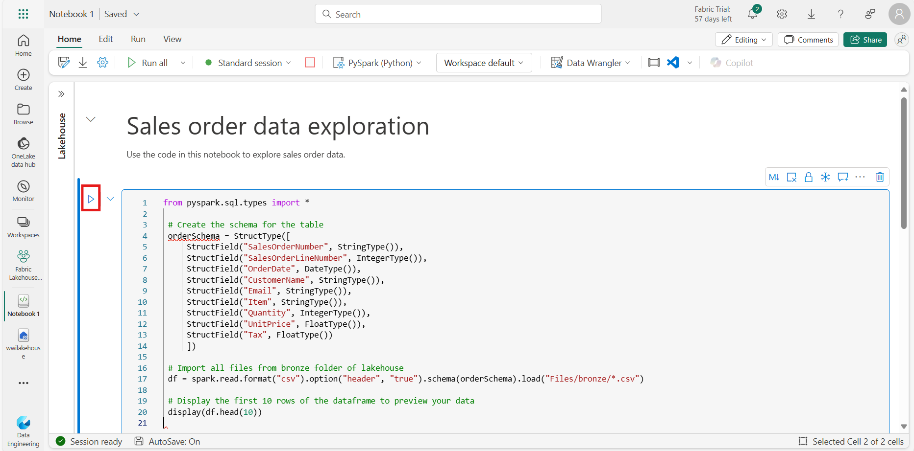

***注意**：由于这是您第一次在此笔记本中运行任何 Spark 代码，因此必须启动
Spark
会话。这意味着第一次运行可能需要一分钟左右才能完成。后续运行会更快。*

7.  您运行的代码将 bronze 文件夹中的 CSV 文件中的数据加载到 Spark
    数据帧中，然后显示数据帧的前几行。

> **备注**：您可以通过选择 **...** Output（输出）窗格左上角的菜单。

8.  现在，您将 **add columns for data validation and cleanup**，使用
    PySpark 数据帧添加列并更新一些现有列的值。使用 + 按钮 **add a new
    code block**，并将以下代码添加到单元格中：

> CodeCopy
>
> from pyspark.sql.functions import when, lit, col, current_timestamp,
> input_file_name
>
> \# Add columns IsFlagged, CreatedTS and ModifiedTS
>
> df = df.withColumn("FileName", input_file_name()) \\
>
> .withColumn("IsFlagged", when(col("OrderDate") \<
> '2019-08-01',True).otherwise(False)) \\
>
> .withColumn("CreatedTS", current_timestamp()).withColumn("ModifiedTS",
> current_timestamp())
>
> \# Update CustomerName to "Unknown" if CustomerName null or empty
>
> df = df.withColumn("CustomerName", when((col("CustomerName").isNull()
> |
> (col("CustomerName")=="")),lit("Unknown")).otherwise(col("CustomerName")))
>
> 代码的第一行从 PySpark 导入必要的函数。然后，您将向 DataFrame
> 添加新列，以便跟踪源文件名、订单是否在感兴趣的会计年度之前被标记为
> a，以及行的创建和修改时间。
>
> 最后，如果 CustomerName 列为 null 或为空，则将其更新为 “Unknown”。
>
> 然后，使用 \*\***▷ （**Run cell*）\*\* 按钮*运行单元格以执行代码。

9.  接下来，您将 使用 Delta Lake 格式定义 sales 数据库中
    **sales_silver**
    表的架构。创建一个新的代码块，并将以下代码添加到单元格中：

> CodeCopy

from pyspark.sql.types import \*

from delta.tables import \*

\# Define the schema for the sales_silver table

silver_table_schema = StructType(\[

    StructField("SalesOrderNumber", StringType(), True),

    StructField("SalesOrderLineNumber", IntegerType(), True),

    StructField("OrderDate", DateType(), True),

    StructField("CustomerName", StringType(), True),

    StructField("Email", StringType(), True),

    StructField("Item", StringType(), True),

    StructField("Quantity", IntegerType(), True),

    StructField("UnitPrice", FloatType(), True),

    StructField("Tax", FloatType(), True),

    StructField("FileName", StringType(), True),

    StructField("IsFlagged", BooleanType(), True),

    StructField("CreatedTS", TimestampType(), True),

    StructField("ModifiedTS", TimestampType(), True)

\])

\# Create or replace the sales_silver table with the defined schema

DeltaTable.createIfNotExists(spark) \\

    .tableName("wwilakehouse.sales_silver") \\

    .addColumns(silver_table_schema) \\

    .execute()

   

10. 使用 \*\***▷ （**Run cell*）\*\* 按钮*运行单元格以执行代码。

11. 选择 **...** ，然后选择 **Refresh**。您现在应该会看到列出了新的
    **sales_silver** 表。▲ （三角形图标）表示它是一个 Delta 表。

> **注意**：如果您没有看到新表，请等待几秒钟，然后再次选择
> **Refresh**，或刷新整个浏览器选项卡。
>
> 
>
> 

12. 现在，您将对 Delta 表执行 **upsert
    operation**，根据特定条件更新现有记录，并在找不到匹配项时插入新记录。添加新代码块并粘贴以下代码：

> CodeCopy
>
> from pyspark.sql.types import \*
>
> from pyspark.sql.functions import when, lit, col, current_timestamp,
> input_file_name
>
> from delta.tables import \*
>
> \# Define the schema for the source data
>
> orderSchema = StructType(\[
>
> StructField("SalesOrderNumber", StringType(), True),
>
> StructField("SalesOrderLineNumber", IntegerType(), True),
>
> StructField("OrderDate", DateType(), True),
>
> StructField("CustomerName", StringType(), True),
>
> StructField("Email", StringType(), True),
>
> StructField("Item", StringType(), True),
>
> StructField("Quantity", IntegerType(), True),
>
> StructField("UnitPrice", FloatType(), True),
>
> StructField("Tax", FloatType(), True)
>
> \])
>
> \# Read data from the bronze folder into a DataFrame
>
> df = spark.read.format("csv").option("header",
> "true").schema(orderSchema).load("Files/bronze/\*.csv")
>
> \# Add additional columns
>
> df = df.withColumn("FileName", input_file_name()) \\
>
> .withColumn("IsFlagged", when(col("OrderDate") \< '2019-08-01',
> True).otherwise(False)) \\
>
> .withColumn("CreatedTS", current_timestamp()) \\
>
> .withColumn("ModifiedTS", current_timestamp()) \\
>
> .withColumn("CustomerName", when((col("CustomerName").isNull()) |
> (col("CustomerName") == ""),
> lit("Unknown")).otherwise(col("CustomerName")))
>
> \# Define the path to the Delta table
>
> deltaTablePath = "Tables/sales_silver"
>
> \# Create a DeltaTable object for the existing Delta table
>
> deltaTable = DeltaTable.forPath(spark, deltaTablePath)
>
> \# Perform the merge (upsert) operation
>
> deltaTable.alias('silver') \\
>
> .merge(
>
> df.alias('updates'),
>
> 'silver.SalesOrderNumber = updates.SalesOrderNumber AND \\
>
> silver.OrderDate = updates.OrderDate AND \\
>
> silver.CustomerName = updates.CustomerName AND \\
>
> silver.Item = updates.Item'
>
> ) \\
>
> .whenMatchedUpdate(set = {
>
> "SalesOrderLineNumber": "updates.SalesOrderLineNumber",
>
> "Email": "updates.Email",
>
> "Quantity": "updates.Quantity",
>
> "UnitPrice": "updates.UnitPrice",
>
> "Tax": "updates.Tax",
>
> "FileName": "updates.FileName",
>
> "IsFlagged": "updates.IsFlagged",
>
> "ModifiedTS": "current_timestamp()"
>
> }) \\
>
> .whenNotMatchedInsert(values = {
>
> "SalesOrderNumber": "updates.SalesOrderNumber",
>
> "SalesOrderLineNumber": "updates.SalesOrderLineNumber",
>
> "OrderDate": "updates.OrderDate",
>
> "CustomerName": "updates.CustomerName",
>
> "Email": "updates.Email",
>
> "Item": "updates.Item",
>
> "Quantity": "updates.Quantity",
>
> "UnitPrice": "updates.UnitPrice",
>
> "Tax": "updates.Tax",
>
> "FileName": "updates.FileName",
>
> "IsFlagged": "updates.IsFlagged",
>
> "CreatedTS": "current_timestamp()",
>
> "ModifiedTS": "current_timestamp()"
>
> }) \\
>
> .execute()

13. 使用 \*\***▷ （**Run cell*）\*\* 按钮*运行单元格以执行代码。

此作非常重要，因为它使您能够根据特定列的值更新表中的现有记录，并在找不到匹配项时插入新记录。当您从可能包含现有记录和新记录更新的源系统加载数据时，这是一个常见要求。

现在，您的 silver delta 表中有数据，可以进行进一步的转换和建模。

您已成功从 bronze 层获取数据，对其进行转换，并将其加载到 silver Delta
表中。现在，您将使用一个新的笔记本进一步转换数据，将其建模为星型架构，并将其加载到黄金
Delta 表中。

*请注意，您可以在单个笔记本中完成所有这些作，但出于本练习的目的，您将使用单独的笔记本来演示将数据从铜级转换为银级，然后从银级转换为金级的过程。这有助于调试、故障排除和重用*。

## **任务 2：将数据加载到 Gold Delta 表中**

1.  返回到 Fabric Lakehouse Tutorial-29 主页。

> 

2.  选择 **wwilakehouse。**

3.  在 Lakehouse Explorer 窗格中，您应该会看到 **sales_silver** 表列在
    资源管理器窗格的 **Tables** 部分中。

4.  现在，创建一个名为 **Transform data for Gold**
    的新笔记本。为此，请导航并单击命令栏中的 **Open notebook**
    drop，然后选择 **New notebook**。

5.  在现有代码块中，删除样板文本并 **add the following
    code **以将数据加载到数据帧并开始构建星型架构，然后运行它：

> CodeCopy

\# Load data to the dataframe as a starting point to create the gold
layer

df = spark.read.table("wwilakehouse.sales_silver")

\# Display the first few rows of the dataframe to verify the data

df.show()

6.  接下来**，Add a new code block**
    并粘贴以下代码以创建日期维度表并运行它：

 from pyspark.sql.types import \*

 from delta.tables import\*

   

 # Define the schema for the dimdate_gold table

 DeltaTable.createIfNotExists(spark) \\

     .tableName("wwilakehouse.dimdate_gold") \\

     .addColumn("OrderDate", DateType()) \\

     .addColumn("Day", IntegerType()) \\

     .addColumn("Month", IntegerType()) \\

     .addColumn("Year", IntegerType()) \\

     .addColumn("mmmyyyy", StringType()) \\

     .addColumn("yyyymm", StringType()) \\

     .execute()

**注意**：您可以随时运行 display（df）
命令来检查您的工作进度。在这种情况下，你将运行
'display（dfdimDate_gold）' 来查看 dimDate_gold DataFrame 的内容。

7.  在新代码块中，**add and run the following
    code**，为您的日期维度创建数据帧 **dimdate_gold**：

> CodeCopy

from pyspark.sql.functions import col, dayofmonth, month, year,
date_format

   

 # Create dataframe for dimDate_gold

   

dfdimDate_gold
=df.dropDuplicates(\["OrderDate"\]).select(col("OrderDate"), \\

         dayofmonth("OrderDate").alias("Day"), \\

         month("OrderDate").alias("Month"), \\

         year("OrderDate").alias("Year"), \\

         date_format(col("OrderDate"), "MMM-yyyy").alias("mmmyyyy"), \\

         date_format(col("OrderDate"), "yyyyMM").alias("yyyymm"), \\

     ).orderBy("OrderDate")

 # Display the first 10 rows of the dataframe to preview your data

display(dfdimDate_gold.head(10))

8.  您将代码分离到新的代码块中，以便在转换数据时可以理解和观察笔记本中发生的情况。在另一个新代码块中，**add
    and run the following code**，以便在新数据传入时更新日期维度：

> CodeCopy
>
> from delta.tables import \*
>
> deltaTable = DeltaTable.forPath(spark, 'Tables/dimdate_gold')
>
> dfUpdates = dfdimDate_gold
>
> deltaTable.alias('silver') \\
>
> .merge(
>
> dfUpdates.alias('updates'),
>
> 'silver.OrderDate = updates.OrderDate'
>
> ) \\
>
> .whenMatchedUpdate(set =
>
> {
>
> }
>
> ) \\
>
> .whenNotMatchedInsert(values =
>
> {
>
> "OrderDate": "updates.OrderDate",
>
> "Day": "updates.Day",
>
> "Month": "updates.Month",
>
> "Year": "updates.Year",
>
> "mmmyyyy": "updates.mmmyyyy",
>
> "yyyymm": "yyyymm"
>
> }
>
> ) \\
>
> .execute()

> 您的日期维度已全部设置完毕。

## **任务 3：创建您的客户维度。**

1.  要构建客户维度表，**add a new code block**，粘贴并运行以下代码：

> CodeCopy

 from pyspark.sql.types import \*

 from delta.tables import \*

   

 # Create customer_gold dimension delta table

 DeltaTable.createIfNotExists(spark) \\

     .tableName("wwilakehouse.dimcustomer_gold") \\

     .addColumn("CustomerName", StringType()) \\

     .addColumn("Email",  StringType()) \\

     .addColumn("First", StringType()) \\

     .addColumn("Last", StringType()) \\

     .addColumn("CustomerID", LongType()) \\

     .execute()

2.  在新代码块中，**add and run the following
    code **以删除重复的客户，选择特定列，并拆分“CustomerName”列以创建“First”和“Last”名称列：

> CodeCopy
>
> from pyspark.sql.functions import col, split
>
> \# Create customer_silver dataframe
>
> dfdimCustomer_silver =
> df.dropDuplicates(\["CustomerName","Email"\]).select(col("CustomerName"),col("Email"))
> \\
>
> .withColumn("First",split(col("CustomerName"), " ").getItem(0)) \\
>
> .withColumn("Last",split(col("CustomerName"), " ").getItem(1))
>
> \# Display the first 10 rows of the dataframe to preview your data
>
> display(dfdimCustomer_silver.head(10))

在这里，您通过执行各种转换（例如删除重复项、选择特定列以及拆分“CustomerName”列以创建“First”和“Last”名称列）创建了一个新的
DataFrame dfdimCustomer_silver。结果是一个
DataFrame，其中包含经过清理和结构化的客户数据，包括从 “CustomerName”
列中提取的单独的 “First” 和 “Last” 名称列。

3.  接下来，我们将 **create the ID column for our
    customers**。在新代码块中，粘贴并运行以下命令：

CodeCopy

from pyspark.sql.functions import monotonically_increasing_id, col,
when, coalesce, max, lit

\# Read the existing data from the Delta table

dfdimCustomer_temp = spark.read.table("wwilakehouse.dimCustomer_gold")

\# Find the maximum CustomerID or use 0 if the table is empty

MAXCustomerID =
dfdimCustomer_temp.select(coalesce(max(col("CustomerID")),
lit(0)).alias("MAXCustomerID")).first()\[0\]

\# Assume dfdimCustomer_silver is your source DataFrame with new data

\# Here, we select only the new customers by doing a left anti join

dfdimCustomer_gold = dfdimCustomer_silver.join(

    dfdimCustomer_temp,

    (dfdimCustomer_silver.CustomerName ==
dfdimCustomer_temp.CustomerName) &

    (dfdimCustomer_silver.Email == dfdimCustomer_temp.Email),

    "left_anti"

)

\# Add the CustomerID column with unique values starting from
MAXCustomerID + 1

dfdimCustomer_gold = dfdimCustomer_gold.withColumn(

    "CustomerID",

    monotonically_increasing_id() + MAXCustomerID + 1

)

\# Display the first 10 rows of the dataframe to preview your data

dfdimCustomer_gold.show(10)

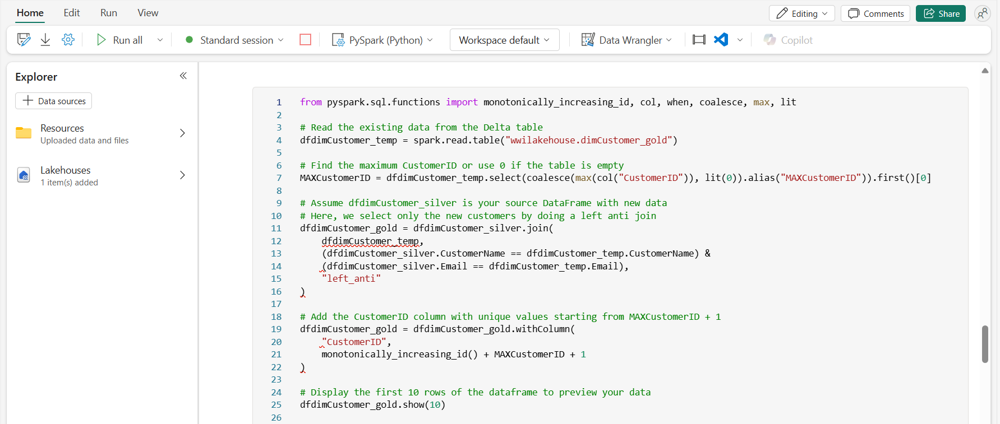

4.  现在，您将确保您的 customer 表在新数据传入时保持最新。 **In a new
    code block**，粘贴并运行以下命令：

> CodeCopy

from delta.tables import DeltaTable

\# Define the Delta table path

deltaTable = DeltaTable.forPath(spark, 'Tables/dimcustomer_gold')

\# Use dfUpdates to refer to the DataFrame with new or updated records

dfUpdates = dfdimCustomer_gold

\# Perform the merge operation to update or insert new records

deltaTable.alias('silver') \\

  .merge(

    dfUpdates.alias('updates'),

    'silver.CustomerName = updates.CustomerName AND silver.Email =
updates.Email'

  ) \\

  .whenMatchedUpdate(set =

    {

      "CustomerName": "updates.CustomerName",

      "Email": "updates.Email",

      "First": "updates.First",

      "Last": "updates.Last",

      "CustomerID": "updates.CustomerID"

    }

  ) \\

  .whenNotMatchedInsert(values =

    {

      "CustomerName": "updates.CustomerName",

      "Email": "updates.Email",

      "First": "updates.First",

      "Last": "updates.Last",

      "CustomerID": "updates.CustomerID"

    }

  ) \\

  .execute()

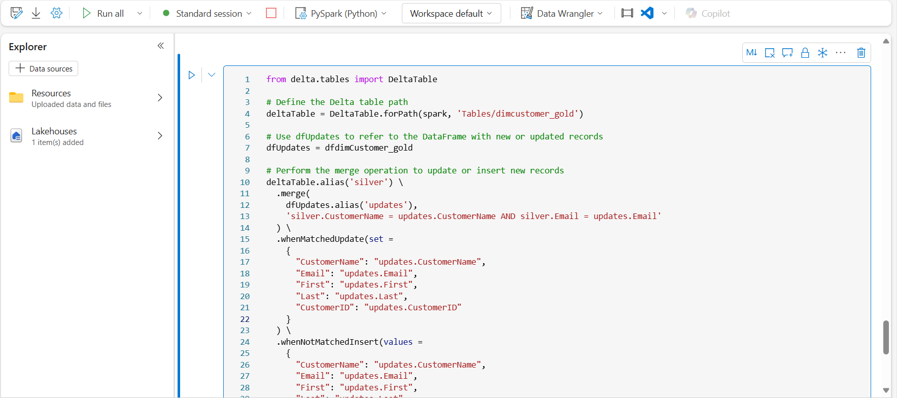

5.  现在，您将**repeat those steps to create your product
    dimension**。在新代码块中，粘贴并运行以下命令：

> CodeCopy
>
> from pyspark.sql.types import \*
>
> from delta.tables import \*
>
> DeltaTable.createIfNotExists(spark) \\
>
> .tableName("wwilakehouse.dimproduct_gold") \\
>
> .addColumn("ItemName", StringType()) \\
>
> .addColumn("ItemID", LongType()) \\
>
> .addColumn("ItemInfo", StringType()) \\
>
> .execute()

6.  **Add another code block **以创建 **product_silver** DataFrame。

> CodeCopy
>
> from pyspark.sql.functions import col, split, lit
>
> \# Create product_silver dataframe
>
> dfdimProduct_silver =
> df.dropDuplicates(\["Item"\]).select(col("Item")) \\
>
> .withColumn("ItemName",split(col("Item"), ", ").getItem(0)) \\
>
> .withColumn("ItemInfo",when((split(col("Item"), ",
> ").getItem(1).isNull() | (split(col("Item"), ",
> ").getItem(1)=="")),lit("")).otherwise(split(col("Item"), ",
> ").getItem(1)))
>
> \# Display the first 10 rows of the dataframe to preview your data
>
> display(dfdimProduct_silver.head(10))

7.  现在，您将为 **dimProduct_gold table** 创建
    ID。将以下语法添加到新的代码块并运行它：

CodeCopy

from pyspark.sql.functions import monotonically_increasing_id, col, lit,
max, coalesce

\#dfdimProduct_temp = dfdimProduct_silver

dfdimProduct_temp = spark.read.table("wwilakehouse.dimProduct_gold")

MAXProductID =
dfdimProduct_temp.select(coalesce(max(col("ItemID")),lit(0)).alias("MAXItemID")).first()\[0\]

dfdimProduct_gold =
dfdimProduct_silver.join(dfdimProduct_temp,(dfdimProduct_silver.ItemName
== dfdimProduct_temp.ItemName) & (dfdimProduct_silver.ItemInfo ==
dfdimProduct_temp.ItemInfo), "left_anti")

dfdimProduct_gold =
dfdimProduct_gold.withColumn("ItemID",monotonically_increasing_id() +
MAXProductID + 1)

\# Display the first 10 rows of the dataframe to preview your data

display(dfdimProduct_gold.head(10))

这将根据表中的当前数据计算下一个可用的产品 ID，将这些新 ID
分配给产品，然后显示更新的产品信息。

8.  与对其他维度执行的作类似，您需要确保 product
    表在新数据传入时保持最新。 **In a new code
    block**，粘贴并运行以下命令：

CodeCopy

from delta.tables import \*

deltaTable = DeltaTable.forPath(spark, 'Tables/dimproduct_gold')

dfUpdates = dfdimProduct_gold

deltaTable.alias('silver') \\

.merge(

dfUpdates.alias('updates'),

'silver.ItemName = updates.ItemName AND silver.ItemInfo =
updates.ItemInfo'

) \\

.whenMatchedUpdate(set =

{

}

) \\

.whenNotMatchedInsert(values =

{

"ItemName": "updates.ItemName",

"ItemInfo": "updates.ItemInfo",

"ItemID": "updates.ItemID"

}

) \\

.execute()

**现在，您已经构建了维度，最后一步是创建事实数据表。**

9.  **In a new code block**，粘贴并运行以下代码以创建 **fact table**：

> CodeCopy
>
> from pyspark.sql.types import \*
>
> from delta.tables import \*
>
> DeltaTable.createIfNotExists(spark) \\
>
> .tableName("wwilakehouse.factsales_gold") \\
>
> .addColumn("CustomerID", LongType()) \\
>
> .addColumn("ItemID", LongType()) \\
>
> .addColumn("OrderDate", DateType()) \\
>
> .addColumn("Quantity", IntegerType()) \\
>
> .addColumn("UnitPrice", FloatType()) \\
>
> .addColumn("Tax", FloatType()) \\
>
> .execute()

10. **In a new code block**，粘贴并运行以下代码以创建新的 **new
    dataframe**，以将销售数据与客户和产品信息（包括客户 ID、商品
    ID、订单日期、数量、单价和税）合并：

CodeCopy

from pyspark.sql import SparkSession

from pyspark.sql.functions import split, col, when, lit

from pyspark.sql.types import StructType, StructField, StringType,
IntegerType, DateType, FloatType, BooleanType, TimestampType

\# Initialize Spark session

spark = SparkSession.builder \\

    .appName("DeltaTableUpsert") \\

    .config("spark.sql.extensions",
"io.delta.sql.DeltaSparkSessionExtension") \\

    .config("spark.sql.catalog.spark_catalog",
"org.apache.spark.sql.delta.catalog.DeltaCatalog") \\

    .getOrCreate()

\# Define the schema for the sales_silver table

silver_table_schema = StructType(\[

    StructField("SalesOrderNumber", StringType(), True),

    StructField("SalesOrderLineNumber", IntegerType(), True),

    StructField("OrderDate", DateType(), True),

    StructField("CustomerName", StringType(), True),

    StructField("Email", StringType(), True),

    StructField("Item", StringType(), True),

    StructField("Quantity", IntegerType(), True),

    StructField("UnitPrice", FloatType(), True),

    StructField("Tax", FloatType(), True),

    StructField("FileName", StringType(), True),

    StructField("IsFlagged", BooleanType(), True),

    StructField("CreatedTS", TimestampType(), True),

    StructField("ModifiedTS", TimestampType(), True)

\])

\# Define the path to the Delta table (ensure this path is correct)

delta_table_path =
"abfss://\<container\>@\<storage-account\>.dfs.core.windows.net/path/to/wwilakehouse/sales_silver"

\# Create a DataFrame with the defined schema

empty_df = spark.createDataFrame(\[\], silver_table_schema)

\# Register the Delta table in the Metastore

spark.sql(f"""

    CREATE TABLE IF NOT EXISTS wwilakehouse.sales_silver

    USING DELTA

    LOCATION '{delta_table_path}'

""")

\# Load data into DataFrame

df = spark.read.table("wwilakehouse.sales_silver")

\# Perform transformations on df

df = df.withColumn("ItemName", split(col("Item"), ", ").getItem(0)) \\

    .withColumn("ItemInfo", when(

        (split(col("Item"), ", ").getItem(1).isNull()) |
(split(col("Item"), ", ").getItem(1) == ""),

        lit("")

    ).otherwise(split(col("Item"), ", ").getItem(1)))

\# Load additional DataFrames for joins

dfdimCustomer_temp = spark.read.table("wwilakehouse.dimCustomer_gold")

dfdimProduct_temp = spark.read.table("wwilakehouse.dimProduct_gold")

\# Create Sales_gold dataframe

dffactSales_gold = df.alias("df1").join(dfdimCustomer_temp.alias("df2"),
(df.CustomerName == dfdimCustomer_temp.CustomerName) & (df.Email ==
dfdimCustomer_temp.Email), "left") \\

    .join(dfdimProduct_temp.alias("df3"), (df.ItemName ==
dfdimProduct_temp.ItemName) & (df.ItemInfo ==
dfdimProduct_temp.ItemInfo), "left") \\

    .select(

        col("df2.CustomerID"),

        col("df3.ItemID"),

        col("df1.OrderDate"),

        col("df1.Quantity"),

        col("df1.UnitPrice"),

        col("df1.Tax")

    ).orderBy(col("df1.OrderDate"), col("df2.CustomerID"),
col("df3.ItemID"))

\# Show the result

dffactSales_gold.show()

11. 现在，您将通过在 **new code block**
    中运行以下代码来确保销售数据保持最新：

> CodeCopy
>
> from delta.tables import \*
>
> deltaTable = DeltaTable.forPath(spark, 'Tables/factsales_gold')
>
> dfUpdates = dffactSales_gold
>
> deltaTable.alias('silver') \\
>
> .merge(
>
> dfUpdates.alias('updates'),
>
> 'silver.OrderDate = updates.OrderDate AND silver.CustomerID =
> updates.CustomerID AND silver.ItemID = updates.ItemID'
>
> ) \\
>
> .whenMatchedUpdate(set =
>
> {
>
> }
>
> ) \\
>
> .whenNotMatchedInsert(values =
>
> {
>
> "CustomerID": "updates.CustomerID",
>
> "ItemID": "updates.ItemID",
>
> "OrderDate": "updates.OrderDate",
>
> "Quantity": "updates.Quantity",
>
> "UnitPrice": "updates.UnitPrice",
>
> "Tax": "updates.Tax"
>
> }
>
> ) \\
>
> .execute()

在这里，你将使用 Delta Lake 的合并作来同步和更新 factsales_gold
表，其中包含新的销售数据
（dffactSales_gold）。该作将比较现有数据（银色表）和新数据（更新
DataFrame）之间的订单日期、客户 ID 和商品
ID，并根据需要更新匹配记录并插入新记录。

现在，您拥有了一个经过整理的建模 **gold** 层，可用于报告和分析。

# 练习 4：在 Azure Databricks 和 Azure Data Lake Storage （ADLS） Gen 2 之间建立连接

现在，让我们在 Azure Data Lake Storage （ADLS） Gen2 帐户的帮助下使用
Azure Databricks 创建一个 Delta 表。然后，您将在 ADLS 中创建指向 Delta
表的 OneLake 快捷方式，并使用 Power BI 通过 ADLS 快捷方式分析数据。

## **任务 0：兑换 Azure 通行证并启用 Azure 订阅**

1.  浏览以下链接 ！！https://www.microsoftazurepass.com/！！并单击
    **Start** 按钮。

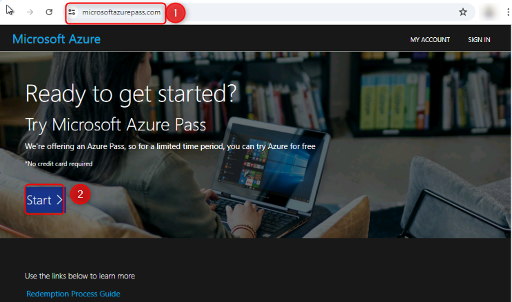

2.  在 Microsoft 登录页面上，输入 **Tenant ID,，**然后单击 **Next**。

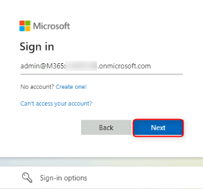

3.  在下一页上，输入您的密码，然后单击 **Sign In**。

4.  登录后，在 Microsoft Azure 页面上，单击 **Confirm Microsoft
    Account** 选项卡。

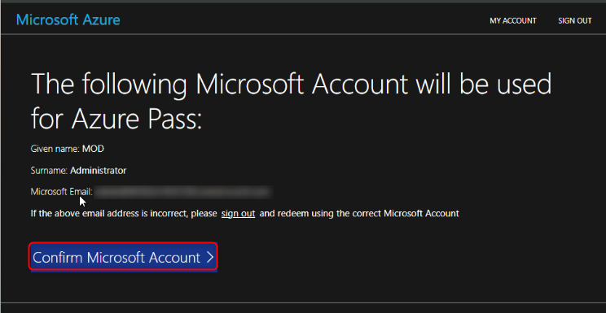

5.  在下一页上，输入促销代码、Captcha 字符，然后单击 **Submit。**

6.  在 Your profile （您的个人资料）
    页面上，输入您的个人资料详细信息，然后单击 **Sign up。**

7.  如果出现提示，请注册多重身份验证，然后通过导航到以下链接登录到 Azure
    门户 !! <https://portal.azure.com/#home>!!

8.  在搜索栏上，键入 订阅 ，然后单击 Services下的 订阅 图标 **。**

9.  成功兑换 Azure Pass 后，将生成订阅 ID。

## **任务 1：创建 Azure Data Storage 帐户**

1.  使用 Azure 凭据登录到 Azure 门户。

2.  在主页上，从左侧门户菜单中选择 **storage accounts**
    以显示存储帐户列表。如果门户菜单不可见，请选择菜单按钮将其打开。

3.  在 **Storage accounts** 页面上，选择 **Create** 。

4.  在 Basics （基本信息）
    选项卡上，选择资源组后，提供存储帐户的基本信息:

[TABLE]

将其他设置保留原样，然后选择 **Review + create**
接受默认选项，然后继续验证和创建帐户。

注意：如果尚未创建资源组，可以单击“**Create
new**”，然后为存储帐户创建新资源。

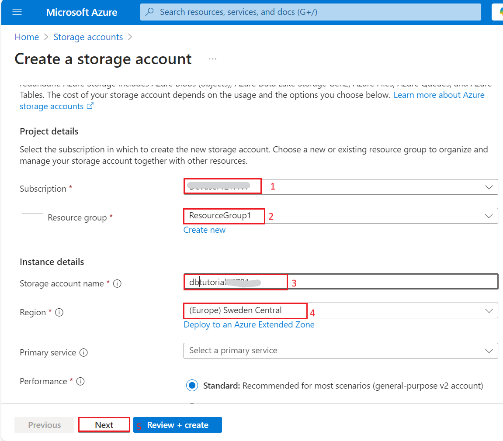

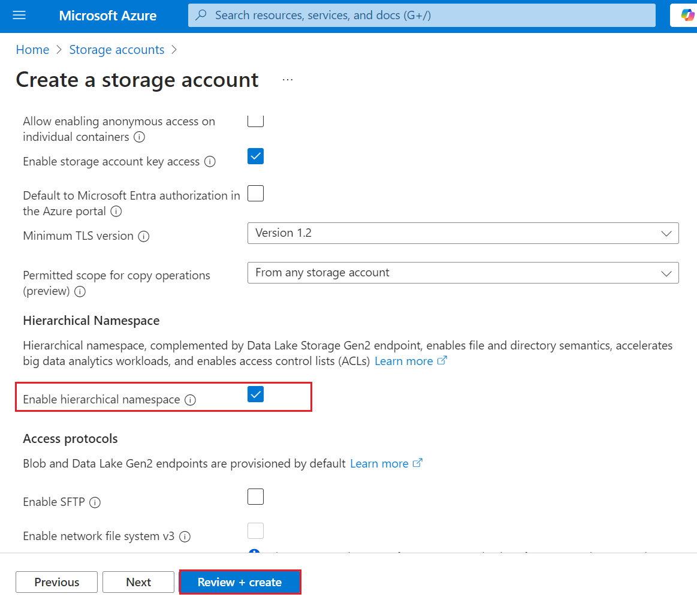

5.  导航到 **Review + create** 选项卡时，Azure
    会对所选的存储帐户设置运行验证。如果验证通过，则可以继续创建存储帐户。

如果验证失败，则门户会指示需要修改哪些设置。

现在，您已成功创建 Azure 数据存储帐户。

6.  通过搜索页面顶部的搜索栏导航到存储帐户页面，选择新创建的存储帐户。

7.  在存储帐户页面上，导航到左侧导航窗格中**Data storage**下的
    **Containers**，创建一个名称为 ！！medalion1！！并单击 **Create**
    按钮。

 

8.  现在导航回 **storage account**页面，从 左侧导航菜单中选择
    **Endpoints** 。向下滚动并复制 **Primary endpoint URL**
    并将其粘贴到记事本上。这在创建快捷方式时会很有帮助。

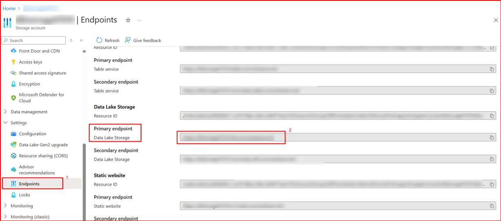

9.  同样，导航到同一导航面板上的 **Access keys**。

## **任务 2：创建 Delta 表，创建快捷方式，并分析 Lakehouse 中的数据**

1.  在 Lakehouse 中，选择省略号 **（...）** ，然后选择 **New
    shortcut**。

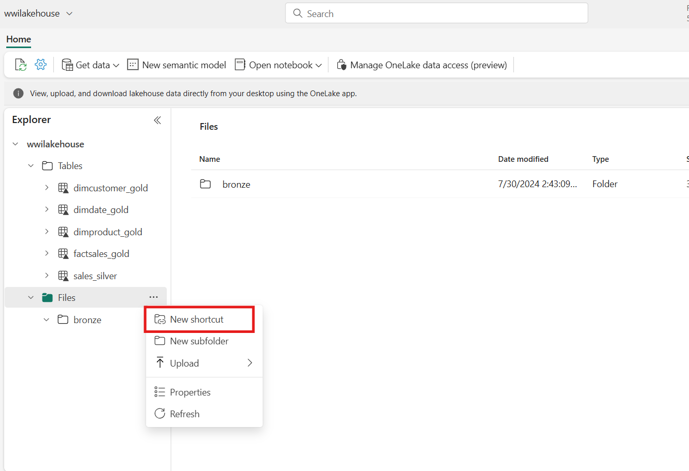

2.  在 **New shortcut** 屏幕中，选择“**Azure Data Lake Storage
    Gen2**”磁贴。

3.  指定快捷方式的连接详细信息：

[TABLE]

4.  然后点击 **Next** 。

5.  这将与您的 Azure 存储容器建立链接。选择存储，然后选择 **Next**
    按钮。

6.  启动向导后，选择 **Files** 并选择 **“...“** 在 **bronze** 档案上。

7.  选择 **Load to tables** 和 **New table** 。

8.  在弹出窗口中，将表的名称设置为 **bronze_01** 并选择文件类型作为
    **parquet**。

9.  文件 **bronze_01** 现在在文件中可见。

10. 接下来，选择 **“...“** 在 **bronze** 档案上。选择 **Load to tables**
    和 **existing table。**

11. 提供现有表名作为 **dimcustomer_gold。** 选择文件类型作为
    **parquet**，然后选择 **load。**

## **任务 3：创建语义模型使用黄金层创建报告**

在您的工作区中，您现在可以使用黄金层创建报表并分析数据。您可以直接在工作区中访问语义模型，以创建用于报告的关系和度量。

*请注意，您不能使用 在创建 Lakehouse 时自动创建的 **default semantic
model **。您必须从 Lakehouse Explorer
创建一个新的语义模型，其中包含您在此实验室中创建的黄金表。*

1.  在您的工作区中，导航到您的 **wwilakehouse** Lakehouse。然后从
    Lakehouse Explorer 视图的功能区中选择 **New semantic model**。

2.  在弹出窗口中，将名称 **DatabricksTutorial**
    分配给新的语义模型，然后选择工作区作为 **Fabric Lakehouse
    Tutorial-29**。

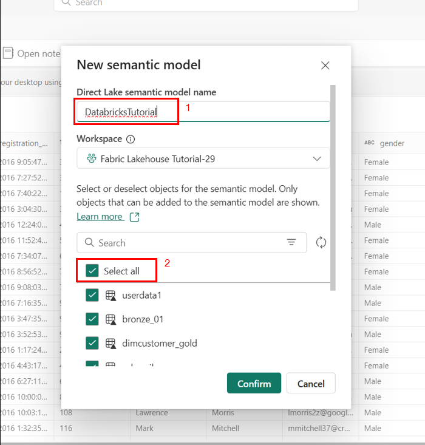

3.  接下来，向下滚动并选择 all to include in your semantic
    model，然后选择 **Confirm**。

这将在 Fabric 中打开语义模型，您可以在其中创建关系和度量，如下所示：

在这里，您或您的数据团队的其他成员可以根据 Lakehouse
中的数据创建报告和控制面板。这些报告将直接连接到 Lakehouse
的黄金层，因此它们将始终反映最新数据。

# 练习 5：使用 Azure Databricks 引入数据和分析

1.  导航到 Power BI 服务中的 Lakehouse，选择 **Get data**，然后选择
    **New data pipeline**

2.  在 **New Pipeline** 提示符中，输入新管道的名称，然后选择 **Create**
    。 **IngestDatapipeline01**

3.  在本练习中，选择 **NYC Taxi - Green** 样本数据作为数据源。

4.  在预览屏幕上，选择 **Next**。

5.  对于 data destination，选择要用于存储 OneLake Delta
    表数据的表的名称。您可以选择现有表或创建新表。对于此实验室，请选择
    **Load into new table**，然后选择 **Next**。

6.  在 **Review + Save** 屏幕上，选择 ** Start data transfer
    immediately**，然后选择 **Save + Run**。

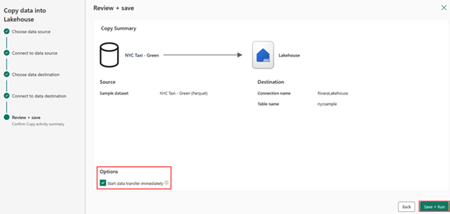

7.  作业完成后，导航到您的 Lakehouse 并查看 /Tables 下列出的增量表。

8.  通过右键单击资源管理器视图中的表名称并选择 **Properties**，将 Azure
    Blob 文件系统 （ABFS） 路径复制到增量表。

9.  打开 Azure Databricks 笔记本并运行代码。

olsPath = "**abfss://\<replace with workspace
name\>@onelake.dfs.fabric.microsoft.com/\<replace with item
name\>.Lakehouse/Tables/nycsample**"

df=spark.read.format('delta').option("inferSchema","true").load(olsPath)

df.show(5)

*注意：将粗体文件路径替换为您复制的文件路径。*

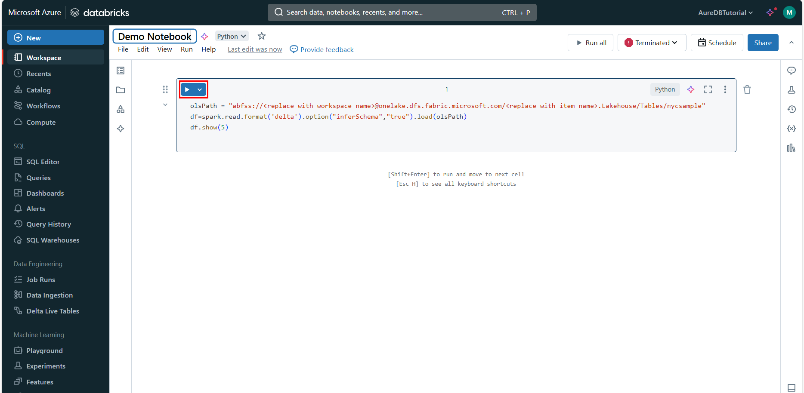

10. 通过更改字段值来更新 Delta 表数据。

%sql

update delta.\`abfss://\<replace with workspace
name\>@onelake.dfs.fabric.microsoft.com/\<replace with item
name\>.Lakehouse/Tables/nycsample\` set vendorID = 99999 where vendorID
= 1;

*注意：将粗体文件路径替换为您复制的文件路径。*

# 练习 6：清理资源

在本练习中，您学习了如何在 Microsoft Fabric Lakehouse
中创建奖章体系结构。

如果您已完成对 Lakehouse 的探索，则可以删除为本练习创建的工作区。

1.  从左侧导航菜单中选择您的工作区 **Fabric Lakehouse
    Tutorial-29**。此时将打开工作区项视图。

2.  选择 ***...*** 选项，然后选择 **Workspace settings**。

3.  向下滚动到底部，然后 **Remove this workspace.**

4.  点击 **Delete** 在弹出的警告中。

5.  等待工作区已删除的通知，然后再继续进行下一个实验。

**摘要**：

此实验室指导参与者使用笔记本在 Microsoft Fabric Lakehouse
中构建奖章体系结构。关键步骤包括设置工作区、建立湖仓一体、将数据上传到青铜层以进行初始摄取、将其转换为银版
Delta 表以进行结构化处理、进一步细化为黄金 Delta
表以进行高级分析、探索语义模型以及创建数据关系以进行深入分析。

## 
